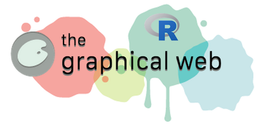
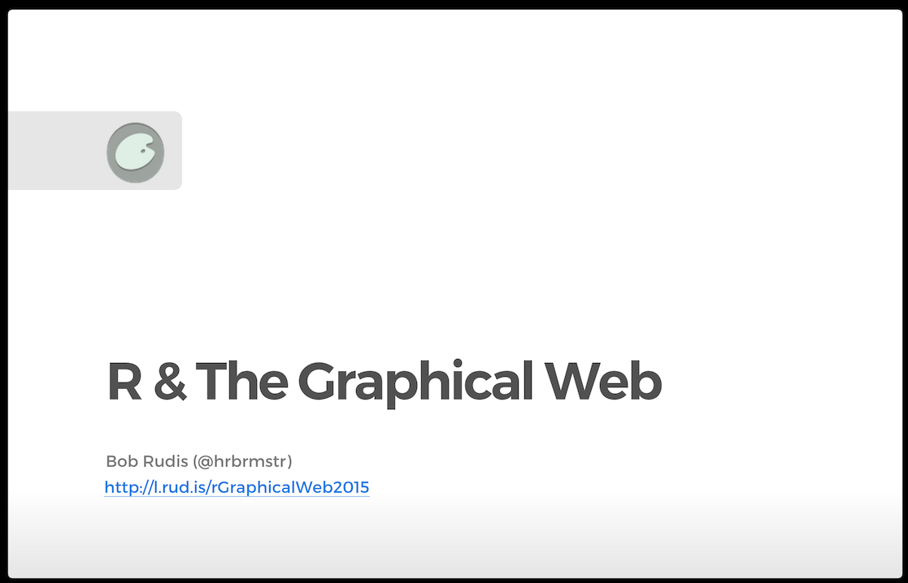

<b>Materials for the workshop</b> <i>R & The Graphical Web</i> <b>at [The Graphical Web 2015](https://www.graphicalweb.org/2015/) conference.</b>

On Saturday, September 26th, I had the privilege to conduct a 3 hour workshop on <emph>R & The Graphcial Web</a> conference. This repo contains all the materials used to make the presentation.

The ioslides presentation has presenter notes peppered throughout various pages. Dual-screen view it or hit "`p`" on a slide to see if there are any. 

The [widgety](widgety) directory contains a simple expanded `htmlwidget` that builds a customizable D3 circle that was used in the second half of the workshop.

You can skip (or augment) a `git clone` & just view the pre-built (usuing R!) ioslides presentation:

