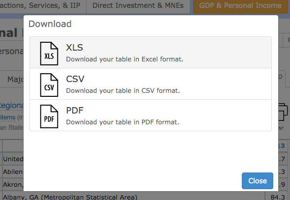

```{r setup, include=FALSE}
library(knitr)
library(rgl)
knitr::opts_chunk$set(echo = FALSE,
                      message = FALSE,
                      warning = FALSE,
                      error = FALSE)
knit_hooks$set(webgl = hook_webgl)
```

# Who Am I?

## {.flexbox .vcenter}

<http://dds.ec/> (blog, podcast and…)


## {.flexbox .vcenter}

Authored/contributed to 12 CRAN packages


## Where Am I? { .nobackground }

- <http://rud.is/b> Less infosec, more R & vis
- <http://twitter.com/hrbrmstr>
- <http://github.com/hrbrmstr>
- <http://stackoverflow.com/users/1457051/hrbrmstr>
- <bob@rudis.net> (if you like waiting for responses)

## How You May View R

<div class="notes">
ASK: How many of you are familiar with R (heard of it/used it)?

I suspect that for those who have only heard about it this may be your view of R.
</div>

```{r view1, echo=TRUE}
head(pressure, 3)

summary(pressure)
```

## How You May View R
<div class="notes">
or this
</div>

```{r pressure}
library(magrittr)
library(htmlwidgets)
library(htmltools)
library(lubridate) 
library(stringr)
library(jsonlite)
library(scales)
library(ggvis)
plot(pressure)
```

## How [I Hope] You Will View R  {.flexbox .vcenter}
<div class="notes">
After this workshop, this is how I hope you view R. As something that can help you make this.

MOVE IT AROUND
</div>

```{r three1}
library(threejs)
z <- seq(-10, 10, 0.01)
x <- cos(z)
y <- sin(z)
scatterplot3js(x,y,z, color=rainbow(length(z)))
```

## 
<div class="notes">
(with one line of code)
</div>

```{r three2, eval=FALSE, echo=TRUE}
z <- seq(-10, 10, 0.01)
scatterplot3js(cos(z), sin(z), z, color=rainbow(length(z)))
```

## How [I Hope] You Will View R  {.flexbox .vcenter}
<div class="notes">
Or this

DRAG A FEW NODES
</div>

```{r net1}
library(networkD3)
data(MisLinks, MisNodes)
forceNetwork(Links = MisLinks, Nodes = MisNodes, Source = "source",
             Target = "target", Value = "value", NodeID = "name",
             Group = "group", opacity = 0.4)
```

## 
<div class="notes">
with one line function call
</div>

```{r net2, eval=FALSE, echo=TRUE}
forceNetwork(Links = MisLinks, Nodes = MisNodes, Source = "source",
             Target = "target", Value = "value", NodeID = "name",
             Group = "group", opacity = 0.4)
```

##  {.flexbox .vcenter}
<div class="notes">
or even this

DRAG GLOBE AROUND
</div>

```{r globe1}
data(flights)
dest <- factor(sprintf("%.2f:%.2f",flights[,3], flights[,4]))
freq <- sort(table(dest), decreasing=TRUE)
frequent_destinations <- names(freq)[1:10]
idx <- dest %in% frequent_destinations
frequent_flights <- flights[idx, ]
latlong <- unique(frequent_flights[,3:4])
earth <- system.file("images/world.jpg",  package="threejs")
globejs(img=earth, lat=latlong[,1], long=latlong[,2], arcs=frequent_flights,
        arcsHeight=0.3, arcsLwd=2, arcsColor="#ffff00", arcsOpacity=0.15,
        atmosphere=TRUE)
```

##
<div class="notes">
OK, so that took 8 instructions.
</div>

```{r globe2, echo=TRUE, eval=FALSE}
dest <- factor(sprintf("%.2f:%.2f",flights[,3], flights[,4]))
freq <- sort(table(dest), decreasing=TRUE)
frequent_destinations <- names(freq)[1:10]
idx <- dest %in% frequent_destinations
frequent_flights <- flights[idx, ]
latlong <- unique(frequent_flights[,3:4])
earth <- system.file("images/world.jpg",  package="threejs")
globejs(img=earth, lat=latlong[,1], long=latlong[,2], 
        arcs=frequent_flights, arcsHeight=0.3, arcsLwd=2, 
        arcsColor="#ffff00", arcsOpacity=0.15, atmosphere=TRUE)
```

# What is R?

## What is R?
<div class="notes">
Besides being a truly awesome letter of the alphabet (my formal initials are RR), R has a myriad of uses.
Yes, it's a programming language, but it was made by stats nerds, so it's _really_ good at stats. But those
stats nerds needed good ways to see and present the data, so R is also _really_ good at static visualiztions. And,
all those folks hung out on GeoCities and the BLINK tag, so they naturally wanted to make sure R could keep up with 
all the cool kids using these modern web visualization frameworks. Plus, R has a vibrant community (Stack Overflow, Twitter, mailing lists, GitHub, etc.)
</div>
<div class="columns-2">
- R is a programming language
- R is statistical software
- R is an environment for interactive data analysis+visualization
- R is a community <br/>


</div>

## What is R's Relationship with TGW?  {.flexbox .vcenter}
<div class="notes">
R made those SVG ovals and this entire HTML presentation, btw
</div>
```{r dgrm1, results="asis"}

library(htmlwidgets)
library(DiagrammeR)
nodes <- create_nodes(nodes=c("Acquire", "Transform", "Analyze", "Visualize"),
                      style="filled",
                      fontname="Montserrat",
                      penwidth=0.5,
                      color="#7f7f7f",
                      fillcolor=c("#7fc97f", "#beaed4", "#fdc086", "#ffff99"))
cat(render_graph(create_graph(nodes), output="SVG", width=900, height=200))
```

<br/>

- R can help you **access/acquire, clean and reformat data**
- R lets you **statistically analyze** data to find **insights**
- R enables **rapid, iterative protyping** of visualizations to help **communicate** those insights
- R helps make those steps **organized** and **repeatable/reproducible**

## {.flexbox .vcenter}
<div class="notes">
I view R as both a consumer of the elements that go into the graphical web (i.e. data)
</div>


## {.flexbox .vcenter}
<div class="notes">
and a producer of the graphical web
</div>


## Getting Started with R {.flexbox .vcenter}
<div class="notes">
Do not let this 1990's era web page fool you. R's _really_ good at decorating HTML!

Go to the url and grab R for your platform and install it. There are hundreds of mirrors, but RStudio has a really fast one and they are super awesome to the community.
</div>
<http://cran.rstudio.com>


## Getting Started with R/RStudio {.flexbox .vcenter}
<div class="notes">
RStudio is an IDE for R. It's actually just an app wrapper around a webkit application (yes the entire IDE is just webkit components) and uses
the ACE editor. R is completely usable without RStudio. 
</div>

<https://www.rstudio.com/products/rstudio/download/>


## {.flexbox .vcenter}
<div class="notes">
Think of RStudio as R's "bacon" (it makes everyting better with R)
</div>


## RStudio {.flexbox .vcenter}
<div class="notes">
Rather than have to jerry rig a REPL connection with an editor like Sublime Text / vim / emacs or cut/paste code, you have a full environment with a syntax-aware editor (and data-context-aware editor), built-in browser & graphics viewer and an instant feedback console for when you are working with code. Since it's based on ACE, it also recognizes and formats HTML, JavaScript, CSS, and Markdown.
</div>


## RStudio {.flexbox .vcenter}
<div class="notes">
It also has a built-in data and environment viewer, so you can see the structure of what you're working with and what data you've already processed.
</div>


## R is Familiar
<div class="notes">
I can't teach you R in a 1.5hr session, but I can hopefully give you enough of a taste to get you excited to learn it. While there are definitely some idiosyncratic things about R, it (should) seem familiar to you. It is dynamic (so you can just "start working" in it without worrying about compilers and such), it has variables, functions and extra pacakges to make working with the "world" easier.
</div>
- Dynamic (like JavaScript & Python)
- Has variables  (like JavaScript & Python)
- …functions (like JavaScript & Python)
- …loops (like JavaScript & Python)
- …regular expressions (like JavaScript & Python)
- …and, help from friends (packages) (like Node or Python modules)

## R is Different

It's "vectorized" (think `map()` or `[ for ]`)

```{r echo=TRUE}
a <- 1:10
sum(a)
```


## R is Different
<div class="notes">
Data frames are akin to Excel/Google spreadsheets, just without the baggage
</div>
It _really_ likes something called "data frames" (Python does too, now)

```{r echo=TRUE}
head(iris)
```

## R is Different

It has an affintity for arcane punctuation:

```{r echo=TRUE}
`huh? 💥` <- iris$Sepal.Length[[2]] / iris[2,1] * 3 %>% sqrt()
print(`huh? 💥`)
```

## R is Different
<div class="notes">
But it's worth suffering through the period where R rewrites your neural pathways! Every language has a learning curve. R's learning curve may be a bit higher (for some things) but you've already seen that you can do pretty amazing things with just one function call, so it is absolutely worth the journey.
</div>
And, complex+efficient algorithms can be confusing:

```{r echo=TRUE}
dat <- readLines(textConnection(" 3   weeks,   2  days,  4 hours
 4 week,  6 days,  12 hours 
4 day, 3 hours
 7 hours
8  hour"))

sapply(str_split(str_trim(dat), ",[ ]*"), function(x) {
  sum(sapply(x, function(y) {
    bits <- str_split(str_trim(y), "[ ]+")[[1]]
    duration(as.numeric(bits[1]), bits[2])
  })) / 3600
})
```

## R & The Graphical Web
<div class="notes">
R can be part of your graphical web workflow even without delving into fancy HTML & JavaScript libraries/packages. This is a graphic generated with the ggplot2 package which we've told R we want to use via the "library" call. The "gg" stands for Grammar of Graphics (Wikinson) and is just a structured way of creating (statistical) graphics. "mtcars" is a built-in data set in R and has data about cars (era 1973/4). It's great for demos. Here we've plotted car weight vs miles per gallon and added a smoothed line to help us understand the relationship between them better. We create the chart, assign it to a variable and then show it.
</div>

```{r ggsvg1, echo=TRUE}
library(ggplot2)
g1 <- ggplot(mtcars, aes(x=wt, y=mpg)) + geom_smooth() + geom_point()
print(g1)
```

##
This is all it takes to turn that plot into an editable/usable SVG graphic:

```{r eval=FALSE, echo=TRUE}
ggsave(g1, "img/g1.svg")
```


##

    <?xml version="1.0" encoding="UTF-8"?>
    <svg xmlns="http://www.w3.org/2000/svg" 
         xmlns:xlink="http://www.w3.org/1999/xlink"
        width="819pt" height="425pt" 
        viewBox="0 0 819 425" version="1.1">
    <defs>
    <g>
    <symbol overflow="visible" id="glyph0-0">
    <path style="stroke:none;" 
          d="M 0.3125 0 L 0.3125 -6.875 L 5.765625 -6.875 L 5.765625 0 Z M 4.90625 -0.859375 L 4.90625 -6.015625 L 1.171875 -6.015625 L 1.171875 -0.859375 Z "/>
    </symbol>
    <symbol overflow="visible" id="glyph0-1">
    <path style="stroke:none;" 
          d="M 0.921875 -4.75 L 0.921875 -5.390625 C 1.523438 -5.453125 1.945312 -5.550781 2.1875 -5.6875 C 2.425781 -5.832031 2.609375 -6.164062 2.734375 -6.6875 L 3.390625 -6.6875 L 3.390625 0 L 2.5 0 L 2.5 -4.75 Z "/>

##
<div class="notes">
ggplot can be used   to highly customze/stylize the aesthetics of a plot before exporting it, so it can save you alot of time if you create scripted workflows to generate SVGs.
</div>

```{r ggsvg2, echo=TRUE}
library(ggthemes)
g1 + theme_economist()
```

##

```{r ggsvg3, echo=TRUE}
library(xkcd)
g1 + theme_xkcd()
```


##
<div class="notes">
Or, if you have to stick it on an enterprise intranet site…
</div>
```{r ggsvg4, echo=TRUE}
g1 + theme_excel()
```

# Doing Real Work

## Doing Real Work  {.flexbox .vcenter}
<div class="notes">
We rarely have the opportunity to work with pristene, built-in data sets like those examples. Plus, while you may have need to generate static SVGs for your web workflows, the "graphical web" cries out for interactivity. Let's work though a complete example of R helping us get data from the web, crunch it so we can use it and display it interactively. One common task for this is to present an interactive map to folks. I really like the Pew foundation and follow what they do both research & vis-wise. They had an article up last month on "where paychecks stretch the most/least" and inclued the map you see. Don't get me wrong, it's a good map. But wouldn't it be better if we could zoom in and see discrete information about individual metropolitan areas?
</div>
<http://bit.ly/pewmapdemo+>


## Doing Real Work {.flexbox .vcenter}
Let's find this data!


## Doing Real Work {.flexbox .vcenter}
Let's find this data!


## Doing Real Work {.flexbox .vcenter}
Let's find this data!


## Doing Real Work {.flexbox .vcenter}
Let's find this data!


## Doing Real Work {.flexbox .vcenter}

*Almost done!*


## Doing Real Work {.flexbox .vcenter}
**Done!** *(kinda)*



## Doing Real Work {.flexbox .vcenter}
<div class="notes">
There's "junk" at the beginning and end of this, so we'll have to do some cleanup.
</div>
**Done!** *(kinda)*


##
<div class="notes">
We can automate this cleaning by telling R to skip the first 4 lines and delete the last two lines. The "stringsAsFactors" parameter isn't worth going into now, but it's generally an option you'll always want to use when reading in structured data into R. We can see here that we have 3 columns of data. Column Two "GeoName" has that useless redundant bit so let's get rid of it.
</div>
```{r echo=TRUE}
dat <- read.csv("data/download.csv", skip=4, header=TRUE, stringsAsFactors=FALSE)
dat <- head(dat, -2)
head(dat)
```


##
<div class="notes">
The "GeoFips" column also got read as a number by R. This isn't a bad thing and we could have told R to read it in as-is, but we can convert it just as easily. You'll also notice that R added an X to the column name. That's not completely necessary, but it makes working with the name much easier.
</div>
```{r echo=TRUE}
dat$GeoName <- gsub(" \\(Metropolitan Statistical Area\\)", "", 
                    dat$GeoName)
dat$GeoFips <- sprintf("%05d", as.numeric(dat$GeoFips))
head(dat)
```

## Doing Real Work {.flexbox .vcenter}
<div class="notes">
We're going to pause for a moment. This hasn't been too bad, but what if you realized you also needed 2012 data. And then in a couple weeks someone asked for 2011 data. Going back to the web form again and again is tedious and not productive. If we spend just a bit more time, we'll see that the BEA has a (pretty good) API.
</div>


## Doing Real Work {.flexbox .vcenter}
<div class="notes">
If we register with them and get an API key, we can test out a query for this RPP data. It's a gosh awful URL, though.
</div>

    http://bea.gov/api/data/?UserID=xxxxxx-xxxx-xxxx-xxxx-xxxxxxxx&
    method=GetData&datasetname=RegionalData&KeyCode=RPPALL_MI&
    Year=2013&&ResultFormat=json"


## Doing Real Work
<div class="notes">
We can use fromJSON in the jsonlite package to use that URL directly then navigate down to the actual data element (the $ is like . in javascript & python) and make a numeric column out of the data that R read in as a string. I'm using a different (really creating a new) column name to match what we did with with CSV Reading
</div>

```{r include=FALSE, echo=FALSE}
dat <- fromJSON(sprintf("http://bea.gov/api/data/?UserID=%s&method=GetData&datasetname=RegionalData&KeyCode=RPPALL_MI&Year=2013&&ResultFormat=json", Sys.getenv("BEA_API_TOKEN")))
```

```{r eval=FALSE, echo=TRUE}
library(jsonlite)
dat <- readJSON("that horrible URL")
```
```{r echo=TRUE}
dat <- dat$BEAAPI$Results$Data
dat$X2013 <- as.numeric(dat$DataValue)
dat$GeoName <- gsub(" \\(Metropolitan Statistical Area\\)", "", 
                    dat$GeoName)
dat$GeoFips <- sprintf("%05d", as.numeric(dat$GeoFips))
head(dat[,c(1,2,8)])
```

## Doing Real Work
<div class="notes">
But the fact that the BEA has a structured API means that we can do better than keep a cache of ugly URLs around. R has a package called "httr" that kinda works a bit like the command line curl program or the Python requests module or node request module. By breaking out the URL into components here, we could even create a function or package that works with the BEA data, making it super-easy to get data in the future. You'll also notice I stored the BEA API token in an environment variable. R uses the environment variables on each OS it runs on and augments them with it's own .Renviron file so you can be platform independent in how you set them.
</div>
```{r echo=TRUE}
library(httr)
response <- GET("http://bea.gov/api/data/",
                query=list(
                  UserID=Sys.getenv("BEA_API_TOKEN"),
                  method="GetData",
                  datasetname="RegionalData",
                  KeyCode="RPPALL_MI",
                  Year="2013",
                  ResultFormat="json"
                ))
dat <- fromJSON(content(response, as="text"))
```

## 

Same cleanup as we did in the raw URL version

```{r echo=TRUE}
dat <- dat$BEAAPI$Results$Data
dat$X2013 <- as.numeric(dat$DataValue)
dat$GeoName <- gsub(" \\(Metropolitan Statistical Area\\)", "", 
                    dat$GeoName)
dat$GeoFips <- sprintf("%05d", as.numeric(dat$GeoFips))
head(dat[,c(1,2,8)])
```


## Doing Real Work
<div class="notes">
So we have the data but we have a problem. the BEA uses Census numbers for the metro areas but most of the maps we'd be able to use understand county FIPS codes. We have to convert between them. Luckily there's a package for that. The "noncensus" package gives us the data we need to do the translation.
</div>

```{r echo=TRUE}
library(noncensus)
data(counties)
xlate <- data.frame(fipscounty=sprintf("%s%s", counties$state_fips, 
                                       counties$county_fips), 
                    cbsa=counties$CBSA,
                    stringsAsFactors=FALSE)
dat <- merge(dat[,c(1,2,8)], xlate[,c("cbsa", "fipscounty")], 
             by.x="GeoFips", by.y="cbsa")
head(dat)
```

## Doing Real Work {.flexbox .vcenter}
<div class="notes">
We'll use some map data from a friend of all of us since it's readily available and a single, clean file vs a a complex zipped ESRI shapefile.
</div>


## What's the Plan?

- Display a US map county choropleth with the counties filled according the RPP value
- The counties are not all represented and we don't need a billion small polygons left over so we'll outline the states for context
- We'd like to add contextual information via popup to show the discrete data value and the name of the metro area
- A legend would be good

## Options (without R)
<div class="notes">
We have tons of options in general for doing interactive chropleths in-browser. I've ordered them in my opinion of most to least work. 
</div>

- Raw JS or jQuery + CSS
- Straight D3
- Kartograph
- Datamaps
- Leaflet [Ex: <http://leafletjs.com/examples/choropleth-example.html>] (Perfect data. ~170 lines)

## Getting Work Done : R + Leaflet

Get map data

```{r echo=TRUE}
library(rgdal)
URL <- "http://bl.ocks.org/mbostock/raw/4090846/us.json"
fil <- sprintf("data/%s", basename(URL))
if (!file.exists(fil)) download.file(URL, fil)

# read state borders from the file
states <- readOGR(fil, "states", stringsAsFactors=FALSE, 
                  verbose=FALSE)

# read county borders from the file
county <- readOGR(fil, "counties", stringsAsFactors=FALSE, 
                  verbose=FALSE)
```

## Getting Work Done : R + Leaflet

We don't want to display all the counties, so we'll subtract out the ones that aren't in our data set.

```{r echo=TRUE}
rpp_counties <- subset(county, id %in% dat$fipscounty)
rpp_counties <- merge(rpp_counties, dat, 
                      by.x="id", 
                      by.y="fipscounty", 
                      all.x=TRUE)
```

## Getting Work Done : R + Leaflet

We need to setup the color scale (really similar to how you'd do it in JS)

```{r echo=TRUE}
library(leaflet)
pal <- colorBin("BrBG", range(rpp_counties$X2013), bins=5)
rpp_counties$color <- pal(rpp_counties$X2013)
```

## Getting Work Done : R + Leaflet

```{r echo=TRUE, eval=FALSE}
leaflet() %>%
  addProviderTiles("Acetate.terrain") %>%
  addPolygons(data=rpp_counties, weight=0.25,
              fillColor=~color, color="black", fillOpacity=1,
              popup=~sprintf("In %s, <span style='font-weight:700'>%s</span> has the purchasing power of $100.00.",
                             htmlEscape(GeoName),
                             htmlEscape(dollar(X2013)))) %>%
  addPolygons(data=states, weight=0.5, fillColor="white", fillOpacity=0, fill=FALSE, color="#525252") %>%
  addLegend(position="bottomright", pal=pal, values=rpp_counties$X2013, labFormat=labelFormat("$"), opacity = 1) %>%
  setView(-74.0059, 40.7127, 6)
```
## Where Paychecks Stretch The Most/Least

```{r echo=FALSE}
leaflet() %>%
  addProviderTiles("Acetate.terrain") %>%
  addPolygons(data=rpp_counties, weight=0.25,
              fillColor=~color, color="black", fillOpacity=1,
              popup=~sprintf("In %s, <span style='font-weight:700'>%s</span> has the purchasing power of $100.00.",
                             htmlEscape(GeoName),
                             htmlEscape(dollar(X2013)))) %>%
  addPolygons(data=states, weight=0.5, fillColor="white", fillOpacity=0, fill=FALSE, color="#525252") %>%
  addLegend(position="bottomright", pal=pal, values=rpp_counties$X2013, labFormat=labelFormat("$"), opacity = 1) %>%
  setView(-74.0059, 40.7127, 6)
```

## Doing Real Work {.flexbox .vcenter}

**~170 lines** pure leaflet/javascript

vs 

**~60 lines of R**

…and the R version can be instantly used to get new BEA data sets where the leaflet one "cheated" and merged the data prior to the HTML example.

# A Bit More About Getting Data In

## Getting Data Into R

**General**

- built-in support for CSV/TSV/general delimited & fixed-width
- `readr` / `rio` faster & more robust compatibility
- `readxl` (and others) for raw Excel reading
- `googlesheets`
- `data.table` (large data)
- numerous packages to read statistical data files

## Getting Data Into R

**Web Scraping / API**

- `httr` (like curl command line but better)
- `rvest` (more structured web page scraping)
- `jsonlite` (JSON)
- `XML` / `xml2` (XML)
- `Rselenium` (headless browser & DOM scraping)
- `V8` (the V8 engine in R)

## Getting Data Into R

**Database**

- `dplyr`
- `RPostgreSQL`
- `RMySQL`
- `rredis`
- `mongolite`
- `RSQLite`

## Getting Data Into R

- Almost every useful public API covered
- Virtually every "big data" store including AWS/S3
- If something is missing, complain on Twitter and there'll be a package in a week

# Crunching Stats 

## Real World R : Crunching Stats {.flexbox .vcenter}

<http://www.verizonenterprise.com/DBIR/2015/>


## Real World R : Crunching Stats {.flexbox .vcenter}

**200,000** incidents/breaches

**~3,000** data elements per record

**~150** lines of statistical analysis

## Real World R : Crunching Stats {.flexbox .vcenter}


## Real World R : Crunching Stats {.flexbox .vcenter}

<http://vz-risk.github.io/dbir/2015/19/>

# Getting Data Out of R

## Getting Data Out of R

- files (CSV/JSON/XML)
- database write
- S3 upload
- API "put"

## Getting Data Out of R {.flexbox .vcenter}

OpenCPU


## Getting Data Out of R

- `plumber` <http://plumber.trestletech.com/> (think "Flask")
- `httpuv` <https://github.com/rstudio/httpuv> (basic web & websocket server)


# Getting Data and Visualizations Out of R

## Getting Data and Visualizations Out of R {.flexbox .vcenter}

ggvis

```{r echo=TRUE, eval=FALSE}
library(ggvis)
mtcars %>% ggvis(x = ~wt) %>%
    layer_densities(
      adjust = input_slider(.1, 2, value = 1, step = .1, label = "Bandwidth adjustment"),
      kernel = input_select(
        c("Gaussian" = "gaussian",
          "Epanechnikov" = "epanechnikov",
          "Rectangular" = "rectangular",
          "Triangular" = "triangular",
          "Biweight" = "biweight",
          "Cosine" = "cosine",
          "Optcosine" = "optcosine"),
        label = "Kernel")
    )
```

## Getting Data and Visualizations Out of R {.flexbox .vcenter}

ggvis

```{r echo=FALSE, eval=TRUE}
mtcars %>% ggvis(x = ~wt) %>%
    layer_densities(
      adjust = input_slider(.1, 2, value = 1, step = .1, label = "Bandwidth adjustment"),
      kernel = input_select(
        c("Gaussian" = "gaussian",
          "Epanechnikov" = "epanechnikov",
          "Rectangular" = "rectangular",
          "Triangular" = "triangular",
          "Biweight" = "biweight",
          "Cosine" = "cosine",
          "Optcosine" = "optcosine"),
        label = "Kernel")
    )
```

## Getting Data and Visualizations Out of R {.flexbox .vcenter}

Shiny <http://shiny.rstudio.com/>


<http://shiny.rstudio.com/gallery/movie-explorer.html>

## rgl {.flexbox .vcenter}
<div class="notes">
The rgl packageRGL is a 3D real-time rendering system targeting OpenGL but also supporting other 3D file formats. You use R idioms to build visualizations vs OpenGL code. 
</div>
```{r echo=TRUE, eval=FALSE}
library(rgl)
data(volcano)
z <- 2 * volcano        # Exaggerate the relief
x <- 10 * (1:nrow(z))   # 10 meter spacing (S to N)
y <- 10 * (1:ncol(z))   # 10 meter spacing (E to W)
zlim <- range(y)
zlen <- zlim[2] - zlim[1] + 1
colorlut <- terrain.colors(zlen) # height color lookup table
col <- colorlut[ z - zlim[1] + 1 ] # assign colors to heights for each point
open3d()
surface3d(x, y, z, color = col, back = "lines")
```

## rgl {.flexbox .vcenter}
```{r echo=FALSE, eval=TRUE, webgl=TRUE}
data(volcano)
z <- 2 * volcano        # Exaggerate the relief
x <- 10 * (1:nrow(z))   # 10 meter spacing (S to N)
y <- 10 * (1:ncol(z))   # 10 meter spacing (E to W)
zlim <- range(y)
zlen <- zlim[2] - zlim[1] + 1
colorlut <- terrain.colors(zlen) # height color lookup table
col <- colorlut[ z - zlim[1] + 1 ] # assign colors to heights for each point
suppressMessages(suppressWarnings({ 
  open3d()
  surface3d(x, y, z, color = col, back = "lines")
}))
```

## HTML Widgets
<div class="notes">
The previous technologies require you to have an "R Server" running at all times and much of the interaction still relies on R (with noticeable delays in some cases). HTML "widgets" bridge the gap by letting you create standalone html+js visualiations using R code with no requriement for R to be around when they are viewed/interacted with. The folks at RStudio (along with Kenton Russell) developed the core package that enables building of these widgets.
</div>

- `htmlwidgets` <http://www.htmlwidgets.org/>
- The widget gallery <http://hafen.github.io/htmlwidgetsgallery/> (i've got 3! 😎) 
- You've already seen one! (`leaflet`)

## htmlwidgets
<div class="notes">
One more before we get into the details.
</div>
```{r echo=TRUE, eval=FALSE}
library(taucharts)
data(cars_data)
tauchart(cars_data) %>%
  tau_point("milespergallon", c("class", "price"), color="class") %>%
  tau_trendline() %>% tau_legend()
```

## htmlwidgets {.flexbox .vcenter}
<div class="notes">
One more before we get into the details.
</div>
```{r echo=FALSE}
library(taucharts)
data(cars_data)
tauchart(cars_data, width=700) %>%
  tau_point("milespergallon", c("class", "price"), color="class") %>%
  tau_trendline() %>% tau_legend()
```

## htmlwidgets

- `devtools::create("/path/to/new/package")`
- `setwd("/path/to/new/package")`
- **or use RStudio**
- `htmlwidgets::scaffoldWidget()`

## htmlwidgets

- `devtools::build()`
- `devtools::install()`
- **or use RStudio**

## htmlwidgets

```{r eval=FALSE, echo=TRUE}
library(widgety)
widgety("Hello, world!")
```
