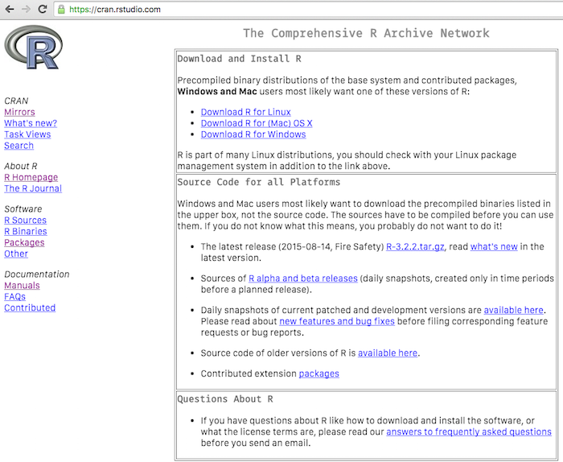
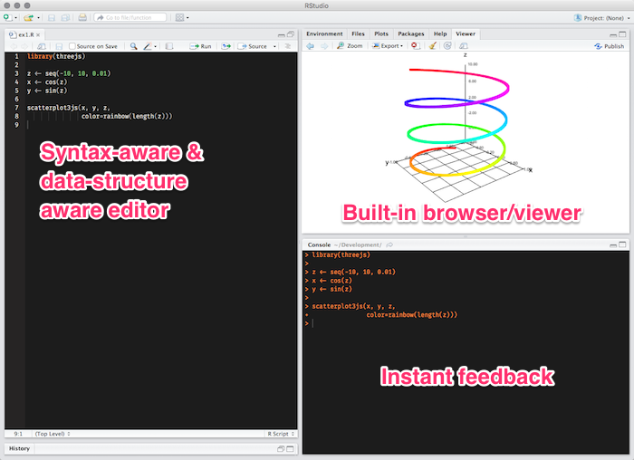
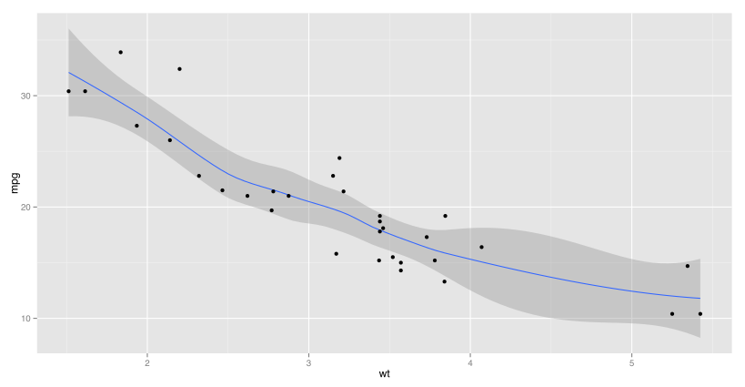
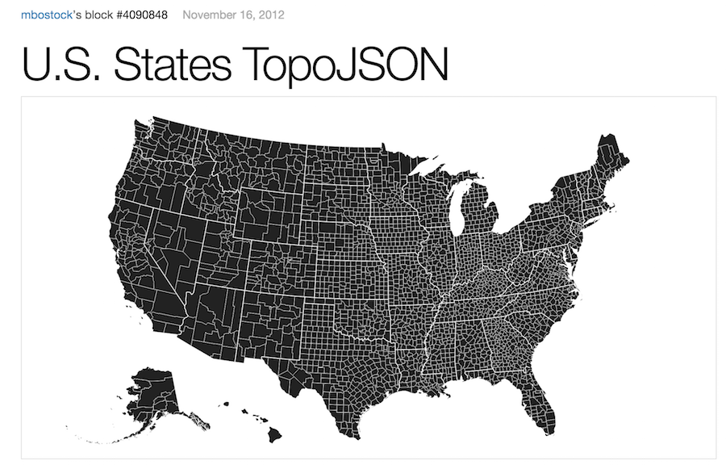
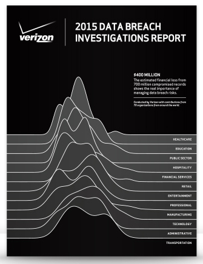

# R & The Graphical Web
Bob Rudis (@hrbrmstr)  


# Who Am I?

## {.flexbox .vcenter}

<http://dds.ec/> (blog, podcast and…)


## {.flexbox .vcenter}

Authored/contributed to 12 CRAN packages


##

- <http://rud.is/b> Less infosec, more R & vis
- <http://twitter.com/hrbrmstr>
- <http://github.com/hrbrmstr>
- <bob@rudis.net> (if you like waiting for responses)

## How You May View R

<div class="notes">
ASK: How many of you are familiar with R (heard of it/used it)?

I suspect that for those who have only heard about it this may be your view of R.
</div>


```r
head(pressure, 3)
```

```
##   temperature pressure
## 1           0   0.0002
## 2          20   0.0012
## 3          40   0.0060
```

```r
summary(pressure)
```

```
##   temperature     pressure       
##  Min.   :  0   Min.   :  0.0002  
##  1st Qu.: 90   1st Qu.:  0.1800  
##  Median :180   Median :  8.8000  
##  Mean   :180   Mean   :124.3367  
##  3rd Qu.:270   3rd Qu.:126.5000  
##  Max.   :360   Max.   :806.0000
```

## How You May View R
<div class="notes">
or this
</div>

 

## How [I Hope] You Will View R  {.flexbox .vcenter}
<div class="notes">
After this workshop, this is how I hope you view R. As something that can help you make this.

MOVE IT AROUND
</div>

<!--html_preserve--><div id="htmlwidget-3887" style="width:720px;height:432px;" class="scatterplotThree"></div>
<script type="application/json" data-for="htmlwidget-3887">{"x":{"data":[0.080463652,0,0.22798936,0.077764567,0.0005,0.23219825,0.075107705,0.001,0.23643392,0.072493332,0.0015,0.24069594,0.069921709,0.002,0.2449839,0.067393093,0.0025,0.24929736,0.064907738,0.003,0.25363588,0.062465891,0.0035,0.25799905,0.060067798,0.004,0.26238641,0.057713697,0.0045,0.26679754,0.055403825,0.005,0.27123198,0.053138412,0.0055,0.2756893,0.050917684,0.006,0.28016905,0.048741864,0.0065,0.28467079,0.04661117,0.007,0.28919406,0.044525815,0.0075,0.29373841,0.042486006,0.008,0.29830338,0.040491948,0.0085,0.30288852,0.038543841,0.009,0.30749338,0.036641879,0.0095,0.31211748,0.034786252,0.01,0.31676038,0.032977146,0.0105,0.32142159,0.031214742,0.011,0.32610067,0.029499216,0.0115,0.33079713,0.02783074,0.012,0.33551052,0.02620948,0.0125,0.34024035,0.024635599,0.013,0.34498616,0.023109254,0.0135,0.34974747,0.021630598,0.014,0.35452381,0.020199778,0.0145,0.35931469,0.018816938,0.015,0.36411964,0.017482215,0.0155,0.36893818,0.016195744,0.016,0.37376983,0.014957653,0.0165,0.3786141,0.013768066,0.017,0.3834705,0.012627102,0.0175,0.38833857,0.011534874,0.018,0.39321779,0.010491492,0.0185,0.3981077,0.0094970611,0.019,0.40300779,0.0085516798,0.0195,0.40791758,0.0076554428,0.02,0.41283658,0.0068084399,0.0205,0.4177643,0.0060107557,0.021,0.42270024,0.00526247,0.0215,0.42764391,0.0045636575,0.022,0.43259482,0.0039143883,0.0225,0.43755246,0.0033147272,0.023,0.44251635,0.0027647342,0.0235,0.44748599,0.0022644642,0.024,0.45246088,0.0018139674,0.0245,0.45744053,0.0014132887,0.025,0.46242443,0.0010624682,0.0255,0.46741209,0.00076154104,0.026,0.472403,0.00051053727,0.0265,0.47739668,0.00030948201,0.027,0.48239262,0.00015839535,0.0275,0.48739031,5.7292401e-05,0.028,0.49238927,6.1832756e-06,0.0285,0.49738899,5.0730834e-06,0.029,0.50238897,5.3961936e-05,0.0295,0.50738871,0.00015284494,0.03,0.51238772,0.00030171222,0.0305,0.51738548,0.00050054887,0.031,0.52238151,0.00074933503,0.0315,0.52737529,0.0010480458,0.032,0.53236634,0.0013966513,0.0325,0.53735416,0.0017951167,0.033,0.54233823,0.0022434022,0.0335,0.54731808,0.0027414628,0.034,0.55229319,0.0032892489,0.0345,0.55726307,0.0038867056,0.035,0.56222723,0.0045337732,0.0355,0.56718517,0.0052303869,0.036,0.57213638,0.0059764772,0.0365,0.57708038,0.0067719694,0.037,0.58201668,0.007616784,0.0375,0.58694477,0.0085108364,0.038,0.59186417,0.0094540373,0.0385,0.59677438,0.010446292,0.039,0.60167491,0.011487502,0.0395,0.60656528,0.012577563,0.04,0.61144499,0.013716366,0.0405,0.61631356,0.014903796,0.041,0.62117049,0.016139736,0.0415,0.62601531,0.017424061,0.042,0.63084753,0.018756644,0.0425,0.63566666,0.02013735,0.043,0.64047223,0.021566042,0.0435,0.64526374,0.023042578,0.044,0.65004074,0.024566808,0.0445,0.65480272,0.026138581,0.045,0.65954923,0.02775774,0.0455,0.66427978,0.029424123,0.046,0.66899391,0.031137563,0.0465,0.67369114,0.032897889,0.047,0.67837099,0.034704925,0.0475,0.68303301,0.03655849,0.048,0.68767673,0.038458398,0.0485,0.69230168,0.04040446,0.049,0.6969074,0.042396482,0.0495,0.70149343,0.044434263,0.05,0.70605931,0.046517601,0.0505,0.71060458,0.048646286,0.051,0.7151288,0.050820106,0.0515,0.7196315,0.053038844,0.052,0.72411223,0.055302278,0.0525,0.72857056,0.05761018,0.053,0.73300603,0.059962322,0.0535,0.7374182,0.062358467,0.054,0.74180663,0.064798376,0.0545,0.74617088,0.067281804,0.055,0.75051051,0.069808504,0.0555,0.75482509,0.072378222,0.056,0.75911419,0.074990703,0.0565,0.76337737,0.077645684,0.057,0.76761422,0.0803429,0.0575,0.77182431,0.083082081,0.058,0.77600721,0.085862954,0.0585,0.78016252,0.08868524,0.059,0.78428981,0.091548657,0.0595,0.78838867,0.094452919,0.06,0.79245869,0.097397735,0.0605,0.79649947,0.10038281,0.061,0.80051059,0.10340785,0.0615,0.80449167,0.10647254,0.062,0.80844229,0.10957659,0.0625,0.81236208,0.11271968,0.063,0.81625062,0.1159015,0.0635,0.82010754,0.11912173,0.064,0.82393246,0.12238005,0.0645,0.82772497,0.12567612,0.065,0.83148472,0.12900963,0.0655,0.83521132,0.13238024,0.066,0.8389044,0.13578761,0.0665,0.84256358,0.1392314,0.067,0.84618851,0.14271127,0.0675,0.84977883,0.14622686,0.068,0.85333416,0.14977783,0.0685,0.85685416,0.15336383,0.069,0.86033848,0.15698449,0.0695,0.86378676,0.16063944,0.07,0.86719867,0.16432834,0.0705,0.87057385,0.1680508,0.071,0.87391198,0.17180646,0.0715,0.87721272,0.17559493,0.072,0.88047573,0.17941585,0.0725,0.8837007,0.18326882,0.073,0.8868873,0.18715347,0.0735,0.89003521,0.1910694,0.074,0.89314412,0.19501622,0.0745,0.89621371,0.19899354,0.075,0.89924368,0.20300096,0.0755,0.90223373,0.20703808,0.076,0.90518356,0.2111045,0.0765,0.90809286,0.21519981,0.077,0.91096136,0.21932359,0.0775,0.91378876,0.22347545,0.078,0.91657479,0.22765495,0.0785,0.91931916,0.23186169,0.079,0.92202159,0.23609525,0.0795,0.92468182,0.24035519,0.08,0.92729959,0.2446411,0.0805,0.92987463,0.24895254,0.081,0.93240667,0.25328909,0.0815,0.93489548,0.25765031,0.082,0.9373408,0.26203576,0.0825,0.93974239,0.26644501,0.083,0.9421,0.27087762,0.0835,0.9444134,0.27533314,0.084,0.94668236,0.27981112,0.0845,0.94890666,0.28431112,0.085,0.95108606,0.28883269,0.0855,0.95322035,0.29337538,0.086,0.95530933,0.29793873,0.0865,0.95735277,0.30252229,0.087,0.95935048,0.30712559,0.0875,0.96130225,0.31174818,0.088,0.96320789,0.3163896,0.0885,0.96506722,0.32104937,0.089,0.96688003,0.32572705,0.0895,0.96864616,0.33042214,0.09,0.97036543,0.3351342,0.0905,0.97203766,0.33986274,0.091,0.97366268,0.3446073,0.0915,0.97524034,0.3493674,0.092,0.97677048,0.35414255,0.0925,0.97825293,0.3589323,0.093,0.97968757,0.36373615,0.0935,0.98107423,0.36855362,0.094,0.98241279,0.37338425,0.0945,0.98370311,0.37822753,0.095,0.98494506,0.38308299,0.0955,0.98613851,0.38795014,0.096,0.98728335,0.3928285,0.0965,0.98837947,0.39771757,0.097,0.98942674,0.40261687,0.0975,0.99042507,0.40752591,0.098,0.99137436,0.4124442,0.0985,0.99227452,0.41737124,0.099,0.99312544,0.42230655,0.0995,0.99392706,0.42724962,0.1,0.99467928,0.43219997,0.1005,0.99538203,0.4371571,0.101,0.99603525,0.44212051,0.1015,0.99663887,0.44708971,0.102,0.99719282,0.45206421,0.1025,0.99769705,0.45704349,0.103,0.99815151,0.46202707,0.1035,0.99855616,0.46701445,0.104,0.99891095,0.47200513,0.1045,0.99921585,0.47699861,0.105,0.99947083,0.48199438,0.1055,0.99967586,0.48699196,0.106,0.99983093,0.49199084,0.1065,0.99993601,0.49699052,0.107,0.9999911,0.5019905,0.1075,0.9999962,0.50699028,0.108,0.99995129,0.51198936,0.1085,0.99985639,0.51698724,0.109,0.9997115,0.52198342,0.1095,0.99951664,0.52697741,0.11,0.99927183,0.5319687,0.1105,0.99897709,0.53695679,0.111,0.99863246,0.54194118,0.1115,0.99823797,0.54692139,0.112,0.99779365,0.55189689,0.1125,0.99729955,0.55686721,0.113,0.99675572,0.56183185,0.1135,0.99616222,0.5667903,0.114,0.9955191,0.57174207,0.1145,0.99482643,0.57668666,0.115,0.99408427,0.58162359,0.1155,0.99329271,0.58655236,0.116,0.99245182,0.59147247,0.1165,0.99156169,0.59638343,0.117,0.9906224,0.60128475,0.1175,0.98963405,0.60617595,0.118,0.98859673,0.61105653,0.1185,0.98751056,0.615926,0.119,0.98637563,0.62078388,0.1195,0.98519207,0.62562968,0.12,0.98395999,0.63046292,0.1205,0.98267951,0.63528312,0.121,0.98135077,0.64008978,0.1215,0.97997389,0.64488244,0.122,0.97854901,0.64966061,0.1225,0.97707628,0.65442381,0.123,0.97555585,0.65917157,0.1235,0.97398785,0.66390341,0.124,0.97237246,0.66861886,0.1245,0.97070984,0.67331745,0.125,0.96900014,0.67799871,0.1255,0.96724354,0.68266217,0.126,0.96544022,0.68730736,0.1265,0.96359035,0.69193383,0.127,0.96169413,0.69654109,0.1275,0.95975173,0.70112871,0.128,0.95776337,0.70569621,0.1285,0.95572922,0.71024314,0.129,0.9536495,0.71476905,0.1295,0.95152442,0.71927349,0.13,0.94935419,0.72375599,0.1305,0.94713902,0.72821612,0.131,0.94487914,0.73265343,0.1315,0.94257477,0.73706747,0.132,0.94022614,0.74145781,0.1325,0.9378335,0.745824,0.133,0.93539706,0.75016561,0.1335,0.93291709,0.7544822,0.134,0.93039383,0.75877334,0.1345,0.92782753,0.76303861,0.135,0.92521845,0.76727757,0.1355,0.92256684,0.77148981,0.136,0.91987298,0.77567489,0.1365,0.91713713,0.77983241,0.137,0.91435957,0.78396195,0.1375,0.91154057,0.78806309,0.138,0.90868042,0.79213542,0.1385,0.9057794,0.79617855,0.139,0.9028378,0.80019205,0.1395,0.89985592,0.80417553,0.14,0.89683406,0.8081286,0.1405,0.89377251,0.81205085,0.141,0.89067158,0.8159419,0.1415,0.88753159,0.81980136,0.142,0.88435285,0.82362884,0.1425,0.88113567,0.82742395,0.143,0.87788037,0.83118632,0.1435,0.87458729,0.83491557,0.144,0.87125675,0.83861133,0.1445,0.86788909,0.84227323,0.145,0.86448464,0.84590091,0.1455,0.86104373,0.84949399,0.146,0.85756673,0.85305212,0.1465,0.85405397,0.85657495,0.147,0.8505058,0.86006213,0.1475,0.84692258,0.86351329,0.148,0.84330467,0.86692811,0.1485,0.83965243,0.87030623,0.149,0.83596623,0.87364732,0.1495,0.83224643,0.87695105,0.15,0.8284934,0.88021708,0.1505,0.82470753,0.88344509,0.151,0.82088918,0.88663476,0.1515,0.81703875,0.88978576,0.152,0.81315661,0.89289779,0.1525,0.80924316,0.89597053,0.153,0.80529879,0.89900367,0.1535,0.80132388,0.90199691,0.154,0.79731884,0.90494995,0.1545,0.79328407,0.90786249,0.155,0.78921997,0.91073425,0.1555,0.78512695,0.91356494,0.156,0.78100542,0.91635427,0.1565,0.77685579,0.91910196,0.157,0.77267847,0.92180775,0.1575,0.76847389,0.92447135,0.158,0.76424245,0.92709251,0.1585,0.7599846,0.92967096,0.159,0.75570074,0.93220644,0.1595,0.75139132,0.9346987,0.16,0.74705675,0.9371475,0.1605,0.74269748,0.93955257,0.161,0.73831395,0.9419137,0.1615,0.73390658,0.94423063,0.162,0.72947582,0.94650314,0.1625,0.72502211,0.948731,0.163,0.7205459,0.95091398,0.1635,0.71604763,0.95305188,0.164,0.71152777,0.95514447,0.1645,0.70698674,0.95719155,0.165,0.70242502,0.9591929,0.1655,0.69784306,0.96114834,0.166,0.69324132,0.96305767,0.1665,0.68862025,0.96492069,0.167,0.68398031,0.96673721,0.1675,0.67932198,0.96850707,0.168,0.67464572,0.97023007,0.1685,0.669952,0.97190605,0.169,0.66524127,0.97353484,0.1695,0.66051403,0.97511628,0.17,0.65577073,0.97665021,0.1705,0.65101186,0.97813647,0.171,0.64623788,0.97957492,0.1715,0.64144928,0.98096541,0.172,0.63664654,0.9823078,0.1725,0.63183013,0.98360197,0.173,0.62700054,0.98484777,0.1735,0.62215825,0.98604509,0.174,0.61730375,0.98719381,0.1745,0.61243751,0.98829381,0.175,0.60756003,0.98934497,0.1755,0.60267179,0.99034721,0.176,0.59777329,0.99130041,0.1765,0.59286501,0.99220448,0.177,0.58794744,0.99305933,0.1775,0.58302108,0.99386487,0.178,0.57808642,0.99462103,0.1785,0.57314394,0.99532773,0.179,0.56819416,0.99598489,0.1795,0.56323755,0.99659246,0.18,0.55827462,0.99715036,0.1805,0.55330586,0.99765856,0.181,0.54833178,0.99811698,0.1815,0.54335286,0.9985256,0.182,0.5383696,0.99888436,0.1825,0.53338251,0.99919324,0.183,0.52839208,0.9994522,0.1835,0.5233988,0.99966121,0.184,0.51840319,0.99982025,0.1845,0.51340574,0.99992932,0.185,0.50840695,0.99998839,0.1855,0.50340732,0.99999746,0.186,0.49840735,0.99995654,0.1865,0.49340754,0.99986562,0.187,0.48840838,0.99972471,0.1875,0.48341039,0.99953383,0.188,0.47841405,0.999293,0.1885,0.47341987,0.99900224,0.189,0.46842835,0.99866157,0.1895,0.46343999,0.99827105,0.19,0.45845529,0.99783069,0.1905,0.45347473,0.99734056,0.191,0.44849883,0.99680069,0.1915,0.44352809,0.99621114,0.192,0.43856298,0.99557197,0.1925,0.43360402,0.99488324,0.193,0.42865171,0.99414502,0.1935,0.42370652,0.9933574,0.194,0.41876897,0.99252043,0.1945,0.41383953,0.99163421,0.195,0.40891872,0.99069883,0.1955,0.40400701,0.98971439,0.196,0.3991049,0.98868097,0.1965,0.39421288,0.98759868,0.197,0.38933144,0.98646763,0.1975,0.38446107,0.98528794,0.198,0.37960225,0.98405971,0.1985,0.37475547,0.98278309,0.199,0.36992121,0.98145818,0.1995,0.36509996,0.98008513,0.2,0.36029221,0.97866407,0.2005,0.35549842,0.97719515,0.201,0.35071908,0.9756785,0.2015,0.34595467,0.97411429,0.202,0.34120567,0.97250267,0.2025,0.33647254,0.97084379,0.203,0.33175577,0.96913784,0.2035,0.32705582,0.96738497,0.204,0.32237316,0.96558536,0.2045,0.31770827,0.96373919,0.205,0.31306161,0.96184665,0.2055,0.30843364,0.95990793,0.206,0.30382483,0.95792321,0.2065,0.29923563,0.95589271,0.207,0.29466651,0.95381661,0.2075,0.29011792,0.95169513,0.208,0.28559033,0.94952849,0.2085,0.28108417,0.94731689,0.209,0.2765999,0.94506056,0.2095,0.27213798,0.94275972,0.21,0.26769884,0.94041461,0.2105,0.26328293,0.93802546,0.211,0.25889069,0.9355925,0.2115,0.25452256,0.93311599,0.212,0.25017898,0.93059616,0.2125,0.24586038,0.92803328,0.213,0.2415672,0.92542759,0.2135,0.23729985,0.92277936,0.214,0.23305878,0.92008886,0.2145,0.2288444,0.91735634,0.215,0.22465714,0.91458209,0.2155,0.22049741,0.91176638,0.216,0.21636563,0.90890949,0.2165,0.21226222,0.90601172,0.217,0.20818758,0.90307334,0.2175,0.20414212,0.90009466,0.218,0.20012624,0.89707596,0.2185,0.19614035,0.89401756,0.219,0.19218485,0.89091976,0.2195,0.18826013,0.88778287,0.22,0.18436658,0.8846072,0.2205,0.1805046,0.88139306,0.221,0.17667456,0.87814079,0.2215,0.17287686,0.87485071,0.222,0.16911187,0.87152314,0.2225,0.16537997,0.86815842,0.223,0.16168152,0.86475688,0.2235,0.15801692,0.86131887,0.224,0.1543865,0.85784472,0.2245,0.15079065,0.85433479,0.225,0.14722973,0.85078943,0.2255,0.14370407,0.84720899,0.226,0.14021405,0.84359383,0.2265,0.13676,0.83994431,0.227,0.13334228,0.8362608,0.2275,0.12996123,0.83254366,0.228,0.12661718,0.82879326,0.2285,0.12331046,0.82500999,0.229,0.12004142,0.82119422,0.2295,0.11681037,0.81734632,0.23,0.11361763,0.81346669,0.2305,0.11046354,0.80955572,0.231,0.1073484,0.80561379,0.2315,0.10427252,0.8016413,0.232,0.10123622,0.79763865,0.2325,0.098239795,0.79360623,0.233,0.095283543,0.78954445,0.2335,0.092367764,0.78545372,0.234,0.089492746,0.78133444,0.2345,0.08665878,0.77718703,0.235,0.083866147,0.7730119,0.2355,0.081115127,0.76880947,0.236,0.078405995,0.76458015,0.2365,0.075739023,0.76032439,0.237,0.073114476,0.75604258,0.2375,0.070532617,0.75173518,0.238,0.067993705,0.7474026,0.2385,0.065497993,0.74304528,0.239,0.06304573,0.73866366,0.2395,0.060637163,0.73425817,0.24,0.058272532,0.72982925,0.2405,0.055952073,0.72537735,0.241,0.053676019,0.72090292,0.2415,0.051444596,0.71640639,0.242,0.049258029,0.71188823,0.2425,0.047116536,0.70734887,0.243,0.04502033,0.70278878,0.2435,0.042969622,0.69820841,0.244,0.040964617,0.69360822,0.2445,0.039005515,0.68898867,0.245,0.037092512,0.68435023,0.2455,0.035225799,0.67969334,0.246,0.033405564,0.67501849,0.2465,0.031631987,0.67032613,0.247,0.029905247,0.66561675,0.2475,0.028225516,0.6608908,0.248,0.026592962,0.65614876,0.2485,0.025007748,0.65139111,0.249,0.023470034,0.64661832,0.2495,0.021979971,0.64183087,0.25,0.020537711,0.63702923,0.2505,0.019143396,0.63221389,0.251,0.017797166,0.62738533,0.2515,0.016499157,0.62254403,0.252,0.015249497,0.61769048,0.2525,0.014048311,0.61282516,0.253,0.012895721,0.60794855,0.2535,0.01179184,0.60306115,0.254,0.01073678,0.59816345,0.2545,0.0097306457,0.59325593,0.255,0.0087735379,0.58833908,0.2555,0.0078655525,0.5834134,0.256,0.00700678,0.57847938,0.2565,0.0061973065,0.57353751,0.257,0.0054372128,0.56858828,0.2575,0.004726575,0.5636322,0.258,0.0040654641,0.55866975,0.2585,0.0034539463,0.55370144,0.259,0.0028920826,0.54872776,0.2595,0.0023799293,0.5437492,0.26,0.0019175377,0.53876627,0.2605,0.0015049538,0.53377946,0.261,0.001142219,0.52878928,0.2615,0.00082936965,0.52379622,0.262,0.0005664369,0.51880077,0.2625,0.00035344709,0.51380345,0.263,0.00019042152,0.50880474,0.2635,7.7376489e-05,0.50380516,0.264,1.4323305e-05,0.49880519,0.2645,1.2682725e-06,0.49380535,0.265,3.8212696e-05,0.48880612,0.2655,0.00012515288,0.48380801,0.266,0.00026208014,0.47881153,0.2665,0.00044898076,0.47381716,0.267,0.00068583608,0.46882541,0.2675,0.00097262239,0.46383677,0.268,0.001309311,0.45885176,0.2685,0.0016958683,0.45387085,0.269,0.0021322556,0.44889456,0.2695,0.0026184293,0.44392338,0.27,0.0031543406,0.43895781,0.2705,0.0037399362,0.43399834,0.271,0.0043751573,0.42904548,0.2715,0.0050599405,0.42409971,0.272,0.0057942173,0.41916152,0.2725,0.0065779143,0.41423143,0.273,0.0074109531,0.4093099,0.2735,0.0082932503,0.40439745,0.274,0.0092247178,0.39949456,0.2745,0.010205262,0.39460172,0.275,0.011234786,0.38971941,0.2755,0.012313186,0.38484814,0.276,0.013440354,0.37998838,0.2765,0.014616178,0.37514062,0.277,0.015840539,0.37030535,0.2775,0.017113317,0.36548305,0.278,0.018434382,0.36067419,0.2785,0.019803604,0.35587928,0.279,0.021220844,0.35109877,0.2795,0.022685963,0.34633315,0.28,0.024198812,0.3415829,0.2805,0.025759241,0.33684849,0.281,0.027367094,0.3321304,0.2815,0.02902221,0.32742909,0.282,0.030724423,0.32274504,0.2825,0.032473563,0.31807871,0.283,0.034269455,0.31343058,0.2835,0.036111921,0.3088011,0.284,0.038000774,0.30419075,0.2845,0.039935827,0.29959997,0.285,0.041916886,0.29502923,0.2855,0.043943753,0.29047899,0.286,0.046016226,0.28594971,0.2865,0.048134096,0.28144182,0.287,0.050297153,0.2769558,0.2875,0.052505179,0.27249207,0.288,0.054757955,0.2680511,0.2885,0.057055254,0.26363332,0.289,0.059396847,0.25923918,0.2895,0.061782501,0.25486912,0.29,0.064211976,0.25052356,0.2905,0.066685029,0.24620296,0.291,0.069201413,0.24190773,0.2915,0.071760877,0.23763832,0.292,0.074363165,0.23339514,0.2925,0.077008015,0.22917862,0.293,0.079695165,0.22498918,0.2935,0.082424345,0.22082724,0.294,0.085195282,0.21669322,0.2945,0.088007699,0.21258753,0.295,0.090861315,0.20851058,0.2955,0.093755844,0.20446278,0.296,0.096690998,0.20044453,0.2965,0.099666482,0.19645624,0.297,0.102682,0.1924983,0.2975,0.10573725,0.18857111,0.298,0.10883192,0.18467507,0.2985,0.11196571,0.18081055,0.299,0.11513831,0.17697796,0.2995,0.11834939,0.17317767,0.3,0.12159863,0.16941005,0.3005,0.12488572,0.1656755,0.301,0.12821031,0.16197438,0.3015,0.13157209,0.15830706,0.302,0.1349707,0.15467392,0.3025,0.13840582,0.1510753,0.303,0.1418771,0.14751157,0.3035,0.14538419,0.1439831,0.304,0.14892674,0.14049022,0.3045,0.1525044,0.1370333,0.305,0.15611681,0.13361267,0.3055,0.15976361,0.13022868,0.306,0.16344443,0.12688167,0.3065,0.1671589,0.12357197,0.307,0.17090666,0.12029991,0.3075,0.17468733,0.11706582,0.308,0.17850053,0.11387003,0.3085,0.18234588,0.11071285,0.309,0.18622299,0.10759459,0.3095,0.19013148,0.10451558,0.31,0.19407096,0.10147611,0.3105,0.19804103,0.098476495,0.311,0.20204129,0.095517033,0.3115,0.20607136,0.092598019,0.312,0.21013081,0.089719744,0.3125,0.21421925,0.086882497,0.313,0.21833627,0.084086562,0.3135,0.22248145,0.081332217,0.314,0.22665439,0.078619739,0.3145,0.23085466,0.075949398,0.315,0.23508185,0.073321462,0.3155,0.23933552,0.070736194,0.316,0.24361527,0.068193851,0.3165,0.24792065,0.065694689,0.317,0.25225123,0.063238957,0.3175,0.2566066,0.060826901,0.318,0.2609863,0.058458761,0.3185,0.2653899,0.056134776,0.319,0.26981697,0.053855176,0.3195,0.27426705,0.05162019,0.32,0.27873971,0.049430042,0.3205,0.28323449,0.047284951,0.321,0.28775095,0.045185131,0.3215,0.29228863,0.043130792,0.322,0.29684708,0.041122139,0.3225,0.30142585,0.039159374,0.323,0.30602448,0.037242692,0.3235,0.3106425,0.035372286,0.324,0.31527946,0.033548342,0.3245,0.31993489,0.031771042,0.325,0.32460833,0.030040566,0.3255,0.32929931,0.028357084,0.326,0.33400735,0.026720767,0.3265,0.338732,0.025131777,0.327,0.34347277,0.023590274,0.3275,0.3482292,0.022096411,0.328,0.3530008,0.020650338,0.3285,0.3577871,0.019252199,0.329,0.36258762,0.017902135,0.3295,0.36740189,0.01660028,0.33,0.37222941,0.015346765,0.3305,0.37706971,0.014141714,0.331,0.3819223,0.012985249,0.3315,0.3867867,0.011877486,0.332,0.39166243,0.010818533,0.3325,0.39654898,0.009808499,0.333,0.40144588,0.0088474833,0.3335,0.40635264,0.0079355824,0.334,0.41126876,0.0070728875,0.3345,0.41619375,0.0062594849,0.335,0.42112713,0.0054954559,0.3355,0.42606839,0.0047808768,0.336,0.43101704,0.0041158193,0.3365,0.4359726,0.0035003497,0.337,0.44093455,0.0029345297,0.3375,0.44590242,0.0024184157,0.338,0.45087569,0.0019520595,0.3385,0.45585387,0.0015355076,0.339,0.46083647,0.0011688017,0.3395,0.46582299,0.00085197851,0.34,0.47081292,0.00058506965,0.3405,0.47580577,0.00036810183,0.341,0.48080104,0.00020109676,0.3415,0.48579823,8.4071126e-05,0.342,0.49079684,1.7036639e-05,0.3425,0.49579637,0,0.343,0.50079633,3.2962913e-05,0.3435,0.5057962,0.00011592208,0.344,0.51079549,0.00024886921,0.3445,0.5157937,0.000431791,0.345,0.52079034,0.00066466917,0.3455,0.52578489,0.00094748042,0.346,0.53077687,0.0012801965,0.3465,0.53576577,0.0016627841,0.347,0.54075109,0.0020952049,0.3475,0.54573234,0.0025774158,0.348,0.55070901,0.0031093685,0.3485,0.55568061,0.0036910099,0.349,0.56064665,0.0043222816,0.3495,0.56560662,0.0050031207,0.35,0.57056003,0.0057334591,0.3505,0.57550638,0.0065132236,0.351,0.58044518,0.0073423364,0.3515,0.58537594,0.0082207146,0.352,0.59029816,0.0091482702,0.3525,0.59521135,0.010124911,0.353,0.60011502,0.011150538,0.3535,0.60500868,0.01222505,0.354,0.60989184,0.013348339,0.3545,0.61476401,0.014520292,0.355,0.6196247,0.015740794,0.3555,0.62447343,0.01700972,0.356,0.62930972,0.018326946,0.3565,0.63413307,0.019692338,0.357,0.63894301,0.02110576,0.3575,0.64373905,0.022567072,0.358,0.64852072,0.024076126,0.3585,0.65328754,0.025632773,0.359,0.65803903,0.027236855,0.3595,0.66277472,0.028888214,0.36,0.66749413,0.030586683,0.3605,0.67219679,0.032332093,0.361,0.67688223,0.03412427,0.3615,0.68154998,0.035963034,0.362,0.68619958,0.037848201,0.3625,0.69083056,0.039779582,0.363,0.69544245,0.041756986,0.3635,0.7000348,0.043780213,0.364,0.70460715,0.045849062,0.3645,0.70915904,0.047963325,0.365,0.71369001,0.050122792,0.3655,0.71819961,0.052327246,0.366,0.72268739,0.054576467,0.3665,0.72715291,0.05687023,0.367,0.73159571,0.059208305,0.3675,0.73601535,0.06159046,0.368,0.74041138,0.064016455,0.3685,0.74478338,0.066486047,0.369,0.7491309,0.068998991,0.3695,0.75345351,0.071555035,0.37,0.75775077,0.074153922,0.3705,0.76202225,0.076795394,0.371,0.76626754,0.079479186,0.3715,0.7704862,0.082205029,0.372,0.77467781,0.084972652,0.3725,0.77884195,0.087781777,0.373,0.7829782,0.090632124,0.3735,0.78708617,0.093523407,0.374,0.79116542,0.096455337,0.3745,0.79521555,0.099427621,0.375,0.79923617,0.10243996,0.3755,0.80322686,0.10549206,0.376,0.80718723,0.10858361,0.3765,0.81111688,0.11171429,0.377,0.81501541,0.11488381,0.3775,0.81888245,0.11809184,0.378,0.8227176,0.12133806,0.3785,0.82652048,0.12462214,0.379,0.83029071,0.12794376,0.3795,0.8340279,0.13130259,0.38,0.8377317,0.13469829,0.3805,0.84140172,0.13813051,0.381,0.8450376,0.14159893,0.3815,0.84863898,0.14510318,0.382,0.85220549,0.14864292,0.3825,0.85573679,0.1522178,0.383,0.85923251,0.15582745,0.3835,0.86269231,0.15947153,0.384,0.86611584,0.16314965,0.3845,0.86950276,0.16686146,0.385,0.87285272,0.17060658,0.3855,0.87616541,0.17438465,0.386,0.87944047,0.17819527,0.3865,0.8826776,0.18203807,0.387,0.88587645,0.18591267,0.3875,0.88903672,0.18981868,0.388,0.89215809,0.19375571,0.3885,0.89524024,0.19772336,0.389,0.89828286,0.20172123,0.3895,0.90128566,0.20574894,0.39,0.90424833,0.20980607,0.3905,0.90717058,0.21389222,0.391,0.9100521,0.21800698,0.3915,0.91289263,0.22214993,0.392,0.91569186,0.22632068,0.3925,0.91844953,0.23051879,0.393,0.92116535,0.23474385,0.3935,0.92383905,0.23899543,0.394,0.92647038,0.24327311,0.3945,0.92905905,0.24757647,0.395,0.93160482,0.25190507,0.3955,0.93410743,0.25625848,0.396,0.93656663,0.26063626,0.3965,0.93898217,0.26503798,0.397,0.94135382,0.26946319,0.3975,0.94368132,0.27391146,0.398,0.94596447,0.27838233,0.3985,0.94820301,0.28287537,0.399,0.95039674,0.28739012,0.3995,0.95254543,0.29192613,0.4,0.95464886,0.29648295,0.4005,0.95670683,0.30106012,0.401,0.95871912,0.30565718,0.4015,0.96068555,0.31027368,0.402,0.96260591,0.31490915,0.4025,0.96448,0.31956313,0.403,0.96630765,0.32423515,0.4035,0.96808867,0.32892475,0.404,0.96982289,0.33363145,0.4045,0.97151012,0.3383548,0.405,0.97315019,0.3430943,0.4055,0.97474296,0.3478495,0.406,0.97628825,0.35261991,0.4065,0.97778591,0.35740506,0.407,0.97923579,0.36220447,0.4075,0.98063775,0.36701766,0.408,0.98199165,0.37184415,0.4085,0.98329735,0.37668345,0.409,0.98455472,0.38153508,0.4095,0.98576363,0.38639856,0.41,0.98692397,0.3912734,0.4105,0.98803562,0.39615912,0.411,0.98909846,0.40105521,0.4115,0.99011239,0.4059612,0.412,0.99107731,0.4108766,0.4125,0.99199313,0.41580091,0.413,0.99285975,0.42073363,0.4135,0.99367708,0.42567429,0.414,0.99444504,0.43062237,0.4145,0.99516356,0.43557739,0.415,0.99583256,0.44053886,0.4155,0.99645198,0.44550627,0.416,0.99702176,0.45047913,0.4165,0.99754183,0.45545695,0.417,0.99801215,0.46043921,0.4175,0.99843267,0.46542544,0.418,0.99880335,0.47041512,0.4185,0.99912415,0.47540776,0.419,0.99939503,0.48040285,0.4195,0.99961598,0.48539991,0.42,0.99978696,0.49039843,0.4205,0.99990797,0.49539791,0.421,0.99997898,0.50039785,0.4215,1,0.50539774,0.422,0.99997102,0.5103971,0.4225,0.99989204,0.51539542,0.423,0.99976307,0.5203922,0.4235,0.99958413,0.52538694,0.424,0.99935523,0.53037914,0.4245,0.99907639,0.53536831,0.425,0.99874765,0.54035393,0.4255,0.99836903,0.54533552,0.426,0.99794058,0.55031258,0.4265,0.99746233,0.55528461,0.427,0.99693434,0.56025111,0.4275,0.99635665,0.56521158,0.428,0.99572933,0.57016553,0.4285,0.99505244,0.57511247,0.429,0.99432604,0.58005189,0.4295,0.99355021,0.58498331,0.43,0.99272502,0.58990623,0.4305,0.99185056,0.59482016,0.431,0.99092692,0.59972461,0.4315,0.98995419,0.60461908,0.432,0.98893246,0.6095031,0.4325,0.98786183,0.61437616,0.433,0.98674243,0.61923779,0.4335,0.98557434,0.62408749,0.434,0.9843577,0.62892478,0.4345,0.98309263,0.63374918,0.435,0.98177925,0.63856021,0.4355,0.98041768,0.64335738,0.436,0.97900808,0.64814021,0.4365,0.97755058,0.65290823,0.437,0.97604532,0.65766096,0.4375,0.97449246,0.66239793,0.438,0.97289215,0.66711865,0.4385,0.97124455,0.67182267,0.439,0.96954983,0.6765095,0.4395,0.96780815,0.68117868,0.44,0.96601969,0.68582974,0.4405,0.96418463,0.69046222,0.441,0.96230315,0.69507565,0.4415,0.96037544,0.69966957,0.442,0.9584017,0.70424353,0.4425,0.95638211,0.70879707,0.443,0.95431689,0.71332972,0.4435,0.95220624,0.71784104,0.444,0.95005036,0.72233058,0.4445,0.94784948,0.72679789,0.445,0.94560382,0.73124251,0.4455,0.9433136,0.73566401,0.446,0.94097904,0.74006195,0.4465,0.93860039,0.74443588,0.447,0.93617788,0.74878536,0.4475,0.93371175,0.75310997,0.448,0.93120225,0.75740927,0.4485,0.92864963,0.76168282,0.449,0.92605415,0.76593021,0.4495,0.92341606,0.77015101,0.45,0.92073563,0.77434479,0.4505,0.91801312,0.77851113,0.451,0.91524882,0.78264963,0.4515,0.91244299,0.78675986,0.452,0.90959591,0.79084141,0.4525,0.90670788,0.79489388,0.453,0.90377918,0.79891686,0.4535,0.9008101,0.80290995,0.454,0.89780094,0.80687275,0.4545,0.894752,0.81080486,0.455,0.89166358,0.8147059,0.4555,0.888536,0.81857546,0.456,0.88536956,0.82241316,0.4565,0.88216459,0.82621862,0.457,0.8789214,0.82999147,0.4575,0.87564032,0.83373131,0.458,0.87232168,0.83743778,0.4585,0.8689658,0.8411105,0.459,0.86557303,0.84474912,0.4595,0.8621437,0.84835326,0.46,0.85867816,0.85192256,0.4605,0.85517675,0.85545668,0.461,0.85163982,0.85895525,0.4615,0.84806773,0.86241792,0.462,0.84446083,0.86584435,0.4625,0.84081949,0.8692342,0.463,0.83714406,0.87258712,0.4635,0.83343492,0.87590279,0.464,0.82969244,0.87918086,0.4645,0.82591699,0.88242102,0.465,0.82210895,0.88562293,0.4655,0.81826869,0.88878629,0.466,0.81439661,0.89191076,0.4665,0.81049309,0.89499605,0.467,0.80655852,0.89804183,0.4675,0.8025933,0.90104782,0.468,0.79859782,0.90401369,0.4685,0.79457247,0.90693917,0.469,0.79051767,0.90982395,0.4695,0.78643382,0.91266775,0.47,0.78232133,0.91547029,0.4705,0.7781806,0.91823127,0.471,0.77401206,0.92095044,0.4715,0.76981611,0.92362751,0.472,0.76559318,0.92626221,0.4725,0.7613437,0.9288543,0.473,0.75706808,0.93140349,0.4735,0.75276675,0.93390955,0.474,0.74844015,0.93637221,0.4745,0.7440887,0.93879124,0.475,0.73971285,0.94116639,0.4755,0.73531302,0.94349743,0.476,0.73088966,0.94578411,0.4765,0.72644321,0.94802622,0.477,0.72197412,0.95022352,0.4775,0.71748284,0.9523758,0.478,0.7129698,0.95448285,0.4785,0.70843547,0.95654444,0.479,0.70388029,0.95856039,0.4795,0.69930473,0.96053047,0.48,0.69470923,0.96245451,0.4805,0.69009427,0.9643323,0.481,0.68546029,0.96616365,0.4815,0.68080777,0.96794839,0.482,0.67613717,0.96968634,0.4825,0.67144896,0.97137731,0.483,0.6667436,0.97302115,0.4835,0.66202157,0.97461769,0.484,0.65728333,0.97616677,0.4845,0.65252937,0.97766823,0.485,0.64776015,0.97912192,0.4855,0.64297616,0.98052771,0.486,0.63817787,0.98188544,0.4865,0.63336576,0.98319498,0.487,0.62854032,0.9844562,0.4875,0.62370202,0.98566898,0.488,0.61885135,0.98683319,0.4885,0.6139888,0.98794872,0.489,0.60911485,0.98901545,0.4895,0.60422998,0.99003328,0.49,0.5993347,0.99100211,0.4905,0.59442948,0.99192184,0.491,0.58951482,0.99279238,0.4915,0.5845912,0.99361364,0.492,0.57965913,0.99438554,0.4925,0.57471909,0.995108,0.493,0.56977158,0.99578094,0.4935,0.56481709,0.99640432,0.494,0.55985612,0.99697805,0.4945,0.55488917,0.99750208,0.495,0.54991672,0.99797637,0.4955,0.54493929,0.99840085,0.496,0.53995736,0.9987755,0.4965,0.53497143,0.99910027,0.497,0.52998201,0.99937513,0.4975,0.52498959,0.99960005,0.498,0.51999467,0.99977502,0.4985,0.51499775,0.9999,0.499,0.50999934,0.999975,0.4995,0.50499992,1,0.5,0.5,0.999975,0.5005,0.49500008,0.9999,0.501,0.49000066,0.99977502,0.5015,0.48500225,0.99960005,0.502,0.48000533,0.99937513,0.5025,0.47501041,0.99910027,0.503,0.47001799,0.9987755,0.5035,0.46502857,0.99840085,0.504,0.46004264,0.99797637,0.5045,0.45506071,0.99750208,0.505,0.45008328,0.99697805,0.5055,0.44511083,0.99640432,0.506,0.44014388,0.99578094,0.5065,0.43518291,0.995108,0.507,0.43022842,0.99438554,0.5075,0.42528091,0.99361364,0.508,0.42034087,0.99279238,0.5085,0.4154088,0.99192184,0.509,0.41048518,0.99100211,0.5095,0.40557052,0.99003328,0.51,0.4006653,0.98901545,0.5105,0.39577002,0.98794872,0.511,0.39088515,0.98683319,0.5115,0.3860112,0.98566898,0.512,0.38114865,0.9844562,0.5125,0.37629798,0.98319498,0.513,0.37145968,0.98188544,0.5135,0.36663424,0.98052771,0.514,0.36182213,0.97912192,0.5145,0.35702384,0.97766823,0.515,0.35223985,0.97616677,0.5155,0.34747063,0.97461769,0.516,0.34271667,0.97302115,0.5165,0.33797843,0.97137731,0.517,0.3332564,0.96968634,0.5175,0.32855104,0.96794839,0.518,0.32386283,0.96616365,0.5185,0.31919223,0.9643323,0.519,0.31453971,0.96245451,0.5195,0.30990573,0.96053047,0.52,0.30529077,0.95856039,0.5205,0.30069527,0.95654444,0.521,0.29611971,0.95448285,0.5215,0.29156453,0.9523758,0.522,0.2870302,0.95022352,0.5225,0.28251716,0.94802622,0.523,0.27802588,0.94578411,0.5235,0.27355679,0.94349743,0.524,0.26911034,0.94116639,0.5245,0.26468698,0.93879124,0.525,0.26028715,0.93637221,0.5255,0.2559113,0.93390955,0.526,0.25155985,0.93140349,0.5265,0.24723325,0.9288543,0.527,0.24293192,0.92626221,0.5275,0.2386563,0.92362751,0.528,0.23440682,0.92095044,0.5285,0.23018389,0.91823127,0.529,0.22598794,0.91547029,0.5295,0.2218194,0.91266775,0.53,0.21767867,0.90982395,0.5305,0.21356618,0.90693917,0.531,0.20948233,0.90401369,0.5315,0.20542753,0.90104782,0.532,0.20140218,0.89804183,0.5325,0.1974067,0.89499605,0.533,0.19344148,0.89191076,0.5335,0.18950691,0.88878629,0.534,0.18560339,0.88562293,0.5345,0.18173131,0.88242102,0.535,0.17789105,0.87918086,0.5355,0.17408301,0.87590279,0.536,0.17030756,0.87258712,0.5365,0.16656508,0.8692342,0.537,0.16285594,0.86584435,0.5375,0.15918051,0.86241792,0.538,0.15553917,0.85895525,0.5385,0.15193227,0.85545668,0.539,0.14836018,0.85192256,0.5395,0.14482325,0.84835326,0.54,0.14132184,0.84474912,0.5405,0.1378563,0.8411105,0.541,0.13442697,0.83743778,0.5415,0.1310342,0.83373131,0.542,0.12767832,0.82999147,0.5425,0.12435968,0.82621862,0.543,0.1210786,0.82241316,0.5435,0.11783541,0.81857546,0.544,0.11463044,0.8147059,0.5445,0.111464,0.81080486,0.545,0.10833642,0.80687275,0.5455,0.105248,0.80290995,0.546,0.10219906,0.79891686,0.5465,0.099189902,0.79489388,0.547,0.096220822,0.79084141,0.5475,0.093292119,0.78675986,0.548,0.090404086,0.78264963,0.5485,0.087557013,0.77851113,0.549,0.084751183,0.77434479,0.5495,0.081986878,0.77015101,0.55,0.079264374,0.76593021,0.5505,0.076583943,0.76168282,0.551,0.073945854,0.75740927,0.5515,0.071350369,0.75310997,0.552,0.06879775,0.74878536,0.5525,0.06628825,0.74443588,0.553,0.063822121,0.74006195,0.5535,0.061399609,0.73566401,0.554,0.059020957,0.73124251,0.5545,0.056686402,0.72679789,0.555,0.054396179,0.72233058,0.5555,0.052150515,0.71784104,0.556,0.049949636,0.71332972,0.5565,0.047793762,0.70879707,0.557,0.045683108,0.70424353,0.5575,0.043617885,0.69966957,0.558,0.0415983,0.69507565,0.5585,0.039624555,0.69046222,0.559,0.037696847,0.68582974,0.5595,0.035815369,0.68117868,0.56,0.033980309,0.6765095,0.5605,0.032191851,0.67182267,0.561,0.030450173,0.66711865,0.5615,0.02875545,0.66239793,0.562,0.02710785,0.65766096,0.5625,0.02550754,0.65290823,0.563,0.023954678,0.64814021,0.5635,0.022449421,0.64335738,0.564,0.020991918,0.63856021,0.5645,0.019582316,0.63374918,0.565,0.018220755,0.62892478,0.5655,0.016907371,0.62408749,0.566,0.015642296,0.61923779,0.5665,0.014425657,0.61437616,0.567,0.013257575,0.6095031,0.5675,0.012138166,0.60461908,0.568,0.011067544,0.59972461,0.5685,0.010045814,0.59482016,0.569,0.0090730792,0.58990623,0.5695,0.0081494366,0.58498331,0.57,0.0072749788,0.58005189,0.5705,0.006449793,0.57511247,0.571,0.0056739618,0.57016553,0.5715,0.0049475629,0.56521158,0.572,0.0042706687,0.56025111,0.5725,0.0036433471,0.55528461,0.573,0.0030656607,0.55031258,0.5735,0.0025376674,0.54533552,0.574,0.0020594199,0.54035393,0.5745,0.001630966,0.53536831,0.575,0.0012523486,0.53037914,0.5755,0.00092360551,0.52538694,0.576,0.00064476968,0.5203922,0.5765,0.00041586896,0.51539542,0.577,0.00023692624,0.5103971,0.5775,0.00010795941,0.50539774,0.578,2.898136e-05,0.50039785,0.5785,0,0.49539791,0.579,2.1018223e-05,0.49039843,0.5795,9.2033928e-05,0.48539991,0.58,0.00021304001,0.48040285,0.5805,0.00038402438,0.47540776,0.581,0.00060496992,0.47041512,0.5815,0.00087585455,0.46542544,0.582,0.0011966512,0.46043921,0.5825,0.0015673277,0.45545695,0.583,0.0019878471,0.45047913,0.5835,0.0024581673,0.44550627,0.584,0.0029782413,0.44053886,0.5845,0.003548017,0.43557739,0.585,0.0041674376,0.43062237,0.5855,0.0048364409,0.42567429,0.586,0.0055549602,0.42073363,0.5865,0.0063229236,0.41580091,0.587,0.0071402543,0.4108766,0.5875,0.0080068706,0.4059612,0.588,0.0089226857,0.40105521,0.5885,0.0098876082,0.39615912,0.589,0.010901542,0.3912734,0.5895,0.011964384,0.38639856,0.59,0.01307603,0.38153508,0.5905,0.014236368,0.37668345,0.591,0.015445282,0.37184415,0.5915,0.016702651,0.36701766,0.592,0.018008349,0.36220447,0.5925,0.019362246,0.35740506,0.593,0.020764207,0.35261991,0.5935,0.02221409,0.3478495,0.594,0.023711752,0.3430943,0.5945,0.025257042,0.3383548,0.595,0.026849806,0.33363145,0.5955,0.028489885,0.32892475,0.596,0.030177114,0.32423515,0.5965,0.031911325,0.31956313,0.597,0.033692345,0.31490915,0.5975,0.035519995,0.31027368,0.598,0.037394093,0.30565718,0.5985,0.039314451,0.30106012,0.599,0.041280877,0.29648295,0.5995,0.043293175,0.29192613,0.6,0.045351142,0.28739012,0.6005,0.047454575,0.28287537,0.601,0.049603261,0.27838233,0.6015,0.051796987,0.27391146,0.602,0.054035533,0.26946319,0.6025,0.056318675,0.26503798,0.603,0.058646185,0.26063626,0.6035,0.061017829,0.25625848,0.604,0.063433372,0.25190507,0.6045,0.065892571,0.24757647,0.605,0.06839518,0.24327311,0.6055,0.070940949,0.23899543,0.606,0.073529624,0.23474385,0.6065,0.076160946,0.23051879,0.607,0.078834651,0.22632068,0.6075,0.081550472,0.22214993,0.608,0.084308138,0.21800698,0.6085,0.087107373,0.21389222,0.609,0.089947896,0.20980607,0.6095,0.092829425,0.20574894,0.61,0.09575167,0.20172123,0.6105,0.09871434,0.19772336,0.611,0.10171714,0.19375571,0.6115,0.10475976,0.18981868,0.612,0.10784191,0.18591267,0.6125,0.11096328,0.18203807,0.613,0.11412355,0.17819527,0.6135,0.1173224,0.17438465,0.614,0.12055953,0.17060658,0.6145,0.12383459,0.16686146,0.615,0.12714728,0.16314965,0.6155,0.13049724,0.15947153,0.616,0.13388416,0.15582745,0.6165,0.13730769,0.1522178,0.617,0.14076749,0.14864292,0.6175,0.14426321,0.14510318,0.618,0.14779451,0.14159893,0.6185,0.15136102,0.13813051,0.619,0.1549624,0.13469829,0.6195,0.15859828,0.13130259,0.62,0.1622683,0.12794376,0.6205,0.1659721,0.12462214,0.621,0.16970929,0.12133806,0.6215,0.17347952,0.11809184,0.622,0.1772824,0.11488381,0.6225,0.18111755,0.11171429,0.623,0.18498459,0.10858361,0.6235,0.18888312,0.10549206,0.624,0.19281277,0.10243996,0.6245,0.19677314,0.099427621,0.625,0.20076383,0.096455337,0.6255,0.20478445,0.093523407,0.626,0.20883458,0.090632124,0.6265,0.21291383,0.087781777,0.627,0.2170218,0.084972652,0.6275,0.22115805,0.082205029,0.628,0.22532219,0.079479186,0.6285,0.2295138,0.076795394,0.629,0.23373246,0.074153922,0.6295,0.23797775,0.071555035,0.63,0.24224923,0.068998991,0.6305,0.24654649,0.066486047,0.631,0.2508691,0.064016455,0.6315,0.25521662,0.06159046,0.632,0.25958862,0.059208305,0.6325,0.26398465,0.05687023,0.633,0.26840429,0.054576467,0.6335,0.27284709,0.052327246,0.634,0.27731261,0.050122792,0.6345,0.28180039,0.047963325,0.635,0.28630999,0.045849062,0.6355,0.29084096,0.043780213,0.636,0.29539285,0.041756986,0.6365,0.2999652,0.039779582,0.637,0.30455755,0.037848201,0.6375,0.30916944,0.035963034,0.638,0.31380042,0.03412427,0.6385,0.31845002,0.032332093,0.639,0.32311777,0.030586683,0.6395,0.32780321,0.028888214,0.64,0.33250587,0.027236855,0.6405,0.33722528,0.025632773,0.641,0.34196097,0.024076126,0.6415,0.34671246,0.022567072,0.642,0.35147928,0.02110576,0.6425,0.35626095,0.019692338,0.643,0.36105699,0.018326946,0.6435,0.36586693,0.01700972,0.644,0.37069028,0.015740794,0.6445,0.37552657,0.014520292,0.645,0.3803753,0.013348339,0.6455,0.38523599,0.01222505,0.646,0.39010816,0.011150538,0.6465,0.39499132,0.010124911,0.647,0.39988498,0.0091482702,0.6475,0.40478865,0.0082207146,0.648,0.40970184,0.0073423364,0.6485,0.41462406,0.0065132236,0.649,0.41955482,0.0057334591,0.6495,0.42449362,0.0050031207,0.65,0.42943997,0.0043222816,0.6505,0.43439338,0.0036910099,0.651,0.43935335,0.0031093685,0.6515,0.44431939,0.0025774158,0.652,0.44929099,0.0020952049,0.6525,0.45426766,0.0016627841,0.653,0.45924891,0.0012801965,0.6535,0.46423423,0.00094748042,0.654,0.46922313,0.00066466917,0.6545,0.47421511,0.000431791,0.655,0.47920966,0.00024886921,0.6555,0.4842063,0.00011592208,0.656,0.48920451,3.2962913e-05,0.6565,0.4942038,0,0.657,0.49920367,1.7036639e-05,0.6575,0.50420363,8.4071126e-05,0.658,0.50920316,0.00020109676,0.6585,0.51420177,0.00036810183,0.659,0.51919896,0.00058506965,0.6595,0.52419423,0.00085197851,0.66,0.52918708,0.0011688017,0.6605,0.53417701,0.0015355076,0.661,0.53916353,0.0019520595,0.6615,0.54414613,0.0024184157,0.662,0.54912431,0.0029345297,0.6625,0.55409758,0.0035003497,0.663,0.55906545,0.0041158193,0.6635,0.5640274,0.0047808768,0.664,0.56898296,0.0054954559,0.6645,0.57393161,0.0062594849,0.665,0.57887287,0.0070728875,0.6655,0.58380625,0.0079355824,0.666,0.58873124,0.0088474833,0.6665,0.59364736,0.009808499,0.667,0.59855412,0.010818533,0.6675,0.60345102,0.011877486,0.668,0.60833757,0.012985249,0.6685,0.6132133,0.014141714,0.669,0.6180777,0.015346765,0.6695,0.62293029,0.01660028,0.67,0.62777059,0.017902135,0.6705,0.63259811,0.019252199,0.671,0.63741238,0.020650338,0.6715,0.6422129,0.022096411,0.672,0.6469992,0.023590274,0.6725,0.6517708,0.025131777,0.673,0.65652723,0.026720767,0.6735,0.661268,0.028357084,0.674,0.66599265,0.030040566,0.6745,0.67070069,0.031771042,0.675,0.67539167,0.033548342,0.6755,0.68006511,0.035372286,0.676,0.68472054,0.037242692,0.6765,0.6893575,0.039159374,0.677,0.69397552,0.041122139,0.6775,0.69857415,0.043130792,0.678,0.70315292,0.045185131,0.6785,0.70771137,0.047284951,0.679,0.71224905,0.049430042,0.6795,0.71676551,0.05162019,0.68,0.72126029,0.053855176,0.6805,0.72573295,0.056134776,0.681,0.73018303,0.058458761,0.6815,0.7346101,0.060826901,0.682,0.7390137,0.063238957,0.6825,0.7433934,0.065694689,0.683,0.74774877,0.068193851,0.6835,0.75207935,0.070736194,0.684,0.75638473,0.073321462,0.6845,0.76066448,0.075949398,0.685,0.76491815,0.078619739,0.6855,0.76914534,0.081332217,0.686,0.77334561,0.084086562,0.6865,0.77751855,0.086882497,0.687,0.78166373,0.089719744,0.6875,0.78578075,0.092598019,0.688,0.78986919,0.095517033,0.6885,0.79392864,0.098476495,0.689,0.79795871,0.10147611,0.6895,0.80195897,0.10451558,0.69,0.80592904,0.10759459,0.6905,0.80986852,0.11071285,0.691,0.81377701,0.11387003,0.6915,0.81765412,0.11706582,0.692,0.82149947,0.12029991,0.6925,0.82531267,0.12357197,0.693,0.82909334,0.12688167,0.6935,0.8328411,0.13022868,0.694,0.83655557,0.13361267,0.6945,0.84023639,0.1370333,0.695,0.84388319,0.14049022,0.6955,0.8474956,0.1439831,0.696,0.85107326,0.14751157,0.6965,0.85461581,0.1510753,0.697,0.8581229,0.15467392,0.6975,0.86159418,0.15830706,0.698,0.8650293,0.16197438,0.6985,0.86842791,0.1656755,0.699,0.87178969,0.16941005,0.6995,0.87511428,0.17317767,0.7,0.87840137,0.17697796,0.7005,0.88165061,0.18081055,0.701,0.88486169,0.18467507,0.7015,0.88803429,0.18857111,0.702,0.89116808,0.1924983,0.7025,0.89426275,0.19645624,0.703,0.897318,0.20044453,0.7035,0.90033352,0.20446278,0.704,0.903309,0.20851058,0.7045,0.90624416,0.21258753,0.705,0.90913869,0.21669322,0.7055,0.9119923,0.22082724,0.706,0.91480472,0.22498918,0.7065,0.91757566,0.22917862,0.707,0.92030484,0.23339514,0.7075,0.92299198,0.23763832,0.708,0.92563684,0.24190773,0.7085,0.92823912,0.24620296,0.709,0.93079859,0.25052356,0.7095,0.93331497,0.25486912,0.71,0.93578802,0.25923918,0.7105,0.9382175,0.26363332,0.711,0.94060315,0.2680511,0.7115,0.94294475,0.27249207,0.712,0.94524205,0.2769558,0.7125,0.94749482,0.28144182,0.713,0.94970285,0.28594971,0.7135,0.9518659,0.29047899,0.714,0.95398377,0.29502923,0.7145,0.95605625,0.29959997,0.715,0.95808311,0.30419075,0.7155,0.96006417,0.3088011,0.716,0.96199923,0.31343058,0.7165,0.96388808,0.31807871,0.717,0.96573054,0.32274504,0.7175,0.96752644,0.32742909,0.718,0.96927558,0.3321304,0.7185,0.97097779,0.33684849,0.719,0.97263291,0.3415829,0.7195,0.97424076,0.34633315,0.72,0.97580119,0.35109877,0.7205,0.97731404,0.35587928,0.721,0.97877916,0.36067419,0.7215,0.9801964,0.36548305,0.722,0.98156562,0.37030535,0.7225,0.98288668,0.37514062,0.723,0.98415946,0.37998838,0.7235,0.98538382,0.38484814,0.724,0.98655965,0.38971941,0.7245,0.98768681,0.39460172,0.725,0.98876521,0.39949456,0.7255,0.98979474,0.40439745,0.726,0.99077528,0.4093099,0.7265,0.99170675,0.41423143,0.727,0.99258905,0.41916152,0.7275,0.99342209,0.42409971,0.728,0.99420578,0.42904548,0.7285,0.99494006,0.43399834,0.729,0.99562484,0.43895781,0.7295,0.99626006,0.44392338,0.73,0.99684566,0.44889456,0.7305,0.99738157,0.45387085,0.731,0.99786774,0.45885176,0.7315,0.99830413,0.46383677,0.732,0.99869069,0.46882541,0.7325,0.99902738,0.47381716,0.733,0.99931416,0.47881153,0.7335,0.99955102,0.48380801,0.734,0.99973792,0.48880612,0.7345,0.99987485,0.49380535,0.735,0.99996179,0.49880519,0.7355,0.99999873,0.50380516,0.736,0.99998568,0.50880474,0.7365,0.99992262,0.51380345,0.737,0.99980958,0.51880077,0.7375,0.99964655,0.52379622,0.738,0.99943356,0.52878928,0.7385,0.99917063,0.53377946,0.739,0.99885778,0.53876627,0.7395,0.99849505,0.5437492,0.74,0.99808246,0.54872776,0.7405,0.99762007,0.55370144,0.741,0.99710792,0.55866975,0.7415,0.99654605,0.5636322,0.742,0.99593454,0.56858828,0.7425,0.99527343,0.57353751,0.743,0.99456279,0.57847938,0.7435,0.99380269,0.5834134,0.744,0.99299322,0.58833908,0.7445,0.99213445,0.59325593,0.745,0.99122646,0.59816345,0.7455,0.99026935,0.60306115,0.746,0.98926322,0.60794855,0.7465,0.98820816,0.61282516,0.747,0.98710428,0.61769048,0.7475,0.98595169,0.62254403,0.748,0.9847505,0.62738533,0.7485,0.98350084,0.63221389,0.749,0.98220283,0.63702923,0.7495,0.9808566,0.64183087,0.75,0.97946229,0.64661832,0.7505,0.97802003,0.65139111,0.751,0.97652997,0.65614876,0.7515,0.97499225,0.6608908,0.752,0.97340704,0.66561675,0.7525,0.97177448,0.67032613,0.753,0.97009475,0.67501849,0.7535,0.96836801,0.67969334,0.754,0.96659444,0.68435023,0.7545,0.9647742,0.68898867,0.755,0.96290749,0.69360822,0.7555,0.96099448,0.69820841,0.756,0.95903538,0.70278878,0.7565,0.95703038,0.70734887,0.757,0.95497967,0.71188823,0.7575,0.95288346,0.71640639,0.758,0.95074197,0.72090292,0.7585,0.9485554,0.72537735,0.759,0.94632398,0.72982925,0.7595,0.94404793,0.73425817,0.76,0.94172747,0.73866366,0.7605,0.93936284,0.74304528,0.761,0.93695427,0.7474026,0.7615,0.93450201,0.75173518,0.762,0.9320063,0.75604258,0.7625,0.92946738,0.76032439,0.763,0.92688552,0.76458015,0.7635,0.92426098,0.76880947,0.764,0.921594,0.7730119,0.7645,0.91888487,0.77718703,0.765,0.91613385,0.78133444,0.7655,0.91334122,0.78545372,0.766,0.91050725,0.78954445,0.7665,0.90763224,0.79360623,0.767,0.90471646,0.79763865,0.7675,0.90176021,0.8016413,0.768,0.89876378,0.80561379,0.7685,0.89572748,0.80955572,0.769,0.8926516,0.81346669,0.7695,0.88953646,0.81734632,0.77,0.88638237,0.82119422,0.7705,0.88318963,0.82500999,0.771,0.87995858,0.82879326,0.7715,0.87668954,0.83254366,0.772,0.87338282,0.8362608,0.7725,0.87003877,0.83994431,0.773,0.86665772,0.84359383,0.7735,0.86324,0.84720899,0.774,0.85978595,0.85078943,0.7745,0.85629593,0.85433479,0.775,0.85277027,0.85784472,0.7755,0.84920935,0.86131887,0.776,0.8456135,0.86475688,0.7765,0.84198308,0.86815842,0.777,0.83831848,0.87152314,0.7775,0.83462003,0.87485071,0.778,0.83088813,0.87814079,0.7785,0.82712314,0.88139306,0.779,0.82332544,0.8846072,0.7795,0.8194954,0.88778287,0.78,0.81563342,0.89091976,0.7805,0.81173987,0.89401756,0.781,0.80781515,0.89707596,0.7815,0.80385965,0.90009466,0.782,0.79987376,0.90307334,0.7825,0.79585788,0.90601172,0.783,0.79181242,0.90890949,0.7835,0.78773778,0.91176638,0.784,0.78363437,0.91458209,0.7845,0.77950259,0.91735634,0.785,0.77534286,0.92008886,0.7855,0.7711556,0.92277936,0.786,0.76694122,0.92542759,0.7865,0.76270015,0.92803328,0.787,0.7584328,0.93059616,0.7875,0.75413962,0.93311599,0.788,0.74982102,0.9355925,0.7885,0.74547744,0.93802546,0.789,0.74110931,0.94041461,0.7895,0.73671707,0.94275972,0.79,0.73230116,0.94506056,0.7905,0.72786202,0.94731689,0.791,0.7234001,0.94952849,0.7915,0.71891583,0.95169513,0.792,0.71440967,0.95381661,0.7925,0.70988208,0.95589271,0.793,0.70533349,0.95792321,0.7935,0.70076437,0.95990793,0.794,0.69617517,0.96184665,0.7945,0.69156636,0.96373919,0.795,0.68693839,0.96558536,0.7955,0.68229173,0.96738497,0.796,0.67762684,0.96913784,0.7965,0.67294418,0.97084379,0.797,0.66824423,0.97250267,0.7975,0.66352746,0.97411429,0.798,0.65879433,0.9756785,0.7985,0.65404533,0.97719515,0.799,0.64928092,0.97866407,0.7995,0.64450158,0.98008513,0.8,0.63970779,0.98145818,0.8005,0.63490004,0.98278309,0.801,0.63007879,0.98405971,0.8015,0.62524453,0.98528794,0.802,0.62039775,0.98646763,0.8025,0.61553893,0.98759868,0.803,0.61066856,0.98868097,0.8035,0.60578712,0.98971439,0.804,0.6008951,0.99069883,0.8045,0.59599299,0.99163421,0.805,0.59108128,0.99252043,0.8055,0.58616047,0.9933574,0.806,0.58123103,0.99414502,0.8065,0.57629348,0.99488324,0.807,0.57134829,0.99557197,0.8075,0.56639598,0.99621114,0.808,0.56143702,0.99680069,0.8085,0.55647191,0.99734056,0.809,0.55150117,0.99783069,0.8095,0.54652527,0.99827105,0.81,0.54154471,0.99866157,0.8105,0.53656001,0.99900224,0.811,0.53157165,0.999293,0.8115,0.52658013,0.99953383,0.812,0.52158595,0.99972471,0.8125,0.51658961,0.99986562,0.813,0.51159162,0.99995654,0.8135,0.50659246,0.99999746,0.814,0.50159265,0.99998839,0.8145,0.49659268,0.99992932,0.815,0.49159305,0.99982025,0.8155,0.48659426,0.99966121,0.816,0.48159681,0.9994522,0.8165,0.4766012,0.99919324,0.817,0.47160792,0.99888436,0.8175,0.46661749,0.9985256,0.818,0.4616304,0.99811698,0.8185,0.45664714,0.99765856,0.819,0.45166822,0.99715036,0.8195,0.44669414,0.99659246,0.82,0.44172538,0.99598489,0.8205,0.43676245,0.99532773,0.821,0.43180584,0.99462103,0.8215,0.42685606,0.99386487,0.822,0.42191358,0.99305933,0.8225,0.41697892,0.99220448,0.823,0.41205256,0.99130041,0.8235,0.40713499,0.99034721,0.824,0.40222671,0.98934497,0.8245,0.39732821,0.98829381,0.825,0.39243997,0.98719381,0.8255,0.38756249,0.98604509,0.826,0.38269625,0.98484777,0.8265,0.37784175,0.98360197,0.827,0.37299946,0.9823078,0.8275,0.36816987,0.98096541,0.828,0.36335346,0.97957492,0.8285,0.35855072,0.97813647,0.829,0.35376212,0.97665021,0.8295,0.34898814,0.97511628,0.83,0.34422927,0.97353484,0.8305,0.33948597,0.97190605,0.831,0.33475873,0.97023007,0.8315,0.330048,0.96850707,0.832,0.32535428,0.96673721,0.8325,0.32067802,0.96492069,0.833,0.31601969,0.96305767,0.8335,0.31137975,0.96114834,0.834,0.30675868,0.9591929,0.8345,0.30215694,0.95719155,0.835,0.29757498,0.95514447,0.8355,0.29301326,0.95305188,0.836,0.28847223,0.95091398,0.8365,0.28395237,0.948731,0.837,0.2794541,0.94650314,0.8375,0.27497789,0.94423063,0.838,0.27052418,0.9419137,0.8385,0.26609342,0.93955257,0.839,0.26168605,0.9371475,0.8395,0.25730252,0.9346987,0.84,0.25294325,0.93220644,0.8405,0.24860868,0.92967096,0.841,0.24429926,0.92709251,0.8415,0.2400154,0.92447135,0.842,0.23575755,0.92180775,0.8425,0.23152611,0.91910196,0.843,0.22732153,0.91635427,0.8435,0.22314421,0.91356494,0.844,0.21899458,0.91073425,0.8445,0.21487305,0.90786249,0.845,0.21078003,0.90494995,0.8455,0.20671593,0.90199691,0.846,0.20268116,0.89900367,0.8465,0.19867612,0.89597053,0.847,0.19470121,0.89289779,0.8475,0.19075684,0.88978576,0.848,0.18684339,0.88663476,0.8485,0.18296125,0.88344509,0.849,0.17911082,0.88021708,0.8495,0.17529247,0.87695105,0.85,0.1715066,0.87364732,0.8505,0.16775357,0.87030623,0.851,0.16403377,0.86692811,0.8515,0.16034757,0.86351329,0.852,0.15669533,0.86006213,0.8525,0.15307742,0.85657495,0.853,0.1494942,0.85305212,0.8535,0.14594603,0.84949399,0.854,0.14243327,0.84590091,0.8545,0.13895627,0.84227323,0.855,0.13551536,0.83861133,0.8555,0.13211091,0.83491557,0.856,0.12874325,0.83118632,0.8565,0.12541271,0.82742395,0.857,0.12211963,0.82362884,0.8575,0.11886433,0.81980136,0.858,0.11564715,0.8159419,0.8585,0.11246841,0.81205085,0.859,0.10932842,0.8081286,0.8595,0.10622749,0.80417553,0.86,0.10316594,0.80019205,0.8605,0.10014408,0.79617855,0.861,0.097162197,0.79213542,0.8615,0.0942206,0.78806309,0.862,0.091319581,0.78396195,0.8625,0.08845943,0.77983241,0.863,0.085640432,0.77567489,0.8635,0.08286287,0.77148981,0.864,0.080127022,0.76727757,0.8645,0.07743316,0.76303861,0.865,0.074781555,0.75877334,0.8655,0.072172471,0.7544822,0.866,0.06960617,0.75016561,0.8665,0.067082907,0.745824,0.867,0.064602936,0.74145781,0.8675,0.062166504,0.73706747,0.868,0.059773856,0.73265343,0.8685,0.057425229,0.72821612,0.869,0.05512086,0.72375599,0.8695,0.052860978,0.71927349,0.87,0.05064581,0.71476905,0.8705,0.048475576,0.71024314,0.871,0.046350495,0.70569621,0.8715,0.044270779,0.70112871,0.872,0.042236634,0.69654109,0.8725,0.040248266,0.69193383,0.873,0.038305873,0.68730736,0.8735,0.036409649,0.68266217,0.874,0.034559783,0.67799871,0.8745,0.032756461,0.67331745,0.875,0.030999863,0.66861886,0.8755,0.029290164,0.66390341,0.876,0.027627537,0.65917157,0.8765,0.026012146,0.65442381,0.877,0.024444153,0.64966061,0.8775,0.022923716,0.64488244,0.878,0.021450985,0.64008978,0.8785,0.02002611,0.63528312,0.879,0.018649231,0.63046292,0.8795,0.017320487,0.62562968,0.88,0.016040011,0.62078388,0.8805,0.01480793,0.615926,0.881,0.013624368,0.61105653,0.8815,0.012489443,0.60617595,0.882,0.011403268,0.60128475,0.8825,0.010365953,0.59638343,0.883,0.0093776014,0.59147247,0.8835,0.0084383112,0.58655236,0.884,0.0075481768,0.58162359,0.8845,0.0067072872,0.57668666,0.885,0.0059157264,0.57174207,0.8855,0.0051735736,0.5667903,0.886,0.0044809031,0.56183185,0.8865,0.0038377841,0.55686721,0.887,0.0032442808,0.55189689,0.8875,0.0027004528,0.54692139,0.888,0.0022063542,0.54194118,0.8885,0.0017620347,0.53695679,0.889,0.0013675385,0.5319687,0.8895,0.0010229051,0.52697741,0.89,0.00072816901,0.52198342,0.8905,0.0004833597,0.51698724,0.891,0.00028850164,0.51198936,0.8915,0.00014361431,0.50699028,0.892,4.8712207e-05,0.5019905,0.8925,3.8048142e-06,0.49699052,0.893,8.8966238e-06,0.49199084,0.8935,6.3987127e-05,0.48699196,0.894,0.00016907082,0.48199438,0.8945,0.00032413718,0.47699861,0.895,0.00052917071,0.47200513,0.8955,0.00078415091,0.46701445,0.896,0.0010890523,0.46202707,0.8965,0.0014438443,0.45704349,0.897,0.0018484916,0.45206421,0.8975,0.0023029536,0.44708971,0.898,0.0028071848,0.44212051,0.8985,0.003361135,0.4371571,0.899,0.0039647486,0.43219997,0.8995,0.0046179653,0.42724962,0.9,0.0053207198,0.42230655,0.9005,0.0060729419,0.41737124,0.901,0.0068745562,0.4124442,0.9015,0.0077254827,0.40752591,0.902,0.0086256362,0.40261687,0.9025,0.0095749267,0.39771757,0.903,0.010573259,0.3928285,0.9035,0.011620534,0.38795014,0.904,0.012716647,0.38308299,0.9045,0.013861487,0.37822753,0.905,0.015054941,0.37338425,0.9055,0.016296889,0.36855362,0.906,0.017587207,0.36373615,0.9065,0.018925765,0.3589323,0.907,0.020312431,0.35414255,0.9075,0.021747065,0.3493674,0.908,0.023229524,0.3446073,0.9085,0.02475966,0.33986274,0.909,0.026337319,0.3351342,0.9095,0.027962344,0.33042214,0.91,0.029634573,0.32572705,0.9105,0.031353837,0.32104937,0.911,0.033119966,0.3163896,0.9115,0.034932783,0.31174818,0.912,0.036792105,0.30712559,0.9125,0.038697749,0.30252229,0.913,0.040649522,0.29793873,0.9135,0.042647229,0.29337538,0.914,0.044690672,0.28883269,0.9145,0.046779645,0.28431112,0.915,0.04891394,0.27981112,0.9155,0.051093343,0.27533314,0.916,0.053317637,0.27087762,0.9165,0.055586598,0.26644501,0.917,0.0579,0.26203576,0.9175,0.060257612,0.25765031,0.918,0.062659198,0.25328909,0.9185,0.065104517,0.24895254,0.919,0.067593326,0.2446411,0.9195,0.070125374,0.24035519,0.92,0.07270041,0.23609525,0.9205,0.075318176,0.23186169,0.921,0.07797841,0.22765495,0.9215,0.080680845,0.22347545,0.922,0.083425212,0.21932359,0.9225,0.086211236,0.21519981,0.923,0.089038638,0.2111045,0.9235,0.091907136,0.20703808,0.924,0.094816444,0.20300096,0.9245,0.097766269,0.19899354,0.925,0.10075632,0.19501622,0.9255,0.10378629,0.1910694,0.926,0.10685588,0.18715347,0.9265,0.10996479,0.18326882,0.927,0.1131127,0.17941585,0.9275,0.1162993,0.17559493,0.928,0.11952427,0.17180646,0.9285,0.12278728,0.1680508,0.929,0.12608802,0.16432834,0.9295,0.12942615,0.16063944,0.93,0.13280133,0.15698449,0.9305,0.13621324,0.15336383,0.931,0.13966152,0.14977783,0.9315,0.14314584,0.14622686,0.932,0.14666584,0.14271127,0.9325,0.15022117,0.1392314,0.933,0.15381149,0.13578761,0.9335,0.15743642,0.13238024,0.934,0.1610956,0.12900963,0.9345,0.16478868,0.12567612,0.935,0.16851528,0.12238005,0.9355,0.17227503,0.11912173,0.936,0.17606754,0.1159015,0.9365,0.17989246,0.11271968,0.937,0.18374938,0.10957659,0.9375,0.18763792,0.10647254,0.938,0.19155771,0.10340785,0.9385,0.19550833,0.10038281,0.939,0.19948941,0.097397735,0.9395,0.20350053,0.094452919,0.94,0.20754131,0.091548657,0.9405,0.21161133,0.08868524,0.941,0.21571019,0.085862954,0.9415,0.21983748,0.083082081,0.942,0.22399279,0.0803429,0.9425,0.22817569,0.077645684,0.943,0.23238578,0.074990703,0.9435,0.23662263,0.072378222,0.944,0.24088581,0.069808504,0.9445,0.24517491,0.067281804,0.945,0.24948949,0.064798376,0.9455,0.25382912,0.062358467,0.946,0.25819337,0.059962322,0.9465,0.2625818,0.05761018,0.947,0.26699397,0.055302278,0.9475,0.27142944,0.053038844,0.948,0.27588777,0.050820106,0.9485,0.2803685,0.048646286,0.949,0.2848712,0.046517601,0.9495,0.28939542,0.044434263,0.95,0.29394069,0.042396482,0.9505,0.29850657,0.04040446,0.951,0.3030926,0.038458398,0.9515,0.30769832,0.03655849,0.952,0.31232327,0.034704925,0.9525,0.31696699,0.032897889,0.953,0.32162901,0.031137563,0.9535,0.32630886,0.029424123,0.954,0.33100609,0.02775774,0.9545,0.33572022,0.026138581,0.955,0.34045077,0.024566808,0.9555,0.34519728,0.023042578,0.956,0.34995926,0.021566042,0.9565,0.35473626,0.02013735,0.957,0.35952777,0.018756644,0.9575,0.36433334,0.017424061,0.958,0.36915247,0.016139736,0.9585,0.37398469,0.014903796,0.959,0.37882951,0.013716366,0.9595,0.38368644,0.012577563,0.96,0.38855501,0.011487502,0.9605,0.39343472,0.010446292,0.961,0.39832509,0.0094540373,0.9615,0.40322562,0.0085108364,0.962,0.40813583,0.007616784,0.9625,0.41305523,0.0067719694,0.963,0.41798332,0.0059764772,0.9635,0.42291962,0.0052303869,0.964,0.42786362,0.0045337732,0.9645,0.43281483,0.0038867056,0.965,0.43777277,0.0032892489,0.9655,0.44273693,0.0027414628,0.966,0.44770681,0.0022434022,0.9665,0.45268192,0.0017951167,0.967,0.45766177,0.0013966513,0.9675,0.46264584,0.0010480458,0.968,0.46763366,0.00074933503,0.9685,0.47262471,0.00050054887,0.969,0.47761849,0.00030171222,0.9695,0.48261452,0.00015284494,0.97,0.48761228,5.3961936e-05,0.9705,0.49261129,5.0730834e-06,0.971,0.49761103,6.1832756e-06,0.9715,0.50261101,5.7292401e-05,0.972,0.50761073,0.00015839535,0.9725,0.51260969,0.00030948201,0.973,0.51760738,0.00051053727,0.9735,0.52260332,0.00076154104,0.974,0.527597,0.0010624682,0.9745,0.53258791,0.0014132887,0.975,0.53757557,0.0018139674,0.9755,0.54255947,0.0022644642,0.976,0.54753912,0.0027647342,0.9765,0.55251401,0.0033147272,0.977,0.55748365,0.0039143883,0.9775,0.56244754,0.0045636575,0.978,0.56740518,0.00526247,0.9785,0.57235609,0.0060107557,0.979,0.57729976,0.0068084399,0.9795,0.5822357,0.0076554428,0.98,0.58716342,0.0085516798,0.9805,0.59208242,0.0094970611,0.981,0.59699221,0.010491492,0.9815,0.6018923,0.011534874,0.982,0.60678221,0.012627102,0.9825,0.61166143,0.013768066,0.983,0.6165295,0.014957653,0.9835,0.6213859,0.016195744,0.984,0.62623017,0.017482215,0.9845,0.63106182,0.018816938,0.985,0.63588036,0.020199778,0.9855,0.64068531,0.021630598,0.986,0.64547619,0.023109254,0.9865,0.65025253,0.024635599,0.987,0.65501384,0.02620948,0.9875,0.65975965,0.02783074,0.988,0.66448948,0.029499216,0.9885,0.66920287,0.031214742,0.989,0.67389933,0.032977146,0.9895,0.67857841,0.034786252,0.99,0.68323962,0.036641879,0.9905,0.68788252,0.038543841,0.991,0.69250662,0.040491948,0.9915,0.69711148,0.042486006,0.992,0.70169662,0.044525815,0.9925,0.70626159,0.04661117,0.993,0.71080594,0.048741864,0.9935,0.71532921,0.050917684,0.994,0.71983095,0.053138412,0.9945,0.7243107,0.055403825,0.995,0.72876802,0.057713697,0.9955,0.73320246,0.060067798,0.996,0.73761359,0.062465891,0.9965,0.74200095,0.064907738,0.997,0.74636412,0.067393093,0.9975,0.75070264,0.069921709,0.998,0.7550161,0.072493332,0.9985,0.75930406,0.075107705,0.999,0.76356608,0.077764567,0.9995,0.76780175,0.080463652,1,0.77201064],"options":{"height":null,"width":null,"axis":true,"numticks":[6,6,6],"xticklabs":null,"yticklabs":null,"zticklabs":null,"color":["#FF0000","#FF0100","#FF0200","#FF0200","#FF0300","#FF0400","#FF0500","#FF0500","#FF0600","#FF0700","#FF0800","#FF0800","#FF0900","#FF0A00","#FF0B00","#FF0B00","#FF0C00","#FF0D00","#FF0E00","#FF0F00","#FF0F00","#FF1000","#FF1100","#FF1200","#FF1200","#FF1300","#FF1400","#FF1500","#FF1500","#FF1600","#FF1700","#FF1800","#FF1800","#FF1900","#FF1A00","#FF1B00","#FF1C00","#FF1C00","#FF1D00","#FF1E00","#FF1F00","#FF1F00","#FF2000","#FF2100","#FF2200","#FF2200","#FF2300","#FF2400","#FF2500","#FF2500","#FF2600","#FF2700","#FF2800","#FF2900","#FF2900","#FF2A00","#FF2B00","#FF2C00","#FF2C00","#FF2D00","#FF2E00","#FF2F00","#FF2F00","#FF3000","#FF3100","#FF3200","#FF3200","#FF3300","#FF3400","#FF3500","#FF3600","#FF3600","#FF3700","#FF3800","#FF3900","#FF3900","#FF3A00","#FF3B00","#FF3C00","#FF3C00","#FF3D00","#FF3E00","#FF3F00","#FF3F00","#FF4000","#FF4100","#FF4200","#FF4300","#FF4300","#FF4400","#FF4500","#FF4600","#FF4600","#FF4700","#FF4800","#FF4900","#FF4900","#FF4A00","#FF4B00","#FF4C00","#FF4C00","#FF4D00","#FF4E00","#FF4F00","#FF5000","#FF5000","#FF5100","#FF5200","#FF5300","#FF5300","#FF5400","#FF5500","#FF5600","#FF5600","#FF5700","#FF5800","#FF5900","#FF5900","#FF5A00","#FF5B00","#FF5C00","#FF5D00","#FF5D00","#FF5E00","#FF5F00","#FF6000","#FF6000","#FF6100","#FF6200","#FF6300","#FF6300","#FF6400","#FF6500","#FF6600","#FF6600","#FF6700","#FF6800","#FF6900","#FF6A00","#FF6A00","#FF6B00","#FF6C00","#FF6D00","#FF6D00","#FF6E00","#FF6F00","#FF7000","#FF7000","#FF7100","#FF7200","#FF7300","#FF7300","#FF7400","#FF7500","#FF7600","#FF7700","#FF7700","#FF7800","#FF7900","#FF7A00","#FF7A00","#FF7B00","#FF7C00","#FF7D00","#FF7D00","#FF7E00","#FF7F00","#FF8000","#FF8000","#FF8100","#FF8200","#FF8300","#FF8400","#FF8400","#FF8500","#FF8600","#FF8700","#FF8700","#FF8800","#FF8900","#FF8A00","#FF8A00","#FF8B00","#FF8C00","#FF8D00","#FF8D00","#FF8E00","#FF8F00","#FF9000","#FF9100","#FF9100","#FF9200","#FF9300","#FF9400","#FF9400","#FF9500","#FF9600","#FF9700","#FF9700","#FF9800","#FF9900","#FF9A00","#FF9A00","#FF9B00","#FF9C00","#FF9D00","#FF9E00","#FF9E00","#FF9F00","#FFA000","#FFA100","#FFA100","#FFA200","#FFA300","#FFA400","#FFA400","#FFA500","#FFA600","#FFA700","#FFA700","#FFA800","#FFA900","#FFAA00","#FFAB00","#FFAB00","#FFAC00","#FFAD00","#FFAE00","#FFAE00","#FFAF00","#FFB000","#FFB100","#FFB100","#FFB200","#FFB300","#FFB400","#FFB400","#FFB500","#FFB600","#FFB700","#FFB800","#FFB800","#FFB900","#FFBA00","#FFBB00","#FFBB00","#FFBC00","#FFBD00","#FFBE00","#FFBE00","#FFBF00","#FFC000","#FFC100","#FFC100","#FFC200","#FFC300","#FFC400","#FFC500","#FFC500","#FFC600","#FFC700","#FFC800","#FFC800","#FFC900","#FFCA00","#FFCB00","#FFCB00","#FFCC00","#FFCD00","#FFCE00","#FFCE00","#FFCF00","#FFD000","#FFD100","#FFD200","#FFD200","#FFD300","#FFD400","#FFD500","#FFD500","#FFD600","#FFD700","#FFD800","#FFD800","#FFD900","#FFDA00","#FFDB00","#FFDB00","#FFDC00","#FFDD00","#FFDE00","#FFDF00","#FFDF00","#FFE000","#FFE100","#FFE200","#FFE200","#FFE300","#FFE400","#FFE500","#FFE500","#FFE600","#FFE700","#FFE800","#FFE800","#FFE900","#FFEA00","#FFEB00","#FFEC00","#FFEC00","#FFED00","#FFEE00","#FFEF00","#FFEF00","#FFF000","#FFF100","#FFF200","#FFF200","#FFF300","#FFF400","#FFF500","#FFF500","#FFF600","#FFF700","#FFF800","#FFF900","#FFF900","#FFFA00","#FFFB00","#FFFC00","#FFFC00","#FFFD00","#FFFE00","#FFFF00","#FFFF00","#FEFF00","#FDFF00","#FCFF00","#FCFF00","#FBFF00","#FAFF00","#F9FF00","#F9FF00","#F8FF00","#F7FF00","#F6FF00","#F5FF00","#F5FF00","#F4FF00","#F3FF00","#F2FF00","#F2FF00","#F1FF00","#F0FF00","#EFFF00","#EFFF00","#EEFF00","#EDFF00","#ECFF00","#ECFF00","#EBFF00","#EAFF00","#E9FF00","#E8FF00","#E8FF00","#E7FF00","#E6FF00","#E5FF00","#E5FF00","#E4FF00","#E3FF00","#E2FF00","#E2FF00","#E1FF00","#E0FF00","#DFFF00","#DFFF00","#DEFF00","#DDFF00","#DCFF00","#DBFF00","#DBFF00","#DAFF00","#D9FF00","#D8FF00","#D8FF00","#D7FF00","#D6FF00","#D5FF00","#D5FF00","#D4FF00","#D3FF00","#D2FF00","#D2FF00","#D1FF00","#D0FF00","#CFFF00","#CEFF00","#CEFF00","#CDFF00","#CCFF00","#CBFF00","#CBFF00","#CAFF00","#C9FF00","#C8FF00","#C8FF00","#C7FF00","#C6FF00","#C5FF00","#C5FF00","#C4FF00","#C3FF00","#C2FF00","#C1FF00","#C1FF00","#C0FF00","#BFFF00","#BEFF00","#BEFF00","#BDFF00","#BCFF00","#BBFF00","#BBFF00","#BAFF00","#B9FF00","#B8FF00","#B8FF00","#B7FF00","#B6FF00","#B5FF00","#B4FF00","#B4FF00","#B3FF00","#B2FF00","#B1FF00","#B1FF00","#B0FF00","#AFFF00","#AEFF00","#AEFF00","#ADFF00","#ACFF00","#ABFF00","#ABFF00","#AAFF00","#A9FF00","#A8FF00","#A7FF00","#A7FF00","#A6FF00","#A5FF00","#A4FF00","#A4FF00","#A3FF00","#A2FF00","#A1FF00","#A1FF00","#A0FF00","#9FFF00","#9EFF00","#9EFF00","#9DFF00","#9CFF00","#9BFF00","#9AFF00","#9AFF00","#99FF00","#98FF00","#97FF00","#97FF00","#96FF00","#95FF00","#94FF00","#94FF00","#93FF00","#92FF00","#91FF00","#91FF00","#90FF00","#8FFF00","#8EFF00","#8DFF00","#8DFF00","#8CFF00","#8BFF00","#8AFF00","#8AFF00","#89FF00","#88FF00","#87FF00","#87FF00","#86FF00","#85FF00","#84FF00","#84FF00","#83FF00","#82FF00","#81FF00","#80FF00","#80FF00","#7FFF00","#7EFF00","#7DFF00","#7DFF00","#7CFF00","#7BFF00","#7AFF00","#7AFF00","#79FF00","#78FF00","#77FF00","#77FF00","#76FF00","#75FF00","#74FF00","#73FF00","#73FF00","#72FF00","#71FF00","#70FF00","#70FF00","#6FFF00","#6EFF00","#6DFF00","#6DFF00","#6CFF00","#6BFF00","#6AFF00","#6AFF00","#69FF00","#68FF00","#67FF00","#66FF00","#66FF00","#65FF00","#64FF00","#63FF00","#63FF00","#62FF00","#61FF00","#60FF00","#60FF00","#5FFF00","#5EFF00","#5DFF00","#5DFF00","#5CFF00","#5BFF00","#5AFF00","#59FF00","#59FF00","#58FF00","#57FF00","#56FF00","#56FF00","#55FF00","#54FF00","#53FF00","#53FF00","#52FF00","#51FF00","#50FF00","#50FF00","#4FFF00","#4EFF00","#4DFF00","#4CFF00","#4CFF00","#4BFF00","#4AFF00","#49FF00","#49FF00","#48FF00","#47FF00","#46FF00","#46FF00","#45FF00","#44FF00","#43FF00","#43FF00","#42FF00","#41FF00","#40FF00","#3FFF00","#3FFF00","#3EFF00","#3DFF00","#3CFF00","#3CFF00","#3BFF00","#3AFF00","#39FF00","#39FF00","#38FF00","#37FF00","#36FF00","#36FF00","#35FF00","#34FF00","#33FF00","#32FF00","#32FF00","#31FF00","#30FF00","#2FFF00","#2FFF00","#2EFF00","#2DFF00","#2CFF00","#2CFF00","#2BFF00","#2AFF00","#29FF00","#29FF00","#28FF00","#27FF00","#26FF00","#25FF00","#25FF00","#24FF00","#23FF00","#22FF00","#22FF00","#21FF00","#20FF00","#1FFF00","#1FFF00","#1EFF00","#1DFF00","#1CFF00","#1CFF00","#1BFF00","#1AFF00","#19FF00","#18FF00","#18FF00","#17FF00","#16FF00","#15FF00","#15FF00","#14FF00","#13FF00","#12FF00","#12FF00","#11FF00","#10FF00","#0FFF00","#0FFF00","#0EFF00","#0DFF00","#0CFF00","#0BFF00","#0BFF00","#0AFF00","#09FF00","#08FF00","#08FF00","#07FF00","#06FF00","#05FF00","#05FF00","#04FF00","#03FF00","#02FF00","#02FF00","#01FF00","#00FF00","#00FF01","#00FF02","#00FF02","#00FF03","#00FF04","#00FF05","#00FF05","#00FF06","#00FF07","#00FF08","#00FF08","#00FF09","#00FF0A","#00FF0B","#00FF0B","#00FF0C","#00FF0D","#00FF0E","#00FF0F","#00FF0F","#00FF10","#00FF11","#00FF12","#00FF12","#00FF13","#00FF14","#00FF15","#00FF15","#00FF16","#00FF17","#00FF18","#00FF18","#00FF19","#00FF1A","#00FF1B","#00FF1C","#00FF1C","#00FF1D","#00FF1E","#00FF1F","#00FF1F","#00FF20","#00FF21","#00FF22","#00FF22","#00FF23","#00FF24","#00FF25","#00FF25","#00FF26","#00FF27","#00FF28","#00FF29","#00FF29","#00FF2A","#00FF2B","#00FF2C","#00FF2C","#00FF2D","#00FF2E","#00FF2F","#00FF2F","#00FF30","#00FF31","#00FF32","#00FF32","#00FF33","#00FF34","#00FF35","#00FF36","#00FF36","#00FF37","#00FF38","#00FF39","#00FF39","#00FF3A","#00FF3B","#00FF3C","#00FF3C","#00FF3D","#00FF3E","#00FF3F","#00FF3F","#00FF40","#00FF41","#00FF42","#00FF43","#00FF43","#00FF44","#00FF45","#00FF46","#00FF46","#00FF47","#00FF48","#00FF49","#00FF49","#00FF4A","#00FF4B","#00FF4C","#00FF4C","#00FF4D","#00FF4E","#00FF4F","#00FF50","#00FF50","#00FF51","#00FF52","#00FF53","#00FF53","#00FF54","#00FF55","#00FF56","#00FF56","#00FF57","#00FF58","#00FF59","#00FF59","#00FF5A","#00FF5B","#00FF5C","#00FF5D","#00FF5D","#00FF5E","#00FF5F","#00FF60","#00FF60","#00FF61","#00FF62","#00FF63","#00FF63","#00FF64","#00FF65","#00FF66","#00FF66","#00FF67","#00FF68","#00FF69","#00FF6A","#00FF6A","#00FF6B","#00FF6C","#00FF6D","#00FF6D","#00FF6E","#00FF6F","#00FF70","#00FF70","#00FF71","#00FF72","#00FF73","#00FF73","#00FF74","#00FF75","#00FF76","#00FF77","#00FF77","#00FF78","#00FF79","#00FF7A","#00FF7A","#00FF7B","#00FF7C","#00FF7D","#00FF7D","#00FF7E","#00FF7F","#00FF80","#00FF80","#00FF81","#00FF82","#00FF83","#00FF84","#00FF84","#00FF85","#00FF86","#00FF87","#00FF87","#00FF88","#00FF89","#00FF8A","#00FF8A","#00FF8B","#00FF8C","#00FF8D","#00FF8D","#00FF8E","#00FF8F","#00FF90","#00FF91","#00FF91","#00FF92","#00FF93","#00FF94","#00FF94","#00FF95","#00FF96","#00FF97","#00FF97","#00FF98","#00FF99","#00FF9A","#00FF9A","#00FF9B","#00FF9C","#00FF9D","#00FF9E","#00FF9E","#00FF9F","#00FFA0","#00FFA1","#00FFA1","#00FFA2","#00FFA3","#00FFA4","#00FFA4","#00FFA5","#00FFA6","#00FFA7","#00FFA7","#00FFA8","#00FFA9","#00FFAA","#00FFAB","#00FFAB","#00FFAC","#00FFAD","#00FFAE","#00FFAE","#00FFAF","#00FFB0","#00FFB1","#00FFB1","#00FFB2","#00FFB3","#00FFB4","#00FFB4","#00FFB5","#00FFB6","#00FFB7","#00FFB8","#00FFB8","#00FFB9","#00FFBA","#00FFBB","#00FFBB","#00FFBC","#00FFBD","#00FFBE","#00FFBE","#00FFBF","#00FFC0","#00FFC1","#00FFC1","#00FFC2","#00FFC3","#00FFC4","#00FFC5","#00FFC5","#00FFC6","#00FFC7","#00FFC8","#00FFC8","#00FFC9","#00FFCA","#00FFCB","#00FFCB","#00FFCC","#00FFCD","#00FFCE","#00FFCE","#00FFCF","#00FFD0","#00FFD1","#00FFD2","#00FFD2","#00FFD3","#00FFD4","#00FFD5","#00FFD5","#00FFD6","#00FFD7","#00FFD8","#00FFD8","#00FFD9","#00FFDA","#00FFDB","#00FFDB","#00FFDC","#00FFDD","#00FFDE","#00FFDF","#00FFDF","#00FFE0","#00FFE1","#00FFE2","#00FFE2","#00FFE3","#00FFE4","#00FFE5","#00FFE5","#00FFE6","#00FFE7","#00FFE8","#00FFE8","#00FFE9","#00FFEA","#00FFEB","#00FFEC","#00FFEC","#00FFED","#00FFEE","#00FFEF","#00FFEF","#00FFF0","#00FFF1","#00FFF2","#00FFF2","#00FFF3","#00FFF4","#00FFF5","#00FFF5","#00FFF6","#00FFF7","#00FFF8","#00FFF9","#00FFF9","#00FFFA","#00FFFB","#00FFFC","#00FFFC","#00FFFD","#00FFFE","#00FFFF","#00FFFF","#00FEFF","#00FDFF","#00FCFF","#00FCFF","#00FBFF","#00FAFF","#00F9FF","#00F9FF","#00F8FF","#00F7FF","#00F6FF","#00F5FF","#00F5FF","#00F4FF","#00F3FF","#00F2FF","#00F2FF","#00F1FF","#00F0FF","#00EFFF","#00EFFF","#00EEFF","#00EDFF","#00ECFF","#00ECFF","#00EBFF","#00EAFF","#00E9FF","#00E8FF","#00E8FF","#00E7FF","#00E6FF","#00E5FF","#00E5FF","#00E4FF","#00E3FF","#00E2FF","#00E2FF","#00E1FF","#00E0FF","#00DFFF","#00DFFF","#00DEFF","#00DDFF","#00DCFF","#00DBFF","#00DBFF","#00DAFF","#00D9FF","#00D8FF","#00D8FF","#00D7FF","#00D6FF","#00D5FF","#00D5FF","#00D4FF","#00D3FF","#00D2FF","#00D2FF","#00D1FF","#00D0FF","#00CFFF","#00CEFF","#00CEFF","#00CDFF","#00CCFF","#00CBFF","#00CBFF","#00CAFF","#00C9FF","#00C8FF","#00C8FF","#00C7FF","#00C6FF","#00C5FF","#00C5FF","#00C4FF","#00C3FF","#00C2FF","#00C1FF","#00C1FF","#00C0FF","#00BFFF","#00BEFF","#00BEFF","#00BDFF","#00BCFF","#00BBFF","#00BBFF","#00BAFF","#00B9FF","#00B8FF","#00B8FF","#00B7FF","#00B6FF","#00B5FF","#00B4FF","#00B4FF","#00B3FF","#00B2FF","#00B1FF","#00B1FF","#00B0FF","#00AFFF","#00AEFF","#00AEFF","#00ADFF","#00ACFF","#00ABFF","#00ABFF","#00AAFF","#00A9FF","#00A8FF","#00A7FF","#00A7FF","#00A6FF","#00A5FF","#00A4FF","#00A4FF","#00A3FF","#00A2FF","#00A1FF","#00A1FF","#00A0FF","#009FFF","#009EFF","#009EFF","#009DFF","#009CFF","#009BFF","#009AFF","#009AFF","#0099FF","#0098FF","#0097FF","#0097FF","#0096FF","#0095FF","#0094FF","#0094FF","#0093FF","#0092FF","#0091FF","#0091FF","#0090FF","#008FFF","#008EFF","#008DFF","#008DFF","#008CFF","#008BFF","#008AFF","#008AFF","#0089FF","#0088FF","#0087FF","#0087FF","#0086FF","#0085FF","#0084FF","#0084FF","#0083FF","#0082FF","#0081FF","#0080FF","#0080FF","#007FFF","#007EFF","#007DFF","#007DFF","#007CFF","#007BFF","#007AFF","#007AFF","#0079FF","#0078FF","#0077FF","#0077FF","#0076FF","#0075FF","#0074FF","#0073FF","#0073FF","#0072FF","#0071FF","#0070FF","#0070FF","#006FFF","#006EFF","#006DFF","#006DFF","#006CFF","#006BFF","#006AFF","#006AFF","#0069FF","#0068FF","#0067FF","#0066FF","#0066FF","#0065FF","#0064FF","#0063FF","#0063FF","#0062FF","#0061FF","#0060FF","#0060FF","#005FFF","#005EFF","#005DFF","#005DFF","#005CFF","#005BFF","#005AFF","#0059FF","#0059FF","#0058FF","#0057FF","#0056FF","#0056FF","#0055FF","#0054FF","#0053FF","#0053FF","#0052FF","#0051FF","#0050FF","#0050FF","#004FFF","#004EFF","#004DFF","#004CFF","#004CFF","#004BFF","#004AFF","#0049FF","#0049FF","#0048FF","#0047FF","#0046FF","#0046FF","#0045FF","#0044FF","#0043FF","#0043FF","#0042FF","#0041FF","#0040FF","#003FFF","#003FFF","#003EFF","#003DFF","#003CFF","#003CFF","#003BFF","#003AFF","#0039FF","#0039FF","#0038FF","#0037FF","#0036FF","#0036FF","#0035FF","#0034FF","#0033FF","#0032FF","#0032FF","#0031FF","#0030FF","#002FFF","#002FFF","#002EFF","#002DFF","#002CFF","#002CFF","#002BFF","#002AFF","#0029FF","#0029FF","#0028FF","#0027FF","#0026FF","#0025FF","#0025FF","#0024FF","#0023FF","#0022FF","#0022FF","#0021FF","#0020FF","#001FFF","#001FFF","#001EFF","#001DFF","#001CFF","#001CFF","#001BFF","#001AFF","#0019FF","#0018FF","#0018FF","#0017FF","#0016FF","#0015FF","#0015FF","#0014FF","#0013FF","#0012FF","#0012FF","#0011FF","#0010FF","#000FFF","#000FFF","#000EFF","#000DFF","#000CFF","#000BFF","#000BFF","#000AFF","#0009FF","#0008FF","#0008FF","#0007FF","#0006FF","#0005FF","#0005FF","#0004FF","#0003FF","#0002FF","#0002FF","#0001FF","#0000FF","#0100FF","#0200FF","#0200FF","#0300FF","#0400FF","#0500FF","#0500FF","#0600FF","#0700FF","#0800FF","#0800FF","#0900FF","#0A00FF","#0B00FF","#0B00FF","#0C00FF","#0D00FF","#0E00FF","#0F00FF","#0F00FF","#1000FF","#1100FF","#1200FF","#1200FF","#1300FF","#1400FF","#1500FF","#1500FF","#1600FF","#1700FF","#1800FF","#1800FF","#1900FF","#1A00FF","#1B00FF","#1C00FF","#1C00FF","#1D00FF","#1E00FF","#1F00FF","#1F00FF","#2000FF","#2100FF","#2200FF","#2200FF","#2300FF","#2400FF","#2500FF","#2500FF","#2600FF","#2700FF","#2800FF","#2900FF","#2900FF","#2A00FF","#2B00FF","#2C00FF","#2C00FF","#2D00FF","#2E00FF","#2F00FF","#2F00FF","#3000FF","#3100FF","#3200FF","#3200FF","#3300FF","#3400FF","#3500FF","#3600FF","#3600FF","#3700FF","#3800FF","#3900FF","#3900FF","#3A00FF","#3B00FF","#3C00FF","#3C00FF","#3D00FF","#3E00FF","#3F00FF","#3F00FF","#4000FF","#4100FF","#4200FF","#4300FF","#4300FF","#4400FF","#4500FF","#4600FF","#4600FF","#4700FF","#4800FF","#4900FF","#4900FF","#4A00FF","#4B00FF","#4C00FF","#4C00FF","#4D00FF","#4E00FF","#4F00FF","#5000FF","#5000FF","#5100FF","#5200FF","#5300FF","#5300FF","#5400FF","#5500FF","#5600FF","#5600FF","#5700FF","#5800FF","#5900FF","#5900FF","#5A00FF","#5B00FF","#5C00FF","#5D00FF","#5D00FF","#5E00FF","#5F00FF","#6000FF","#6000FF","#6100FF","#6200FF","#6300FF","#6300FF","#6400FF","#6500FF","#6600FF","#6600FF","#6700FF","#6800FF","#6900FF","#6A00FF","#6A00FF","#6B00FF","#6C00FF","#6D00FF","#6D00FF","#6E00FF","#6F00FF","#7000FF","#7000FF","#7100FF","#7200FF","#7300FF","#7300FF","#7400FF","#7500FF","#7600FF","#7700FF","#7700FF","#7800FF","#7900FF","#7A00FF","#7A00FF","#7B00FF","#7C00FF","#7D00FF","#7D00FF","#7E00FF","#7F00FF","#8000FF","#8000FF","#8100FF","#8200FF","#8300FF","#8400FF","#8400FF","#8500FF","#8600FF","#8700FF","#8700FF","#8800FF","#8900FF","#8A00FF","#8A00FF","#8B00FF","#8C00FF","#8D00FF","#8D00FF","#8E00FF","#8F00FF","#9000FF","#9100FF","#9100FF","#9200FF","#9300FF","#9400FF","#9400FF","#9500FF","#9600FF","#9700FF","#9700FF","#9800FF","#9900FF","#9A00FF","#9A00FF","#9B00FF","#9C00FF","#9D00FF","#9E00FF","#9E00FF","#9F00FF","#A000FF","#A100FF","#A100FF","#A200FF","#A300FF","#A400FF","#A400FF","#A500FF","#A600FF","#A700FF","#A700FF","#A800FF","#A900FF","#AA00FF","#AB00FF","#AB00FF","#AC00FF","#AD00FF","#AE00FF","#AE00FF","#AF00FF","#B000FF","#B100FF","#B100FF","#B200FF","#B300FF","#B400FF","#B400FF","#B500FF","#B600FF","#B700FF","#B800FF","#B800FF","#B900FF","#BA00FF","#BB00FF","#BB00FF","#BC00FF","#BD00FF","#BE00FF","#BE00FF","#BF00FF","#C000FF","#C100FF","#C100FF","#C200FF","#C300FF","#C400FF","#C500FF","#C500FF","#C600FF","#C700FF","#C800FF","#C800FF","#C900FF","#CA00FF","#CB00FF","#CB00FF","#CC00FF","#CD00FF","#CE00FF","#CE00FF","#CF00FF","#D000FF","#D100FF","#D200FF","#D200FF","#D300FF","#D400FF","#D500FF","#D500FF","#D600FF","#D700FF","#D800FF","#D800FF","#D900FF","#DA00FF","#DB00FF","#DB00FF","#DC00FF","#DD00FF","#DE00FF","#DF00FF","#DF00FF","#E000FF","#E100FF","#E200FF","#E200FF","#E300FF","#E400FF","#E500FF","#E500FF","#E600FF","#E700FF","#E800FF","#E800FF","#E900FF","#EA00FF","#EB00FF","#EC00FF","#EC00FF","#ED00FF","#EE00FF","#EF00FF","#EF00FF","#F000FF","#F100FF","#F200FF","#F200FF","#F300FF","#F400FF","#F500FF","#F500FF","#F600FF","#F700FF","#F800FF","#F900FF","#F900FF","#FA00FF","#FB00FF","#FC00FF","#FC00FF","#FD00FF","#FE00FF","#FF00FF","#FF00FF","#FF00FE","#FF00FD","#FF00FC","#FF00FC","#FF00FB","#FF00FA","#FF00F9","#FF00F9","#FF00F8","#FF00F7","#FF00F6","#FF00F5","#FF00F5","#FF00F4","#FF00F3","#FF00F2","#FF00F2","#FF00F1","#FF00F0","#FF00EF","#FF00EF","#FF00EE","#FF00ED","#FF00EC","#FF00EC","#FF00EB","#FF00EA","#FF00E9","#FF00E8","#FF00E8","#FF00E7","#FF00E6","#FF00E5","#FF00E5","#FF00E4","#FF00E3","#FF00E2","#FF00E2","#FF00E1","#FF00E0","#FF00DF","#FF00DF","#FF00DE","#FF00DD","#FF00DC","#FF00DB","#FF00DB","#FF00DA","#FF00D9","#FF00D8","#FF00D8","#FF00D7","#FF00D6","#FF00D5","#FF00D5","#FF00D4","#FF00D3","#FF00D2","#FF00D2","#FF00D1","#FF00D0","#FF00CF","#FF00CE","#FF00CE","#FF00CD","#FF00CC","#FF00CB","#FF00CB","#FF00CA","#FF00C9","#FF00C8","#FF00C8","#FF00C7","#FF00C6","#FF00C5","#FF00C5","#FF00C4","#FF00C3","#FF00C2","#FF00C1","#FF00C1","#FF00C0","#FF00BF","#FF00BE","#FF00BE","#FF00BD","#FF00BC","#FF00BB","#FF00BB","#FF00BA","#FF00B9","#FF00B8","#FF00B8","#FF00B7","#FF00B6","#FF00B5","#FF00B4","#FF00B4","#FF00B3","#FF00B2","#FF00B1","#FF00B1","#FF00B0","#FF00AF","#FF00AE","#FF00AE","#FF00AD","#FF00AC","#FF00AB","#FF00AB","#FF00AA","#FF00A9","#FF00A8","#FF00A7","#FF00A7","#FF00A6","#FF00A5","#FF00A4","#FF00A4","#FF00A3","#FF00A2","#FF00A1","#FF00A1","#FF00A0","#FF009F","#FF009E","#FF009E","#FF009D","#FF009C","#FF009B","#FF009A","#FF009A","#FF0099","#FF0098","#FF0097","#FF0097","#FF0096","#FF0095","#FF0094","#FF0094","#FF0093","#FF0092","#FF0091","#FF0091","#FF0090","#FF008F","#FF008E","#FF008D","#FF008D","#FF008C","#FF008B","#FF008A","#FF008A","#FF0089","#FF0088","#FF0087","#FF0087","#FF0086","#FF0085","#FF0084","#FF0084","#FF0083","#FF0082","#FF0081","#FF0080","#FF0080","#FF007F","#FF007E","#FF007D","#FF007D","#FF007C","#FF007B","#FF007A","#FF007A","#FF0079","#FF0078","#FF0077","#FF0077","#FF0076","#FF0075","#FF0074","#FF0073","#FF0073","#FF0072","#FF0071","#FF0070","#FF0070","#FF006F","#FF006E","#FF006D","#FF006D","#FF006C","#FF006B","#FF006A","#FF006A","#FF0069","#FF0068","#FF0067","#FF0066","#FF0066","#FF0065","#FF0064","#FF0063","#FF0063","#FF0062","#FF0061","#FF0060","#FF0060","#FF005F","#FF005E","#FF005D","#FF005D","#FF005C","#FF005B","#FF005A","#FF0059","#FF0059","#FF0058","#FF0057","#FF0056","#FF0056","#FF0055","#FF0054","#FF0053","#FF0053","#FF0052","#FF0051","#FF0050","#FF0050","#FF004F","#FF004E","#FF004D","#FF004C","#FF004C","#FF004B","#FF004A","#FF0049","#FF0049","#FF0048","#FF0047","#FF0046","#FF0046","#FF0045","#FF0044","#FF0043","#FF0043","#FF0042","#FF0041","#FF0040","#FF003F","#FF003F","#FF003E","#FF003D","#FF003C","#FF003C","#FF003B","#FF003A","#FF0039","#FF0039","#FF0038","#FF0037","#FF0036","#FF0036","#FF0035","#FF0034","#FF0033","#FF0032","#FF0032","#FF0031","#FF0030","#FF002F","#FF002F","#FF002E","#FF002D","#FF002C","#FF002C","#FF002B","#FF002A","#FF0029","#FF0029","#FF0028","#FF0027","#FF0026","#FF0025","#FF0025","#FF0024","#FF0023","#FF0022","#FF0022","#FF0021","#FF0020","#FF001F","#FF001F","#FF001E","#FF001D","#FF001C","#FF001C","#FF001B","#FF001A","#FF0019","#FF0018","#FF0018","#FF0017","#FF0016","#FF0015","#FF0015","#FF0014","#FF0013","#FF0012","#FF0012","#FF0011","#FF0010","#FF000F","#FF000F","#FF000E","#FF000D","#FF000C","#FF000B","#FF000B","#FF000A","#FF0009","#FF0008","#FF0008","#FF0007","#FF0006","#FF0005","#FF0005","#FF0004","#FF0003","#FF0002","#FF0002","#FF0001"],"size":1,"labels":null,"labelmargin":"10px","stroke":"black","flipy":true,"grid":true,"renderer":"auto","signif":8,"bg":"#ffffff","xlim":{},"ylim":{},"zlim":{},"pch":null,"axisLabels":["x","z","y"],"xticklab":["-1.00","-0.60","-0.20","0.20","0.60","1.00"],"yticklab":["-10.00","-6.00","-2.00","2.00","6.00","10.00"],"zticklab":["1.00","0.60","0.20","-0.20","-0.60","-1.00"],"xtick":[0,0.2,0.4,0.6,0.8,1],"ytick":[0,0.2,0.4,0.6,0.8,1],"ztick":[0,0.2,0.4,0.6,0.8,1]},"pch":null,"bg":"#ffffff"},"evals":[]}</script><!--/html_preserve-->

## 
<div class="notes">
(with one line of code)
</div>


```r
z <- seq(-10, 10, 0.01)
scatterplot3js(cos(z), sin(z), z, color=rainbow(length(z)))
```

## How [I Hope] You Will View R  {.flexbox .vcenter}
<div class="notes">
Or this

DRAG A FEW NODES
</div>

<!--html_preserve--><div id="htmlwidget-3300" style="width:720px;height:432px;" class="forceNetwork"></div>
<script type="application/json" data-for="htmlwidget-3300">{"x":{"links":{"source":[1,2,3,3,4,5,6,7,8,9,11,11,11,11,12,13,14,15,17,18,18,19,19,19,20,20,20,20,21,21,21,21,21,22,22,22,22,22,22,23,23,23,23,23,23,23,23,23,24,24,25,25,25,26,26,26,26,27,27,27,27,27,28,28,29,29,29,30,31,31,31,31,32,33,33,34,34,35,35,35,36,36,36,36,37,37,37,37,37,38,38,38,38,38,38,39,40,41,41,42,42,42,43,43,43,44,44,45,47,48,48,48,48,49,49,50,50,51,51,51,52,52,53,54,54,54,55,55,55,55,55,55,55,55,55,55,56,56,57,57,57,58,58,58,58,58,59,59,59,59,60,60,60,61,61,61,61,61,61,62,62,62,62,62,62,62,62,63,63,63,63,63,63,63,63,64,64,64,64,64,64,64,64,64,64,65,65,65,65,65,65,65,65,65,65,66,66,66,66,66,66,66,66,66,67,68,68,68,68,68,68,69,69,69,69,69,69,69,70,70,70,70,70,70,70,70,71,71,71,71,71,71,71,71,72,72,72,73,74,74,75,75,75,75,75,75,75,76,76,76,76,76,76,76],"target":[0,0,0,2,0,0,0,0,0,0,10,3,2,0,11,11,11,11,16,16,17,16,17,18,16,17,18,19,16,17,18,19,20,16,17,18,19,20,21,16,17,18,19,20,21,22,12,11,23,11,24,23,11,24,11,16,25,11,23,25,24,26,11,27,23,27,11,23,30,11,23,27,11,11,27,11,29,11,34,29,34,35,11,29,34,35,36,11,29,34,35,36,37,11,29,25,25,24,25,41,25,24,11,26,27,28,11,28,46,47,25,27,11,26,11,49,24,49,26,11,51,39,51,51,49,26,51,49,39,54,26,11,16,25,41,48,49,55,55,41,48,55,48,27,57,11,58,55,48,57,48,58,59,48,58,60,59,57,55,55,58,59,48,57,41,61,60,59,48,62,57,58,61,60,55,55,62,48,63,58,61,60,59,57,11,63,64,48,62,58,61,60,59,57,55,64,58,59,62,65,48,63,61,60,57,25,11,24,27,48,41,25,68,11,24,27,48,41,25,69,68,11,24,27,41,58,27,69,68,70,11,48,41,25,26,27,11,48,48,73,69,68,25,48,41,70,71,64,65,66,63,62,48,58],"value":[1,8,10,6,1,1,1,1,2,1,1,3,3,5,1,1,1,1,4,4,4,4,4,4,3,3,3,4,3,3,3,3,5,3,3,3,3,4,4,3,3,3,3,4,4,4,2,9,2,7,13,1,12,4,31,1,1,17,5,5,1,1,8,1,1,1,2,1,2,3,2,1,1,2,1,3,2,3,3,2,2,2,2,1,2,2,2,2,1,2,2,2,2,2,1,1,1,2,3,2,2,1,3,1,1,3,1,2,1,2,1,1,1,3,2,1,1,9,2,2,1,1,1,2,1,1,6,12,1,1,21,19,1,2,5,4,1,1,1,1,1,7,7,6,1,4,15,5,6,2,1,4,2,2,6,2,5,1,1,9,17,13,7,2,1,6,3,5,5,6,2,4,3,2,1,5,12,5,4,10,6,2,9,1,1,5,7,3,5,5,5,2,5,1,2,3,3,1,2,2,1,1,1,1,3,5,1,1,1,1,1,6,6,1,1,2,1,1,4,4,4,1,1,1,1,1,1,2,2,2,1,1,1,1,2,1,1,2,2,3,3,3,3,1,1,1,1,1,1,1,1,1,1,1]},"nodes":{"name":["Myriel","Napoleon","Mlle.Baptistine","Mme.Magloire","CountessdeLo","Geborand","Champtercier","Cravatte","Count","OldMan","Labarre","Valjean","Marguerite","Mme.deR","Isabeau","Gervais","Tholomyes","Listolier","Fameuil","Blacheville","Favourite","Dahlia","Zephine","Fantine","Mme.Thenardier","Thenardier","Cosette","Javert","Fauchelevent","Bamatabois","Perpetue","Simplice","Scaufflaire","Woman1","Judge","Champmathieu","Brevet","Chenildieu","Cochepaille","Pontmercy","Boulatruelle","Eponine","Anzelma","Woman2","MotherInnocent","Gribier","Jondrette","Mme.Burgon","Gavroche","Gillenormand","Magnon","Mlle.Gillenormand","Mme.Pontmercy","Mlle.Vaubois","Lt.Gillenormand","Marius","BaronessT","Mabeuf","Enjolras","Combeferre","Prouvaire","Feuilly","Courfeyrac","Bahorel","Bossuet","Joly","Grantaire","MotherPlutarch","Gueulemer","Babet","Claquesous","Montparnasse","Toussaint","Child1","Child2","Brujon","Mme.Hucheloup"],"group":[1,1,1,1,1,1,1,1,1,1,2,2,3,2,2,2,3,3,3,3,3,3,3,3,4,4,5,4,0,2,3,2,2,2,2,2,2,2,2,4,6,4,4,5,0,0,7,7,8,5,5,5,5,5,5,8,5,8,8,8,8,8,8,8,8,8,8,9,4,4,4,4,5,10,10,4,8]},"options":{"NodeID":"name","Group":"group","colourScale":"d3.scale.category20()","fontSize":7,"fontFamily":"serif","clickTextSize":17.5,"linkDistance":50,"linkWidth":"function(d) { return Math.sqrt(d.value); }","charge":-120,"linkColour":"#666","opacity":0.4,"zoom":false,"legend":false,"nodesize":false,"radiusCalculation":" Math.sqrt(d.nodesize)+6","bounded":false,"opacityNoHover":0,"clickAction":null}},"evals":[]}</script><!--/html_preserve-->

## 
<div class="notes">
with one line function call
</div>


```r
forceNetwork(Links = MisLinks, Nodes = MisNodes, Source = "source",
             Target = "target", Value = "value", NodeID = "name",
             Group = "group", opacity = 0.4)
```

##  {.flexbox .vcenter}
<div class="notes">
or even this

DRAG GLOBE AROUND
</div>

<!--html_preserve--><div id="htmlwidget-5894" style="width:720px;height:432px;" class="globe"></div>
<script type="application/json" data-for="htmlwidget-5894">{"x":{"img":"data:image/jpg;base64,/9j/4AAQSkZJRgABAQEASABIAAD/4QCARXhpZgAASUkqAAgAAAAEABoBBQABAAAAPgAAABsBBQABAAAARgAAACgBAwABAAAAAgAAAGmHBAABAAAATgAAAAAAAABIAAAAAQAAAEgAAAABAAAAAwAAkAcABAAAADAyMTAAoAcABAAAADAxMDABoAMAAQAAAP//AAAAAAAA/+EDCGh0dHA6Ly9ucy5hZG9iZS5jb20veGFwLzEuMC8APD94cGFja2V0IGJlZ2luPSfvu78nIGlkPSdXNU0wTXBDZWhpSHpyZVN6TlRjemtjOWQnPz4KPHg6eG1wbWV0YSB4bWxuczp4PSdhZG9iZTpuczptZXRhLyc+CjxyZGY6UkRGIHhtbG5zOnJkZj0naHR0cDovL3d3dy53My5vcmcvMTk5OS8wMi8yMi1yZGYtc3ludGF4LW5zIyc+CgogPHJkZjpEZXNjcmlwdGlvbiB4bWxuczp4bXBNTT0naHR0cDovL25zLmFkb2JlLmNvbS94YXAvMS4wL21tLyc+CiAgPHhtcE1NOkluc3RhbmNlSUQ+eG1wLmlpZDpDNTkxOUQwODVGMUYxMUUwQkQ2MTg4N0ZGQkYxRUI0MTwveG1wTU06SW5zdGFuY2VJRD4KICA8eG1wTU06RG9jdW1lbnRJRCByZGY6cmVzb3VyY2U9J3htcC5kaWQ6QzU5MTlEMDk1RjFGMTFFMEJENjE4ODdGRkJGMUVCNDEnIC8+CiAgPHhtcE1NOkluc3RhbmNlSUQ+eG1wLmlpZDpDNTkxOUQwODVGMUYxMUUwQkQ2MTg4N0ZGQkYxRUI0MTwveG1wTU06SW5zdGFuY2VJRD4KICA8eG1wTU06RGVyaXZlZEZyb20gcmRmOnBhcnNlVHlwZT0nUmVzb3VyY2UnPgogIDwveG1wTU06RGVyaXZlZEZyb20+CiA8L3JkZjpEZXNjcmlwdGlvbj4KCiA8cmRmOkRlc2NyaXB0aW9uIHhtbG5zOnhtcD0naHR0cDovL25zLmFkb2JlLmNvbS94YXAvMS4wLyc+CiAgPHhtcDpDcmVhdG9yVG9vbD5BZG9iZSBQaG90b3Nob3AgQ1M1IE1hY2ludG9zaDwveG1wOkNyZWF0b3JUb29sPgogPC9yZGY6RGVzY3JpcHRpb24+Cgo8L3JkZjpSREY+CjwveDp4bXBtZXRhPgo8P3hwYWNrZXQgZW5kPSdyJz8+Cv/bAEMAAwICAwICAwMDAwQDAwQFCAUFBAQFCgcHBggMCgwMCwoLCw0OEhANDhEOCwsQFhARExQVFRUMDxcYFhQYEhQVFP/CAAsIBAAIAAEBEQD/xAAbAAEBAQEBAQEBAAAAAAAAAAAAAQIDBAUGCP/aAAgBAQAAAAH+boFlgAikoAWFigFCwQEAEASUiAAAAAAAAAAAAAAAAAAAAAWWylAAIoBWYlilUBSAIFAUAFmi0AlKqrBJEkSSCAQAAlAIFAAALCkFCABCgSiUBRpatttUJJJnICFQFgAFFpQVQsClVkCURAAVQurVJMSSSCEIEAAAVBQKUipaSBS25yTQhCCoJUoAAKq223d0JJJnGYCix2FAEAJZZoUgVSUKRE1IAWqWqEsMzOUpKtoEWpjLMhnSxbYLACAgAAtElRqKlIUgQCCUAC1dXd1TGKxIVVKWUshLSSgAEgKFlUWhKlVVqpbDUETSolzmTPPMKt311iYyyhdFSQQIAAWCgKoloIAQABBcrLIALd7tsSE1mQk0sWmpEiISotVZSSAGooWUq61bas5Zxnhvnw4mbk1u9fX11yznoxzvDHKRBrSHbT6fTbnm4xMVpLpdUkZ5wUt1bVLbVUxphQRAqJIZiEgCSkZtC73rWJCUAAC6zGSJakAAAC2VattttWrM+Dy69PLhvnrm1yzB09eph5uYAAANR1Z09Hb1ehjHLE3re6TMp0zjpnWktzVQY5zHbWePm36OPp5dusF0mNAc3h5Pod5nOM5ZqKyqEW3Wt1mIIAALWkkki0kkAAAq1Vu9WhfNjt14ejj4PNzxrXdw3zw319PXt6OXHh8/IAAAAN+71erUIY5ZZs6b3rn87KZXpzvo9t1loBZmW1itwgW5uiA8uPFzxv7Pn33sxnECIslLbvWrqKsSJmZiBbatzmNdaYmYt4QACrbd70qY5+CfV3nny8+fdy8vfty4ddePPLMnb0+n2ebwedeQAAAAG/od/TqwGeGRVdbjy+fhz+l6Pner30CwAAAALQSgmfFnlr6GtImc5SFb1bbQABIRMyBpnML03HNNWccIUBVut9bny+bm79O/V4PoXz8+vLPXPm7559eXnmmb9L0pOXl8GW7jmAAAAde/f6NBMY5yw0Nb3y8vq9BnRBUABROTHPza+laUAzbnHLvx4/M5Xt7K16+wIKBjU0IsoCIJJG5BdExia3y45sVQKb6daSTnnw54b9XPG/pTny8nr6/P9vH5/brcYx0+n6SITVkx4/DxAAABrv8AS7dYxzxmQaLZV3000IgAAKx4fJw9no69eiqBy6zjw83PnyxqQA37PsAAHLj8jpvpfp+bl09WwAQJG4llCTOOfOSlAs0t33Xx/Kz13Pb6s72x5tep4eefqfM479Xp8XP1Th2zfRtJiS9bTz/H5gAAadM79nt6uXPMIFltstut6lAAAC+T5c+l7aonHuk1OHGY8nlAA16Os3r0Z136sePpvrsY25eLXvoAAAAABJjGMSCrVW3pu4+FxdvV5eb0XWp4fs+3w8Pn9foeL1ej1fF8nv5+R6OnKe/23Gci9dV8vwSAAC13v0/QnPMiAAVq72AAAC4+b872fZWhj4mPX9Lx+jz8r5vNAADeYBrW5xOn6DcpPF45rvrXfuAAAfN7+sAJw5efXa986kki3erUlnh6eh8ricstZ7fY7zjrzfK6/a6fO8HPtwNZXpfb37MS76Vy8nPh5oAAvW+7530Po552oSSSILS3fUnDkXt2AoVjyePH0fVbK83x+L6N8XXjzd9eYAAAAC/S6/L7c9TPI3h07+6Yzr1d6ADx+wAMfG8+AGum7fRvt6uHnefneH0/P15enrv5vLljLXbjfV9PXzk8Pf6Hp1x+bx37c9vD5sG+/wBTtxmtdF+RenzsAALuej3+nWM2SGuWQhVVu8fA45iXt6O3fp1qh556Q5+Xg6erHyvO9vfw55l1gAAAAAAAAOn0pnpeXr8vm2337/G9fr9Og5fK8mQAAauAAW+70cs9/Jx7+jvJ8vt6fn8e3P6nb5HLv91fn4z5eLr6/V2S9Vz8jHlAB09WunXvqWWJg1OeDVujN6bz5fm5wAB19vp9b5ufp8OHDhu58/o8+Dp6/DN/e+Lnt5AAAAAAAAAABuZBpn0evHs9VcOPHw8oAAAAAGuvADbA31y9P1Ojz7nyvGu+fT0/R6W65fBmQDU9H2Ogzc3Sc9sROeBe2q1pfD8zkADv14889Psb8GevzYAA30+h5vCAAAAAAAAAAAAfb4z5ufV7fbPleK2ZAAAAAAAAvbHv4en6DXPw78PlN/UeD6PsSXXy/mgXv7d+jrmGrPmeTt55nt9fvmY54Vb11sni+TA9vu5fKgev7PHr5Pk5sAAAAAAAAAAAAAAAKv6Unl6Z76zxTx/NAAAAAAACunr9fL5nqvr9nn83fHz+E68+n2PQmSvi+YF+56JjnJd72fN8vDv6fT6axjnC2610ebweOC+r6/k+ZzBr23w3AAAAAAAAAAAAAAAAN9ftdQTj3eH5eMgAAAAAAAvu93pXlxenjyz0x6fJy83T0e3cxjKt/J8ov2PRzkF1rSEZb1UxqZurc+Dx8Aen7Hb4HnAAAAAAAAAAAAAAAAHu8mAb9HXt72gJ8Tz4AvflO3CAAAAABr7PsSBefk+Qa+l6fROPZOOYS9PB5ec9H2uWYlutazEiW61dDNuk+Z80B9n3PheUWAAAAAAAAAAAAAABr6vr5/M93n+cp6/odsOvHvazo8fXxvlh2+n4Ovo9M80nHx5AAAAB7ftEixXm+EH0Pp78HH6s4Ykhb0eP2MSVdauckLq6F1bM9GfH8eN4F+v6c+TGvR4fLgAAAAAAAAAAAADpuHp5eff2+x4Pme/trcZzk1Om9daBPLM/Jnu9HumPLz1ddd+DxuIAAAB09H2qiyanzfnYF9mvFn6f0scJki3VmRbrWYjNvWtTm6b4ea/QpJ8rh7vZ8Hk19vt05eb53nAAAAAAAAAAAAAL9T6IOc6Wef5nl+j7eMb78MBKvo61Qef52vpfN9nXz8mpbbvj5/NyAAAAHs16fZ0SuW/nfLAH1Po8uUzBQq3VzBJvel3jjezxfKfU+kDHzN+r4mO/3uPf4e+XnAAAAAAAAAAAAAez6vSwEX5HhOn1+ZvrwgSaLvfbTHj5vd0xx8+bVtW3e/jvOAAAADp6vbvr08r5fmAG/qeyc84kzqlNWyQzq6utMc19PDn4PN6/tA5/A+hi+j1bY/O5AAAAAAAAAAAAAdvoe/WUoR5/hj62elysLc65rXS7x15avPHPK3czbGrbvn2+R5wAAAAD6X1fn/IAA65+p7bz4Yy0WrtmRFy66mW9a+Z4e32OPxvb9mk5fI3u+jz+Pv5+YAAAAAAAAAAAAB39fp5+/j05XVqY/Pu30LxvTaZrV6OC66155ymdDRRNLS6Z9HyfKAAAAA9H19fAyACx9b3uXDEKpqxJnTLpM69PRPhcfd9P4fF7fqdvL8njAAAAAAAAAAAAAAAB9Dy/oOJWtX8++pnydemcXrvpnM6TOGHOTVAC02lpdXtficAAAAAHo9HggAHr16/acuGcya1BdWZi3GZfZpfJ6u3l+Tx13+p4vFzAAAAAAAAAAAAAAAC/a+T96QXT5/o4efVvTfKc9db114s2UqgAW1Q01dXx+DtxyAAAAAAfQ9XDPbr2+H9Lt3Y4zPPJbK1pMwTLXbr3qefVvm+TgAAAAA2mQAAAAAAAAANfpPzv0ffmCS+Pz7sa68NxcxUKlKAC1U0t1au/ma8UAAAAAB29HB9jenxvI397pOWdPNgLNb1cZkiRv0b66vL5evngAAAAN956PQ8/gyAAAAAAAAAD2/Y+Z9POJMTtn5uqkO05atiBBG6EsoLVK1ums/GkAAAAABY6/c7cbjPnnT3pmzx8opq3WpnEkuVW9Ovox8zwAAAC75t+nHmHo+t6LnXl+JIAAAAAAAAAer7M+X9LniNdOXk3cyZqd+FtDIayaopChaqau9Dr8CAAAAAAF7t9Pf6CjPHnxwVbbq2TOcrEXJ09nX4HAB07+bIA+r7/AJnh+zfi4H1/oA+H5YAAAAAAAAA9H1ehOB0eLl2JJCd+SaDJLFWrBShoqrd2N/CAAAAAAdPX7/k+r1+lnnz1228vnmZdpqrdyMzOVzU6alev4PIOvr8d+75fk5AfQ+tjHk9WPF4snq+3rPzs+PiAAAAAAAAAev6eO/L5X0b2ni8+9oQmpdYTSMpaFoFKsaKW2tOXygAAAAAPR91cpjjzynX0a8/LmG7V1q5kMRmO9nymrrzn198e8z8nf3+Xg8OQ7famYGfn+U9n2WPj8edgAAA9HnAAAAF9832i+bxe3158etsgLWenO4qWAGgsWgLaVdWy/FAAAAAC9fV9Ds8/HOJA3u88C2rrernOYvPFjp018UG/V7hx9vH53H3e7HwTU39bOPHPR6dPJ88ez7F5eb5XXngAAAAAAAB9PvmFdN48U1YgGmV68NSFSFRVlFUAttirrXxQAAAAA+p9GMceOIAXSZDTXTeoxjLOQb6/GDX2t87N/F+1y1n53v7/ABuX0vd5/BfNAAvq+j6eXzPHcgAAAAAAa+j2+Xvhv6HoxOzDh4ft+DAALchOmYXKWrmNJRYtJKoKt6+HywAAAADv2+xw55zjNIgiqLWtddozzznMS7nTl80O33JyjXPtMXzem8vmd/qY+NzAAev7TXy/mAAAAAAAPR9X1ebvPz8+t2xOmL0+Zj6vzrAil3mRNY1plct51mBKoGogqga16PkcQAAAAPR9jPHEzArJBVaurddZEOOZJe2eXXt8/lx11+jtzZrr6Pn+b6EzrydPZrweCXGrgBr6nt38r5wAAAAAAB6O+vp68vxtfaz0yx4/B9l4dpFLqtZg3x1reM7lmJIoFloVFFA3ufLyAAAADp93hyzICplemBbprWtM5jMmC9N8dZ6enny9bw+ThkPZ9rF83JvPa7zwnTh6vN8oAW5AAAAAAAD6X1Kn5vP3945Y+Vnp9v5xc5atvXLOZV6XnbrO18+YWwC0FBWdA1e3Hx+cAAAAdvq78+M5tLBk1uSrq60kXOecDfSYuderweBrAezzY+j9bLHnxuo1F4enxfOAAAAAAAAAG/sew4+H1ejw/P3z9vT0eLjvNkLrV3OWZWtdYm7xxpiFVILQFoospb6d+H5gAAAF+h9XHj5ZFtiXMLTWl6WZJpzxhbvbA7fN84AOn0uneYjz+hJNa1PjcgAAAAAAAAA3+i0zJ83j6u2GvR4vL0ySrq988eYunXG6YxnSENbxItWA1RFqi30X4vbnwAAAH1/fnhy4SLdWZSCrdXWrJJDpnhGrZXTXX5XmAAGvtdNfK8XT09t+iY7+LwcgAAAAAAAAAv0PrDPk49+B17+Tx9szRLve+fLItukKznWpAlSLRSqLKzotW9fPz93wQAXeb6u7xXz/AH+jz8JiNFjINGtXbKZmWuvHMtNb1vWvicwAAa9/DlyX3+bg3jeAHbp5QAAAAAAANfQ+npMzj58r16cfF0kFXUZlS23WVu2MaWERmxbZdQFozapbe3Hny8IA9H1PXnzdLvU+B6/p583nrC0kyq1brWrmZklSyKa6TXXr8354AABYdPX4LPVy5AH1/ofB8wAAAAAAAHv+wmJnyGL03jz4ssqyVYoi3ROmsc7pZDWEFsUsGklpU00+Z9fyfPAdvv5SYxO/b4nn/QY4eYytTMRbOi61vEmURUKuujpy+XgAAAADf1/B5AHT7e/nfPu+QAAAAAAD0fc3M4vl46iXrL5OmLlWKs1LCGqWavXOs3GRYZq5tABaWyrr0fL+p8vxgdf0HmjI16+PxPu58mJIWJIW3S63czESSaWytdG78jmAAAAAfU9fwsgPR9P2c+PP5vGLLAAAAAAX7vpznF8vHtnO+Tr0Z5YYWJSxFi6FhvS+jlxIpICiwLSparrwev53hB9H6HmzTtjPr3z15fR4+WSBIW3Vu9ZmcsxDS1ddden5HiAAAAAGvueX5kAer63H5X1O05tb5/EAAAAADX1fX836OdeLl07cso6ejlwzNJqZTRMpaVVhoOlrOFTKWFUBooU115b7fN8IfS9fLLp6d8uWMX09XHz8ZGQirdW3cxJMUUtXe+/n+QAAAAAD3/T8HzAAX0++XWu/n+XwgAFuQAGr1+t6fl43M41qa1lNejHn53U1plU1yDSahvMLbWa1uTnZkBRQ0pLS6q9/g4Hv93J6e3Ll05cPR5uGPpW45cYhGpVtutzGZmNUktXXT0/D5AAAAAAv2NfEAAfT7k6d/m/N78ADXr36fJ4QBv0cPR6/ZuccTy5NYVdy728/PUo1NxmRTp2xcMzN63OYWXe+fLUioUlqyqVqWbtmvkcxv7Od9/P8Pf2PPdb1x8Hf2zefNjOlthV1d5xMyW22Rbb09PyvEAAAAAB9H6Hy/EAD6Pr5y3U9XC/BAPZ9ma4/D5gPT9jp836iYzwz18mJUy1rcXrN8K55a6889JeYm+rfOsTXXnvGMw1dTCyAKFFtKaWyzHz+Q9X0u2Pl+T2evHbmxNdp4PP6fTz6a4Z0Wy3W9YzmSNBbbq3p5PmgAAAAAev62/jeQAer6fEaOvp4fnwL9bvFY+NkD7nr+Rj7OOOM5118/FZMzXQO+OnPksktmrnaZ7XLXOaurzxLcBdIZFgqpVW0FtSbmceLiaZPrSa1vV5dvPi9HHp6N+PzaaF3pnMklpa1qq1y+SAAAAAA931cfD5gX2/Q54zasvp6/nMB0+p0imvl+UD0fduOeOeZZ8z6mZzSNbiztN48nfpjOEttlueuss2SGWqzAWyUgVSwW1Q1Ym7nNx5+Pq83Br6s36ekxjOeWs5mdd+ufJixq6u5nmFypb13jOung8QAAAAADf37835wPqd5zXKlb9Px/IPV76ob+X7PN4gen7eXN5brj5fZ25883M6pY7Trw5azqMK3IRprUyTNVbiUCTVlUAC1VGmbqskX0/K8gev7nLk4S6xMNd9OWOcau6rGYZhWrveG+vxMgAAAAAHs+n4/mGvd6emWcZUL065+EPu8yqd+rwfHA+j9Lnx5rM49/DzXFXrhTrO3h3iLc26lSWG94xazKWshLFooABopSxupDMnbXn8vme77HDnzyb1jGb6NLy4SUu93nhmMq1Vsa9nxuAAAAAAB2vv+T7e/pkucXOQld+vT4XA+zFF3q7fn/V4g9P1cc8VrXC9vLZk6xZvpefk7YQ0tby1iJuZtsSxViWwSpVAAaKFWtEmYtmu/g8H0voccZXpx9PLec95rE82YLdbznMzZCrRr1+T52QAAAAAB6fs5y567efGYlB26zz/Jdfrc6U6Gt/D+5j4vI9f0+GNa301ycOCzN6pd3HLHWZsOmLreOmuaZkqJab1i6zJUXNlFAAtKLbZakkFq9vier6HOW+fw59Hl9nb1eXr17ceGZAurZmSRLLVa9fbw/KgAAAAAA+nz5cMfXvPRgB07zp8Pl6/p8Cjvnn338z67yfM8/wBH6OPNe11z6Y8PTr4dyXqmunHHTpymZTedddcXTGs5yTNB0uNbTOmEtQUAC1VFU0ykpS2+G+rle/yee+/lB6/tcOWbyzUXWrJmSyKa1O3bp8/5YAAAAAADX2fM1rWcwJvu14vJ9fx9pSu0nbXxPtdHhe7PnGsNcMdvNx1m9Opnr0589zpz53mtdJi7tnOSM3W+UtaNBklAAKTSlk0GrUjOgt3vj4frfN8eAA6/a6c+nLywZatsSILtzl6+n4nIAAAAAAD6PTm1d6xhlW+51xy+R9SUunbHbXy+/wBAM88w68/NjPm5exN6689Xct3npxxOfTmmsyb21zzEzvV5JpdHbfGYEoAaAUCy2W2yANa3mXm+TkAHb6vXXTx84kzaurcJKunPK67eTwAdfTrh5gAAAAb+141XerjMGutWT5/rDW+Xpb3fiej6onLKPD9LjeHl78qvbEtuumGbeW5nd5yC6m+ecrZYJWrrrnmkAUrOlY0UChbbIC3e+fPVzv42QAC+363HnnFzC27kkku9cIXfXn8/v2uO28b7fB3OYAAAB9TfKK1rVxA7bxM87FLrn6c/P9X0vl/M+r9Ihny/K5/T9Xkk9XLhddMSrvfKNZzesa5xlNWXMzm6mkM0ur1xiALVQAClBbRFtt1nC6x0+JkAAPZ9vHn4wkXV1mSRZkW26yXm1rv1vm+PkAAAD3e3jzFmtapmZ79eWLzlDe+O/Tz+R7vb8H2/Yyanh+RPZ9Hy5PW4S3OVvWc4Z030lxJkUYmbYohS768+aoWhYAiqUVVltUqZudTp8vzAAA197vx82IS1rbOTMkCoA1db3r4UAAADXv8ARyzBU3bu85nr1585AXq5TXZ8j09vJ9zblPicTr9fzXO/TzzixIvWciJvfQmMyAuZlc6gKtNXE3cgAAS1QaFIXV1IznWvF4QAANfS+m4+bnYlmtWDLMtSIAuta3n4wAAAdPqznmDTNtt3iNdeOMrQ3Mj0+X5t+j7fRPnfKDv9LHHc9fLPflhm3WmMzNm+m7HPEWF3yYazSCy2VpmllFQCJpQUtUCV6cYXfH48AAA3fX39fTyYkyFtaxk10xEzANN735vmAAADX1nOZDWdBrdxNdPPIKOuMk79/k+b0/W9DyfFyPp+rzdM9Lju8PD3WZ0lqc5enSs45wEtmJrF1ICiasBaAJBpQKW0ii0tnH5QAABdY19P0bnPHNJCUtq7YkkFtuta+LAAAGvp9MYyGgLda5zW+CFg64ytz6Hxnu9HvfH8R1+/4/ker6POXrq/J9Hs+fz9PTXaxJz1aznGY1F59HLNw1brC7yRbAGjNWQ1KUFLbLAzaVc9PkcwAAAWb19LtjEzgkNW261iSQW5W+nj8mAAAfT9XHEyNdunnmpKu8SuQaZO2MCz2eX5j6vr7c/PjydPreHy8Pp+edM593zuWvIa9Xr7ambFsZzJKkzm5kjSwvfOJFTUKjREDQUFtaiQgKJ5vGAAAAD6HfXKZZstN26szMwtzF1vv5PmAAA6faxyxIOnp648sC6k7ceQVDpzFS+7x/N+x7QjOPmenj0usL6858PgD3++zzZ763LnKRJjEuVzm6ls3053MlTQGixkLRQatrMgCS2Jv5eQAAAAPr88mRpdamtTOGWtXlK1vr1+DkAAPR9flzzM6ue012zwgup09HgwAO3KCHT1PE9670k5Zy5Zmp6vP9F8PyB6vd49XXTtNXnmy5zjLczvEao1qJiWWoVrWsRkGhQ1VszIqyAJ6OXyQAAAAPrc82SU3dNW5mcaEw01enp+X4gAAfe588VNZ0vTTlIu8ejPlhnQl68aGS9evlcOHp93bXLluc2tbnp2nwOC+2cPpYZdd756vOYYiTWpcy61M3WprlEi2Bq9ueZAtVml1akkyXUQQT6XwuAAAAAdfreZlBq3bdmZJJEjS3ffx/OAAB9lnLXO9uK616efPk0deXKRNBd8rFZE3210TlMbzdcb6eu7pXKfM39THzeH1N5zydLiEzMyF315Vm5aN7xxzZdSwNa3zAoBo1JJkaayghnvn5IAAAA6/T54Ehq3TepmSSRktOnox8UAAHq+ljMjbk0vo9PDytZb5YhQrfJLRGs8963pG73xz9PSyypTh15Y4T1zklmNTpvjmSI6d8YzMEm99s+eC2A1bBZRQq1JJlZq2SCQnt+T5wAAAD6msyRItXWtMxkykVV3118MAAHb6/O5bxzinT1cOVuV5SRasa3yy1qZus75W71nPNrt19G6cPHw9F173L5H1uOZGtZ3lnhc+xiljVxnEuZg16McpRdSKthKUaCzRlJJaBEiLrr8YAAAB9DviJEFt1emck1jElJprfT5fEAAHT7HM1w5d+elnT0+aauGcGbVS7mMr155nWY1d8qymvV07aTXzflGvqfReL4v3ed4zLp11z1Ma3nfO0La588dM84bhZZevRM53OaUoWi0ySJbSSJINXp87gAAAB9SzJBnRq61qMRmSUGuk+SAABr7OJufI6/Q5qnfv5GtZxnIC30PNMquc6mdOnPXTnh19XfePjcPqfM5nr9f0Xi+L6fpbcuWZ2m2cXbpzKavTmuvn6ZF1FuprGu+sxeWJSi0KrJJnYSIMi9dcuXk5gAAB9diZElq3WrcxLiQBrpw+eAAB9D2TXz/ACZ+h2xF37efnmrMYQEXXo80SEkGq1254nq9PXj8vxAO32nk+U+n7N3PHldScrbeuc6q75d8Rv520jVgupvWZtvM3jEE0tFUykQSiBK3cTHo8XkAAAL97HHDJJbWrrUY1nMhnQa6+f54AAev3dJ0+d4D6/OJvfo86arnlkCW+jz5lzUZpbb6dHfT4HKAD08ubp9+anPnc5xWuM9O+a28fQY3z8e94lGpDdXErpnVsxBpRVZSEIWWWBrWMLPX8XIAAD0ff8XLJkytt1bbM5mQBfT0+FkAA9v1eMuvJ8xv6vGNdO3GW7kzmYANejzZImbNUu+nob3b8z5YAAv2fXmZ5Gs53082N9+cVvO2Oni5aVRbItzpYa1kszpaFVJIIJbAjXTlJG74OIAAD63oxjOWLM2aNW61MZkGa1d9tdfm/OAAdvv8OZry/Nez082t51m70JjObIsrfbzGUma1Zbv1b08/k8/nAAA9v2Lnz413y4WXz+qYpJ6Mr8zdGpbZFrNlqtaSSw0FWRIEAA7c8ZGnj4AAAej7fm54JEi0tutZmZEuWt9HPffp8HmAA+7iWa+Nl9XObrWZVtupjMS5lavbzwMRevXhuZ16+PzOQAAAfY9zlx6VL58a7ceksxl6s3x8dCtFgtRC1buEmgqskgBUias1zkrVx86AADX0O3q5cs5khktW26ymYEt7b45119XyfCAA+xqSa+TjX1+OWrktW3WJIIW9fOEzVbx2vHt6fz4AAAD7Hux59Z1Znn6Ly89lOnozr5mkjS0sBpclWaWjWaaZXMBRCy51GBdYnzQAC/T+jOfPGJJmXJoXVu85zEA7d/LjfT1fP+aAC+j6mM5Xw+b3d8RZYpq3cmUgNdfOhIusr13n1c/hAAAANfanHrei8+euueGUXr1jxsgWgGukzBRVmlKssSVLZLFzLbGWbrMz84AA+h9fHDOZiJlloWat1cyQkGu+vLL09XD4wAPq+7nx5F9C+TKKi2XWtEzCyN9fPkF68oZ309ePj8QAAAG/t+N2661z53pjnMF69s8fJ2yyothQ1vpjACloGqISyALmCBnHgAAPpfT8+LMZyskA001vOZIJL2xiG/R2+BgAPrerPDja7dZx4s2s3WrSa0xEslvXhCy65iRfV6vgcgAAAGvted1vTWeLpiJiXfd4ufTNhQBpKuiAUNC2pYiAKzBKyTz+UAB0+3vzZhi26Mc1Vau5mMg3OYuu3q4fDgB6fqJ5stO9jhkGtEi225hKbzG7m64ZsMte3zfKAALAA+vjPe9Ljm7c1nKXfXPz91KUAWwW0ApaVahIElUkCQPJ5wAOv1PZ5+eYZ7dHLF1xilt1cySJXU4C76enfxvGA6fZy15ctb66zxwmmd6zmNFt0mQ12SVmXlnNiTWvR8QAAABv63n323u8+Wt87p51678nDpNZooilAW1Kai0LbcogRLTIJC3wcQAPterzYiROnW55TXOFprVzmMq1npyysb309PP4OQdPpaavmjXbo5c5C3pjmGi61WIXXbjjO+mjPPklSvX8zzAa9PZ5OUAB6/Vz3vt0Y5dXm12xzl6vn6q2BUKS0AtWyy1S1YiBCkQWJNa+dxAB7/scfPiRJW4unOFrTTmFbcevAF3e3b4GA9P0My9nki9vVz5c2TbOZUqrdaTNs1eTIsrnLNdsa9nx/KH0Po9Kr53yes5gOv1fO6avfXPj2uJrPNq8/H0saSwqFBc6BdaliLStEEAJAq5kdvjwA6a9H2OXn55hFltus50WW25yS7vOSRKLderzeb09s6xzl7OfCnX0OOMta1zzksaLbrWSLmMgSZW+m57/ACvL6/dW+WXXp018n1/N8wD6bJenbprljpZ15MHm47JrUZUgFFBaGkUt0uYAEhYEOnm8AA+t9Fy83LAA0sNKasjJVxixFA1v0ehw82BbrljRvqwlqYyNANb0cyBIlZRLY303jlCSunTXo4X5XAHX6XEp3101jGm/F69cnLPOGtSQqQFCgWajSUurUkkaVblkCE6/JyAPpfV5+XlgAGllUutTIGZMgsC298cnbGZo5LW+uGreczmC0DeujlLmkGRICKEgBrt6vH8oNe3pm1JevXoucunzPdNcWMSnblM21EIUKAUqrurmSIXTTKSKiXv8QB6enp+g8/kzCgDVS0a1YiWTGQSjcyDfWc1k56a1uzaTGZmFqrF1rtzwEsIkIKZASAG+7nWPo+fyFli9uruzNfE4e325xmSFXnVAkKFAaC26tZjKJdVrKSUk1enxQO36EcfJykoTQLS0urYI1zxIGdC9OcF69Jyxq85bvfTJhlMxKNFq71lIURIkBAgDIVW/T23ePk5rmovXWu9V8rj9jz6kjLEmpkoJAsWgNFXVusyJIlq0jUgnTn8/kPR9XXoOXk45S2oFFo001rLMIZu88xWrnIXrpxyLrWumZJrMYZBbVNaok1YkiRFSAZAZtBder5V9OsJpkW9u+tfHevZ3SSTHPnmrFIICqA1aG7YkkZWLNKtQdvJ5vMOn1/YcPPwzE1agKaC6rVkmVjO6zg0uZAupGS6u91kpmZzIFtpbVXK0RmICIBEACp25+D6ucZmshtr068Hz/r+gaScuWMINSWAmpBVBbVNN3ObGSEpatsi9/F4MD6P1jn5/Pzkts0CCmhqrplAJIqIiyoSK3rpsi3MTMzMhpotDUhaqSEQIQEIoXNmvR04s8oqB1x4X1fTZlw53GYiWikAgFBqqttqRGUQUstq10+Lgv2vVo5+bz4yNVYIaLRa1dRIiSyNJIhoyyLrfTVW2XOO+OMzlJWutxYABaGQhEKkJYoaxNPROUzLAXU+dPq+qM5mvNkQUAWAMtFVStNNSSJIIFKpbr5PMe/6fVOfn4c8wq2TUhulpat1VjGUrJrvxzISpJZdb2lJoudaxzSF1176w584gRQukJAkBCKlokOva8OWdZqNOvqw1Ii68MkCgBrNlSoGiqq225iSQQAstOvh8Ye/6u2ZjPLhxgmlKtrUC1V1qTMgjTeZmZWxCXdRFsoEQ11dOusa45wkMiqtSkWQhAlCqzFnW748rkqvR6NZgxvXhz38iaigC0lAkNNNFtRIkgRIs0Krt4/APd9kzUYxjERdXHGawabkUWrasM5tqYqJYIUyq2BSLE1rvvPXy+qY55ykgq0AKhFiSrVUzkhuYEtds+xLZnGccIzNAWWVZSkAlW2ltkgygkQLNFt0+RG/0dZZ8evZzzmQrWOWZN7zM3ryhRqtaqDN5yy61mJES5Qa1qpmQNZyq76XfTScOeZAWpVABmoia0qlmLJFZC7OnfUqc/JhcFKNAJbLWoZgtaGqkhJBBkBaten5Xm6b+p7JGeerzxFxoucOmJ1xc8d75i0t1bUGYTRKJZmcwt113nfPnrlnVyilavX0VnnyziCigqpUhLIaVVNZLyohNpn0dtaTPi5iAotUtQLq6SZkW2W0zBJCCQsC1prr83y+jn9T2WVMYxc556b1p0xMc8SGtZGhdNWyybzJmSS20ywxVOvSZRpvnyIsVq763UxzjnJoLVgUiSyxFWlmrqW88URUl9eqxy45gigLbLbRqE1akkk1GtJIgkgMwKFq12cs9dYznay4lWWtNbcc5Th16ZiappbRlpM4kNBESKa2kRM6Z3WTfXGa3tWeOUaVGlhKRAJFmqourbOa5G+RO3TPLllszuAFq1oW2s5askZEgqoECSxLBVlW1vrOMKuYTdlNXMqW75+XepGi26qZTOsyZstKhECqDNC2F32pZi6rnyzFtqCoIAkAtpVrVmQzrLOSJLoazYWalpbVq2RJJSEsgZolLJYbzACxbpVuWokLWrcyrZnOmunn8/UqwmiCSLJC0iAopACg0Z3NdOm5czlyyaKgABIALc61NLdRCZ1MRERoahSpbLdJqiJmBIsElgSgBYAA0t0uYtS3Wc6TG+2W5lL05+XWmmYkgsAEsogAAAKCls123ZLXHiALAAAkBasttaqDMkkRFGxVAtpqSIyJAsyAIKAAWWA0q3Uku93WsYdtJx5uuc2SOdlEiAEolAzSUABUFWKopqrrdnPGZZRAKIUgQoVVs1vK2WRjMhZNaLqyrJVjUiZRCAZAECgAFqBaq2um06TfHnJd2YzMwEEWBYES0AJQigBUApaFFutWYjKlhIoFgggW2AW2tWBbnOIHTNo0hEsJIEgCQAIUAAWhVLdb6uePNy9Xq6c+ecTJmAAAACa6XOEAqALAqtZtklVS0hRUJbda2ueeKircyCLSAgUtWxCqZzbpmkpmSKjNUGQzUAALAC25mgaLb17Xy+LzT6vtOfLOMxEgAAAAvbecZy1anMArtfOW6a2usyucW2aQQ3YLrWtU47zuSMzpcyRdVpUzmJmFiBUBAFgiIAJQGUrNjWaATTJQTQUW29ut8nP5mV/QdJnljMkhCIAAAC3Wsxd6mMRYUa9PPjGrve05fM4t/R79VhNEjWtOfCYnPFmbeHBvt178PC9n0cbk444+np5PNno106dN79ImZeec6pEmbBvMzncFECIoCVFsAirIAsNFlK133qTn8nzHp+3XPjJIyksCQAA0ohql6axiSWWlvouWWuXDlw5b5AW7z03rt9IOXi48eeQAAAAAAdp7PTNdeHqY5wVJlLKzIUAIILKRVU0aM4tiEJnetY1datV0vl9Pzvne7Xj5H0PqWY4ySSCCDNEBdb1bc3UWpOm8uXXjLZdb3Pk8ffO/yuAAAF+36seR5fLzAAAAAAAABvtrv7dSTBcSHa88SCAlAQUlW6TVVYgbq6mmmFq0THDxeJYF/R2Z55kiJkESywLvfSYPJ7ed9HHhy5zlntrzS9nfh1nbHHhkAAABr7m/i8AAAAAAAAAAHTXRr0ehqZR305csQgAJQLV1da1JVog1p5fBzi+66Xr06Dl4+jPz+AD6v0ISVnOczMIQsW8zlzzyxYLAAAAAAAAdevnyAAAAAAAAAAAu/s98ph3zjlGESoCULq66UZb+f5vVrN10zd630t5+f5XIAO/bt5/IKlgdPu7FCJMzMEhzu/B5AAAAAAAAAAAAAAAAAAAAAA7ezr6OlqVGcySJmQQ00c1mMceWZkAA16c56b5eYAAAAd/V39HRUUBATy/O84AAAAAAAAAAAAAAAAAAAAAN/U9HVUUgAskSc17cfD5uIAAAAAAAAAAa79/R19AJBOfn8/Pz5AAAAAAAAAAAAAAAAAAAAAA6/dsrF3R84W0ut4548/kLAAAAAAAAAAAANejt26Zpx8vngAAAAAAAAAAAAAAAAAAAAAAHb2eTF5y6116+LIAAAAAAAAAAAAayAAAAAAAAAAAAAAAAAAAAAAAAAAAAAayAAAAAAAAAAAAAAAAAAAAAAAAAAAAAAAAAAAAAAAAAAayAAAAAAAAAAAAAAAAAAAAAAAAAAAAAAAAAAAAAAAAAAayAAAAAAAAAAAAAAAAAAAAAAAAAAAAAAAAAAAAAAAAAAaysAAAAAAAAAAAAAAAAAAAAAAAAAAAAAAAAAAAAAAAAABrIAAAAAAAAAAAAAAAAAAAAAAAAAAAAAAAAAAAAAAAAABrIAAAAAAAAAAAAAAAAAAAAAAAAAAAAAAAAAAAAAAAAABrIAAAAAAAAAAAAAAAAAAAAAAAAAAAAAAAAAAAAAAAAAB//EACsQAAICAQMDBAICAwEBAAAAAAABAhEDBBASICEwExQxQEFQIjIjM2BwQv/aAAgBAQABBQJxZxZxZxZxZxKOJRxKKKKKKK2oororeiiiitqKKKKKKKKKKKKOJxOJxOJxOJxOBxOJwOBwOJxOJxOJxOJwZxZxZxZxZxZxZxZxZxZxZTKZTKZTKKZTKZTKZTKZ3O/Re3c7ncssssssssssssssssssssveyyyyyyyyy9rLLLLLLLLLLLLLLLLLLLLLLLLLLLLLLLLLLLLLLLLLLLLLLLLLLLLLLLLLLLLLLLLLLLLLLLLLLLLL2sstnc7lnc7nc7ncplSKkVI4yOMjjI4splMplMplMplMplMplMplMplMplMplM4s4s4sfkooooooooooooooooratqKK2oorwV56K8Vlllll9Nb0UUUV/wAVRXgoor9L2Ox2O21FdFllll70UUUUVvZZyORyLZZbLL2sssvqfz10UUV4qK8VFFFFFdNdNFFFFFFFFfTreiiiumtqKK6L6K2rwV92iiiiiiumiiiuvt5KR2LRa8lFFFFFFffss5HI5FlnY7eHicTiV4aKKK6aK6K8FfQvayyyyy97LL+3RRRRRW1dFllnJHJHJHI5HI5F+OjicTicTicTicTicTicUVE/iXEb8FFFFeWyyyyy/wBZXTX6Oyyyyy+iy96+lZZZZZZZZZZZZe9l9N9N9Fll9F72WWWWWWWWWWci/BRxOJxOJxOJxOx2KOx2FTKKKOJxOJxKK2ooo4opHE/ihzgjnAeSB6uM9zjPdQPdxPdo92j3SFq4nuoHuoCzwYpxk3FlbNHFnEorpra0WWX02WX92tqKKK2oraiiiiiiiiiiuivo0VtX06FE4lb8i9rL2raiv0ll/UrxUcTicSiiiij4Hlgh58Z7qA9VAerd+8JapseabOTOTOW19CYskkepNinlYp5hZqPXiPVxPdxPeHuf4x1UWTzuL94yOoVf2k4tDL8HFnEoooxwcm48GpmOLrn/ACtXY+JUWemcCiijuWUjicSj0z0z0z0zgjiikdtrHtXRRRRRxOBwOBwOBwOBwOBwOJxOKOKK6HOKOzVD4nFM4nE4lHEo4nE4nA4HA4nA4HA4HA4HBnE4M4lFFeSj48y2X/A14KKOJxOJxKKK6pTUSWqPXkLUSI5cbXpLI/SdvC4p42LTzkemzgcYo7dSi5C00zhGDeTGj3Uj3UyUuT+xe6kkSyykcmi5CxuQtLMWkIYYwezicBxK3svqo4nA4HA4lxFOEikKcWXEoorfkvC50et3WdN+tJkJNkpqI5jlNqTkRkTycRZp3343lIcvE+V9bjK3OMU9X3eqkyOqkjHkc1RxOBxGitq8FFeay+itq+xW9b0cTicWUU/u0UUV1vPQtVA9WB8r0UmTx8m9PMeOhqmfBylbm8iji5KpJ823234npMWlbPaRI6eMS0l60B5MLcsmKvvp0YMcZkMUU/Ax9Nssved1LLlie5ke6nc8sm1nkQ9NnpxYtNM9tNHtZkdKRiox5LZxUjgl4+CR6aFGhpPZqzhE4pCjXkd+Ku3oWe2RLFkjLjkIzlB+tMjKsb1URaiFKSkqOJwHE4lFFFdFbV0VtRRRxOBwKKOJxOJRRRxKOJxOBxOJxKK+ikJLehutmcTihRKGvppHE4lFFD7CkmSk4vJkpSzIgucoriiTUV/tT06kS0yRLTSRi51kwcnWXGY81HLHlctKmehBP2ianGGJfxkTxOBxY94Y3N+0mY9OoiRljkbnHKhqRwZ6cq++lZHPBGP+TT7+BsfgsTJRU08SZPSpJNRTZRi03aeCPGMpwcdV/KL5Irt+xoaJYJ5X7M9DGhY8InaV9FHE4nE4nE4lFFHE4nA4HBHFFIr6tHFHFFFFFFFeJbtn5b2oouiUr+lQolbSfFPVRRPUzIwnlk8MuWOMcI9VEWWIqJSoeqaknyVkoRgR1MSWaMV7g93Ex51kc1lOeeLjlyj1aR6sZnKdOOdnt5nozPbZBaeZLFJEcc04RyJ7tJksdqWKaJfNMcWn6ch4po4v7lJkI42SxuMkqXVZzORZfWtrORyHhhInpDDi9KO6ikP7LdKWWMT1oHuMY9XEeqmyM8zF8eXjvaQ8iRGcW+Q88UPVxqWSU945ZRI6lJe9Pei1iI5Yy8FFeFzii7HJLpYtr89FdFFHE4nA4ldL3WzmN/SSK6aOEWTxcyWNqL08z28hxoi+DWbJIePJM9DIiOmk3LkoqHJe1iT01L22QwYJQeR5Ik8k2Yc7yPVRd0QySie5yHupU9TMWTI36shZ5ox3Lrss7dLhFmXTEsco/ahjUhcoY4uW9jkczkX1XvfUmKX3ZS4qerJaicjuyOlkxaSItNAWOKK8aTsseaCHq4nu5D1OQeebG29r8ai5ENNJvzyi3LPCc04SRGOSniyzfGajGGcimleaJ6+RNahkXa+lRXl4lDbHZX010ah8V6kjkxZpo9zOlqJkNRyOUT0oihFb8lctQouGdZHtLU03q+0dRKTJapo9zkPdyMeSeQ7RUsuJHrQE0PNjgPPjPWio+6gLUQFNS8Ke9bZcXIlHi/qURhyODIxcjFhTI44w2sci963oorevBQoi7bfm/sZc/AnllkIQczHpkiq626SzQe7dHK95Z4Qb1UD3UR6mDJ5Iy86082LDBHOONvUKaxZIKXuoHu4HuoEMinvKXGL1cb91jPXxkZp9LT3m+3ryxkdWhO1+oo4HA4HErwV0UUUJbzlwWSblLaGOWQeGOOPMbb2lnnIWomieociGpleoxcWaZxcCWGalm9VoWSUTTPksuPhPFprS00EzPlc5Gla5Zn/PbE+M3LHKUpRIzpx1VuLUlQ+qxPo1Cp/T7os5R4pd8Kko7WPuV9VP7UpqCz5+W2DEsrSpdc5cIyzzk1lkjFmyTnNxpZP8kssInuJRcNRGMsnHO56eUPo34boU5J+tM9WVbxTZD+pffeyepcG9TO/dTPdTFqZM92j3kCGaM/rPDlvHDJF+SWohFvVQJaxnu+3uoEdTCTuNfwOCZ6Z6Z6Z6ZxKKOJxOJRWzpJNPZpSJaVOS00KhBQJQUiUGm4SPRmx4Zoare9scuElngxdxunkwRm44YJaicsY3bhllAhkjPbNgUR8dufbdLoU2n6kiGoo9xjFxmOJW66J44zJLHiJenNyx9voNURjbnpVVOJp5S5jfTSKOJXTfjsT6G+K9eA9TFHr8Seo4NaqIs0JeeUVJS0qblpp8oxyQccz2XTllNKeSU99Plp58DRCfpyllU3/GtotGX9DDVUp6pcOTT9xkPVketMeWRKbn0cnW3OQtTNC1ca93E96e8PeIhnhPzS9WT8cpqJkzymOTfi9WYtRNHucgtRNC1h7xENRCW2TNHGe7Vy1aRLVSZ60iWpm1CbhL3ceOPUPnk1R7uRHVRYs0JE05RljzHpZC5Rbd71Y8M4jVCMcIyMf8ISnGJ7t8pzhmftJUQlGJDUcx5Ip8Ux4YsypY5KSIcG1p4uK0yRxWaLwMap72KTkYp2mVsjl0TwZE1jyMyYFCEvocjk2Qx5GQxzEqLG+ux9F+TiyND1UYks8pP1nUptyvt0RycT3TrHqba1EGLLB+HJnjjIaiM30zgppYXFPUzi/eMWrQs0GZk5xyYZY99L/t1Sk2scmOLj03+2hLjJatD1h7w94j3kT3LnLFJszSyY37nIe7me7mR1bFrIkc8JnNxcdWyOqg0pKXVki5xlhyIa+mnRyfmuzH2JRx5H6WErAhLGSnKL5kc/8AL1sLaljTlkxNznjaf8zEoznLPjROfLbHP05P50q7SzcJSm5sxKLlBJRkrSVLNmjyjJZX6Sk8kHjltGTiR1TPcwLUjjsuiTpSzyblllOPkira00mlpJC0YtLBCxRgXtRRXgY+i9qOJxOJQoigKKLZmiWN35ozlEjrGR1MGJ2P4zZJ4pQ1GQi7jk9M9xjgPVyJZpTMWb009TO/c5Bycj13wbcnupuJ7p8dlacE+E21KM3B5qcv+AUmhtvrfzthnwnk1LUveSIamMuh5oRHw1LlpafB/ppT5LrUnFt8n0Rk4v8AllJY3A4MhpZMhDhHZ4IScccYE8sYGbN6vRxaRGbiR1EzHJzjXRlV4/HW0MEpmOCxx6aJSUBSjNbvJFO03xK6H0roo49GXU8XObm/IlGR7aY8UkVW0YORij6MFngzUxinj1MoD1n0EhY+69PTrNqPUX/F4YNRek7vRjVbYsXquOkSaikpptZ4SjtdHJ/tE4joWJY8azshlx2na2nkUEtYj3cTLkjN7p0Yc8eOTCsieGcSGmSfT8mXT14YYnNrSIemTcMcYbcjkckct5XTxRE+EsmdzHNt3tDI8bwzeSO7H1rpbozZkl1YtO5r2sCeDGuvT/7L7+vjtRiaic4Dbf8A0SV9MtNCRGEcMfcYxST2lFSXt8Z6MDhjxPUtP9koOTWkkYtOoPLyypqnj00pHoZMcoZpSZkjGZHT42/bQJaZMlilHfg6IS4PFl9RbWWXtY+6y43ifXgjxxnwciy+i9/xkwSnKWCcSmiOCciGkI4IRd70cSuqit26PcQrJnlPrjp5yIxWOM9UkSm5vqTpx1UreTFJjk3/ANCnRHLxWNpw6qQsEE9s2dRSySTbcn+xx6dzWLCsT34RvLOaMfqtkcsZyzTjBrVxPcYz3MLjOMzJplIekdelkg+SbenTUPgZZe1lnIfHIs2F4304sCiN7X4bLLLLORfRez7KNTOBxKKKKKJSUCeqJZZT68WJ5XDEobZJPl/0nt6g660nIjpps9nIwYpwl4WrWXD6Zx8Pp8R0JWPDNL9Ilbw4FBeGOOMDVNcd06cdUqhmWR7TxqS/Gz67Ull0/E9OW+HH6k32V9dFbNl+KhLZdhsootdGr+fBpWuG2d8sv/PJW8WlSPSgZIKoYJ5H7fHCOfKmumGnlIjghEtRHMUxSFLv0KNdE8MpHpLi9J/KWlUYdMMbmYdPwMjeWUNK2LSpCxqpRxslgxs9tjJaMelcU019/S/7fEjUSSx9OllUuK5GozcTT5q2Y14FIU2SjHJF6VGOCxRb663vro4lHwXteyRW39ljhwjvqlePeu3TpnJxjj4ksEZD0iRxwRalgQs2IyZYzHX/ACCi5HozHikj0pHpSFpJNe3mVRFLli4Vs+xPVJEpOTxablGGlin6MefJIdTUcaxRbL6EximeocxeBq1HTQRLTQcfbRUX8pNvHh4izuctmyU97OTQsg+M1LSna5R/l9uMnBx1E007XhyaaTbi4vpx6iUCeqlIbtmDPQnZLx2cvDfgS6Gt1EqjHl5mTVVJOedLqnpWhYJsx6ZI4qskOEtkR08IpSW2S6WKUoZMfpv/AJLHpD46pY4ySxQ3+CWohEy53l2wwhWRJq90fh+KMi/DPNCBPLPMQ0zbjFQXoOc8eCOMeRIeU7sorqRmxcxOlJd/uQ1LhFaudrWIjOM+rmos1i8emy9hx+lfgoW9bORZ8kTJHnHP2302F31SlxT1cjTSMuL1E1TMa/lT44sXpxM2X1JYtQ4GXJ6sv+QxYHlIYo4/H8LNn9TohXJ/G8WN9b+eixSZzE93OKMmpH61R08bhjjDbmh5htsrxxdDipFODlD78ZOLjqpIjqoNe5xkZxlt6EXKWWGNZcryvxKTiQ1KE0042OBxKK+pZyL2RyHPdISolqIIlkjklkxenH4MWocOvJHnBxqWFqLcsspz0snOGKEEoJbykkP5/wCQhjlMjghATTXRZfVqXWLoUIrHKRHixRtbN9FHF7SjT6Vsj1lydtLDjiNxPVQ8yPWY5t9Flo7eJOjLlUHjanDL/f8AQ6RrkaqHbyqDaXZ4s6pO0SQ/p2WJiLL2+TgxQJfwi9U5IxY/Uk4XHPiuBj1EoC79LyRM1c452j14QI6p29VFE9W2SySkR1MoxlJzf/Ixyzio5eUJ5VijHVJyObWWW99OaPPHtCHObwQirUYJWOIsnAWSLK6eTFI7SJ7UcSKTSgUrtH8UepQ8hbKK66K8V7SXKOFvGTxRmZcLh+hxT4PGpE43Bqn59J/XaURrpvosssvw2ORy2gu20mksjTZpoP1MiuMpveOpcFjnziZJEpfy/wCfwtLHjb5+HJDhPHHnOMIQJtD/AJOLpXYxxE2hZjkpJQHjODOLFE5o5xttDyHqnrHqFtlFfQXhsUidOM4focWV43l1FvzY9PKZkxRxPT21vJFFdN7X0X1Xu9kyD7NiZOHOK0cSGOMNsuODJcNuLMULbzQgZNVyHNy/6HFgSxv+E4y5xa67M2J5ckMaxJyo/t0RY0PajlJCzNHr945UOaGu9HE4/YvxS0w1R6djVfqMWn5r2sCeGMSMMMz2kSGnhB5J8I8uU8edNRzxb2a3fcrpvyPoTF3Eul4ebhhjBycYEZxqeqUXKXKX6FKzixqn+9XyT/vpZ9n02WOPNNqBPKfPSmfKRfQ0cTiN9/0idDhHKZcSxybuH6WMbPWUCWWchQneFSUHjjISpN9s+TnLaPzCVoZxOIokoj+qn359lkL3yScIvVzJankv0Cq+CkRhyccHfHgMkYxhPTSGq/e6fE5SNPj/AMjSYyyzkct8s6HJyaj1xkiZey2sssfz+gQuhM1EOeNOv1MX3U4qRKaxx7Tj6MEe3gSwW5YOC00ZdD2ZL7CZ6jtZhOx44yNRh4fY4PdRbI6eTHCMenhKsLk47OKe2fF6kar93ixeq/g+DDNwbl2cr6KOyHk4jfPxOnHrfz0/j7a6Zf6v1KwyaU6I5Ixb5aieLG4LrbocxzHL6FeCuiMqIT5DMseOTwRjyc8Dxwrx4NP2lFSWWEYEezWfHFTzxSbt9GmyWurPXqfuceJ5BJQSRJqKx8eDj2rZUzh3lJInl7pX44y7NV1v5/RX0ZX/AIf0yg5ENK2QxLGp5JZXDS9o6eEd+SR6g5imKV7z2fRy2rZbLqfRQ+297RxuR6Tv0pHpsSImR3PpjBzPa9pRcHjaU045I5sP8arw6bEpn9U5DdqOCMRMmlkJaY+OjBPhkT5bSusmXJEjqSWSU3+5w4fUG0lYmZ5JYseV4mtTGRfI42OSgp5juxR3vwMi6eTu0Ppfz+m1Lfp/pcUeeRdt+KTtHIeQeQ5FllikKY5kn1rqXRZez2s+d4xTONGaUoRtt8mLJJHqzPWn0afHDhLHjYsEFssiU8+L1CiEuElJSWTEpk9Mxprqxw5ypQV9cscZmXD6fRizvGJ2iceSy4fSFX2VBNfdx6ZslpnccEUN7ynxUvVyjVEdM2oJYlPKNuQoeeaEMfQ/n9Nmp4f0npu1ppoxKShtKRyORfWpC8Nl7LxPpiyzIuWHqUXIjppNpKEd3GMc5khHKnp5ojOUDFqBNSMsVLHvV7RTv1VXqwJ54xHnmz15kdT39aEjkkc41mzKUejDl4PZ4lLJn09ld4TeKTdv9lgSUB9CMkeUMchpMnkHJyK+jkX8V1S+frX0XtZe3Yss5HI5CZkjzh+j02JSgoqJyRzR6hKdjfis5HIvwoW1DKHtWz2reiiPznlxxdKVvFiWJMjJTT2irEv5yYyMjJjWSLx8cno0U5QlHiyOGOWKVLP/AEjlcCWeUl5eEZvFicImWMpRyrJDa+36v5IaXvnyRhGOOUx4Zx2jFzcNMovau/FHHZRNT/THN45Myi+ivmU+Qn1P56vgf0H5kRlTzYuH6GCswR5y/qpT2sb+hfgQuloez6vxZGfF6iLl1Y4ycvxdK906I4YJ8TgUiqMn+WaXCPIyJTTg04yeIhPmstE/7ebTy45d9VNqf6zDx5xx40x4eckqJS4xnLlKMnB48nqp/FCPgs49ompyXLDh5uRP+3krqUOhrd/O9bX+iVOOSLi/v4Wo5MUOMZMbL+qumt7ORZ2Y6p9UYWSVbKNE054lpp3kxPGziyGJzlCKxnyUckhSTPUihZIEtRGBHPGUWkS0gsTjksvZMzY7lp8dnFJL+Rmx3KmhK24tbJWcXXgTpx1SZGSe2q7y/W4ZqE8upciGfLUG3Enigov5hNwleyiNWKPd5anlzp7adNYsmSj58VFbWPp5PddDXeihl/pEzLj9VfH30jHfB+dfNb14r6bL6khulbOTWyEzMovHg4cRolljFyzSZfVp5xhN7IkqYtl2OSSWSLVjtj7kcSi/k9vAx8UtV/Xx3+ww6exdt38P5Ip8OJKcYD1GMnqY8H324un2hJ8n4ltW99EY8nOHHqbQvi+36aEqMuDnKeGUPuwxucsenUHOQ39HsXtfj/CG+tFlllvZEYs1OTk9uT6o4lLHW2DDfRIZ8CK2lFMpIvo9GLa7LUy/dp08OoWR75IuUYaUjgjAT7ZNRI4tuEYtyVSWntLBGpLvlmyPxXbw0UMfUn3nKz8UI+TiP5sUq8NffgxmoxKvtYdO2xsl4Krpf0bLEWPsPprZ9le1FEprDGeaU/KpNEdYj3UBSU09qJKl68ERamuiitvhTfJ/u4y4yi+S2fdJUm6MvO8Mpc5YXPKoQg248uVkdsqtQ6K6KKEhIkPwPufBzOZzOQ/nZD+eq/vpidnyZI8JY8DyRyYpY39bTYuz2k+7606bd9D+rEnK+q9r2SKIxM2T1JfRjnhJKpH51V+oRk4i1Mz14EZxYkSyQxkdRCT5RM+VcZfH7zSy/l0548lpsdDlQ5XvE/GT4j0vosTOQ34U6G+Wz3fzsn9OivqJ7Z48oaWdSzQ54/LxZQvnHg9Q9p29mSxSUp4pY9sDvFtNFnz4n4V5YxsfgSEIZEnXP6SbRHVOpN5Mk48Jbx0rp/wezVbOXLwwxymPBOK/ZYskIi+Oh2SkfPRDaR8S8N+T8btHa3E49Ffp4uzNgUo6fJ3zYWvHDDKZiwentSHpoNqCg+YtmuSyLjPSzqT2y+K/KvHfg4i7iRj7ppJZdRyX2UzJqXOO/wDfHFeLSzTRmx+nP9jpo3Pd7N9n3EqH33jt/wDWWNPrbvzWX0fnkdyXzt+Op7V95OnPlKKuEoZfUjmw+HGuU64rkcjkci9rISvbUQ45IS4S/sPsZfj9Te+fJwi5N/oIy4uEINZsXCXghLhLFl9VTxxyGXTVsiUHD9bih6k4xUVs9mTl2UqHKxOhqtr2a75/6xR8dCR8Dd/TfyWL5pCgcDicR/pUxxjli16GY1C/n143U5DZyLL6If2MuP1Yyg4yhGo8FEku3VfnW786Etoxsyy9KEpOb/Q6bJ2nHnF+HC6nDPeQcIyJ8MSnF5cPpTX6zBFLHs5HyP4nNRF80mOBVFWtojJd1Siv41Q4/Xfz0WKVHI5fwnDvVfob6IunnwylLDNcDNgcevRr+U2PpUBqtoy7WOMW185HJZP/AJlHiP6a+oiiKpajKskv0SdOM1kjqMV+LC/8sssYk9TFKc3N4J84OVHOxxgzjBH8agZ8XqR/SYdPTnNY44ZynlqxUX2nkFt8rutr3if/ADL4UrW1iXLb8VfTQ/nqrqfz4IyaOfduLfFDj+jjOjNjU1+IyM+Hj1aT5fRGDYoJbSQ0OSgeuhamBHIpjSkUMlEr6aGvpIiaqdR/SaafHbVY/L8CzzR8rddhMy4FNehO/vLuJNkcM2YsKx7auzHHjDmeoxyb2os5CkVfTF9mhxL2QtlVy7OhH4btH48FX0Nd+ui+hbUhxf6T+0ZR4y6NLKpNDKIRVDywR7nGclKPKiMI2pqcJYcZ7aZDNKEo5lIbLFHkSx0vDXhf0kR7KUnN/pcE+cMyvF5sOPjEfze1ifbUY5R24/4vClb9rOlpJGPTcHqo8Z+KMXNvTzRxdx002YtNxccahtY5jqamuz8sfmyrJxEu/Qvmiiiu1UUNV0PerKSXA4I4kvndKzgV4VJotSJUxfooOnN3LoT4uM1kiUR+NS6xEVyaXpQsoSOIkzJhTHDvGWSJ8r+z59+zjJcXyORy3rorord9a8aFVajGoS/S6T5MuncX5MeDtKVu+mxd4+2heali8ODE5SsssyQWSMoOPhxYnklDFGA2omNxx5NrLHLZPuiXzvfSvno/+Uxkl37SFE473Y2cnt2pIl1ULsXs2z5HHfiVS5d7TXZDd+HguX32XvPGsrnBwfRhy+nKEozbqJ68DNl9RmCD9TI/5JWcaL7ubOUjuKNigc4mVfyIZGlGCzDxIjgHhJY2iy915H5K3TNXH9NgyKE7UhM1EOGTxY8Esh/WPXCVbZleLwYcKgnK+izND1Y/Hg01ekatvnp8XORY5HIssXYi04zXfwLpjsn2qxPvfe2WN3u2J0fJy2Z8D2jEa2o/DLL7p2fA5jlvY1X62hjwwkpY3DoTpvv0YF/hZbZ6bFjZ6ZGBPCpkcUYNkqukKCxnqHqEuMpRcUo9xpSMkaK8KH014V1I1T/x/ptLOpMyY1kjOPGXgxYoyUXGCk+/XZGZ8qSqXTGDm8eJYlfVF99R/t68M/TmnaasboofYrozdsS+ZCiVXUh9MNoj7ESKslVNCV9S6HtGdHI5bpjZ+er8X+oXXRbRxhIeBnpSuOkbWTFLG9l8xnCMOeMWbGRqW3wMbLLGxKuqBY1yK8KH4L6kchfEt4mqf+T9NF01Oxo1a/l1Y8MeHwtrPx1oizUx45OiGGUnDGsXggu+THPlj0pqMfCXVizPERlyiWSdtxqO+efbHj5n5Xw+qK79MdoEn3jE7osndqVHF10R+X8idPovstnt+fB8nx+wrZZHE5RyRzYXjfThm1Me97Le90RGL5cR9Vnbahoryo5dtkd+Ldv9PhnJGLKsq1a6Era0pHHCI3e78SF858fqQ6G+3ggu22rVw69JL+TGxjd7/nLj5mnIqLMkOJd9S+OmPwP+MZs+FtZZbl0fi63fz8El0JbPZ/PWtmV+yojlo445ktISwSgttIrysbGx9CiememcdkQJCR+GvCmP6VmMyf7P0+OXCTlU3kWbEQ07klp4o7LqsfhifiL7ZY8cm6/p1w+VO1ZGVk4qUZLjL0P8PTgdZZPvZJ9FDb4YYRnGWJxUf5R/PQhdKQxIyZFS7j7dVNrejl2raT5FdEX3b2/DfdPyr9Y+mhScRTUjPh4M0i7uQ2PfiKBPOkYVNRjkTOJ6aPTIwo4Fdh+SuiivJiM2D+T/AFOFfzqm9qJSUTFP1EkKMIyl8j8Mdk++qxcltjjznLwLtFRqLZAn/WafOEKhkwxlHJDhLfTq8kvmXycXUYch4+JFCvnwWOKcciypqPzDpj0UcqPUiSm5HEQ3fU/6rZI4UjjaUeQ1W356bH87X0OtqK7b/j9HX0IytNGDJwbW1FCRmyuDlJyaVvM58jDm9Ne7I5oMlqf54s8sjU3LLJDK8Nl7NFefGhxUjPp7/VQ1P8ZanvLPKQ5N7aZf42+9nztXhT3i7Jx4TMEG55F4I/1k9oEvjFHnqNs2HmTwyhtDSO4xUCTKOJ8JdhuzJKox7Ryd4L/DkkuUJJPHF9Md38Rh2ljs4IiSW1dV/wAdqoq1tbSI9vA/nwqXT2/admZ8PpmPPSeaERSyTIZ+8prEpS5yIy4vNl9V9WHK4zTUiSKKOHZqvDfgorposU6PUQpKRq8f61K2v8cG9l0V1oQyPzq4fyx43kaj6ePDl5LrgTPxH4l2WPLwlDvDbVJuOPTKGz+Git7HLiJNFkpW1BcnxxiycstcZbpERfKiPu+R8jiUJDRxtRx2uPdxrq5Nqz4EdrkkRZx5dL2fykcfDd7V+1RR+Hjg08MoS7cdTH+V35IzcHhy+rFwOBxJRK8N70V10JD6ISpzSywlBw/WaeHaT77L4Fs/AvhiP7ChHGZf9SdHLktr6IsfwI+VnwcVpJfx6WN7sSsXzMbPxLFOZltNdjJ/srZbRVJPs59oKkUXsnspJEuxFW5J2jj2K613GqaGtlux/KG/Ev0q+jWzYvl7VY+3lhkcCGoi160COWMirJRor6aPwPoTFK1k09eCMHJrTM9sZcLxffjHk5VFfnqrwR6f7JYJt1S6Fv8AKrZDVrJF4Z4dRXSyih9hRszZPSjhztTkuSWLvKnCU7MkHKWJco5P77ol33ssXRZY/wCWybGtkhvt1qPYlu/nZ/O1dd7Iuyv2NbLZ71e0Vb+jj1MotSU1KBxK3a614EPrjKjLg5jxyi46Zs9vA9vBntHfowxHMsTJR5waprHJkouP3MGPjGX0IEvnZ+JkX2lHlH1pwMOpuRq47aTI+txsnqIwJy5SNPAc6G73r+M8fJLZIkPpS2e9dr3crWz3XWt5bv58sSSr9ne6G9klCL+fo6Z1lGhre/Pfgs5M9RnIs5Dmy97IyORyHD1k1T+zhxWOQ35K6IfMvnxIe0XTRkxLISi4SxaoyQWWHwaT/YWSVpdkN0Z9RS208eWSbH0f/PwTXehI/L+ehDH1ryru5fI938+Wxd01X7eKMmVzf0k+LxZllROI1430V9ZPZPj9lLkQwUORfkvZ7x+WPxIb3U2iDV5cXqqUeDx6hwjxhnKlhlB3Hac1BRywkZJc57wdSyR7cTgyiO0nSLPx1IfQyXyIXl/LXfofyfjwV0/O6H+ySt5M8r+n8vS1F7ShZKLXVe1ll+HicUV9CzN2w/XjFzcYLEm+uh+OIxvxJjd9Hw4L+eqj32hl9UxKntrL6scPUlDH6abdxWVLlkRTyOzIrhih3eMlHjve9dFbMfcWy6X4X33rZ/IvO97/AFeNOmitqK2nPhD6iZyZizuJHWIhljMatONFbV4bO297V0V5kaqT+ulbhD0ot+C/Ah7r5fjiuz6cciM1WbH6czC4xyY6b21EeWNqunSwaZjypzlkjFqfM47O5CTqSuLyxilmMUuayJI9NlVvZxbOJwPTHFo+dl8dD8KZJU2mh7P5LLL/AHfwXvZZZnXLF9Zu9k6NPmqCyQynpnpFUPxWX1LzpmWHqY/qpNmLF6Q39FD3j8vx/iupU3mjzx7Yc3COLJxm5KO2qX+XeH95fGR8cZhUXJqBOdifeVSUX2d8pY4zUsLiaZpDJ6hkc8kLLFpdxC2p32LSTijjxF1PproUh3u/nZbLpr9rfU2TyLFCTt/aUmhZJJ486mSjRxK715K+lGRnwc19TSxJeBCjY8bGt2up7Ifx0r5fzv8Ah9Xw4dzPh30+NShPDGYviWKMyemUj2i45cHpmLFKGRmWHqmm7ZMiam3GUDvWNyrhbSlET7ZsdOWOWKWTO8i3TojqGiGWEhlj2+S6Ph9VHHwfG7+dltfQhDXd/uWahVP72PU0lmxtzXF34F56K64s1OL6cFykuyY+uPdqXE5Jk4DXiSpT6l0/jrhLjLkZMCltpP8AV1tWf1Wnd5Zw5vGrbg0UVZbQ3cMM7GiLsemgzJpXHqwZG5bMyzUYwjyjEW9dh9b2svd/O/42ey2fz0vZfsmZMTypri/v/wBofQvrR8Nu30xMkeeP6WGXGffi+ldyW2PsXZZfeS8MF3l8S+fFXZ9X5ITp3ZUSeZ45R1ckQzRlGeWMIrNCRySLE73fw+zZzGyxIl/FYYd3G3ki/U21EOGXpxzyDScXiiKolEcjg/6N9mctntZZZZfRdj2l010Lb87PypDX6rDI1WO/0GOP+Afkor6MSLNTCsn0l/V9FbXey3sTHEroW8ST7P58T/r4VJojk7v+aeBM9q6lgnEohkhFY88WlNU58U5Wd0KTY/l9h3Sj2p0oCT5re6Ms/Unvj0zmpaaaMc+El/lj6LHBrbjZH+A2mXcVUn8DGPd9KF3bJfOyRW1bVuh7MVeRHyNeGivvp00+UcsOE/uwg5uT4r76Eatu/pQlzh0X2EjjS6ERJLu10osb8kheKhTcRTTKO6ObG+38alGMksX8lCGM4Y8r9PicSWVWsMmRioiiyiun04E8UZqWlncdLK0uKcjPi74svpOOW48000mUo7WKSHOMT5d07ZxbOA0V4HEo47WX0WMWz6l4m+36nFOjUw5R+5CDnKMViT/QIRnhzx/Sw5HFtd+mJKXQ2Ig+5Prb8aJKhdSVjQlvIoVnKRyZ6na47qdDhGbY0QxKIoldF9cJqTlv6MD0uIojiUcGJWNIa7c6L5HKJCVtvaimUUVtQkM42UUNdSYtpfH7n8wakssOE/t4o8IXu/rX4UZZccX0sXbI9miiu7jxL5RfUhP+M5Xsui/JH5ydFC+dk7K2s/NbUVQ9qKEhCEiujLDmoOEB5uE46ztk1XbSyuO2WfCGHJxyTZyORyORzFkZz7fOzETRx2kRlyiLszj2sTo/sJ8SrKGUX3u3RXSn35En4K6l+ti+LzJTxfawwTg31150x+NCMk+cvpQ/u9vy3ZH5zZlx08h9S+Zrt53tRH5n87pjrdfNln5fze1lj6URW9ikntqsnTpH/HbVf6j+2McelMRZezfJ0RiOCrF/V9dWK6e/AcBSFIci+29+HmUmcShnES7NfrUZMbxv7OH/AEvrv7mT+OP6a+d0ic1iTdmJ1kfVi/tk+Nl5kI/Mv7Pb8LZvexva+xy7COw9492kRjtOagsmZzFJprVom7lvjrjo/jbVf6iOaSUZrJBHGxwHHeOyWzdLZOhSUWPwNdt/xP8Av1Lp+RiQ47XQpJr88b2vZr9WkM5EsKZKDj9jTr/FL5+s/nxRNT9TBi2qyclhjLUyb208VNSffoSFFJTn573sQ/7fnZ/C3fgRwODOLKIQEtpZKM2ZZV4MeR45RzRlHHljkNXLttpXa3onE4iWzHujkWmfI+ri2OcU0P52fZN3PZ70VXSt7PxWykcqLs+S9qK/UJbN7d0KSmsuHg/rY41jmqH5F4b6LL64mr/v9HFgeQjjhAvaPzq2/U3xfxw9MSU+171s/KhD/tv+fJD4KKEtpf1jNxl48OT0pSlzltB1JoW7ey2+W/niKNuUK3g+zXSn3nqXGf4T7v5ImTsRl2Px409l1Jn5+BSL/T0fHSzHLkn2f1MH+0k7f0a86IxMmNZItU/Pi07yJ9k90zVx3ircv49MFbf8RuxIorofkR+PyUPx0JCiJbJFb6nL9LFnjxoo4jjte0I93DuQauaHtjdMfTZYvmW3G1mYt7LF034V0JnEqv06R8D6UYv75f8AZ9TT4+EeXeVFHAorzIfjooUT4ExM1cKfmx16jdJvoRqp9ttPG5y6K2lLlupF/QR+H8+FdKfdbJDmor3MKlq3IlmnL6mPPJNbUNbw+JfPFNONHN8YTTJJElRF3F9aJfJP+I3yl9ihSLRX6ShdiUr68f8AfK7yfTxY3KUvhj8V+D4L8aEh/AmRZKPOMouEvNjlzg/kezlwi3ye2GPHE/M/IvJDuOPb81unREnqOMZ5Hkf19Pk/xraSEdjkSYn2uxqhxtxk7of8C+RW3ZDe6+WRM8+6Xnsvsl4/g+f0XEXy31UMx/2+ilbjpGe0iRiscXKx/fjt8sQhGq/2+bT9sXRVklTEiXboQ/rL5b7eGhHJ7fI1tCFjpQ+1pZrgNi3/AAh7wYyRVHJ9KEUfiS/n9Rrz9vo0UV00UNVt8bV00PaC/j9DFpjiqbORf6GLK7S+dkyL7auPfyxwTmKHpw6LM0amYIfyb+3H5kvCl0xkMiu6Rnjyx/aTow5lOMz4LvZfC2Y/mO76oiETl2X8n9OKVUV9O/DXhsvossvZ9t73X+vz6WHKQ5UX9VeWiKJP+O6IGpjePyaVRqxki+iLQoQgOX1K8ER+BItV0piZFmRuJkrl9pfOb42sT3kMj8ssffqifhGR9oDW34+jZVjX7J/GT+OLz6N92Nl9F/Tfj+Fy6URZJc4SXF+PTqsd7T6YF7OPirovyol3XUkNV4EQkVyU48J/aQ/5wrtH5rsnvLZfM9qKGuhDPxkfZCf1bL/S35fznf8APzRi5yxYvSjJj2svpooSQ1Y140X4kiT6kIRmwrIvFjwvIfC2l89C6H4FtZf0KGiihIooh8z8KITNVjtfbhccKey+BbS2Xy+63l83uj85HQ3ykL5fZ/8ADR/tmnzn5YwczSw4wbJPqRFHEoa2Q19WuyffJ1oi9tTDjPwRjzl2hG9387xW7G+it62vxLwLooooYtmt189KdEnzw/aireR7V3sW8t26imJiJdEBGSRHdfH/AA0P7ZFWTywwrjJ0m+tM5CkchyG7EP6VdEfhu31oTMkPUjVdcYubhBY1suqO7KKK6Ej8/TRY3upNHM+StqJKtr79WIzw4ZOtKyGnnI9myWkaTxSivLp4c5z/ALC+X8p7tj+UhrsIj8PdHwm6U3Yt12bXf/geLGtvxjXfI+WTyafFykSH4eW9FD6V1ProcSPZXbtV12WRZK+L+enHicxJQVl7IfTj2Y+pIf0K3TrZDez6be1l2Pp4duIokFS1DvL04tNzjHHGB2LL31GFvbHD1JTVS8EI85cY4Y7N1L5IbyW0WMqziIa7UUIZkYvno+ftruVtW1fobL3+R/48XijCUj0p1j00pP4UpDY35LO43tRXTXhSsfZJ0N35EyMjJpuRHTSZHSJP2+M9vjv+EFKdl7IW0n0xExsfRW7f0Ht8eb46k9rQ484ZMEse0NPKaWLFE44mcMQ8qQ8rOZyFKyxPbJhbzZOOLHkx+mvBp48YN2+iGyezQnT+dkz8KpDXRk+arpvv+vv6uONvVTuXi0rXHaUhsf16662v6CZGe7Y5+BvpXz0UUL5L/VKTQsjPVHkbLLLLL3sUz1D1CM+RJZOU8PqmTG8cuqEec5vrvtYpbNbXsjPi74588clv+Wiumr/4Tl6WNu/HpsXcbGx+f8FdS6Wut+exZKPUY2Laupi3oS6KK3f0EJD+xX0LI5WiOSzVRcuqjTwfqPofzupC3ocd0ZG8Usc1kjJqA1Q/kfVH+rXSv3so3h8CwTYtLNkdIhKkyb7fRv7yV+BbPpb6kh7JbWP6C2Wzf6pOiMx48cyWlTMeloy6Zt4tMPspTfiWy6KG1BZp88hixNzm7bXfw19O/ur6C+c0/Tx9eNXk6JSJO/0FlnIfm4duqOz8Vb/j6qL3rooor9ImQkd+Sd7JvlL58NjZH53+CUVNZ8CxrDBzm5dFFFHErovs6/cUV1Q+dUuTlHg+jD/slp4SIYYQ6JMlL9Oo2emONeD4G761tY+uhIo/L6X/AMCmRfJXPDJ6ibNNJsfz44svb4M+XnJZZTebG5uCWOO3E4nA4lbPaTL/AOBxklz1OZ3k6Iq5LE3LeUiUh/pu0XyaHJvp4lF+G6L2va+mvDRX/BRZqIWRjyeOPp42rK8MdkI+DNqE0lbxYfTXE4I4HA5Fn/05Dkcxu+u/3lEEq9eTyN2+jSRfLeQx/cXiovu3b2Xcr6qQl0P5oor/AIZEZUcyT5Mk/GiefgSySmQjzktNBJdkWcjkORyORf8Aw8p+njbvpxaeMUlXQyQ/v1tXge/KyrK+gtku/Re3wXsxHHs4j8NCgOO1ea/0y2aK8lGZShFqttPi4De97WSh/wAU8KkSq+iGqcVjn6kd2S8F/aorxr5K719D4VlljlZyLLLLLLPUPUOXXQhISKOA4DjRRRX7GIholErxYxOxwcpLFCDvejicTgSfb8/8DfVA1MrydOPSuRGKiujiOA8RLGV4K2reuivr0VskXbZXjoWyRfhsvxI4lCL2hkjMfwx/Sv7r2rZM5Ucz5JLws+FH4vaiiuiyUrcR1T/WWX9mJqY/z6MenlJ+FlHFHBHpo4I9M9M9NHBDSW9FFFFbfP0KKKK3ooVEpdVeH8La+/07OQmmOiy7PbREuKo4lfYXivrorofQ90xvroQlR+Uuqyz1Eh5B/N/Yr9hF/wAtR/XeLqSd9LdC1feOp5PwWWWNjKK2j3OBxKGLZr6XbZdVbUUVtRRW6Q/npW1FFFFdbrrsTLEy+hx/T31Poe9+BIs5EO8kqXTJ0m938/Rrw0UUV+saU4zgo7RVtOKNNJSj0SSkPHBkYqCci+intTKKOI4voaK3RLay+3mrqooorovroob8V9jimONFDh9CLEWXs0jiOL+3flveiiivFEffeGy6GSdvd/P0qK8jKK66+pflUiUFljkwSgiWSyM3Bw1SYpxfRRxQ4DiWkKaPUHJ7WWKRyFPt2FVtyRFxyjVDmcjkci/qPbjQ+my9r3sssuxva+tdHIbFJnqFcjgkS8qOW72ZZf17+u14Eu8n3vZd2t7HKh5hzb6X8+euuiivJyLLLL+vfjToWQcIZCWk7rS0QwxrtEuhtnJnORzZzdXZ+PHyYpoc7HGxxR6aPSQ8DO8XGWz8N9NnIciy9uSOZf1Eyyyy+qy9kupHEa6EWWXu/LfbwX9VdNdcXXRdOLPUR6g5sb639uy/PZZyLL++ptCykp2umt72rooorZeFMnFEo0J9uuv2yLOSOUWdikN9NEojXVfjsv7r6n8Q+Nn5X+gv7ldv0dD6aKHvWzRNEeijiVv32ssssssssZZf6u+lIoordocSv2D3aIuiz58z+fsPyX+pvavDRR8FMaEmcqHkLEhIeyGj5Gt6obJSsivDZf0a/VJlnI5F7skv1N+OuQ1vRXjfz4aK+xf62y+imxY2LGOFHEodFlkRxTdIpDjW3cUkW9+RyORyGtu+1ll/8DZfQtrGV+uT8FFFDiV4Wu+1bUVtW1bpea/2/FsWMriLkemfCTi9nFlb2zmzmcxss5HIv/krL8dFFHA4lb1vW9FeevrUcDiV0v58t7WWWWWX01+0ooUDiiU1AeVVkzKCerZeSawQVRxRiN0ORZZZZZZf30hQOA4lfeoo4lfcoooUWcWcShnE4lb0UUUV01tRRxOJxOJxKK+vZZZW1FeWyy/2S81CgJVt69yz5OWRybF3cNMoS3l+mQiyyy3vxOJwOJXkUSVV00UUUUUKBUT+IoWOBW1b0V0UV0UKB6bODOJxOJwZwOKRS6Zz4vkhNNnE4I4I4HZHKBxOKOBwOBwOJwOCOKOJW1FHFHA4HA4HFnE4nE4nErz2WXtZYxMssssv/hKKFASrZ5/5vVKm7e8HJx2bG9r/AEtifVW78iVkVRPo4lCRxOIuLJvi3njxlOT3Tacc1HrY5HFHA9M9M4HA4HA4HE4HA4HAqt5ZIwPcRr3UT3cT3aHqz3Uz3cj3UyWocj3U6WqmieWU3spOJ680LVSQtUjJqOa2xTmksqie5gevjFqMY9TBD1iPdj1M7hqlXuIGXO3L1JDk2LLKJ6sz3ExaqYtWz3iPdRI6iMn00UjgONdNb1tXXJ9yt7+y/BRXhrz0VtRXRQjixRord90sUUZoqM98D/ybv9DRxOLKKK6EiiitkVtRRRW1dNCRGJKUYn8ZnAcT0xxUR5ccB6oeqkx5pvZzbXgTaOcjkz1po9xkPczMWac8nTPKoD1Y9TNjyzY3f6uGRwPUkY8/b3OM9xAjngxSiz3ELTvaS6rL8CPz+jrpVFI4HBnFrqraiuricdu5RxOJxOBwFAcRbPURTTTWfPtgz8TJqJRk5cujS1y3f31E4nA4lFHE4nEcKXA4HE4nEpWolC4spMtc+Bx78TicGcRxo4HASockjUOLkssor3ar3MT3EOOWfOX1MOFQ2bST1MD3MCWpkyU3P9upNCzzR7iZHVCqRxOBwOPRRRXRxOI4lfoaKK3retqKKKKFE4CgemcDgj00cUUt+JxK8MuVSeQcYpeFf12Y0VtRRX1eJwFA4DagTywgoZ4yebI8a9w5HuIGTLCUcWVcYzjMlngh6s9y0vcSS9xkPUlbk5Ec84k9ROava3frTIZOEvdMnllKXuZcceocB6mMj3UiWonIv7mn7Y8mT04yyNr99Gbg3kk5PUTr3GQ9zMhqkKeOYqkVvRQkVux/boo4lFFFHE4nEoooooooooraijLm9Ny1E2etMeWTPVmLNNC1Sr3cT3UD3cD3UBZ4M9SL6Z5FCPuxaqBN4cgtNjZkxvH4dI+3RRRxOJxOJxKKKK3rauqijiOcYv1oI91FD1cz3Ez1psbt/t4T4N6ichu/+GUeThijHbicStq3ZW1FFFFeeijicD0zgcTgcSqLic4HKKM2eyOecRaserR7w94LVo9zAWqgPVQFqMbPWxkZxkVukk86sk0/JDLKB7qYtYZM7m/LBcpQgoLx0cTgcDiUcTicDicSjicoIWXGPNjiZczn/wCCQxymQ0vb2sBY0vFRxOJxKKOJRRW1dVHFnpscOJ/BHr40e6ge6jS1cT3Z7uQ9RNjySZyf0U6FqZxJ55SazTQtTkPdTJ5ef3Y5ZQFq2LVQYskX9Sh1EepgZZqcv/BIq3HTxi4pfXpHFHFDjFH+M5YxSxlks8YktXJk8sp/8EnQs80R1TFqoCzwZdrxN0PNCJLVRQ9XIeomPv8A+DQrkqaLV7c43zifPStV391T92j3aPdxPdxPdRPdxPdwPdQPcwZ60D3GNHu4nuzJneWP/Gp0R1E4nvJEdWj3MD3UD3MD3ED3ED3aJ55T/wDDYZZQPdsyZHklykepLo5M9SQtRNHu5D+f/f38/wDv7+f/AH9/P/v7+f8A39/P/v7+f/f38/8Av/8A/8QAPBAAAQMBBAoCAQIFAgUFAAAAAQARITECEDJREiAiMEBBUGFxkWCBoVJwA0JiwdEzsSNygpLhE4CQorD/2gAIAQEABj8CVVVVVVVVVVVYliWJYliWJYliWJYliWJYliWJYliWJYliVVVVVViWJYliWJYliWJYliWJYliWJVVViWJYlVVWJVVVVVVVVVVVVVVVVVVVVVVVVVVdxW6vCVVf2Fqqqqqqqqqqqu5r/wCy2qqq/J68NTrdfhNPg1FT9068NyVQsQWIKq5qhWErCsJWEqhVCqFZeVFoalPjtfmGILFdzKoGWFRCxKqqdxVYj7UaRWELatWfpRPhUKoVh/KdvyuYWzokLCFU2SsVk+U7elG5y8qoWIKqqtkrH6X+qUDpkpmN9QsXDU42t9QP2Pkoszd1VbW0O6kaK2bQKYEHwVI/KiyqLl7VQPtTaf8A5deA65BT/F9KBateSoAC5J+Mw+1JVVi/KiftcgsS58NUKC90F1Ua1RuaFUb/AJkyj+GSpslSVC5fSk//AGQmz7KYC1aWA+lgnJRYFlbTfW6hlOvjb6U2lAXIKdpYfz8wwWvS5hYhc4JH3dU2T2X/AJU2gqve7lB7P2slzUjS8qmrUKpXM+bsQXL0i1l+g1IPZc7XnhNln7qqr6XJOLUKS4R0ns+FFoHyoICouQW0fS/yqi6QD5WEbugVF/nUwj0qN4X+Tw+O17X+VT0qWrsRQJPKq5lVZQX+RwQVgdDEPCg2/ahx9qr+bnWza9KSV/N6WyXTWgnBlO7Lbtv9LP6VWTG2otI/4U/xPYWfhZajBVCmbtm0yk/lSCqFYT0FtEsjyGTMm4SZUz5RZz2WEHyVQXPaX6VsnSHZbVn0qEeeqwAtq0PpYl/qLGtkhcvjvMqmipdMJCOkbJ8KI8hTbF1CfCwt5v0hZlTCBqqOOxVCmotm0Eyn+G6wlPoT3Q0AB9XUVCqKiz8LD/3KWFnIalFXR8KLdoqX+7qIbJlYSqcZVvKqQrO1a0c0OfD4Vsn2u+pRuKyU2liCxKhKgAKnscFVVHtRaJVQs/Ch3Um+I+k82rSwflYPysKEyeCxAXVb4LRYQqlN/Days1LAZqoTi2oDjwsACophDRD+Vt2Q65rYD+VhTmFsytofhMQnaLou5KqxFYj7WJbYG+kJ7PpSOKxT4QpbPlbQbqsD2qt4WaksqlUdYRvC7NyvqqEqgVViWe9gOp2eAG0y2VIT2X+lIdNZsmyVU/ZUl1hFrwp/hr/TtKhHnodOJxEeFiKqViVVVTZP0qhYQsIF9VQppvwkrCsIN2yAAqqgWENmuQWEWvpf6S2rAseVH4WD8IFlzVVBffUfh6geVRYX8LasEeVA6pAB+1KgOpnc4hryVzXP0sJWFt/RbVsfSw2StoH/AKV/N9lc1Qrmoe8lULKqxKC+rBvqxRcG13MKbLLt8AoT4U3wFtHayUMPCrdVvCq6h7P2plaQwm6K3PZtP5W0I7XQWVrJMJW2Fn5u7C6iO097uywt9qLAVFtBvCcF97X8cMx9gLZtra/PVJhbNqLi/LckqT9L/wAIB3TWiELNg6VlVDrasx2RO19oaFoA91R/HF1LrEViOpCGvNj8qCy5elyWF1NkhUKZ+Gx/lTbcb2q5qAPtUdc1l5VQqjgKvdR1Vgs1AZYQSv8ASWD8LAVhOsCsVwT8+ywhBqXQVBudiftc7s/O4qsRUz3KqoL7naCpOZWJvpVB8cFQkdgtl1QhEHoFVR1tBuyo6lYt/IdRCgOE4slbVgjxr7I+1Je8WWrktJ38pwpsBc3v23KB/l5dBAtD0tmv+yd5WJYisRVSpL6jPfUqr+VLuqFYVh/KwqreVTew1neSWWQVX3WM+1iWJVfyps+lhKro30UB1EKpWScKkraMLZnyqBTCxe1s2mVSftUK5jVw3VUWyLS2rXtSQqQqEFVbzdInksJQ2lRZojR+1NlF3CezPlPaOijAAz5rZ/OsJP0mL/Y3OfhTZB8p6Z8FVQ4W1/E4wy6oSqsqp9bDZPlQAFtLEsQ3LHXYrYtEdipshYQpsssQ+1sqdSzzCwlSG62CzrCsKw/lYSqFV0Ai9qza8J3YdlVclQKQ6oQqyixZSHUllBfWIBZZ+OFrvx/xQOyd2+1i/Kq6OiA+aINo/QWfdDSDrC30sQQcgonZKdgENk+0bOiSqAeLnuM/SLhu6k3bRZRK5fdzaOk2abRbsFS1Z8hMb4Uh7oL67lVZSd7R1/lVCm0uZWHjIHtPaLeFBO/gspDrLzewtv8ASw6X0qMtplsj0qBVKwuslVSUAIUl9SCyYgG+FNpyiNJ1BUD4DBZTugVskEKgX6fOpiXNZhZeejAbiI1nEKr/AGtoKimE17soDKSqRqUugss1NltUyyrvaQmGvKg6mi88KwkqTvat5UMfCwm+A62ysScGSp2gsP54Go9r9ROSZmHww6QWJYr2opLqI8KCyGla0r6nqm0PsKHWnU91JJTubPZRfJZTZWErC2pR0xaynst9LCnfXNoetzRTaTuoG4gsn/8AVThZJ3m+FIbgiAX13pdXR1xLXM6oFGH5RRvCKxKr3SHWFYQqAeVFp+3UoDqoX6imFg3TsqPwm0DdyfyqnwbslS92ufcncjexZFn7WF/CoqLaLeE9eBMqrDXoyr7WyHUzuJkJzZN0l/kTMD5CBAbxuMN5AMqpU9SBojz1HYOgLNl09osMrmCD2XVCFiX+FBdbOyoMqh+l/wASz9oGwVh0dztBf06wNT0GYWyPak7iBcX+S6Vq024hUbyqhZDd1fdbRZZ3O3Rpk7osGVJz1ZBdQDflu2IT2ZCwm9uhWdz3vPx+FtysITiyHX9ytqULNkvrfpHdZ+VEb3/UKa1td1WEZnWgJ7Ulfq8LahVlTKoFkqlRa9rPwsulzrFO12iFo2jG9lY0zvxzb6aKpuxMFNrSWFVHpYJVG+IQHWErCVhKwlVCpcNKAtjU2ZTlAkr9WS0j6UBkxCjhHr5UR3TnlkskwT2zoBNZEdzuplbJ9rJHjHEKS+7cWn8pjrfqURfo2j99IOy1nMrZYhDSAFnXgusK2pKZkRqUfyme6A6IJHxQaR+teQsI1Kv4WQu0rRCmeyyHE19LZfRW1AUBlWMyszvNKzVWbTOaKjcazLkpskKC+tMXWTu9E9GZaTkcr9I/WuSqAIvb2iu97s92d3ZTtBOzfEcgoG8YCNQPRBqcPULYD91msSgcFIQy4+CymVOysSgvc5X9hvdqFWOiVfwg1r6Qc7WV0yNchMm0ZzTHZRaiAtAaSgNfX4lAW0XUbw6ojS7qjKqjg9GSVMeFR1M8KHsv3UBgsuhHO7SH3vn5XST99BJRDC5qIUtHO0o2WuHMazaQUFMW+1sWPsra/C5lQNFSSmhOfiUWkx2ifwmCkNcLMMdzavAos01L6bmdTsq6n6jmVDDiGNFo2jHJUXboP9wselZRGfA2vPQJWyGFz5KrLETewCBZrq9lFp/kFuVZ3RCAVJ3Ei7/Gqbs/KllVV48ui0jMdC2Q3ff5BSdLsqADoDFVKgXaVpQ91FgNpM/0E1mPkU1K8IHcwu+8pqGeiZp7B+rtmekuSuawluxVSPKqVn5Tp7UqWspn6HtnS7KAnb8KCEQzonok/ALS0dxi2e3Pga9HkLF7Qci0ejSWC2LP2VVUK2i6wg319XiHXIeOhOzrkEdkZdBlbJP2mLhNaPpFxHJ00e04brwtchdaJ5cWej+OlB6LRpc5K7FYQsKiy3crYd81MZdDwhOKcRQ3wHX6fKxv41X5LaDavfrna/noc0OCfp9rx0qiYjSHdPoeyuym0/SjuWTk7wWjKlYD5WaDIzOSfVY11461kM0wuLoaMhC/PwsgqqN424PR7XR4DqYUKfS2iyo/no2SqNW0e+tAUFymMIErMKN0SZvIX6lRSFsl+2qL4hMR9hbQVetTATCl5u/StlM/luIPR7PRgNR26QDZT81VYisRWLUFohysK5m4WeaccrgVE3Qp1gE1kNuJ9rMajVCe+Sp4nGHyPHbUKCFtF/CiL+bmiYil0lkzk8SejnooQLh1tV6Xa14CnZTDUBf6u75qj+FBZbdoqJRcU1o/C2rJs/SxKNpVbwsSGkAqt5VQsQWiJ1W/lv0jMJ7IuduqPz18mWjJydSH4QdOYHoj2g6gN03zr/1J0WvK+9TIrRJ+09gkFMYJvBBbNU9KjqABvyLLoPaPi7ZLKbT9P2vS0WcqA6w3MFtzuAnT8Wekf09BPhaJDjoQ3lFpCmts1U3Zamd9VVlZA9oC5ufJMpCy7IRajJHfjvqAUjpo0qKGe57U3EolOF33GjkhGzwpfXPSGKkdABK7mvTyFyCm6hWSLfm+oVQViWJMNpZdrtk+0ARqvZC/sbslE3yGvdty4UhlBe4N05ytmAqaSDhrqNc6B1bQLABbPu6eFbqDivQKOpjqO0or3vz8LIa8jcusQ+1mjyTGl2aqy2UOuPa17Pi4A2mVXWydrUHL4MbTsqffGsn0j1LRHK+us+k14tE7qQoDasuoQs9cZmOrKdnUo6I+1JrzKIknkmC2tkpqp/hOkPvi3tCOpd1J3tVtBroL6kllzK2S+4fknz64DqVZVfyqK05hAV7JydlOy0mnin6mQiQVPvh9I/XU+3BVZQX1ILIPKoVi93SsliC0bJdWfHXWeMtbuja9fEH5hEZo76l+L8LEsS0WQcXWepluDiFIdbUIjUe0dFHRtHfQHRJHU4sbXxjSswmK0q+N3AWZvKiO2oyIRs3jped3lStGzA4oQmYan9Q/2ROW6I59U8a1dy/wnZ/7V4X9k9kRuQN32KBur01k3MqS/QHT6NVFNy90hbM3yOnRwOfH16TIvow3AO778k3NAdlQLt0zunJfoWj6RG6qy0GuonYPyQzqsJ6YNZhq118lVV+D6QlNaMpinGHXtbx2c3B8J6bHLobqE4G6BKqokpygOYvmyFhCwhUAT8x0V7SdOSdSOoTdXorjEg8m7SGHWtbqSqErmoPTdHPopBN2lvqunGtAYrD0HCszdZyT53U6uOikIjVIz1sQVU4u2tora2VBKib6dKc9GmoVrfueeu7k2bja3kllVDdxKom5qjeUCaqNQjjI4+rHsiP5uiHVdPqG4BNraVM1ALJtFwpHtQR9Ll0YqOfRrVxIkb2zb3NFaiN0DQZ6jKdz25qAskdoNuDwcaw1avrDhzaT9DytJjq9ioKkgLEvF1nUzuqq3kQnDXUcJ1UBVWap0EWujTRQXu7HeCz23Vrcvaxawbci5uScjZ13UF+Dy3gVPgEh1EKRvO+pKqbqBYQiyo1zkKI6HZHfo+jyN5G5e06YbwjWYKZtbg7gHdHhslko+GTZbwtk6SwlVZTqCzpLE6qqvwE/j4OCh3us+NcEy6iPG+86o5DNFi53JcJ7XpRQ6+YyQO40eJf4fmsxrWQ8PwFOPOiHPSToy3JZKzq7R9Kj+eA7jVHKN4DluDZ1wgaIiFBB4JuHPXpkKgWza9pzwlOPtdIdPZhH9TUumFJdUA4O0NSx43IvIRC031rO4MP2RYS/NbNeyJnh34E/AWKezS61uNGxNpbataRFkv0bZ559KEgKmpJCMM10b/TF4G5J7IDLUZAVVGRGoNwf0q1+U1m2q6J7c1ZtbyqjcjLWe+m4PwJjc3I62iITmqhNbNxeVhWJvK2ZX8oRstseOgOtKz66VtKAsvCkvce/BEXAtAO+JPK8kVXa7aMKA2vo/wAxQdEUQnyV/WOQRYNuQFXg23R+BzZQYwU1qVG0jas0yTWgyq55J7gUIbXEwqv0HT6cLPBaSZNlktA/W8KJq6BzvAGaczuKPayRcuTfpOw7o2lmCjuI5blt7KJ1z8Fw+kI0kzN2Wly3sFl36DIbpml64NioVq4HPdlOEbO8M3k5IPRAEun1ibo3rvuzrn4Q2e+gqYWIKC/HMZCezI3EBYgFiWY48AIDlwpGao3lAZb3JNanvuu62jCi6I8i5xKYih1u2vXhBL6x+NTIUF+O0rMFSCpLKpKqQsQZfqPfUIuiyVIbjNLmadBtWU3+6a1cLVxs7hhN+kLcZI6g6IPhZJ4MdDy3B0gx5cXpWqdDyKZNb9r/AGuPi/JVe9rJc7kXP8sdGY4N13y6U/EsFt+uiZISyZNVEjYKyQN7lYkdQF2TidZ0Zjl1CvXDZoO3CmZ4evBniGC759G0gYNQhaE536NpvtGXvs5azI7ToiyHX+VgC2g1m6jo6Q2ugPqnr+XnXOZpw5NokhTZUHo4stxHfn0dlo1aF2uBtI23fc6XK613MJnQhvu9vYuM+lD2vKkPdTXrxJ+DCOK2iq9F7jholOcXSdLmyPMi82aJrVpwaFSW1hD3Wrtq4MfxqCWGTIwPKkhEOqsmBK/UO6yWepya5+XB572OuZ8ZBUEumtQeh6VmvCm19dLKNoXzmpukOg2yqyhOk6ski4ckfCLoTN0LaR2iENG17X0hoiq/uE1NWZVWOr/hTwh+DPnx7WpXPoWkPvgwFogU3VOh7MHK773RVl81ahu19L2voycSNbR5ajVdBy8v8aBB+k3QAe3QSODlDck3DodFsxZUh1UBPXwsSrqxG4e6wAKTedbZlbVhYls1zUldl+qzaTP8Y0h99AHQnz4MQ25PRioLeViCo/i6bDr9Kd4WSi6l1QqXRd/T/vqvqPRZ+E62TdS/NOfaiVkfi5HHMEBl0IDlwYOq3T6IjRQ5BPpLSlVLqpVFElbVplA3GEelRRKq1+kFmu+Qvz1AtKtk3U+KaWXGsF3z6H3HBgcuo1VbpF1bqoWufa7+6j2d6Q8jUp6WxabypUauS5BOYVfip4zueiWuDs+daSgR1nFoq1pWtJbGFSPS2YVod7yU+evmv86jcIeXc/BK04tzPRX4OzrGyjZ6vW7Q1bWrZPbgG30cJTqJBoVmOK++iHie9w6U28Kfmg49ItqWpa0rU3/dwD0Ts2/Dw/xSZC2D9KQ3ET0SyOE0rQ8XuzqNm/wX408OeZAVncuE7gIsrIvtDf0VG3FX8LLhadWhMVGHh7IMHolnxwWQVHPfUbUsx1Mp3neOzok3g8BnrsAojWMfB3uPC2eitwL0CbVFq8BNl1PRB88EA7ed4+od43wkq154U2jXl0YWs9+NKmuLF75bqvRnoqqBorFwgD+93FVFckeXxi154QQ46OQmO/B1SVN/nVdp6UCA7pzxAc9t276NrNaNoMfi5PByWVSm6R9cIyI6iXo3F6PP5Fb4F7XpU6WLW+o3lNrPnc5EDp54yajhDefhVs8ATl03xvSW2txMqB1CEW4wfIAM+AtDppCI3nnrLIjjAfj4TZb9gs+nf1buKZoDrWn74yyj8fJ30J8+oPnuQELI63a4sBaOXyC1vmZhz79GfdtuGC79NrwB3OXlYgoLqbJ3wyCPyC1vRa5DqR0aqdbIZph1Gu9Os5LKBrOGuZHcgKPkBO7gErCVIYdUcGVOypLqlzNwo6UQ9VmLnp5VHVFQKNxRgUWayVZ7jcm1v6Kv18R0ct2Q85fDivrrcWbPlbR9JtcBNy4DTsoc8/h7tvNP4cevC0KDXdo4K1Y5ckJlSW3VPgdobnCuQW0X/Y6jeFsn2tr8JwXT2vSjgpLIm4aUc5+G+dxZ6RT5WZhr7QP1wUhOCh230fALIFctazDqjeFT3+ybJnZYlbc8CGoFYD+kNpMPh1EeeqOasmjcumZ/KdMXTXf5LRs3f1a7v8JPIaz8um5/Kqb+JKkoBZ/EH1g4crL9pfN5tETy+IvaKLasynZv2ke46TaKcD4k2WttbKYcRXjKdMj4IPjQcMO+8oqdJbplSm/Zik56gOvRYD++jFV+jdVkI0vKgNqzKEUUfvr3Xa6rDJOFtQsQP3u661LqLCLXhGGOR65TiJ/ZOQtkqZ8KntQAPCyurwNVI1q8TT9yqf8AwIU/fn/N+evBVT++Eqi5BVJ+1VVB/fqSyDDSVZUWWX8x8I1GYVP35yGZXK8F3+viGILEFBB6ANl1UKoPjWxBYh8/YT3UYtUaVfhlQUNknwix0SptPfC2rb9mVeCksoPu6hWEqLPtUCoFyU2bK5LkVN8EhYlLFUKZmvgj7W1aD9lVYliVXWFYVVbVVVbJYLEfaqotLEViXJSPSw/lc3Qq/wApomFNQfA5ICgvqSVV/C2bPtcgsRuq+6xFVKxFYlV1LkdtaVFlcgsR6YWWIraJVVVVbysQX9+t06FQqJRshmzFwsnCixBGqYnpmWtUPfV7tFm86tLpLedSoC2ZUFlQqhTv9J+FdmN0llzK5qIUz1eCyxKrqbPpZ/F9kOsVmwj/AMSe26HQg5ZVdZeUGZCllYliUmyixVdJYfyoHtQ1nwFiTuXUl1i9pqeNTGVpM6whPTwmX6lP8N1AAVW8cbz+06bll19wneVVYrtselVFi/XeR7KrLEVNorEViKDguqFc1QrmsTeViHvVeFhXMKbSi0Sp3Jy43/C5qLK5BYlM9Zf/AHVfg8SgWY9IyWIe1iCm0PaAsErEftTZ9KLPtYPysH5U2WXNUIXMqrLEoIOoTo/+VQf9SwgbyCuSmyv0jLfAKOJxKqq6yH7CQFtR2VStmOLoqXSQFjC5lUKoVIIWFUCqyxFVPBVfyqt4WIqq5FYLI8cbCkelzCi0OG5p/wBhWU7Sw6PFZLEPaxBYh7voApL/AAPF7Uh1zCxLPdyW8rEoDrkFi/YcPRQXua/EFiHvWoAqOsKwqhVCqFUKoVzWSxBVdUKwpm+H1fyqBSGu5qqxKrqAqt4/Y2CqJ1UrEdSpWIqqoP8A8AH/xAAtEAADAAEEAgIBAwQDAQEBAAAAAREhEDFBUSBhcYGRMEChULHB8NHh8WBwgP/aAAgBAQABPyGh5e57H5PY/J/oZ/pZXf8AJf8A7P8AWl/+z/Sl/wDov/0X/wCi/wD0f7Uj/wBn+1J/pkD/AEp/pSf6ZP8ATJ/pn+lJ/pkED/Sn+tP9af60h/0p/pdKfBVJgf6Un/0LSo7Ho58p8x8wivuX3Pk/J8xfcrv+RN3/ACV2/Jfb8l9vyX2/Jfb8l/8AssN//eh/2s/2M/3M/wBzP9jJf9j/AHMauf5Pb/J7H+T5vye9nuZ7me4Nu3+T2D2M9jPYfIex/khy/wAj+Zh2Nvt/kr7f5K+3+Su2V9v8l7P8l7P8l7P8ldsrtlds+Q+Qrtldsrtldsrtldsrtldsrtldsrtldsrtldsrtldsr7ZX2yu2V2yu2V2yu2V2yu2VN3+T5v8AJ82V9v8AJXbK7ZXbK7ZXbK7ZXbK7ZXbK7ZXbK7ZXbK7ZXbK7ZXbK7ZXbK7ZXbK7ZXbK7ZXbK7ZXbK7ZXbK7ZXbK7ZXbK7ZXbK7ZXbK7ZXbK7ZXbK7ZXbK7ZXbK7ZXbK7ZXbK7ZXbK7ZXbK7ZXbK7ZXbK7ZXbK7ZXbK7ZXbK7ZXbK7ZXbK7ZXbK7ZXbK7ZXbK7ZXbK7ZXbK7ZX2/yV2yu2ex/kvZ/kvZ/krtl9j7H3/JPYnv+T5T5PyfN+Re78nyfk+f8nyfk+X8jvv8Aye/+T3/ye7+T3fyf7mf7mf7mf7mf7mf6Gf7npP8AYz3M9z/J7z3s9z/J835PZ/J7Gewbnl7kXs/J+R/evPoQkQnxp+Z8z5nyF7kECEHy1o8DF0MQeohRuEGiMhMk9E9E9I+hPSPwfSPpH0Y6J6J6J6PrSEIfI+R9s+2T2fZnsnsz2VlZuL0wQZFRbzpNDXoi6IGXjp9SehoY18DWNkNej6Po+jPRnrwhCEI/0fs/Gt4/TiIQhRFF+2jEiiiaLWEKKMBqF/QqKfZ9m/PnGT2R6T3+kj8n2PtooUII9GPQvoWhaa9z5FzlmOyOySdP1H8BjpSLK7K7K7PcV3oV2yu2V9ldsrtjbtldsr7K+2J+2V9svtiZY5IyehojGmRmeht0V0V0V0T0JeiPoyZ9iQkRwh8j5EZGQhDJ9ExsQrR8vAQiElSeyFyJeyP/ANEYjFdnzK8pUR9E9E9E9DXohCEIQhCEIREKEie9SvYgk6KiRNEI70QP2hjZBUREGIUQnJBog0R6ITSE/SpfP4PoS9Eej+dF9licsso+xJIU9EXoSCXsjoP2GkYmwvgnSM9GOdFR9ofyhv2X2L5J7J7Yir2Kd6CSbjE2ei+yMns/Avg+i+j6MEQkiCNLCEaINE9EITSIn7P4KZ7K7K0V1qpBPkJ9hJBLp6RkGvQ16J6IbGG/Q36ZJvrfCeiuiuiuhN0T0R9DWWJHsQQiJ/sI7IiLsg0QhD2IiKmOiIiJ0JeCJ6EL5KfIvsjsjTRY/YpUQR0R0VdGOj6MC+j6Of8Aov8As0ew10QfwfWn0fXhSmetUhCOyeyCCCIiEREYIJJIdalI/U+I64Y64G/WkZCeieiInoS9E5mjI3E9E9EdEdDTofqfAkkaOR+obTi6VPEjfpHAya/ZXZgu9HzPyz6Z8o+ieiej8fg53/gfyc8l9l9HwX4Pgj4GRXRRWUrKyv8AYfQtIREItIfB96REItYQmkRPA36X4M+j5EMdGJsRdaz2fZMbkJ6I2tid0T0v6mwhMRshMTFAvYXtoRaDeifsbzcbPln2QwJ7Jp9CfopS+D3ZfZWVFKZciHsiOtWuz56WI0I30X4EHosKXoYpRlGKNlKKKPkpWbiovg60VrINO/AVdkXZ+fBIvororoTafkfIQlbPyTt/IuuRxu0vsbXdpfZwGn8HxJ6JI6GI0T0R0RdEEPgjo9B6iJsN7jT5Ywyr7P8A3RGf3Bqsr4Q0PZl6Q7YJo2/IO+Hf2J3+Jn/tFGS7Pxn/AIY0Sr+AiGH6Z2i1y2NPpv6K8joTKKmx7EmxPRBL2QJro+IatcEdjQbxsZL7KRNS+C8KUsPrWl/QjIyMj6I+iiMrrR8ChIrRPRXWhB6iiutLFEIQojIQflDOsPoiEI9kDbtGRslEhnwQX6KRPYqPQIpTHBV0P0KKbh6FiNDFEINaSkJjnRoRnRPkayxrWsZNcj1Rc7jfvT7F8ielIIKJ6MbKUzq/C41nsSKIZ1RGQ+ieihBGNeehJ0QNJK4l7Ny+hiSsP4R7X+BJ4SCjPmC7SvTHW1fgeW18GS1fkS3ZP5GzWY/bQy40m54QYww6NpUOk2h0Pz+YsaV+dHaNfQSx/APiJpw4aQjyzIZRr2seK7dFygzl2qyv5Y95fgDOEa7ci5X5R8F+C+i+KVcWSW8b2huyr7Gq/wCwnqR0G6Ki3o/MqfuxicivVMCeXK3EmRXuYYnOk02RZVd4dyvsWIkb9MeGGN1xS1uhj5xjaPsVbosL1GEVS3GF2Yk5F1HrH1kjYq6HhsImg1nChXsgk+SetFFi9Begm6/gTdF9F9eHRXdkkrgno9B6CVwhL0TOxF0OY0T6E0Go0xr0Qw2OmxIVOrtEiUjrTs2J6Ghlp+R8tPzIGneqy360L6PQNuh+ps2GIQg0QnhR7bG7CH7CzzDb2P4JgmsITSEEx2JdIQaxq3pkjJ4z9KeEGsuGOtGijY2V6xEpCEzscbG3hdITSEJ+jChIhNFYQmqtFFacaEiEONEdQvVMkf5DHnzX2NPZ1INyR8kYh4lslC1BFadPSDeYfDFDaj5Y1Npw/aCe5+cE9tP9cjyxfwPx35+CHt/tyYZxSZAnCAJH/Qc9t3+5Tdjbe4obAr/IwbZ0sCWidL0xOzh8h1Ib0Gmq/sE3LNekJTTdrOWVETEMZah4bCYmIIp04IUjGaKHhuL2FC2GpVwfNGsQ3piRxGOWkss4E5tJj+TPga9EdE5hwJjic+rrCYJpPekG/OkbCv5khtbD9cjYaUbURJIe3BG4r7yLipNtVNlislw/96NJtC+U/si8Ji9UOiTdDS5PWA6Vw+1mCe+oip25nlCEOIj2xbdvWsJqxSh1BhU2PTTntm3L4EMtqfEEJp0trBPI0a2IGfSMNaoiE9k9kJga9fyYaN6QmsIJdoUE0JlDDGTRGURkJo9iaX9JIRPY08jWSehiEGIT0LAfobMD6hv0OXRPZz7KbfsJoiiNyC3IL0F6C9BD60fhyBURr5ENUX8xdh1NbpiQsS63FyJspErDzmGKMH7FQSey0Tqpz4IYBvm7i7ol23+xDXWy7dT/AALBJPaFEp9KN9ifzqqmV9sz4TfwhYm1XiC5pDm/kbG4NJDS/wDMNjdt8lVCG7SG63FF+/q2TfsT2aGGNy52iUwsEGvFnw0Natxc/QvZ9oTdoRTEvZPuPsb4i9JbC5m/Bf4FmOl1C566dFjzXDW5+ClbiYjp8UI54TDG84j+GJ2/2MWlmpWklhZCvM3VF6yPFhOgtkj4Wsiix5fZFffYmqlPtIbWm6a55MyNv5U3RJ/KEpiREDTVT7EqxN6CUwn4BDVV/Izk3Jo9JrwWDXiT2vFkHufQvgdMtvaHCME9nX60eEnfxH/0rKFNpipZZ7IAvcwu2kvoHUb+JlolPQ0Gg+mi/Q+B8CtEIQ9CaIT0TRD0EKE7F2PkIpZsQQR0SQQR0T0T0NSNLcY+OieieEODghyxDHrBD3OkRIhB9wTct+hKe7PQJ6Gk2IP9aaISJoIpeSeiOj4DRW4u2Mdg6ZijL2mUzSX0QxiP3vJauff/AFJqbN2xRrbCXI0kNqnLi1VP6GUV+1SIjg94aJQ1FvcsvOJuKJSnXbLpE4PxP+goaSf2GmH+iHJKm6Mo1+xKNNN7PKEa2ysGiWb2fIi9n8jB70e+lEK+xUyj7ILl/wCEQUWF0hAmvWw0jXfzEv7g2eb1ubrB8f0CjdL5YqSs9lTFLKsiW3RNT0clfnJDXjSl9UbLgTN9sCeyntIREn9iuuGdl9jwdiDyvnJf9hKqn8UVcX4FNJNNbdDrRJ0t4KaYh/Bj6UvgZ9IdJBqpp5XsUQpNJpdKv2l8p4LyhEJac+DrhMinkey5W9Ce/wCBsRr9D0zfpuCcqSxbTJml6MdGOiYPifAaj06GGMNC6F9FC76klcCRcE/XhNYT0egfQT0NetNajGhobwUeqTHYxGDcTXCmbGBVnxHhBpuZRjBclKXGxf0VsRiRBHIISCbvb0hdhM62HnFX4yNqZGt2+Cspoe4wabxk0MNJn9j/ACIYZfoRsqV8olv0RAOX5C0NckWXJYXjOHDCSP2tM7EfSHjZ7tgxcxME2nIvaPSUEwZNveNFDci6UHEze2N1xfqonqSTM2fkaR5Xyh/+sSXtfB6H5K9i+WP0mr6yguPFXhEZj6gTAxCDNfKEyT/jRRgev/RGm3PQTlhNq8EQ2T6MyZNmNy7cHSGjLZLtr94sBAcxvdvY/Pk7EFXClfPlRwtxxsMvPYh+hrAz5E9OBM3RQIL0LLaJ9rBypXoI7G3hcFL6GDaVnykNjCrE+xrxpf1UiEGIY20i5exDgrkUiaOP0mI7MfB/bAyPlm/oQmFifrSMhDBNX4tG03as7k/90e8RfLFV9weH8Df+BostC9m2P7x18HwGDo9E4YRl9BRMOVqGzQDSyyfpi3F0eE0hER0R0JfoOI2OmxIlTpuCV2zfPgzSwk37YzmUk/WjhpNpN/zqtznxg/CaHgR+GhieyCdKXgvsRBvRXCSnIxvTi6qwmfOEIhCFC1fQ8qSpkSBwNsaxlCXrn0ngwSOXyXrC90xIedcpiW/zGACfq5KfVDO2rrFElU6+GLsxvaQinWMhF0G6O1/kKS6+mPgfYwZfzuZ1H8didgXsOCCaVqGUg+y/yNkk2mkO828bDRhtJ7ZQsaM+4M8F8Iwhr9MymTSvsTPUtnBaUrKyrRPInVwmRPRrA98pMzKW+2buH2NxEu/3K9ogyOKoZJueQ8lleuB6ON2R2G1wN9hsNlwXOl6Yl5RjsuTdptkTKJ5MpTRC8KP9G/pUrK7avpckWl846uCrFQgTRfYllu+BHn7NmyI+hQsJLSEXldMXegcDjLHDUtrhCCcY6HmiF7GuK+EctXwNa2296Vw2X9JxGN6QqNEl3YlFOF+u0UyrhcignxyruOXVfKFolXYs2t2xIENu03kSjSqEDSNR8rdthSnfSGeoy3xRz+nCImSEZGT0MPRCPSPSMjIyMjJ6GHGUroDNu5onhc7eOdJ2LbRIglo4tISGneuR/wCuN+bfZyj7HhRe4Jvn8ovX4Wj2n8TY3vP4jOpjtLJzufZRk1vVGxff2KqJG+1o8K5x0LdEPeBuxE/bM79VLYWUqo2MWlrtHqfgS+dinKuwlT+XYbYc7QTnEjfwS4R+mTdi+o3vX0GsWabmFsL0H8DW7L5RtN8C6MYykFh6k0NxktVn1P7lFdOftErsL0Yxp9gNPJr1kSpJ/YU4Pvubbp976ONzpHRMaoQYogaGjcQmRLRLSahAmNKG1lc6Gx0yL9GfpcDvzD/gb4+kNo4Rnm64QkRJJJSYIyeKGNuLe9GA1oK79ISNF/bSV3nscFl6hwmv0NVje9hE6577IopMnp/rJN8UQJ4r2xJbunFIUv2yHU+WEOMwm/8AiGvlvhC/6kT1lp6aMjZfGqnFizgQRJgTOS+USxP4Njfg/Fxpw9Nb65qV2zSpgMlsBpxyehCGssrf6PBoavgdDL9RvRhmTIiCRNEIhLQgjlJEJ5M6nekGJrH1NtWjzQtFv3FcPhG+M/liceVR6mnX2Hy2vaGtT4AoqdJd2tjAlyfGkwiS7+xlJ2bCSpdboQcVvwY5OJVsjNzpFjBds5KqP0YSGJcmFok6aPG/JtLZcrbWJgIYHdM1Yi9tkJpb6bOIHYwtNhhBvxUPRWedMEtw87PYN10n7FKjWB1HwEyGZq2A+Gm9WMaKbd5aufkYMxdMSIiLWZGiEIiaY0omITE9BE0hP2N1hZNGxiJ2GVNLkaXTkQhJRetJ4XRHQqjE8L+hsDS+EMQDnGwmyRe3uO205XX2NWkzbKNQ0X23HIu9qI2+gaZtw7DUecfsKalwX9BNsbRQJXZM/wDWG1k4dXwaVLM44OXW5y86S4qqzPCLKu4QcPkNO4Hw8noJWWPxGWEXtJizr4B0XIn6G6SH01+2dZ7aEKXQ/wBRuKvCEJZ+1kT2r4RRjL7ChKrejEsV0lsRWfbArWD5H2/MJGp03bj9xhsX0X0X0LLYQQkgiGYbcQlqRPT0WRp8kVK9abCKJp+zYne8L7cCZJr8q3/YZmSvQTWPwm4fgGNlNP3q2aSbbWl2rSdwxenCfTGSVOrtCUm8spiaBAVPbRMyp6KD5GP8D5Eu960YNV3lzZ/AkYl+xFtrl2ifgx7K6pxjY017or2X2ORJ92eATN2Xyh04o6IjjSCCLpnae6NU03JIbRTc+n/InSUE/XSo3G8bDle4Cm3qWPkb24+C62lNpo6YKRCfGRR70YR0PBTcTpOy+h78GPZcFGKU960hkpRaVO6rY3hdwzSu7B6kmX0OVu4R5FpS2c52IlDT9cDyJPst284Qj0z1rMIT2IGCXaCjX7G0T2tehppM/QeMvbsbp1PS6vTVJW3BuPqxLyl3FxXXmsjkKTa7HB0dpjpsJ8tXW6ROGZQU/g/oFhnBSUo5I/dBTTLtTFP7ENr/AMwkSsS7Yy9r4Y+Ts8OQTq6pEivslyXoOpCeiHxv/gacfm9MuRl8MepKnQu+z/Jf1FcU3f6imrT2PGk/Shzlvk/0U5s5pLkj+cjZ0+EPv7QZMLftBV4Pkg1G6YmmqnUNUm6/Rjq52IlZvfA2cIvat9jWqq6KIjFQ2ynYQZ5S2fAlNSuzQVsu+MCbc/xR5hRFU71clTTR7Q/94cJti9jGrbb96pmSSr6RMrOrhDGjTT9iJ7wOF8CW/wACS3m93HriazKPbL6iUupyJlpPQNTkWOr5KbZ09PYXjRNjYsN/BhGmnt7CyK1wzYq8L+GJ9RVkwopY/wDI0lTpPYVhIxOQ820csmI96ajXgo2wOUtNqyhiUO5vATA40aMQTujeP+RgafesYdR3v/5ESE3t/Y3bJfD/AGCZJrH4Ggk2a+TNSPmwT3PhZ/uQSt/JhyUQlo3PgsG8FwLLYdwbGxP39G4a0aILWl0SuyF1QRmiwbzgcNLiUv7TpGMqTW2RiZxvovDgTaaG9E4W36ijnTXtGEhfCGTWHtowKc/kXwISz5MMje8SExJtPprXBjTOxr0YEnRuO6QfTFyO+GPvInp0W4R6YT06ae/sk4NPla1PxkUCrOEbYz6N/fkvBONMdb79/wBWpCerGk6yfpiLh2vbLxjoxRHAR7lRH6IV2LB6P4PT+B/5Ik8fwYws/wAwkJT7FU3Lhiaw/A3EfaFNQnaflkIRfu19qMTjTT9/s2bG18DZuz+f1U5yNmy2/kd2+QLYretw0Muaz3vYsSSrWUIQmsFectuz2ENqkSjcWRZFE7ZRGkcYf+BoRNvRUjZzyI6Vf0xcU/sEMhZ6ZSor1omqrBqz2ySclan1FpPRLHYcGx570Sk5e6JSZp7e5hozEhVv5Nk7bsLaxS4MjkJ1sWr/ANNWti/Am8eHBJxNv3BZKfgxxwSDd6pCHMiXI9tOlwkSlF7X6rIp/VCA1FeOBylfArk+kbx8DZKaRNc7sZdbNh8BehCZwiPSEyL8EEatci+xaKySdDkodghwPMl45YdhdOqY1U2j5LMtt+3+tur9hCT+A5jbJKJpprtCVlWvgQtg5TAzHh9CM2zvh8FWm7vYaLzt9INvCF7JFQ+Y9xLk0du1jzRpPSKJrP6N8H8sizc8p7lwxvfg6yfBlW9haG69HQbNP0JpRi3a2HQeXvdy1gy22pdrZ/8AwLmsb0xpWbft+e/8jUbTU0rjaXMG5exIwZcS03X4CdVTvvSj1ppfQ0iyWbBSGry5ySbTn4Bqf0RNpYZuI5y/0LJq9DWNut9+KAxt2jPeTZh2k1CYm0zm/oyDpRS1271eGt/Jsm3Zs7ekNwhI8apVwdxsl3NGNo9CKSWftF1T/ceQkJlwQrZZahpXFfRF3fj9Jwq0bsd4jszKCW1jFo2MRXZRfBiG/jSk5F9o+AmiTTa64H0wYEwQe2iZ04EqYMTwISwUIJTWkmHL4K2z/VkLP+A96H2LdRPQ23JrRnHt6HMiuZ0cYWeROoddxJE/wFdp9huvP69GlUs8lYa18R0sxbhsP2t//jE2hKxdlWahN9GDGXtDGjTT96Zk3hbBQbUT2m41JM+hGLf4K7KwbsTbG0f+8Ryuz+pzT7TIl5R7Q6snDEyF9eLZLn5JKMv6GQap8rVO3gxuL4Y5YpRiatd74XbPkiBYGRqNfkbw30J9G07Ho0UuBPsahpqromdUWcNv0EhWjTsSeR/CKw7yZRafZRoiTqMhaWhDdtUYbZK+uSCxvPxSLFg6mizs+xcarGy2eenyVNF/IyFS5GqPYfrBBIhBYNglkWqErcQukzUkN35VRz7W563+SfWZ+/NkrOvrkwiP8YGyiv52H8p/whFtWyrdDTLb+X/9BKNDGSSbfS8Gqo1Uxg3QMBNyV0kr/YxamkT1pBIT2Nj2/kxslkWewqTqb2v+pJiZXQ0rIpm/owjE2k93ijXpqNOFGGnF5GgdPG5qSuxD9J0nG4Y0nNbgkYjvyZ5Ovg3952PTByL0PcalMP0cQ01zN9WGILkxEmvEElbp89/obcaby6MbXIeeEPMYyITEE6MbjRV9dlV2HY3VvyDcyyftCGqV7GvMXQ3cb2zotGOkONh5EZCEI9GAhEGWkKxw/kaOemi1+KVfZAdp2yTqLlioqe3sW715sQ1hoTXHqhLE+lyWPDZJp8n/APQt2Nr4Y3722BTJHmeZuUaTQwNJnjgSxpdNtq4KBKfyXDNv3/UUrtkeBw80aCbbbJcaUze0sHexLdxUE/R0enNvezcc63atGnn+QL/yEobbXaCDAMhDddim96MdBKYkXXEKMbUfMb3Nm06KMMPMrKLEydRgaDC1ltn4oXt2r8Gb0Nj8SWRLIhIofufMeO4vcfsX2JiZRaHTG9kNZqztoghbjTgVLYXoIQIq0GWYuxjmtebwk4luxWoXt76Oqwacx/8AS4Ciy7CVht/K83kRt+jgS+w44Z6H9ufJuXwsWRZz4WVWscD96o39lS4nz+glWYk147TIiPDae0PeJVjBs2YY1/RGKSVbKlV09avyg4ZTMbVU6xG3gxTTjFlTnbsWFR8YRcjyo1V0TdedwLZm4370bi1VFRSiY80kxytmbbocbg+Bppx6SeCyxoJY4g9FLottEENttCilKUomIS6JBaBuMSGltaQMhTuJjaTTfrgg1o7zLE/RVlOVnVcKnHz4z/5piklfoQNom9CU/wDGNWi7VDE5ECYV8m4OqIt86zRKsjNr2Bcqr3CXiJOkjDgz5EPZkYewmJ4LojYpevBrhfyUV99irSfgMfNFa/JnuLvoRtIbdGC+inYlNpMon+Qq6f43H4EkeIYYb+ImKK3yIn9oMrtdLRrGm3v9+tX48LrMat4Kmd/Q+LK4ifktZuJqbjej01s+hnFa1n0I2Dg2ISokcnIyshRMYtnD5Q6Kb2uDhfkh6yLdizKMZwcaITHouhsvXiqEwvyEwwndixP7GfAi4lX+Rxman0JUm2/gmjWUx77TVM2fHjsNl3h2ZEdcxsctumafzEb0fD/oaY/JEGEB7hF2bHZ4/J/8hvz8Ef8AjCttoXbQ0pPBLhDTG4fAiNfANaf+Y2aNNP2MIZ/AM2JTnGSiGhtuJcvguJa7ew9srYl7JvhcDY244DSyU1wiwhYCU9FqldrgxDW+WN5ZfY3dKZRsv5GpTcXqbsDY/QoKy8oarL05DQkoNJXDPYas4vRC0ht+jd30PLFNNp8jFttPQyawzoy+xZyzkQW0Z2IaCE9mZvF0FhyvkhiUl7X7xZZSEltS5UEIadTVusRNHokbqD1/cY5oj8U4xJHh74EDSJbvyNY2633pJhLhiCp1MTFGtHvo9tUITMB0xvxgkJm0e434ViVJ6pDpR7CfsplsSJeClkykDHpew+RyUt+RIklt4NDVWSs1L73G25fJnf8ACQlOipPhIY94/nVK4ssUNzsUylXC0ZMZm5GJLFxKx6k2m3nH/wAklX2Qq3MCUJJRFLkoysQElx0QmL6GlU4quetG1FaV7FL3doHE+nSfWuE2JFNOEeCkkl0RFfYmOew+fJ7v50ThciYk/wAkG6wxPjrzatOn0HDSJ0SFxwgmUINqrbcDGibfsfBzhbbI3uMWcPgUmlohobM25SW5kNskvQ7OrzH+9V1R/IhTpdQdf4Bi2q9OtZkmjapk7fL3E1LcMTh32/Th+A+iU5kNZg9H4VlzuXRi0QlkS0Nl4LpRvRBIURQsIkot9Dby6GqjMo2ou1Yg99FEW1jyQU82So8mkCl5CRs9euzKie/rSysyJ7LkTIbrm6KSTp7m2RrGm1xVEc+A3sNpTCRf/I5hv29ijk7elz5tiyxtMbcW9J1IrufBketvI6b0248IMwDl8tz58E8noJCa5K/JS03RT6pllHZFGdaPGEOomzfKErxPsbzljQ3nB1Kj3LnoeNZBLjRP6LicCcUsvA/jBP50TwUElpZWV8ltXm6ZlZLJWz9/VMbtGzF/Ezg29o/0pmy/w0bFVbd9Cyqm0ogyjC4X6bipj6SyTgukjY4m435G02GKGtEYukRCaIXwN4G9KVjZRL8iggVehCQaIoutGUeCQZzN6CATZsUv2cgAWWCEm9PQs7ZXlA8VQ3WrdxCxZR+RKc66MAVuyxok33RW4pvhaoHUU4FjL/5FrmZda3XHQtNk16HrRUhhPSiM0xjlzxYaVGswbKUFwtiSNk+mWnlmR7oajjUfWnAJ6p3sqPoHjdQsPvVPRciLdkybsIyUXoqiPqPd9iPae2WJ4OLwNW2xVhV9jZsjkoRvd0hRZFt0NRvoic6p8FKIuMFuD1N0JGSWGP6FIzJW6NypFE/WgC+VG7H8Mw6z+4iidT5WnKhPBsyUTLohDej0vI2J8sYYo8mLGXeCiywqW5SO1jRkqlcjqSfybvoYlGuVZMRBbAujJMolh6OEbjiMaE1t4NpZbhW2ptuUZ2FyoUlSwoe5IEF7FxyFyiYIp8y03FfYrIm+R5yP/wCSimJdDFwe5WwTEpzGNiYn7uwnVU6mNgYF3ybCieckCZdOSC5l1zDl2SzTbujmFA1rwU33N5m9qJXVKZ7O+iVZRybopi3GW0qJlTbHuQTsTS7duC6SNfJuLokn+WNCdavrgTyNexHxvgQxvllvQq3bNuxPB6KuRifzpycaJ60WAhLvcvQ4zH3mZaXsZtz8/wCg1XlVToFnWjlU4L4Pkxjk8Ncfq3V01c5aJcHItB6XUsjTKxZayDfQ2XWcjE4IQFXImQ9iidH20k+xtgKQ4kNJLWiimiPl8DNTQ+d9VVRpdjnuhkbSJXJvYk9E7fJf/n3q2UUl3MCy08IawNZEvBCEM6svNz0NlGh70Sbe43xGM3IG4otjaswUlIPvgTSRPtiHK45cMDLhpoa+CnA9vYz0PIV2g0+fkL8k7Ww7mGPRfZjZvZj9Yy3bYp4F+nS+8FORq8kjj0z34ITFB3CKnSTXIxNv6CxBaeOV2RnVJW6N/wBZCnhnLEJNbooN8E0lv4J4HotR6p+z8y6qUQbwNehr0UooN1kkbW5VKQL+xPTQ630IPLv4E+NPvSg9xKSiVlPtaJmzP6HUaPViM6RNcGw5Whp2KEm20tvX/wBBBiSVOWZcdb4ZI+VoJeCEx5LIkN001G7sN7WY3YttxtvbF0JQTwIphnoPkNJrajW4cYtg6LFQrrZdGRhb0YWXefgfvNz5sjl0joi6EtaXypfK+CeIbOhF8VuJlTTTUPsdHR/IojUY4pt8eUMaNNP3/SM/kukSWzfY93+/+I5qe0FyvKBJml7vbb2Zt6zjkz7DEojpl2/CenqHA9LgTKPjRCYnjIv4GhjLGXJl8m+40JjU8Dx7M+RF0eWZVkbJiDe8nvgQt0S2bQfRKJ5iFYZ1i0tO7d/oTUbSwhMaUyx0kj/r218i/knBtWXd+MoQerYwqeCPGTLIJIkkvRaxiVViG8awdLlqG54Fh6LRMaEPdafRi7/JfyURnRPG42JlF4sp86Uut1Wu7zuUuBM4q/AnrQKlmfewkrpcBcyceyf0W5tCd2Lb6cg4Vv8AQ0ks+TdEvY8rY+BCElEuCDNtJLsbtGlq+0bdlrEHI1S0SoblaWHYTM8EU570T0RETOBlG9Gx6zwOp5MORLw1kT96PCI3tjG30IepvLK/0HuJ6Fj0PhdzeE2WNvkbwawUKb7KCUqZJ2PJDCSamyYxo00/f9dgCOo8pzDHPM3PsYJ8rnoeEDz3GXwLXBSznYhwyaWxDRmxdKSNJZ6Y2JILIbI1fgfBi/mFpSlEPYWrE6tbdGysTF43VPW6MZGfAyK3ypRR5f8ARbrhGee1Ehdiq6+h7DjV/kUblTyLCX94e7PxThc+Tb6HpdEz6QQTdosIxLSHEWENFkmubDGIRyPsgvBjQ0PSmNUWCZESsNujuQlMZN8/AJmv+H7dEd/xa76fBCZ1JFyN/R/XxkqJsV0HEGjkoVJ3sSE12XYbNGo12NTfH9aezMXdlSJJRbQThtuJKj62mZ5QzieGqQK/ko3nTehPItxdtZYxq8ISmyg9h6NEhe9E46hkGVwLcRyN+/De+fCiZRS6J+K0fgvFaPXnRPnQ3jSiedIb/pCQ6NOkuxuCQolwGXPiJYDYqoxeCGc3XCIJjMeE2TN6OnAxvcrKxb6rOkEhIgxjGsjE0bo8fIxDFhavBr4ZFHuJVHlPglVInx+i5abkZPhDZTG/6amz9FBqSVPgtx67PAyS2ou3ZQkXSRFaUZ4kvheOZlG3vxQzIbJ3OOB7/wBZfVexhRxr+WWK1imULC2ESlLEUHkJN8HAd36jeEmuzsVZ/AyEHtWxKIox6bsaKTGiGrqIq9d6bO8eLfk0pSk1miMlKijZxgpdV4xEx4TS5ORBD3ES9in9Hd5Pghm28/3HJ5uc8mSG/Qqjo6RsNhIoYoyPohj5IiNT5g3k2D0TjqF6G+iRww4vgWBjOcGzaku3405FluMK3uytcaN2ewGwyfI+gmswm8vBipaRzZ+SNR5mw22ITLQlSpMa407DRZ2ubcDo01Gv0Y7hPYSSEsKQyQzpKpUU7n72EJJJEl0hYlT3sOWfkBps01H4KYbi2FpU6trpRqTdvgpoOZzQxtNb3UY4Ntn3/WsxtHnsQoL0MPbLFBmcJD41lPdMVxtt72NiLdryOaZE1s5EwklOEVcT+kVucC0xYLoZxpmkRBIQapxMaLW3QmRMCYtGfzNeBCIJC0XnERapaLwpzrdJokIQ0esPf+jLZJtXMESJJRLjrSicqib5gySktj3ZGzEWFkbZjzkTMblBvy3aJwpucaPYyjFDd5j7M9hLnrkZb5FKKH37HaoYSkucDcs26tGzdn9mzfkEp3+QcpXg0oO74EjwXtDC7HDY3+FwVhWc9IeiQk0/I2Tyo/Y1bumKTaPQhylZKbuX6o5iNP35exH2LFA86G9HgSLptOPoMh2j38M6WXboWpHU1aUppOOStDIg29ob3+npv+3vYdD98gb4sCGxXl7GVv6FElgWEkYKMkk2OBE5t3aDnjTT6YmtT9Qm3NnBHF+hzlxEBKaPzhO9GsC3RGOQYoQqGX2J+YhCea8MnG+nK0g/Oi0nh/YS02QxG3Wb/REqzAKNvpksRWy4JB27ueBIexd4eBhhhvywDdjH4piedTcQSJka0axpSXBI3nYa+hsSJpJ5ZBBdK+biMb9HEL2LLm1vWXSZGARX+Q3GZRjgLuEdh7mGdpj6wIa6X0N60W8+CZsJv4GhjA2w3Z37C6f4MLm/g/wAMMsuhBctIWXmDSrUvnc3GD5O6Dfxetnk8+hKqp1MSyLyOCMxUlFIuRVGz9igqPHJQwlXsv6nA1m5XwPO41YzOiV52FrylatwhUaFlmuDEr+ZJbRjDoXbIijecDf6V0SrIMtE5JpMnojNz50fhCF1TzNKMb8LBMon60U+hsgpB6Ck3L20fApcYKuwm6MuUbPnbO/6IxI5YopiE9IlyNHI42R2zIV+NKUpho2GSGvB6oQQi0J8iyNwxQNx4GzBnYWC4nBlsKONBL0t8fJqElWzM88jFNnEuR3ZtcPAknxZohUaqahgL4GT/I2CCjbG5pLdsHqUVDX0bjwx4NQjhbW/ub6ONMlEMwkqWEHiOWbxVsImshvCGbS+P1Vv0Xz6XYog9NtJND3duG86Pp6cHH9MSbJJVsfDdToNkJSdG8YUVskxqb4FlVbGJsuiQ87KLrRVAlc1jxIoUeBGsLllokL/AOjVJNmqPlL2JgzsLTn9BKmxMjWjci6LCXBITqGvDeey9FujIS6G1SGJ6MXdOCPVbEwUbI9iVCRM76XxomUYkse9WWeH0T+gMZEq9iSFs5ZejHQvRTbYbzrbqzfjRi8kLc2FuswQghDEmPks3HUrL8FfBe/WmgyiZyPfGqfSLyVMmKRwHm8q/HkpzhkzFJOZgpM1zfsw2STfA3dM5PYcmk3vPBk87DyLOJG9xpNVPbJzpLdSa5S5YilMlTjMoSSfyMVVf5+xSWv+AXI2PKmMaiv6/qGAxaIA2nT+moynnuLrtu30VRi4SQlIthTjZZGPMtsWWRoy8STcwwNtMGN7pnsbNZdE2RGy36IabfzGPNvdGwezwLY5OS6Uon4JCD3GsXk3tMjRKliQkZ4EroNaL+TRYLRZGyHhEZZM7HGWVFzpekhfIlkb6RReDZcasyUX6K9CHYg0+xjxN9c/0BqESZknHmZF360HTGx+Vx7GPfVl0ujFomRIShBLIsBJT2P2xr0O0bNy4H/DGTO4wP0xKq0aXDF8mHwTo+QbbjoSdwhj5WWJCk2/4GoaR22Iyn60/wDOFRNNN60bytvkN0Jnwx75X2YVOdUbiTT64GG8V8i6NCi26s5NjCaezUFbz9Bzt5/Jg20kn2PsWkmsxFxpqVsQjb4w0GASkVU3Q0LL9Ox6smky/wDkcjaaXwMQkq/RvJ8lo3Ym/gTGRmlu5t+i9bI0Rr+yEdQj6NlXhDplk1OH/TlNTanBha/mHIXzNDioeZ0NXcb21T+wqTpOoUk/9GjSNmqW4bwIlW45vRvLULaEe+9EjStN4ffRB2LdEGBZXseHo3kRRDFpY4MUQ3YElpCFktxBLJuhKiMaMj5MhFIPIujITzT0zfFY0hCeCZdefBGQi7VbdjTZpqNfv7PcnokqXBdjl0vmnNjgZyM2LsOU+uxIlWxgQgkSEEMQtx9B6PsbwV2Mt+EejtCEh4E5jcy3uO7pMDqLotSqX8i4rcG9jysy99g5cfqQ2e7b8qCz4fQhBt7IPbFUxsYmBssfQnLuYEifcFSxE7TJETbdm6q+xfJZ9seDTw6ZDLeuGxI1x2uRtpNK8fp7MbPdt/1BsLi4XYkJJRLGs3doRU20aoo1sNo5oehT/Eii4Nw1sM2bbr0TkfuF0JMlJTaHYLAtKc6JmbokNEN3QxvwJlZJwoyj4E4J5GsELGpc7kZCpmkN1530r8JPJPRb+afm9FsXPitymw4ZAFriDB1mun71eTF5YlUNdHEttCl1Ws68G8Z371QnJmpjdPE+xPjMnI9+yJC9CFuTIlgQ3goxPMY1uTEr7LKbDZfwUuu89RZOqmO2CSn+DkzeNAlTKtzXJYUbVGzXz5WFX6YrT2x70SiacInuvscZBuBMjVehqjISjNpX9GFNu4V2Y5KJjos6edxlBIlwVXInb/W4Tic4ZQMC/PhBprPZXLz/AAMnkJbPJBXCcyQI+Jme0J5UG0fQci22cxnsSmIdPcVZW2eW+iqIk2u+BBurGk9ym5cHXgmUTwKjvRsDZLdLrNJgx0JUVmITKokHgPl8jwLM5XQ0uGNTwzS4hO9LWfFarx50gkc6xkINacac6J5LprkTEmBR1x3Bfut2JE3R8liJIbI2UbE9UrhbjpksTXZ9DVE5qk0+BaQW+qWdxL7LCjZdDobsi4TEeomISghMYz8CQ4bXJ6OMSp3FbggtqvsinWdLb9VJEyVo5j5SMsrnwXCgg1RWIslPY2MNHpDW/aU2H7UGN6IL0GsfA8jbFR7X/rhyjdMSlrKauqtqVHyuCVWfsPhJm3/AsDE6qilFkKnsNLT73+B7WHPmDG87j4sIesTi9GZMMD39aN4FatQiEFkdzIRGGH4LRONMSWhkYI9FgXobXgXL5GtNy6IbTCIQhdVD7G7shj1Wi30e+tR/OkJ+T4EyvX5Fp/JEQj0g8E3saSNPK2g15wJaKORkEmOnP7ec1b5cDYG9AtXsfsb0WuYhRXrTLia/50ShHpBKLOiQkNl/I2cDfWlGxbm7EE2Q/wCBiEUdCecDrd0SpstoQy0b0phL9inGphiG2r9MRNUnpiUyGrXiY0bOnwYg6JPjcb3Irs2dF6wK5WV6Jl56WSKy13Y4p4H7EGQZ7tcCz/dv/XF8UYpS27eLJ+N0wuBlqialHG3GNuJCZvH7CVjb7uj0T2TWLubsbGJvnosExBCRmWGy6sgno1MfkssnwfAjWGJlN751g6SR4yPOfCEGrxkTznR6rTBcH0fgezEl1rWJ5Lo9hIhNaJ6XAmIgJ0/w13FOnIxSUW6yv1ZiierbXpCZpxMRPJtLtIXTwXYeKZ3oeDmftGRjfoWNiel0uFB76QzUlpYa0QtW9GxslHpubC0XoTsXyJCQ3BsbwVDfRjwzFYJke5/HikdrgglaEz2YO8G8qr+za1m3oSlD93cVU6ey9D2nGqQ5DXpjpBzirnVm7Gjmr/Raz/iE2KXv+pKXP8Cx06ezNW+rq2XI0OS+ySabp35HuImcaE+1RqmhZFwMnPihKLRdhMtQ1BkGiCEbmPkm7alhu8ts6hFVZRk+6dJxT2PG3PQ0WpRQpBCEIJTKZyNafGnPsjEszW+/JacF/I9hZHotELVFL04XJXI8KTJVpcmM51rl7ntzLjC/TzeDti0rdvwJHNF8jAjV4T2Lp2nvhjymw2NxMW9lUxa91Jj9xTz8G4bF0IYyi8GKMT4KiiPkWVpRMog3CjY3H0UulZdMFuPVLVbirZfZuRqOinqG7TxsxsMTaJdl5PBe/wBtx4R2MP8AIwRX+NE5pFTL/lGJyqT9JxdufkapeW6ez/qWceN2rY3AnzwilrBi1Exnw7MVQjgffAsj7ExROlIcXRCGNngvGlEPbSizpMEonn0cjZ7sVNVVFQmUbj/ImxMCW7+aPclG1wTIi7CInomkFhiEWqrRaTI9xbeCk8eDbVCEb686sQ0M4nw8OBkHI25FU52Y2F0iyl+it9s2JFJKLUYZdsZS2ZBndaWsTIj0KxOE1lNWjrg/I2HyLRvByIoijY2Ub8L+NFotxIQti0uRsbHo32UuSlN9FqiGCU+clqaaie8E8QsSDVI5/EjfT5P+gMSm6ZBUnFkp7u36LEJumIqsNcUWJWn0PzVp10NTfAlcROxXn+mvQpVyyKSLoo2NF7Fncfvb+5tkMRcagUemUUMT2hBWLnEYK/wbNlh+Dklv5IUw2kfkfa7OdEMTN3omUTynDd3YekYtLpvabDYbyJlpbfCNtaZws7i4fwN89LJuj19nwNaJEOR7CLot/wBWarYVpxpPRdJOrggKXkx1qt+UWR7rcz2sTdLf9CBKumwm4tO0diY2N4GiexbC2p7NxfV9Cj8B5ixO7DImwQxvVaG9GTT0MXsSJ1sTAhMQnI9jfR60fQ3B6UyJlHjncW+iEMBBrejJqZxDSw3v+hWq87hDXZ/wJG/0WI3ZuZBlJV3osdVjXFRhB/4fEuR7z6ETWaNNb/0VKvscC3ayylFJYdYq94GjKxiBIg+559EnT6GJ4eDJlwfdMT7E8iYEwv7j7hmYOq3dCu4UksI30iEOENTBBi3ujRRMb0ptql472mTkTMVFsM2Cp/YkbK5HQ1ldjbcmtE9YQg1q99ZpzqvKawS04F/rMpoms9iPjBzw2uOCBKj2fAsVCaffI5a76cedPUjCNWVC209Iw0+sXNW5TLBHYgMqOTkJiW1RqQliFyjqEjj3XhRHImJ5H4V9jeOjPAtFuIX6G7wN4wN76Mo8FyTVaLYWiFvoVM3HAoLJcu/6G1aboUn9l0Mm58pIaj6/RiyzeeRI6tm1Kl/XJBjbWTXbkGtkfIr8jGsMW0+5UuDAuIMrj6hjDwbd/wBESrUyznrr0OL7dDQ0UOh0TlV8mMIzzcb87s2dQ0uhkY8wfImT3Jn/ADo8Zh/YzdDYPgfInKKVIVP0NNbqDX5Chukh9CWjU3UOwkw2PXjDZp7E9d7VMvi0w8dGSPJFisJiZt+RuPdLkRSmBj1pSifsTFKcFL5U4EvRdHpt4I2DyiG/z3FUtlHMKJ0raf8Ah5Ll9QzY9zk4Nw2NoWeyIspsJTwJcKfXI5WLtLBQrHtoVVDghSaqTo9+XklOJ59jW21uOOCGR+cOSdCX56E+0JC3OcYEJcaDHvk2LpGRkJotETTgTwMLWTeeX9FQ0BPBs/RRJV6f6qbbDJibr0zC2VacZEqqkZu2VG1o9fI0RQ8P9ZDUbTU/XRsklWbIm/ga4ZfJGfDvptBm2G42S2HLECaN49CQoVNpV3GrDyhcDXwc/BbNFjg2TLJvciqsM6MTObswNBttpvI+6sCqKz7PkYJvBYvbY1CexmTgWYe+kyNFwlwNCWnPQoWpJEe6WNXpqpkhnSlKQSSvH+R0pstGUhuNxDaqjiW6m45Mm8uYWws4lYNzcozIttMHHgttJ50TmUy5yPb9DdapxiSv7qUc53TnjdeJJs3C7ExtVmBw00Pqic5j9CsdGmXIvSZN2yYWtomNLEGhWV9MUm22luhLhpvrks+D7N3solVMgNQXsaJ+CYIh+hCRvJnclIyHIlRYYtLeBjGMX4EtJkaGufFIW4otG+h7ZX/RU4NamuAYgnIr+vbsnhBKuIlYZSHeiFsmIGlmy7aK4OZ+kxSSrYmXEn1Rx4Ahjbt+hLCUTX6cwtEZ53o2NN9BvkVYYOwVOJXSjhaKNvKOLxgbCXse41RKnByXJRObCY8RHJRpQ8ukOThlRtHgS4Go8iErhbsRqJkcP2OleRYZQrV5MfAzJxZKNGueBKZ6Grukz6FTCEwTVMlbghxRzhIbJPgaosJ9shRBfYcJ7YHJjSjKXRDnB2DcUO9LqfyNHoxrGiH4J68l1elLomVaN59nBclxothIjEObMt8PkonVXs/F6Uw06QbD5XRKyRZBEWX+dGrOWK+V+TJ1ipFRZdIQ2sKbtotiHXv2KhYrdDRFhFcwpZHPlsXhk/TrGkaozBMaTcSEdlTWDgQWBmOhaL7FsLImdy43NgznTBBFEyUozGkEhISN5ZTwhTbYynX9G/hCWGns+BGHLjj9V+Ymt49IwOfFzMo39fFFXNMIp+lkYh0T2bxJ2PbYe69G0pmfoqGHnkMW5PsUVtJ2xn1fZ6UcLSobIBCswHubicY6Nh6IW5HZEJ6S+yI75EqolI+CISTPYltpvI4bW7JCNNPZjuqQTJ78DyKz0JN7DSL2ZMuCLO52ZN1ONG/ZByodo0KuMdMsRgOyjcZ3GN32SCWMCdqwWdyPm2HAv0XgrOQMpfQmUTzD2NbPYaaG3cJcG7bbiHqik/VRBInhBGBaEHn5Gnatxobfu7Odn9/Hec4mbu2MxfYMytJL/BPwksFowyRb/JRlwVYRgTblGvwFGEkNm4bwsfLFsnv7Mn+DK14YyxSSBPhPb8Ea9GfNS0RNapunwIYbnTewxqw12iO27oy7gTL2IN6JghLohcCKMY0TQjAlPHjSEyIQRBmVfxOv6NZNGXAs1Eco4uStFMi/TQtqJWVjbfOtQy5G69KUbKbB7CJ31f0EhLXWzHxoKUrFLwMU3UappqP9DaHXc6Zc3jhEmhO+RsZzzQ60JFOcjE0It49iT6JbDU3G8FHojBVY0WuSnAmZCo1Rjc7sG7q5G5p0dWrIzcxGSqV3MCYfZmm2OklJ7JgzTJf9icOwx69oJFHtVCc6XA98KGwlaow4FCY2TZ5Ko3kqwec/g4EWY3k9QTJ0+gx+NExuvc50ZwTGsRfBPSEFqhaJ55E/Wi3z4J6JjY2VC2Q6+RrhS+1sOW/8jrg778GIabT9DNq3fnwUq7Zuzn0bBYG3m9CLL0wectiKJ9rgU5ud4ZgtxMjY+2iqxT4GlLexSklBdCW4x6EepfyQStfyP2f2JI8rcqq2HGrYh6ISG4pso/gYx6EvQl9CWDnRCKha8HFTq7QlTYpTchS5GU/o+TCkaZBNx8PoY43Tn6CR3EYglqcKV/BMPRPW5KKDFGNUT2eCscOeUiVlYi/jQ6y9KXWXyMPz/oZQc5gtTTqYhI0mumQRcY+B1uxI7MmNZIJZT4psnLMEuwyed01UUedxgzdbm40QTKOiOC5ONXOh8vZufo4CwSlKhFdy6Gs9yGsl0pcmT+NG84LnOWNl4yNkkJe6FWNi3nA/ZB1qlHhQbrfOlG64JiYt4LhwLCdD21XQ99U8ieBsv4E9HtovBLJGTSei58Uxb6UpfFKt8lMfZcidGMYS2Hj2Oj7JWeBPwJsZPgpGrdEAmO1zqlRVL2xGFnONxodaeiKlJ+hEpqHomMD7fBg9zpYyzZ4ILyN10aGtFuNhizGq28zhB5NblmIjEJ7FvpRbGy2ZAw9JpRExv+SCrS6UYVKNC1mlZxRI96JiEshSLYp/R45unRDJcJV7EvDVQpMW78yKa054E8CJPQbo1NDf8y6J4KijyIfBVQrvjPxuqbehbMYuRv2LTPhT4ZK5rbdwhaja944J7SfwebbHyhCnlUaFHyYBItNvJdxdie3VL4Y06n2Nd5SS3G+O2wwfBKtzJ8DQjcj3b0Ww9b3PfYoyexbK75G6RxPobNpt1jNmOqYo8lsUpCR5ExTcTEjJPByZBobrY2LZMtPRnsYaEG4Pf86MYoUuJPsShwTY8ex5RnPjBF6LpcFHLkfwRkJ4zz50utKcaXI9ELRk0wQfDf5GGcoTBOfIoll58lwdNs04j3yQfMbrN43iDWTZ4N+h/ZcN9EG2JhjXRBCE4xLys+jLmGBUyJQ9PgexeRstKi5ONEMom3yKGVubOhsTGE0YhK5GMby3/SLeIWhqSVLhmZo74OQkq2SjSvW4z6saKxkyJgmR6XHhYJ5FwPBtvo9+O2KOA2J6VlME0hXOvtR+hFp4ao5gMFbB+5toke1E5wmX8hVVIsO8DbLi2sbtsFvOBqNrYQSaMbwJ9m4xi0gjBmTI3yEVjdmcj8DxjobzUNm8sWWShL6Gph7if5ESs+hUpPyLdcC7N2NNo8EGo7pdMk5G4oNg3e8P5AhohUqtOdziG70ciJpaqZITJDFGhIiItKL9gxb+FyUvghDGtWN0eRZVYfYxIoTSXtKG46B1WkvnVFHwqNEZfRmxsPcbEITMQ17vJT5G3Y3Q1N9G4bODma2N4yyY8IhCeFQjIZIeFomN9acbnO+tEU5KUpRB6mS4KZ2/pGENrEqKT3liCBl/tNLppfaHlZ9YJMw5tUtWNRZWCmSpuwxfobPQ0KDFkzx4U3PVfCibnsWzxSkrwczccyz1uVDdOEbnayeVG+zIHGSmwhtt5JgzWDYHC1yYCd5tt8FXXD2IyK4afEJGR7ejZxolpl0otixsSMm22RTdX6EqtfAjSdjJqsZKD5QltomKnKLan2NlinKZVlGy36IMvBAUY2NKHbSCOGyW42Qv5Ghr8k1ayfJCXYTseSExpBoSLrCF/X5F4rwSyIgxjG41WRI9cM251C1o375MYN/26Zp3YylthMYHnIkKtiS9ncBL0MFV38DVECNxo0m8p8rkbtm0xw5wbhOs3j2v5Nl7EwPdj8EciZc4Er0NHyGNE9GzceBMmRmTJSi1Q3BS2S5UJG1/SaMxXy9yGNIm+UhvZDLgrRPq5ETOnbkRvyVSO+3oLcatvgul8Gyj4H62JKegFnXKcrH2SUSURSrW6vCVaqHo4WSSNxuZaS65EnZOt8lH2KZQ5JIyzUthj3jwvpUssXNjbBiZSWBjdFm9RVF9iVhob8k43YMJDbuNxbkqr4hvKV7MTujQhODRj30mBY0cK3F0cyj0NGlxtRPc5MFUoPbJ6GjfRi5No2Gj2vyYLN4x2OFvnkSx7NgfGxFVjBVGPLxh0PLOfQ1pM6wfytKxYFLkSkPQKN7w3YaaG0ufZMYGhoXZnJScaciRx+yXgtfsgkb8no6TIhFwMpRkJnRbDENX0x7N6S9mRxNK8llnOR8MgzfTgUeC18MtjGysMUkr9CFB/eikUaPKnBht+bEqcNNgpVSTZvH4GpNxXK3GYqOdxko+BieF1QsOTL49oS9z6MG6H0GoMhMkHbkyISz4okqNEyrRI053aDX9JRgrbWKuRmzS98nNz0HNY3t6MTmsNdybJMeQvh9jWYmn8GCg+hvzk0XDGyBp5R6xei91kEo+NaXVsuI0neSFXsS5E5MXzBjpvuuAFhMimtWN0JNtDlIXRciGK0TptHzJBYM1NpuYMm0xJDzIk0pEzGXlgWBJ36Df0vw1Yu0vvEURdFoucjy9GnYY7JtnJRltkuBI4SrHnA8KTWIaEyjdaIcE1VeGXBjXuieR5g16G7u6I92E+WN7tP6GhrTkeGxnG7FoxPRsT+zkRBNPYXvC77Nq0sdCFtlUkbuwngl4paXOs/RWs0SITRP7G87CedORawaEIaItEtETnol5NtZfIiluB7o3oThrgX1q9COJL+RWc+16H9xDBDmNu9GLN06VWBKeaY3XmiGpE7TIv0MMZVyMaPSE1iE8QTmw+6GMawPWakIQW6uxOcmDNsJW4gwxCSTuP+mwEstsZVq0jIXJyE+xdbDQ/FRMwHqN2nBFympSDNLHIprOpK9lG2aw8FXghroapCcnExDVcJUfJwD+qXVBjbexDxPv+2sxsXqPhDUlIlsMWM7ZB61FWx9iJ10JNLkXJiQkly4bbeC1sUl96rJD5Fy70NlyObGXWwwKZ0ihTeC7hFFXWdOzHKkmNdN0LaKseiq3JolgejkN4pTSXQ1U3FTeXPYoyyn0JRp1NGWZJd8GwRcwkHo+hMjP5RYarLHu9FvpcmGvZMCQ8CfxRqubzBg8oTyiZgyaPwhNGqTP6CIfWiIQml05Ec+FE8iY9ITyYjcLIaThpNdMbeSWwUz3uOTNWRGvqbPluehsizZ+pbOYQ5yJuKe2ChQiiHDIQhNcjYuwnjYaMtqV9DRPRGQgkYGTImcPA9EyIx4WHyvQ+jv6YznXoW0cDfkJjQuZ9iDXhBLIhRuGyJJWqr2K2ljf2PY9DGTEilSPBRbjFJxjVM7uTsW8GmBqLhqEbOpktVs75lRoe3tiQ8WNx7V7EudPb4GjwtCyHCXIwul6cUTHAsNdDNl7bj2kpVYQQXFGqUTaQpTxzTKV3aiJIxcqj6biwjJwZ5xsSdH/AEg8LOejAJx9ijJ5N21ONkRldaN1Jda8nI+Se7KiqqHxCuCLGJneDUbWiH8geFEM6HqmLJsJC8p5Gsexij8NyZF5XR+LRNOdV5o9jbj30Wi3HrPJCQhtoLQzuGMW4VQRs01Gv1Wdl/kSrvbI1smcS3Q4FWfzohCDWi0RWVCJ0tOBomRfyNbUaItgmPAnoUEfINpvr5X6CmmNs5XwBK/+owVfsX79m6G4Mk7FB7tJcvYuiwJ4HSHINEwcEOUJaW6xFG+yJi5Eo4L7GIUupN+/I9hiSTVeRZJ6bSylyoLMfZR7G+XT3Zhbt4mdxxFgnCq2EiQRhuxFmT+C2Ww7qaE9tz8jnrHhUPrgWhVPcm4kVvZ9k50W4mM49jOFt07FtooMhpy0NYzkTWyZDqzah0YL2Yk7kse41VuZBIs4bD60akd8ZilHd+hObOCYbI+ejgW+lUYJ+4QzYWKEmleicYgmPGLMrB9XpM/pRkIjHgil/OlGxPRiZfGC1QxMelz4Z0WAkIcXUnOY+xZnx7Jkkp7DUb5/YqVv3FshCTxsMPAYs4MhNV1otjYP1pBYdQ9jgRhuNgbr8EJ4LBNsW40LCSb2xuSmpeuSX9sSYcMGM7TYSVYMlOOh6Lv1rAyDTTRuQ+EMYxvf7zO1/YCjNzF9IRBMTEyX5GiEJqlaFgQ3kbBfZeLrkuiedh5Wiyvkhm/Ar3eVjDYbg0uGuNM9t8aMNrbUx61pCUiEtTdjtOC88y4TexBsoSbxucxU8TgurGbPDwNrckpp5Ztae64JWZYJiPkxc4SFqjINiZGJmFPcyb5GhPJATIhISoaIJHlX0PfVbRbEmHx0YKdS54GskP7BRITP5ExPR7kHt4Jn9hbaNVNyr0PVeC0XhBk/Qmq38F5TRa0uTnAlgSIiCQ7B4jJgTk2R745NgGZIbxRXb9lunDUGiiJDGMXA9MkYsoXyTBgmjWiFgN+KKY7C5mQUo6YyoeThYGTy6Uoo00jd5HmXCNn1+Sgnv+6SkfRdj2W28VonNEy5JmDD2Ho+Om2N5LUNQW5fFaYrTGPZmwXJu9i5HJsNEpkMUn7ZDVNMfg0b4slFJtpuuBYJ0nOiErcXbEQTOVwPSBZFw+Sblx0NfBOqcLC9CXBGEfBlX5o3u9C2uxo+TOm0fI2lGywotyBrAlENYGjkes1osUnLyLHjrKbCD3N7Sl8WhiwvTPh1F/Oi9BsDMbi6wj8J4plKUQ/Gl0T1j8dyao4FpULwg2N1aNYGJ4miEm+ElfgzVd7fs3pTDTMAxy0UytCZ0g9jk/totyi0MZMmwi0ZdGUTIff6SeBPQymQNsJK0b/cPZIbfSF5tX10mLh+KR70TmNE4LA4N2nI0R9DV1m0Yn4UpRG0xQpBBFkoNWt1TZhlt7HtbcdojivYaMNeXuNI2m/9xazZomjntddkRJG5sPZbquPCObm/RaqHnBTGgpYgmW3hJWsWdttxDG2Q1aaOaiHfGDOzYXV+i1LSGdNunOrSP2YMI2+BoawNDGvCzRKorCQe+NiXXeGyb0THit9EqxwFjKWS/wDpJBO85LGdxrRK8GGNyEHq9J4Mni0Y0mRLS6UvmijGjOiE8CYndhnGjZCPoiodSa2vb9ok0JLPSI7J8TXfLDN0xolRov2NnwKLusknxKi96Mnoi6GRmCyi+Tkbb+hotkQmvPmhC3LJe4ZNUVVZr/cLKKyQWeQyjY/FU4NeIlqhPBuUW3vsayPTcbiz8KXxluXeCcGZ0X5gtiEkcaJxpjETmbe6DEXJYnWuLd5H50UtIBOj4aM2pLLb2Ibdew1Mt+BJMVmLk2Fl4LZdyNZMvoosECVyWjWMJtiyEyZKEohrBBjYXDGwfobME5jSsk0gmNG9IjOmBPKFbOsb5Y2bZ0ZE/JotcH0cQY9iid9jY8iZbpRMT55GzdKbhsoh6rcukxqn4Uuq809a9UNeXI/whNolDirj6MjxjujLQguwlELerWJki/tIHu5ohgDCfZRmXwzYdvrbSrIxhjE0xpBe3pER2XsW8jlG3GDflih7CWBzsmB5EGs+NHpBIQngTKFlhLe9/t2KSVYiCy+7QbG/LlpNeBPOmwQeNF0G62PxpWUpuGepSl05uzKCPnVGEW7K0eBEvQiZvxa2Y5HfkY0aafvxZHUmZ5KrXsKTKzUNDOnOEJaZNzIce2TBCkeNmckBPL2vZEJm/YR0mC57Dk8CeuBLGsR7EBvDtcD4MjfchMpg5uxURbC7/QeBswxIqqu0NQpuhKqo4BaPTaTSYon31p7ujMyuUbJs9jcFEbNP5BRZCj4GNyH8j20W5M+CeTcbxPOl8KZ8b+xTzotaUpSoouSY2e7Y37KLppeG49lM48+v219FnC+NGNU4IeoJPAwiz94M+cD6Mdp9ieiZ2GocE0hTHyXBAsi10uCn2Lc2eh5HpB+KIITxuVaW3dyGp+1exG3oi6G3Wg3gb1WsyTBCa8i2EJRuBlGDYYhsuqV8U7I41iG8QTjq3Q7CLOGruRCyKpq100nDa2ZajFZyKFDhkib5pB3bVfDPZLt2JYQuzeSCVZHo23suzEbSq6KqV/ccrgaZptJ0xE04jILuNuFlmfQQppp43GLktxOTa3arNQyoymW1liWN+gUlvpmCppN8PYbO0GihLydH7cjabDcMsOYUYU+DNhVGTqUXQtWSm4mSYEQYSGsabCeUi1VhKjXTEux8vkbKzL4JtGNkeU8rAzgW47DQia3BvsJ39SlKXxmq81rGQSv6LYhSlKimDAkJ5NbFZxL0uP3NxoijEvTLJL5E1dOezEUKeUPYQ3sqGpq2V6dLVImhISybc0ZB+zgei7Ei4iG1MLSlK9Ogru12T9pNN+A9Y3kb68krKEluRcEWPYlWxESwJCEf5OhzTItfLzmreE4eXME3RDpmTy8w/nbWrs85h6JOWOmJEX0OKttqO5pOYPGv34Gsq9BI3JL54GiyXw9xWFs2/A/EjbuBiJHG5wN0TJP2VVDzxwNqGp3yJWa/TDGrm+SFtsXRcFo08ArQk6XPgxqm0/QmiIpVcqRjQTXJ6lhI2afYyJNl9LcW4lUy5xsLR7aNDt9I3CXQkNHIx7noWXvoo3kX8xBjT46GueGKU1NxuzCxgeNErFx9HZgkeHfYxacGzEsi8Odj78EsEIPypnVeaEM4HsUuClyUr8+CjYhsr5OXRL+/kJlc9CQqntouJDwmrHkxD6MzwI5wciRathog0NZH8l6LRUPLCwNSU3E8CEIemSUpf2aO8sdOgWN7H0MfikF2y5hMWllSFFtpSkELb2PcSrMrux9l5NGc+DeM8WdDOQwzt9Dxuf5A1HGozt8nItzaCVG+qWTcqf2LYZpKIl2RDZZsTImKhKn2xcEL0NGbXI2EkKq5MXvYqy8bZ5FT3vTFbb/e8kBnY54PRglNcNuD4+ScPYiXhvPKGxt7LgbHifGmAmmNEIQYw2KHUPD/ACVE6Ez+R9kYkdXwQWGmjdkRgxbbibNxqTAxo30anA2Gv0EtHo/KE1vlBLOmxB6UvfnfC40oxmYJbhzGw1/QL37E1bItVguiFqkJjUb9DYt86pCdbjaRn8jKMolohMekSVcxRqNpqfsk2aYl6FuGm5xybB6NaJUQkSRGMkYsrA+QWCfyZtnHRRG3jmix8jL1wOliPU+PJrxwR6Ni6Ue6FuGqiYmxplyJjrp70ZEvoa3Hjh8OBCbd6b2LC42jbm0JfZNt73EjVTTXYhKmmu0cDEySLKxLc2HZKysPvseEaLbfktYoxs2qy2O9RAijkopcamIKJq+SSapOpRWwXOOGWYZfKFasn2FttsbJNuh3HWrjgbARveFyLCDNglTDTAyy3SaYFyxFcYXWm5/I9yEyTEMd9GhLAghKhrCQ1kSa8iQh63wsJ4d0Y/1EhsWi0W+nGj2HpRMox/oVDN5dEaVYv6At22jGEOUag3ono3kpBi9oQQY/4J4JjeHkidriS1SzqmNkwlrhn+zaKUJzoZySscqwse48GnF3kvsTjM0190tEV2HA14NleRZZitM2WrY3nwYtMUFm6XSZOTkbGsHsEVRWCxOtPpibKwTqPrXsON1DeP7ow4U9s2Q+wqzcdscnR9Mu8t++Rgk/zIwbg63Zs7iJyPqlEb3XCLIthjeM3djz5i7QLH8k0cG3hLI1jYXC61giM5KsSkMkVXKfIiY2NLjoSuPyZxi4yZJNzBNooSollVsYjnlnkRpZ349xrG8iJrBlgSb7FHqY9tEjQmF4M9lEJl8kJoVBZST2Q43z/gWELAU5G/wJkSjFzsYHTi8DZRacaQWiHjE1TlJMekIQmiK0QnikISJo2Ue42UukOCEni99WT2K7Exn4z98horYhZsko3WL3sJEnhgTIJiecOFELOjWR7xDEioer20wXRaPk3my2FX7P4WjN0NEIPjZFvC240Q4mpyPDqwy1iHuONyMdJY0GckwP3k35PQsoMb830TAtzapobEoJ1lLpwUo7yYBqrvQ17CamdyEOGkfEIkBJ9CEyh2IyK78IymOP9gm7TvkLErx9iV8HXyIYbPoTV/omLWnV7t86BN2KNFpuo1V0ZiSbT5XAlCJe6JrVTtC0JYS0s7Ot2lwPY0oa2otbUcW2RUl3I0bZJcsaNWXY3X0dDNw026LWbxsnNjETSsbXDMtP5g+KPYs15HltkwfAqq5JkZCCeS0TqSbx/YQ2x5bGCV5HFouDbaFuJ76asEjQxcPGR6TBPs6HiaS9aWryTE2ngQ8t9WiE0W4l5wS0Rzpm6MY9ELcWmOdGvB+DVRsGRl33fH71CRWyBTrbhrrNGsaTjkmRap6IVmjZmlyNjdH86br0N1eC13mRTa7f2e6V3sQZDIQse+RLI0uCmHrsUnDGyRjh6KsYyPcSrGoPIlkTm+h6H4JRC0eiVr3pNjZc5HliU0S3LoQwUcsEq5yJY/wMrjY7aFclIXMhSygNy3hFwhtuzZCJGuzbkPhZI4SeeHA3qNsOwULRrRU2k7NbW47MeGZpg0RKhobOvyFOuZ8cjHd0mHpt02ZgzEVTb2J+zIaYUGkmPNm5gmnWN9yGMvQlk44Np7MfY6+exoWVV2ZLBXRfQ1N0Loi9uDFObjbBL7HXMN+6GLfVoaGzDGNnGiZHHk8+a3EXwQ9FrSkEiIiEJCQkXGrGN+KFuPvSTxbKVGyNbkW1U1sTki3X7zP7Z/hDpkMc7CT2haN6Z3FqnwJiENzV6Ubxt/3rsi20SEtEsaIQpkXKi9/s3qG9s32cZBtfwNrOTGIqRtwXY02ictVsLcQxumyrCLWITA8HIw2IZRMWr2ILY2B8ITiG86KnjcXlhGL6E4sMoyzNVZNsNZG7/EEHljAlgVDhTFIckIpB6BYqh3enrFq5Ownahsj2eHRTG7w2Yir0Ibp67heMvK93XslfyZtnbXwTSXLNgwzvEy5FsPDpiTCN/LYz8OhKITA/Jy8nDCE61fQscQwVW5JGcgf8HMsMSR1O+hrcDVbZLpBUpg3ciPgTK3Y5ZfQ0yL6o0qO8uAwcGpwUZSW4i42McWj8UN4mfRMEwTJg3EzrmeHyc+C1WkRyNDY2PR7j1Ql5QaKUo9YfHDw3lkv3b4qrilmNl396Skztge4hM7FZM6ciQhFGRkZCREVsn8jX1o+hfJNedUtDTL2WaMe2P8fs/wCQhNxl3bnQEwm48vl7UyseGqJ4PRKi7IJ0ckYsMb/B8I5GxlyJUayJZ1S1V0KHoYlucH8QzLG/ZtGPZj/kKU0YUTqVwbpPgaVJ59jUSaV9DhivkSpZ1ot4JEijEsC2Gi3cGzSRtcLjSChtPnwSt+BcJm351eR70Se/PdpRUajHtrAfA4Rm8EzetIeJ2MeYaM26cExjK1WKbLG5iDY4GwNzJisaqnZHY2NsMdTce0N29F1OB8CyLbRCnHfhHolomLZgTGNmNJtgndIIn89GSXZGLgwEXGnPhKT9BPRPRnGr0ZvpMCRxo2NlKUfluOkstQsZps1+6XBrQYxMbIbEFOSrvRCYhCyJYxoxkGMa0qLpPBbiMy+VP2mxNx4Ue8yPShUN3r0MZtuti3XtsLlrSoWvYJj8jfHIhip7DY9UbE8OcFN+hLcPW1chNzFLZY+R4Z8imnBmlydLPZwKWM7iRqdXVfpPuIbEGBtpEI2peCLNrsTUWbhDTNq8+Dq+IYoipuqU8Yn0JqbricZsGgTwNQ1NGwx1vcgjh9mEQ3TiUamzfskjKPZq56GyJ9luBap4G6JdJ5YuhlyJwtjNGTFNn4Lqh5CR9cYKPeE8p0goNEw//S7EsTcdKSMUDycoxMS84TwWiQxj0exMlOBezjBcFQ2Ub8X4rSmGCifLwZWHsxjGN7/cKVbG6JlNhj8WtG8aQ5N+BbaIvZRkenOfwNcB6TJM+KEbh2s2Jf2mbacHyPLYrQUGyuGAUnpDbbebdGtNZzOzI0uc5K9Lbig+ezA0txiEdk5Hge49JjxeWiYno9QoYJGzGkdiRDeGTb2bilF60WrwSPI6YyZpC05Mjks7snpiEshCRJprj9H+4jkXGca2b2GiXjvk3jm3WytdwSjEhqofYrstLEsCXYw0GJd7DR2wZSEaPlN8CuTo3PkTJDgmCZ20XAiFxKv8DovwFjI9CVY+AsPVMaQVDpPFocb4fBeRUo3g9K9DyYnODgbj7EzTgSsux5RGDLgfUceS0XitFo9efKs4HpB+MITTANxaDyJMv4Em35LTRv8As/bJVzciqCGorIzYs46Hv4tGCsTEyjY0SLk34Hq2MPOl0MLwYtxsoXJ3+yZv7SLPaDrcSyPEGkbZKpeDUKG+ex7sotFsNHlEMHWZPOiQsBL2Nga/gpPDjWC03G03mTcolyx50dieF6JdEtILRLPo2O0mMCzu/sza9E9KwbzBHW9huv8ATqcCDmKt6vXb0zVDQTG0mWHsdHsPkWAyDxHQRA6srkm2jtiu7XYzMgzgTMRvYcbUnPkeEaJHnYyKt2ZpqxZdbd+BDojb56ExpKrRq+4JEJC6KOcManhBNcMmNzcOwpC4yJx05E4+ht/IbhY36ZD4HQ0Na8LRPAt/FbaJj1fm+ylxpzpBoa8ULEHqmJMNyMr9MWblP9qlx3I2WekPyem4vT0uC4MFWi0NDG/CCWRqiXil4pzv8HAz4fQxie6/YXH/AJSFoolqTjIMolr03rHN24YkuyQeqRgHgfFNJr2IbkttkbbTIitGhMj8XqxKaZs2DWRshZDaQYtPYkQaokLQZcmAazprLYi02/rP2NHmKJQNGM0SRsdRqlGb2RF843G4hJODaTIvKGsGF7G3UbT5gkYnpS9mzPHJk/vkTL5NyEZKs+CSjC2RihPJRQnij8SChD3wpqhb6Uo0dG8n8nJ3bf2HyWV0PoEzgeUPSaLbyWiKPR7eD1hNEPvjW6Na0JFGrKPV+BIjg/n/ANqxIjYoXYJWXkhqp56ZUTWb0OHkcLdaNSZuqXrSa7clwUW41RA9HpTjSiZGIPD2V3IuiMJZEV+X67q3K8mwGYpc6boIgy1l+tbHFRq3qlx/AsZVZZTKrTzxRiKuufkWjFyK7LyUiGhj2OSD13ONEhMjY3CDJSDG9EiCYEtEj+5PIlqrSmSpuPfJmur0kKkvmWiVptOl+0lC1/Ear2NDoyCVYleRIELxKlHblgyEiacPke3Dk/BkNiVJr1/JF7Eznxb6YmbxglX0OkszsUn1gRBbobr0QnomN4glh1zVrODbc2zo1otITsazghLcgpuh8CHjVksxpx+gvHnR7eMLosrSPR6TwVCJc6B+TZlmtn+0ZE0yLoJkuRP2MerevwFuPRCIJCwH0Gh4GQaMYhNJplgibgrdQW95Q8IjX6+zlkwNWRO9CMLVpDWNq3rktm5V0W+lTaalW43fkQn/ACXRPBUJ0WhnLJpB6J+G44HvjS6sY1gmRCLlkRsJmKVWPgg5sMapUT90Gxat/cLSEJ2KNVU6ux7GKmLx8E6Cj4LpfkwBwjKBSlh4cjWbeUsMzaTwkpJgp5MGDA2uUPC3Q38hXBdN4XLFy6bJbskhFGXTgW3sml8XgJsOClzIL+R9eF96/wBxb5wivJbWDdaNeyeCRPCGxSaPb9JaxkxpCjsOjYb5HpCZEGGiSrSsG67+xcpJVseSdnoU1bCijqXZYMMe2j1b0hgx2feq+BfGk7JjbRvxQxY05EMje64i50ONV+wiRfse+jZRQbbNQy5Y5pRpLeiwktkoNaIYbAy6IqEITE8jGeiD8OCEYhTJn5MmdMGwaPP5Q4b1F2Exh7ZyUVi7G/djWS7xswEtvVur31oSDycmGECVFNhyDasxoSnJsLVvZk2PDspXoSExuvVaIT1vmsLG6G7kwKOkITxmBCY+xe1otsskb+KGhomazgYyMiIiEMOBChqI9m5PQvUeWnV7Fsabs6EzNN8aMmio2QYyi3j/AGCNv55EhEkSREdjobGPR9aNieB7mNEiZ1SwJ50Sj0b0a9EyR6zR67Q9zUTMmknwmp+ttkOwpCuweGNlKLIc6MZLS9yNyXZdIXOl05KUWwmX6KcaPV7FWjU8WiGsj1Y9clGiZJHRrlZKKbG3WTl1us/P7tjVNp+hr2Kz7G2a2apY+cikcCN+q0NVCZEDbfIx5EjaayNQpzpRNzYGjNgcFkZCaJeCKPYpdedYOZbjfjYYhnSeN8rpsXQnUfAtGiY9kEsUbIZMDkXZcNdlyW8H0J52Q27K3NxLAl3scasDysMlNkTIlb3SZH0JRvcaWRz9gporGNJPY6+dX8wZSoejVGveBL2UTFpNEvYl70/A43GIaMi0mt0V54Ii9jG7pR9GZ7X9XcQj54HgPXklLQ2UpJESPhjVtd/I5ofOtyUQxMongXOiEj6on2POSDQ/yIyC3Ghj+dEyPgay/KGbOw8RKD8GjtMxgTJzaVzJmtrz8fu9vFzsSibE84FgjBFsxcaIbDiFyPkPC7GseCHwzZvkUyho7yRdtT0c+VHsR6Iomc+tHrS+F5R27MVTpEZP0udUx768aIqP8j+BPAtkTItyxD0uNaY0hiDdfgy+FN4fM7rP2DJFib9DYLaKMeMjw96yL2UZCEEvFfGvJRsj0cvhBrRIXIOnjA3XSa7iRUOVBrzDTn6ma7D7Dyb1pdFoWQzmWvIkLRrkkQlfhC/kbEVxkb42PQuBMTJ2cjLVONOBHOCGDGULB4wMSpMkIUcOd4tnOjRnGzJZVSQ5jSc/dtGn7L2+5yPA07OOhByGwuBC3HH2YoPGhvKO5loNCIJPs6oe5szly8CxI3lv6KUfob8Ic3R7+NZxpdFDwWyj/P6K84PRDWfGl4G8eL0W+ijfnyNlKPKOxrookn660itinK08s4RhsQbDzuxvIlwQ7EPkok2F/In4TVbe9ajZoe/oY/KZ0+JOp+KE07BgaURYfY1Hn9J23h2CSUbJFIxs9UJCxGSsuB8t6TRjGhLKRufob7OuyNw3kTKXAnkuOiYGtIMSJBbl6E2DMZmBhIGEgajWjfSg2btE1ebFEiAiz+wLL/UWtzkkk5agnDMpRiaPgWxgguRL74EsDVFv9m4PLAmJ4EyPL/JBKYC7C2MN0XYmAT0TiH5XxRcZ8aIX6i1gnqiavzY17Lkvg/BkGWszpBKpBFFt+s/aWxUqOo/7SBQbukOROJiU9JD9CWQamM3mIhMEesI9J+BYe4x7j0aMaXGiV2Em7DNothFhrd+KExjDpRTbP9FyHdiaAwuR0UmDf1RRzRIQ4BnBwINaKp8kj7hy4o3rtov7lWlyUND29D1Wibi29DVREZs2DgTAmaNXQa06OMly/ejQhFWCWW8/dxzduGymyTS0qag4UEolnRMC3yTJjFyV330ErF3HonDJo3sztiRV7iGOmyarFvrwQulyN40T8F+hTJSl0e5T4Fl40XmhbCert0fi9xHAudEZ8nps9ZoyHT/Wg0bmnn/oYBaDKUujeCAhgyemDgh0Box8DWj1Xgio2H630pkhsolTbCyx433ESZnhFB96zPrVMQ5QW18PdPodGvNZRWxgSd5MqGxBoe71W5zIMzGGMBbiGjJRrBbYLwhbP2/0PkQss3Q0NZOdUse+hMqbmCMrg8rDE49/wf4AxYxrPoi2NMohvpmMbFwfGi0WrtNiEFtvOv0GNhX4Mq1IX/QFSl+hUaC9oaj6/V+1DGrO9HqV3SVwLST0Lp0q/oSjycuxNx8ziEEyJ/IW+yqCYEPcaBLwXSjX6F9F/RWqJonGN1iZcC38Vo1jTbYekz4M5GhLRLSl8URtj6IQWinyLN7LCTP6rni5vnRxsjHpcj0TKbBvIsiymjYhl/JfFkSxko2NYTRLG8Ysu16ELZ30ZDawOhlIkS/kel8ELAXAyj7Bhil291z5Zee0P6flvkeWhKij4Y93qjcyYFxqoyZ02MbsSPA3XV0VVs2KjjSEMnIs6ITwNjyILG2zKB/O4hg1PTgU+yCwyE2t2y0622vRzVz2j5GyE7tolWJPkXTJGI3IjA3Z5SpXSW4viF7FGySJsoxdGs4lejUryISVifP6LVomCWt8sbN2IwRr0NRuJGxCOZFLKMfI7ZwxTRMFBV2FgLkatw3BKwpB7CWRmUdewlpFq9HpMmSlKVaLTknkhAk5ejwIPGzVDXYkUT6OBOb+c1ot9c6Pyom+BMuRs3W8jWjdJLkeM45C/pJW/hEbjB3BSbvfyJQSUWxwarSspdbotExP/wCijm+mZNiZF7mJCac5NglkY59j+C6NCwyL30NgTz0VLkst3NltuN41Wi1QmZCSjL3nMx8j9/yFRN0kf9Wkkcc6osAstjG47IYpujGiKYZ3onrv6IIwD4mnOmUX2LExuTNFkPd6TTfwSJnRHAskWhK7H5MtzonEN1jY0Pbyo09kaLRr1onkQpqlUMm5sSiU2z5kiM2yXvkIEmjexqSV8IeAsImBh9Fdiz30yy0ZRoS7Yh7Cx2x7LdzfH6KHO7wjOPxbLRcmIapnqMgUNYIMWWlPod2Ev8CO6GiRexLFYtZIQLRbiQmSPcauVj1pDgawTGs8uNXbon5IpnSicLWNZ1uSsbFpwfGr3GXB8C3dmCZ3EyUmj8H4Uui0zXCIKbJt7/TXcyvdrDGi36azonkuT+NE9E4NiZMDEQyLwVbYQn9mzpDc8kiZpv5JmfJij2E6hs3xzwmZpJuXRC28JauEOo5IPCCGHUsCwg93pQfjx5J6YEIhYhui3G/CD/jSaLR6NdYfY7OGc7DzwLKM9FExJh46FuS+UjeHg9mPwC5KzEatxFS8MWvv+4876Vbwwm5PZLah4bPT78+I64baqJieDJgTzUbGRQU0ykE/yWsaDdzvlLgsW62w5Jv/AAb6NV2yo4ZCCRgUIomv5Ix1aoSIQa8Lon43zur3Ey6PsWqFouNHuMY9FgpS4LDcnjSiYh+D2HgazBjtt1v9N7VsJbe9MWDONn9W6TcQoS8EUIY16EI4z7IQn2NHZjGRFMO+d8kLcT3JFJRseWVf8C9i2GWpokIe1OGi/ggsjIYSN2JYbFyF7EE3H5bNw8lwNwuBPRM41pgWi0YKJBu/BHrCY8WTwfhPZBpkKJELS6PJF+hkUjTLqE/MTZCM+Sd8N/QpVki3fBvemwnHRm6e49E4zBkz2LBZHR0EmnV5TEIbb59DAZzlDpJbE15Nz5LkQa0mrWMn/YYm0+CHGiEuCLSaQg1pfGPSl1vghi0WmbohaPYZUPRrrVsTEJlGjOjQ/eiWjRNODdzsco62/RRJpmmqcd8jFpX0RASUSUNhANjfgn4tnBz4XAg2JienOlEyXSGOyI4HhbaN3cfm2J+E2+ejtLymRaJYGnBLkb0TzsUN3qlRLS5MmG+SCWPob7yNvgbBwPR5Jpc6Q51hkmhaXsi2OPJvOjRCaNDUHrCEIWFJ4Qmf86Qg1kZP0OAd5EbWfzFlevQ3j19cBqtN5TLTZCbZIma5fhdbjRbjtY2G8UfJMDQ0K2XyE9kqdXAtx9I1XBuVejIGsjWCE8EVjeWYONeb35NaLS5E9aLRPNeFzohaJCGMY9ONeRiiZgereBvBMi8YLiPw74fH6ClHs34NzQuKUpdfvWlKLW6v4KJ6pCQhLWZN3hm6N4Nk3QmeEjW2Tfo9Lq0QXh6Q4ptIYvDk2e9EwOorEx4V4H/JMkEhIRmCYGp8ijKMe+DZj0a0S8ePFC5vI8NJoaISsWE0bhrrV7jQ0QmnHjwQhB+C1mB+EEhI40ymRCSOfpdECa2ej6HCy0HyGIeMTOjWSPVKCdkUfcJlINwq5mEgpr2KTkb2fBMMJq30PySse/2NDsZeJuHBM7a0ouBqQWlXk9MeHGqWmf04JcaLbyej0gyoWxSlwUpVMjfQhBiEIhrOi01tSehPDn48X3kpyMZ8weprLvwe0q5wN40ZRavyT0ui8FuLwQ1jVvJRMuj/ACcDeBzxIpYe5zvGYOSd4LGFX7Nw3nySrEnJV2PH2PdIPOkzBIWgQTy/B8hrOiWNOBYsD3+R6wWqc0k0mqQhGIJEGjNFhaQmjXZnRoYyISEhonnPD48GiE+iE8aQZXZyqFijI6p8GYDxyxYwz+dX4pxi3JMVFLDey3FXXAtEktoHlM6a2NwnLfZaxLJNJ6GX7jkx0Miq8CuN9HOrU31T1usMmSDKLYQxfopEpNHrwLSTV76PSCwii1ohaUtGvFctjcTRPf4MefTHixBJteB42+/n+RaN41RuR9lFtpnV+XN0ml8UxFHpcFG6TX++m72umBFXsTrxL2bo4N15c/yQhBYXY3S0wWMfA2M31uiEmweVG6YDZRRLgSokKUiCQ09jdfLpMkyQj0OkbD0flNXqkLSl02G+hPOmYUqJo0MZNITVkIh+E1hPC/oMWk2PVZElldDlpbtkBJGZQOHkejfk3Y1GbhMDwbbSLvga6x4bYxSSrY+rn+BnuzsIH7GD0zC20lIaLywjnDYmTVDrd0miQ9/OazwQvJa5gvDk50Zzq9WhrSopdaUudFo3kaJoopqrrs3FC4g5je78aM7J4PiaHzo9ExPyaJ4vL058U4xHI9htGN50bJikZMk6NnAkVShtGxj2EewcONnwPLODbWYHokR60b1X8iQlg2DNjgmTj2ZajEtD9RaULo9Gh7+a0SxqtOC6Io9Jon5NY8IieM8cj314J2MesIQhBLTjTfg/6AkTbSJs3wTwYB6PRvyRvY2kdvQ5rmTXDbhnVbtsZIS22yyoYwMjI/kbmSH7DfvR6rSEJopyRD29kGhrAlq2XzmfJIS0S0S1Qh7foXR763wuBsrFqmJ4IJpzmQazded/BbkGt/OyE1EkfXhv0b2PYuiYiienBSiZRspRD3EXxTEtFOhMmc6WiB9FG/R9G7yNEonCX3onHhwcMilh30YbrSjOLrCIbwUpdUhBLPspgbK8liS+jdaewpYt2NRkWRfzoycEqyFrbIk9aM50mkEhGhBbEFkPS+N8b+dDZS/g4xuQmk1hGTV6ohGQgh76cC31pCEFq0aZutBwy53wPffRrV6c6QXxEBJNxlrgY0aafsg1IXAzIUo8ijG4NRzSlL4T9PjyhCeUIQSwTVaIgtW9Xo9Hq/ClLqtKN0rE8CdYzbO2FdhUtbV3fjLLPyT945NXoRxj3GPwuhPImUpS58VqvBC0TMCG/ZaJ3zgaLfBY8LfsfPvwQ9IIaC+0NXPfQ85IySohsLSlejUQsj3xolkS6F3yTAt+x5KcaE6ZxlEN2o2KOS5OBxpgwZU3MllJjwk0Y9YIJkvsQRLH0wYMH2DbhD9B4eV6Ky+C0TwcDJzpBrxe+sGtHsNkJ/BPzpMIiIJEJpCZeqGMxLWg8t/BD8EYZKse12Q1EZ9kSBTXI8tJnTkX2X2ZQ1cCTcel8F+q9IPRE/QW+k0ghLVIg9GN6Nl8X5PbTJsL70uq5GMbbBLykNo65Ytoi8Gh5CGso6sDVtkceEORi0QoSIV6/IlndfkmNgpd0K9mnpdeBexafeCoTKJ4oybjXZPBoa0LMa+SStHMUXoQ+R96zRkGiRkMl8G4Sz8lHnYeVLMFGJlel6K5o2FpS6Px3kcCgxYg3K3tuJMriwfcsjOjaMf6CKLRPSw6FKUo8CQ9YNYITR7PgSxrBrBCF0hERaKPRCDMgsxOMk2QnhCYFs+zZFuzZXI+KH4g1ohBrEZNCvuyVcFFo1ov0l4TSZ8YTyS0mmBdiEjFE8DG4uj0cvndb5LwW/IpWuVcLxbWS1PT2Qgx6GGzdNE+k9f8jXoSi6P50kmw9FTwPLQggnHRL4DU1XWtxoxFwcbi4p73JRidO3bRLIh/IZG219FFCi0T/B9DzsiaGhdmTkwMg8G2Q3LG+DIWOFybiQlpDOrZSlKXXkUcXSgVeehEazDF4FBrbEEpKW/hiUookOmPqNluPVv8DeTfwoheaKXRGweDBNM0W90ejh75E9xv3sLJCEFoQmRLw8m66IZIlRrWS6TSC0ZcG/eWJ2mYMDJpSjG8eByVRufIshlzpNYTWaTSGw36FqiEzoexKTwhNFoharXb9C58KhjHovC6XxW5ILi4TYt7DU1wRYxKJp1POjeq2SqvT5EOG6+xMk34GN5GNj8ELosCA1GGNhqjdQ52Oh/ESDwWUTfgnqtxaW8CXsiFsNeEjO4t9hunC+8m7KLT2wZmMey3vsbthCQWh02Jye3uUeSXC20RCaJgSFyPgSzYMNeKyxkexvnVMgnkWZ7B+4+5eDLZ0WjVUHrbKGNnJ680XTgTL4o2LrkelKPTmiGxaJmwRc6fQnExKkJEIJgW0GKFBk0RyREuTI28JciXMUX9xu99h8u0MQtty+DE0bGt6vl8j3KXJBvIi+S0hBoYQtGiPYWiQ74P9Ufqf6pPWnGkEtFqlyLSj8Xt4v8AVul0onGhzVcF2MmnsZWmOaJ2x6zfsg0Jq3a3RjZRLESexIjX4CusJoM0zwR0aEZ7ExbllUoQ3JBbiSMghcZHuMbNFiZZZNyaLWaXRMpehLwTR6P5H8yEsifqDeS9seE/hF+i9M/BPQ/jT8mZOt4MWN+xKKIuNYTRCWB7EyJiUwz5A26hhqGp71sW1GzM0RKP2JV7weOaJlKQwh76ErbXXZuGxxDt4Yl7Nt8D0TyUuq86P+S6XOlLo2XQtkM41TxpS616LhlxBDcbjJiwcjWTZjXAyYM30MTtxdj0oouh4Q2LFXvowvk4HuYo5Tw3vkaILSEEs+FMiJNVlCHQ40hNELsRvwQaIJeB+pJCMRCeiCEFuMo34Uerfiy16kvBaXRC04mTb+DKJq9loxWlzZURYsZOSX3wMImOkKm4n/OkGjWdD2ETkCXA0skIooXQlzRRyb8s9gpeGbCJ8FZ5gjMlM5m5tantBIlI3RsNd4qMHQ8cbGzDH2ZAjPB7g3pRMXgmXBcizpVpGJBOnJaNMyDd2wuxuYWWLe89jeXdx46KIUTNws/k+JwL8n2M35yYLS6J6rko2UTLCbg17tiHP0e+BOaYlM5GSeENl0ml1mRCEPM0+VE6UYe5vTyWucEvYqN5xgfhxqnrx8+VY2XRsYomclG8HBSiKJ5KLS6LkTwIx2ckMzFvOPCEGiqLsVitihuiwQkwIT0cpnQjlCvSjZvfOs8J4LRDEhCC1hNDLj2UQtWUb0YnDZlDXjAiu4q5Lo9Wyl0e2l8KpOdeyaViFyUurwtKVkGNg4m4OMNfKEOoro5GZRnm+9i5RW1ptUhxJIVbiRswoZdIrDHvmdw0uRc4ZM6Ia5anrRG2mSNZTgv+IJNvI+RaRCMmdEwidyKVpBrK2EMplkuB6J4LgpS4EEUvz+C42YnjUjEGMyEWP2MfQPMbwXOtEy0bosDfZROmR+FKyDJ3HmNjYUoxvRN2PtoiZYkWeGQhF4Q0J/YmV1ooyKPSvgbzjVaJEEskE8DFEXBwUumdEN/orrdVrRiYuYNgotHlDhiXhNMh7vaE3b14mBErZg3H1Hl/wZDkQtIcm9/JPJazSaQgttUuyEEiF8CKaKN5H4pZHpnS9Ccu6JI0oi+T0bxpNGvRCZI/BPSoomJ6LDqwbEzv/A2DYvJyNEyTsob7TJnaFdiaeJntD+WifbIbND9iaGNZ0RXoinC9hrga9WyKJo+9aQgx9k+CLv8AgXr8k+x7cn0M+3pYh+2N9DelwMWxdaXSlKirw5Fpmk8b5oT8EPn2LDJHc+wRuIQYgbEsEEh9iuw1bk1T8DQ0IbLjobpdKbNDfnS/oUon6KtEc/BzpzS4E8iCQl4PBg/NHh4EJkYvGCwI509iZfzpPBLRkITwSHotV/Oj1fhnvRi6N6Ub81o2PRMpdHpX4OKtZH5QRc50q8ORPGic0TvFGptotiYL2y42hdIISuxIYIIXoMbiU205GMHRuTjcSwbhDmhcjNhxo1g7jyh80ThsScwJdlRprllrml6elG3Y/hof4DC9h4f5LgaGsa8ZJj2JeC05JrCE1pRvov6K1uqc2LjcyU0zI9E/ZbIjAi0RaGPofipRMT15Hv8Aqc/ppl514yXsQmbDYmckEjT4IJYKoknKH6H4fY9yZ96IekIQXgmXyQuckIck9E0hUfGqFpyIiIV60YutKUe5SmYNGBUUel8XpRP9Jv8AQnshPHnr5ILKF203G3JyMos7k6d0iFZXRIyhuzEMSzJ8jyqyismwySQVvajWRQgvQnAhc5EuyRF7p6JH2EuYjYLJw8Em2RLsi+WNKbUe+w36KNnbYyPWnImcj3KWbiGro3kTGiZIbtYXV/vKXBNFoj26zGQlkqEOdMaJ+k3+whPOaoudVYnnYpRbEJHoxruwxiecjXomdh5DyIyacaQXhufJCCROiXdCWCMg0QIXOdEtYLYuj3KyjY2J6XS5L4KBu6MT8Vo2N+Cf7GfozRMtGQyZG+snER24MkbFIpLeQkxFfdKm8XoRM2hpcKId8D49FQ072nBKWc/I5SFFj9FYJJl5RsVljc5HVwcrJVdxn1iKLn/Ah5FhYn4G/wDSP92PRix3H7/yX0Uek9C2yJeFL0Q405JnRY/T486XzhNKUjJotUieC38EEKJ0Qw3B4jXkYhPR9aRERCE0wPwS1hCEIQhPCEIyPx519aXRb6jEJaNEhuNp8EzocGJRomSMg9JkyPk2GtCWRhZabhbDCT6N90YB414Hq1kTyUb0YuGl0pdX4T9PNJ+rNFrCEIx+hLsi0ghbkIyjC+xCaTNvoeSWpu2M7yl9IzdbHsN5XCRtnwGTGCjajboj6IxK2F3Q25H1wUy3g9h+1nBRXbKNlE/Y37Ky4KV61kJ+k1nTjRLT48r4QhCE1SITWEJ4Qax+giPSEIRazwWtFu6NeSRBONyyhulphKITGpoSK0TGk0ZCDWkIQiIQQhCeEzonxqhfyN6VFP7dDed9Gl2GjXTMWUvZM5JnVMhIS9iUEtYtKVi0bIKPQeq3FryTRoejOrXg9xfpNZJ70S86X9FeSQ3HCDWkFkK9hrfS7Ep9ivB6DmAvrj5GmI72Q5YfJlpxL6YGERm3A/krRd7kg0XmMfAfU3F9DFf6K0XhP1WiFTBkfsQW5gREwTVl0uP2EIQSJVjwThwhGQhBISIQglghCEXlYX3rRoSKEFR0DEP3EcOB2sfgYUbjRPxoR/iIYDWBrSaJ4DPS8xhFj6MjRCeyeyeyFMkEyiYnpRvwr0ewuA6ynGfJ/AxYkN5GsYH8lZ8DeiExsb0dtV0yNUmiJnW3TYfkh+MJ4TyhCE81uN3ZQbGWN5xt5pE1W4kKvZTfC9kmNEkkssoIbEyXLW403iXC4EgrM7scDHwwx+B7jHpNIT94xDYLsPqN0OG5GTsTfIjX1of6VIhiqRsGs+EYt9SqLIePsVoZ9IdMo+xt9vziPwBMYlse5GLIgkZG4SITwIQ+wxkDBsN1wzDgt8HoPmQZr+D1IWGZ0yPUTX7g+ZH2PGN2w0psQ99D6Be41uI+xOcTn8mXOg07aH1bL4dG63LF2wLkYySIi2Ezsbtj2R6Bp8HzH9xsPqG3TpT4Y26Z8C+h+o0QngljLJ53dGw4wxfiLLoxb+TFGPKMcbalDZcFKQpv5Na/RR6Nl1a0glrNZpCEIQhCE0k3GvCEIQhNYQnshNGJCRBUJm4kY8kGNEuOFubL+p7DGN8vVYHEiXppSBQbIGz5HpBrwhP2d8k4JyvIsrAyEQldxZYGslGYyEZCEEInohPRVERDZnA0QhW4sttBM1sfiVYd9M2ZXyHEfKrYxLl+dVptH2iq/wCg5FwFfo5k59kXeog2YZ8h+9Ex7HsyR9GWfIhbiQfWm0bSwbaResKPlsnCIMsTv5BnAvlTNmHwKmXLobnUkXwRap2hI3fKChp1b5WwhNvxr/DIxbZn8m1Ajyr4Lasj976xCyvJYEaz2eZl3/MMW38DGcPlG3N8UI7O/li31X8ODTNIvohpX7Lk978GdceORHkUbNe2K4xeiTbyXs/1IQxl9CWy/lBQy4w5XogpFDObCfor0bhR0LmRtwx/svBPKuyMtt+iKf8AA1k6PAx0qnRMXihtj7OMoeA1NFgUe2rd3P7CY/CwujZS6P8AQIiIQiJo3aTOkQ0QhFonY0NazTOmCzSEEMOCaKJpB5CXZUTHsSZYugkNzdz5ETE1U0K2kqT5HPZeELyNzKGIa0vcZCEItHrENeE/Y/IVMzdi7owHRPRITUVoSzoeA0Oi2MqCD6kIiCV01chHcwLT2xcLHRjydEEUFQl7N6oFpzAEUS+FCCOHyJx2xkc3Rd/oU2RtfDMUwdUS+L7FsPzC/wDIJe6fJCh0ETbW6NivP6RufyM5T4ENM/kGNW237/peTUm8Ub/+cWst9C3LXqF+X4GL4ueRsjPsg6rnoIRNOp9asIQzsJzYo3bD+DYbHtbkvY/RMm5cnL5H0rCle2q0hSlKferfjPClKtWLfX6ph7YFgTBOyYwj5gXkPiYq2aGTzGhohCImiakyNDWiTeyE02HhsT0LoJhBFH5nz/gh7EtCRYUEiVeH0KTaHyNdjNyDKIfboSHfkhz1xfCnha1RhvgTKPQ9xsb0zrMk8Gie/BrSEIyPzgx8C74MBBeh6ofqJ5sX0KY20i7M0msp8nwE3VOnL47HnKr0NSpobhvchLyNVaK1xI6Yto0/g3h275DQb4FdHSGAJ+hCVC+woEEegmz8xiq2qZaYuJqehRJsc3EtXIL/ANsEvSpTn9okKFZi2fA0WSE7Ys8fQhqTlP4NnJPgdJvS/q9mnwZsTP5Ep1p8kJ2V8h11NJ6ew72x6KKGyIUhA8ihofrRQ3yOuNFvuRk/Rn6U1erQxPREEHnoQhiE0TAzPQ89ar0o7GnDEfQZNhykErg2GqiSOhRwQhCEITRkpDXZsx0/vf8AI6XXVN9W/JOMdNidTRBiY0HgTR8tEJoyEIQmkIRkxuREwQmkFQq5K7Ki+KHSLoqEjzEI7L/yGokNzJemw922R4P6FTdnZE5LTZL/ALFjWS39GH/AizcaewnCTH2bFMk6DFMF6SLeuWj7J8mbIz/IoTX9wq2ulNxXexLf+QfUj+zOGV7X4Da2CqlEca+z2FKky7Y0RJl6OpvoNnu2/wB2lXlz2zAxCe6biGtl8LsU0wr5f19TZGZzLshiMfawJXb5QlvLT+hxPA/Q2xU+i1FshsnkaIT9jzE8iyIMfQ9WvB/rR6wno2i9NCKzEc9Pw0IrSjWeu2CQhBSSbPkNW1HpDZ/zCOMfYkbfkGCf5mZ9OTS0BSsr4FB/+gmbpH8CvCAmonj7IyEm4xpT6bJ7/keeV7GhwmqzhiaoH0xosM9P9Fk5g7v4TVga6GHq2aEvRPWiaoJEwQQoyJJusSKV9D3C/lwY2XwIf/mHiMvkhtMX0tLnxv8AUWQJN+hjsfhDGrbfz/8ACoclI26RNcfajVRF2JHBG2Vdh7HAnsYhHQ9ChiEZCEGiEIJEIQh/IRsTCoWuZapW0nsTnhghj+ce2AWiBN2sUYYZ+Q64H8jAq/loEgOvJ8HTHv8AgMONDsU2X0Cj+8j1RnGnSZBBIWaGK7t7tH/cSY+C3+onk0+BXWW+hvC/hmLWEh+N1bvlUG43wQaT334ImtLpBhhiij4l9FdDbo+IxBlwPeJR5xz7aP8AAg1i+Nf/AIJdzT2URs26D4vyEDtuFvoij1hXo750s0Vpb9FD05oyYIJE6E/Zidsx6SJNB7Zgr+hjbx9KIbfFD3gcTqeh75h7YoZc+y5tdJG5M+z/ANYbrrdf7Bjppx+h1/ZDO7Tpj/JQl3+ULmXzIidY7T97Iw/BxljEP7VRTkerkt2d+ClLpGQhPCF1qE86OuB0Vpv4QgnufwRRNfP/AOCw6lMQV29hJ1KyxsJCKXSZJpSvW8eEItEsE9ERbg9Z6BBW0ntlhwC/5JjHKwlSwsFuutLbsQRIm4/p/wDBMaptP0IpT/IT2/dYGN18iH0hfKEtE0nafg2UpSl0QtQj7HFn8ZGkf7vAy8L6Bnp8IZs23W//AMGzUZZo6Dg7pISRmk3xdxlJRkXswATip1ehIujZR0/YbGrF+JnufkXM351oswf+IYP8Iv8AyC5z+SMBPmPgho2YPHGfbYsMqjuPBf8AxTXqbT9HWPWQqZd8De/8D3v8D9j6Exbl8o/1JjQr+JDRa/bGXB1iX/8ADKKlfQ2JRfdEhlH6Y/8AuhL2/IXSiX/yCR/yGKzXtaPvfP8A8c3XW6//AMy3vn/+AN75/wD4A3vn/wDgDe+db/8Avu98/wD8Ab3z/wDwBvfP/wDAH//aAAgBAQAAABAgAAAAAAAMgAAAAQAAAAAAAAAAAAAAAAAAAAAEAAAAABQHAAAAAABAAACAAAcH+b/wD/8A/wCCwH8H4v8AnAAAAAAAAAAAAAAAgAAAAAAAAAJ/z8IAAAQgAIQABP8A/wDAAIAbgAAAAdCAAAgnAIAAAAAAAIhAAAB//wABEAAAABf/AAACAQBAAAgAAAAAB0AAAgALAAAAAHcEvgAEAAAAAAB/gAACIAGIiCAFgwAAU95gE295AAAAABAAAAAAQgAAADADAAAAIMAAAABAAGQZPzf/AP8A+voAAAAAwQAA+DM4AgBMAAAAACAAAAAQALAH/wDgX/8A/wD/AMHAgJyA3wASsQACgAAQSEQAAgwAAAAgAACDGYL/AP8A/wD/AIPyADUCv/8A+84AAAAAAAAAGAgGAAAAAAgAACMB9/8A/wD/ACcACgAPP/wAoAAAwAAAAAABw0DgDAAGAXgLRkAA/wD/AP8AZAAAEB/v+ECAAXP/AAAALiAAABAAGAIF/A4CIAAQ/wD/APHQgAUAH+/9AAAH/wDvgAAAAAAAAAAAAAHt+YzvgeIf/wDuYAAABP8A/wBnQFVf/wD3/PAOgAAAAACgAAIP/A1e4CFH/wDtQAAYBnH4gwDl/wD/AP8A/wD7L+BAAAAP/WB8hf8AIhQ8EQ//AP4IAAwB0gAAAOnv/wD/AP8A/wD/AP8A2GgAP/8A/wD/AP1YK9x/Aw//AMACAAAX/wDpBV7n/wD/AP8A/wD/AP8A/wD/AP8ANAn/AP8A/wD/AP8A5+QH0A/9EAAAAZ//ANG//wDf/wD/AP8A/wD/AP8A/wD/AP8AGh//AP8A/wD/AP8A/wDyXygfwATwAAa/Xw7/AP8A/wD/AP8A/wD/AP8A/wD/AP8A/QAD/wD/AP8A/wD/AP62AxgP4AD1AAH+/wCv/wD/AP8A/wD/AP8A/wD/AP8A/wD/AP4AH/8A/wD/AP8A/wD8QBOAD4AAAEAH8P8A/wD/AP8A/wD/AP8A/wD/AP8A/wD/AP8A/kA/73//AP8A/wD4fPwQA8EAAAAv8ff/AP8A/wD/AP8A/wD/AP8A/wD/AP5O4AA/6A//AP8A/wDwbHwBAAMBAAAv9O//AP8A/wD/AP8A/wD/AP8A/wD9vCgAAAHAQ3//AP8A9AS84UAeARgICOA//wD/AP8A/wD/AP8A/wD/AP8A8AJwAAABIAD/AP8A/wD+AD/wQEgBABABMH//AP8A/wD/AP8A/wD/AP8A/wDr8PAAQAQBBH//AP8A/wCgP/gEiAAABAMA/wD/AP8A/wD/AP8A/wD/AP8A/wCMIeAAYAABMB//AP8A/wD8/wD6RgggAFIAXf8A/wD/AP8A/wD/AP8A/wD/AP8AoA3AIAABgaAH/wD/AP8A/P8A+0IACABXi/8A/wD/AP8A/wD/AP8A/wD/AP8A/wD8cIAAAB/4kAf/AP8A/wD8f/7wwgAABv8A/wD/AP8A/wD/AP8A/wD/AP8A/wD/AORwAAADPnzCw/8A/wD/AP8A/wCRsAAAAAB//wD/AP8A7/8A/wD/AP8A/wD/AP8A9mAAAAQeJhgBP/8A/wD/AP6B0ACgTAf/AP8A/wD+4/8A/wD/AP8A/wD/AP8A9AAECABmh4aAP/8A/wD/AP3AggAADAP/AP8A+98B/wD/AP8A/wD/AP8A/wDgIAIQcF67x4B//wD/AP8A/wAwAAEAAHD/AP8A+Z8Af/8A/wD/AP8A/wD/AMAAASBDQBvGgP8A/wD/AP8A/SAAQCAAAfyf+B8D/wD/AP8A/wD/AP8A/wCMACAAcEAazgH/AP8A/wD/APkAAfQAAG/AT/EXw3//AP8A/wD/AP8A+w4IAgAPwCflSP8A/wD/AP8A9APh4AACfwJz0AfB/wD/AP8A/wD/AP8A8AAADAAcYCAAAP8A/wD/AP8A4B4A6AAAfwILH/8A6/8A/wD/AP8A/wD5xBgAAAAQYAAB4L//AP8A/wDgZOBgABg/AAGP/wDj/wD/AP8A/wD/APBAEAAAAEAABIP8f/8A/wD/AID4wkAAAD4AIA//AOH/AP8A/wD/AP8A/hAQAAIAAj9Ajm4//wD/AP8AgfqAACDgAb4AAD/z/wD/AP8A/wD/APgwIDAAAAO+gH6eP/8A/wD/AINOAAAAYBv3AAA//wD/AP8A/wD/AP8A+ANAOAUABweAIwiH/wD/AP0BgADAAgA//wAACH//AP8A/wD/AP8A/wD4DgEADgAgYYggwAf/AP8A/AGIBACAAH//AMPA/wD/AP8A/wD/AP8A/wD8AACADAAgAYBiEQf/APeUANAIAMHgf/8A+c//AN//AP8A/wD/AP8A+AAA8gAAAAKN9hDD/wDgACDACAEmwH//AP8A6/8Az/8A/wD/AP8A/wD8AAAhEgAAIAjvMPp/wAYQAygCBYH/AP8A/wD+f+L/AP8A/wD/AP8A/AAAgwggADEi/wDwJD/gAgAEAAiBA/8A/wD/AP8AH/Db/wD/AP8A/wD4AAAAQmAQFhtb4MgfwAAARwgQYQf/AP8A/wD/AJ/wAP8A/wD/AP8A4gAgAIeQB4AMAfSuD8YCAPwABAGH/wD/AP8A/wCP/wDQX/8AP/8AZAAgAAgAACAAFfh/J8AAAAAIAIcH/wD/AP8A/wCP/wDCb/1//AAIIAAAAAAEAAdoKQfgwGAAIDAEB/8A/wD/AP8Az/8Ahg/8P+IAAgAAAAAAAAAH/CgD8cAIABAA+Af/AP8A/wD/AOP/AAAP4B/gAAJYAAAAAAAoAjBUAP8AgAAAEABAB/8A/wD/AP8A8f0QB+Df8AIAGACIAEAABAA8jgAPgACAIEBQB/8A/wD/AP8A4fgID+AX+AIASAAAAEAQCA9/MSQD+AGAAhAYD/8A/wD/AP8A+egXB4gH/AYQIAAAAAAAAT9/HHAA8AAAOCBAD/8A/wD/AP8A/wCQH8e3AvwCAAAMAAAAwCGP/wAPYBgYCAB0BEDD/wD/AP8A/wD+CAcDjYJ8AEBABAAAQAA3/wD+DAAEGAsAdgADwf8A/wD/AP8A/rAAAwMCOAGKQBgAACSAd63+EQMADZv4EwDAAf8A/wD/AP8A/wDwAAEAAgAACAAAQAgIAA5PwhZwkAD/APwAwAAR/wD/AP8A/wD/APQDAFgDAAHAAABOAAAA4+sAfhCAAH//AABAQBh/f/8A/wD/AOwAAH4JAACAAAAeEAAAf8EIjzCACD//AMAAAhxyDf8A/wD/AMAAYDIIwGAAAAAGABEAbIgAHfGAAH//APAACDwAAf8A/wD/AI9QIB5AwCOAEAAAgA8EZwAAG8ECIv8A/wDwQAAAd4D/AP8A/wAPKWCABcHwAJAAAAAAQCAAAJTAEAH/AP8A8EAgAN+B/wD/APweYCGAA4vwMBAAEAAABCAEAT9g/AD/AP8A5AAQADyB/wD/APw+giHgCYPwAgABAAAADj8ADz/xgAH/AP8A9wAgAE8A/wD/APxsAADeYPHmAmABgBAAAx/EOD9jBAH/AP8A/wBwMIAEIH//APh4AAfOeHBmk3oAgEAAAQ5g+D8QH8P/AP8A/wD4IGQAAH//APB4EAfe8ABEAH4IAAAAAKnI+D4A/dH/AP8A/wD+YEwMCD//APFAHAfeEAgAAB+CAAACAMbE/CIpB/D/AP8A/wD+AIAQCD//APEAAgZyUA6AADiAAAAAAApACDwAU8D/AP8A/wD+AAEDCH//APAAAAOwAAAAQgjAAAAAAQvjE/DAFcD/AP8A/wD60EkCFj//APgAAAOUCAAAAAAAAAAGAffjlgAg4uA//wD/APwQwaYUP/8A+AAAQGAAAAAGBAAAAAAC8AZnAgM+Bj//AP8A+ABABHw//wD4BUBAyAAAAA/NGADAAAdQA+eFRIAeP/8A/wDwAoECHH//APAwwBHAICIwb4QEAAwCAwAAfgQCAh4X/wD/APDxQCJ4f/8A+OAAC9AAEAB/xwAAAAMHgAD6BR+oAAf/AP8A8HAQhDh//wDQ4QAOygCABP8A7wACEAAE4AA0BJ+OAGP/AP8A4DCACDx//wDBxgEeyAEAAf8A/gAAEAAcZAAUBB2DQDP/AP8A4ClgCQA//wCFzBAJkAIAD/8A/wCAADyACMUAPg8eVXDx/wD/AOAwIAAgP/8AgcoIALKwAD//AP8AwAABACXg8AQYH3ZAg/8A/wCAYGC0YD//AJHIIABA8AB//wD/AOEAAgGE/AMA8AAgAAP/APgChMqNYh//AIGJQCwAYAB//wD/APAAAAAAbAPcQIAAAIP/APwggUgDQj//AAAYBAAA+HB//wD/APgQAAQCzgf+BgAAHOP/APwAA5hAgx/+EBiABIAB4H//AP8A8AAAADL2h/uCeAA/B/8A8AAOGAAeD/wYCgABAACAP/8Av/gQAAA+88f/AAZoADgD/wDwIAAQQB4f/BgIhhBoAAg//wD/APIQBAAId/BCBEgAfQf/AOAgALBAGwfwGAAPADAAFb//AP8A8gAAAAB5/ggFSCA8B/8AwJAAYYAXB/AYIAYAAQAIP4H/APAAAACkAt8RgvwA+CP/AMA0AEAANYFALDgrFAAAADAAv/eAAACmB18AwGAB3K//AAf+CgHD4+AADEB4CAcggAAAD+4EAAAwAe/QmUIAwcf+D/8AAwAB++AAAAAICAngcBAAD+hAKAsYoPTcFIWAFM/6DvGBQEPznwIQACoAABAA4AACHaAKBx30MvwSBYEHj+ADYYEGAWOHgAAArviAAAMOwBACYAwAxfQyvgtiAABHwAN9QIYQPR8EgEDMWABAAA7g0ETwMAA7bAD+FlIGIA/AC31AANAAGgAAAFyyRCEwAO/lBfAwADE/YnybMyMEH8Anz1BIAADBgAAQfGAB8D3AGBwFfIABogM/PKRzQ4AehCEAAAAAADAAEAAQAAAAA2AQCAtRACO//wDHwaJiwGgfgDgHsCAOAAkAAAIAAAAUgMgAQApgIQu/9SfFCIPADb+IHQAAEAcAMAAABQAEHggACYIAA4AEAL/gAOoAC+aDvxAABABoAIIAAAQAIAAOAAACAAyAAEALNQAACDYXC6MOMAAAABgAAQAEQABgCB8YACIAgAAA4wDgBEAEEh4P8Q4AAAAIGgIABAMACEAAAN+AQBAAAAIHCOGEgAEADALoRxAAAAAHAAAAAWAArAAEDfEAAUI4AARu4AAAABAoEgwAAAkAABAAAGABABI4BAwAKADTAA0AIT7EAGA4AIAqHQgACAAAMABCCQBOflAADEBAA/hIAAOCXQ4YzSgKQXPi5SCADAAAAAAHQGH+2KAHAAAP/kAABIcCjMMYAF6f9/DgIAAAIAAQABm//wD/APggAAEAAD8CAgCnAAGIFAT07/8A9+IAAAAAABwl/wD/AD8hYHABQAMAAA0AAAIBAZhIDv8Az/8AQAgAAAAAx/3X3BjDP5DcAcACAQABxgADBggAgAf8vz/ACAYAH+u//ADL/wD4AAAEAAAAAAAAAA4AAgKJoE8q4fhAYLgiH/8A/wD8AA/4cAAABAAEACAAAAFPwAAD7EgWgCcCBAL4AQH/AP8AvgAABAAGAAAg7vvALtBAQAAIw5F8AKAAAAQAcAFgf/8AgAAAAAM/1PS//wD/AP8A/wD/AIEAAA0DeAzAAAAgAApwCzgQ/AAAAgAP/wD/AAP/AP8A/wD/AP8A/wD+QAAD/f8ADEABAAEAnfgAAIAAEM7R2/8A/wD/AJ//AP8A/wD/AP8A/wD/AOwAA3f/ANgAAAE4AE/7gAggA97/AP8A/wD/AP8A/wB//wD/AP8A/wD/AP8A/wD+AEAAAAADEgH/APvl+5kAAD//AP8A/wD/AP8A/wD/AP8A/wD/AP8A/wD/AP8A/wD+RkBAAB6//wD+/wD/AP8A+AhzI/8A/wD/AP8A/wD/AP8A/wD/AP8A/wD/AP8A/wD/AP8A8CTcgAP/AP8A/wD/AP8A/wD/AP8A84An/wD/AP8A/wD/AP8A/wD/AP8A/wD/AP8A/wD/AP8A/wDwAMQA7/8A/wD/AP8A/wD/AP8A/wD/AAF//wD/AP8A/wD/AP8A/wD/AP8A/wD/AP8A/wD/AP8A/wD6rv8A/wD/AP8A/wD/AP8A/wD/AP3/AP8A/wD/AP8A/wD/AP8A/wD/AP8A/wD/AP8A/wD/AP8A/wD/AP8A/wD/AP8A/wD/AP8A/wD/AP8A/wD/AP8A/wD/AP8A/wD/AP8A/wD/AP8A/wD/AP8A/wD/AP8A/wD/AP8A/wD/AP8A/wD/AP8A/wD/AP8A/wD/AP8A/wD/AP8A/wD/AP8A/wD/AP8A/wD/AP8A/wD/AP8A/wD/AP8A/wD/AP8A/wD/AP8A/wD/AP8A/wD/AP8A/wD/AP8A/wD/AP8A/wD/AP8A/wD/AP8A/wD/AP8A/wD/AP8A/wD/AP8A/wD/AP8A/wD/AO//AP8A/wD/AP8A/wD/AP8A/wD/AP8A/wD/AP8A/wD/AP8A/wD/AP8A/wD/AP8A/wD/AP8A/wD/AP8A/wD/AP8A/wD/AP8A/wD/AP8A/wD/AP8A/wD/AP8A/wD/AP8A/wD/AP8A/wD/AP8A/wD/AP8A/wD/AP8A/wD/AP8A/wD/AP8A/wD/AP8A/wD/AP8A/wD/AP8A/wD/AP8A/wD/AP8A/wD/AP8A/wD/AP8A/wD/AP8A/wD/AP8A/wD/AP8A/wD/AP8A/wD/AP8A/wD/AP8A/wD/AP8A/wD/AP8A/wD/AP8A/wD/AP8A/wD/AP8A/wD/AP8A/wD/AP8A/wD/AP/EAC0QAAECBAQFBQEBAQEBAAAAAAABERAgITFBUWFxMIGRobFAwdHh8PFQYHCA/9oACAEBAAE/EJyBAihEOgA4NQNQNQNRANRxQgAkgkGAwGAyBMBgMgjAwMiiZARCQADicDpAADgO4gCiEEIlKAn4OfgrhAI4wTIxq+qIEQIABCQwMRjCYAACIjgd6sREREREREREQRRERERBwHf8uYREREREREREREREREREREREREREREREREREREREREREREREREREREwiQABNCAYGqPwUaPfxRAEBBEIiJquo1XUarqNV1TggKB/qD8HhH9QaoauJEZAApCZBSBdwDAGhCKkJAchqHIckUQjHDodCcADpQAVDhQHnADabYWQDAwPDQD4DXhuiOoagyAZGckRNSApBcHBQcKQAQFOEAGDuGKyyvCNptHG8wwWeqAHQdFw6KOKnFgV4EOiHwV4DCkxA6MK0EcckBggGFkRDTNMZAUDuCtSQepwhRIJEQqRCCkAHBTghQkg4KSEFBSCdAdwgADQOQZA5DkkBNgZCIBqOCgloTgAHG02jhw4cbTabYnQgPkFUiSpBzQ6gYaAwGQNCLsiNCBwcKesAAOoUGnE5J4FRpxpEkQiMZEDoSAcCkQNDQZPkGIThqDYhTglyFSBqHIOgOkCkRT0Zw8RX5WAYMmJAQVkEQDJTBEdPHSkkTpSANQZBYdBFTIDBkDOAUAFIULIDBkog1JIIBk3xJwoHJgpMAG3ggdEVKikDURlqGpxFaVKNkQDICISQNp+WPy0D8tIAcGTCciQDRszogMBiEgKlRhqJEFJAH5YcGUKgcKB+XGBkURg0BoelADi6G2BtlBuAA2m2Qc0oF0B4gFCg0NFDoGOBQrxhwoXFZYCFICESVFIiGMsyhwpxAABw4kBgaiSD4CBqDBCYQcd8gd5jN4hAoOkArMAeaJqHIag6BCcqJSGhSYCR5jYhIRAhCYYAA4C04JCCyQKaMzIBOwwHYVD+CMyAwALuKMrUKHk+AJ7IH2fkB3iISsG6KewWfJ/BfJWYNAyJikgGBBSaAQE6AhwSUMBB+XN8BzHNBUrMZEuKylSvCAS1IgcOOqKGgcnCAAA6BoSDQgOHGObbI2lIg0AyAmuAyAZEs4Q0IQBCB6EIpIQpIBSA4cKFRxcOiF0SkoDQmGOFTCOBQVKyAcakQgUGQN46RjjSQfEDiwrB0gfljQgIQWjIotEoYF1HuZPB1EA8AMPMFjZkVOIdw+g8mAd1AQ74AzmYOGG43HWBlIF3TCRSEKOzZFG8ghUFP2D3EcgpyAkHsRfIo+CfiHgxFARBF5HIiAySMqro6HYlanMFTpqCEcEurzEHRmKj9zJDQSAbA62GUql4LZBV7JyCCu4nyA8OYmbfQq/L8H7F+ByAqOIV91MQfgMNSoKooPkpsUq3OQQSC58oA7lUGxoIKISAhhogAECYEUCgoKEU4AEEIEhMGAQTg6MqBSIhaCYAQnFmAhAMiA2LATBYFyAAlEgCmDIiLDySUZElzQKTEaEpAFB0gOHSbxgOA4mSSBxWUUiKQAUFJwNsu3hbZSkAUFB0oFYDCyIVlLobTbDabTbwXGgKSgcOOSFQcICAyCyYGhMBgEWR3xCnkAY2YpBFIYo54LsKLYTYFUPdiqGYTuIdC3ClAAxwsEXlTsBHs4w9Aq9h+Q95mPQGPzKr7nNkT6Oc1UETyNyAS1HFSy/zU1Iz1QXU5mCK61mpfgh2UM6IaGQDEZnU+RBbCCogXgbB+M0BmkGSEhgKQEBCG43wFDThKQAgDIwmgaAQQfux2AFTMQIQJdGDIxJgU+RsYQlDio+BDvIDNyPA1U0Mi4fjEG6GZimnZzYiAxJCBuyL0NTdzGyaiIVIGoKsO1KGw0rJXXERjmDvcqiN0HljsNCj3RhV9Ttptg8ixx3cSDJCIDASN8BOGzEEesZueTqkHOwokOKfCyIyQgFBSCvDAAiVmG0QiJQNQULoHHJA0IG0dFdDfwxg2YQBtkApAHSAEB8Bv9D2wsgYUO0dAUCgUkCyNBDObDcEfhTEAsGfoYVMBNHcPAyJCQ6iH8FCUMqvDjEBqe7QXrBmKFzlPzFos0UxeYJ8ub5IHEspZxDawHHW4wp0BFS0PkIMt1BRfAzgFHH9j4BGBBb4BYg3wGV5HyYmNO/ApnWQ7qIKNA9e5aQtQs8aLPkQ7Ms+qiAG2BUrCsDAycAAIpEHJiTIEJXjKLREQADZKQtXQqYjMaVUjBnsBRU7FMPMmHsXkFTglCBmHagHLAWeDACa7ydiIgMiKVDscCcNADQygMDIvnELwZnm8BAQwBgIYxBBkKisH40OjH4wDiqyp049iCn3LdKBmA7h+IXc7ifYsIADBaHYsVEYGIpvDY6FiIWCVGQBiKqZrL2lIgJCgpEuoc0gZMA5JgRKcABKToTqDNyQCg8ch+WNs42ihYMMfAGBNSJEFJQxEQ9FBtnAklAkHU1A2IGeBS8kOF5u7G6gYTwNSNK+QoggzijDMDX45+IgCjEQxo8IMeWynsGxlCZNCrAjsEUfnAjRxBJmAfA3NC/ByMHwIhsNxRTZgUKjcjIgGqudDVASnsqiQORQ7kKCwBEG0ku+DqAO+IEyIEBkIG/1MhIUe48KCnZCod5bv8B2oER1BLCUowt+ovWART7oZmY0JwwBUgdAHSCEZgyNgLGVC7zCwmCjyI5XLjTwUW0HGLnlRRdAV83JWgUDCBdywiM5e0aExqj8xByTMKFyBdAhyhKeuNQZJdNt4AULwbEuxBiSweVPaCOwkHQwHtPxgRvBKcHgDA3JAqDoSgpB5BSLSEBsREbbx9shkyAYmQnGwxiAgKQLJSbB3AAgDAMUhBv9IAAAcCe9Q0NSwagx9hiRgQ5UBO61oYCaNLjMBC+wQbkrQnlToeIU5ROKUHG9RsRwII1wT8UOhYPEyAmtDqMM7iNyYFzsaGBoSByIGCRfcwQoBTMiSO+WZYQ3Rj5HcDionsIJpRURFPgPBkCr9g6mn0P4AyIYoDnQzioJH9Cx+NQUgWDjyKBS2LewKWra5QlS0Y6CmBkNx3PiMEBSGooVXE6oIboesCngFVFzQs0jsMxNkSVRcSopvIAwrJSBAiEAQgEoHQKROBWBUgHYhcH4BbnMDBkBouIgqIgAh6YC4uJioDIkF18PAi4fgZHg4D3GgocF/pUFNwZgNsWS4EAVYxMBC4fjE6jCAwc8INC1sO5hBezoaQcrPkrhmGHSIQWQt/4GBkCSnKjn4fQb+Pg6ggfAxGAY5NsNsgkhwNBIBIGDYYUCkl0NAiUCFoASQ1mHSMOSUDoSEQ7IyYFw6UIgVJQOnbYiwwwKEXDNgBogsYQVDA5GXDzNk7zEAv8AMKGk4kYwBc3hxRjDD4CCJqVi7iZiQ9TuKiRkGZhmFUxZCYHZzECpKjylGInZBjA3/gP4D5KRZRKFZ3NwhR2XE1GIIgNJgCpTXXCmAWUYFgJWqbsUWGq4VAAeBAbCooKq7uhoFuRfJgU9Q/f2LJgDILqQQVIDsBA0BH81upUOcCepYChUGIJ1KHRVQpupUQdCp3DoIEQkiEVB0oAnkArCN8AgEIWGGU70oWBG4LASaC9h05Cgu0LhcRxGCpTsKifJ3MD6Op0wQ4MA3w8kk5lAgDEQDQMmI0N1qL9GKlPCgPg08GoWKoodwnfgCGI6jsIcgce5mPzDlFAUUEi6g4hKVE8Dw1pQQs0L55H5ChZTUyVsXAVH0BQSYufYqX835BTzUe/E7eAAAUmBWcABDGQgRh0FSpXgAyAqISgsiSwUZF+8im5Rm4R6dx5OwBPsO7koDIeZsTMzhPEDBsKggGFEQyBZOgygthisQ+wAjiAx+kVdUT4KMpLXDOrm6AQwEgMK/JT4lggVzSvyO5a7XSriWSL2xd5gQt3HQpZGP4NAKXAaHYBAMFDkRUYfhHk/MBs4lugDfC4sLpRFYOQQBDMyRjuRxZRzC+kUJRwsA8UEKjqFDqg0DLvP8C4hAY9gyIXoG5IQUkB0ChoGoICHDACIQmhJSh3ekMRC2ZsFO8nINWIyPxt3UQwBjQk4YzFWgK7XIod4C+D3MIMIUS27h3BMENxWMN5QwUAXETqOyiqYC7W41rCt0ZSG2kQbisz9dmNAQodwVbFKzsufhR2PoL5PxiG5zNjmjiRsMWEFPIAPkhMcGpCPE90VNSINNBci68AxqxCr4LGZNC/4+2IZAqCkBKGOJhkDmkByQFJAgpkQPDkVEi1khbDmAs43ZHFwMTc6q6ir3kEnNgIQBgoiDiZhEDSCFW8WFcRQ9YjkPOKLMsOs4vUXFxMiBlAuqhVG1AMJ0FAKOoqJUsCtjXAemVBt4LUECwhYnuQUeCuTxocgAoi6IpKNxVfi5yMAJzpQcsgqoXyINIWYe4htB8RqTLaApwgBWF7BQg/EgRVehUsKAOVY2HzdS0oYR9F6oVAGzntp3MBAKi0ihJElCcA2m2Btkb4FkgFnqQamyEKkMkhSiKgMZmyTG+CgbE/AAbHYaHsa2SZQKRJgwP6JBVMXAFUO5gSArgzIqwn2EAFulX5CF1CCjXoBbaXNwXawNZYR4SUiF3kHMrjIHYAHqQatJjkzQC4sslRuimikV7EhJN5EbUgBVEJgh8T2BPkcxNmi+mQBzEzIDU78RDmAKQqaA/MDseTiCOcjYnuK/VF/oDsCCPJ1Kx9BHMiQCHAB2ACEDQgMIm6mokHIMBGThU2b1gqgNJ4EEaXFiKH2wGE2sIopHY4d3BaeSpt80dIaBDALJBGyhGDkIAOpkBkZPkZmQWj5EEMswpUy7mdBTGSuOaljWQOLUYoORoYApWksVPYuMZVG9wo84hRxBzI3BB3gGaHIOx3PxgbDiSLgoVJIsiwONA/BJEUcuwLOpWAsCq46gQ33Va8oGAKcixW2YHcgkKgANYd4k3zAMCQ6kfiI6DAfhZA2wb4FJQUI29T5PIATyLoBdQrUBiHPkY8Y8AqSN7k8CpE5PLDOFBWQ0NiMzpZWi/JkBFw8lgSFrFIpsriUGAEJQGECpgsLAGCYRVpJhLngJCORwIOZm6xBTRgjoVPCRYotCYncQ9yEZH+ARVlBH8ACQqzjZAZihvH6B4HsvVmgiFB1bBQahFlkccY2sRsgLMoYTBggpnpCofDr3LAB+/4FxA4GbUvkdoLDfxK0BpibvxSQMlAYyancUHBUWBPtQp0/AxFDwB2cICfdD7BckNgqCP6ehuYBoBm4a1Bt7D+SvYGUDqomRiu6rQi9K9zMSC3COzxqYAAYX3HYjSo2xBGP0AliwRu+RyNAMRxyeWMgAVhyoABcQWUETkUcyGMT3IsGPCLjdDQyAV23OAmyQ/BQUzhEiL5U3IiXQ5AGLqYCkUzoOKGN7s5uWQriBrYP2E7AXVBURngWMx8zQwF1GhofwFHIdCbnIAKJ8iuLQwoG3KGh6p7jqIEN1H0IzBGNhjAsVPdjEzDGRQGRBXQMViYikKQqEpEfAFTIuHuIP7AVQMRDMvlzDLUOTnoEEMfFjiHQWQMJjfxAahDnAGQiUiDowKRAFBSIFYiyYUhAdAAitxgMaKOKTKFoVmMFzsM8zESIYjc4qCXSwo8QhULU9wzIOhsI7RKp3OYgBsKFHmAycfhJC4pkNv6Jw2Dt1wEV7CEYZnyeQAh+ZA6HQwDyxoZDKFnJK3GwWcKyJM9dBTtFwvSQKpF0/wBcBBFBKlkxBHBN0QfY8g/EPyofRPyUXgC9yfjKL2LWR4kfmgiWJuiAf7r5OznPk8Er4FWIslEEIHN0UHIwfAbgQE2pGTqZDsNBIejKRD3EHFWsZCWMjViGesVQRR3QoHdQZjdBYWd8mYAcgiewxsFY/QpUwAQvY/cY2RJ7OMZihGECiI3hkYUx2biShW6IJ2VSr0VXB2F9oCZHMoANoSt1Km5mQsFllFWYi3N2IYZDkYc2CCmQ6RgJirg2IFyFiRiF7uQAjj5ClsEZVRK8yx9F1UbqpyQ1yRf9kLUaKhYXSH4rAkCkIQkGJmY0MQBiks5CcVHZoe9jq5CqPcQ+DwIH4wNmMDYAKSMKgZMAHc3AABUjDbEhCAHQkROTOaFBhKXuhewcTA+Yo/mBzjKHKrDQkKtEHQKZjYLgDENhiuZwOsBPYUvIF4MSS7EQjaBNhQqEbYAJyGZAAhfMNIh7jkVNECEzZisGqMapQQIuENTyEFVlxWGCiOISrCJBRjFWVBVSKLiYGwXCsU/4F5IXVg1kU5P3IUeAl0hkSFkMxAQT3xFSJw9wQpBBvGIRdKvByFdDKJ/lobED7GHH+IoMS49yqPVbjrwN0ZGNWCykERsC1p2xCnRFUcwFTq4g3Cr3RUsZvKLlZvUXqHN7nk5lMQjZoqNMTAlMDcqB1Yk1iLAKCkBCsxNIwyZ0CpcIKUA9oCSXMqaGYsMyQQHQHJzgvhx8IIpAwOcnBxczEgIA6AdKCgULiQFkQIRFRDEZWOMNjRJrcMYDENxQskMCAGKBKMA2MEs+CvmIlVFxLIxRLKFEXn4wFHrluvHQrABTUE+0UjQEv8MzpXF/xhZIVIZdxWwCJUJGCmRC6QcwgQ7iBgDkJgsamQqMiQX/AJA7WBk9QWk5j/pp0bVl8DscnyVnxIqG1TEMLREddNBiBEKGUFUipmQchV74F0mFQRTqarmkmHDFHCkFWwQupCVjOzY7pKvAxkBEBSBkAQeAvuOhEk4DhVweUoQMgqxFmmR3IAoyQwOFkSRDEzNandRgYTc6FU5mORkdEYNFumA4bsSwMjYZIkWQBgdAKRHG5MBkZdQyri5Wa0lkH9YZcUVaO4qMrTOIj+AzqTMO5sOs2LSoF7B+VY7y0hX/AJ5FWIMCuYWkEMwBB2AXZ8jCRcVWPwB2FMwtBoDEe5AawDkUNrHJVLmIHCb/AOlgwhcIRWYSpo7Kgw5HwrRSpmYmogKaO4KDa72sBG5kZdWg2MzDkYpC+EMCCy3H40OgrP2lErJc0eqvKwiBpCGsOxKDUgOKGMFdRoBXAsgBMwyJgKRCyUAU0k2CuMajlMSCy/CNLIAbtRQdyAKW2FqwyUACkgNsQ6BYIEHQhx2GhlXOwqnLyqNJUVgGv0QFOI+QFLgAcxEwimsgUBZY4/AYuKCylrRap/0LnXKKFKVggVRWzCoVn0FDgORBEIkEA5uMQ+O8f9EotEqLhATIViG7IOFDeYpNRYzIeI0EhH+ighmOgYMYiDzJH4h/QHSIJ3OQoN/Dg+A6M5tDIEW9XgY2IOokEMxkDNFwHdgOG0CkgDUiGOhQIIfgpLcVA1CMgoCk4FBZElA4KAoFIgISTUzCxkxCfE7xEBqG5cwQSFohZO3AADEMaL+9hUbJlCX/AOlSmAmVXE1MbCz6RbF3zALgm4zESlXI3CIrkhj3VK3Qp9TN2hHAUYS4tSC5K3Qbqgx8mxkCyKNgXwMf4liMEQcSN7kiunXAAiyEC4NmrI3mLKgmAF0K4zMx5Awc0AWBDGpOGAAAMwZHNiIoxaMXDKGWDke0IIaQNnBAFCgKGhKG+A4UDipEJC8CuqBdCSCYX1JBgQULwamDQisFJVqSV3/NP5GyDAQBLPY9gIxxjUkKgBegVQGJN7ASynmUowh+YkwNdAVGxMAghEAxCIAb5jhYhWT6MIxlbhtj0qUWrQGklOsyupF8A8FEFWqKCjI5ohsYOJYQWFQMZ3Eps1R4Erwx+NDc3EBnwZgfiwsXJ+4MaCwo9eg8wUqcIKQKZGarN5qAImo7mZguFEZjR+UCoXCAKcLADAVEm14eRBUCHFCgby7gADmnBSAqQFSJKEAIGTCDRADczJMpTcxHsIsBoZFXeVHqhIKhuEAuAsKCDSF1QE9ogO7xRU7uciBKfYc1Ee0oODaVf8j0GwhDs7gcwKYVy4hoBVg60LW8URbdA1ksKDGgFbmKfiaWIFwhjMoD0biBgVYgWmDmZ/FLmSgGIe8DQVZi1wMDEV6JMpDvkACCAYCHAfiQcywguwoyAiH4C5MjBJIQAoidkCmhBGAuJAoQgMEIAA6SARQtiYCH4u0uIVYF0UahohjS6dvWZgZGGCIWKGYEwXSEWSKy9waDN0lUcQ5MW7YYIZIxMyWBH8ADCGUAsQKTBYOgMmkUNsBAdOAUKEwIKRAGFMoBQnkF8R2NQBJFZlUQlgNwX5mRkEoLE7AchlP08AIQ2MS5IqXgMpA9Q1LKFmSIPYUDTcd1UQzFRk/5JRpKshDWh8wg0BZJAugIZhghQjCw0IAKmhoCzBFgQW+cMMAMjMKZlFO25ZiUQkoKcMCHEgQap8hwAbBOsorEFPeKYqBJjsMzESgunwjmzqM5m1LhrEEBEocmASk3hgSPmzoOF8o9j1rBYssAgXMkOfBqJGKQbYUIwGP4ORAI01H54aH4VvIgDIY5R0RYOhdEHMKQN8N8gIF0GpBIEOSBigCGNEPs4leAZVqiA62MBEG+M20xI8MhELcTwEtZuJtBVrSXug1AZ8Qtk5qVEmqgJXkatYVjARbKkCgAMVP+R90wHMUrLwgcTGYq2GMsC6TAxBoVAxHLIgSHHAACRCSI0FOzA5HkDcS+xVRFNQ1MDEISAQIYFJBCgcBSEAOkAsST94Kzo5N+xFMBa8zY9PXsTELLHV2NhRcTsfa+gwCLwOog5hiYCBfoclDw1FMtDMzC2GAsCyEIihoRMM4GHggAEAhCoBZEkpCYxSELkIHCpmFwVgjmYSWdYUFq54OZOiDJoUzEgo8sGQoBNgVFCAYrSxG9xRHmgLwQVqlXsOZCqJmZAaEL/wAixtcw6lzI1sQYGIjHIQBCQWQFskl8/wCSvchXDiGjImhAgpaJykogpAAUCEpwHEKYRwAAHAoUAKmRrOwsAcVCxEtzPPEIABBjCAAuHTAXQJCnhbbroZmBCna4laRUlGfl/hJMCDQiw97CHGsaKKtCII3mLUBLkR+RjIyEBSUEIN8guLIl0gIQBSAGQBQt46MCAQpMTZ0LMa/jigYTFWQOyyi4QvbCadLGHQjJCF5LSmGZJEFEJjgrjMZuQgVRYU+Kp4QBuHUpsd3pRG5bYIhBLK9VKibdf+S6gxDwYXqYDlFkVJ2KYlVRtW5hDIAUqIIjNhOgGpKCGkjdKxWSNRogAG2Fg6GhACn1ANhIGSYUt8QI6hEAbYmQshAbBDuDyANAAC4pvWfQhHAYZQhkoxw+CPsHcADoBhoRmJR0EAuuGhsCcYojQWr/AAagakOowNhApmZNz+iKbpl9AYEKFbSgC6DChzDoyqRaEAoOkLoBAQKhKCEAQOJkQyWAOD0QFZigheQiKFkOSJK1N3qvsVyDCGAALBFLdRRtG3zBVf8AP04Qs5onkwL2cAMMFws3HTa5YAvUasTT0gAKAUhDuQJ0MFTYDQibHlDMwiqfOYgCIhHIEYGZhqOJQ6FAKSQIMGcAQBnEODfER0QNo2RCgKmYi+RQ7VzE+v8ACGlfwgAsheMyckH4hGVqPJcQRNz1eUlIFIVBAOgcxWDfECAQkBpJEAUKBECgUASjkSKfI7oBXrBZ0LgdDhDzEQI/+kGpg+NXGwVAG+P6LEY3/QEUfxjJDvEhFEM00wOgIagzKxAJmVQWqEZsQQhJAiAZKABBgyUANQHOZsYEGpAOkQJIFPVAAFYOgM2JJZAWClNF0FKzErjkwY0sl/kEEViteE6oA4VRLpFXqQQmTJUPodEVvsdEMKF+DQTGbIZWQcnY2MpAPfBUzNBNsIoFkUoccHSAUmAA6BwODpYAxQigXG+KQaxkEVMzdyHMzAhQxQaTsVQxKCe4pcCVz/wszAKaAEmZR0MP97s0DkRdTGn00C6UFGghaAjO4YGGAUIUIYISCMhAEAZJAxg4HMiA4dIBCIs9ABZCskBSUBQqETa4IZYqsueULGQr06U8iq/xU/5kqmohNWBUUxJMKPBkMaryMLAS1UNQIXGBmQQxkChDQw6m7x5AfEKPFHQSPnpIR0ZwAwjoFIl0QXDBArAuipGADsQiEAwwYGdneBkA/iGX/B7y4hcyCadSOKVc1sQI8sCO3uxQmcQW+gwEkYPKOAir5g1ssP8AdLcuBmqDtgFLpC5lDYRY3QOhAEIBwO6B3IkIBjKl0HQAAhKADkiBTmDDDfEugWcQSBZ6MBGwV8kFAKcX/FdHCGnDkIA+YcPkTGg5GBMin5Qc3NAMwyLToGdlc5VgpduJ1MjE6xdVmAkIFDGXFw4pELoVhcICAyYcOKgpJECMJ7LPzYubaKnqD5QR82AL48T6RQMuOd5UyQDU9hANTuQ6ihANJmXsZyAQK2tH+0uS0H4EKEzRsLkiFL2ASXmIYGwUyiApA73ICNiDAwIQgsmEUAoJEgFJHdJgyAzihdLdDHOBCDfAM5nwOf5DhcyEtB9LEEYRo5cTdYqGEFimMphRAZKQhAUkCAdOQhBjLpANsgTi4cKSgYQAIAAhgIOCuR7YGOMa9cQXMuTh1MCvvoAZEPBx4hZlFRIw8WJzMGuLLqBcGElQ78BEuExmYQExBX+ysodAUAkFDRYeQUSYQC/JQjNBSA2zEqVcxmQHFo0MjWA8AxMiZBZGQHDoHIhdTwQUmjqCJkDpV0DoG+BUN/GAZIUDDAcJKv8AIUIMmE4qLuCfMNmRY6C7yFdI6kFQyMBQgGUHwcgKCwXQUyiAoOSAMlBxlxQHAYKkKgKfOKGcVhAdhF3SUGACCV8JU2ea5IqWdTk4bJ1FZpEqMkVIGRBPIYbGbYUxyCcGyASYShEsJsKApeS3R1JKBYwEgUMS1wRV2AZeowgLpI6maliTBoSNQIGTEPYIYgAGgGLP9rUs8zIYTNkDPEEDeeS4zhApOxAEWlTu7YzHYQxmHJsgZAUlAMATjGVFZwAICF5pABhhcd0kWQOkF3FAuk3ylIlCwugNBL/+MqBi0DATLQiuZCvUkBJSAKkBQKcIAgliYpkDojUECHypQBHGRgIEJ0DfcKpC5jgYLDIABgc79ZHIBPd0F1BoGw4SNzoewC5gxA6GYgaegD4E0OBnEZGkxiPmn3CoRPCZzFKEoYigDhCDpI91kEtGhExSeTgbChmZAwAEcJUyJC0FxYiUTGBlV6djGm4Tv65dJljHcVlTowAn6QtHIEmgcKikDzFZY4VmEVCZ3BVIrVl5mYYLApACAgUIcc7pQDuQEJALoHUAwZwGGVSAnDBhkUnEURlRq/xFGkupolaIL4GVjqBUQKIBCEBThAAwdMIDkOTgQAawOBkIEoKSgJZWsx5Vn0gmEFztS9C4GAN8HBX+fAOQHuChbgxA8ni6CLiFtR4moMRUBJMhewBgc6RrmHUhbqo3U3BqhC7BsMGQIprgUKQ0FA5hLKwewkYryFXblLg5g8hDKQXcUFAEYtbij0HlKAIUAC0aFHoiD/TC8hlZTIdADHEgRqQITaCFQQhKLfMDQQiAgGQKcMN8SUlgA/iB3SDOAKyAxyjChIBg4QgMNQZEg5BkpCEBTxZDD/E8MQByIgRIiBFAUnBw4cM4cIYZAOaIFiMqEUkAsgAoThlV33meTJkQcFRd7DMRkPImacygKmZgj+JWAKBQgUhHosKFIENDLiI9AAHUsVClhYOJ3QQjG1eYpWBWAsooNcKHWhqKG7IUX4rArJGdjyHsL9cYYghWhBW1IUasFUuSqn+ZbQBENcQ+QeSLGBB1MMC30CWXwKLVKiYGAiSCgQ2XMdgDkkIAQiRM6geBi4zimTIQwgEgAMMK8ILohBAU0BQBCUOoB0TcbRxrLDHA3MYyUjgyApEJAYFOAG+IR+FkEHf4DqBVUK/w62BWfJtGyBSSAb4ULpJZNZAdKRw6BCKGF7MH0bo6EQunAAYJ9CBBh4NU/NZqjlKuTHiRDiFoKvwgzYBRE5kCpmJF/gOhA0AAaGgwljwjMUQyC7l+RnG4kYsivs7KgW7cEb9czciXrkMAk7FFEYiTJx95C5DGzBqX/N7EAPqIt2C6FCRcydczoYGZHi4GRgBkpkEaN8YI4HEpGBgDyncb0bUXIw+kMlAHvhvgUlFB0AKxg+yQgdSUApzBWCwoCkYG6QGUiAhADh0aCETcxwOLOGMDMAjV4Jg1f4FwIkAjpSEFIBdMwLpDGb4b4MLJAIHaKRAjIBKEwNyaC+xsABCUIIZkgiCORoGARpklRycBOziWVVlxQ/qRUAasIaujoCkIzwJIGgVMDGrscsoNRqhC2QdiLNyLiaVso8/AZoIVhmqBiwC8QVN4eQ5IFYY3MjL2VMjAssgb+5qAYOYoJDiIdlU6iAoiyhzE2QKfYCDvTbjQYGOCcSJ0URUZxWSBkDzAUsoKxf8AzkEQUFDeJoFExhcTISAXvRVRWhNF0MAO6ZMjAaSQBgYhgARTEe44yEgBUZQvJFXYUQI6WEDi4uLpQCEgLBkrAAyYACISAs9GAHG2RQZOsgEcA7QLaAKnr+lh+KVYFqqmGQhwhSEugxjAkACEqAhFYRgwZAGcMAAUFIQJmIkwjGYaLc4jFBKOc7gLAsHJKDRSPknMKqRTNQNop0CBgFIgoRQxKuQrlbah5EOsAHIBYpVTh0YWJtlzDFNuGyQQIdxTO3xFqoFvg5/7gYYKAvuhC0gJHqm2Mc10fKFBAH5IDuYrs9jwAp9GAQEAdIF1hmAZTFy7Ii0IADPgXSFYhpAQhF0RzSCgAU7hAoVIBtlABCQCku6ah6EFR3BCI9lIwxkdj1qSfQmMRILEPJIG8YVhZCg6Qh2EWE5kCHQBKIAA6QAwQgOiABSMIHShkBmAsOiCLoQXoSsFCKsoOHQRdJjohVWyv6KKHzKPywr7G7imfxEBYISAQGREcLFDcrAdA3wMHYAyNEEMwn/bL1kHuIdhZGSagxoUU6ECAcgVWe4p0iAqAgmJGTFBPNEAFbOEQxEVuo2iK3uQpeFlrbhiIOJRkIWkNYAEYPYBWAWUb+GAAEoQ2IIQkKaAUKEAFApzhOIR0QKSroulrMCsoFJsIQgAwCMgrj6pgaWO8GQgU4AAQoR00AJ0krMQUDISkHIYkQgQ5nBSBZAIHIMLhAgHdwlAQxNYzzpcVhYAwfM8iEd2QYkFFIgamxDCzB8hQwOYDgMiKQCgMvFKKHa1Imn+5iBpDmRAvIZhFEnMEdjIczialwQjedGdjYqYMI5HgYOIexBgVCFJwhEAp0gOkA4KRAULJLoKZQf0lBcTOwFA4CkQM4AQAUB5AYy6N0GQMlCo4YKTAYYVkAoKEQ8QqZtQ2a22AsiGBbAWx6cl2MxnAKHQCEgDDOQQwdEVguZcCohEGRFCIoeDBSFBxhkCoCkAOoUBAFkuJ0XoVFlBZTFhGkaggcECMK1N0goj5egNpG9DoOjCPEDg9yFQwqkGhIWDQhFYacAUgbGNa81f7ikC5sl2F5i7KyQrlVy5kBu+oEqYISCFJYBD3ADIiCoIQAyYRYMEImOoCUIDuYkA6Wi2m0QIhAujdIKh3AAgKRTabYuEJAuFISkzRr2QpSzjcQ+dXJxXA1mYODmBriWzi4ElBjZz6OaAv9CP4DzNHBSoY6YqeIIZwHKRIHSJhGTAgN5jjqbJQCgpAIRAhKZkOCAIAQgRAPKDMJMvo9ZkKYb2NqXMVEAMCDZCbRUc6igDGgCkkSq1ZkXrBC1VZE5JwdxIoxCju8f6W2hCGi6682A7GEgMHwCjMAdysI4YihAAM5SLpiyBVgFIoWSA4ujMRoQakC/JAB1wHFM4oFIAGWAGGhKCgFPdErIBCBQcK8IFxxwuhhLJRwMCHwYQIgDJklSixabHcNDmK0EMzJFA1AOqkQzQzMDcsxSABAxIzQoAmQysFqQuSAuGGM3lkaiBvgUiGEpwSAFQUI6YHcCBU7AM1ohTvFOSmoVCdTEzJRUAasaPTKzKSIYk86O4USgvgUshT2Ip3OQ95Iq0ThayCyQKmcP/AEjYpc5gAQ3MCkIGeVF0kFgdSU5BZwjQBpAYEIgixAsh9ghApvB5IOQ3BS1BAWDoB+WlEgahySDuOAOsLjCYZ64khlApkpop5AkIf0whVuQEmPBzAgMRiyH5U/KyAWOQBBZRidvcXQvqELDZoWcwAOGUCEopOAuHB0kC6CE4CyN0DP7AMqI8DmIZJMuZ1Jh5sD/AxAgYswwOgl+grcHRnBqSBYiBTcanjj+QotUqJgKZwK6mFlyL/m0VlX0oEw3wKgHEh5N0RGFOcU57inSFgUJAPwNogAUxhAOiABTxGJiHQKFZoABZEug6HcL5g4M6ANDLCneR1gAFJQgFBWcAWQV9CHTAFYEPIEHFEEMUbgZiHyFkoFNSauAo0AlkSIQ6ApMAEGYEahyDgyJSLyQ7kAHIixLoEI4TkEIMkHRB0AugWRBSWCBxlB0gfCSgUG2AiVzQKQjj/hMCzoYoaEYubMZnBUZHCkTW1BS2jmUvCoEXGCBm1CpUsix+IZSsXB0XQspv8VRpKjyYoQ3jImBhDeDcoBlkFIsYADiHQgKSgAE7IH0BQAbkCIV2IE4sHSAUEOGncL5lB0KGUhDJcmwGFfRAAu4LbIHB0LwQugTIgAEjkREvMGZUAHIRhOIKMjzMAGoKAoWwIkCwmIODyMOUxIai4IFJYF0CHAAB1BxQYFPsdMIA3wWSGGUXSAkOsF9dc7/DpIquh8gQKGxnG4o0tScFDyFClBJd+HNHJeBzICGIA05wMQIaiQsUNh2ByEmD2KhjUzf4gokqLIYkMAsJLa8hAuVOmEiBCO4ywBSIGCDJRALoA6IGDzIUAUYQGEJQgBSEHYgrFXggdwvngjmaDoiREAopQEdBvguLIUg3m8U4YA3ygsmYRRYFp42QNgCpmFALwS6ZviZbIM4AAIIGoBoYfuSMIAWEwAZgwzGAQM1EAObQNzAkhGPgjghIAFAMEIRj4QgMMLJBSIJqM5sn+LYjEmsBgBfTxXAwuZmJH5hFdM2WFA6kIoGBCK0cw5O9h144cKPAS6cd0gWQzGG3KcxBQbqqHrXqLZEmyREAbmAICkkEMECFZAJDgAAWAAAA7BIGxgzQTAZvAhYwWPaBmEJAd2CUBTWBO4CxxMCQ3yDAgOwCF0QIxJITcAQ5jUQOAQVYqcIb4EOiFJalCrEMSKVuQxYcl2JG6CgHBSIECCIXDqAOYoIFxgbVWXPG6HgQE2OTqKwBoeSggAaggCHOMAQ2AQUIpCITgAcGRAdEWFYMgLiwxl0gO4QACGEvAczH+KosvIkXRbFxEGycdSwzacxSEICnxgpABaMHM5DLAlC8K1GSIaWheKODqpgRBZie2Tfh7dqgn7ArYdYTRlTqYDCGzwMSIIEAUNBOXXMQ6FyEIAoSyG8UBSKN8AeACBCkAT4ECYYgBC5BCEAQ1gJAmoESUgEUjEp1iAgag4QIp0gUiAIbRQiA7AIBX7iMiZAXcCUlMhkcWeRQqFkRYWcMLuGAAZOAGAFEspUuS2J2KWVtM1FGxBrHGpBdKaQYHCiIAKFAHUYh0MgCUoakEqMJIQPyU1aCtbYUoK1B4QFAQyYQSFIrEP4kBSQEIoLhjlGGQG8uLpwDcAX2LmI/xlzjD8EFOoGRHFcj6DfJ7EOleYZjC6H0pDTAYUVenCvRM2ZQzICpoNTMKWYI5cGwh5EdwAYGGgXqQrP1hvECZAoChKSCJSEaGyF0xAMIUAgTmRG4EFDJwFNheY6FAUJUIjMBeA3UCeQDoQgVkgFNICCmsAUB20fiBhQjUwOjAwhCAZiBoQKFYb5AKRAHAA6gdqVvBBZFxvNvFuNsgpE6BkQwsihmQDAFMnmRUsiVy/U1GNoFUUqRVqBaIflRa8FiX1hWyXQtqBTCAoQySAICDOhShEwBqmGgNUhaK6AupljqYcYxQ1ERAiwACIdASIwMpIBgyG4cGDC4ZIGGBTiQBQMgFr0P8Z5JmVc2p8kgCAfgCH4bAZAYwMpIA6QECMIh+gSvAUcsJA/SooXRCgLGKrIWaAoqcDOIc0MCiXAFOkxKygICEAoOYQtZcXERAKQikBKQLCg4diDgkAAlSQBpgACHWEDLoFMICkINGJoBw6pFgICACESAgzqg4OwgOBTWGphIQOAqSABFO0Ux+gAAG+cMLI3F0EJQCvAABwIeJRAAjYi3IfBJ5pEMystxV6ZyM5Vn5RAV7mBqQPEOcBciS14aoR2CjAbBIFPDENTJ0ZGQAEgIOBm6uSAoCHmQAwhjOwpJLIrogOgGMug5IBCQFwyBuQ/IDChrJDiRsaET7/x1f7gkCKWxXNcFjRwxzKFFBOgTYQngA4UgAhnAcxW8luie2HRhEJvkKASjPFlbtwFNJPIYGZLAyByJAoTUg6SAA/JJF2FIo3E0iQgD4JjlgUCcA1REcBTKLxCBIsYJQMDoRQHAqAIRIxAmKDAgQIAOZESEkAOF4FODuKRAdKDDIhAOKeiAQRvkgMHCB0EBdkUvIA+8AQ6qVlxNa1EksIFWtgzFSc6jmaAMTqCDkZsoZAT2AUDMEJCEEQEJUBQgNg1FOACIRSECA6DCkDIBocAAApykC8SBwoTIZ/45W0kjlAwQuebGZhNsJ6qZmsCGkixAqHm4AADDAIAV0erveW4GOgUQjPkFA6cQ7OJSuHQURuEsJkmZJ8QC4WAWkBAkCCEYAKAScMPCIb5GMAkNBQmiQCESKfAQ+i4UmAGKAwEN4BCEBAMYA7CnMwMwkoTUAFNgAVgIKayA78LQWUygAdwhYMP4G8cApCZ0gbImbRgzggADOMOi6cLCyJ0WhECFhMW6DTEvasyGQiLekHB0AoFCzIgGRXRn8BJ2gAhAG0wwKSRBNygdAuicHThBcbkAxIFewkApZAIFQXTquv8AkKNwJyyLh1MSEyQzJdcJLGZIgpqArCyQxqFCmDAhAOmGRgIBzLexLkEm3IICkobYakXi3GrsvAWtAqaoISBA4ewD8RccBe4i8DMXemC0pZTUxADkRhSNugEJAFILpQACW+mDoADmD3A6AhTKIDCOIKFdzHsEQBJDeCG+HkAppBCCPYCwQNp4JCoViB3AGQ3wbRw28cACvBxyroisbIiEccoQA2MWDMB/YCfIQoHdHMRo3kAAKQhkwCEI1CugoBzIZdbe53A4IAWCkSVICkFQqFSkFkg3ygDOEvdV/wDIUvQbgYgVyH5DMaGrEkMiaVFKKThRNBUBIaDhSELCMBZLWQdBALAiUpkkxFqngGgApjIbZ6RYJUDb6AreS6C6+4TTJ6AdUYUgAgVkRBwMCBywhCwUEUKFzIxYk1Jgot9FMkbWnI5GwLSgdEikDoD7ifgLQECk0hocW5IUU9kgRuKQIAHAbT8SISkI3ICCmMAQjBgQgNvCAgmTAK+jFBZL5QrEWQMLDGKSkZAEGoGJmFWhul3QyiIRMhCIgxEBQlO4MRTQ7MzISXyYZTGJkgQAbGA7EKKbQDgpIoBdMIRBKDAyIOBQOgukDBksIpXARiKaAf5NlQewMWQqyIOChoX9gW8AcNiGgEuNBcOhDhADoBFNjumcbElZRDBGDfOFHmBGpjYmEOYINxiDwDKBGS6thC00oKAQDAbBBdJF7oanIUByAsgINCBQB8kd0AHNREkZFdi4on7SpgyDmnvuLLmJIhAslBDgpsCGkiABmQgVIsgF5DBSBgpiAEIwEShKQBmEqghgCoUI7iSEAyLUO4REBvgKF1UGGSgEABnqQAXSWThOA4WDhgcb5wDjCeCKe4mAqqAZo3E4rIAugKEwYnEupiBgo4EVogoaFkshQjEYg3LfnAxUgpFIRuCPGYEg9wxALlE7pABtKTLoA4hACEAFJIOiBwhKwiBcCET8QQoKP/k4NDVh5aJRYuQDV8jkK2CIXogQKQIpuAoYR3BBPsQLkj3FFPe0gxmRxqRHfKMEgfRiKAKQDygXIQvkrJFOpFDsiLhqYwi3sxEEuthlAai/AZsEgKAbEEOaQIg8heS2FEmNUMDdItHMwYkqujQQYvJL30CgiC8xUeQlkFAZGItCi4JQRCAFIhiSWiUzkQ7MRAWFFwoRzEwQlAFwLB24cYAAIAAMkBArOKQZxC6UoMkBCIKxKjhQYXTAWFQYVCyRc0DYQOzZ1ArhGFHkSwstC0HRkF2qDoR+S2NWPhQDbBSwCTqYw/ZU3AgBSAFOIgwAEF0CAuhUYchyDIjAOSYwSEYAC5irL/NVtMEQxeCXcUgLAgOonDfEFAuHYFLgZqQcOKlUPdkUq5jUiOuUwWQCGkFAkBZkrpKnhR0tVRH+yatHtJhAwmaomCk8yAkIApoLQA/BCHXJDQRMKWRBAKZRYIkUdM4/RypoVKlZVEVEtJLgzOfgVShUyYBsAKQBuZlCjAMjAQgSKE3JiQECkADJtnAwECkkEhiAQIBRkEkF9ggLjuE5MA6IBSBAoQO7BAGAwYVHTiHAlS6Qwm2QdFdK3ygbTbNjLIP0IEAMnGS59lTAouQUjAfQwoaRaLmCCLQsm3E8GwMABp3kMCQhBtNptNswCHkgM7yCUHSgHQAgBdIEe5EGZoVC4f5mUb7FkIp+MIh6DhAALgoHIxgMVC1uFNIeRBF0qhiQAmsKnNE2QEbADMiCzJXUKUQ0PcTUKmiaLwADAKCEKMNUC0ZQIUKp7oZFiAqtmZvYZzEwMjvUuIRghIAoVMZHUKYSqCFzaMBiYxWEEAUB3MRCpsDIQsyAUjAAAGdASgIVkENrlNSAFABQrIAQjB3CBUC4SwdIMjCHUYAz0rgNsKRWT2SgXRLI7ZsMQoUIkQ4Qy5MWUAVOLuYEw3C/YmQMLUO5EECUI5pApC6DohhkBSQAQJ0AMkFBB5m6DUUOBrEYT3XFMGhaHG3r6oE2GAFkUzKJyACkS4SAfwIFhil0RFZaXpPsSjEGsst0C4yMiN0ssgRTGR1CgPFTxA0+DGM3GSxSA4lC/EGHKmDVoIbkQFAmMQfAQGKAIulwrRg5AUBB0QoBgYxBAuKnaBCAIM1AoXeYM3AHUBmAFApAikF3IlcGQIKEKeQBkR9ER1AYSzhAAAKAhhAUiFPQAYZBvkCzhguMfFAAdAuKwAKQgIbw8xgYMfQoBiHF1HEjAJSIOJQOkKTCNQDoFkEhKC6AUJ3A6FS1FJVyHWSTpEu+SJ8nhgKXyN73IbN1LOg6MAQ+ZDAV18CKK/MlDQmHrHxGjOBcVgC6BCUAOlNwQDDEBwdEuGSgmRAUuDdqhpSJxRUwMk6C3IGCAIO9qO+Uhl112sdwotq4qpQLQitHXY2IAKEXFSHUFzMQIfcduYGF8ieBIILo2SAFkRB3WICgUwhEEIgQgAVg4B0QEhSQxQ6ggISgpOCpAprLF0ysV0rGbeBt46WcEADbIAOlCAsBwWsPNF1PRKJrkrpIAbi4UGBkoDpwGGcFxvkACFAUiAR0gAKHchAIVgKmTAKWkVl9VaQ/lpOYXSkcGSAKiHoAAgiiBgYRP9h+G3cokzq5whCVvhKCSdQ5pBn4KCiyCi8KEih1u3iYBiaHWZ8xJagMhMQFTaCCMSa8AKbnYgBSWAZIBvFBxdFEIiChqGR2yiAIawFgsRPcLDfKpAxjiKRAUgIU7RxwG8cYTH6QAsgYUgMjSBQUjCyIdjNgQlVGi1Gw9HcHZORgSwFAKTgqjhvLoGF0oF0FB0CkxWcKCh+mohUTKCj+oUoOwWeFvcPo4oARUgWIlCCkkIpHebxxYMiBtgYdCYTriL3A8ybixGFU/wAQGTECHaIMDZcBiJ5DbCwm5g4kHCoUHI8i1OKM46hgXkYozARoHhHMrh11FHAUZEuOExIBHSG+UBySIZIIQDBCR0PUAPcoA6PuF8wPcuCJIRgB25aBXZRIEYDabTHHHB0mM2zikwGcBZBYKQVHCkAgTCkRtgFOsCJIKu019I6iVYFLTwb1mKCKFQcFBgcITBAdEGOC6NAAI2wU4K4sgM1DG6jukGBlIm/qHAwXIoKQF0qkYQqOFBScABgUlG/hASiTgKfwBaiSxuKpyZ9YKpF0FIBmQLf3NDIVOyFTmA+8zZsHMiJAmOZCzw5bHYwF9zcRfinUwKZDA/rBC6TEHpUBanJGNwiG4AwoRAAyVECkYblHsECukG3hgADKECpOg6giRwqGODvgCE4I5AIRDoDeXDosmBTgGHihZwQGsBpc1bsoACEQQgCskYBVek6k8AEoqZjh1AHDyYIQ8SxILhQ2yHTAEZCX4n1CIRgTghwgH8ChcKQB/BJnp3szREPxINOCA6DbNDJAoBgoS7hAAyUPxFIEBiV4T+iFwIkWqowiK4tTKK+UF0Gj0JT3BU64aAXU9jIATzFy1OQpF5iCLu2J4BA7I0Gi5lgLV5BiQ6CjsY1BkdkRKMANLiLim+MzVIgMUlAGAEIA0ECQICA6QyQCECkC4Q5lEOdkBixB3MRD3KJ2wfwnRSCpwBvkd6kFkXG+cCjCkQM+BQKkAlZPTMGRGCWQqJEspcwE0ORFqDIQFNIEPYOgCvEAAAGUMlBbS6W42lghAFD59Gwov0ug6KhDE0QBSNkg4bTbLLokO+ZAC4Q4IqNBSSOAoQZGKEgU+5oEisgjqqKCrCA8fwVIiiwq1gUtBSEI4ojkoBiAM7qCjSVXAxtiLK5GgA7LClJF0Z5HkRqSAIKZAGJZE/ai5B2uPmXQRK6psPZFDtwdiAGvcwZARFuVj87BiO5mQZjYogAGB5bd7YAzExUgAdQCDCAsjjgsDIDDMAdBrc+EgJAFB1BEHF7hEAMcZ8EKelABv4Jh4oivBFBxviGCgYEbFTTRY9SdRhB9FXRg1NUMHRJh+Ah3g3ZAGJD4FJ4FCgoOOSAhBHQMg3FYgwHkgpBvgKCH4AHMVXpFsQcSIAiAChOiQKRBkgHT2OCksGqcNWMirA6Yn5b1SPtFwrReZyNfwoxGFB1IAUEYSF1x+GbQe5HtUU6l8NU0L0ECYAASmUK8xC5yRZXI5gYFLwOBGyjQgFY/QKoyFO4MQC9IqnyATgWOAWwpDMgUsGYAcRIxkMRuZFl7FUJ/pRJGBw+UN9mybVhPKsUEF0GQIRAFIBSIyA6MAhzAwYIeaACBApLAACEQQLIqwhdJWUKDbBdNvkYeAuMcDIhv4oAugBe4JULyb16mEix/IqNGgEACmxbhgB0QhBFJAGSBKgCmotGLiyMyFDLOufo1cKSFhEuw8RjLpiRDuB2ECHeihOlC6AYFCQxhxAIpKLhLQFAHdqQzAjg2ZClIB3Bu076D3IyBAg8xWEIBlvLuwgkg/qHqdRA6kBSMAgMKhTmFAhjSjUwLiDFT7GAjhMexNC5ETRBCoArdAo8gUL9KmKqCG5QMCEAKDIzGRMcBCACEQOoJAPYOcgAYYoKVAgSyQqSQKFJipZDHO2x3+nABWDJAwASsCMNkqf4H4CVB3CAXDisRCBUCkgUFA6mIBHhEwxBUEKGYUeAl09FegKRnLiYBA62C4XSCkYIMDIBTxQK7AhCWViLHxiDCBnBhDAU2gWAmYMtmIxlLUCrqvUqJK0sCkS3SWFAQAdAiiLAaBkZCAYIAgBxHUyGYEpEEEtCjMkGwYzGrXV/qKCSg1N5kE0Fw5mDShVblmDJzwfiBLIaohKmSMLWMXFEOtCMOgCwdAXSEIQG2DHlCcohDgd6mACACACMZj4wWQunRZKF3CGMUEo8TpM/8BbXCBnAAIUgN8TYDUgxjJg8AgQG8FJgBsTF1x9Ggwihk2QXRBQh1AISQBTaGcoQEUJSEr6BCQACzjIggMIEMRnoG2I1IXQMqsKD9TCgCARrsSvLZ0TwFCubLZAmDkaQGCwkH5BU2MlFigNgIIahA6kYhkH2ENCBYi44QJtghjIF2MnYyEXD4J6lLAGToYIXAgYpRhgIOC6iJkrEZlML+GKATkvtKUYAMHQUmBCDJgAAckgQkAAKRAYxQPAIBCJSYYYF0MIFZMFDCaByQOKymGAwpA3xBxvKRHDpbosYp1k5kHMUTZKq09d4Cw1iRyBkAdKITAAZPAAukN5C6IYNYEJn6NRRuvMJIBwoIwECcwFSjJRwwQCABwMiBLpChSUGSAGJmI7x0hAAKmERgZmisGaI08jIiZN4EMSWdiog2K7fkMiFaOjoIZBSUIbmC7y4z8ZLH9yoiZxTUBFLESQNS6FKwLi4q7TYWXBkBFhD8QC0NCMQMQX3YXcDUq5jmRc9xNzYwU/DBlAAFO8HbDMgmRUDHqwtkBwo2+B2EKN0QAhQCk4QAOKn3JREB0IF0gMIQPYIAuEIArEP6FLwQO4cCAUJQU4Qwyi6DHDDIuhBSSyUlNMbSR64Jh33lCnCgBSQsnAB0IyCukuKcCLDnSk7Y+jQwtz34iEAbYHQgKeQKaKSh1iQELFEAQjQpGFnAIqKSAQDJYgihKEFIwBVw5JIkAIaRJRCIRiA1VAjkO6BzEGvkMjHcEAhCQghmARZnASIxuTrISPJCgpiYrSBTcxXE9oB0EAQyi8AOgJgKUkhSRWp1GK3HYiAwKAOnEEAGCKAh0IZiDA6iAoTAlCCgpACHBAYvAWSrOIADDOAXSisLhnDCDSQxBkClZPR9ZWOIdiUgI6CkSyUFw4UNYqG+QDuoTgLohDObWL6NwrIg5geIKakQEOuQIMM3FwLI3IFkgEQ6EOmIFhvgWSh0QBCMFCEOqQChChDCFIgMEIIIFAnNIotAQCkBIQOYwxxAN0uhiTTjN3OQgE5sSf6LABb2i1Fd/TKKG2iZlN5TQqW8hACkCxwCByIKlUmAFOUfxxDyQYDAOwMeQDB0IfjEiQQiGYQAUIyMCBMqUIDBYgUUK8HzHEUJxjN8SIQgLJbpyAB3FAYY4ZwBjlFCzhAb4LpCgGqlQ9vV4UIrKSgBxcB0gA4VkC6CyQDAzID4LiADmQC7ksmT0bfxXgLBwFCU6AVUGrYopgDE1SQqMKwIKZRGMJQViC7igAAAWCEFSASrEAFMwGBzIBDQDmQBCoiAlKZRDqBDvIEhEGLiY4BOwguVpG2hxhSuLFvBKJDAiOyChFJBUiBOgAUgBCAIgCTUCLCp3CQC+RiAQhCwIrIUMkeQUChCHcIuEQ4MA9wgI/gLRQIZxoIBFWRSQdIu4oEDeXTrDAL6tQFuAeCwuFBCCkAyUCg4dIgwugsGSAwoMma9NXdfSO1Kg7IbmYsiakDbzGI2Cmq3c0Y2BEshUaCgFAu4AAUnAwMEIBHSgFNJFTjzEGAMDOgSABDcDnFCWAgmKsjQoQyYq4YmMLD8xRIXIt8jnJWisjVbVTGlUaUxj4kKCZHwYSmNSxIYEpJBCEAIFqGsAYLgQRF1Rqdx2AOyIDgZIEIyYLJQgWQFZ4uHEp1iIgA4UI7CgwAIEZGKoLOEDbJhkFxjmQ6EoA6Yxy3CEEytm6BzePAX1JEGMXo8HYAsMcxpKCpOgsHBxdKAF3BA6Bt6uvpGLA3DMdCEwOwGpgAqi4hYU4ST4OwpKAIQBAhAm4sEkCXcMASkQBCSAJScCF3BJggMBBCBC9k6SoAb4ODyZqmAVIgEjjUQbAkmJC08RypCFQJQQJCAnNAxCINwpEIHUWAZmLAK1JloKDbAwOgdxBmJnBzHyGg1IiJAmhEfgQ2ihUmgrAAoQe4WUEAQLoBHYxuIZAh3AgGpZC6WyRdwwsisl2wbYhCEOhFqGjFAtgsFvzemUaI5bC90CTc0MAdwQIEIhCQFSdFCYRT5HTkFMhQ6+iyK3+JZk61hQlICWEpuJEKgN8VUQukAEIQBX4kAFIBvNs5g6FyIDhvgDpIBkRSBkgXA4FIAhCHdNzGKIvuFFlVXVbrw0LiUpGEanKEUPIBCUGKwDJSIGFEgRnuhkQHoMzgDpQAVADFxDLRAogAOhLD+IAMBAYgYKTALuhwCQR5L5N8HQWFCIc4boEQ5wgAgEJgUDuCBSF3AN8o2zgoboWSCmTCGILgqo3CL6cBFOUOMQF0SyIukK8EAKWwBPvRrnigmqy+gQyuRmMmYJEhCD9USkVbSSOYyw4LoqCBDQENx2MFIwgwlRCAdwF0gVSUlIG0uHRIG0QjBSUABCIJdQ+HoUUMRn5CZwNCWKIFAAIECkIAp1RBD2IBAjAAEYmnIAPhApATCd0FHcQ0stBhKBxmAFB0wmRC6R74AQlIACkYOK4rwRZC6CziAZwwCihby6KA6Ej8XP0tqEy5hSQAMAgFIgBDtEgoMkmB0FCQF0pviCkQL2ZAIEhoHu49JE1BDtJAKDgW4g7wjrQOa0SQinMFO4SY+EI5QiKlzFnAIAC6I2l0pUUgFIguimCEEIFJQEIRikA0JkMMHGfRegK/RHARoePSOZGj5mp5JECkBKSRAQdzBkmLCZFhLqBqFiikIEKTAKSABzJWhyBC42jIgWSA4CEQIQCskXQ2wEICFIAApwwDDxI6cizgCYp8THOCFwD0jFoKX4MIQFIBQYy6U1GBwshcMkCQiC6QB0NsHQA6AFIFoHvZ+ghzUzkNSChDAzCDIEXMxoiVYqObpywlBaUJN8CwzgA3QfwVDbFjgpJYnBYXCkBdKYQEfZB2MCnUB0EcqJgIrGxgTBPUIRjzyqCFYEQDnIEQBDWUCmxEkvyyAUwoghPINBM2NliBDCPYQp7A6DIgAUgwroHSDOACkBSABnABRwzqEh4SEwbZneO4BSS4rIFZCOQ2gLpAhAUpIQOSsfQ2YwRDSRFRzIVE+TCbHEKQi6JdKbYhoKRCoyQCkKQYOkSE4oAVrY3fjqZ4pUkDeIYzzmY2k7aCl9GIYEkjlMAXQUMMBkgFg6I6cMMQRWWyUCGkgAHBSSAQol6f1dhg600eAgPCI6AQFJxABoYgCnmKGyJkwiCAUjYYWRKnhwUAQ5knFBkQcGQGQAUkugKDoBjLpwBKRirAcFAoFI0gH9B2Arwxm2CgYDjQAenoXZL3CxkJMBAqBSAu4IAqejAAgAu4QAAFMwHdON4hYzMwuqzIBd03t4LdzIYeiIAAMfDAiBKC6RZFTYkAEAIdogoQGhG8ier1skMRJW82Apoc5jiEI0hcITQAXmQBDgUASnkGYAtBtNpT7lLIHcANp0FJEg6LbOrMoWQIQF0RgbRSAWMZEgDpiAJVgCAMyCAHRgEUGQBwUCyLgC8/QUoy0PBAikZgXRGOQAgGcEAHQDJAwymQU4AJBBZhVvkXi5wCXMykBG5IhxmEKoZeRWUZdEWSAOgugUBSQgpIAgMkAoEJwhBFF0igp8ogFiJIwPkuiiss24qOqerbgih7EkABQA6UIUgCEsCwQCgCkAUCU0ALMAHG+QLJDJHB8gYQIGz0gJkCsApKQJkpvi28UADWENCegvQUKuYgpAOY3lxiBSQTeXcEDJkLphtkBhFAFJAsQKAKXI2cTXqi9KQDCyQYYUAzhBAXkkBSBCnsRBSQDJELCkoRgrok2xAU4EVCQBjhLgxoJC+r0IGxK0YG4ABCAKAdKAikADAwqQGQKQEwDkARIJviEPQACgpGIz3egOLIXRFZQhKxwcOThgbzeOIWpCfPoBMsQJkgBSBcRAIQHRIAsYQjrwQHkHBZxgEF0CwuH0IAiijVyXThUAG4YGeSYBh4AQAMhZIAMT8KCHsSQAKQO4QAAXSBA4ukgECQjEIApNBEtxP59A7iCAZyNlNwEgXAoShWAZAmRCYAABCAUgBoQIYBPEBAsfogMJZxLo7ZC7hlwhMDphkibYEoAFPLjXqCYUMuZBAISwIQhQkIAlwyAbRkgdEdEhgugpE6BSAQQA5gEt0QQgUTWFXXHg74JkYYLgO+AyJhFO8kBQXcAAiPcOGQBCULoIQBAtQ6IwJyAAVHSABhgUIptA29WraSRzEMjOiLEQnhAAoQUAgKQhZIA6C4oDMiYS4yIisp2yBCYWcQHSCgdCXcMFYjHMXQWwYeMQ1KeMsoRXi1yHYiAw3m+JCAKCEwAIghDHxgAdECkKFoZDgEgYYh7+AQsu3Si8ATJ1A/x2iCgpOHWDoRQcWB0QEHGIMJ3BBdAUJCUPYAh1AZGAhQCxgQ6kgcaEQQ1lpgCyQC5Xp1MOAw3GQ5oWjsYtDmM3I2ikZYgpU4pRV9UIQgoAfZAmFRSMEdyBSSACkQENYIZwKd6IC6AoRSS38IVH8IujYOgpGIZwgFQdMY+KALooBSFih5IF1G4ptxWqV5mSQF0Tg4rA3wFIFQOQYDIG+cBkoMKiAHkMBxySOCQwhdIAPBCPY10uabm4WvsuJtVAOaJEJAXDogGRY4igCHOCnCgCBxSphlADiFPaPkSAcY5IuAQMasAGSQCKshESAOpgWsGJ0SarM2rEFRIvcsSCEDfCksKzYUPcS5IVN0ROCuwrjkmZiJneiXM0BCEJYXSAAUCEIEoEISKQDsQKSCBUDoZFCsCh4McLOCAWcEuFIyIBwpEXCgUkQhObY75ldwhEICBSBIpaQF1FVwkAQl6kJpjBjiCDQFCGAFBDgwXShAFJwCVnAAKwHEoQhvROIIQLJVwoKBAjGClYj2LOSCmE5Arv3AtMRtHNMB5OxiQAgG8U7icBISAUPKDqiAIcKAO4AQVPE4qIAd50OBkkBkhiBAgBdf8ZUXKHNyIEAAuo5igNGDAUtETKSBAwXESTCYCii7uQGKd+DjR+0KSRWIBSAKQBGFQfADNIFhuCcashSEOaRAQUOGKpAiQ4EAG30IFw6JwoXSAcNeBdIViuGQDIAyIDoOkukZFZBQhqYmpw/aiMw9KQAFRCUg6A1DHKKdYWAcBCGnGBAQiBCkRicW+Fg7gAHSkBQ7gNj2CAGPiShYMHcICBkG2F0McEIAjJAncCAIDIMOkA5B0A6EyEQCDCbZUJRgB/go1E2QnyRSl0EMmaRcOCgGAUkkbZCRQ3DVFZoIEiCER3ICEIbTbAsmIAGzgAb5x3BeJgFkjDKGMuLpUZxAAZKr4AmblysFX1li4AN8GA40JCoyAzAuFAyBm02jPhhAVh8zjEFwyAFCB/BAsRAMCAhJDgskApIClAKRDmAjA/U4aADvgwlC6QBUmgVlbZLpHyBaA6SKcRB5GCBu0QjWaw7APZiehMQABdEEAYDoFCSHuAhRgFYuqinUwS6CsQ2SQgBCYIbETDAEODAN/HBcOLoYZCyQWQLoKRIQMMBwhxQABebs2V4LCYBaFx/AwcdXIJBCkzNi4IeigAFICEo3wGCkoDibihM4oEqeROKTQAPYBQ1Kk5AAQygfARAf0WHtxEBtguGDOOEAAxzg47zbMFYGQGM28BQlB0AgDuACOyNoVEyUB0aWdTAosk4IpMAgIBgQEIFqDEIYDKtBw5CQ4W0CFAUCEyugdynEAw+gAGTi6JcXFhjMfCQLCkQoHB0lYg+jeVOBYTLyISwjfIZYKxGTjJApEGTgADoAYB9kLphtmChAZMMlARAZAB0BSAgM5rSBDjeeUBTxF0ghMpJcISAOSBtHEgHIMCk4Btm1lB3AGOR0oFB7gWEk2cmIhpAh0I0S4CAXFx5BwQAydAN44QvAxupoyMUUSEsFDSuACAQOChcFYdmB3AQs9GAuhX0QOOF0VkoDIO+KC7ggALEGW0L/DEjSpKQpA41KHsACim2rSISCBjgwxs4AyF3CRDiAABl2YFOBgM50BTiwAgBdiQCghA7BECsRcGEcGOLOGKQgumADPTQAADbwRtmCkgrgicaMhwPowJLAZiZwJcUix8IEgYs0KuQplBkXXMd6FEqFycpwFusHuLEOkgshAIcGFCCnEgNpjN44WFnogh3BQ6C3mGFYlxQ38BAWGM/kEqQIyF0SrIghkuEeJZUjDEKeiAAGQ3zFxvMZSQDbGnylAAcjBAYQkoCgGQABQZNXQEoChdCakQUkgHcOZe0IOkA5oFSNdCvDDDMFOCABjLpBkwY5NvoAwuiFrEMbUYMY6ijyI+cSJdwBCAmQBl5iWwdBBFoOVGyJqpfW45MhkYFAMJgzUha3EIBQCk0CwU4QArFUdJZOukLOGGOcDfwAWQQgNpyFQIvcE8VPInkzO9ecucafrSULIi6UKSIehAAIQZOAB9kBzMEDJkUyhCsS0NYlxSUGSDIBAKcwhAHcghSQAbYK8MGGUXQoN8MMFkNspUrBD0oDLi7iADoBXMAKKQAQF0VeAAQ35wfI2gDDoKYiIdHTPBYyZiAhFVIAuJQKCsjDE4dIxnuDoCkgU4IrxgBdxg75g1y6G8BCBoIAVA570iArV4F6AzNBZKWThDfwQA3m+BnBAUgkJBNSBvgK8hUiAwoQBSICEDohdIbeIAgBPah2UCvmgyBApGAZBNTIGKcOQChCVBjhvl3zHJICkAdB3ACyNkQ42mGcG82m0YXSEUhCgO8jhgCnwNoMCZGhkAihwk8gKRfUG8QFJADh3qAVKzG2cGE2zjHC6FkbJN5vkXTCBQq7BgVGKCOIFiYktISstCiFxCJdxwGAG+YdG6SyYCEhAIZ1pMCyG0wwDNAIFOQFkQu4YIAHwDVDyNAWjj8Jfg7EIGCkLCkHUHRkEe4IXFkdopMAIgpBJwFAhwAb5MMEIhnGADog4OkA2zAcG8MMgmVlC4ukwjLsW5QMNQAGrpjgYIxSAMlYAQI70kLoroXcUmFwpKGQs4IHcdAuDA6uQm/GiOQwGbSiEBBCAQpPDjmg1IDpwABBDfGvBAAF0BScDkEAgEMCWOiCAZMHSBOkBDQgU8AyEdEK8EQR3AUWEgZEKjyKA1AxgSkLCzgXQYZBhugMHQMhLI7eCAA74EAzggBxyREwkAhGAdOA7AFCRACkOY5jmgVHRBDJIYBhKikLuFdMdK2zKRNs4ApEG+F04pwyyUMQT5JS9ES4ukccwXDBDgEESESaJQQZBSEHJIBNyFJo6C4dKAHTwgKDPdKABBDxIcISiZIYp4kFPdFI6QCpti8SA4dMAdIYAgCGMA1IC3QMiM4AhwxAB0F0+E3m+GEuRTpQXFYAdBIC2joHJwgAsiQGb4bYsJyDgQ5ZgQgFhtkEBkAiFKIB0CozjAC6OGBg5B0A6TbFhiujh9ADGXF3AN8woCa0AVMGZSDAglYsZmXeUqYNiMWiYsNC4ugUGMQLJFJgCBQqVNJAhCHREMJTgQOlQGTADAUA6QCkBgThBEOiAQhGFZwBAbUSKTDCoCQISAEAhAAYAyIOpQs4IVLpQ3yuhdIxyFkKhYdyUFkRwpEENsgCwUJYbYOkg3AAwIR4IEOUEENbZrq8FY45TAXUEF0QoLJ2GG0dAULjDOAIE6AODp0YZQrxAs450glSko3LAAK05llgjjALpF7AWycmEAQyXk8LoDDQmIZSLEoNzMxEBCfIUBpzpEhQgHQBCIoGdqh2wwzikDgochSG2DjkkBn4KiEgADJAFBgdEEwBA6K6AQ7gIHQQKQgKSAmEKShcEJYAFIQuZiGRAkCvAoB0Q6RZwRvkN8ocg4GYQ+OCA5JAB3ACQBZEGMQAWIMxAAd7JAlJJ3TzEM4QDCMkq6ckugMKFtkAIQDoGGQEIGC6cLOAXcRAwjoKBgR981NOE90PAFIEh3cEXMpZAqnZhAyJAhMLEIAApABwEAoQhgDkgx0IDDYy1PdxAFBsCwGBAEAMkADqH2CEN/GACChU+ZugQ7wKSAIAAQDuo4UlADh7pAHzOOgBMBAR0wQEChWcLiyQQKcCADEALvTQAG+BSYEwm+IOmAuiNohOAKQIZE2Y1IkhCIOYQIpNGB3Dhl0LDHIDDHaMOQQFA3lhdG4ZEuFIwIoIBCIdMFB0G+cC3mMGTA6UGAOLaUp+pHnUU7ZC+FOwIQ9jdFADuHQQwASIRALogLikNkUhMxBbJjBhAGwkmJGAyCkgGBQdEHfQNiBKEjIAQBSUDeIDigWSQFxZMEIAUlEnChWBKCvAIBQgQoIBSCdJJg6AhEwygbYgp0BKLpBycYs4AAMLohScFC0KN0gOjAIEIBFIF0FYndOINvDEBtN8KjhCQhjmDpDpRA0IrJ10wKcQAApB0QGEUIdIB3IwGQC9hAKCooDoDhQbYLohkSyBQHuKc0AN5tNooMOhEQ4OgLioVlQBUcMYyBXigHDOKQVmsiVhcIAhMMTEKAhEEOAIw5JAs4AAHJwDfwjfwAB1JQApIgDv0HGRgXcQB1BMUhjgdMHQslLo2QpErxgC4rAZBSQumELwcAOmBSSMSUiAqRBkgBkCkkFwoEChQkgyWABcVFygR9EkOCgOB3BBADGEEoOSQAQBgQkFPBMCwrDti70IBZOBwO0loxUUChKQsyUAFJXDhT1hSgyKsAuEIxDhBACLCOgFC6QcbZwDoDbLDpRcWTgK8MAON8oJvLvSAQ4D4iso2wSE4gwPgDeQIdwYEGAwMCABkhAUHgSBCACogMJABSFA4CkSEMBCIOgFZQOkAQNIgUHTAZF2PrX9InFC4QDBkoAQEIA2+qNvDGDByREA3jJgncgdzEA704AAAAAGgKRCHBIHCk4B0igQ9dACnoALjmAYQlqZDiU7nUhKICAoJQNzQHgx8gBqAKcoGTAIFBADdIDgfn80UI72BAHXToHAoCgOgXFYgU4QDOCa+rABnFCKDhQuFIgISwFJQHRY+ANptHSDbJt9GCAskBhYGRABSUA2l0HRAqHNOAAgYEUAgGSbIqBSQLBCDfDeb44/Xgu4oAA4bYhRTEPAwCPoER1OZCiqw7eUPCCGdkpiManAABAEB0AFCDAp2ESO+BvgFOAADpVfXgAAyLIlJCnAXQKm3hAujQ4AKygnTjmdA6eANSIpFZKDjabYjQkDuCBgyQG+IFIkIOnCACkAhwIC6JoRHJEcw6UgU9KAHwKehLpxCAITgRgI60jAdiIvYNyAgoqGpU+BVJwUonbc/CFo/hiQZjo9hCEKRAoHQRT14AoUAQlEQdMOFODXgG2IjoHSknbAhwgDFJXB0W8QgaApA4CAKBQdAIUiQ4cnAAQbTYbTmOYcOPIKQCkCsgGhobA3wO4gAHMMgCABQXBhICAQiBSIuEBCA4dIKxjbCyQZDpMc1xdwCsivGBgQI9gcUAFBQlACEJiZKkvs6FgI2ArLALGwRWKjAzAhQRKyDHKbfXhcgEJhgAlIgpxApxAACAApCJ4AB7ER3OhAh0QNogM4UAHSjAGOkmBVusL4eAMKyFhmRixPc6kKMDQRaiYgAHg6GggGDIgQhIEEFJQANDIAZIAhSYQIYR40ApKCkEPA4IckQKBAHQACAEA5DkNT0ABHlA6FOEBt4gAYCHEA2m0cNsVgoKSiYChCbkwFTolzSUZxfaXEnF5xUqnTAWSG6CsChUChoQK/4QApCVJZAQlAA44jbEcYT8sbYChChKAUHSUCkDHDkUEFNQKDADCYgocG5IsNuwI2gu2vYx0AHPKgQQeFIhGQFiAOiY3g7iAiq/Jp6ihdwSo5kjnQ6IAvTnH0DtCd8ld3ANACDRlnF9xmVOYWUAfAYtIrJQke4AIeJAouUjZlKssZMXvQxQiWJobdO4xKsse5ZdQPsD4OwhQ6CHyMeAg8CvJH9AhAMhSEb2vCAKCBoOMD1RoJgGgjmErjHKNV0HcQEZv3DMxAZfwXoFQjMQKSA7xCEDJQYh0JAH2rIBwLhSEAzgmAAqIQHSCrAXSrIm8dCzgLIG02wGHJEZEIG02wOSYDbOO02inxyiHNEViCkIEQIQgECFzMiHMzA63NAI/siGMgqXLJRbojpRSYNpT0IpCBSAqH8tA2ikOpGLoBQUjIpCUkApCUhBbAgHMwugkAUNQIUFEYcKjmoQutUOLAQCjRhZRL2xJVwHQHDzgCzcwgQIPo+DswBmJKg1LMMzVqgvg8lCz/gYuOJUNTIf5aggXYjFjnG0sJuGHUA94DsYDkgdLajYMzMBURg2m2ApuX5mpEFSoM7BIAwCgcA7hADBuANsp0hjkaSGAYGAp5HAMgAEDbMByTgEEUgHwOchDOiBCARAggaukowEyCmxEyh4NqIeAEhK8TQkMhhcYpBZOQViMlH+iAAikBUwFA4FIiTEzBQbAAOgI7sIAhYSVUQAaGXMxIQBhsEGkTZWQgDogFqZBiBQgboahBxoXQghmNkGJAVFzkwqQI7DQInpCjlwKjS9TRBYnVg/gKRoAVO4CllCE/172i9A97B5NiAQPxO2gTAISRA7RxtNSA0JAQhBKcUgrwXRxyGOYBQOHDsRA2m05ICEQGRgyJEQgPhIgAoUIykIHbIGRYkBMC5KBxKvglRcmqFtRjADLBZAKCg2nNOA6B0o2ygBw6G0UhJDvAoFSEWHAC5FRsyKGFgMC6mwtBBxfaD5IFhC7yNiYIMcIMQEVvYPa6l0eLqilj2MfIPcTY0Y3dxKBoEHsLgq0WKwglXEtULGOXyjABd3IoTqAEVmxzkpiPkyNVAj+5MgQRKBj5DW4qmTBxxgxAwt+Rg5EjihLoAUfVhQqgKJgBpyaHmzEXUsRxfP++1GDoKIeTAdjwIgODQmGjgKGwws8sYiwpEw2ygENowQHF05Zwa8EODgpIAUHHdA/KcEBDkkA1BKkAwF62MjkwiDGEKAIhBRU1PJpwIMflQqTRM+TEDlQcmAORgoHMLJkgMJpIZA98/EEcn6RZzAQJVEMBQmPgQyk9lctwdaUZspTBkU7RSIZIQ/LHNBzTAKGoONGZulR0wB+WRoIH6jVz+EExiZIKPZyBPH+wMiC1BCc1oIOZGdX/DFAwUMwBOL/RCMghEyMiBSQBxqcIABgoOHDhkBQ3YFSE5DmgdDICwCvQfBI8GARxP4io5NEo9xNzQHNIBGXd+aGJ/HIo2MF+iXXIGSAAitrFCHYQp9n6VgjEakQ4mbrRAhtGjohhhLCYqPKrxFFiEqpUACnrDAslXUFAviVxWCl0yCJGWJTc2SFgycICAhwBDiEDQHFgkXxOZgBmRzFjLal1/8EQdd0J5M1UMeT4JfBuYWLMCpZKMkC5JCHSFDhw7ggCBC1AoweMp9nUw+Rj2RPk8R0FSwglXwK9GDbKVIKbHFkB5cBvm4U9BAYrNlFYMZBkBBYiFl5h/J7DB+QHUQcFxiL59agIWhtHk7iKPLn4QGnBdAQAZKYMmAgXMEBV7FuBgHlhq0f8AgujBRTtoDpqWECUP2eAwZMDuIADJQU2pkGDIBeg+ChYBHUxEBFRC72QLHCWwdP8AgtTID94DUVO9Eo/6DA7CANzYCcN5vN8MDIFYLh+DhBQDQ1DITQQuoAq/+DYAjkZBxE2JhwAABjHG5SRh9BCG8iIUEBiYTGeyKc1BQ7okUAEQ+k/KhZeFj+I+T6C+T8L5EVv2Mi+ofsDug+Rj2ABXoALwQEh3/FakSUwxoAeQgnup1MKviCPznudyA+z8PgOhgo/dhIdlwCoOSn/hpLYNyMXyVgG5XsMJIPtAsAiOLalsPlidhCU94v8AJ3b/AI5TcB/5l3b/AOAO7f8AwB3b/wCAO7RRX/vvdv8A4A7t/wDAHdv/AIA//9k=","dataURI":true,"lat":[47.464722,41.978603,1.350189,25.077731,34.447119,40.080111,31.143378,51.4775,48.110278,43.677223],"long":[8.549167,-87.904842,103.994433,121.232822,108.751592,116.584556,121.805214,-0.461389,16.569722,-79.630556],"color":"#00ffff","arcsOpacity":0.15,"value":40,"atmosphere":true,"bg":"black","arcs":{"fromlat":[40.657633,44.828335,51.382669,34.875117,27.931886,25.557111,40.7832,39.834564,13.681108,-12.408333,19.934856,30.229503,22.308919,8.1132,34.434722,2.745578,14.508647,5.297139,-31.940278,11.546556,13.410666,16.907305,10.818797,1.350189,51.132767,42.760277,46.991067,47.793304,21.5394,29.719217,29.719217,29.719217,30.578528,30.578528,30.578528,25.935064,34.4909,45.623403,24.992364,24.992364,29.297778,35.0461,36.857214,43.907106,38.2692,36.898731,27.178317,42.572778,25.557111,41.961622,50.865917,50.865917,50.865917,52.461056,53.630389,53.630389,53.630389,48.689878,52.559686,10.307542,15.185833,10.713044,14.508647,14.508647,14.508647,14.508647,12.994414,40.56,31.780019,24.992364,24.992364,24.992364,26.538522,26.883333,24.4011,16.907305,5.937208,13.681108,43.5412,33.511306,29.719217,18.766847,38.965667,29.1028,22.308919,8.1132,45.623403,33.1497,36.181083,22.577094,34.434722,24.992364,25.218106,36.117,22.149556,31.143378,31.143378,31.197875,41.3824,38.280686,43.907106,22.0064,19.088686,19.088686,50.901389,28.5665,28.5665,12.994414,37.936358,37.936358,35.339719,41.669167,35.040222,57.201944,5.605186,36.6749,42.5571,31.722556,52.308613,59.651944,43.991922,37.936358,33.636719,33.636719,24.432972,24.432972,30.194528,30.194528,42.234875,26.270834,41.297078,41.938889,60.293386,54.618056,44.535444,12.949986,40.477111,36.124472,19.088686,42.364347,42.364347,50.901389,47.59,47.436933,42.940525,39.175361,39.175361,49.012779,49.012779,35.035278,38.138639,41.884694,41.411689,35.214,35.214,35.214,39.997972,40.03925,38.818094,55.617917,-33.964806,21.036528,39.048836,44.772726,39.902375,42.402,38.852083,38.852083,28.5665,39.861656,39.861656,32.896828,32.896828,32.896828,25.261125,41.533972,42.212444,53.421333,53.421333,51.289453,51.289453,25.252778,0.042386,55.95,31.80725,38.036997,40.6925,40.6925,46.92065,41.804475,41.804475,26.072583,42.965424,50.026421,43.582014,40.978472,36.151219,55.871944,57.662836,44.485072,42.880833,46.238064,52.461056,53.630389,60.317222,22.308919,41.066959,34.637194,17.453117,38.944533,29.984433,29.984433,37.649944,39.717331,40.976922,30.494056,40.639751,40.639751,40.639751,40.639751,-26.139166,2.745578,2.745578,29.226567,36.080056,36.080056,36.080056,33.942536,33.942536,33.942536,33.942536,53.865897,34.875117,38.0365,40.777245,40.777245,51.4775,51.4775,51.4775,51.4775,34.729444,43.878986,40.493556,53.353744,18.503717,39.297606,28.429394,28.429394,40.193494,35.042417,19.436303,39.140972,25.79325,25.79325,42.947222,41.448528,46.353611,43.139858,44.881956,29.993389,35.764722,35.764722,35.764722,35.393089,41.303167,41.978603,41.978603,41.978603,39.871944,39.871944,28.945464,36.6749,38.282169,31.722556,59.651944,24.432972,24.432972,41.297078,40.657633,-27.384167,47.59,49.012779,39.601944,35.531747,55.617917,37.466781,51.289453,51.289453,51.289453,41.804475,43.809953,32.697889,32.697889,50.026421,50.026421,28.452717,28.452717,54.91325,52.461056,52.461056,53.630389,53.630389,60.317222,60.317222,35.339719,35.339719,38.872858,37.435128,36.399169,37.068319,34.875117,51.505278,51.4775,51.4775,27.931886,27.931886,40.493556,40.493556,35.857497,48.353783,45.630606,40.886033,43.658411,49.4987,40.898661,40.898661,39.55361,39.55361,38.925467,36.405419,40.519725,38.905394,47.793304,28.044475,28.044475,52.559686,52.559686,48.110278,17.136749,33.636719,12.501389,24.432972,19.267,41.297078,32.364042,41.938889,13.074603,36.124472,4.701594,42.364347,50.901389,39.175361,22.5132,49.012779,41.411689,35.214,39.997972,55.617917,21.036528,39.048836,38.852083,39.861656,32.896828,42.212444,53.421333,40.6925,41.804475,26.072583,50.026421,19.292778,23.562631,12.004247,-23.432075,22.989153,22.308919,20.785589,38.944533,29.984433,39.717331,40.976922,40.639751,17.935667,36.080056,33.942536,40.777245,51.4775,-12.021889,10.593289,18.503717,39.297606,28.429394,40.193494,19.436303,25.79325,42.947222,44.881956,29.993389,29.993389,48.353783,25.038958,35.764722,41.978603,40.080111,39.871944,33.434278,40.491467,21.773625,19.7579,18.567367,31.143378,35.877639,43.118866,26.536167,32.733556,-33.392975,47.449,37.618972,9.993861,22.492192,38.748697,43.111187,32.011389,27.975472,13.733194,48.110278,23.034445,52.16575,46.485001,49.210833,53.309723,45.868889,44.225277,44.880833,56.653333,45.3225,46.791111,42.275556,46.112221,50.431944,48.371944,46.161388,46.625,45.316111,48.569721,45.470556,45.470556,49.193889,49.910036,52.170834,43.033056,46.363611,51.113888,46.290001,48.646944,47.61861,43.677223,34.519672,28.189158,26.883333,29.826683,31.742042,41.3824,52.308613,33.636719,33.636719,33.636719,42.364347,23.392436,49.012779,49.012779,49.012779,49.012779,49.012779,49.012779,49.012779,49.012779,42.212444,40.639751,45.726387,14.508647,36.691014,36.691014,36.691014,13.681108,19.088686,19.088686,22.654739,28.5665,28.5665,28.5665,28.5665,28.5665,28.5665,22.308919,37.469075,40.639751,2.745578,12.994414,35.764722,5.937208,5.937208,6.16685,1.484697,2.745578,6.329728,4.322014,5.297139,20.5218,19.436303,37.466781,61.174361,33.942536,24.432972,33.367467,33.367467,4.701594,19.436303,13.440947,59.651944,59.651944,33.636719,30.194528,42.364347,39.175361,49.012779,55.617917,39.861656,32.896828,53.421333,51.289453,40.6925,41.804475,43.809953,60.317222,60.317222,60.317222,60.317222,60.317222,60.317222,60.317222,38.944533,29.984433,40.639751,40.639751,36.080056,33.942536,51.4775,51.4775,40.493556,53.353744,41.248055,33.636719,24.432972,24.432972,49.012779,37.466781,28.5665,41.804475,41.804475,41.804475,41.804475,41.804475,41.804475,40.639751,45.445103,53.882469,42.364347,40.639751,29.719217,38.965667,25.935064,29.826683,31.742042,41.3824,22.639258,36.266108,25.077731,9.006792,57.201944,5.605186,36.6749,43.352072,31.722556,52.308613,59.651944,37.936358,33.636719,33.636719,24.432972,30.194528,26.270834,41.297078,33.820931,60.293386,54.618056,13.681108,55.740322,44.535444,12.949986,19.088686,42.364347,50.901389,47.59,47.436933,39.175361,30.121944,49.012779,49.012779,55.617917,-33.964806,30.578528,28.5665,39.861656,32.896828,55.408611,53.421333,53.421333,51.289453,51.289453,25.252778,0.042386,55.95,40.6925,-34.822222,37.014425,41.804475,41.804475,8.616444,50.026421,36.151219,-22.808903,55.871944,57.662836,-23.432075,46.238064,40.4675,52.461056,53.630389,60.317222,22.308919,35.552258,17.453117,38.944533,29.984433,38.872858,37.469075,40.976922,21.679564,40.639751,37.435128,-26.139166,36.399169,50.345,29.226567,-8.858375,36.080056,33.942536,53.865897,34.875117,51.505278,59.800292,51.4775,51.4775,51.4775,51.4775,51.4775,51.4775,51.4775,40.493556,53.353744,29.993389,23.843333,23.843333,4.9442,4.9442,24.55056,28.189158,22.608267,39.124353,43.907106,43.670833,13.681108,13.681108,13.681108,-27.384167,23.392436,49.012779,-6.125567,34.519672,42.7752,30.578528,-8.748169,33.585942,13.48345,21.221192,40.851422,30.229503,41.77,22.308919,45.623403,37.469075,40.639751,22.577094,34.434722,36.394611,2.745578,25.218106,33.942536,22.149556,14.508647,35.764722,34.756944,40.080111,11.546556,31.143378,38.139722,47.449,37.618972,10.818797,1.350189,-7.379831,36.857214,25.077731,56.923611,56.923611,6.498553,12.004247,17.935667,10.595369,35.179528,35.179528,8.977889,-37.008056,59.651944,40.56,41.297078,21.5394,13.681108,30.121944,23.392436,23.392436,23.392436,49.012779,49.012779,34.519672,43.5412,41.5381,42.235,36.7166,29.719217,29.719217,29.719217,29.719217,18.766847,55.617917,28.189158,42.7752,30.578528,30.578528,30.578528,30.578528,30.578528,31.941667,40.0603,31.3,40.0255,28.5665,38.965667,38.965667,38.965667,39.85,51.289453,25.252778,29.1028,40.6925,40.6925,41.804475,39.224061,25.935064,50.026421,50.026421,32.9,33.585942,37.558311,46.238064,32.3911,19.934856,60.317222,60.317222,40.851422,40.851422,40.851422,31.780019,30.229503,30.229503,30.229503,22.308919,8.1132,49.204997,46.083,42.8414,35.552258,21.318681,45.623403,45.623403,28.5622,38.944533,29.984433,37.469075,38.481944,38.481944,38.481944,40.976922,40.976922,29.3386,29.3386,40.639751,26.8997,29.733,24.7964,46.843394,32.857,28.865,28.865,34.434722,34.434722,24.992364,24.992364,25.8258,26.538522,26.538522,26.538522,25.218106,25.218106,25.218106,33.942536,33.942536,51.148056,51.4775,51.4775,36.117,36.117,26.883333,29.297778,24.2075,40.493556,44.523889,-37.673333,22.149556,22.149556,31.4281,14.508647,48.353783,48.353783,34.991389,45.630606,45.630606,47.239628,29.826683,34.858414,31.742042,31.742042,22.608267,22.608267,35.764722,35.764722,32.0708,26.195814,41.978603,41.978603,40.080111,40.080111,40.080111,40.080111,40.080111,40.080111,31.143378,31.143378,31.143378,41.3824,22.639258,36.266108,36.857214,39.124353,43.907106,27.9122,31.4944,52.308613,13.681108,-27.384167,23.392436,-6.125567,42.7752,30.578528,28.5665,38.965667,-8.748169,50.026421,34.796111,33.585942,13.48345,19.934856,21.221192,34.436111,22.308919,21.318681,37.469075,24.344525,22.577094,22.577094,22.577094,28.865,34.434722,31.877222,31.803397,2.745578,33.942536,14.508647,34.858414,35.764722,26.195814,40.080111,5.297139,11.546556,35.179528,31.143378,16.907305,7.367303,37.618972,10.818797,1.350189,-33.946111,18.302897,22.639258,34.214167,36.266108,36.648333,25.077731,25.077731,9.071364,49.204997,45.623403,38.481944,25.218106,44.523889,21.420428,22.492192,33.636719,13.681108,7.180756,33.585942,22.308919,22.308919,22.308919,22.308919,22.308919,22.308919,22.308919,22.308919,37.469075,34.434722,34.858414,35.764722,34.875117,34.875117,52.308613,52.308613,23.392436,23.392436,23.392436,23.392436,23.392436,23.392436,28.9189,34.519672,34.519672,34.519672,43.5412,43.5412,43.5412,36.2475,29.719217,29.719217,28.189158,28.189158,28.189158,28.189158,30.578528,30.578528,40.0255,38.965667,38.965667,38.965667,38.965667,40.094,42.212444,42.212444,29.1028,29.1028,25.935064,25.935064,25.935064,37.558311,19.934856,19.934856,21.221192,31.780019,30.229503,30.229503,22.308919,45.623403,45.623403,45.623403,45.623403,29.9342,37.469075,37.469075,38.481944,38.481944,33.616653,24.7964,46.843394,28.865,24.992364,24.992364,25.8258,2.745578,26.538522,26.538522,26.538522,26.538522,25.218106,25.218106,25.218106,25.218106,29.297778,44.523889,30.754,42.088056,47.239628,29.826683,34.858414,31.742042,22.608267,22.608267,35.764722,40.080111,40.080111,31.143378,31.143378,31.197875,41.3824,41.3824,18.302897,22.639258,22.639258,36.266108,36.857214,39.124353,37.746897,43.907106,38.2692,27.9122,30.783758,30.8361,22.0064,2.745578,2.745578,2.745578,15.185833,11.679431,52.308613,52.308613,33.636719,33.636719,33.636719,33.636719,42.364347,49.012779,49.012779,39.048836,39.048836,42.212444,42.212444,42.212444,42.212444,42.212444,40.6925,41.804475,41.804475,26.072583,20.5218,38.944533,37.469075,40.639751,40.639751,40.639751,40.639751,36.080056,33.942536,33.942536,33.942536,40.777245,40.777245,51.4775,28.429394,35.042417,19.436303,44.881956,44.881956,35.764722,35.764722,35.764722,37.618972,-8.858375,60.193917,33.636719,54.618056,53.421333,53.421333,53.421333,53.421333,53.421333,29.993389,-27.384167,25.252778,25.252778,25.252778,25.252778,25.252778,25.252778,25.252778,25.252778,-37.673333,-31.940278,8.977889,8.977889,8.977889,-34.945,-37.008056,13.681108,-27.384167,-43.489358,25.252778,50.026421,50.026421,51.4775,-37.673333,-31.940278,30.578528,30.578528,36.266108,33.636719,24.432972,24.432972,24.432972,24.432972,24.432972,24.432972,44.818444,-27.384167,50.901389,41.804475,41.978603,43.809953,46.238064,51.432447,45.200761,18.503717,42.695194,42.695194,13.912583,13.912583,8.1132,8.095969,31.780019,38.481944,26.538522,38.280686,63.985,63.985,63.985,13.681108,23.392436,34.519672,43.5412,30.578528,38.965667,39.85,29.1028,19.934856,30.229503,22.308919,8.1132,45.623403,37.469075,38.481944,41.1014,34.434722,26.538522,25.218106,22.149556,31.4281,35.179528,31.143378,31.197875,22.0064,4.567972,3.775389,35.417,-6.900625,19.088686,-1.268272,-6.125567,-6.125567,-6.125567,-6.125567,28.5665,-8.748169,-8.748169,40.976922,-7.788181,-8.757322,12.994414,1.549447,0.460786,-2.89825,1.350189,43.670833,13.681108,33.511306,18.766847,28.189158,42.7752,29.1028,41.77,24.344525,34.434722,43.041,22.149556,35.764722,26.195814,31.143378,13.410666,7.367303,26.270834,30.5822,40.56,28.9189,29.719217,28.189158,40.0603,39.85,32.9,40.851422,31.780019,33.7772,42.8414,35.7997,24.992364,26.538522,25.218106,36.117,28.8522,30.754,22.608267,40.926389,39.124353,38.2692,21.318681,21.318681,36.6749,59.651944,36.898731,41.297078,49.012779,39.601944,35.531747,55.617917,55.408611,41.804475,43.809953,32.697889,50.026421,28.452717,35.339719,27.178317,37.435128,36.399169,37.068319,34.875117,27.931886,40.493556,35.857497,48.353783,45.630606,43.658411,40.898661,39.55361,38.925467,36.405419,25.557111,40.519725,47.793304,28.044475,32.011389,48.110278,40.56,21.5394,13.681108,23.392436,43.5412,33.511306,29.719217,18.766847,28.189158,38.965667,37.2716,25.935064,19.934856,22.308919,8.1132,45.623403,38.481944,22.577094,34.434722,25.218106,22.149556,26.195814,31.143378,31.143378,31.197875,22.0064,43.352072,24.432972,24.432972,40.56,13.681108,50.901389,23.392436,23.392436,23.392436,43.5412,36.2475,29.719217,29.719217,28.189158,28.189158,30.578528,30.578528,38.965667,38.965667,38.965667,37.2716,36.6369,25.935064,25.935064,19.934856,19.934856,19.934856,19.934856,40.851422,40.851422,30.229503,30.229503,22.308919,8.1132,49.204997,45.623403,38.481944,46.843394,28.865,28.865,48.528044,56.18,24.992364,24.992364,26.538522,25.218106,33.942536,59.800292,36.117,36.117,36.117,36.117,44.523889,4.191833,47.239628,29.826683,31.742042,22.608267,49.566667,41.978603,41.978603,55.012622,40.080111,40.080111,40.080111,31.143378,18.302897,22.639258,36.266108,36.857214,25.077731,52.559686,52.559686,43.907106,39.794444,30.783758,51.956944,22.308919,22.308919,22.308919,2.745578,57.201944,59.651944,33.636719,33.636719,24.432972,30.194528,26.270834,41.297078,41.297078,41.297078,54.618056,43.301097,13.681108,42.364347,47.436933,39.175361,49.012779,-33.964806,39.861656,32.896828,53.421333,51.289453,55.95,40.6925,41.804475,55.871944,57.662836,38.944533,29.984433,38.872858,40.639751,-8.858375,36.080056,33.942536,53.865897,43.302061,51.4775,51.4775,51.4775,40.493556,40.493556,40.493556,53.353744,40.657633,37.466781,41.804475,43.809953,45.630606,40.886033,40.898661,40.898661,38.905394,35.416111,35.416111,35.416111,40.4675,40.4675,40.4675,5.76528,44.941444,29.719217,29.1028,19.934856,19.934856,40.851422,31.780019,30.229503,30.229503,49.204997,45.30611,26.538522,25.218106,36.117,26.883333,26.883333,38.280686,18.302897,36.266108,36.857214,39.124353,29.7333,49.012779,-23.432075,-23.432075,40.493556,42.7752,34.796111,33.585942,33.585942,34.436111,22.308919,35.552258,35.552258,35.552258,37.5711,34.434722,34.434722,24.992364,36.394611,31.803397,33.827222,34.858414,34.858414,32.916944,35.764722,35.764722,35.764722,35.764722,35.764722,26.195814,34.756944,31.143378,46.223686,46.223686,-37.008056,-8.748169,-37.673333,39.224061,-6.125567,10.818797,44.818444,44.818444,44.818444,35.764722,54.377569,50.077731,51.102683,11.546556,22.308919,22.308919,22.308919,22.308919,22.654739,43.352072,43.352072,51.022222,33.511306,37.558311,37.469075,37.469075,37.469075,37.469075,37.469075,37.469075,37.469075,37.469075,37.469075,35.179528,48.110278,52.308613,52.308613,52.308613,52.308613,52.308613,52.308613,52.308613,52.308613,52.308613,33.636719,33.636719,13.681108,42.364347,30.578528,-8.748169,42.212444,40.639751,22.577094,14.508647,41.3824,44.880833,45.3225,51.113888,35.857497,35.857497,26.538522,38.280686,40.639751,29.226567,19.292778,24.992364,24.992364,26.883333,49.626575,52.308613,33.636719,49.012779,49.012779,50.865917,55.617917,51.289453,51.289453,51.289453,51.289453,51.289453,40.6925,41.804475,50.026421,50.026421,50.026421,50.026421,50.026421,50.026421,50.026421,50.026421,52.461056,53.630389,53.630389,38.944533,29.984433,33.942536,51.432447,51.4775,51.4775,48.353783,48.353783,48.353783,48.353783,48.353783,48.353783,-1.319167,49.4987,48.689878,48.689878,52.559686,52.559686,48.110278,45.470556,33.511306,50.077731,52.16575,52.16575,53.353744,4.191833,4.191833,28.945464,36.6749,52.308613,59.651944,37.936358,36.898731,41.297078,44.818444,52.453856,13.681108,19.088686,42.364347,50.901389,47.59,47.436933,30.121944,49.012779,50.865917,55.617917,37.466781,42.561353,28.5665,55.408611,53.421333,51.289453,25.252778,40.6925,41.804475,43.809953,32.697889,50.026421,28.452717,-23.432075,46.238064,46.238064,46.238064,52.461056,53.630389,22.989153,35.339719,22.308919,27.178317,38.944533,40.976922,40.639751,-26.139166,50.345,36.080056,33.942536,34.875117,51.505278,59.800292,51.4775,46.223686,27.931886,46.004275,49.626575,45.726387,40.493556,53.353744,25.79325,35.857497,48.353783,45.630606,-1.319167,43.658411,35.764722,49.4987,41.248055,41.978603,60.193917,44.572161,40.080111,39.55361,50.100833,42.572778,18.567367,31.143378,31.606886,25.557111,37.618972,1.350189,41.961622,43.538944,48.689878,28.044475,32.011389,27.975472,52.559686,45.505278,48.110278,39.489314,52.16575,45.470556,45.470556,43.677223,45.742931,32.011389,32.011389,32.011389,13.681108,33.820931,-6.125567,29.719217,28.189158,28.189158,28.189158,25.935064,25.935064,25.935064,25.935064,30.229503,30.229503,30.229503,29.9342,38.481944,24.7964,24.7964,28.865,31.742042,39.124353,43.907106,30.8361,52.308613,33.636719,5.937208,5.937208,5.937208,49.012779,32.896828,60.317222,4.567972,40.639751,1.484697,3.775389,2.745578,2.745578,2.745578,2.745578,2.745578,6.329728,35.764722,5.297139,-6.900625,5.937208,12.949986,-1.268272,22.654739,10.307542,11.030031,29.719217,18.766847,10.155556,28.189158,30.578528,16.043917,-8.546553,-12.408333,7.125522,21.221192,8.1132,17.453117,-7.788181,1.484697,24.992364,27.696583,2.745578,6.329728,-8.757322,12.994414,1.549447,5.297139,0.460786,-2.89825,11.546556,13.410666,16.907305,7.180756,2.745578,-20.430235,-20.430235,34.434722,26.195814,30.121944,30.121944,30.121944,30.121944,30.121944,25.252778,25.0882,52.308613,52.308613,21.5394,13.681108,-27.384167,23.392436,23.392436,49.012779,49.012779,-6.125567,34.519672,43.5412,43.5412,43.5412,33.511306,33.511306,29.719217,29.719217,18.766847,28.189158,28.189158,42.7752,30.578528,30.578528,31.941667,31.941667,40.0603,31.3,28.5665,38.965667,38.965667,38.965667,40.094,-8.748169,39.85,42.212444,42.212444,29.1028,29.1028,41.804475,25.935064,25.935064,50.026421,34.796111,33.585942,34.633,19.934856,21.221192,36.524,40.851422,31.780019,31.780019,31.780019,31.780019,30.229503,30.229503,33.7772,34.436111,22.308919,22.308919,8.1132,42.8414,35.552258,21.318681,45.623403,45.623403,45.623403,29.9342,37.469075,37.469075,38.481944,38.481944,38.481944,38.481944,40.639751,39.8569,26.8997,29.515,35.417,41.1014,45.30611,32.857,32.857,39.542922,28.865,28.865,28.865,28.865,37.5711,34.434722,24.992364,24.992364,24.992364,24.992364,36.394611,31.803397,2.745578,26.538522,26.538522,25.218106,25.218106,33.942536,51.4775,36.117,36.117,36.117,26.883333,26.883333,29.297778,34.41,34.55,35.0461,35.0461,24.2075,28.8522,28.8522,-37.673333,-37.673333,22.149556,31.4281,14.508647,34.991389,33.827222,30.754,29.826683,29.826683,29.826683,34.858414,32.916944,31.742042,31.742042,31.742042,31.742042,22.608267,22.608267,35.764722,35.764722,26.195814,34.756944,40.080111,40.080111,-31.940278,35.179528,31.143378,31.143378,31.143378,31.197875,41.3824,38.280686,38.280686,22.639258,36.266108,36.266108,36.857214,25.077731,37.746897,43.907106,38.2692,27.9122,30.783758,31.4944,22.0064,43.670833,33.636719,24.432972,29.719217,42.7752,42.7752,30.578528,30.578528,38.965667,33.585942,33.585942,41.77,35.552258,35.552258,35.552258,34.434722,34.434722,34.434722,34.434722,36.394611,29.993389,34.858414,34.858414,35.764722,35.764722,35.764722,35.764722,35.764722,35.764722,35.764722,35.764722,26.195814,34.756944,40.080111,38.139722,39.457583,42.364347,39.861656,32.896828,26.072583,29.984433,36.080056,33.942536,40.777245,28.429394,44.881956,33.67975,37.721278,25.218106,31.4281,38.280686,27.9122,22.149556,22.149556,22.149556,-37.008056,24.432972,-27.384167,33.942536,-37.673333,40.080111,37.936358,6.498553,17.935667,50.100833,31.722556,52.308613,59.651944,37.936358,36.898731,41.297078,44.818444,13.681108,44.535444,50.901389,47.59,47.436933,30.121944,49.012779,50.865917,35.531747,46.785167,55.617917,37.466781,42.561353,28.5665,36.713056,55.408611,48.357222,51.289453,25.252778,36.237611,40.147275,41.804475,43.809953,32.697889,50.026421,46.991067,46.238064,40.4675,52.461056,53.630389,35.339719,27.178317,49.924786,38.944533,47.178492,35.416111,47.260219,40.976922,40.639751,36.399169,50.345,46.927744,46.642514,50.077731,45.034689,48.663055,34.875117,59.800292,51.432447,51.4775,38.781311,46.223686,48.233219,27.931886,49.626575,49.8125,45.726387,35.857497,53.882469,48.353783,45.630606,40.886033,43.658411,35.764722,46.426767,40.898661,41.978603,60.193917,44.572161,40.080111,39.55361,38.175958,50.100833,42.572778,36.405419,56.923611,47.258208,45.785597,43.824583,40.519725,41.961622,42.695194,43.538944,48.689878,38.905394,47.793304,41.669167,28.044475,42.359392,41.414742,32.011389,51.022222,52.559686,43.232072,45.505278,48.110278,48.110278,42.561353,42.561353,43.538944,43.538944,45.742931,33.636719,36.7166,37.558311,37.469075,37.469075,37.469075,37.469075,37.469075,37.469075,37.469075,40.976922,40.976922,-26.139166,34.991389,35.179528,36.898731,40.128082,40.898553,40.898553,47.485033,18.766847,8.1132,33.616653,33.616653,33.616653,24.906547,24.906547,31.521564,31.521564,35.764722,29.719217,11.679431,14.508647,14.508647,14.508647,14.508647,49.193889,49.924786,50.345,50.345,49.8125,46.426767,-9.443383,33.636719,-27.384167,-6.125567,-8.748169,25.252778,25.252778,25.252778,35.552258,-37.673333,-37.673333,29.993389,31.742042,-31.940278,33.636719,25.261125,25.261125,25.261125,25.261125,25.261125,25.261125,25.261125,-8.748169,40.639751,50.100833,-6.900625,-6.125567,-8.748169,-7.788181,-6.125567,-8.748169,31.722556,31.722556,31.722556,31.722556,55.617917,46.238064,48.353783,45.630606,48.110278,46.785167,47.178492,44.572161,45.785597,23.843333,38.781311,41.248055,37.741184,55.408611,52.268028,48.528044,56.18,59.800292,55.012622,-26.139166,-26.139166,-26.139166,29.719217,38.481944,29.733,26.538522,36.117,36.266108,36.266108,36.857214,36.857214,27.7019,49.207947,59.651944,59.651944,59.651944,59.651944,13.681108,55.617917,55.617917,55.617917,55.617917,55.617917,55.617917,55.617917,57.662836,60.193917,50.901389,50.901389,50.901389,50.901389,50.901389,-34.945,-37.008056,23.077242,52.308613,41.297078,-6.900625,5.937208,13.681108,12.949986,-27.384167,19.088686,-1.268272,4.9442,23.392436,22.654739,49.012779,10.307542,-6.125567,-43.489358,11.030031,29.719217,7.180756,18.766847,10.155556,55.617917,28.189158,30.578528,23.843333,16.043917,28.5665,55.408611,-8.748169,-12.408333,7.125522,25.252778,41.804475,50.026421,33.585942,21.221192,22.308919,8.1132,35.552258,17.453117,37.469075,40.976922,-26.139166,-7.788181,1.484697,34.434722,24.992364,27.696583,2.745578,33.942536,6.329728,51.4775,-8.757322,12.994414,1.549447,-37.673333,4.191833,14.508647,48.353783,45.630606,34.858414,35.764722,40.080111,5.297139,-31.940278,0.460786,-2.89825,11.546556,31.143378,13.410666,16.907305,24.95764,10.818797,1.350189,1.350189,53.0475,48.528044,59.800292,55.972642,55.972642,55.972642,21.679564,21.679564,21.679564,24.95764,46.9141,37.986814,40.147275,59.651944,13.681108,13.681108,13.681108,13.681108,13.681108,13.681108,13.681108,37.469075,33.636719,-6.125567,40.128082,40.976922,40.976922,40.976922,40.976922,40.976922,40.976922,40.976922,40.976922,40.898553,24.432972,32.697889,38.781311,38.781311,41.248055,41.248055,37.741184,-6.900625,13.681108,12.949986,23.392436,10.307542,-6.125567,18.766847,10.155556,15.185833,23.843333,-8.748169,19.934856,21.221192,6.933206,22.308919,8.1132,17.453117,-7.788181,8.095969,11.679431,2.745578,6.329728,26.883333,12.994414,22.149556,4.191833,14.508647,29.826683,5.297139,-31.940278,11.546556,16.907305,10.818797,1.350189,52.308613,37.936358,41.297078,49.012779,21.036528,53.421333,41.804475,26.072583,55.871944,20.785589,51.148056,38.781311,53.353744,18.503717,28.429394,18.567367,22.492192,45.505278,23.034445,45.470556,33.875031,36.075833,36.851033,36.851033,38.481944,13.681108,22.308919,37.469075,31.742042,35.764722,-28.164444,-31.940278,1.350189,51.148056,51.148056,51.874722,40.652083,35.040222,39.457583,42.748267,52.308613,61.174361,33.636719,33.636719,44.257526,30.194528,35.436194,41.338478,41.938889,41.938889,33.562942,36.124472,43.564361,42.364347,42.364347,42.364347,50.901389,44.471861,42.940525,39.175361,45.777643,33.938833,40.916083,49.012779,32.898647,41.884694,41.411689,41.411689,35.214,39.997972,39.997972,47.1684,38.805805,21.036528,39.048836,44.772726,39.902375,38.852083,39.861656,39.861656,32.896828,32.896828,46.842091,55.408611,41.533972,42.212444,42.212444,53.421333,51.289453,44.8658,42.159889,40.147275,40.6925,40.6925,40.6925,40.6925,40.6925,40.6925,46.92065,26.072583,38.950944,50.026421,43.582014,40.978472,44.485072,42.880833,-23.432075,36.09775,34.895556,22.308919,22.308919,21.318681,21.318681,41.066959,34.637194,38.944533,38.944533,38.944533,38.944533,38.944533,38.944533,29.984433,29.984433,29.984433,29.984433,37.649944,39.717331,32.311167,30.494056,40.639751,40.639751,40.639751,42.7787,36.080056,33.942536,33.942536,33.942536,33.942536,33.942536,33.942536,59.800292,38.0365,40.777245,40.777245,51.4775,34.729444,40.850971,43.532913,39.297606,28.429394,40.193494,35.042417,19.436303,42.932556,25.79325,25.79325,42.947222,43.1695,41.448528,30.691231,43.139858,44.881956,44.881956,29.993389,29.993389,25.778489,48.353783,33.67975,25.038958,-1.319167,35.764722,35.764722,20.89865,35.393089,41.303167,41.978603,41.978603,41.978603,41.978603,41.978603,39.871944,40.491467,37.618972,37.618972,37.618972,38.748697,45.470556,7.180756,7.180756,7.180756,7.180756,6.284467,6.284467,23.593278,57.201944,13.681108,42.364347,55.408611,55.408611,55.95,-26.139166,33.942536,55.591531,35.040222,42.5571,31.722556,43.991922,33.636719,30.194528,42.234875,41.938889,40.477111,36.124472,42.364347,42.940525,39.175361,49.012779,35.035278,38.138639,41.884694,41.411689,35.214,35.214,35.214,39.997972,40.03925,38.818094,21.036528,39.048836,44.772726,39.902375,42.402,38.852083,38.852083,39.861656,32.896828,32.896828,32.896828,25.261125,41.533972,42.212444,53.421333,51.289453,31.80725,38.036997,40.6925,46.92065,41.804475,26.072583,42.965424,50.026421,43.582014,40.978472,44.485072,42.880833,22.308919,41.066959,34.637194,29.984433,37.469075,37.649944,39.717331,40.976922,40.976922,30.494056,40.639751,40.639751,40.639751,40.639751,40.639751,-26.139166,36.080056,33.942536,33.942536,33.942536,33.942536,33.942536,33.942536,38.0365,40.777245,40.777245,51.4775,34.729444,43.878986,53.353744,18.503717,39.297606,28.429394,40.193494,35.042417,19.436303,39.140972,25.79325,25.79325,42.947222,41.448528,46.353611,43.139858,44.881956,29.993389,48.353783,35.764722,35.764722,35.393089,41.303167,41.978603,41.978603,41.978603,39.871944,39.871944,47.449,37.618972,1.350189,-34.945,24.432972,-27.384167,16.043917,-12.408333,-26.139166,-37.673333,48.353783,-31.940278,11.546556,13.410666,-6.125567,-8.748169,16.043917,21.221192,21.221192,21.221192,21.221192,10.818797,10.818797,57.201944,33.636719,33.636719,19.088686,42.364347,28.5665,42.212444,25.252778,55.95,40.6925,22.308919,35.552258,38.944533,40.639751,-26.139166,33.942536,51.148056,51.4775,51.4775,51.4775,51.4775,48.353783,33.942536,41.297078,41.297078,43.301097,43.302061,53.0475,52.134642,35.416111,17.136749,33.636719,12.501389,19.267,32.364042,13.074603,22.5132,21.036528,39.048836,32.896828,42.212444,26.072583,19.292778,40.639751,17.935667,36.080056,33.942536,40.777245,10.593289,18.503717,28.429394,25.79325,44.881956,33.67975,25.038958,41.978603,21.773625,19.7579,10.595369,18.567367,26.536167,18.439417,22.492192,18.040953,27.975472,13.733194,23.034445,49.210833,53.309723,44.880833,49.956112,56.653333,45.3225,46.791111,46.112221,50.431944,48.371944,45.470556,49.193889,49.910036,52.170834,51.113888,46.290001,48.646944,47.61861,7.180756,23.593278,38.292392,38.292392,36.898731,36.898731,19.436303,16.907305,56.18,42.359392,42.359392,11.679431,14.508647,48.357222,40.56,21.5394,23.392436,23.392436,23.392436,34.519672,43.5412,41.5381,42.235,29.719217,29.719217,29.719217,28.189158,28.189158,30.578528,30.578528,30.578528,31.941667,40.0603,31.3,40.0255,38.965667,38.965667,38.965667,39.85,29.1028,25.935064,32.9,32.3911,19.934856,40.851422,40.851422,31.780019,30.229503,30.229503,49.204997,46.083,42.8414,45.623403,45.623403,28.5622,38.481944,38.481944,38.481944,29.3386,29.3386,26.8997,24.7964,46.843394,32.857,28.865,28.865,24.992364,24.992364,24.992364,25.8258,26.538522,26.538522,26.538522,25.218106,25.218106,36.117,36.117,26.883333,26.883333,29.297778,24.2075,44.523889,31.4281,47.239628,29.826683,31.742042,31.742042,22.608267,22.608267,22.608267,32.0708,40.080111,40.080111,31.143378,41.3824,41.3824,22.639258,22.639258,39.124353,43.907106,27.9122,31.4944],"fromlong":[17.947033,-0.715556,-2.719089,33.62485,-15.386586,34.583711,-91.1255,-88.865689,100.747283,130.87266,110.458961,120.434453,113.914603,98.316872,135.244167,101.709917,121.019581,100.276864,115.966944,104.844139,103.81284,96.133222,106.651856,103.994433,13.767161,10.239445,15.439628,13.004333,109.294,106.641678,106.641678,106.641678,103.947086,103.947086,103.947086,119.663272,102.3719,126.250328,102.743536,102.743536,90.911944,118.412,117.215992,87.474244,109.731,30.800461,33.799436,21.035833,34.583711,21.621381,7.142744,7.142744,7.142744,9.685078,9.988228,9.988228,9.988228,9.221964,13.287711,123.979439,120.560278,122.545297,121.019581,121.019581,121.019581,121.019581,80.180517,109.997,117.298436,102.743536,102.743536,102.743536,106.800703,100.23333,98.5317,96.133222,116.051181,100.747283,125.1201,126.493028,106.641678,98.962644,121.5386,110.443,113.914603,98.316872,126.250328,130.302,140.415444,120.350006,135.244167,102.743536,110.039197,103.617,113.591558,121.805214,121.805214,121.336319,123.2901,114.6973,87.474244,113.376,72.867919,72.867919,4.484444,77.103088,77.103088,80.180517,23.944467,23.944467,25.180297,44.954722,-106.609194,-2.197778,-0.166786,-4.499106,-92.4003,35.993214,4.763889,17.918611,-76.021739,23.944467,-84.428067,-84.428067,54.651138,54.651138,-97.669889,-97.669889,-85.552058,50.63361,2.078464,-72.683222,5.218142,-5.8725,11.288667,77.668206,-88.915917,-86.678194,72.867919,-71.005181,-71.005181,4.484444,7.529167,19.255592,-78.732167,-76.668333,-76.668333,2.55,2.55,-85.203808,-78.452861,-91.710806,-81.849794,-80.943139,-80.943139,-80.943139,-82.891889,-88.278056,-92.219631,12.655972,18.601667,-86.877083,-84.667822,-89.646635,-84.219375,-90.709472,-77.037722,-77.037722,77.103088,-104.673178,-104.673178,-97.037997,-97.037997,-97.037997,51.565056,-93.663083,-83.353389,-6.270075,-6.270075,6.766775,6.766775,55.364444,32.443503,-3.3725,-106.377583,-87.532364,-74.168667,-74.168667,-96.815764,12.250797,12.250797,-80.15275,-83.743629,8.543125,-96.741914,-85.195139,-5.349664,-4.433056,12.279819,-88.129589,-85.522806,6.10895,9.685078,9.988228,24.963333,113.914603,-73.707575,-86.775056,78.467586,-77.455811,-95.341442,-95.341442,-97.433056,-86.294383,28.814606,-81.687861,-73.778925,-73.778925,-73.778925,-73.778925,28.246,101.709917,101.709917,47.968928,-115.15225,-115.15225,-115.15225,-118.408075,-118.408075,-118.408075,-118.408075,-1.660569,33.62485,-84.605889,-73.872608,-73.872608,-0.461389,-0.461389,-0.461389,-0.461389,-92.224306,-91.256711,-3.566764,-2.27495,-77.913358,-94.713905,-81.308994,-81.308994,-76.763403,-89.976667,-99.072097,-96.670833,-80.290556,-80.290556,-87.896583,-90.507539,-87.395278,-89.337514,-93.221767,-90.258028,140.386389,140.386389,140.386389,-97.600733,-95.894069,-87.904842,-87.904842,-87.904842,-75.241139,-75.241139,-13.605225,-4.499106,-0.558156,35.993214,17.918611,54.651138,54.651138,2.078464,17.947033,153.1175,7.529167,2.55,19.911667,24.149678,12.655972,15.0664,6.766775,6.766775,6.766775,12.250797,11.2051,-16.774453,-16.774453,8.543125,8.543125,-13.863761,-13.863761,8.340472,9.685078,9.685078,9.988228,9.988228,24.963333,24.963333,25.180297,25.180297,1.373117,25.348103,25.479333,22.025525,33.62485,0.055278,-0.461389,-0.461389,-15.386586,-15.386586,-3.566764,-3.566764,14.4775,11.786086,8.728111,14.290781,7.215872,11.066897,9.517628,9.517628,2.727778,2.727778,20.765311,28.086192,22.97095,16.242269,13.004333,-16.572489,-16.572489,13.287711,13.287711,16.569722,-61.792667,-84.428067,-70.015221,54.651138,-69.742,2.078464,-64.678703,-72.683222,-59.492456,-86.678194,-74.146947,-71.005181,4.484444,-76.668333,-78.511,2.55,-81.849794,-80.943139,-82.891889,12.655972,-86.877083,-84.667822,-77.037722,-104.673178,-97.037997,-83.353389,-6.270075,-74.168667,12.250797,-80.15275,8.543125,-81.35775,-75.877958,-61.786192,-46.469511,-82.409086,113.914603,-76.315108,-77.455811,-95.341442,-86.294383,28.814606,-73.778925,-76.7875,-115.15225,-118.408075,-73.872608,-0.461389,-77.114319,-85.544408,-77.913358,-94.713905,-81.308994,-76.763403,-99.072097,-80.290556,-87.896583,-93.221767,-90.258028,-90.258028,11.786086,-77.466231,140.386389,-87.904842,116.584556,-75.241139,-112.011583,-80.232872,-72.265886,-70.570033,-68.363431,121.805214,-78.787472,-77.672389,-81.755167,-117.189667,-70.785803,-122.309306,-122.374889,-84.208806,-79.943611,-90.370028,-76.106311,34.886667,-82.53325,-60.952597,16.569722,-81.435278,20.967122,-84.509445,-57.391388,-113.579722,-66.537222,-76.596944,-63.50861,-111.221944,-75.669167,-71.393333,-82.955556,-64.678611,-104.665833,-89.323889,-60.047779,-80.798889,-65.890278,-81.376667,-73.740833,-73.740833,-123.184444,-97.239886,-106.699722,-81.151111,-79.422778,-114.020278,-63.121111,-123.425833,-52.751945,-79.630556,113.840889,113.219633,100.23333,121.461906,118.862025,123.2901,4.763889,-84.428067,-84.428067,-84.428067,-71.005181,113.298786,2.55,2.55,2.55,2.55,2.55,2.55,2.55,2.55,-83.353389,-73.778925,5.090833,121.019581,3.215408,3.215408,3.215408,100.747283,72.867919,72.867919,88.446722,77.103088,77.103088,77.103088,77.103088,77.103088,77.103088,113.914603,126.450517,-73.778925,101.709917,80.180517,140.386389,116.051181,116.051181,102.293014,110.346933,101.709917,99.728667,113.986806,100.276864,-103.311167,-99.072097,15.0664,-149.996361,-118.408075,54.651138,-7.589967,-7.589967,-74.146947,-99.072097,-89.055728,17.918611,17.918611,-84.428067,-97.669889,-71.005181,-76.668333,2.55,12.655972,-104.673178,-97.037997,-6.270075,6.766775,-74.168667,12.250797,11.2051,24.963333,24.963333,24.963333,24.963333,24.963333,24.963333,24.963333,-77.455811,-95.341442,-73.778925,-73.778925,-115.15225,-118.408075,-0.461389,-0.461389,-3.566764,-2.27495,-8.681389,-84.428067,54.651138,54.651138,2.55,15.0664,77.103088,12.250797,12.250797,12.250797,12.250797,12.250797,12.250797,-73.778925,9.276739,28.030731,-71.005181,-73.778925,106.641678,121.5386,119.663272,121.461906,118.862025,123.2901,113.810664,120.374436,121.232822,7.263172,-2.197778,-0.166786,-4.499106,77.040508,35.993214,4.763889,17.918611,23.944467,-84.428067,-84.428067,54.651138,-97.669889,50.63361,2.078464,35.488389,5.218142,-5.8725,100.747283,9.151778,11.288667,77.668206,72.867919,-71.005181,4.484444,7.529167,19.255592,-76.668333,31.405556,2.55,2.55,12.655972,18.601667,103.947086,77.103088,-104.673178,-97.037997,37.906111,-6.270075,-6.270075,6.766775,6.766775,55.364444,32.443503,-3.3725,-74.168667,-58.535833,-7.965911,12.250797,12.250797,-13.195489,8.543125,-5.349664,-43.243647,-4.433056,12.279819,-46.469511,6.10895,50.046667,9.685078,9.988228,24.963333,113.914603,139.779694,78.467586,-77.455811,-95.341442,1.373117,126.450517,28.814606,39.156536,-73.778925,25.348103,28.246,25.479333,30.894722,47.968928,13.231178,-115.15225,-118.408075,-1.660569,33.62485,0.055278,30.262503,-0.461389,-0.461389,-0.461389,-0.461389,-0.461389,-0.461389,-0.461389,-3.566764,-2.27495,-90.258028,90.397781,90.397781,114.928353,114.928353,55.103174,113.219633,108.172442,117.346183,87.474244,142.4475,100.747283,100.747283,100.747283,153.1175,113.298786,2.55,106.655897,113.840889,141.692283,103.947086,115.167172,130.450686,144.795983,105.807178,111.824103,120.434453,140.821944,113.914603,126.250328,126.450517,-73.778925,120.350006,135.244167,136.406544,101.709917,110.039197,-118.408075,113.591558,121.019581,140.386389,133.855278,116.584556,104.844139,121.805214,140.916944,-122.309306,-122.374889,106.651856,103.994433,112.786858,117.215992,121.232822,23.971111,23.971111,-58.254119,-61.786192,-76.7875,-61.337242,128.938222,128.938222,38.799319,174.791667,17.918611,109.997,2.078464,109.294,100.747283,31.405556,113.298786,113.298786,113.298786,2.55,2.55,113.840889,125.1201,120.435,118.908,127.499119,106.641678,106.641678,106.641678,106.641678,98.962644,12.655972,113.219633,141.692283,103.947086,103.947086,103.947086,103.947086,103.947086,119.711667,113.482,107.5,124.2866,77.103088,121.5386,121.5386,121.5386,110.033,6.766775,55.364444,110.443,-74.168667,-74.168667,12.250797,125.67015,119.663272,8.543125,8.543125,115.816667,130.450686,126.790586,6.10895,105.702,110.458961,24.963333,24.963333,111.824103,111.824103,111.824103,117.298436,120.434453,120.434453,120.434453,113.914603,98.316872,119.825,122.017,93.6692,139.779694,-157.922428,126.250328,126.250328,121.429,-77.455811,-95.341442,126.450517,106.009167,106.009167,106.009167,28.814606,28.814606,117.176,117.176,-73.778925,114.7375,115.983,118.59,130.465389,103.683,115.9,115.9,135.244167,135.244167,102.743536,102.743536,114.912,106.800703,106.800703,106.800703,110.039197,110.039197,110.039197,-118.408075,-118.408075,-0.190278,-0.461389,-0.461389,103.617,103.617,100.23333,90.911944,109.391,-3.566764,129.568889,144.843333,113.591558,113.591558,104.741,121.019581,11.786086,11.786086,126.382778,8.728111,8.728111,123.918131,121.461906,136.805408,118.862025,118.862025,108.172442,108.172442,140.386389,140.386389,120.976,127.645869,-87.904842,-87.904842,116.584556,116.584556,116.584556,116.584556,116.584556,116.584556,121.805214,121.805214,121.805214,123.2901,113.810664,120.374436,117.215992,117.346183,87.474244,120.852,120.429,4.763889,100.747283,153.1175,113.298786,106.655897,141.692283,103.947086,77.103088,121.5386,115.167172,8.543125,138.189444,130.450686,144.795983,110.458961,105.807178,132.919444,113.914603,-157.922428,126.450517,124.186983,120.350006,120.350006,120.350006,115.9,135.244167,131.448611,130.719408,101.709917,-118.408075,121.019581,136.805408,140.386389,127.645869,116.584556,100.276864,104.844139,128.938222,121.805214,96.133222,134.544278,-122.374889,106.651856,103.994433,151.177222,109.412272,113.810664,134.015556,120.374436,137.1875,121.232822,121.232822,-79.383453,119.825,126.250328,106.009167,110.039197,129.568889,-77.847433,-79.943611,-84.428067,100.747283,79.884117,130.450686,113.914603,113.914603,113.914603,113.914603,113.914603,113.914603,113.914603,113.914603,126.450517,135.244167,136.805408,140.386389,33.62485,33.62485,4.763889,4.763889,113.298786,113.298786,113.298786,113.298786,113.298786,113.298786,111.64,113.840889,113.840889,113.840889,125.1201,125.1201,125.1201,113.126,106.641678,106.641678,113.219633,113.219633,113.219633,113.219633,103.947086,103.947086,124.2866,121.5386,121.5386,121.5386,121.5386,94.4818,-83.353389,-83.353389,110.443,110.443,119.663272,119.663272,119.663272,126.790586,110.458961,110.458961,105.807178,117.298436,120.434453,120.434453,113.914603,126.250328,126.250328,126.250328,126.250328,122.362,126.450517,126.450517,106.009167,106.009167,73.099233,118.59,130.465389,115.9,102.743536,102.743536,114.912,101.709917,106.800703,106.800703,106.800703,106.800703,110.039197,110.039197,110.039197,110.039197,90.911944,129.568889,106.062,127.548889,123.918131,121.461906,136.805408,118.862025,108.172442,108.172442,140.386389,116.584556,116.584556,121.805214,121.805214,121.336319,123.2901,123.2901,109.412272,113.810664,113.810664,120.374436,117.215992,117.346183,112.628428,87.474244,109.731,120.852,114.2081,108.406,113.376,101.709917,101.709917,101.709917,120.560278,122.376294,4.763889,4.763889,-84.428067,-84.428067,-84.428067,-84.428067,-71.005181,2.55,2.55,-84.667822,-84.667822,-83.353389,-83.353389,-83.353389,-83.353389,-83.353389,-74.168667,12.250797,12.250797,-80.15275,-103.311167,-77.455811,126.450517,-73.778925,-73.778925,-73.778925,-73.778925,-115.15225,-118.408075,-118.408075,-118.408075,-73.872608,-73.872608,-0.461389,-81.308994,-89.976667,-99.072097,-93.221767,-93.221767,140.386389,140.386389,140.386389,-122.374889,13.231178,11.100361,-84.428067,-5.8725,-6.270075,-6.270075,-6.270075,-6.270075,-6.270075,-90.258028,153.1175,55.364444,55.364444,55.364444,55.364444,55.364444,55.364444,55.364444,55.364444,144.843333,115.966944,38.799319,38.799319,38.799319,138.530556,174.791667,100.747283,153.1175,172.532225,55.364444,8.543125,8.543125,-0.461389,144.843333,115.966944,103.947086,103.947086,120.374436,-84.428067,54.651138,54.651138,54.651138,54.651138,54.651138,54.651138,20.309139,153.1175,4.484444,12.250797,-87.904842,11.2051,6.10895,12.241633,7.649631,-77.913358,23.406167,23.406167,100.60675,100.60675,98.316872,98.988764,117.298436,106.009167,106.800703,114.6973,-22.605556,-22.605556,-22.605556,100.747283,113.298786,113.840889,125.1201,103.947086,121.5386,110.033,110.443,110.458961,120.434453,113.914603,98.316872,126.250328,126.450517,106.009167,121.062,135.244167,106.800703,110.039197,113.591558,104.741,128.938222,121.805214,121.336319,113.376,101.092194,103.209056,116.533,107.576294,72.867919,116.894478,106.655897,106.655897,106.655897,106.655897,77.103088,115.167172,115.167172,28.814606,110.431758,116.276675,80.180517,124.925878,101.444539,104.699903,103.994433,142.4475,100.747283,126.493028,98.962644,113.219633,141.692283,110.443,140.821944,124.186983,135.244167,144.193,113.591558,140.386389,127.645869,121.805214,103.81284,134.544278,50.63361,117.0502,109.997,111.64,106.641678,113.219633,113.482,110.033,115.816667,111.824103,117.298436,119.1478,93.6692,107.603,102.743536,106.800703,110.039197,103.617,105.393,106.062,108.172442,107.738889,117.346183,109.731,-157.922428,-157.922428,-4.499106,17.918611,30.800461,2.078464,2.55,19.911667,24.149678,12.655972,37.906111,12.250797,11.2051,-16.774453,8.543125,-13.863761,25.180297,33.799436,25.348103,25.479333,22.025525,33.62485,-15.386586,-3.566764,14.4775,11.786086,8.728111,7.215872,9.517628,2.727778,20.765311,28.086192,34.583711,22.97095,13.004333,-16.572489,34.886667,16.569722,109.997,109.294,100.747283,113.298786,125.1201,126.493028,106.641678,98.962644,113.219633,121.5386,118.2819,119.663272,110.458961,113.914603,98.316872,126.250328,106.009167,120.350006,135.244167,110.039197,113.591558,127.645869,121.805214,121.805214,121.336319,113.376,77.040508,54.651138,54.651138,109.997,100.747283,4.484444,113.298786,113.298786,113.298786,125.1201,113.126,106.641678,106.641678,113.219633,113.219633,103.947086,103.947086,121.5386,121.5386,121.5386,118.2819,109.554,119.663272,119.663272,110.458961,110.458961,110.458961,110.458961,111.824103,111.824103,120.434453,120.434453,113.914603,98.316872,119.825,126.250328,106.009167,130.465389,115.9,115.9,135.188361,92.475,102.743536,102.743536,106.800703,110.039197,-118.408075,30.262503,103.617,103.617,103.617,103.617,129.568889,73.529128,123.918131,121.461906,118.862025,108.172442,117.329444,-87.904842,-87.904842,82.650656,116.584556,116.584556,116.584556,121.805214,109.412272,113.810664,120.374436,117.215992,121.232822,13.287711,13.287711,87.474244,106.799444,114.2081,4.437222,113.914603,113.914603,113.914603,101.709917,-2.197778,17.918611,-84.428067,-84.428067,54.651138,-97.669889,50.63361,2.078464,2.078464,2.078464,-5.8725,-2.910608,100.747283,-71.005181,19.255592,-76.668333,2.55,18.601667,-104.673178,-97.037997,-6.270075,6.766775,-3.3725,-74.168667,12.250797,-4.433056,12.279819,-77.455811,-95.341442,1.373117,-73.778925,13.231178,-115.15225,-118.408075,-1.660569,-8.377256,-0.461389,-0.461389,-0.461389,-3.566764,-3.566764,-3.566764,-2.27495,17.947033,15.0664,12.250797,11.2051,8.728111,14.290781,9.517628,9.517628,16.242269,51.152222,51.152222,51.152222,50.046667,50.046667,50.046667,103.007,17.297501,106.641678,110.443,110.458961,110.458961,111.824103,117.298436,120.434453,120.434453,119.825,130.99667,106.800703,110.039197,103.617,100.23333,100.23333,114.6973,109.412272,120.374436,117.215992,117.346183,118.256,2.55,-46.469511,-46.469511,-3.566764,141.692283,138.189444,130.450686,130.450686,132.919444,113.914603,139.779694,139.779694,139.779694,139.0646,135.244167,135.244167,102.743536,136.406544,130.719408,132.699722,136.805408,136.805408,129.913611,140.386389,140.386389,140.386389,140.386389,140.386389,127.645869,133.855278,121.805214,14.457611,14.457611,174.791667,115.167172,144.843333,125.67015,106.655897,106.651856,20.309139,20.309139,20.309139,140.386389,18.466222,19.784836,16.885836,104.844139,113.914603,113.914603,113.914603,113.914603,88.446722,77.040508,77.040508,71.466944,126.493028,126.790586,126.450517,126.450517,126.450517,126.450517,126.450517,126.450517,126.450517,126.450517,126.450517,128.938222,16.569722,4.763889,4.763889,4.763889,4.763889,4.763889,4.763889,4.763889,4.763889,4.763889,-84.428067,-84.428067,100.747283,-71.005181,103.947086,115.167172,-83.353389,-73.778925,120.350006,121.019581,123.2901,-63.50861,-75.669167,-114.020278,14.4775,14.4775,106.800703,114.6973,-73.778925,47.968928,-81.35775,102.743536,102.743536,100.23333,6.211517,4.763889,-84.428067,2.55,2.55,7.142744,12.655972,6.766775,6.766775,6.766775,6.766775,6.766775,-74.168667,12.250797,8.543125,8.543125,8.543125,8.543125,8.543125,8.543125,8.543125,8.543125,9.685078,9.988228,9.988228,-77.455811,-95.341442,-118.408075,12.241633,-0.461389,-0.461389,11.786086,11.786086,11.786086,11.786086,11.786086,11.786086,36.9275,11.066897,9.221964,9.221964,13.287711,13.287711,16.569722,-73.740833,126.493028,19.784836,20.967122,20.967122,-2.27495,73.529128,73.529128,-13.605225,-4.499106,4.763889,17.918611,23.944467,30.800461,2.078464,20.309139,-1.748028,100.747283,72.867919,-71.005181,4.484444,7.529167,19.255592,31.405556,2.55,7.142744,12.655972,15.0664,18.268244,77.103088,37.906111,-6.270075,6.766775,55.364444,-74.168667,12.250797,11.2051,-16.774453,8.543125,-13.863761,-46.469511,6.10895,6.10895,6.10895,9.685078,9.988228,-82.409086,25.180297,113.914603,33.799436,-77.455811,28.814606,-73.778925,28.246,30.894722,-115.15225,-118.408075,33.62485,0.055278,30.262503,-0.461389,14.457611,-15.386586,8.910578,6.211517,5.090833,-3.566764,-2.27495,-80.290556,14.4775,11.786086,8.728111,36.9275,7.215872,140.386389,11.066897,-8.681389,-87.904842,11.100361,26.102178,116.584556,2.727778,14.26,21.035833,-68.363431,121.805214,-8.0363,34.583711,-122.374889,103.994433,21.621381,16.297964,9.221964,-16.572489,34.886667,-82.53325,13.287711,12.351944,16.569722,-0.481625,20.967122,-73.740833,-73.740833,-79.630556,16.068778,34.886667,34.886667,34.886667,100.747283,35.488389,106.655897,106.641678,113.219633,113.219633,113.219633,119.663272,119.663272,119.663272,119.663272,120.434453,120.434453,120.434453,122.362,106.009167,118.59,118.59,115.9,118.862025,117.346183,87.474244,108.406,4.763889,-84.428067,116.051181,116.051181,116.051181,2.55,-97.037997,24.963333,101.092194,-73.778925,110.346933,103.209056,101.709917,101.709917,101.709917,101.709917,101.709917,99.728667,140.386389,100.276864,107.576294,116.051181,77.668206,116.894478,88.446722,123.979439,77.043383,106.641678,98.962644,76.391389,113.219633,103.947086,108.19937,125.524719,130.87266,125.645778,105.807178,98.316872,78.467586,110.431758,110.346933,102.743536,85.3591,101.709917,99.728667,116.276675,80.180517,124.925878,100.276864,101.444539,104.699903,104.844139,103.81284,96.133222,79.884117,101.709917,57.6836,57.6836,135.244167,127.645869,31.405556,31.405556,31.405556,31.405556,31.405556,55.364444,104.9587,4.763889,4.763889,109.294,100.747283,153.1175,113.298786,113.298786,2.55,2.55,106.655897,113.840889,125.1201,125.1201,125.1201,126.493028,126.493028,106.641678,106.641678,98.962644,113.219633,113.219633,141.692283,103.947086,103.947086,119.711667,119.711667,113.482,107.5,77.103088,121.5386,121.5386,121.5386,94.4818,115.167172,110.033,-83.353389,-83.353389,110.443,110.443,12.250797,119.663272,119.663272,8.543125,138.189444,130.450686,98.867,110.458961,105.807178,114.43,111.824103,117.298436,117.298436,117.298436,117.298436,120.434453,120.434453,119.1478,132.919444,113.914603,113.914603,98.316872,93.6692,139.779694,-157.922428,126.250328,126.250328,126.250328,122.362,126.450517,126.450517,106.009167,106.009167,106.009167,106.009167,-73.778925,98.3414,114.7375,108.83,116.533,121.062,130.99667,103.683,103.683,76.019956,115.9,115.9,115.9,115.9,139.0646,135.244167,102.743536,102.743536,102.743536,102.743536,136.406544,130.719408,101.709917,106.800703,106.800703,110.039197,110.039197,-118.408075,-0.461389,103.617,103.617,103.617,100.23333,100.23333,90.911944,112.28,119.25,118.412,118.412,109.391,105.393,105.393,144.843333,144.843333,113.591558,104.741,121.019581,126.382778,132.699722,106.062,121.461906,121.461906,121.461906,136.805408,129.913611,118.862025,118.862025,118.862025,118.862025,108.172442,108.172442,140.386389,140.386389,127.645869,133.855278,116.584556,116.584556,115.966944,128.938222,121.805214,121.805214,121.805214,121.336319,123.2901,114.6973,114.6973,113.810664,120.374436,120.374436,117.215992,121.232822,112.628428,87.474244,109.731,120.852,114.2081,120.429,113.376,142.4475,-84.428067,54.651138,106.641678,141.692283,141.692283,103.947086,103.947086,121.5386,130.450686,130.450686,140.821944,139.779694,139.779694,139.779694,135.244167,135.244167,135.244167,135.244167,136.406544,-90.258028,136.805408,136.805408,140.386389,140.386389,140.386389,140.386389,140.386389,140.386389,140.386389,140.386389,127.645869,133.855278,116.584556,140.916944,-74.577167,-71.005181,-104.673178,-97.037997,-80.15275,-95.341442,-115.15225,-118.408075,-73.872608,-81.308994,-93.221767,-78.928333,-122.220722,110.039197,104.741,114.6973,120.852,113.591558,113.591558,113.591558,174.791667,54.651138,153.1175,-118.408075,144.843333,116.584556,23.944467,-58.254119,-76.7875,14.26,35.993214,4.763889,17.918611,23.944467,30.800461,2.078464,20.309139,100.747283,11.288667,4.484444,7.529167,19.255592,31.405556,2.55,7.142744,24.149678,23.686167,12.655972,15.0664,18.268244,77.103088,28.7925,37.906111,35.100556,6.766775,55.364444,43.963158,44.395881,12.250797,11.2051,-16.774453,8.543125,15.439628,6.10895,50.046667,9.685078,9.988228,25.180297,33.799436,36.289986,-77.455811,27.620631,51.152222,11.343964,28.814606,-73.778925,25.479333,30.894722,28.930978,14.337739,19.784836,39.170539,21.241112,33.62485,30.262503,12.241633,-0.461389,-9.135919,14.457611,14.187511,-15.386586,6.211517,23.956111,5.090833,14.4775,28.030731,11.786086,8.728111,14.290781,7.215872,140.386389,30.676464,9.517628,-87.904842,11.100361,26.102178,116.584556,2.727778,13.091019,14.26,21.035833,28.086192,23.971111,39.818089,24.091342,18.331467,22.97095,21.621381,23.406167,16.297964,9.221964,16.242269,13.004333,44.954722,-16.572489,19.251894,19.720561,34.886667,71.466944,13.287711,27.825106,12.351944,16.569722,16.569722,18.268244,18.268244,16.297964,16.297964,16.068778,-84.428067,127.499119,126.790586,126.450517,126.450517,126.450517,126.450517,126.450517,126.450517,126.450517,28.814606,28.814606,28.246,126.382778,128.938222,30.800461,32.995083,29.309219,29.309219,9.560775,98.962644,98.316872,73.099233,73.099233,73.099233,67.160797,67.160797,74.403594,74.403594,140.386389,106.641678,122.376294,121.019581,121.019581,121.019581,121.019581,-123.184444,36.289986,30.894722,30.894722,23.956111,30.676464,147.22005,-84.428067,153.1175,106.655897,115.167172,55.364444,55.364444,55.364444,139.779694,144.843333,144.843333,-90.258028,118.862025,115.966944,-84.428067,51.565056,51.565056,51.565056,51.565056,51.565056,51.565056,51.565056,115.167172,-73.778925,14.26,107.576294,106.655897,115.167172,110.431758,106.655897,115.167172,35.993214,35.993214,35.993214,35.993214,12.655972,6.10895,11.786086,8.728111,16.569722,23.686167,27.620631,26.102178,24.091342,90.397781,-9.135919,-8.681389,-25.69787,37.906111,104.388975,135.188361,92.475,30.262503,82.650656,28.246,28.246,28.246,106.641678,106.009167,115.983,106.800703,103.617,120.374436,120.374436,117.215992,117.215992,118.001,-2.195508,17.918611,17.918611,17.918611,17.918611,100.747283,12.655972,12.655972,12.655972,12.655972,12.655972,12.655972,12.655972,12.279819,11.100361,4.484444,4.484444,4.484444,4.484444,4.484444,138.530556,174.791667,72.63465,4.763889,2.078464,107.576294,116.051181,100.747283,77.668206,153.1175,72.867919,116.894478,114.928353,113.298786,88.446722,2.55,123.979439,106.655897,172.532225,77.043383,106.641678,79.884117,98.962644,76.391389,12.655972,113.219633,103.947086,90.397781,108.19937,77.103088,37.906111,115.167172,130.87266,125.645778,55.364444,12.250797,8.543125,130.450686,105.807178,113.914603,98.316872,139.779694,78.467586,126.450517,28.814606,28.246,110.431758,110.346933,135.244167,102.743536,85.3591,101.709917,-118.408075,99.728667,-0.461389,116.276675,80.180517,124.925878,144.843333,73.529128,121.019581,11.786086,8.728111,136.805408,140.386389,116.584556,100.276864,115.966944,101.444539,104.699903,104.844139,121.805214,103.81284,96.133222,46.698776,106.651856,103.994433,103.994433,8.786667,135.188361,30.262503,37.414589,37.414589,37.414589,39.156536,39.156536,39.156536,46.698776,7.497153,58.360967,44.395881,17.918611,100.747283,100.747283,100.747283,100.747283,100.747283,100.747283,100.747283,126.450517,-84.428067,106.655897,32.995083,28.814606,28.814606,28.814606,28.814606,28.814606,28.814606,28.814606,28.814606,29.309219,54.651138,-16.774453,-9.135919,-9.135919,-8.681389,-8.681389,-25.69787,107.576294,100.747283,77.668206,113.298786,123.979439,106.655897,98.962644,76.391389,120.560278,90.397781,115.167172,110.458961,105.807178,100.392975,113.914603,98.316872,78.467586,110.431758,98.988764,122.376294,101.709917,99.728667,100.23333,80.180517,113.591558,73.529128,121.019581,121.461906,100.276864,115.966944,104.844139,96.133222,106.651856,103.994433,4.763889,23.944467,2.078464,2.55,-86.877083,-6.270075,12.250797,-80.15275,-4.433056,-76.315108,-0.190278,-9.135919,-2.27495,-77.913358,-81.308994,-68.363431,-79.943611,12.351944,-81.435278,-73.740833,10.775461,10.438611,10.227217,10.227217,106.009167,100.747283,113.914603,126.450517,118.862025,140.386389,153.504722,115.966944,103.994433,-0.190278,-0.190278,-0.368333,-75.440806,-106.609194,-74.577167,-73.801692,4.763889,-149.996361,-84.428067,-84.428067,-88.507576,-97.669889,-82.541806,-75.723403,-72.683222,-72.683222,-86.75355,-86.678194,-116.222861,-71.005181,-71.005181,-71.005181,4.484444,-73.153278,-78.732167,-76.668333,-111.160151,-81.119528,-81.442194,2.55,-80.040528,-91.710806,-81.849794,-81.849794,-80.943139,-82.891889,-82.891889,-88.4891,-104.700778,-86.877083,-84.667822,-89.646635,-84.219375,-77.037722,-104.673178,-104.673178,-97.037997,-97.037997,-92.193649,37.906111,-93.663083,-83.353389,-83.353389,-6.270075,6.766775,-91.4843,-76.891611,44.395881,-74.168667,-74.168667,-74.168667,-74.168667,-74.168667,-74.168667,-96.815764,-80.15275,-95.663611,8.543125,-96.741914,-85.195139,-88.129589,-85.522806,-46.469511,-79.937306,-82.218889,113.914603,113.914603,-157.922428,-157.922428,-73.707575,-86.775056,-77.455811,-77.455811,-77.455811,-77.455811,-77.455811,-77.455811,-95.341442,-95.341442,-95.341442,-95.341442,-97.433056,-86.294383,-90.075889,-81.687861,-73.778925,-73.778925,-73.778925,-84.587357,-115.15225,-118.408075,-118.408075,-118.408075,-118.408075,-118.408075,-118.408075,30.262503,-84.605889,-73.872608,-73.872608,-0.461389,-92.224306,-96.75925,-84.079647,-94.713905,-81.308994,-76.763403,-89.976667,-99.072097,-71.435667,-80.290556,-80.290556,-87.896583,-86.2382,-90.507539,-88.242814,-89.337514,-93.221767,-93.221767,-90.258028,-90.258028,-100.106878,11.786086,-78.928333,-77.466231,36.9275,140.386389,140.386389,-156.430458,-97.600733,-95.894069,-87.904842,-87.904842,-87.904842,-87.904842,-87.904842,-75.241139,-80.232872,-122.374889,-122.374889,-122.374889,-90.370028,-73.740833,79.884117,79.884117,79.884117,79.884117,81.124128,81.124128,58.284444,-2.197778,100.747283,-71.005181,37.906111,37.906111,-3.3725,28.246,-118.408075,37.261486,-106.609194,-92.4003,35.993214,-76.021739,-84.428067,-97.669889,-85.552058,-72.683222,-88.915917,-86.678194,-71.005181,-78.732167,-76.668333,2.55,-85.203808,-78.452861,-91.710806,-81.849794,-80.943139,-80.943139,-80.943139,-82.891889,-88.278056,-92.219631,-86.877083,-84.667822,-89.646635,-84.219375,-90.709472,-77.037722,-77.037722,-104.673178,-97.037997,-97.037997,-97.037997,51.565056,-93.663083,-83.353389,-6.270075,6.766775,-106.377583,-87.532364,-74.168667,-96.815764,12.250797,-80.15275,-83.743629,8.543125,-96.741914,-85.195139,-88.129589,-85.522806,113.914603,-73.707575,-86.775056,-95.341442,126.450517,-97.433056,-86.294383,28.814606,28.814606,-81.687861,-73.778925,-73.778925,-73.778925,-73.778925,-73.778925,28.246,-115.15225,-118.408075,-118.408075,-118.408075,-118.408075,-118.408075,-118.408075,-84.605889,-73.872608,-73.872608,-0.461389,-92.224306,-91.256711,-2.27495,-77.913358,-94.713905,-81.308994,-76.763403,-89.976667,-99.072097,-96.670833,-80.290556,-80.290556,-87.896583,-90.507539,-87.395278,-89.337514,-93.221767,-90.258028,11.786086,140.386389,140.386389,-97.600733,-95.894069,-87.904842,-87.904842,-87.904842,-75.241139,-75.241139,-122.309306,-122.374889,103.994433,138.530556,54.651138,153.1175,108.19937,130.87266,28.246,144.843333,11.786086,115.966944,104.844139,103.81284,106.655897,115.167172,108.19937,105.807178,105.807178,105.807178,105.807178,106.651856,106.651856,-2.197778,-84.428067,-84.428067,72.867919,-71.005181,77.103088,-83.353389,55.364444,-3.3725,-74.168667,113.914603,139.779694,-77.455811,-73.778925,28.246,-118.408075,-0.190278,-0.461389,-0.461389,-0.461389,-0.461389,11.786086,-118.408075,2.078464,2.078464,-2.910608,-8.377256,8.786667,7.684831,51.152222,-61.792667,-84.428067,-70.015221,-69.742,-64.678703,-59.492456,-78.511,-86.877083,-84.667822,-97.037997,-83.353389,-80.15275,-81.35775,-73.778925,-76.7875,-115.15225,-118.408075,-73.872608,-85.544408,-77.913358,-81.308994,-80.290556,-93.221767,-78.928333,-77.466231,-87.904842,-72.265886,-70.570033,-61.337242,-68.363431,-81.755167,-66.001833,-79.943611,-63.1089,-82.53325,-60.952597,-81.435278,-57.391388,-113.579722,-63.50861,-119.377778,-111.221944,-75.669167,-71.393333,-64.678611,-104.665833,-89.323889,-73.740833,-123.184444,-97.239886,-106.699722,-114.020278,-63.121111,-123.425833,-52.751945,79.884117,58.284444,27.156953,27.156953,30.800461,30.800461,-99.072097,96.133222,92.475,19.251894,19.251894,122.376294,121.019581,35.100556,109.997,109.294,113.298786,113.298786,113.298786,113.840889,125.1201,120.435,118.908,106.641678,106.641678,106.641678,113.219633,113.219633,103.947086,103.947086,103.947086,119.711667,113.482,107.5,124.2866,121.5386,121.5386,121.5386,110.033,110.443,119.663272,115.816667,105.702,110.458961,111.824103,111.824103,117.298436,120.434453,120.434453,119.825,122.017,93.6692,126.250328,126.250328,121.429,106.009167,106.009167,106.009167,117.176,117.176,114.7375,118.59,130.465389,103.683,115.9,115.9,102.743536,102.743536,102.743536,114.912,106.800703,106.800703,106.800703,110.039197,110.039197,103.617,103.617,100.23333,100.23333,90.911944,109.391,129.568889,104.741,123.918131,121.461906,118.862025,118.862025,108.172442,108.172442,108.172442,120.976,116.584556,116.584556,121.805214,123.2901,123.2901,113.810664,113.810664,117.346183,87.474244,120.852,120.429],"tolat":[47.464722,47.464722,47.464722,47.464722,47.464722,47.464722,41.978603,41.978603,1.350189,1.350189,1.350189,1.350189,1.350189,1.350189,25.077731,1.350189,1.350189,1.350189,1.350189,1.350189,1.350189,1.350189,1.350189,25.077731,47.464722,47.464722,47.464722,47.464722,34.447119,40.080111,31.143378,34.447119,40.080111,31.143378,34.447119,34.447119,34.447119,34.447119,25.077731,34.447119,34.447119,34.447119,34.447119,34.447119,34.447119,47.464722,47.464722,47.464722,47.464722,47.464722,51.4775,48.110278,47.464722,48.110278,51.4775,48.110278,47.464722,48.110278,48.110278,1.350189,1.350189,1.350189,40.080111,31.143378,1.350189,25.077731,1.350189,34.447119,31.143378,40.080111,31.143378,34.447119,1.350189,34.447119,40.080111,1.350189,31.143378,31.143378,31.143378,31.143378,31.143378,31.143378,31.143378,31.143378,31.143378,31.143378,31.143378,31.143378,31.143378,31.143378,31.143378,31.143378,31.143378,31.143378,31.143378,1.350189,25.077731,34.447119,34.447119,25.077731,34.447119,31.143378,51.4775,1.350189,43.677223,51.4775,1.350189,1.350189,51.4775,48.110278,48.110278,48.110278,41.978603,51.4775,51.4775,51.4775,41.978603,41.978603,51.4775,51.4775,41.978603,51.4775,51.4775,41.978603,51.4775,41.978603,51.4775,41.978603,41.978603,51.4775,51.4775,41.978603,51.4775,51.4775,51.4775,51.4775,41.978603,41.978603,51.4775,51.4775,41.978603,51.4775,51.4775,51.4775,41.978603,51.4775,41.978603,51.4775,41.978603,41.978603,41.978603,41.978603,41.978603,51.4775,41.978603,43.677223,41.978603,41.978603,41.978603,51.4775,51.4775,41.978603,41.978603,41.978603,41.978603,41.978603,41.978603,43.677223,51.4775,51.4775,41.978603,51.4775,41.978603,43.677223,41.978603,41.978603,41.978603,51.4775,41.978603,51.4775,41.978603,51.4775,51.4775,51.4775,41.978603,41.978603,51.4775,41.978603,41.978603,51.4775,41.978603,41.978603,41.978603,51.4775,41.978603,41.978603,51.4775,51.4775,51.4775,41.978603,41.978603,51.4775,51.4775,51.4775,51.4775,41.978603,41.978603,41.978603,51.4775,51.4775,51.4775,41.978603,41.978603,41.978603,51.4775,41.978603,51.4775,41.978603,43.677223,47.464722,51.4775,51.4775,1.350189,51.4775,51.4775,41.978603,43.677223,51.4775,41.978603,31.143378,43.677223,51.4775,51.4775,41.978603,41.978603,43.677223,41.978603,48.110278,43.677223,47.464722,41.978603,41.978603,41.978603,41.978603,41.978603,41.978603,41.978603,43.677223,41.978603,41.978603,41.978603,41.978603,41.978603,43.677223,41.978603,41.978603,41.978603,41.978603,41.978603,41.978603,41.978603,1.350189,25.077731,41.978603,41.978603,40.080111,31.143378,43.677223,43.677223,47.464722,47.464722,48.110278,47.464722,48.110278,48.110278,40.080111,1.350189,48.110278,47.464722,1.350189,51.4775,48.110278,48.110278,48.110278,48.110278,47.464722,41.978603,48.110278,47.464722,48.110278,48.110278,48.110278,47.464722,51.4775,48.110278,48.110278,47.464722,47.464722,51.4775,48.110278,51.4775,48.110278,48.110278,47.464722,48.110278,47.464722,47.464722,48.110278,48.110278,48.110278,48.110278,47.464722,48.110278,47.464722,48.110278,47.464722,48.110278,47.464722,48.110278,48.110278,48.110278,47.464722,48.110278,48.110278,48.110278,47.464722,48.110278,47.464722,48.110278,48.110278,48.110278,47.464722,48.110278,48.110278,47.464722,48.110278,47.464722,47.464722,43.677223,43.677223,43.677223,43.677223,43.677223,43.677223,43.677223,43.677223,43.677223,43.677223,43.677223,43.677223,43.677223,43.677223,43.677223,43.677223,43.677223,43.677223,43.677223,43.677223,43.677223,43.677223,43.677223,43.677223,43.677223,43.677223,43.677223,43.677223,43.677223,43.677223,43.677223,43.677223,43.677223,43.677223,43.677223,43.677223,43.677223,43.677223,43.677223,43.677223,43.677223,43.677223,43.677223,43.677223,43.677223,43.677223,43.677223,43.677223,43.677223,43.677223,43.677223,43.677223,43.677223,43.677223,43.677223,43.677223,43.677223,43.677223,41.978603,43.677223,43.677223,43.677223,43.677223,43.677223,43.677223,43.677223,43.677223,43.677223,43.677223,43.677223,43.677223,43.677223,43.677223,43.677223,43.677223,43.677223,43.677223,43.677223,43.677223,43.677223,43.677223,43.677223,43.677223,43.677223,43.677223,43.677223,43.677223,43.677223,43.677223,43.677223,43.677223,43.677223,43.677223,43.677223,43.677223,43.677223,43.677223,43.677223,43.677223,43.677223,43.677223,43.677223,43.677223,43.677223,43.677223,43.677223,43.677223,47.464722,43.677223,43.677223,43.677223,43.677223,43.677223,43.677223,43.677223,43.677223,43.677223,47.464722,25.077731,25.077731,25.077731,25.077731,25.077731,25.077731,25.077731,51.4775,41.978603,43.677223,51.4775,1.350189,51.4775,41.978603,40.080111,31.143378,1.350189,48.110278,43.677223,47.464722,51.4775,51.4775,48.110278,25.077731,51.4775,40.080111,48.110278,1.350189,51.4775,47.464722,1.350189,51.4775,41.978603,31.143378,1.350189,48.110278,47.464722,1.350189,1.350189,51.4775,1.350189,1.350189,1.350189,1.350189,25.077731,1.350189,1.350189,1.350189,1.350189,1.350189,1.350189,41.978603,41.978603,48.110278,41.978603,41.978603,1.350189,51.4775,47.464722,43.677223,43.677223,43.677223,51.4775,48.110278,51.4775,51.4775,51.4775,51.4775,41.978603,48.110278,51.4775,51.4775,41.978603,41.978603,51.4775,41.978603,48.110278,51.4775,40.080111,31.143378,1.350189,48.110278,34.447119,47.464722,51.4775,51.4775,51.4775,43.677223,51.4775,51.4775,41.978603,43.677223,41.978603,41.978603,47.464722,41.978603,40.080111,1.350189,43.677223,48.110278,25.077731,51.4775,41.978603,31.143378,48.110278,43.677223,47.464722,43.677223,48.110278,48.110278,41.978603,41.978603,25.077731,25.077731,25.077731,25.077731,25.077731,25.077731,25.077731,25.077731,34.447119,51.4775,51.4775,51.4775,51.4775,51.4775,51.4775,51.4775,51.4775,51.4775,51.4775,41.978603,51.4775,51.4775,51.4775,51.4775,51.4775,51.4775,51.4775,51.4775,47.464722,51.4775,51.4775,51.4775,51.4775,51.4775,51.4775,51.4775,51.4775,51.4775,51.4775,41.978603,51.4775,51.4775,51.4775,51.4775,51.4775,51.4775,51.4775,51.4775,41.978603,51.4775,41.978603,51.4775,51.4775,51.4775,51.4775,51.4775,51.4775,51.4775,41.978603,51.4775,51.4775,51.4775,51.4775,51.4775,51.4775,51.4775,51.4775,51.4775,51.4775,51.4775,51.4775,51.4775,51.4775,51.4775,51.4775,51.4775,51.4775,51.4775,51.4775,51.4775,51.4775,51.4775,51.4775,51.4775,51.4775,51.4775,51.4775,51.4775,51.4775,51.4775,51.4775,47.464722,51.4775,41.978603,40.080111,31.143378,1.350189,48.110278,43.677223,47.464722,41.978603,41.978603,41.978603,51.4775,1.350189,31.143378,1.350189,51.4775,34.447119,34.447119,34.447119,34.447119,25.077731,51.4775,25.077731,48.110278,25.077731,25.077731,25.077731,25.077731,25.077731,25.077731,25.077731,25.077731,25.077731,25.077731,25.077731,25.077731,25.077731,25.077731,25.077731,25.077731,25.077731,25.077731,31.143378,25.077731,25.077731,25.077731,25.077731,25.077731,25.077731,25.077731,25.077731,25.077731,25.077731,25.077731,25.077731,25.077731,25.077731,25.077731,25.077731,25.077731,25.077731,25.077731,43.677223,48.110278,47.464722,43.677223,43.677223,43.677223,43.677223,25.077731,34.447119,40.080111,31.143378,40.080111,40.080111,48.110278,40.080111,40.080111,40.080111,40.080111,31.143378,34.447119,40.080111,31.143378,40.080111,40.080111,40.080111,40.080111,40.080111,40.080111,31.143378,25.077731,34.447119,40.080111,40.080111,40.080111,40.080111,40.080111,31.143378,1.350189,25.077731,34.447119,40.080111,40.080111,40.080111,40.080111,40.080111,40.080111,31.143378,34.447119,40.080111,40.080111,40.080111,40.080111,40.080111,31.143378,40.080111,40.080111,40.080111,40.080111,31.143378,40.080111,31.143378,40.080111,40.080111,40.080111,40.080111,40.080111,31.143378,40.080111,31.143378,25.077731,40.080111,40.080111,25.077731,34.447119,40.080111,40.080111,40.080111,40.080111,40.080111,40.080111,40.080111,40.080111,34.447119,40.080111,40.080111,40.080111,40.080111,40.080111,31.143378,34.447119,40.080111,31.143378,40.080111,34.447119,40.080111,40.080111,40.080111,31.143378,40.080111,31.143378,40.080111,31.143378,40.080111,31.143378,40.080111,31.143378,40.080111,40.080111,31.143378,34.447119,40.080111,31.143378,34.447119,40.080111,31.143378,40.080111,40.080111,31.143378,40.080111,34.447119,40.080111,40.080111,40.080111,40.080111,40.080111,31.143378,40.080111,31.143378,40.080111,40.080111,40.080111,31.143378,40.080111,40.080111,31.143378,40.080111,40.080111,31.143378,40.080111,34.447119,40.080111,34.447119,40.080111,31.143378,40.080111,40.080111,40.080111,31.143378,31.143378,1.350189,25.077731,48.110278,34.447119,43.677223,25.077731,34.447119,43.677223,34.447119,34.447119,34.447119,34.447119,34.447119,34.447119,34.447119,34.447119,51.4775,25.077731,25.077731,25.077731,25.077731,25.077731,25.077731,25.077731,25.077731,25.077731,25.077731,25.077731,25.077731,25.077731,25.077731,25.077731,25.077731,25.077731,25.077731,25.077731,25.077731,40.080111,31.143378,1.350189,25.077731,25.077731,25.077731,25.077731,25.077731,25.077731,25.077731,25.077731,25.077731,25.077731,25.077731,25.077731,25.077731,25.077731,25.077731,25.077731,25.077731,25.077731,25.077731,25.077731,25.077731,25.077731,25.077731,25.077731,25.077731,25.077731,48.110278,34.447119,43.677223,40.080111,40.080111,40.080111,40.080111,40.080111,43.677223,43.677223,41.978603,1.350189,1.350189,25.077731,51.4775,41.978603,40.080111,31.143378,1.350189,25.077731,34.447119,43.677223,25.077731,25.077731,25.077731,25.077731,51.4775,47.464722,40.080111,31.143378,51.4775,40.080111,31.143378,1.350189,25.077731,34.447119,40.080111,40.080111,31.143378,25.077731,40.080111,31.143378,25.077731,40.080111,40.080111,34.447119,40.080111,31.143378,25.077731,34.447119,40.080111,34.447119,31.143378,40.080111,31.143378,25.077731,34.447119,34.447119,40.080111,31.143378,40.080111,25.077731,40.080111,1.350189,34.447119,40.080111,40.080111,31.143378,40.080111,34.447119,40.080111,34.447119,40.080111,40.080111,31.143378,25.077731,34.447119,40.080111,40.080111,31.143378,40.080111,34.447119,40.080111,40.080111,31.143378,34.447119,40.080111,34.447119,40.080111,31.143378,40.080111,31.143378,25.077731,34.447119,40.080111,31.143378,25.077731,34.447119,34.447119,31.143378,40.080111,40.080111,31.143378,40.080111,31.143378,34.447119,40.080111,25.077731,40.080111,31.143378,34.447119,25.077731,34.447119,34.447119,25.077731,34.447119,34.447119,25.077731,34.447119,34.447119,34.447119,34.447119,34.447119,34.447119,34.447119,34.447119,34.447119,34.447119,31.143378,40.080111,31.143378,25.077731,1.350189,1.350189,41.978603,43.677223,51.4775,41.978603,43.677223,47.464722,51.4775,41.978603,43.677223,41.978603,43.677223,51.4775,41.978603,40.080111,31.143378,43.677223,51.4775,41.978603,43.677223,43.677223,41.978603,51.4775,41.978603,51.4775,41.978603,31.143378,43.677223,43.677223,51.4775,31.143378,25.077731,41.978603,43.677223,41.978603,43.677223,41.978603,41.978603,41.978603,43.677223,31.143378,1.350189,25.077731,25.077731,40.080111,48.110278,41.978603,51.4775,51.4775,41.978603,48.110278,43.677223,47.464722,41.978603,1.350189,51.4775,40.080111,31.143378,1.350189,25.077731,48.110278,43.677223,47.464722,1.350189,1.350189,51.4775,40.080111,31.143378,1.350189,1.350189,1.350189,1.350189,1.350189,1.350189,48.110278,47.464722,43.677223,1.350189,1.350189,31.143378,34.447119,34.447119,41.978603,51.4775,41.978603,40.080111,31.143378,1.350189,43.677223,51.4775,1.350189,43.677223,47.464722,43.677223,47.464722,47.464722,47.464722,47.464722,41.978603,48.110278,47.464722,1.350189,34.447119,1.350189,1.350189,25.077731,25.077731,25.077731,25.077731,51.4775,43.677223,47.464722,31.143378,31.143378,31.143378,31.143378,31.143378,31.143378,34.447119,31.143378,31.143378,40.080111,31.143378,31.143378,31.143378,31.143378,31.143378,31.143378,31.143378,31.143378,31.143378,31.143378,31.143378,31.143378,34.447119,34.447119,31.143378,1.350189,1.350189,34.447119,1.350189,1.350189,1.350189,40.080111,31.143378,1.350189,25.077731,1.350189,1.350189,25.077731,1.350189,1.350189,1.350189,1.350189,1.350189,1.350189,1.350189,25.077731,25.077731,25.077731,25.077731,25.077731,25.077731,25.077731,25.077731,25.077731,25.077731,25.077731,25.077731,25.077731,25.077731,25.077731,25.077731,25.077731,25.077731,51.4775,40.080111,34.447119,34.447119,34.447119,34.447119,34.447119,34.447119,34.447119,34.447119,34.447119,34.447119,34.447119,34.447119,34.447119,34.447119,34.447119,34.447119,34.447119,34.447119,34.447119,34.447119,34.447119,34.447119,40.080111,25.077731,48.110278,48.110278,48.110278,48.110278,48.110278,48.110278,48.110278,48.110278,48.110278,48.110278,48.110278,48.110278,48.110278,48.110278,48.110278,48.110278,48.110278,48.110278,48.110278,48.110278,48.110278,48.110278,48.110278,48.110278,48.110278,48.110278,48.110278,48.110278,48.110278,48.110278,48.110278,48.110278,48.110278,48.110278,48.110278,47.464722,31.143378,31.143378,31.143378,31.143378,31.143378,31.143378,31.143378,31.143378,31.143378,31.143378,31.143378,31.143378,31.143378,31.143378,31.143378,31.143378,31.143378,31.143378,31.143378,31.143378,31.143378,31.143378,25.077731,34.447119,34.447119,31.143378,40.080111,40.080111,31.143378,40.080111,40.080111,40.080111,40.080111,25.077731,34.447119,40.080111,40.080111,40.080111,34.447119,40.080111,34.447119,40.080111,34.447119,40.080111,25.077731,34.447119,40.080111,40.080111,40.080111,34.447119,40.080111,31.143378,1.350189,25.077731,40.080111,34.447119,40.080111,34.447119,40.080111,40.080111,40.080111,40.080111,34.447119,40.080111,40.080111,34.447119,40.080111,40.080111,40.080111,34.447119,40.080111,40.080111,31.143378,40.080111,40.080111,31.143378,25.077731,34.447119,40.080111,40.080111,40.080111,40.080111,34.447119,40.080111,40.080111,40.080111,31.143378,40.080111,25.077731,34.447119,43.677223,34.447119,34.447119,34.447119,34.447119,34.447119,34.447119,48.110278,47.464722,34.447119,34.447119,34.447119,48.110278,40.080111,31.143378,25.077731,1.350189,51.4775,51.4775,51.4775,41.978603,51.4775,51.4775,51.4775,51.4775,48.110278,47.464722,51.4775,51.4775,51.4775,51.4775,51.4775,51.4775,41.978603,51.4775,51.4775,51.4775,41.978603,41.978603,51.4775,51.4775,41.978603,51.4775,51.4775,51.4775,51.4775,51.4775,51.4775,51.4775,51.4775,51.4775,51.4775,51.4775,41.978603,1.350189,43.677223,41.978603,48.110278,47.464722,41.978603,47.464722,47.464722,48.110278,48.110278,48.110278,47.464722,48.110278,47.464722,47.464722,51.4775,40.080111,48.110278,51.4775,40.080111,48.110278,1.350189,47.464722,34.447119,34.447119,40.080111,34.447119,40.080111,34.447119,40.080111,34.447119,40.080111,40.080111,34.447119,34.447119,40.080111,40.080111,34.447119,34.447119,34.447119,34.447119,34.447119,34.447119,34.447119,40.080111,51.4775,43.677223,40.080111,31.143378,31.143378,31.143378,25.077731,31.143378,25.077731,51.4775,40.080111,1.350189,31.143378,31.143378,25.077731,31.143378,31.143378,31.143378,31.143378,31.143378,25.077731,31.143378,41.978603,40.080111,31.143378,1.350189,25.077731,31.143378,31.143378,34.447119,48.110278,47.464722,1.350189,1.350189,1.350189,40.080111,1.350189,1.350189,51.4775,48.110278,47.464722,25.077731,47.464722,47.464722,47.464722,31.143378,40.080111,31.143378,25.077731,34.447119,1.350189,51.4775,40.080111,48.110278,40.080111,40.080111,51.4775,41.978603,40.080111,31.143378,1.350189,25.077731,48.110278,34.447119,43.677223,31.143378,47.464722,51.4775,41.978603,40.080111,31.143378,1.350189,25.077731,48.110278,43.677223,47.464722,51.4775,41.978603,25.077731,51.4775,34.447119,1.350189,51.4775,51.4775,1.350189,25.077731,34.447119,43.677223,43.677223,43.677223,48.110278,47.464722,34.447119,34.447119,51.4775,51.4775,41.978603,31.143378,34.447119,34.447119,48.110278,41.978603,41.978603,41.978603,43.677223,48.110278,43.677223,51.4775,41.978603,40.080111,48.110278,47.464722,51.4775,43.677223,51.4775,41.978603,40.080111,31.143378,1.350189,48.110278,43.677223,47.464722,47.464722,48.110278,47.464722,51.4775,51.4775,51.4775,48.110278,41.978603,43.677223,41.978603,40.080111,31.143378,48.110278,43.677223,47.464722,47.464722,47.464722,48.110278,47.464722,48.110278,47.464722,43.677223,43.677223,31.143378,48.110278,43.677223,47.464722,48.110278,40.080111,31.143378,47.464722,47.464722,47.464722,47.464722,47.464722,47.464722,47.464722,47.464722,47.464722,47.464722,47.464722,47.464722,47.464722,48.110278,47.464722,47.464722,47.464722,47.464722,47.464722,47.464722,47.464722,47.464722,47.464722,47.464722,47.464722,47.464722,47.464722,47.464722,47.464722,47.464722,47.464722,47.464722,47.464722,51.4775,48.110278,47.464722,47.464722,47.464722,47.464722,47.464722,47.464722,47.464722,47.464722,47.464722,47.464722,47.464722,47.464722,47.464722,47.464722,47.464722,47.464722,47.464722,47.464722,47.464722,47.464722,47.464722,47.464722,47.464722,47.464722,47.464722,47.464722,47.464722,47.464722,47.464722,47.464722,47.464722,47.464722,47.464722,47.464722,47.464722,47.464722,47.464722,47.464722,47.464722,47.464722,47.464722,47.464722,47.464722,47.464722,47.464722,47.464722,47.464722,47.464722,47.464722,47.464722,47.464722,47.464722,47.464722,47.464722,47.464722,47.464722,47.464722,47.464722,43.677223,47.464722,47.464722,47.464722,48.110278,43.677223,47.464722,1.350189,51.4775,1.350189,34.447119,40.080111,25.077731,34.447119,40.080111,1.350189,25.077731,34.447119,40.080111,25.077731,34.447119,40.080111,34.447119,40.080111,25.077731,34.447119,34.447119,34.447119,34.447119,34.447119,47.464722,41.978603,31.143378,1.350189,25.077731,41.978603,51.4775,51.4775,1.350189,51.4775,1.350189,1.350189,51.4775,40.080111,31.143378,1.350189,25.077731,1.350189,41.978603,1.350189,1.350189,1.350189,1.350189,1.350189,1.350189,1.350189,1.350189,1.350189,1.350189,1.350189,1.350189,1.350189,1.350189,1.350189,1.350189,1.350189,1.350189,1.350189,1.350189,1.350189,1.350189,1.350189,1.350189,1.350189,1.350189,1.350189,1.350189,1.350189,1.350189,1.350189,1.350189,1.350189,1.350189,1.350189,1.350189,1.350189,40.080111,31.143378,25.077731,25.077731,51.4775,40.080111,48.110278,43.677223,47.464722,1.350189,31.143378,51.4775,31.143378,31.143378,31.143378,1.350189,31.143378,34.447119,40.080111,31.143378,31.143378,31.143378,40.080111,31.143378,34.447119,40.080111,31.143378,31.143378,34.447119,31.143378,31.143378,34.447119,31.143378,31.143378,34.447119,40.080111,34.447119,31.143378,31.143378,31.143378,40.080111,31.143378,34.447119,34.447119,31.143378,34.447119,40.080111,31.143378,31.143378,34.447119,31.143378,31.143378,34.447119,31.143378,31.143378,31.143378,34.447119,31.143378,31.143378,31.143378,34.447119,40.080111,31.143378,25.077731,34.447119,40.080111,34.447119,40.080111,31.143378,31.143378,34.447119,31.143378,31.143378,40.080111,31.143378,40.080111,31.143378,34.447119,31.143378,31.143378,34.447119,40.080111,31.143378,25.077731,34.447119,31.143378,34.447119,34.447119,40.080111,40.080111,31.143378,40.080111,31.143378,34.447119,34.447119,40.080111,31.143378,25.077731,34.447119,31.143378,31.143378,40.080111,31.143378,25.077731,34.447119,31.143378,31.143378,31.143378,31.143378,34.447119,31.143378,34.447119,31.143378,31.143378,40.080111,31.143378,34.447119,40.080111,34.447119,34.447119,40.080111,40.080111,40.080111,31.143378,31.143378,40.080111,31.143378,31.143378,1.350189,31.143378,31.143378,31.143378,31.143378,31.143378,31.143378,40.080111,25.077731,34.447119,31.143378,31.143378,40.080111,31.143378,25.077731,34.447119,1.350189,34.447119,40.080111,31.143378,31.143378,31.143378,31.143378,34.447119,1.350189,31.143378,1.350189,25.077731,34.447119,34.447119,34.447119,25.077731,34.447119,34.447119,25.077731,34.447119,34.447119,34.447119,34.447119,34.447119,34.447119,34.447119,34.447119,34.447119,31.143378,25.077731,41.978603,40.080111,31.143378,40.080111,25.077731,40.080111,31.143378,40.080111,1.350189,25.077731,25.077731,51.4775,40.080111,1.350189,40.080111,31.143378,1.350189,25.077731,25.077731,41.978603,31.143378,1.350189,41.978603,40.080111,31.143378,1.350189,25.077731,48.110278,43.677223,47.464722,40.080111,25.077731,31.143378,25.077731,41.978603,41.978603,41.978603,41.978603,41.978603,41.978603,41.978603,41.978603,41.978603,41.978603,41.978603,41.978603,41.978603,34.447119,34.447119,34.447119,34.447119,40.080111,31.143378,25.077731,31.143378,1.350189,1.350189,51.4775,31.143378,31.143378,51.4775,43.677223,43.677223,47.464722,48.110278,48.110278,48.110278,48.110278,48.110278,48.110278,48.110278,48.110278,48.110278,48.110278,48.110278,48.110278,48.110278,48.110278,48.110278,48.110278,48.110278,48.110278,48.110278,48.110278,48.110278,48.110278,48.110278,48.110278,48.110278,48.110278,48.110278,48.110278,48.110278,48.110278,48.110278,48.110278,48.110278,48.110278,48.110278,48.110278,48.110278,48.110278,48.110278,48.110278,48.110278,48.110278,48.110278,48.110278,48.110278,48.110278,48.110278,48.110278,48.110278,48.110278,48.110278,48.110278,48.110278,48.110278,48.110278,48.110278,48.110278,48.110278,48.110278,48.110278,48.110278,48.110278,48.110278,48.110278,48.110278,48.110278,48.110278,48.110278,48.110278,48.110278,48.110278,48.110278,48.110278,48.110278,48.110278,48.110278,48.110278,48.110278,48.110278,48.110278,48.110278,48.110278,48.110278,48.110278,48.110278,48.110278,48.110278,48.110278,48.110278,48.110278,48.110278,48.110278,48.110278,48.110278,48.110278,48.110278,48.110278,48.110278,48.110278,48.110278,48.110278,48.110278,43.677223,47.464722,48.110278,47.464722,48.110278,47.464722,47.464722,41.978603,40.080111,40.080111,51.4775,41.978603,40.080111,31.143378,1.350189,25.077731,34.447119,48.110278,47.464722,1.350189,40.080111,31.143378,48.110278,48.110278,48.110278,47.464722,48.110278,1.350189,1.350189,51.4775,40.080111,43.677223,51.4775,43.677223,51.4775,43.677223,40.080111,34.447119,25.077731,40.080111,31.143378,1.350189,25.077731,43.677223,48.110278,48.110278,47.464722,48.110278,48.110278,1.350189,41.978603,1.350189,1.350189,1.350189,51.4775,1.350189,47.464722,1.350189,31.143378,1.350189,41.978603,40.080111,1.350189,41.978603,51.4775,41.978603,40.080111,31.143378,1.350189,48.110278,47.464722,1.350189,41.978603,47.464722,1.350189,1.350189,1.350189,1.350189,1.350189,1.350189,51.4775,41.978603,48.110278,47.464722,48.110278,47.464722,48.110278,48.110278,47.464722,48.110278,48.110278,48.110278,48.110278,1.350189,43.677223,43.677223,43.677223,48.110278,40.080111,40.080111,40.080111,40.080111,40.080111,51.4775,1.350189,47.464722,40.080111,40.080111,40.080111,34.447119,34.447119,25.077731,34.447119,25.077731,34.447119,34.447119,47.464722,51.4775,41.978603,40.080111,47.464722,1.350189,51.4775,41.978603,40.080111,31.143378,1.350189,43.677223,47.464722,51.4775,47.464722,51.4775,41.978603,40.080111,48.110278,47.464722,1.350189,1.350189,1.350189,1.350189,1.350189,1.350189,1.350189,1.350189,1.350189,1.350189,1.350189,1.350189,1.350189,1.350189,1.350189,1.350189,1.350189,1.350189,1.350189,1.350189,1.350189,1.350189,1.350189,1.350189,1.350189,1.350189,1.350189,1.350189,1.350189,1.350189,1.350189,1.350189,1.350189,1.350189,1.350189,1.350189,1.350189,1.350189,1.350189,1.350189,1.350189,1.350189,1.350189,1.350189,1.350189,1.350189,1.350189,1.350189,1.350189,1.350189,1.350189,1.350189,41.978603,1.350189,1.350189,1.350189,1.350189,1.350189,1.350189,1.350189,1.350189,1.350189,1.350189,1.350189,1.350189,1.350189,1.350189,1.350189,1.350189,1.350189,1.350189,1.350189,1.350189,1.350189,1.350189,1.350189,25.077731,47.464722,48.110278,40.080111,48.110278,48.110278,43.677223,47.464722,51.4775,1.350189,43.677223,1.350189,48.110278,51.4775,48.110278,51.4775,51.4775,40.080111,31.143378,1.350189,25.077731,48.110278,47.464722,25.077731,43.677223,1.350189,48.110278,51.4775,41.978603,40.080111,31.143378,1.350189,48.110278,43.677223,47.464722,48.110278,51.4775,48.110278,48.110278,43.677223,43.677223,47.464722,43.677223,1.350189,1.350189,1.350189,1.350189,1.350189,1.350189,1.350189,1.350189,1.350189,1.350189,1.350189,1.350189,1.350189,1.350189,1.350189,1.350189,1.350189,1.350189,1.350189,1.350189,1.350189,1.350189,1.350189,1.350189,1.350189,1.350189,1.350189,1.350189,1.350189,1.350189,1.350189,1.350189,1.350189,25.077731,43.677223,43.677223,43.677223,43.677223,43.677223,43.677223,43.677223,43.677223,43.677223,43.677223,43.677223,43.677223,43.677223,43.677223,43.677223,43.677223,43.677223,43.677223,43.677223,43.677223,47.464722,47.464722,48.110278,47.464722,40.080111,1.350189,1.350189,25.077731,1.350189,25.077731,1.350189,1.350189,25.077731,48.110278,47.464722,47.464722,41.978603,41.978603,41.978603,41.978603,41.978603,41.978603,41.978603,43.677223,41.978603,41.978603,41.978603,41.978603,41.978603,43.677223,41.978603,41.978603,41.978603,41.978603,43.677223,47.464722,41.978603,41.978603,41.978603,41.978603,41.978603,41.978603,41.978603,41.978603,41.978603,41.978603,41.978603,43.677223,41.978603,41.978603,43.677223,41.978603,41.978603,41.978603,41.978603,41.978603,41.978603,41.978603,41.978603,43.677223,41.978603,43.677223,41.978603,48.110278,41.978603,41.978603,43.677223,41.978603,41.978603,41.978603,41.978603,48.110278,51.4775,41.978603,40.080111,31.143378,43.677223,47.464722,41.978603,41.978603,41.978603,41.978603,41.978603,41.978603,41.978603,41.978603,41.978603,41.978603,41.978603,41.978603,1.350189,41.978603,40.080111,41.978603,41.978603,51.4775,41.978603,40.080111,48.110278,43.677223,47.464722,51.4775,41.978603,40.080111,43.677223,41.978603,41.978603,41.978603,41.978603,40.080111,48.110278,47.464722,41.978603,41.978603,51.4775,41.978603,40.080111,31.143378,43.677223,47.464722,48.110278,41.978603,41.978603,43.677223,41.978603,41.978603,41.978603,41.978603,41.978603,41.978603,41.978603,41.978603,41.978603,41.978603,41.978603,47.464722,41.978603,41.978603,41.978603,41.978603,41.978603,41.978603,43.677223,41.978603,43.677223,41.978603,41.978603,41.978603,41.978603,47.464722,41.978603,1.350189,41.978603,41.978603,41.978603,40.080111,31.143378,48.110278,43.677223,47.464722,43.677223,43.677223,25.077731,43.677223,47.464722,43.677223,43.677223,51.4775,40.080111,31.143378,1.350189,40.080111,31.143378,47.464722,51.4775,25.077731,51.4775,1.350189,48.110278,51.4775,51.4775,51.4775,43.677223,41.978603,41.978603,41.978603,41.978603,41.978603,41.978603,41.978603,41.978603,41.978603,41.978603,41.978603,41.978603,41.978603,41.978603,41.978603,41.978603,41.978603,41.978603,51.4775,41.978603,43.677223,41.978603,41.978603,41.978603,41.978603,41.978603,41.978603,41.978603,41.978603,41.978603,43.677223,41.978603,51.4775,41.978603,43.677223,51.4775,41.978603,41.978603,41.978603,41.978603,41.978603,41.978603,41.978603,41.978603,41.978603,41.978603,41.978603,1.350189,41.978603,41.978603,41.978603,41.978603,1.350189,41.978603,41.978603,41.978603,1.350189,41.978603,41.978603,41.978603,47.464722,41.978603,51.4775,41.978603,40.080111,43.677223,47.464722,51.4775,41.978603,51.4775,41.978603,40.080111,31.143378,25.077731,43.677223,41.978603,41.978603,43.677223,41.978603,41.978603,41.978603,41.978603,41.978603,41.978603,41.978603,41.978603,41.978603,41.978603,41.978603,41.978603,43.677223,41.978603,41.978603,41.978603,41.978603,41.978603,41.978603,1.350189,41.978603,1.350189,41.978603,41.978603,40.080111,31.143378,43.677223,43.677223,47.464722,25.077731,25.077731,47.464722,1.350189,1.350189,1.350189,1.350189,1.350189,1.350189,1.350189,1.350189,1.350189,1.350189,1.350189,1.350189,1.350189,31.143378,40.080111,31.143378,1.350189,25.077731,1.350189,25.077731,51.4775,51.4775,41.978603,51.4775,51.4775,51.4775,51.4775,51.4775,51.4775,51.4775,51.4775,51.4775,51.4775,51.4775,51.4775,51.4775,40.080111,41.978603,40.080111,31.143378,1.350189,1.350189,41.978603,48.110278,47.464722,51.4775,51.4775,47.464722,47.464722,31.143378,43.677223,43.677223,43.677223,43.677223,43.677223,43.677223,43.677223,43.677223,43.677223,43.677223,43.677223,43.677223,43.677223,43.677223,43.677223,43.677223,43.677223,43.677223,43.677223,43.677223,43.677223,43.677223,43.677223,43.677223,43.677223,43.677223,43.677223,43.677223,43.677223,43.677223,43.677223,43.677223,43.677223,43.677223,43.677223,43.677223,43.677223,43.677223,43.677223,43.677223,43.677223,43.677223,43.677223,43.677223,43.677223,43.677223,43.677223,43.677223,43.677223,43.677223,43.677223,43.677223,43.677223,43.677223,43.677223,1.350189,47.464722,48.110278,47.464722,48.110278,47.464722,41.978603,1.350189,40.080111,48.110278,47.464722,25.077731,31.143378,48.110278,40.080111,40.080111,40.080111,31.143378,34.447119,40.080111,40.080111,40.080111,40.080111,40.080111,31.143378,34.447119,40.080111,34.447119,40.080111,31.143378,34.447119,40.080111,40.080111,40.080111,40.080111,40.080111,31.143378,34.447119,40.080111,40.080111,40.080111,40.080111,40.080111,40.080111,40.080111,31.143378,40.080111,40.080111,34.447119,40.080111,40.080111,40.080111,40.080111,34.447119,40.080111,40.080111,31.143378,34.447119,40.080111,34.447119,40.080111,31.143378,40.080111,31.143378,40.080111,31.143378,40.080111,31.143378,34.447119,40.080111,40.080111,31.143378,34.447119,40.080111,31.143378,40.080111,34.447119,40.080111,34.447119,40.080111,40.080111,40.080111,40.080111,40.080111,40.080111,40.080111,34.447119,40.080111,25.077731,34.447119,40.080111,31.143378,34.447119,34.447119,25.077731,34.447119,25.077731,34.447119,34.447119,34.447119,34.447119,34.447119],"tolong":[8.549167,8.549167,8.549167,8.549167,8.549167,8.549167,-87.904842,-87.904842,103.994433,103.994433,103.994433,103.994433,103.994433,103.994433,121.232822,103.994433,103.994433,103.994433,103.994433,103.994433,103.994433,103.994433,103.994433,121.232822,8.549167,8.549167,8.549167,8.549167,108.751592,116.584556,121.805214,108.751592,116.584556,121.805214,108.751592,108.751592,108.751592,108.751592,121.232822,108.751592,108.751592,108.751592,108.751592,108.751592,108.751592,8.549167,8.549167,8.549167,8.549167,8.549167,-0.461389,16.569722,8.549167,16.569722,-0.461389,16.569722,8.549167,16.569722,16.569722,103.994433,103.994433,103.994433,116.584556,121.805214,103.994433,121.232822,103.994433,108.751592,121.805214,116.584556,121.805214,108.751592,103.994433,108.751592,116.584556,103.994433,121.805214,121.805214,121.805214,121.805214,121.805214,121.805214,121.805214,121.805214,121.805214,121.805214,121.805214,121.805214,121.805214,121.805214,121.805214,121.805214,121.805214,121.805214,121.805214,103.994433,121.232822,108.751592,108.751592,121.232822,108.751592,121.805214,-0.461389,103.994433,-79.630556,-0.461389,103.994433,103.994433,-0.461389,16.569722,16.569722,16.569722,-87.904842,-0.461389,-0.461389,-0.461389,-87.904842,-87.904842,-0.461389,-0.461389,-87.904842,-0.461389,-0.461389,-87.904842,-0.461389,-87.904842,-0.461389,-87.904842,-87.904842,-0.461389,-0.461389,-87.904842,-0.461389,-0.461389,-0.461389,-0.461389,-87.904842,-87.904842,-0.461389,-0.461389,-87.904842,-0.461389,-0.461389,-0.461389,-87.904842,-0.461389,-87.904842,-0.461389,-87.904842,-87.904842,-87.904842,-87.904842,-87.904842,-0.461389,-87.904842,-79.630556,-87.904842,-87.904842,-87.904842,-0.461389,-0.461389,-87.904842,-87.904842,-87.904842,-87.904842,-87.904842,-87.904842,-79.630556,-0.461389,-0.461389,-87.904842,-0.461389,-87.904842,-79.630556,-87.904842,-87.904842,-87.904842,-0.461389,-87.904842,-0.461389,-87.904842,-0.461389,-0.461389,-0.461389,-87.904842,-87.904842,-0.461389,-87.904842,-87.904842,-0.461389,-87.904842,-87.904842,-87.904842,-0.461389,-87.904842,-87.904842,-0.461389,-0.461389,-0.461389,-87.904842,-87.904842,-0.461389,-0.461389,-0.461389,-0.461389,-87.904842,-87.904842,-87.904842,-0.461389,-0.461389,-0.461389,-87.904842,-87.904842,-87.904842,-0.461389,-87.904842,-0.461389,-87.904842,-79.630556,8.549167,-0.461389,-0.461389,103.994433,-0.461389,-0.461389,-87.904842,-79.630556,-0.461389,-87.904842,121.805214,-79.630556,-0.461389,-0.461389,-87.904842,-87.904842,-79.630556,-87.904842,16.569722,-79.630556,8.549167,-87.904842,-87.904842,-87.904842,-87.904842,-87.904842,-87.904842,-87.904842,-79.630556,-87.904842,-87.904842,-87.904842,-87.904842,-87.904842,-79.630556,-87.904842,-87.904842,-87.904842,-87.904842,-87.904842,-87.904842,-87.904842,103.994433,121.232822,-87.904842,-87.904842,116.584556,121.805214,-79.630556,-79.630556,8.549167,8.549167,16.569722,8.549167,16.569722,16.569722,116.584556,103.994433,16.569722,8.549167,103.994433,-0.461389,16.569722,16.569722,16.569722,16.569722,8.549167,-87.904842,16.569722,8.549167,16.569722,16.569722,16.569722,8.549167,-0.461389,16.569722,16.569722,8.549167,8.549167,-0.461389,16.569722,-0.461389,16.569722,16.569722,8.549167,16.569722,8.549167,8.549167,16.569722,16.569722,16.569722,16.569722,8.549167,16.569722,8.549167,16.569722,8.549167,16.569722,8.549167,16.569722,16.569722,16.569722,8.549167,16.569722,16.569722,16.569722,8.549167,16.569722,8.549167,16.569722,16.569722,16.569722,8.549167,16.569722,16.569722,8.549167,16.569722,8.549167,8.549167,-79.630556,-79.630556,-79.630556,-79.630556,-79.630556,-79.630556,-79.630556,-79.630556,-79.630556,-79.630556,-79.630556,-79.630556,-79.630556,-79.630556,-79.630556,-79.630556,-79.630556,-79.630556,-79.630556,-79.630556,-79.630556,-79.630556,-79.630556,-79.630556,-79.630556,-79.630556,-79.630556,-79.630556,-79.630556,-79.630556,-79.630556,-79.630556,-79.630556,-79.630556,-79.630556,-79.630556,-79.630556,-79.630556,-79.630556,-79.630556,-79.630556,-79.630556,-79.630556,-79.630556,-79.630556,-79.630556,-79.630556,-79.630556,-79.630556,-79.630556,-79.630556,-79.630556,-79.630556,-79.630556,-79.630556,-79.630556,-79.630556,-79.630556,-87.904842,-79.630556,-79.630556,-79.630556,-79.630556,-79.630556,-79.630556,-79.630556,-79.630556,-79.630556,-79.630556,-79.630556,-79.630556,-79.630556,-79.630556,-79.630556,-79.630556,-79.630556,-79.630556,-79.630556,-79.630556,-79.630556,-79.630556,-79.630556,-79.630556,-79.630556,-79.630556,-79.630556,-79.630556,-79.630556,-79.630556,-79.630556,-79.630556,-79.630556,-79.630556,-79.630556,-79.630556,-79.630556,-79.630556,-79.630556,-79.630556,-79.630556,-79.630556,-79.630556,-79.630556,-79.630556,-79.630556,-79.630556,-79.630556,8.549167,-79.630556,-79.630556,-79.630556,-79.630556,-79.630556,-79.630556,-79.630556,-79.630556,-79.630556,8.549167,121.232822,121.232822,121.232822,121.232822,121.232822,121.232822,121.232822,-0.461389,-87.904842,-79.630556,-0.461389,103.994433,-0.461389,-87.904842,116.584556,121.805214,103.994433,16.569722,-79.630556,8.549167,-0.461389,-0.461389,16.569722,121.232822,-0.461389,116.584556,16.569722,103.994433,-0.461389,8.549167,103.994433,-0.461389,-87.904842,121.805214,103.994433,16.569722,8.549167,103.994433,103.994433,-0.461389,103.994433,103.994433,103.994433,103.994433,121.232822,103.994433,103.994433,103.994433,103.994433,103.994433,103.994433,-87.904842,-87.904842,16.569722,-87.904842,-87.904842,103.994433,-0.461389,8.549167,-79.630556,-79.630556,-79.630556,-0.461389,16.569722,-0.461389,-0.461389,-0.461389,-0.461389,-87.904842,16.569722,-0.461389,-0.461389,-87.904842,-87.904842,-0.461389,-87.904842,16.569722,-0.461389,116.584556,121.805214,103.994433,16.569722,108.751592,8.549167,-0.461389,-0.461389,-0.461389,-79.630556,-0.461389,-0.461389,-87.904842,-79.630556,-87.904842,-87.904842,8.549167,-87.904842,116.584556,103.994433,-79.630556,16.569722,121.232822,-0.461389,-87.904842,121.805214,16.569722,-79.630556,8.549167,-79.630556,16.569722,16.569722,-87.904842,-87.904842,121.232822,121.232822,121.232822,121.232822,121.232822,121.232822,121.232822,121.232822,108.751592,-0.461389,-0.461389,-0.461389,-0.461389,-0.461389,-0.461389,-0.461389,-0.461389,-0.461389,-0.461389,-87.904842,-0.461389,-0.461389,-0.461389,-0.461389,-0.461389,-0.461389,-0.461389,-0.461389,8.549167,-0.461389,-0.461389,-0.461389,-0.461389,-0.461389,-0.461389,-0.461389,-0.461389,-0.461389,-0.461389,-87.904842,-0.461389,-0.461389,-0.461389,-0.461389,-0.461389,-0.461389,-0.461389,-0.461389,-87.904842,-0.461389,-87.904842,-0.461389,-0.461389,-0.461389,-0.461389,-0.461389,-0.461389,-0.461389,-87.904842,-0.461389,-0.461389,-0.461389,-0.461389,-0.461389,-0.461389,-0.461389,-0.461389,-0.461389,-0.461389,-0.461389,-0.461389,-0.461389,-0.461389,-0.461389,-0.461389,-0.461389,-0.461389,-0.461389,-0.461389,-0.461389,-0.461389,-0.461389,-0.461389,-0.461389,-0.461389,-0.461389,-0.461389,-0.461389,-0.461389,-0.461389,-0.461389,8.549167,-0.461389,-87.904842,116.584556,121.805214,103.994433,16.569722,-79.630556,8.549167,-87.904842,-87.904842,-87.904842,-0.461389,103.994433,121.805214,103.994433,-0.461389,108.751592,108.751592,108.751592,108.751592,121.232822,-0.461389,121.232822,16.569722,121.232822,121.232822,121.232822,121.232822,121.232822,121.232822,121.232822,121.232822,121.232822,121.232822,121.232822,121.232822,121.232822,121.232822,121.232822,121.232822,121.232822,121.232822,121.805214,121.232822,121.232822,121.232822,121.232822,121.232822,121.232822,121.232822,121.232822,121.232822,121.232822,121.232822,121.232822,121.232822,121.232822,121.232822,121.232822,121.232822,121.232822,121.232822,-79.630556,16.569722,8.549167,-79.630556,-79.630556,-79.630556,-79.630556,121.232822,108.751592,116.584556,121.805214,116.584556,116.584556,16.569722,116.584556,116.584556,116.584556,116.584556,121.805214,108.751592,116.584556,121.805214,116.584556,116.584556,116.584556,116.584556,116.584556,116.584556,121.805214,121.232822,108.751592,116.584556,116.584556,116.584556,116.584556,116.584556,121.805214,103.994433,121.232822,108.751592,116.584556,116.584556,116.584556,116.584556,116.584556,116.584556,121.805214,108.751592,116.584556,116.584556,116.584556,116.584556,116.584556,121.805214,116.584556,116.584556,116.584556,116.584556,121.805214,116.584556,121.805214,116.584556,116.584556,116.584556,116.584556,116.584556,121.805214,116.584556,121.805214,121.232822,116.584556,116.584556,121.232822,108.751592,116.584556,116.584556,116.584556,116.584556,116.584556,116.584556,116.584556,116.584556,108.751592,116.584556,116.584556,116.584556,116.584556,116.584556,121.805214,108.751592,116.584556,121.805214,116.584556,108.751592,116.584556,116.584556,116.584556,121.805214,116.584556,121.805214,116.584556,121.805214,116.584556,121.805214,116.584556,121.805214,116.584556,116.584556,121.805214,108.751592,116.584556,121.805214,108.751592,116.584556,121.805214,116.584556,116.584556,121.805214,116.584556,108.751592,116.584556,116.584556,116.584556,116.584556,116.584556,121.805214,116.584556,121.805214,116.584556,116.584556,116.584556,121.805214,116.584556,116.584556,121.805214,116.584556,116.584556,121.805214,116.584556,108.751592,116.584556,108.751592,116.584556,121.805214,116.584556,116.584556,116.584556,121.805214,121.805214,103.994433,121.232822,16.569722,108.751592,-79.630556,121.232822,108.751592,-79.630556,108.751592,108.751592,108.751592,108.751592,108.751592,108.751592,108.751592,108.751592,-0.461389,121.232822,121.232822,121.232822,121.232822,121.232822,121.232822,121.232822,121.232822,121.232822,121.232822,121.232822,121.232822,121.232822,121.232822,121.232822,121.232822,121.232822,121.232822,121.232822,121.232822,116.584556,121.805214,103.994433,121.232822,121.232822,121.232822,121.232822,121.232822,121.232822,121.232822,121.232822,121.232822,121.232822,121.232822,121.232822,121.232822,121.232822,121.232822,121.232822,121.232822,121.232822,121.232822,121.232822,121.232822,121.232822,121.232822,121.232822,121.232822,121.232822,16.569722,108.751592,-79.630556,116.584556,116.584556,116.584556,116.584556,116.584556,-79.630556,-79.630556,-87.904842,103.994433,103.994433,121.232822,-0.461389,-87.904842,116.584556,121.805214,103.994433,121.232822,108.751592,-79.630556,121.232822,121.232822,121.232822,121.232822,-0.461389,8.549167,116.584556,121.805214,-0.461389,116.584556,121.805214,103.994433,121.232822,108.751592,116.584556,116.584556,121.805214,121.232822,116.584556,121.805214,121.232822,116.584556,116.584556,108.751592,116.584556,121.805214,121.232822,108.751592,116.584556,108.751592,121.805214,116.584556,121.805214,121.232822,108.751592,108.751592,116.584556,121.805214,116.584556,121.232822,116.584556,103.994433,108.751592,116.584556,116.584556,121.805214,116.584556,108.751592,116.584556,108.751592,116.584556,116.584556,121.805214,121.232822,108.751592,116.584556,116.584556,121.805214,116.584556,108.751592,116.584556,116.584556,121.805214,108.751592,116.584556,108.751592,116.584556,121.805214,116.584556,121.805214,121.232822,108.751592,116.584556,121.805214,121.232822,108.751592,108.751592,121.805214,116.584556,116.584556,121.805214,116.584556,121.805214,108.751592,116.584556,121.232822,116.584556,121.805214,108.751592,121.232822,108.751592,108.751592,121.232822,108.751592,108.751592,121.232822,108.751592,108.751592,108.751592,108.751592,108.751592,108.751592,108.751592,108.751592,108.751592,108.751592,121.805214,116.584556,121.805214,121.232822,103.994433,103.994433,-87.904842,-79.630556,-0.461389,-87.904842,-79.630556,8.549167,-0.461389,-87.904842,-79.630556,-87.904842,-79.630556,-0.461389,-87.904842,116.584556,121.805214,-79.630556,-0.461389,-87.904842,-79.630556,-79.630556,-87.904842,-0.461389,-87.904842,-0.461389,-87.904842,121.805214,-79.630556,-79.630556,-0.461389,121.805214,121.232822,-87.904842,-79.630556,-87.904842,-79.630556,-87.904842,-87.904842,-87.904842,-79.630556,121.805214,103.994433,121.232822,121.232822,116.584556,16.569722,-87.904842,-0.461389,-0.461389,-87.904842,16.569722,-79.630556,8.549167,-87.904842,103.994433,-0.461389,116.584556,121.805214,103.994433,121.232822,16.569722,-79.630556,8.549167,103.994433,103.994433,-0.461389,116.584556,121.805214,103.994433,103.994433,103.994433,103.994433,103.994433,103.994433,16.569722,8.549167,-79.630556,103.994433,103.994433,121.805214,108.751592,108.751592,-87.904842,-0.461389,-87.904842,116.584556,121.805214,103.994433,-79.630556,-0.461389,103.994433,-79.630556,8.549167,-79.630556,8.549167,8.549167,8.549167,8.549167,-87.904842,16.569722,8.549167,103.994433,108.751592,103.994433,103.994433,121.232822,121.232822,121.232822,121.232822,-0.461389,-79.630556,8.549167,121.805214,121.805214,121.805214,121.805214,121.805214,121.805214,108.751592,121.805214,121.805214,116.584556,121.805214,121.805214,121.805214,121.805214,121.805214,121.805214,121.805214,121.805214,121.805214,121.805214,121.805214,121.805214,108.751592,108.751592,121.805214,103.994433,103.994433,108.751592,103.994433,103.994433,103.994433,116.584556,121.805214,103.994433,121.232822,103.994433,103.994433,121.232822,103.994433,103.994433,103.994433,103.994433,103.994433,103.994433,103.994433,121.232822,121.232822,121.232822,121.232822,121.232822,121.232822,121.232822,121.232822,121.232822,121.232822,121.232822,121.232822,121.232822,121.232822,121.232822,121.232822,121.232822,121.232822,-0.461389,116.584556,108.751592,108.751592,108.751592,108.751592,108.751592,108.751592,108.751592,108.751592,108.751592,108.751592,108.751592,108.751592,108.751592,108.751592,108.751592,108.751592,108.751592,108.751592,108.751592,108.751592,108.751592,108.751592,116.584556,121.232822,16.569722,16.569722,16.569722,16.569722,16.569722,16.569722,16.569722,16.569722,16.569722,16.569722,16.569722,16.569722,16.569722,16.569722,16.569722,16.569722,16.569722,16.569722,16.569722,16.569722,16.569722,16.569722,16.569722,16.569722,16.569722,16.569722,16.569722,16.569722,16.569722,16.569722,16.569722,16.569722,16.569722,16.569722,16.569722,8.549167,121.805214,121.805214,121.805214,121.805214,121.805214,121.805214,121.805214,121.805214,121.805214,121.805214,121.805214,121.805214,121.805214,121.805214,121.805214,121.805214,121.805214,121.805214,121.805214,121.805214,121.805214,121.805214,121.232822,108.751592,108.751592,121.805214,116.584556,116.584556,121.805214,116.584556,116.584556,116.584556,116.584556,121.232822,108.751592,116.584556,116.584556,116.584556,108.751592,116.584556,108.751592,116.584556,108.751592,116.584556,121.232822,108.751592,116.584556,116.584556,116.584556,108.751592,116.584556,121.805214,103.994433,121.232822,116.584556,108.751592,116.584556,108.751592,116.584556,116.584556,116.584556,116.584556,108.751592,116.584556,116.584556,108.751592,116.584556,116.584556,116.584556,108.751592,116.584556,116.584556,121.805214,116.584556,116.584556,121.805214,121.232822,108.751592,116.584556,116.584556,116.584556,116.584556,108.751592,116.584556,116.584556,116.584556,121.805214,116.584556,121.232822,108.751592,-79.630556,108.751592,108.751592,108.751592,108.751592,108.751592,108.751592,16.569722,8.549167,108.751592,108.751592,108.751592,16.569722,116.584556,121.805214,121.232822,103.994433,-0.461389,-0.461389,-0.461389,-87.904842,-0.461389,-0.461389,-0.461389,-0.461389,16.569722,8.549167,-0.461389,-0.461389,-0.461389,-0.461389,-0.461389,-0.461389,-87.904842,-0.461389,-0.461389,-0.461389,-87.904842,-87.904842,-0.461389,-0.461389,-87.904842,-0.461389,-0.461389,-0.461389,-0.461389,-0.461389,-0.461389,-0.461389,-0.461389,-0.461389,-0.461389,-0.461389,-87.904842,103.994433,-79.630556,-87.904842,16.569722,8.549167,-87.904842,8.549167,8.549167,16.569722,16.569722,16.569722,8.549167,16.569722,8.549167,8.549167,-0.461389,116.584556,16.569722,-0.461389,116.584556,16.569722,103.994433,8.549167,108.751592,108.751592,116.584556,108.751592,116.584556,108.751592,116.584556,108.751592,116.584556,116.584556,108.751592,108.751592,116.584556,116.584556,108.751592,108.751592,108.751592,108.751592,108.751592,108.751592,108.751592,116.584556,-0.461389,-79.630556,116.584556,121.805214,121.805214,121.805214,121.232822,121.805214,121.232822,-0.461389,116.584556,103.994433,121.805214,121.805214,121.232822,121.805214,121.805214,121.805214,121.805214,121.805214,121.232822,121.805214,-87.904842,116.584556,121.805214,103.994433,121.232822,121.805214,121.805214,108.751592,16.569722,8.549167,103.994433,103.994433,103.994433,116.584556,103.994433,103.994433,-0.461389,16.569722,8.549167,121.232822,8.549167,8.549167,8.549167,121.805214,116.584556,121.805214,121.232822,108.751592,103.994433,-0.461389,116.584556,16.569722,116.584556,116.584556,-0.461389,-87.904842,116.584556,121.805214,103.994433,121.232822,16.569722,108.751592,-79.630556,121.805214,8.549167,-0.461389,-87.904842,116.584556,121.805214,103.994433,121.232822,16.569722,-79.630556,8.549167,-0.461389,-87.904842,121.232822,-0.461389,108.751592,103.994433,-0.461389,-0.461389,103.994433,121.232822,108.751592,-79.630556,-79.630556,-79.630556,16.569722,8.549167,108.751592,108.751592,-0.461389,-0.461389,-87.904842,121.805214,108.751592,108.751592,16.569722,-87.904842,-87.904842,-87.904842,-79.630556,16.569722,-79.630556,-0.461389,-87.904842,116.584556,16.569722,8.549167,-0.461389,-79.630556,-0.461389,-87.904842,116.584556,121.805214,103.994433,16.569722,-79.630556,8.549167,8.549167,16.569722,8.549167,-0.461389,-0.461389,-0.461389,16.569722,-87.904842,-79.630556,-87.904842,116.584556,121.805214,16.569722,-79.630556,8.549167,8.549167,8.549167,16.569722,8.549167,16.569722,8.549167,-79.630556,-79.630556,121.805214,16.569722,-79.630556,8.549167,16.569722,116.584556,121.805214,8.549167,8.549167,8.549167,8.549167,8.549167,8.549167,8.549167,8.549167,8.549167,8.549167,8.549167,8.549167,8.549167,16.569722,8.549167,8.549167,8.549167,8.549167,8.549167,8.549167,8.549167,8.549167,8.549167,8.549167,8.549167,8.549167,8.549167,8.549167,8.549167,8.549167,8.549167,8.549167,8.549167,-0.461389,16.569722,8.549167,8.549167,8.549167,8.549167,8.549167,8.549167,8.549167,8.549167,8.549167,8.549167,8.549167,8.549167,8.549167,8.549167,8.549167,8.549167,8.549167,8.549167,8.549167,8.549167,8.549167,8.549167,8.549167,8.549167,8.549167,8.549167,8.549167,8.549167,8.549167,8.549167,8.549167,8.549167,8.549167,8.549167,8.549167,8.549167,8.549167,8.549167,8.549167,8.549167,8.549167,8.549167,8.549167,8.549167,8.549167,8.549167,8.549167,8.549167,8.549167,8.549167,8.549167,8.549167,8.549167,8.549167,8.549167,8.549167,8.549167,8.549167,-79.630556,8.549167,8.549167,8.549167,16.569722,-79.630556,8.549167,103.994433,-0.461389,103.994433,108.751592,116.584556,121.232822,108.751592,116.584556,103.994433,121.232822,108.751592,116.584556,121.232822,108.751592,116.584556,108.751592,116.584556,121.232822,108.751592,108.751592,108.751592,108.751592,108.751592,8.549167,-87.904842,121.805214,103.994433,121.232822,-87.904842,-0.461389,-0.461389,103.994433,-0.461389,103.994433,103.994433,-0.461389,116.584556,121.805214,103.994433,121.232822,103.994433,-87.904842,103.994433,103.994433,103.994433,103.994433,103.994433,103.994433,103.994433,103.994433,103.994433,103.994433,103.994433,103.994433,103.994433,103.994433,103.994433,103.994433,103.994433,103.994433,103.994433,103.994433,103.994433,103.994433,103.994433,103.994433,103.994433,103.994433,103.994433,103.994433,103.994433,103.994433,103.994433,103.994433,103.994433,103.994433,103.994433,103.994433,103.994433,116.584556,121.805214,121.232822,121.232822,-0.461389,116.584556,16.569722,-79.630556,8.549167,103.994433,121.805214,-0.461389,121.805214,121.805214,121.805214,103.994433,121.805214,108.751592,116.584556,121.805214,121.805214,121.805214,116.584556,121.805214,108.751592,116.584556,121.805214,121.805214,108.751592,121.805214,121.805214,108.751592,121.805214,121.805214,108.751592,116.584556,108.751592,121.805214,121.805214,121.805214,116.584556,121.805214,108.751592,108.751592,121.805214,108.751592,116.584556,121.805214,121.805214,108.751592,121.805214,121.805214,108.751592,121.805214,121.805214,121.805214,108.751592,121.805214,121.805214,121.805214,108.751592,116.584556,121.805214,121.232822,108.751592,116.584556,108.751592,116.584556,121.805214,121.805214,108.751592,121.805214,121.805214,116.584556,121.805214,116.584556,121.805214,108.751592,121.805214,121.805214,108.751592,116.584556,121.805214,121.232822,108.751592,121.805214,108.751592,108.751592,116.584556,116.584556,121.805214,116.584556,121.805214,108.751592,108.751592,116.584556,121.805214,121.232822,108.751592,121.805214,121.805214,116.584556,121.805214,121.232822,108.751592,121.805214,121.805214,121.805214,121.805214,108.751592,121.805214,108.751592,121.805214,121.805214,116.584556,121.805214,108.751592,116.584556,108.751592,108.751592,116.584556,116.584556,116.584556,121.805214,121.805214,116.584556,121.805214,121.805214,103.994433,121.805214,121.805214,121.805214,121.805214,121.805214,121.805214,116.584556,121.232822,108.751592,121.805214,121.805214,116.584556,121.805214,121.232822,108.751592,103.994433,108.751592,116.584556,121.805214,121.805214,121.805214,121.805214,108.751592,103.994433,121.805214,103.994433,121.232822,108.751592,108.751592,108.751592,121.232822,108.751592,108.751592,121.232822,108.751592,108.751592,108.751592,108.751592,108.751592,108.751592,108.751592,108.751592,108.751592,121.805214,121.232822,-87.904842,116.584556,121.805214,116.584556,121.232822,116.584556,121.805214,116.584556,103.994433,121.232822,121.232822,-0.461389,116.584556,103.994433,116.584556,121.805214,103.994433,121.232822,121.232822,-87.904842,121.805214,103.994433,-87.904842,116.584556,121.805214,103.994433,121.232822,16.569722,-79.630556,8.549167,116.584556,121.232822,121.805214,121.232822,-87.904842,-87.904842,-87.904842,-87.904842,-87.904842,-87.904842,-87.904842,-87.904842,-87.904842,-87.904842,-87.904842,-87.904842,-87.904842,108.751592,108.751592,108.751592,108.751592,116.584556,121.805214,121.232822,121.805214,103.994433,103.994433,-0.461389,121.805214,121.805214,-0.461389,-79.630556,-79.630556,8.549167,16.569722,16.569722,16.569722,16.569722,16.569722,16.569722,16.569722,16.569722,16.569722,16.569722,16.569722,16.569722,16.569722,16.569722,16.569722,16.569722,16.569722,16.569722,16.569722,16.569722,16.569722,16.569722,16.569722,16.569722,16.569722,16.569722,16.569722,16.569722,16.569722,16.569722,16.569722,16.569722,16.569722,16.569722,16.569722,16.569722,16.569722,16.569722,16.569722,16.569722,16.569722,16.569722,16.569722,16.569722,16.569722,16.569722,16.569722,16.569722,16.569722,16.569722,16.569722,16.569722,16.569722,16.569722,16.569722,16.569722,16.569722,16.569722,16.569722,16.569722,16.569722,16.569722,16.569722,16.569722,16.569722,16.569722,16.569722,16.569722,16.569722,16.569722,16.569722,16.569722,16.569722,16.569722,16.569722,16.569722,16.569722,16.569722,16.569722,16.569722,16.569722,16.569722,16.569722,16.569722,16.569722,16.569722,16.569722,16.569722,16.569722,16.569722,16.569722,16.569722,16.569722,16.569722,16.569722,16.569722,16.569722,16.569722,16.569722,16.569722,16.569722,16.569722,-79.630556,8.549167,16.569722,8.549167,16.569722,8.549167,8.549167,-87.904842,116.584556,116.584556,-0.461389,-87.904842,116.584556,121.805214,103.994433,121.232822,108.751592,16.569722,8.549167,103.994433,116.584556,121.805214,16.569722,16.569722,16.569722,8.549167,16.569722,103.994433,103.994433,-0.461389,116.584556,-79.630556,-0.461389,-79.630556,-0.461389,-79.630556,116.584556,108.751592,121.232822,116.584556,121.805214,103.994433,121.232822,-79.630556,16.569722,16.569722,8.549167,16.569722,16.569722,103.994433,-87.904842,103.994433,103.994433,103.994433,-0.461389,103.994433,8.549167,103.994433,121.805214,103.994433,-87.904842,116.584556,103.994433,-87.904842,-0.461389,-87.904842,116.584556,121.805214,103.994433,16.569722,8.549167,103.994433,-87.904842,8.549167,103.994433,103.994433,103.994433,103.994433,103.994433,103.994433,-0.461389,-87.904842,16.569722,8.549167,16.569722,8.549167,16.569722,16.569722,8.549167,16.569722,16.569722,16.569722,16.569722,103.994433,-79.630556,-79.630556,-79.630556,16.569722,116.584556,116.584556,116.584556,116.584556,116.584556,-0.461389,103.994433,8.549167,116.584556,116.584556,116.584556,108.751592,108.751592,121.232822,108.751592,121.232822,108.751592,108.751592,8.549167,-0.461389,-87.904842,116.584556,8.549167,103.994433,-0.461389,-87.904842,116.584556,121.805214,103.994433,-79.630556,8.549167,-0.461389,8.549167,-0.461389,-87.904842,116.584556,16.569722,8.549167,103.994433,103.994433,103.994433,103.994433,103.994433,103.994433,103.994433,103.994433,103.994433,103.994433,103.994433,103.994433,103.994433,103.994433,103.994433,103.994433,103.994433,103.994433,103.994433,103.994433,103.994433,103.994433,103.994433,103.994433,103.994433,103.994433,103.994433,103.994433,103.994433,103.994433,103.994433,103.994433,103.994433,103.994433,103.994433,103.994433,103.994433,103.994433,103.994433,103.994433,103.994433,103.994433,103.994433,103.994433,103.994433,103.994433,103.994433,103.994433,103.994433,103.994433,103.994433,103.994433,-87.904842,103.994433,103.994433,103.994433,103.994433,103.994433,103.994433,103.994433,103.994433,103.994433,103.994433,103.994433,103.994433,103.994433,103.994433,103.994433,103.994433,103.994433,103.994433,103.994433,103.994433,103.994433,103.994433,103.994433,121.232822,8.549167,16.569722,116.584556,16.569722,16.569722,-79.630556,8.549167,-0.461389,103.994433,-79.630556,103.994433,16.569722,-0.461389,16.569722,-0.461389,-0.461389,116.584556,121.805214,103.994433,121.232822,16.569722,8.549167,121.232822,-79.630556,103.994433,16.569722,-0.461389,-87.904842,116.584556,121.805214,103.994433,16.569722,-79.630556,8.549167,16.569722,-0.461389,16.569722,16.569722,-79.630556,-79.630556,8.549167,-79.630556,103.994433,103.994433,103.994433,103.994433,103.994433,103.994433,103.994433,103.994433,103.994433,103.994433,103.994433,103.994433,103.994433,103.994433,103.994433,103.994433,103.994433,103.994433,103.994433,103.994433,103.994433,103.994433,103.994433,103.994433,103.994433,103.994433,103.994433,103.994433,103.994433,103.994433,103.994433,103.994433,103.994433,121.232822,-79.630556,-79.630556,-79.630556,-79.630556,-79.630556,-79.630556,-79.630556,-79.630556,-79.630556,-79.630556,-79.630556,-79.630556,-79.630556,-79.630556,-79.630556,-79.630556,-79.630556,-79.630556,-79.630556,-79.630556,8.549167,8.549167,16.569722,8.549167,116.584556,103.994433,103.994433,121.232822,103.994433,121.232822,103.994433,103.994433,121.232822,16.569722,8.549167,8.549167,-87.904842,-87.904842,-87.904842,-87.904842,-87.904842,-87.904842,-87.904842,-79.630556,-87.904842,-87.904842,-87.904842,-87.904842,-87.904842,-79.630556,-87.904842,-87.904842,-87.904842,-87.904842,-79.630556,8.549167,-87.904842,-87.904842,-87.904842,-87.904842,-87.904842,-87.904842,-87.904842,-87.904842,-87.904842,-87.904842,-87.904842,-79.630556,-87.904842,-87.904842,-79.630556,-87.904842,-87.904842,-87.904842,-87.904842,-87.904842,-87.904842,-87.904842,-87.904842,-79.630556,-87.904842,-79.630556,-87.904842,16.569722,-87.904842,-87.904842,-79.630556,-87.904842,-87.904842,-87.904842,-87.904842,16.569722,-0.461389,-87.904842,116.584556,121.805214,-79.630556,8.549167,-87.904842,-87.904842,-87.904842,-87.904842,-87.904842,-87.904842,-87.904842,-87.904842,-87.904842,-87.904842,-87.904842,-87.904842,103.994433,-87.904842,116.584556,-87.904842,-87.904842,-0.461389,-87.904842,116.584556,16.569722,-79.630556,8.549167,-0.461389,-87.904842,116.584556,-79.630556,-87.904842,-87.904842,-87.904842,-87.904842,116.584556,16.569722,8.549167,-87.904842,-87.904842,-0.461389,-87.904842,116.584556,121.805214,-79.630556,8.549167,16.569722,-87.904842,-87.904842,-79.630556,-87.904842,-87.904842,-87.904842,-87.904842,-87.904842,-87.904842,-87.904842,-87.904842,-87.904842,-87.904842,-87.904842,8.549167,-87.904842,-87.904842,-87.904842,-87.904842,-87.904842,-87.904842,-79.630556,-87.904842,-79.630556,-87.904842,-87.904842,-87.904842,-87.904842,8.549167,-87.904842,103.994433,-87.904842,-87.904842,-87.904842,116.584556,121.805214,16.569722,-79.630556,8.549167,-79.630556,-79.630556,121.232822,-79.630556,8.549167,-79.630556,-79.630556,-0.461389,116.584556,121.805214,103.994433,116.584556,121.805214,8.549167,-0.461389,121.232822,-0.461389,103.994433,16.569722,-0.461389,-0.461389,-0.461389,-79.630556,-87.904842,-87.904842,-87.904842,-87.904842,-87.904842,-87.904842,-87.904842,-87.904842,-87.904842,-87.904842,-87.904842,-87.904842,-87.904842,-87.904842,-87.904842,-87.904842,-87.904842,-87.904842,-0.461389,-87.904842,-79.630556,-87.904842,-87.904842,-87.904842,-87.904842,-87.904842,-87.904842,-87.904842,-87.904842,-87.904842,-79.630556,-87.904842,-0.461389,-87.904842,-79.630556,-0.461389,-87.904842,-87.904842,-87.904842,-87.904842,-87.904842,-87.904842,-87.904842,-87.904842,-87.904842,-87.904842,-87.904842,103.994433,-87.904842,-87.904842,-87.904842,-87.904842,103.994433,-87.904842,-87.904842,-87.904842,103.994433,-87.904842,-87.904842,-87.904842,8.549167,-87.904842,-0.461389,-87.904842,116.584556,-79.630556,8.549167,-0.461389,-87.904842,-0.461389,-87.904842,116.584556,121.805214,121.232822,-79.630556,-87.904842,-87.904842,-79.630556,-87.904842,-87.904842,-87.904842,-87.904842,-87.904842,-87.904842,-87.904842,-87.904842,-87.904842,-87.904842,-87.904842,-87.904842,-79.630556,-87.904842,-87.904842,-87.904842,-87.904842,-87.904842,-87.904842,103.994433,-87.904842,103.994433,-87.904842,-87.904842,116.584556,121.805214,-79.630556,-79.630556,8.549167,121.232822,121.232822,8.549167,103.994433,103.994433,103.994433,103.994433,103.994433,103.994433,103.994433,103.994433,103.994433,103.994433,103.994433,103.994433,103.994433,121.805214,116.584556,121.805214,103.994433,121.232822,103.994433,121.232822,-0.461389,-0.461389,-87.904842,-0.461389,-0.461389,-0.461389,-0.461389,-0.461389,-0.461389,-0.461389,-0.461389,-0.461389,-0.461389,-0.461389,-0.461389,-0.461389,116.584556,-87.904842,116.584556,121.805214,103.994433,103.994433,-87.904842,16.569722,8.549167,-0.461389,-0.461389,8.549167,8.549167,121.805214,-79.630556,-79.630556,-79.630556,-79.630556,-79.630556,-79.630556,-79.630556,-79.630556,-79.630556,-79.630556,-79.630556,-79.630556,-79.630556,-79.630556,-79.630556,-79.630556,-79.630556,-79.630556,-79.630556,-79.630556,-79.630556,-79.630556,-79.630556,-79.630556,-79.630556,-79.630556,-79.630556,-79.630556,-79.630556,-79.630556,-79.630556,-79.630556,-79.630556,-79.630556,-79.630556,-79.630556,-79.630556,-79.630556,-79.630556,-79.630556,-79.630556,-79.630556,-79.630556,-79.630556,-79.630556,-79.630556,-79.630556,-79.630556,-79.630556,-79.630556,-79.630556,-79.630556,-79.630556,-79.630556,-79.630556,103.994433,8.549167,16.569722,8.549167,16.569722,8.549167,-87.904842,103.994433,116.584556,16.569722,8.549167,121.232822,121.805214,16.569722,116.584556,116.584556,116.584556,121.805214,108.751592,116.584556,116.584556,116.584556,116.584556,116.584556,121.805214,108.751592,116.584556,108.751592,116.584556,121.805214,108.751592,116.584556,116.584556,116.584556,116.584556,116.584556,121.805214,108.751592,116.584556,116.584556,116.584556,116.584556,116.584556,116.584556,116.584556,121.805214,116.584556,116.584556,108.751592,116.584556,116.584556,116.584556,116.584556,108.751592,116.584556,116.584556,121.805214,108.751592,116.584556,108.751592,116.584556,121.805214,116.584556,121.805214,116.584556,121.805214,116.584556,121.805214,108.751592,116.584556,116.584556,121.805214,108.751592,116.584556,121.805214,116.584556,108.751592,116.584556,108.751592,116.584556,116.584556,116.584556,116.584556,116.584556,116.584556,116.584556,108.751592,116.584556,121.232822,108.751592,116.584556,121.805214,108.751592,108.751592,121.232822,108.751592,121.232822,108.751592,108.751592,108.751592,108.751592,108.751592]},"arcsColor":"#ffff00","arcsLwd":2,"arcsHeight":0.3},"evals":[]}</script><!--/html_preserve-->

##
<div class="notes">
OK, so that took 8 instructions.
</div>


```r
dest <- factor(sprintf("%.2f:%.2f",flights[,3], flights[,4]))
freq <- sort(table(dest), decreasing=TRUE)
frequent_destinations <- names(freq)[1:10]
idx <- dest %in% frequent_destinations
frequent_flights <- flights[idx, ]
latlong <- unique(frequent_flights[,3:4])
earth <- system.file("images/world.jpg",  package="threejs")
globejs(img=earth, lat=latlong[,1], long=latlong[,2], 
        arcs=frequent_flights, arcsHeight=0.3, arcsLwd=2, 
        arcsColor="#ffff00", arcsOpacity=0.15, atmosphere=TRUE)
```

# What is R?

## What is R?
<div class="notes">
Besides being a truly awesome letter of the alphabet (my formal initials are RR), R has a myriad of uses.
Yes, it's a programming language, but it was made by stats nerds, so it's _really_ good at stats. But those
stats nerds needed good ways to see and present the data, so R is also _really_ good at static visualiztions. And,
all those folks hung out on GeoCities and the BLINK tag, so they naturally wanted to make sure R could keep up with 
all the cool kids using these modern web visualization frameworks. Plus, R has a vibrant community (Stack Overflow, Twitter, mailing lists, GitHub, etc.)
</div>
<div class="columns-2">
- R is a programming language
- R is statistical software
- R is an environment for interactive data analysis+visualization
- R is a community <br/>


</div>

## What is R's Relationship with TGW?  {.flexbox .vcenter}
<div class="notes">
R made those SVG ovals and this entire HTML presentation, btw
</div>
<?xml version="1.0" encoding="UTF-8" standalone="no"?>
<!DOCTYPE svg PUBLIC "-//W3C//DTD SVG 1.1//EN"
 "http://www.w3.org/Graphics/SVG/1.1/DTD/svg11.dtd">
<!-- Generated by graphviz version 2.28.0 (20140111.2315)
 -->
<!-- Title: %3 Pages: 1 -->
<svg width="431pt" height="44pt"
 viewBox="0.00 0.00 431.00 44.00" xmlns="http://www.w3.org/2000/svg" xmlns:xlink="http://www.w3.org/1999/xlink">
<g id="graph0" class="graph" transform="scale(1 1) rotate(0) translate(4 40)">
<title>%3</title>
<polygon fill="white" stroke="none" points="-4,4 -4,-40 427,-40 427,4 -4,4"/>
<!-- Acquire -->
<g id="node1" class="node"><title>Acquire</title>
<ellipse fill="#7fc97f" stroke="#7f7f7f" stroke-width="0.5" cx="42" cy="-18" rx="42.2053" ry="18"/>
<text text-anchor="middle" x="42" y="-13.8" font-family="Montserrat" font-size="14.00">Acquire</text>
</g>
<!-- Transform -->
<g id="node2" class="node"><title>Transform</title>
<ellipse fill="#beaed4" stroke="#7f7f7f" stroke-width="0.5" cx="154" cy="-18" rx="51.19" ry="18"/>
<text text-anchor="middle" x="154" y="-13.8" font-family="Montserrat" font-size="14.00">Transform</text>
</g>
<!-- Analyze -->
<g id="node3" class="node"><title>Analyze</title>
<ellipse fill="#fdc086" stroke="#7f7f7f" stroke-width="0.5" cx="267" cy="-18" rx="43.3134" ry="18"/>
<text text-anchor="middle" x="267" y="-13.8" font-family="Montserrat" font-size="14.00">Analyze</text>
</g>
<!-- Visualize -->
<g id="node4" class="node"><title>Visualize</title>
<ellipse fill="#ffff99" stroke="#7f7f7f" stroke-width="0.5" cx="376" cy="-18" rx="47.2546" ry="18"/>
<text text-anchor="middle" x="376" y="-13.8" font-family="Montserrat" font-size="14.00">Visualize</text>
</g>
</g>
</svg>

<br/>

- R can help you **access/acquire, clean and reformat data**
- R lets you **statistically analyze** data to find **insights**
- R enables **rapid, iterative protyping** of visualizations to help **communicate** those insights
- R helps make those steps **organized** and **repeatable/reproducible**

## {.flexbox .vcenter}
<div class="notes">
I view R as both a consumer of the elements that go into the graphical web (i.e. data)
</div>


## {.flexbox .vcenter}
<div class="notes">
and a producer of the graphical web
</div>


## Getting Started with R {.flexbox .vcenter}
<div class="notes">
Do not let this 1990's era web page fool you. R's _really_ good at decorating HTML!

Go to the url and grab R for your platform and install it. There are hundreds of mirrors, but RStudio has a really fast one and they are super awesome to the community.
</div>
<http://cran.rstudio.com>



## Getting Started with R/RStudio {.flexbox .vcenter}
<div class="notes">
RStudio is an IDE for R. It's actually just an app wrapper around a webkit application (yes the entire IDE is just webkit components) and uses
the ACE editor. R is completely usable without RStudio. 
</div>

<https://www.rstudio.com/products/rstudio/download/>


## {.flexbox .vcenter}
<div class="notes">
Think of RStudio as R's "bacon" (it makes everyting better with R)
</div>


## RStudio {.flexbox .vcenter}
<div class="notes">
Rather than have to jerry rig a REPL connection with an editor like Sublime Text / vim / emacs or cut/paste code, you have a full environment with a syntax-aware editor (and data-context-aware editor), built-in browser & graphics viewer and an instant feedback console for when you are working with code. Since it's based on ACE, it also recognizes and formats HTML, JavaScript, CSS, and Markdown.
</div>


## RStudio {.flexbox .vcenter}
<div class="notes">
It also has a built-in data and environment viewer, so you can see the structure of what you're working with and what data you've already processed.
</div>

<div class="notes">
I can't teach you R in a 1.5hr session, but I can hopefully give you enough of a taste to get you excited to learn it. While there are definitely some idiosyncratic things about R, it (should) seem familiar to you. It is dynamic (so you can just "start working" in it without worrying about compilers and such), it has variables, functions and extra pacakges to make working with the "world" easier.
</div>
## R is Familiar
- Dynamic (like JavasScript & Python)
- Has variables  (like JavasScript & Python)
- …functions (like JavaScript & Python)
- …loops (like JavaScript & Python)
- …and, help from friends (packages) (like Node or Python modules)

## R is Different

It's "vectorized" (think `map()` or `[ for ]`)


```r
a <- 1:10
sum(a)
```

```
## [1] 55
```


## R is Different
<div style="notes">
Data frames are akin to Excel/Google spreadsheets, just without the baggage
</div>
It _really_ likes something called "data frames" (Python does too, now)


```r
head(iris)
```

```
##   Sepal.Length Sepal.Width Petal.Length Petal.Width Species
## 1          5.1         3.5          1.4         0.2  setosa
## 2          4.9         3.0          1.4         0.2  setosa
## 3          4.7         3.2          1.3         0.2  setosa
## 4          4.6         3.1          1.5         0.2  setosa
## 5          5.0         3.6          1.4         0.2  setosa
## 6          5.4         3.9          1.7         0.4  setosa
```

## R is Different

It has affintity for arcane punctuation:


```r
`huh?` <- iris$Sepal.Length[[2]] * 3 %>% sqrt()
print(`huh?`)
```

```
## [1] 8.487049
```

## R is Different
<div class="notes">
But it's worth suffering through the period where R rewrites your neural pathways! Every language has a learning curve. R's learning curve may be a bit higher (for some things) but you've already seen that you can do pretty amazing things with just one function call, so it is absolutely worth the journey.
</div>
And, complex+efficient algorithms can be confusing:


```r
dat <- readLines(textConnection(" 3   weeks,   2  days,  4 hours
 4 week,  6 days,  12 hours 
4 day, 3 hours
 7 hours
8  hour"))

sapply(str_split(str_trim(dat), ",[ ]*"), function(x) {
  sum(sapply(x, function(y) {
    bits <- str_split(str_trim(y), "[ ]+")[[1]]
    duration(as.numeric(bits[1]), bits[2])
  })) / 3600
})
```

```
## [1] 556 828  99   7   8
```

## R & The Graphical Web
<div class="notes">
R can be part of your graphical web workflow even without delving into fancy HTML & JavaScript libraries/packages. This is a graphic generated with the ggplot2 package which we've told R we want to use via the "library" call. The "gg" stands for Grammar of Graphics (Wikinson) and is just a structured way of creating (statistical) graphics. "mtcars" is a built-in data set in R and has data about cars (era 1973/4). It's great for demos. Here we've plotted car weight vs miles per gallon and added a smoothed line to help us understand the relationship between them better. We create the chart, assign it to a variable and then show it.
</div>


```r
library(ggplot2)
g1 <- ggplot(mtcars, aes(x=wt, y=mpg)) + geom_smooth() + geom_point()
print(g1)
```

 

##
This is all it takes to turn that plot into an editable/usable SVG graphic:


```r
ggsave(g1, "img/g1.svg")
```



##

    <?xml version="1.0" encoding="UTF-8"?>
    <svg xmlns="http://www.w3.org/2000/svg" 
         xmlns:xlink="http://www.w3.org/1999/xlink"
        width="819pt" height="425pt" 
        viewBox="0 0 819 425" version="1.1">
    <defs>
    <g>
    <symbol overflow="visible" id="glyph0-0">
    <path style="stroke:none;" 
          d="M 0.3125 0 L 0.3125 -6.875 L 5.765625 -6.875 L 5.765625 0 Z M 4.90625 -0.859375 L 4.90625 -6.015625 L 1.171875 -6.015625 L 1.171875 -0.859375 Z "/>
    </symbol>
    <symbol overflow="visible" id="glyph0-1">
    <path style="stroke:none;" 
          d="M 0.921875 -4.75 L 0.921875 -5.390625 C 1.523438 -5.453125 1.945312 -5.550781 2.1875 -5.6875 C 2.425781 -5.832031 2.609375 -6.164062 2.734375 -6.6875 L 3.390625 -6.6875 L 3.390625 0 L 2.5 0 L 2.5 -4.75 Z "/>

##
<div class="notes">
ggplot can be sued to highly customze/stylize the aesthetics of a plot before exporting it, so it can save you alot of time if you create scripted workflows to generate SVGs.
</div>


```r
library(ggthemes)
g1 + theme_economist()
```

 

##


```r
library(xkcd)
g1 + theme_xkcd()
```

 


##
<div class="notes">
Or, if you have to stick it on an enterprise intranet site…
</div>

```r
g1 + theme_excel()
```

 

# Doing Real Work

## Doing Real Work  {.flexbox .vcenter}
<div class="notes">
We rarely have the opportunity to work with pristene, built-in data sets like those examples. Plus, while you may have need to generate static SVGs for your web workflows, the "graphical web" cries out for interactivity. Let's work though a complete example of R helping us get data from the web, crunch it so we can use it and display it interactively. One common task for this is to present an interactive map to folks. I really like the Pew foundation and follow what they do both research & vis-wise. They had an article up last month on "where paychecks stretch the most/least" and inclued the map you see. Don't get me wrong, it's a good map. But wouldn't it be better if we could zoom in and see discrete information about individual metropolitan areas?
</div>
<http://bit.ly/pewmapdemo+>


## Doing Real Work {.flexbox .vcenter}
Let's find this data!


## Doing Real Work {.flexbox .vcenter}
Let's find this data!


## Doing Real Work {.flexbox .vcenter}
Let's find this data!


## Doing Real Work {.flexbox .vcenter}

*Almost done!*


## Doing Real Work {.flexbox .vcenter}
**Done!** *(kinda)*


## Doing Real Work {.flexbox .vcenter}
<div class="notes">
There's "junk" at the beginning and end of this, so we'll have to do some cleanup.
</div>
**Done!** *(kinda)*


##
<div class="notes">
We can automate this cleaning by telling R to skip the first 4 lines and delete the last two lines. The "stringsAsFactors" parameter isn't worth going into now, but it's generally an option you'll always want to use when reading in structured data into R. We can see here that we have 3 columns of data. Column Two "GeoName" has that useless redundant bit so let's get rid of it.
</div>

```r
dat <- read.csv("data/download.csv", skip=4, header=TRUE, stringsAsFactors=FALSE)
dat <- head(dat, -2)
head(dat)
```

```
##   GeoFips                                                     GeoName
## 1   00999                     United States (Nonmetropolitan Portion)
## 2   10180                 Abilene, TX (Metropolitan Statistical Area)
## 3   10420                   Akron, OH (Metropolitan Statistical Area)
## 4   10500                  Albany, GA (Metropolitan Statistical Area)
## 5   10540                  Albany, OR (Metropolitan Statistical Area)
## 6   10580 Albany-Schenectady-Troy, NY (Metropolitan Statistical Area)
##   X2013
## 1  87.7
## 2  91.3
## 3  88.9
## 4  84.3
## 5  93.5
## 6  99.0
```


##
<div class="notes">
The "GeoFips" column also got read as a number by R. This isn't a bad thing and we could have told R to read it in as-is, but we can convert it just as easily. You'll also notice that R added an X to the column name. That's not completely necessary, but it makes working with the name much easier.
</div>

```r
dat$GeoName <- gsub(" \\(Metropolitan Statistical Area\\)", "", 
                    dat$GeoName)
dat$GeoFips <- sprintf("%05d", as.numeric(dat$GeoFips))
head(dat)
```

```
##   GeoFips                                 GeoName X2013
## 1   00999 United States (Nonmetropolitan Portion)  87.7
## 2   10180                             Abilene, TX  91.3
## 3   10420                               Akron, OH  88.9
## 4   10500                              Albany, GA  84.3
## 5   10540                              Albany, OR  93.5
## 6   10580             Albany-Schenectady-Troy, NY  99.0
```

## Doing Real Work {.flexbox .vcenter}
<div class="notes">
We're going to pause for a moment. This hasn't been too bad, but what if you realized you also needed 2012 data. And then in a couple weeks someone asked for 2011 data. Going back to the web form again and again is tedious and not productive. If we spend just a bit more time, we'll see that the BEA has a (pretty good) API.
</div>


## Doing Real Work {.flexbox .vcenter}
<div class="notes">
If we register with them and get an API key, we can test out a query for this RPP data. It's a gosh awful URL, though.
</div>

    http://bea.gov/api/data/?UserID=xxxxxx-xxxx-xxxx-xxxx-xxxxxxxx&
    method=GetData&datasetname=RegionalData&KeyCode=RPPALL_MI&
    Year=2013&&ResultFormat=json"


## Doing Real Work
<div class="notes">
We can use fromJSON in the jsonlite package to use that URL directly then navigate down to the actual data element (the $ is like . in javascript & python) and make a numeric column out of the data that R read in as a string. I'm using a different (really creating a new) column name to match what we did with with CSV Reading
</div>


```r
library(jsonlite)
dat <- readJSON("that horrible URL")
```

```r
dat <- dat$BEAAPI$Results$Data
dat$X2013 <- as.numeric(dat$DataValue)
dat$GeoName <- gsub(" \\(Metropolitan Statistical Area\\)", "", 
                    dat$GeoName)
dat$GeoFips <- sprintf("%05d", as.numeric(dat$GeoFips))
head(dat[,c(1,2,8)])
```

```
##   GeoFips                     GeoName X2013
## 1   10180                 Abilene, TX  91.3
## 2   10420                   Akron, OH  88.9
## 3   10500                  Albany, GA  84.3
## 4   10540                  Albany, OR  93.5
## 5   10580 Albany-Schenectady-Troy, NY  99.0
## 6   10740             Albuquerque, NM  97.1
```

## Doing Real Work
<div class="notes">
But the fact that the BEA has a structured API means that we can do better than keep a cache of ugly URLs around. R has a package called "httr" that kinda works a bit like the command line curl program or the Python requests module or node request module. By breaking out the URL into components here, we could even create a function or package that works with the BEA data, making it super-easy to get data in the future. You'll also notice I stored the BEA API token in an environment variable. R uses the environment variables on each OS it runs on and augments them with it's own .Renviron file so you can be platform independent in how you set them.
</div>

```r
library(httr)
response <- GET("http://bea.gov/api/data/",
                query=list(
                  UserID=Sys.getenv("BEA_API_TOKEN"),
                  method="GetData",
                  datasetname="RegionalData",
                  KeyCode="RPPALL_MI",
                  Year="2013",
                  ResultFormat="json"
                ))
dat <- fromJSON(content(response, as="text"))
```

## 

Same cleanup as we did in the raw URL version


```r
dat <- dat$BEAAPI$Results$Data
dat$X2013 <- as.numeric(dat$DataValue)
dat$GeoName <- gsub(" \\(Metropolitan Statistical Area\\)", "", 
                    dat$GeoName)
dat$GeoFips <- sprintf("%05d", as.numeric(dat$GeoFips))
head(dat[,c(1,2,8)])
```

```
##   GeoFips                     GeoName X2013
## 1   10180                 Abilene, TX  91.3
## 2   10420                   Akron, OH  88.9
## 3   10500                  Albany, GA  84.3
## 4   10540                  Albany, OR  93.5
## 5   10580 Albany-Schenectady-Troy, NY  99.0
## 6   10740             Albuquerque, NM  97.1
```


## Doing Real Work
<div class="notes">
So we have the data but we have a problem. the BEA uses Census numbers for the metro areas but most of the maps we'd be able to use understand county FIPS codes. We have to convert between them. Luckily there's a package for that. The "noncensus" package gives us the data we need to do the translation.
</div>


```r
library(noncensus)
data(counties)
xlate <- data.frame(fipscounty=sprintf("%s%s", counties$state_fips, 
                                       counties$county_fips), 
                    cbsa=counties$CBSA,
                    stringsAsFactors=FALSE)
dat <- merge(dat[,c(1,2,8)], xlate[,c("cbsa", "fipscounty")], 
             by.x="GeoFips", by.y="cbsa")
head(dat)
```

```
##   GeoFips     GeoName X2013 fipscounty
## 1   10180 Abilene, TX  91.3      48441
## 2   10180 Abilene, TX  91.3      48253
## 3   10180 Abilene, TX  91.3      48059
## 4   10420   Akron, OH  88.9      39133
## 5   10420   Akron, OH  88.9      39153
## 6   10500  Albany, GA  84.3      13177
```

## Doing Real Work {.flexbox .vcenter}
<div class="notes">
We'll use some map data from a friend of all of us since it's readily available and a single, clean file vs a a complex zipped ESRI shapefile.
</div>



## What's the Plan?

- Display a US map county choropleth with the counties filled according the RPP value
- The counties are not all represented and we don't need a billion small polygons left over so we'll outline the states for context
- We'd like to add contextual information via popup to show the discrete data value and the name of the metro area
- A legend would be good

## Options (without R)
<div class="notes">
We have tons of options in general for doing interactive chropleths in-browser. I've ordered them in my opinion of most to least work. 
</div>

- Raw JS or jQuery + CSS
- Straight D3
- Kartograph
- Datamaps
- Leaflet [Ex: <http://leafletjs.com/examples/choropleth-example.html>] (Perfect data. ~170 lines)

## Getting Work Done : R + Leaflet

Get map data


```r
library(rgdal)
URL <- "http://bl.ocks.org/mbostock/raw/4090846/us.json"
fil <- sprintf("data/%s", basename(URL))
if (!file.exists(fil)) download.file(URL, fil)

# read state borders from the file
states <- readOGR(fil, "states", stringsAsFactors=FALSE, 
                  verbose=FALSE)

# read county borders from the file
county <- readOGR(fil, "counties", stringsAsFactors=FALSE, 
                  verbose=FALSE)
```

## Getting Work Done : R + Leaflet

We don't want to display all the counties, so we'll subtract out the ones that aren't in our data set.


```r
rpp_counties <- subset(county, id %in% dat$fipscounty)
rpp_counties <- merge(rpp_counties, dat, 
                      by.x="id", 
                      by.y="fipscounty", 
                      all.x=TRUE)
```

## Getting Work Done : R + Leaflet

We need to setup the color scale (really similar to how you'd do it in JS)


```r
library(leaflet)
pal <- colorBin("BrBG", range(rpp_counties$X2013), bins=5)
rpp_counties$color <- pal(rpp_counties$X2013)
```

## Getting Work Done : R + Leaflet


```r
leaflet() %>%
  addProviderTiles("Acetate.terrain") %>%
  addPolygons(data=rpp_counties, weight=0.25,
              fillColor=~color, color="black", fillOpacity=1,
              popup=~sprintf("In %s, <span style='font-weight:700'>%s</span> has the purchasing power of $100.00.",
                             htmlEscape(GeoName),
                             htmlEscape(dollar(X2013)))) %>%
  addPolygons(data=states, weight=0.5, fillColor="white", fillOpacity=0, fill=FALSE, color="#525252") %>%
  addLegend(position="bottomright", pal=pal, values=rpp_counties$X2013, labFormat=labelFormat("$"), opacity = 1) %>%
  setView(-74.0059, 40.7127, 6)
```
## Where Paychecks Stretch The Most/Least

<!--html_preserve--><div id="htmlwidget-1892" style="width:720px;height:432px;" class="leaflet"></div>
<script type="application/json" data-for="htmlwidget-1892">{"x":{"calls":[{"method":"addProviderTiles","args":["Acetate.terrain",null,null,{"errorTileUrl":"","noWrap":false,"zIndex":null,"unloadInvisibleTiles":null,"updateWhenIdle":null,"detectRetina":false,"reuseTiles":false}]},{"method":"addPolygons","args":[[[{"lng":[-120.851985723526,-120.767638071478,-120.733181158301,-120.654935251295,-120.751845319605,-120.910490690691,-122.488689099429,-122.490842656503,-122.647334470514,-122.818183331683,-122.757883733624,-121.75971003003,-120.851985723526],"lat":[49.0003161197346,48.9539601882071,48.7821263238312,48.7241142658363,48.6575078288791,48.6409099345083,48.6453682685949,48.7420550319199,48.7745525273708,48.9390811696288,49.0020887103955,48.9973080870978,49.0003161197346]}],[{"lng":[-117.429983533643,-117.563862998383,-117.629187562947,-117.499615212355,-117.502127695608,-117.436803131043,-117.535148904069,-117.535507830248,-117.691640718081,-117.821213068673,-117.880435888196,-118.077127434247,-118.210647972808,-118.340938175758,-118.388316431376,-118.242592402732,-118.244387033627,-118.140657367917,-118.207776563376,-118.093996964657,-118.21316045606,-118.197008778009,-117.429983533643],"lat":[49.0004772643401,48.8367006302413,48.6558426679551,48.6562186720347,48.1348621582391,48.0471994928245,48.0478440712467,47.7957601933111,47.8860011724144,47.8251959412567,47.8476487562955,47.7998425233181,47.9452486723852,47.8943806919025,48.0210403518582,48.0617025073232,48.126697498225,48.2545926001565,48.4312070878301,48.6686268066614,48.8808542521597,48.9999938305235,49.0004772643401]}],[{"lng":[-117.03337010593,-117.03337010593,-117.042702186582,-117.436803131043,-117.502127695608,-117.499615212355,-117.629187562947,-117.563862998383,-117.429983533643,-117.03337010593],"lat":[48.9991881074958,48.8464767363109,48.0455343319006,48.0471994928245,48.1348621582391,48.6562186720347,48.6558426679551,48.8367006302413,49.0004772643401,48.9991881074958]}],[{"lng":[-122.651282658483,-122.701891249711,-122.613236483516,-122.483305206745,-122.488689099429,-120.910490690691,-120.751845319605,-120.701595654556,-120.823989481569,-121.033961296241,-121.071648545028,-121.001299013959,-122.383882655183,-122.651282658483],"lat":[48.4110640121374,48.4916900297768,48.5225760791722,48.4555936381354,48.6453682685949,48.6409099345083,48.6575078288791,48.5316001770826,48.5451363239481,48.4951277813616,48.3179224301344,48.2955233299641,48.2971347760195,48.4110640121374]}],[{"lng":[-91.7983472441671,-91.7879383849782,-91.79404013002,-92.0933845632444,-92.2028570478169,-92.2925885925485,-92.3015617470216,-93.0614084678083,-93.0560245751244,-93.0614084678083,-93.0815083338282,-93.0976600118799,-93.0883279312278,-92.7283249737648,-92.635004167244,-92.7125322218921,-92.5072264475463,-92.3701166471965,-92.2696173170972,-92.2624387935187,-92.0556973144572,-92.0068833541232,-91.7983472441671],"lat":[48.2029726115147,47.5467917777493,46.9408343460444,46.7882304045964,46.6601741580594,46.6631821906962,46.7641661435022,46.7665295977168,47.0264021315869,47.7201833733121,47.8918560930824,48.2424530398724,48.6276960768539,48.5393351181486,48.5425580102594,48.4629525751218,48.4478586970694,48.2219339601001,48.2482005308034,48.3549319745404,48.3592828788901,48.2653892887278,48.2029726115147]}],[{"lng":[-120.701595654556,-120.582791089331,-120.391842362142,-120.36241041547,-120.143465446325,-120.048708935089,-119.870322624162,-119.999177122397,-120.184024104544,-120.234273769594,-120.303905448305,-120.286318065538,-120.08496047916,-120.094292559812,-120.38932987889,-120.665344110484,-120.802453910834,-120.92412988549,-121.113642907963,-121.066982504702,-121.119026800647,-121.070212840313,-121.180762103422,-121.153483713824,-121.014938208758,-120.906183576543,-121.001299013959,-121.071648545028,-121.033961296241,-120.823989481569,-120.701595654556],"lat":[48.5316001770826,48.3189967275047,48.242936473689,48.1687025254029,48.0650328291711,47.9605574099116,47.9603425504376,47.7796994476254,47.7619198261473,47.6010437949483,47.5196657691498,47.3925226753775,47.336551782386,47.2621566894943,47.2612435367296,47.3432661409502,47.4225492868767,47.433345975448,47.5971226095468,47.7062175074985,47.7799143070995,47.8269148170491,47.8984093070411,48.0406999937343,48.0752386541887,48.1638144723681,48.2955233299641,48.3179224301344,48.4951277813616,48.5451363239481,48.5316001770826]}],[{"lng":[-121.001299013959,-120.906183576543,-121.014938208758,-121.153483713824,-121.180762103422,-121.070212840313,-121.119026800647,-122.395009366729,-122.305636748177,-122.197241042141,-122.344041849322,-122.395009366729,-122.40470037356,-122.383882655183,-121.001299013959],"lat":[48.2955233299641,48.1638144723681,48.0752386541887,48.0406999937343,47.8984093070411,47.8269148170491,47.7799143070995,47.7779268569645,47.9493310023922,48.0351673622774,48.0985509071238,48.2295614714291,48.250456555281,48.2971347760195,48.2955233299641]}],[{"lng":[-97.1413223436622,-97.1459883839883,-97.020723147543,-96.8968936158135,-97.4726112068111,-97.8825049031448,-97.8821459769658,-97.9033226215225,-97.1413223436622],"lat":[48.1934650797878,48.1736980081747,47.8723575958119,47.6747405945493,47.6720548511236,47.6721622808607,48.0207717775157,48.1949153812376,48.1934650797878]}],[{"lng":[-96.500639114279,-96.4826928053327,-96.4819749529748,-96.3527615285614,-96.3516847500246,-95.8369846094445,-95.8369846094445,-95.7092068897468,-95.7095658159257,-95.5821470224069,-95.5541507804506,-96.0674152163151,-96.8509510649109,-96.8968936158135,-97.020723147543,-97.1459883839883,-96.500639114279],"lat":[48.1740202973857,47.9635117276799,47.8474338968214,47.8471653224789,47.760415809829,47.7606843841715,47.8481859049806,47.8485081941917,47.9357948555267,47.9339148351287,47.5003284164848,47.499200404246,47.4999524124052,47.6747405945493,47.8723575958119,48.1736980081747,48.1740202973857]}],[{"lng":[-118.982339257499,-119.104015232155,-119.212410938191,-119.212410938191,-119.298553221133,-119.341624362604,-119.532932015972,-119.53364986833,-119.876065443025,-120.00491994126,-120.007073498333,-120.094292559812,-120.08496047916,-120.286318065538,-120.303905448305,-120.234273769594,-120.184024104544,-119.999177122397,-119.870322624162,-119.890063564003,-119.685475642016,-119.648506245586,-119.438175504735,-119.151034561594,-119.061303016863,-118.950753753754,-118.982339257499],"lat":[47.9620077113615,47.9617391370189,47.8876126184698,47.8006482463458,47.7282943184577,47.6123239173362,47.5276155696898,47.4412957759881,47.4367300121644,47.3200613177523,47.2200442325794,47.2621566894943,47.336551782386,47.3925226753775,47.5196657691498,47.6010437949483,47.7619198261473,47.7796994476254,47.9603425504376,48.056975598894,48.0918365485595,47.9990709706361,48.0770112448497,48.145819991416,48.1378701908759,48.0186768976436,47.9620077113615]}],[{"lng":[-117.436803131043,-117.042702186582,-117.04342003894,-117.040907555687,-117.040907555687,-117.824084478104,-117.821213068673,-117.691640718081,-117.535507830248,-117.535148904069,-117.436803131043],"lat":[48.0471994928245,48.0455343319006,47.9772627340194,47.3659875303316,47.2592560865946,47.2603840988334,47.8251959412567,47.8860011724144,47.7957601933111,48.0478440712467,48.0471994928245]}],[{"lng":[-116.323773050193,-116.330592647593,-116.586865939346,-116.630296006996,-117.040907555687,-117.04342003894,-116.505030770551,-116.506466475266,-116.323773050193],"lat":[47.890244647027,47.4136326187034,47.4145457714682,47.3716275915256,47.3659875303316,47.9772627340194,47.9913897444386,47.8900835024214,47.890244647027]}],[{"lng":[-122.552219033099,-122.627234604494,-122.634413128073,-122.801313801274,-122.800237022737,-123.022771253671,-122.916529104709,-122.753217693298,-122.683944940765,-122.526017422037,-122.489048025608,-122.560474335214,-122.607852590832,-122.495867623007,-122.552219033099],"lat":[47.4033730788173,47.4034805085543,47.4034267936858,47.4040176572394,47.5201492029664,47.5202566327035,47.6209182962984,47.6677576616425,47.7986607962108,47.9124826025917,47.7436030559841,47.7516065713927,47.5685462994974,47.5098359482118,47.4033730788173]},{"lng":[-122.536426281226,-122.48151057585,-122.576267087087,-122.536426281226],"lat":[47.6984288515639,47.5855201979478,47.5985729109967,47.6984288515639]}],[{"lng":[-121.119026800647,-121.066982504702,-121.113642907963,-121.21486009042,-121.42878009306,-121.463954858595,-121.29848989011,-121.379966132726,-121.795961574101,-121.937019562419,-122.094947081147,-122.142684262944,-122.334350842491,-122.417621716002,-122.32465983566,-122.421210977791,-122.340452587532,-122.437362655843,-122.395009366729,-121.119026800647],"lat":[47.7799143070995,47.7062175074985,47.5971226095468,47.5689760184455,47.4161572175236,47.3535793957049,47.1474754452172,47.0867776437965,47.1730437226298,47.1386124919124,47.1944222402983,47.2578057851447,47.2579132148817,47.3204910367004,47.3487987724072,47.5762275256949,47.6046964060072,47.6616878815005,47.7779268569645,47.7799143070995]},{"lng":[-122.437362655843,-122.527812052932,-122.473614199914,-122.437362655843],"lat":[47.4072405493503,47.3450924464797,47.5110176753191,47.4072405493503]}],[{"lng":[-110.639459154539,-110.639459154539,-110.767236874237,-110.772261840742,-110.645201973402,-110.652739423159,-110.912960902881,-111.071247347787,-111.080938354618,-111.158466409266,-111.539646011286,-111.539646011286,-111.658091650332,-111.790176484176,-111.789458631819,-112.044655145035,-112.047167628287,-111.9226202442,-111.9226202442,-111.666705878626,-111.666705878626,-111.408996882157,-110.976490836551,-111.050070703231,-110.864146942547,-110.768672578952,-110.769031505131,-110.639459154539],"lat":[47.4162646472606,47.3590045974248,47.3591120271618,47.0958554565754,47.0957480268384,46.8236285029471,46.9805296338761,47.005399617998,47.0880668006409,47.0114693981401,46.9999207014096,46.9133860482338,46.9132786184967,46.9139231969189,47.1289975304484,47.1929719388485,47.5159057283538,47.5054850438621,47.6114107645715,47.6112496199659,47.6978379880103,47.6982139920899,47.698536281301,47.5983043366541,47.5250372560012,47.5248223965271,47.4459689695488,47.4162646472606]}],[{"lng":[-113.63398026532,-113.466361739762,-113.466002813583,-113.302691402171,-113.30305032835,-113.480000934561,-113.480000934561,-113.668078252318,-113.66736039996,-113.82780040194,-114.332809535689,-114.595543498663,-114.674866184206,-114.548883095403,-114.566111551991,-114.451255174735,-114.483558530838,-114.711835580635,-114.797618937399,-114.551754504834,-114.353627254067,-114.292250877471,-114.187444433224,-113.933683624723,-113.822057583077,-113.870871543411,-113.951271007491,-113.930094362934,-113.63398026532],"lat":[47.599862067841,47.599969497578,47.1789523581663,47.179435791983,46.8321154521723,46.8027334190952,46.7449362205743,46.7160376213138,46.6583478525299,46.6610335959556,46.660765021613,46.6339613022246,46.7368789902972,46.7473533896574,46.9637705948998,46.9932063428454,47.0673328613945,47.1821215354086,47.2676893209512,47.2516822901341,47.1892118980525,47.1254523491265,47.1381290580958,47.1381827729643,47.181638101592,47.3914483780072,47.475995581048,47.5984117663911,47.599862067841]}],[{"lng":[-122.417621716002,-122.334350842491,-122.142684262944,-122.094947081147,-121.937019562419,-121.795961574101,-121.379966132726,-121.456417408837,-121.523177678118,-121.454981704122,-121.758992177672,-121.832572044352,-122.202983861004,-122.329325875986,-122.489765877966,-122.637284537504,-122.696866283206,-122.584163463023,-122.533554871795,-122.417621716002],"lat":[47.3204910367004,47.2579132148817,47.2578057851447,47.1944222402983,47.1386124919124,47.1730437226298,47.0867776437965,46.9227324353552,46.8728313225058,46.7831274920876,46.7837720705098,46.7279086072554,46.7629844163949,46.8439864381138,46.8665466828897,46.9768770228172,47.0973594728938,47.1849147085714,47.3166235661674,47.3204910367004]},{"lng":[-122.802031653632,-122.801313801274,-122.634413128073,-122.727016082236,-122.761114069234,-122.831463600303,-122.802031653632],"lat":[47.3591120271618,47.4040176572394,47.4034267936858,47.3380557987044,47.1672425168303,47.2431953409089,47.3591120271618]},{"lng":[-122.627234604494,-122.552219033099,-122.585599167739,-122.672818229218,-122.627234604494],"lat":[47.4034805085543,47.4033730788173,47.2541531740857,47.2868655290107,47.4034805085543]}],[{"lng":[-100.112872178992,-100.114666809887,-100.075184930205,-100.081286675247,-100.66167030657,-100.781551650332,-100.816008563508,-100.93588990727,-100.881333128073,-100.965321853942,-100.749248294228,-100.749248294228,-100.673514870475,-100.112872178992],"lat":[47.3272053952646,46.9816576461149,46.9814427866408,46.6333167238025,46.6343373063042,46.6866018733682,46.803968861071,46.9828393732222,47.0160888768323,47.1566606877331,47.1572515512867,47.3276888290812,47.3277425439497,47.3272053952646]}],[{"lng":[-100.965321853942,-100.881333128073,-100.93588990727,-101.764291528231,-101.764291528231,-101.257846689767,-101.257128837409,-101.055771251031,-100.965321853942],"lat":[47.1566606877331,47.0160888768323,46.9828393732222,46.9812816420353,47.2412078907739,47.2413153205109,47.2655407262107,47.2930427388898,47.1566606877331]}],[{"lng":[-97.4514345622544,-96.8319279774278,-96.8405422057221,-96.8383886486485,-96.7622962987162,-96.801778178398,-96.7978299904299,-97.2798678487277,-97.681865169125,-97.6815062429461,-97.7059132231131,-97.4514345622544],"lat":[47.2390592960333,47.2376089945835,47.1508594819336,47.0083539357663,46.9347645659023,46.7978453660604,46.6304698357712,46.6292343937954,46.6300401168231,46.9784347540041,47.2399724487981,47.2390592960333]}],[{"lng":[-122.696866283206,-122.637284537504,-122.489765877966,-122.329325875986,-122.202983861004,-123.160957832558,-123.160598906379,-123.158445349305,-123.201875416955,-123.075174475794,-122.941653937234,-123.001235682936,-122.903966688447,-122.814952996073,-122.696866283206],"lat":[47.0973594728938,46.9768770228172,46.8665466828897,46.8439864381138,46.7629844163949,46.7643272881078,46.7933333171053,46.9962143754822,47.0848976233985,47.0982726256585,47.171700850917,47.0741009348273,47.0746917983809,47.1772871972424,47.0973594728938]}],[{"lng":[-96.1948340098339,-96.174734143814,-96.1725805867405,-96.2809762927762,-96.7831140170939,-96.7978299904299,-96.801778178398,-96.7622962987162,-96.8383886486485,-96.8405422057221,-96.1948340098339],"lat":[47.1510743414076,46.7178102119748,46.6306846952453,46.6308458398508,46.6304161209027,46.6304698357712,46.7978453660604,46.9347645659023,47.0083539357663,47.1508594819336,47.1510743414076]}],[{"lng":[-119.972975511335,-119.874270812131,-119.866733362373,-120.59319994852,-121.524254456654,-121.523536604296,-121.395041032241,-121.451392442332,-121.361301971422,-121.454981704122,-121.523177678118,-121.456417408837,-121.379966132726,-121.281261433521,-121.089953780154,-121.026423846484,-120.634835385275,-120.634476459096,-120.509211222651,-120.50957014883,-119.972975511335],"lat":[46.7371475646398,46.6285898153732,46.0406805794889,46.0406805794889,46.0440646162053,46.3886992125903,46.389290076144,46.5334607832352,46.7114181426216,46.7831274920876,46.8728313225058,46.9227324353552,47.0867776437965,47.0888725236686,46.9910577481048,46.9113448832302,46.9119894616524,46.8258308125562,46.8245416557118,46.7380607174045,46.7371475646398]}],[{"lng":[-100.93588990727,-100.816008563508,-100.781551650332,-100.66167030657,-100.56799057387,-100.590243996964,-100.722687756988,-100.919379303039,-101.048592727453,-101.048592727453,-101.299482126522,-101.299482126522,-101.717631124971,-101.718348977329,-102.096657169917,-102.097375022275,-101.764291528231,-100.93588990727],"lat":[46.9828393732222,46.803968861071,46.6866018733682,46.6343373063042,46.5939974400503,46.4278036368684,46.3804271228392,46.3942318440472,46.2846535122789,46.3714030249288,46.3714567397973,46.6301475465601,46.6310069844564,46.7179713565803,46.7177564971063,46.9810667825612,46.9812816420353,46.9828393732222]}],[{"lng":[-92.2925885925485,-92.2929475187274,-93.0549477965877,-93.0614084678083,-92.3015617470216,-92.2925885925485],"lat":[46.6631821906962,46.4172218077712,46.4192629727747,46.7665295977168,46.7641661435022,46.6631821906962]}],[{"lng":[-109.009575376035,-108.988398731479,-108.905127857968,-108.861338864139,-108.779144769165,-108.779862621522,-108.924150945451,-109.415520884401,-109.417315515295,-109.605033906874,-109.654206793387,-109.402958468138,-109.389319273339,-109.38896034716,-109.009575376035],"lat":[46.7505762817682,46.5785812727868,46.5772921159425,46.3648498109701,46.2767037117389,46.1324792897791,46.1322107154366,46.1322644303051,46.0444943351534,46.0453537730497,46.2193899470346,46.2194973767716,46.6936385211435,46.7510060007163,46.7505762817682]}],[{"lng":[-118.215672939313,-118.228953207933,-118.452923143583,-118.615516702637,-118.635616568656,-118.775597778438,-119.041562077022,-119.268762348282,-119.271992683893,-119.45325040425,-119.36962060456,-118.20993012045,-118.215672939313],"lat":[46.5888945275415,46.5936214359707,46.5969517578186,46.5045621839747,46.4113131722346,46.2906695775525,46.1928010871202,46.2778854388462,46.523201243349,46.6792429363818,46.7372549943768,46.7389201553007,46.5888945275415]}],[{"lng":[-119.041562077022,-118.967623284163,-118.987005297825,-119.126627581427,-119.432073759694,-119.571696043296,-119.670041816322,-119.868169067089,-119.866733362373,-119.874270812131,-119.626252822493,-119.520728525888,-119.45325040425,-119.271992683893,-119.268762348282,-119.041562077022],"lat":[46.1928010871202,46.1300084058275,45.9998572794184,45.9328211235131,45.9182643941458,45.9254621865267,45.8568682994345,45.8359732155826,46.0406805794889,46.6285898153732,46.64497285027,46.7252228638297,46.6792429363818,46.523201243349,46.2778854388462,46.1928010871202]}],[{"lng":[-116.456934662575,-116.449756138996,-116.370433453453,-116.370074527274,-116.713925806686,-116.702799095139,-116.795402049302,-116.917078023958,-116.960508091608,-116.923538695179,-117.057059233739,-117.040907555687,-117.040548629509,-116.720745404085,-116.62239963106,-116.456934662575],"lat":[46.6289658194528,46.4969346726457,46.4668006314095,46.342880429748,46.325423097481,45.9960435237539,45.8559014318012,45.9955063750688,46.098907496958,46.1692739747111,46.3454050285681,46.4258699016019,46.5416791581178,46.5425923108825,46.6288046748473,46.6289658194528]}],[{"lng":[-117.602985951886,-117.977704882685,-117.997086896347,-117.991344077484,-118.116609313929,-118.11625038775,-118.241515624196,-118.228953207933,-118.215672939313,-118.172960724021,-117.851721793882,-117.863207431607,-117.737224342804,-117.67513011385,-117.611959106359,-117.602985951886],"lat":[45.9988904117852,46.0007167173146,46.0007704321831,46.2077875354356,46.2078412503041,46.2954502008502,46.2950741967706,46.5936214359707,46.5888945275415,46.5569341807757,46.6247760597088,46.470936676285,46.4713663952331,46.3375626577651,46.3384758105298,45.9988904117852]}],[{"lng":[-118.228953207933,-118.241515624196,-118.11625038775,-118.116609313929,-117.991344077484,-117.997086896347,-118.987005297825,-118.967623284163,-119.041562077022,-118.775597778438,-118.635616568656,-118.615516702637,-118.452923143583,-118.228953207933],"lat":[46.5936214359707,46.2950741967706,46.2954502008502,46.2078412503041,46.2077875354356,46.0007704321831,45.9998572794184,46.1300084058275,46.1928010871202,46.2906695775525,46.4113131722346,46.5045621839747,46.5969517578186,46.5936214359707]}],[{"lng":[-107.738617776458,-107.612634687655,-107.466192806653,-107.511417505197,-107.674728916609,-107.674728916609,-107.798199522159,-107.88147039567,-108.047294290334,-108.069547713428,-108.316847850708,-108.644906378246,-108.842674702835,-108.905127857968,-108.901538596178,-108.924150945451,-108.779862621522,-108.404784764545,-108.404784764545,-108.320796038676,-108.029706907567,-107.92848972511,-107.782047844108,-107.78132999175,-107.738617776458],"lat":[46.4817333648563,46.3079120503454,46.1774923495938,46.0432588931776,46.0436348972572,45.9856765541307,45.9856765541307,45.8989807563494,45.8993030455604,45.5192703508248,45.4605062846707,45.4641051808611,45.6110153462465,45.6824024065014,45.9596248429015,46.1322107154366,46.1324792897791,46.1326404343847,46.2360952711424,46.2640807176381,46.2638121432956,46.3953061414175,46.395252426549,46.4959678050125,46.4817333648563]}],[{"lng":[-117.040907555687,-117.057059233739,-116.923538695179,-116.960508091608,-116.917078023958,-117.480233198693,-117.479874272514,-117.419574674455,-117.419574674455,-117.228625947266,-117.228984873445,-117.196681517341,-117.040907555687],"lat":[46.4258699016019,46.3454050285681,46.1692739747111,46.098907496958,45.9955063750688,45.9978161144149,46.1220048904189,46.1218974606819,46.3832740108704,46.4113131722346,46.4622885824543,46.4199612660654,46.4258699016019]}],[{"lng":[-100.590243996964,-100.558658493218,-100.629366950467,-100.511998089958,-101.99867032307,-101.99867032307,-101.849357032637,-101.67779031911,-101.347578234498,-101.191086420486,-101.048592727453,-100.919379303039,-100.722687756988,-100.590243996964],"lat":[46.4278036368684,46.2493091287968,46.1442965608522,45.9437252418214,45.9446383945861,46.0534110033267,46.0732855046769,46.0114596910174,46.0754340994174,46.147519452963,46.2846535122789,46.3942318440472,46.3804271228392,46.4278036368684]}],[{"lng":[-68.0482019846218,-67.9390884262283,-68.0557394343793,-68.3033984978384,-68.2700183631982,-68.3967193043592,-68.3748248074447,-68.5022436009635,-68.445892190872,-68.8130736719135,-68.815586155166,-68.8374806520805,-69.1834854885653,-69.2667563620762,-69.3557700544499,-68.8565037395636,-68.8809107197306,-68.7761042754841,-68.8575805181004,-68.9641815932414,-68.9591566267365,-68.8249182358181,-68.8191754169553,-68.43656011022,-68.4326119222518,-68.0482019846218],"lat":[45.640021375244,45.2673476174948,45.2552617720792,45.221582549521,45.1002406615481,45.0834279077033,44.9978601221607,44.9815308021325,44.7639855846513,44.6843801495138,44.6837355710916,44.7019449115178,44.6440402832599,44.721926842605,45.0734906570282,45.1427828374111,45.2250203011059,45.2403290386323,45.5270052918908,45.5122337030495,45.6621519010717,45.684443571505,46.3956821454971,46.381877424289,45.5795384332974,45.640021375244]}],[{"lng":[-121.523536604296,-121.524254456654,-121.612909222849,-121.608961034881,-121.522818751939,-121.807806138006,-121.922303589083,-122.249285338085,-122.245696076296,-122.24103003597,-121.523536604296],"lat":[46.3886992125903,46.0440646162053,46.0438497567313,45.7825269214113,45.7246760080219,45.7060906635161,45.6490991880228,45.5476855162687,46.0539481520119,46.3853688907424,46.3886992125903]}],[{"lng":[-122.24103003597,-122.245696076296,-122.359834601194,-122.523146012606,-122.738501719962,-122.785521049401,-122.903966688447,-123.119322395802,-123.212284276144,-123.213361054681,-123.218027095007,-122.24103003597],"lat":[46.3853688907424,46.0539481520119,45.957476248161,45.9841188229438,45.9138060600592,45.8505299449499,46.0836524743,46.1854421501338,46.1727654411645,46.1757197589328,46.3851003163999,46.3853688907424]}],[{"lng":[-93.4318202844601,-93.432538136818,-93.5179625674024,-93.5140143794342,-93.5107840438239,-93.7598788119987,-93.7638269999669,-93.7688519664718,-93.8104874032273,-93.8104874032273,-93.7961303560702,-93.4303845797444,-93.4318202844601],"lat":[46.1539652371847,45.9813793646496,45.9817553687292,45.7343983992229,45.558804494051,45.5596639319473,45.8220610646375,45.9825073768884,45.9830445255736,46.1565972657419,46.2431856337862,46.2461399515545,46.1539652371847]}],[{"lng":[-122.785521049401,-122.76254977395,-122.929091520971,-123.031385481965,-123.36087971422,-123.363751123651,-123.212284276144,-123.119322395802,-122.903966688447,-122.785521049401],"lat":[45.8505299449499,45.7281674744753,45.7222588389387,45.7791965995634,45.7796800333801,46.1412348133469,46.1727654411645,46.1854421501338,46.0836524743,45.8505299449499]}],[{"lng":[-122.245696076296,-122.249285338085,-122.632259570999,-122.750346283866,-122.76254977395,-122.785521049401,-122.738501719962,-122.523146012606,-122.359834601194,-122.245696076296],"lat":[46.0539481520119,45.5476855162687,45.6061810080803,45.6473803122304,45.7281674744753,45.8505299449499,45.9138060600592,45.9841188229438,45.957476248161,46.0539481520119]}],[{"lng":[-93.7638269999669,-93.7598788119987,-94.1493137161336,-94.2720664693263,-94.3528248595847,-93.7638269999669],"lat":[45.8220610646375,45.5596639319473,45.5590730683936,45.7752216992934,45.822007349769,45.8220610646375]}],[{"lng":[-122.929091520971,-122.929091520971,-122.744244538824,-122.743526686467,-122.744244538824,-122.868074070554,-123.135474073854,-123.464968306108,-123.46102011814,-123.299503337623,-123.423332869353,-123.484709245949,-123.36087971422,-123.36087971422,-123.031385481965,-122.929091520971],"lat":[45.7222588389387,45.6338441653649,45.5193240656933,45.4335414206767,45.3318054597114,45.3173024452127,45.4332728463341,45.4338099950193,45.4916071935402,45.6072553054505,45.636153904711,45.7090986961528,45.7086689772047,45.7796800333801,45.7791965995634,45.7222588389387]}],[{"lng":[-94.2720664693263,-94.1493137161336,-94.0473786813185,-94.1270602930402,-94.2609397577796,-94.3836925109724,-94.7634364082763,-94.7630774820973,-95.1316946678545,-95.1399499699698,-95.1399499699698,-94.6439139906939,-94.2720664693263],"lat":[45.7752216992934,45.5590730683936,45.4227984469739,45.3189676061366,45.2839992267341,45.3267025472026,45.326111683649,45.4127537665618,45.4123240476137,45.7588923792652,45.7733953937639,45.7739325424491,45.7752216992934]}],[{"lng":[-93.1418079318878,-93.1418079318878,-93.0219265881264,-93.019414104874,-93.5100661914661,-93.5107840438239,-93.5140143794342,-93.1418079318878],"lat":[45.7306383584269,45.5580524858918,45.5571393331271,45.4118406137971,45.4147949315654,45.558804494051,45.7343983992229,45.7306383584269]}],[{"lng":[-92.8410277939477,-92.8869703448502,-92.8844578615977,-92.7739085984885,-92.6468487311486,-92.7455534303533,-93.019055178695,-93.019414104874,-93.0219265881264,-93.1418079318878,-93.1418079318878,-92.8410277939477],"lat":[45.7299937800047,45.6441574201196,45.5759932519755,45.5681508811724,45.4414912212167,45.2960313572812,45.2967833654404,45.4118406137971,45.5571393331271,45.5580524858918,45.7306383584269,45.7299937800047]}],[{"lng":[-122.76254977395,-122.750346283866,-122.632259570999,-122.249285338085,-121.922303589083,-121.922303589083,-121.820727480447,-122.641232725473,-122.743526686467,-122.744244538824,-122.929091520971,-122.929091520971,-122.76254977395],"lat":[45.7281674744753,45.6473803122304,45.6061810080803,45.5476855162687,45.6490991880228,45.5467186486354,45.4615268671724,45.4611508630928,45.4335414206767,45.5193240656933,45.6338441653649,45.7222588389387,45.7281674744753]}],[{"lng":[-108.644906378246,-108.682593627033,-108.699822083622,-108.128052680593,-108.24936972907,-108.621217250437,-109.798854043494,-109.798136191136,-109.691176189816,-109.690458337458,-109.608623168663,-109.561962765403,-109.356298064878,-109.191550948751,-109.128021015081,-108.842674702835,-108.644906378246],"lat":[45.4641051808611,45.4330042719915,45.2178762235935,45.2178762235935,44.9994715682161,45.0002235763753,45.0021035967733,45.167330532322,45.1671693877164,45.2612778373527,45.2612241224842,45.362906368581,45.4644274700722,45.4642663254666,45.5861453621246,45.6110153462465,45.4641051808611]}],[{"lng":[-93.7598788119987,-93.5107840438239,-93.5100661914661,-93.5122197485396,-93.5215518291917,-93.5800567963567,-93.7674162617561,-94.0473786813185,-94.1493137161336,-93.7598788119987],"lat":[45.5596639319473,45.558804494051,45.4147949315654,45.2457005254837,45.2466136782484,45.2918953124056,45.297266799257,45.4227984469739,45.5590730683936,45.5596639319473]}],[{"lng":[-121.820727480447,-121.695821170181,-121.697256874897,-121.745352982873,-121.65956962611,-121.804575802396,-121.734944123684,-122.396803997624,-122.536067355047,-122.596725879286,-122.788033532653,-122.741732055572,-122.849768835429,-122.868074070554,-122.744244538824,-122.743526686467,-122.641232725473,-121.820727480447],"lat":[45.4615268671724,45.3734881976782,45.2579475155049,45.2069721052852,45.0665077241214,45.0123094217909,44.8882280755239,44.8852737577556,44.9372160356085,45.0199369331199,45.13053584739,45.2588606682696,45.2596663912973,45.3173024452127,45.3318054597114,45.4335414206767,45.4611508630928,45.4615268671724]}],[{"lng":[-122.868074070554,-122.849768835429,-123.039640784081,-122.997287494967,-123.06979058311,-123.724113007293,-123.78513045771,-123.784412605352,-123.463173675214,-123.464968306108,-123.135474073854,-122.868074070554],"lat":[45.3173024452127,45.2596663912973,45.2219585536006,45.1149585355209,45.0751021030837,45.0760689707169,45.076283830191,45.216049918064,45.2162647775381,45.4338099950193,45.4332728463341,45.3173024452127]}],[{"lng":[-94.0473786813185,-93.7674162617561,-93.5800567963567,-93.5215518291917,-93.6586616295415,-93.758443107283,-93.7666984093983,-94.0122039157838,-94.2562737174536,-94.2609397577796,-94.1270602930402,-94.0473786813185],"lat":[45.4227984469739,45.297266799257,45.2918953124056,45.2466136782484,45.1941342517104,45.082353610333,44.9779319059421,44.9786839141013,44.9794359222604,45.2839992267341,45.3189676061366,45.4227984469739]}],[{"lng":[-93.019414104874,-93.019055178695,-93.0204908834107,-93.2275912886512,-93.2268734362933,-93.3044014909414,-93.5122197485396,-93.5100661914661,-93.019414104874],"lat":[45.4118406137971,45.2967833654404,45.1238752036942,45.1245197821164,45.0356753895945,45.1412788210927,45.2457005254837,45.4147949315654,45.4118406137971]}],[{"lng":[-88.4280304240503,-88.3059955232154,-88.3092258588257,-88.186473105633,-88.1211485410684,-87.7625812883211,-87.9007678672077,-87.9876280025079,-87.9904994119393,-87.9940886737285,-88.2428245157244,-88.2485673345872,-88.4894068006467,-88.4836639817838,-88.6412325743324,-88.6799966016565,-88.6782019707618,-88.4280304240503],"lat":[45.3769259492631,45.3745624950485,45.2016006184338,45.1978405776378,45.0235895441788,44.9661683497375,44.8273691294977,44.677612076081,44.677504646344,44.6774509314755,44.679599526216,44.8525076879622,44.8553545759934,45.1163014072338,45.117268274867,45.2049846551502,45.378698539924,45.3769259492631]}],[{"lng":[-92.7455534303533,-92.7581158466157,-92.7925727597926,-92.7696014843414,-92.8040583975183,-93.0054159838958,-93.0186962525161,-92.9842393393392,-92.9845982655181,-93.0204908834107,-93.019055178695,-92.7455534303533],"lat":[45.2960313572812,45.2095504189739,45.0788621438796,44.8619615048206,44.747226545675,44.7711296621637,44.8896246621053,44.8908063892126,45.1237677739572,45.1238752036942,45.2967833654404,45.2960313572812]}],[{"lng":[-90.9250798508397,-90.9232852199451,-90.9222084414083,-91.6504696584495,-91.6655445579644,-91.5420739524138,-91.541356100056,-90.9250798508397],"lat":[45.2918953124056,45.0311096257708,44.8572345963914,44.8559454395471,45.2078852580499,45.2065423863371,45.2919490272741,45.2918953124056]}],[{"lng":[-122.849768835429,-122.741732055572,-122.788033532653,-122.596725879286,-122.536067355047,-122.396803997624,-121.734944123684,-121.759351103851,-121.818932849553,-121.794166943207,-122.208008827509,-122.291638627198,-122.51847997228,-122.798801318021,-123.006260649441,-123.14337044979,-123.178904141504,-123.039281857902,-123.06979058311,-122.997287494967,-123.039640784081,-122.849768835429],"lat":[45.2596663912973,45.2588606682696,45.13053584739,45.0199369331199,44.9372160356085,44.8852737577556,44.8882280755239,44.8256502537052,44.7897150066695,44.6839504305657,44.6950156934795,44.7527591771319,44.7532963258171,44.7919173162785,44.6866361739913,44.7496437147581,44.8333314799027,44.9518264798443,45.0751021030837,45.1149585355209,45.2219585536006,45.2596663912973]}],[{"lng":[-93.5215518291917,-93.5122197485396,-93.3044014909414,-93.2268734362933,-93.1784184021383,-93.3316798805397,-93.5237053862652,-93.5204750506549,-93.7674162617561,-93.7666984093983,-93.758443107283,-93.6586616295415,-93.5215518291917],"lat":[45.2466136782484,45.2457005254837,45.1412788210927,45.0356753895945,44.8883355052609,44.7894464323269,44.801585992611,44.8906989594755,44.8908601040811,44.9779319059421,45.082353610333,45.1941342517104,45.2466136782484]}],[{"lng":[-92.1565555707354,-92.1364557047156,-92.7696014843414,-92.7925727597926,-92.7581158466157,-92.1565555707354],"lat":[45.2094967041053,44.857825459945,44.8619615048206,45.0788621438796,45.2095504189739,45.2094967041053]}],[{"lng":[-93.0204908834107,-92.9845982655181,-92.9842393393392,-93.0186962525161,-93.1784184021383,-93.2268734362933,-93.2275912886512,-93.0204908834107],"lat":[45.1238752036942,45.1237677739572,44.8908063892126,44.8896246621053,44.8883355052609,45.0356753895945,45.1245197821164,45.1238752036942]}],[{"lng":[-90.0439160815759,-89.4258452014651,-89.2241286889086,-89.2241286889086,-89.2241286889086,-89.8450709784508,-90.3163410513809,-90.3149053466652,-90.1975364861564,-90.1978954123353,-90.0439160815759],"lat":[45.1201688777668,45.119148295265,45.1185574317114,45.0292296053728,44.6813184020085,44.6849172981989,44.6851858725415,45.0337953691965,45.0336342245909,45.1205448818464,45.1201688777668]}],[{"lng":[-123.06979058311,-123.039281857902,-123.178904141504,-123.14337044979,-123.149113268653,-123.602437032637,-123.724830859651,-123.725548712009,-123.724113007293,-123.06979058311],"lat":[45.0751021030837,44.9518264798443,44.8333314799027,44.7496437147581,44.720261681681,44.7211748344458,44.7390618856609,45.0440011942141,45.0760689707169,45.0751021030837]}],[{"lng":[-102.000106027786,-102.000464953965,-102.001182806323,-102.113167774148,-102.28293985678,-102.36298039468,-102.388464153384,-103.4526802739,-103.453398126258,-103.574356248556,-103.567536651157,-102.964540670561,-102.957721073161,-102.000106027786],"lat":[45.037931414072,44.5115257026361,44.5109348390825,44.4353580190835,44.4482495875268,44.2991371125323,44.1401948165998,44.1407856801534,44.2565412218008,44.2560040731157,44.6040764210855,44.6042912805596,45.039489145259,45.037931414072]}],[{"lng":[-72.5538023086822,-72.5322667379466,-72.5778503626702,-72.7469045929444,-72.7950007009206,-72.9238551991551,-73.2285835250634,-73.191614128634,-72.5538023086822],"lat":[45.0080122323098,44.8331166204287,44.7815503466554,44.7862235402161,44.6921688054483,44.633082450083,44.7228937102382,45.0134374340297,45.0080122323098]}],[{"lng":[-73.2285835250634,-73.2806278210077,-73.361745137445,-73.3886646008645,-73.3351846002045,-73.3778968154967,-73.3430809761408,-73.191614128634,-73.2285835250634],"lat":[44.7228937102382,44.5834499115762,44.5637365548316,44.6160548367641,44.8047014549848,44.8370915206987,45.0106979757355,45.0134374340297,44.7228937102382]}],[{"lng":[-93.7666984093983,-93.7674162617561,-93.5204750506549,-93.5237053862652,-93.6184618975018,-93.768134114114,-93.8887333102332,-94.0104092848891,-94.0122039157838,-93.7666984093983],"lat":[44.9779319059421,44.8908601040811,44.8906989594755,44.801585992611,44.7082295511339,44.6402802424639,44.7170925044387,44.7173073639128,44.9786839141013,44.9779319059421]}],[{"lng":[-93.0186962525161,-93.0054159838958,-92.8040583975183,-92.7319142355541,-92.7925727597926,-93.0402318232517,-93.0395139708938,-93.281789141669,-93.2814302154901,-93.3316798805397,-93.1784184021383,-93.0186962525161],"lat":[44.8896246621053,44.7711296621637,44.747226545675,44.7143530461445,44.5429489007168,44.5124925702694,44.4718304148044,44.4719378445414,44.5439694832185,44.7894464323269,44.8883355052609,44.8896246621053]}],[{"lng":[-92.1364557047156,-92.1350199999999,-92.1353789261788,-92.3162777203576,-92.5488618843017,-92.7319142355541,-92.8040583975183,-92.7696014843414,-92.1364557047156],"lat":[44.857825459945,44.6843801495138,44.5395648640004,44.5410151654503,44.5682486037868,44.7143530461445,44.747226545675,44.8619615048206,44.857825459945]}],[{"lng":[-90.9222084414083,-90.9222084414083,-91.1655603907203,-91.5291526099725,-91.6501107322706,-91.6504696584495,-91.6504696584495,-90.9222084414083],"lat":[44.8572345963914,44.5963414800195,44.5969323435732,44.596180335414,44.5966100543621,44.6835744264861,44.8559454395471,44.8572345963914]}],[{"lng":[-93.3316798805397,-93.2814302154901,-93.5244232386231,-93.9109867333266,-93.768134114114,-93.6184618975018,-93.5237053862652,-93.3316798805397],"lat":[44.7894464323269,44.5439694832185,44.5435934791389,44.5431637601908,44.6402802424639,44.7082295511339,44.801585992611,44.7894464323269]}],[{"lng":[-121.794166943207,-121.842621977362,-121.799550835891,-122.326454466554,-122.386036212256,-122.576984939445,-122.724503598983,-122.903607762268,-122.905402393162,-123.164547094347,-123.183929108009,-123.228435954196,-123.212643202323,-123.26038038412,-123.0733798449,-123.149113268653,-123.14337044979,-123.006260649441,-122.798801318021,-122.51847997228,-122.291638627198,-122.208008827509,-121.794166943207],"lat":[44.6839504305657,44.3924398391409,44.2581526678562,44.25331832969,44.2171145083116,44.228126056357,44.2881792793555,44.259065820621,44.2002480395983,44.2000331801242,44.2836672304003,44.3442038872154,44.50524106302,44.5548736015268,44.6508620715611,44.720261681681,44.7496437147581,44.6866361739913,44.7919173162785,44.7532963258171,44.7527591771319,44.6950156934795,44.6839504305657]}],[{"lng":[-72.9238551991551,-72.8287397617396,-72.8046917077516,-72.9518514411113,-72.9762584212783,-73.312931177111,-73.2957027205226,-73.3384149358148,-73.361745137445,-73.2806278210077,-73.2285835250634,-72.9238551991551],"lat":[44.633082450083,44.5522415729696,44.4516873391117,44.1612510450572,44.2995131166119,44.2641687331298,44.4283750861767,44.5468163712497,44.5637365548316,44.5834499115762,44.7228937102382,44.633082450083]}],[{"lng":[-123.149113268653,-123.0733798449,-123.26038038412,-123.212643202323,-123.228435954196,-123.183929108009,-123.775439450879,-123.817074887635,-123.71513985282,-123.720523745504,-123.597053139953,-123.602437032637,-123.149113268653],"lat":[44.720261681681,44.6508620715611,44.5548736015268,44.50524106302,44.3442038872154,44.2836672304003,44.2835598006633,44.3447947507691,44.3605869221122,44.4330482797374,44.4328871351318,44.7211748344458,44.720261681681]}],[{"lng":[-94.0104092848891,-93.8887333102332,-93.768134114114,-93.9109867333266,-93.9292919684518,-94.6241730508529,-94.6299158697157,-94.4981899620498,-94.4978310358709,-94.2548380127379,-94.25412016038,-94.0104092848891],"lat":[44.7173073639128,44.7170925044387,44.6402802424639,44.5431637601908,44.4589925612296,44.4561456731983,44.7167702152276,44.7171999341757,44.6299132728407,44.6301818471833,44.7178445125979,44.7173073639128]}],[{"lng":[-88.2428245157244,-87.9940886737285,-88.0486454529253,-87.9291230353429,-87.7625812883211,-87.7661705501104,-87.8878465247664,-87.8882054509453,-88.0432615602414,-88.1925748506747,-88.1907802197801,-88.2456959251558,-88.2428245157244],"lat":[44.679599526216,44.6774509314755,44.5644885629908,44.53596596781,44.6443088576024,44.327122559028,44.3276059928447,44.2403730463781,44.2409639099318,44.241930777565,44.5867265185556,44.5847927832891,44.679599526216]},{"lng":[-87.9904994119393,-87.9876280025079,-87.9904994119393],"lat":[44.677504646344,44.677612076081,44.677504646344]}],[{"lng":[-87.3752999412598,-87.4836956472955,-87.5439952453551,-87.7661705501104,-87.7625812883211,-87.7363796772595,-87.3752999412598],"lat":[44.6755709110775,44.5107736944769,44.3274985631076,44.327122559028,44.6443088576024,44.6769674976589,44.6755709110775]}],[{"lng":[-88.6060578087977,-88.2456959251558,-88.1907802197801,-88.1925748506747,-88.4039823700622,-88.7399372735371,-88.7367069379268,-88.6060578087977],"lat":[44.5904865593515,44.5847927832891,44.5867265185556,44.241930777565,44.2440793723056,44.2432736492779,44.59054027422,44.5904865593515]}],[{"lng":[-93.5244232386231,-93.525141090981,-93.768134114114,-93.7677751879351,-94.0118449896049,-93.9328812302411,-93.9292919684518,-93.9109867333266,-93.5244232386231],"lat":[44.5435934791389,44.1958971352487,44.1958434203801,44.2392450341393,44.2388690300597,44.3446336061636,44.4589925612296,44.5431637601908,44.5435934791389]}],[{"lng":[-116.157949155529,-116.15435989374,-116.213223787084,-116.213223787084,-116.273882311322,-116.282496539616,-116.514003925024,-116.713925806686,-116.713925806686,-116.573226744547,-116.532309160149,-116.453704326964,-116.452986474606,-116.359665668086,-116.348538956539,-116.300801774742,-116.157949155529],"lat":[44.4988489936669,44.3242756709968,44.3241682412598,44.1512063646451,44.1510452200396,43.8067866277342,43.8071089169453,43.8070552020768,43.9810913760617,43.9802319381655,44.0658534385766,44.0652088601544,44.1512600795136,44.150884075434,44.3216973573081,44.4440061129142,44.4988489936669]}],[{"lng":[-102.001182806323,-102.007284551364,-102.01877018909,-102.13901045903,-102.176338781639,-102.810202413622,-102.687090734251,-104.055317328317,-104.054599475959,-103.4526802739,-102.388464153384,-102.36298039468,-102.28293985678,-102.113167774148,-102.001182806323],"lat":[44.5109348390825,43.9945200931902,43.7085958480908,43.7007534772878,43.6876470493704,43.6881304831871,43.8555060134763,43.8534648484727,44.1410005396275,44.1407856801534,44.1401948165998,44.2991371125323,44.4482495875268,44.4353580190835,44.5109348390825]}],[{"lng":[-70.0054264383063,-70.0337816064415,-70.1159757014156,-70.3155386568985,-70.3636347648746,-70.4799268468467,-70.3342028182027,-70.2387284546083,-70.1296148962147,-70.0757759693758,-70.0054264383063],"lat":[44.1245637898622,43.9757736040788,43.9066425683015,44.0376531326068,43.9864091480446,44.0319593565443,44.21066872409,44.4589388463611,44.4872465820679,44.2062103900033,44.1245637898622]}],[{"lng":[-94.0118449896049,-94.0703499567698,-94.3736425779624,-94.4716294248093,-94.7810237910437,-94.6241730508529,-93.9292919684518,-93.9328812302411,-94.0118449896049],"lat":[44.2388690300597,44.1591024503167,44.265135600763,44.3392084044437,44.4565753921464,44.4561456731983,44.4589925612296,44.3446336061636,44.2388690300597]}],[{"lng":[-92.2419800013199,-92.0836935564134,-91.9584283199682,-91.8586468422267,-92.0797453684452,-92.0797453684452,-92.319149129789,-92.3195080559679,-92.5513743675542,-92.5506565151964,-92.4304162452561,-92.4304162452561,-92.2419800013199],"lat":[44.4542656528004,44.4072651428507,44.3584383273716,44.1929965323489,44.1930502472174,44.1069453129897,44.1073750319378,44.1943931189303,44.1949302676154,44.3685367226522,44.3682681483097,44.4551250906966,44.4542656528004]}],[{"lng":[-121.107541162921,-121.102516196416,-120.987300892981,-120.986583040623,-120.748256057816,-120.748256057816,-120.378921019701,-120.378562093522,-120.257962897403,-120.257962897403,-119.898318866119,-119.898677792298,-121.333305729466,-122.002703053163,-121.975424663565,-121.868823588423,-121.767247479787,-121.799550835891,-121.842621977362,-121.107541162921],"lat":[44.3905598187429,44.1380462218592,44.1338564621151,43.9608945855005,43.9575105487841,43.8711907550823,43.871889048373,43.7850321059861,43.7852469654601,43.6987660271528,43.6983363082047,43.608363903444,43.6154005512193,43.6152394066137,43.8577083230853,43.9127123484435,44.1143579648446,44.2581526678562,44.3924398391409,44.3905598187429]}],[{"lng":[-76.2826863815462,-76.3996963158762,-76.312836180576,-75.8602302689501,-75.4460294584693,-75.5458109362108,-75.4844345596144,-75.5429395267794,-75.7582952341351,-75.8404893291092,-75.7744469121868,-76.0249773850772,-76.1825459776258,-76.1933137629936,-76.1994155080354,-76.2327956426755,-76.298479133419,-76.1287070507869,-76.2080297363296,-76.1391159099758,-76.2826863815462],"lat":[44.0107419834813,44.1123167998411,44.1990125976225,44.4033439574492,44.2176516569968,44.1029704127197,44.0741792431962,43.9677700886702,43.8787645515428,43.8839748937886,43.6888824913462,43.7069844020354,43.6792675298823,43.6798583934359,43.680180682647,43.8226862288143,43.8385858298944,43.8958995945987,43.9779759136879,44.0707414916113,44.0107419834813]}],[{"lng":[-115.295449547569,-115.179875317955,-115.168030754051,-115.025537061017,-115.047431557931,-114.991798000198,-115.138598807379,-115.173773572913,-115.307653037653,-115.49573035541,-115.64612042438,-115.831685258885,-115.97705036135,-116.282496539616,-116.273882311322,-116.213223787084,-116.1141601617,-116.103392376332,-115.521214114114,-115.402409548889,-115.295449547569],"lat":[44.3393158341807,44.2962365096325,44.2026114938129,44.1553961243892,44.056077332507,43.9496144631126,43.9844754127781,44.0847073574249,43.9293639576828,43.8912801159065,43.7003774732082,43.6050872964646,43.5911751455195,43.8067866277342,44.1510452200396,44.1512063646451,44.1476611833232,44.2364518609766,44.2351089892638,44.2606772666764,44.3393158341807]}],[{"lng":[-121.799550835891,-121.767247479787,-121.868823588423,-121.975424663565,-122.002703053163,-122.13083969904,-122.131916477576,-122.741014203214,-122.741732055572,-123.108913536613,-123.137627630928,-123.347599445599,-123.529216092136,-123.619665489225,-123.827483746824,-123.92547059367,-124.158413683794,-124.115342542322,-123.775439450879,-123.183929108009,-123.164547094347,-122.905402393162,-122.903607762268,-122.724503598983,-122.576984939445,-122.386036212256,-122.326454466554,-121.799550835891],"lat":[44.2581526678562,44.1143579648446,43.9127123484435,43.8577083230853,43.6152394066137,43.5571199188817,43.4403975096011,43.4371209026217,43.5445506396495,43.5375139918742,43.7796606191347,43.7801440529513,43.8294005873785,43.9201250002984,43.9450486992889,43.8656044087569,43.8635095288848,44.2762008636769,44.2835598006633,44.2836672304003,44.2000331801242,44.2002480395983,44.259065820621,44.2881792793555,44.228126056357,44.2171145083116,44.25331832969,44.2581526678562]}],[{"lng":[-94.0118449896049,-93.7677751879351,-93.768134114114,-93.7677751879351,-94.2473005629804,-94.3689765376364,-94.3689765376364,-94.3736425779624,-94.0703499567698,-94.0118449896049],"lat":[44.2388690300597,44.2392450341393,44.1958434203801,43.8479322170158,43.8477710724103,43.8477173575418,44.1086104739136,44.265135600763,44.1591024503167,44.2388690300597]}],[{"lng":[-88.4039823700622,-88.4043412962412,-88.4036234438833,-88.8856613021812,-88.8860202283601,-88.8867380807179,-88.7399372735371,-88.4039823700622],"lat":[44.2440793723056,43.9381731961191,43.8929452768304,43.895201301308,43.9832399708022,44.2426290708557,44.2432736492779,44.2440793723056]}],[{"lng":[-88.1925748506747,-88.0432615602414,-88.0418258555257,-88.1624250516449,-88.1617071992871,-88.4043412962412,-88.4039823700622,-88.1925748506747],"lat":[44.241930777565,44.2409639099318,43.8916561199861,43.8913875456435,43.9376897623025,43.9381731961191,44.2440793723056,44.241930777565]}],[{"lng":[-112.996168445368,-112.995091666832,-112.695747233607,-112.698618643039,-112.700054347754,-112.816705355905,-112.817423208263,-112.936945625845,-112.948072337392,-113.008013009273,-113.362632074052,-113.362632074052,-113.636492748573,-113.61065006369,-113.701458386958,-113.798727381447,-113.747042011682,-113.574757445797,-113.373758785599,-113.455235028215,-113.458824290004,-113.417188853249,-113.417547779428,-113.321355563475,-112.996168445368],"lat":[44.233873547288,43.9722821376254,43.9717987038088,43.6229206328112,43.5401460204313,43.5357414012132,43.4489381736948,43.4492604629059,43.2850003949905,43.2846781057794,43.2845706760424,43.3671304289482,43.3674527181593,43.490244907582,43.5846756464293,43.5687223304807,43.6285069791367,43.695757994516,43.8212359273644,43.8740913579821,44.0591390800123,44.0590853651438,44.2331215391288,44.2329066796547,44.233873547288]}],[{"lng":[-92.6791520872519,-92.6899198726197,-93.0456157159356,-93.0459746421145,-93.0416675279674,-92.6791520872519],"lat":[44.1955211311691,43.848469365701,43.8484156508324,44.1966491434078,44.1966491434078,44.1955211311691]}],[{"lng":[-92.5513743675542,-92.3195080559679,-92.319149129789,-92.0797453684452,-92.0797453684452,-92.4490804065603,-92.6899198726197,-92.6791520872519,-92.5513743675542],"lat":[44.1949302676154,44.1943931189303,44.1073750319378,44.1069453129897,43.8470727791196,43.8340737809392,43.848469365701,44.1955211311691,44.1949302676154]}],[{"lng":[-70.4799268468467,-70.3636347648746,-70.3155386568985,-70.1159757014156,-70.0337816064415,-69.9210787862586,-69.8654452285251,-69.8801612018611,-69.895236101376,-69.9469214711413,-70.1461255004454,-70.2563158373757,-70.1974519440318,-70.3535848318647,-70.4921303369302,-70.5499174517373,-70.6597488624887,-70.6586720839519,-70.7832194680393,-70.7153824202223,-70.8564404085403,-70.624215170775,-70.6127295330494,-70.4799268468467],"lat":[44.0319593565443,43.9864091480446,44.0376531326068,43.9066425683015,43.9757736040788,43.9204472895095,43.9488087400849,43.8944492931488,43.7887384319135,43.8659804128365,43.7996962650904,43.6749703404012,43.5649085748162,43.5355802566077,43.6067524573885,43.7157399256032,43.7062323938762,43.7924984727095,43.8138232755095,43.9617003085282,44.057849923168,44.1709734362582,44.0629528356768,44.0319593565443]}],[{"lng":[-69.7584852272051,-69.8256044226643,-69.9210787862586,-70.0337816064415,-70.0054264383063,-69.8977485846284,-69.8550363693362,-69.7584852272051],"lat":[44.1393890935721,44.0039739100486,43.9204472895095,43.9757736040788,44.1245637898622,44.1076973211489,44.1678579738844,44.1393890935721]},{"lng":[-69.7656637507836,-69.7767904623303,-69.8281169059168,-69.8055045566444,-69.700339186219,-69.7229515354914,-69.7746369052568,-69.7078766359765,-69.7656637507836],"lat":[43.7646741708193,43.7651576046359,43.9812525206672,44.0247078492949,44.0066596534743,43.9407515098078,43.8943418634118,43.82537197224,43.7646741708193]},{"lng":[-69.8801612018611,-69.8654452285251,-69.8309883153482,-69.7785850932249,-69.8543185169784,-69.8801612018611],"lat":[43.8944492931488,43.9488087400849,43.9715838443347,43.7447459546007,43.7042986586097,43.8944492931488]}],[{"lng":[-74.85416018942,-74.7755553562352,-74.8677993842192,-74.7127432749231,-74.6955148183347,-74.7597626043625,-74.7633518661517,-74.8789260957659,-74.9072812639011,-75.1011014005213,-75.2120095898094,-75.219188113388,-75.0691569705968,-75.1624777771176,-75.0766944203543,-75.1100745549944,-75.1700152268751,-75.0626962993762,-74.85416018942],"lat":[44.0700969131892,43.486592296523,43.3398432757431,43.2860746923607,43.1740791915093,43.0474195315536,42.8632312474196,42.8982533416906,42.8251474056432,42.9083517369712,42.8799902863959,43.0524687291939,43.2273106262066,43.2612047082388,43.3306580332273,43.6152394066137,44.0969006325776,44.0503835564446,44.0700969131892]}],[{"lng":[-91.1519211959211,-90.9735348849947,-90.9132352869351,-90.9103638775037,-91.2567276401675,-91.2840060297659,-91.4250640180839,-91.322411130911,-91.3073362313961,-91.1519211959211],"lat":[44.0796044449161,44.0707414916113,44.071332355165,43.7253548870672,43.7283629197039,43.8470727791196,43.9843142681725,43.9844754127781,44.0648865709433,44.0796044449161]}],[{"lng":[-112.15664011286,-112.156999039039,-111.977894875755,-111.977535949576,-111.983996620796,-111.928004136884,-111.627223998944,-112.520591258291,-112.698618643039,-112.695747233607,-112.695388307428,-112.15664011286],"lat":[44.0575813488254,43.9712078402551,43.970778121307,43.9273227926793,43.7538237673795,43.7660707574007,43.6266269587387,43.6264120992646,43.6229206328112,43.9717987038088,44.0583333569846,44.0575813488254]}],[{"lng":[-83.9080730528329,-83.9127390931589,-83.6995369428768,-83.698819090519,-83.8172647295646,-84.0509256720455,-84.1682945325544,-84.1672177540176,-84.1664999016598,-84.0455417793616,-84.0448239270038,-83.9080730528329],"lat":[43.910456323966,43.6759909229029,43.5896711292011,43.4789647851941,43.5223126840847,43.5244075639568,43.5688834750863,43.8258554060566,43.9968298325362,43.9969372622733,43.9119066254158,43.910456323966]}],[{"lng":[-88.1624250516449,-88.1609893469292,-88.400393108273,-88.4011109606308,-88.8860202283601,-88.8856613021812,-88.4036234438833,-88.4043412962412,-88.1617071992871,-88.1624250516449],"lat":[43.8913875456435,43.5429391935941,43.5435300571477,43.6308167184827,43.633556176777,43.895201301308,43.8929452768304,43.9381731961191,43.9376897623025,43.8913875456435]}],[{"lng":[-87.7327904154703,-87.7026406164405,-87.7927310873509,-88.0411080031679,-88.1609893469292,-88.1624250516449,-88.0418258555257,-87.7327904154703],"lat":[43.8921932686712,43.6882916277926,43.5430466233311,43.5423483300404,43.5429391935941,43.8913875456435,43.8916561199861,43.8921932686712]}],[{"lng":[-116.713925806686,-116.514003925024,-116.514003925024,-116.4752398977,-116.474880971521,-116.514362851203,-116.512568220308,-116.781762854503,-116.84278030492,-117.026909434709,-117.026191582351,-116.983838293238,-116.854265942646,-116.713925806686],"lat":[43.8070552020768,43.8071089169453,43.6340396105936,43.6339858957251,43.4596811473976,43.4591439987124,43.2901570223678,43.4770847647961,43.5931625956545,43.6802343975155,43.8407344246349,43.8798925637816,43.7924984727095,43.8070552020768]}],[{"lng":[-102.810202413622,-103.001151140811,-103.000792214632,-104.054958402138,-104.054599475959,-104.055317328317,-102.687090734251,-102.810202413622],"lat":[43.6881304831871,43.6054095856757,43.4768161904535,43.4777830580867,43.5031901908938,43.8534648484727,43.8555060134763,43.6881304831871]}],[{"lng":[-91.2840060297659,-91.2567276401675,-91.268931130251,-91.2176046866645,-91.6109877787676,-91.730869122529,-91.730869122529,-91.2840060297659],"lat":[43.8470727791196,43.7283629197039,43.6165285634581,43.5005044474681,43.5006118772051,43.5006655920736,43.8468579196455,43.8470727791196]}],[{"lng":[-92.0797453684452,-91.730869122529,-91.730869122529,-92.0797453684452,-92.4490804065603,-92.4490804065603,-92.0797453684452],"lat":[43.8470727791196,43.8468579196455,43.5006655920736,43.5006118772051,43.5004507325996,43.8340737809392,43.8470727791196]}],[{"lng":[-96.4529019324818,-96.5989848873048,-96.9248898577697,-97.1294777797577,-97.1291188535787,-96.8886383136982,-96.4532608586607,-96.4529019324818],"lat":[43.5003970177311,43.5003970177311,43.499967298783,43.4996987244404,43.8479859318843,43.8483619359639,43.8496510928083,43.5003970177311]}],[{"lng":[-97.3695993934593,-97.1291188535787,-97.1294777797577,-97.4015438233837,-97.6068495977295,-97.609003154803,-97.3695993934593],"lat":[43.8486305103065,43.8479859318843,43.4996987244404,43.4997524393089,43.4998061541774,43.8490602292546,43.8486305103065]}],[{"lng":[-84.1672177540176,-84.1682945325544,-84.170448089628,-84.3700110451109,-84.60762017556,-84.6061844708443,-84.1672177540176],"lat":[43.8258554060566,43.5688834750863,43.4819728178308,43.4659657870137,43.4659657870137,43.8152198620909,43.8258554060566]}],[{"lng":[-70.3535848318647,-70.4386503362702,-70.5495585255584,-70.6726702049301,-70.8295209451208,-70.8094210791009,-70.9863716853115,-70.9623236313235,-70.988884168564,-70.7832194680393,-70.6586720839519,-70.6597488624887,-70.5499174517373,-70.4921303369302,-70.3535848318647],"lat":[43.5355802566077,43.354990868664,43.325716265324,43.0704632101461,43.134222759072,43.2253768909401,43.3809888650247,43.540951743459,43.7900813036264,43.8138232755095,43.7924984727095,43.7062323938762,43.7157399256032,43.6067524573885,43.5355802566077]}],[{"lng":[-73.3621040636239,-73.4263518496517,-73.3025223179222,-73.2483244649043,-73.2544262099461,-73.2738082236081,-73.6356058119657,-73.575665140085,-73.595047153747,-73.6287862145661,-73.493112118932,-73.4381964135563,-73.3789735940335,-73.3621040636239],"lat":[43.7529643294833,43.643493427452,43.6256600911054,43.552554155058,43.3147584321472,42.9436424055848,42.9412252365017,43.0803467459526,43.3060566234479,43.486377437049,43.6552569836566,43.8036711653604,43.8085592183951,43.7529643294833]}],[{"lng":[-116.282496539616,-115.97705036135,-115.979921770782,-116.267421640102,-116.386944057684,-116.433245534765,-116.512568220308,-116.514362851203,-116.474880971521,-116.4752398977,-116.514003925024,-116.514003925024,-116.282496539616],"lat":[43.8067866277342,43.5911751455195,43.1133276752201,43.1124145224554,43.1933091144373,43.2960656579043,43.2901570223678,43.4591439987124,43.4596811473976,43.6339858957251,43.6340396105936,43.8071089169453,43.8067866277342]}],[{"lng":[-73.595047153747,-73.8358866198065,-73.8839827277826,-74.1599969593768,-74.2145537385736,-74.056985146025,-73.4381964135563,-73.493112118932,-73.6287862145661,-73.595047153747],"lat":[43.3060566234479,43.2537383415154,43.3980164783436,43.3714813332978,43.728685208915,43.7444773802581,43.8036711653604,43.6552569836566,43.486377437049,43.3060566234479]}],[{"lng":[-75.7744469121868,-75.7561416770615,-75.8146466442265,-75.8867908061907,-75.8842783229382,-75.9933918813317,-76.2015690651089,-76.2575615490214,-76.4793779275978,-76.6050020902219,-76.6168466541265,-76.410464101244,-76.2349491997491,-76.1825459776258,-76.0249773850772,-75.7744469121868],"lat":[43.6888824913462,43.4703704062318,43.4835842638862,43.3250179720333,43.155547561872,43.1833718637622,43.2710882440454,43.2339712699023,43.2275254856806,43.2535771969099,43.4179446945623,43.523172121981,43.5295104764656,43.6792675298823,43.7069844020354,43.6888824913462]},{"lng":[-76.1994155080354,-76.1933137629936,-76.1994155080354],"lat":[43.680180682647,43.6798583934359,43.680180682647]}],[{"lng":[-116.512568220308,-116.433245534765,-116.386944057684,-116.267421640102,-116.201379223179,-115.966641502161,-115.936491703132,-115.793639083919,-115.442968207108,-115.455171697192,-115.038458403458,-115.039176255816,-116.146822443982,-117.018295206415,-117.027268360888,-117.026909434709,-116.84278030492,-116.781762854503,-116.512568220308],"lat":[43.2901570223678,43.2960656579043,43.1933091144373,43.1124145224554,43.0486549735295,42.9435886907163,43.0017618933168,42.9514310615193,42.9307508371415,42.7682096450185,42.7683707896241,41.9958972655261,41.9980458602667,41.9990664427685,41.9997110211906,43.6802343975155,43.5931625956545,43.4770847647961,43.2901570223678]}],[{"lng":[-89.0069783506582,-89.0091319077318,-89.7205235943635,-89.601001176781,-89.5988476197075,-89.7273431917631,-89.785848158928,-89.5995654720653,-89.2453053334652,-89.0069783506582],"lat":[43.6330190280918,43.2848392503849,43.292896480662,43.3804517163396,43.5594833730963,43.5688834750863,43.6409688286319,43.6425802746873,43.6430637085039,43.6330190280918]}],[{"lng":[-111.627223998944,-111.400741580041,-111.244608692209,-111.199742919843,-111.045404662905,-111.044686810547,-111.043968958189,-111.590254602514,-111.58845997162,-111.823197692638,-111.823197692638,-112.043578366498,-112.104236890737,-112.52095018447,-112.520591258291,-111.627223998944],"lat":[43.6266269587387,43.6219000503094,43.6215240462299,43.5395551568777,43.5010953110218,43.3156715849119,43.0200249486116,43.019971233743,43.2815089285371,43.2820997920907,43.3660024167094,43.3665395653945,43.4249813423376,43.4249813423376,43.6264120992646,43.6266269587387]}],[{"lng":[-75.2120095898094,-75.2479022077021,-75.4370563039962,-75.4442348275747,-75.5443752314951,-75.5526305336104,-75.7389132204731,-75.8842783229382,-75.8867908061907,-75.8146466442265,-75.7561416770615,-75.5336074461273,-75.1100745549944,-75.0766944203543,-75.1624777771176,-75.0691569705968,-75.219188113388,-75.2120095898094],"lat":[42.8799902863959,42.8715033371707,42.8632849622881,42.9330605764876,42.9317714196433,43.0375359957471,43.1647865192564,43.155547561872,43.3250179720333,43.4835842638862,43.4703704062318,43.4197710000918,43.6152394066137,43.3306580332273,43.2612047082388,43.2273106262066,43.0524687291939,42.8799902863959]}],[{"lng":[-70.9623236313235,-70.9863716853115,-70.8094210791009,-70.8295209451208,-70.8880259122858,-71.0721550420749,-71.0265714173513,-71.2473110173909,-71.2358253796652,-71.1600919559118,-71.1636812177011,-70.9623236313235],"lat":[43.540951743459,43.3809888650247,43.2253768909401,43.134222759072,43.0824953406932,43.081743332534,43.138090229605,43.2742037064192,43.2847318206479,43.3557965916917,43.5393402974036,43.540951743459]}],[{"lng":[-83.698819090519,-83.6955887549086,-83.931762180642,-83.9292496973896,-84.3678574880373,-84.3700110451109,-84.170448089628,-84.1682945325544,-84.0509256720455,-83.8172647295646,-83.698819090519],"lat":[43.4789647851941,43.2213482758015,43.2203276932998,43.1327724576222,43.1284215532725,43.4659657870137,43.4819728178308,43.5688834750863,43.5244075639568,43.5223126840847,43.4789647851941]}],[{"lng":[-87.7927310873509,-87.9108178002177,-87.8928714912714,-88.0637203524402,-88.0411080031679,-87.7927310873509],"lat":[43.5430466233311,43.2566926592837,43.192019957593,43.19212738733,43.5423483300404,43.5430466233311]}],[{"lng":[-88.1609893469292,-88.0411080031679,-88.0637203524402,-88.4179804910404,-88.400393108273,-88.1609893469292],"lat":[43.5429391935941,43.5423483300404,43.19212738733,43.1947057010187,43.5435300571477,43.5429391935941]}],[{"lng":[-96.5989848873048,-96.5239693159092,-96.5551958934758,-96.4751553555752,-96.4539787110186,-96.8057263663662,-96.9241720054119,-96.9248898577697,-96.5989848873048],"lat":[43.5003970177311,43.3935044293885,43.2598081216575,43.2197368297461,43.0833547785894,43.0836770678005,43.083730782669,43.499967298783,43.5003970177311]}],[{"lng":[-97.1294777797577,-96.9248898577697,-96.9241720054119,-97.1607043573242,-97.1607043573242,-97.3990313401312,-97.4015438233837,-97.1294777797577],"lat":[43.4996987244404,43.499967298783,43.083730782669,43.0831399191154,43.1699968615023,43.1694059979486,43.4997524393089,43.4996987244404]}],[{"lng":[-107.110855889516,-107.110855889516,-106.078225272745,-106.075712789493,-106.62486984325,-107.522903142923,-107.541926230406,-107.543361935122,-107.501367572187,-107.51716032406,-107.534747706828,-107.110855889516],"lat":[43.5002895879941,43.492339787454,43.4944883821946,42.4331900100975,42.4304505518033,42.4343717372048,42.4343717372048,42.7814772175415,42.7814772175415,43.4726264307094,43.5013101704958,43.5002895879941]}],[{"lng":[-86.0393767032966,-86.0390177771176,-85.7902819351218,-85.7909997874796,-85.9083686479885,-85.9072918694517,-86.2723197934197,-86.4607560373559,-86.0393767032966],"lat":[43.4674160884636,43.2934873442157,43.293003910399,43.2051801003789,43.2058783936695,43.1189140215456,43.1183768728605,43.4723041414983,43.4674160884636]}],[{"lng":[-85.0849919935319,-84.845947158367,-84.8369740038939,-85.312551190971,-85.3121922647921,-85.5623638115037,-85.5623638115037,-85.0849919935319],"lat":[43.4661269316192,43.4660732167507,43.1188603066771,43.1188065918086,43.2941856375063,43.2942393523749,43.4682218114913,43.4661269316192]}],[{"lng":[-73.595047153747,-73.575665140085,-73.6356058119657,-73.6768823225422,-73.8093260825659,-73.9048004461603,-74.0925188377387,-74.0975438042437,-74.1402560195359,-74.1599969593768,-73.8839827277826,-73.8358866198065,-73.595047153747],"lat":[43.3060566234479,43.0803467459526,42.9412252365017,42.7832498082024,42.7788451889843,42.9110911952654,42.9557282510005,42.9829079744685,43.2539532009895,43.3714813332978,43.3980164783436,43.2537383415154,43.3060566234479]}],[{"lng":[-77.995482107382,-77.9972767382766,-78.4656754017753,-78.4656754017753,-77.995482107382],"lat":[43.3648744044706,43.1329873170962,43.1286364127466,43.3708904697441,43.3648744044706]}],[{"lng":[-78.4656754017753,-78.4656754017753,-78.4642396970596,-78.734152183612,-78.8827476216875,-79.0686713823712,-79.0643642682241,-78.8062963455762,-78.4656754017753],"lat":[43.3708904697441,43.1286364127466,43.083623352932,43.0839993570116,43.023623844802,43.0857719476725,43.2634070178479,43.3236751003205,43.3708904697441]}],[{"lng":[-77.3745398178397,-77.3713094822293,-77.4854480071279,-77.4825765976965,-77.5802045183644,-77.7341838491237,-77.7309535135134,-77.9096987506186,-77.9061094888293,-77.9972767382766,-77.995482107382,-77.7596676078275,-77.5705135115334,-77.3745398178397],"lat":[43.2763523011597,43.0346891077158,43.0345816779788,42.9431589717682,42.9439646947959,42.9456835705884,42.9883868910569,42.9877423126347,43.1335781806499,43.1329873170962,43.3648744044706,43.3410250028504,43.2397187608333,43.2763523011597]}],[{"lng":[-76.7137567224366,-76.9639282691481,-77.1340592779591,-77.3713094822293,-77.3745398178397,-77.1466216942216,-76.9926423634622,-76.7223709507308,-76.7137567224366],"lat":[43.0239998488816,43.0131494454418,43.0398994499617,43.0346891077158,43.2763523011597,43.2898884480252,43.2616344271869,43.3410787177189,43.0239998488816]}],[{"lng":[-82.9964005583604,-82.9834792159191,-83.1030016335015,-83.4533135841334,-83.4608510338909,-83.3517374754973,-83.3542499587498,-83.1202300900899,-83.0003487463286,-82.9964005583604],"lat":[43.1540972604222,42.8937412927355,42.8886383802266,42.8803662904755,43.2231208664625,43.2352067118781,43.3222247988706,43.3270591370368,43.2848929652534,43.1540972604222]}],[{"lng":[-89.0091319077318,-89.0087729815528,-89.0134390218789,-89.3691348651947,-89.8386103072302,-89.8386103072302,-89.7205235943635,-89.0091319077318],"lat":[43.2848392503849,43.1976600187869,42.8473316463395,42.8449681921249,42.8573763267516,43.2059858234066,43.292896480662,43.2848392503849]}],[{"lng":[-85.312551190971,-85.3096797815396,-85.5454942810941,-85.7823855591854,-85.7909997874796,-85.7902819351218,-85.5623638115037,-85.3121922647921,-85.312551190971],"lat":[43.1188065918086,42.7698748059425,42.76815593015,42.7682096450185,43.2051801003789,43.293003910399,43.2942393523749,43.2941856375063,43.1188065918086]}],[{"lng":[-70.8880259122858,-70.8201888644687,-70.7121520846119,-70.8180353073952,-71.0312374576773,-71.0649765184964,-71.2455163864962,-71.4271330330329,-71.4511810870209,-71.392317193677,-71.2473110173909,-71.0265714173513,-71.0721550420749,-70.8880259122858],"lat":[43.0824953406932,43.1176785795698,43.043068627204,42.8718793412503,42.859095202544,42.8062397719264,42.7425876527374,42.8248788313007,42.9306434074045,43.0089596856977,43.2742037064192,43.138090229605,43.081743332534,43.0824953406932]}],[{"lng":[-75.9933918813317,-75.9162227528626,-75.8961228868427,-76.2747900056099,-76.356984100584,-76.4506638332837,-76.4919403438602,-76.4793779275978,-76.2575615490214,-76.2015690651089,-75.9933918813317],"lat":[43.1833718637622,43.0755661226549,42.7908773195314,42.7712176776553,42.8494265262115,42.845720200284,43.0049310705592,43.2275254856806,43.2339712699023,43.2710882440454,43.1833718637622]}],[{"lng":[-83.4608510338909,-83.4533135841334,-83.6894870098669,-83.6866156004355,-83.92243009999,-83.9292496973896,-83.931762180642,-83.6955887549086,-83.4608510338909],"lat":[43.2231208664625,42.8803662904755,42.8711810479596,42.7832498082024,42.7807789242508,43.1327724576222,43.2203276932998,43.2213482758015,43.2231208664625]}],[{"lng":[-90.194306150546,-89.8386103072302,-89.8386103072302,-89.8386103072302,-90.4268903144902,-90.4297617239216,-90.194306150546],"lat":[43.1644642300453,43.2059858234066,42.8573763267516,42.8138135683868,42.8128467007536,43.2008829108977,43.1644642300453]}],[{"lng":[-71.392317193677,-71.4511810870209,-71.4271330330329,-71.2455163864962,-71.2559252456851,-71.2943303468302,-71.8987620321419,-71.9289118311717,-72.0060809596408,-72.0624323697322,-72.0380253895652,-72.0089523690722,-71.9131190792989,-71.8560498168497,-71.6679724990924,-71.6414119618518,-71.5186592086591,-71.392317193677],"lat":[43.0089596856977,42.9306434074045,42.8248788313007,42.7425876527374,42.7360344387787,42.6969837293692,42.7114330289994,42.7122387520271,42.9439109799274,42.9448241326921,43.1287975573521,43.1878839127174,43.2072749802509,43.1153151253552,43.1525932441038,43.0541876049864,43.0689054789592,43.0089596856977]}],[{"lng":[-85.7909997874796,-85.7823855591854,-86.2084309335708,-86.2263772425171,-86.2723197934197,-85.9072918694517,-85.9083686479885,-85.7909997874796],"lat":[43.2051801003789,42.7682096450185,42.7675113517279,42.9880108869773,43.1183768728605,43.1189140215456,43.2058783936695,43.2051801003789]}],[{"lng":[-88.4179804910404,-88.0637203524402,-88.069822097482,-88.3063544493943,-88.541451096591,-88.5360672039071,-88.4179804910404],"lat":[43.1947057010187,43.19212738733,42.8433030312009,42.8420675892251,42.8429270271213,43.195994857863,43.1947057010187]}],[{"lng":[-87.8928714912714,-87.8268290743489,-88.069822097482,-88.0637203524402,-87.8928714912714],"lat":[43.192019957593,42.8422287338307,42.8433030312009,43.19212738733,43.192019957593]}],[{"lng":[-75.8842783229382,-75.7389132204731,-75.5526305336104,-75.5443752314951,-75.4442348275747,-75.4370563039962,-75.2479022077021,-75.2956393894992,-75.8896622156221,-75.8961228868427,-75.9162227528626,-75.9933918813317,-75.8842783229382],"lat":[43.155547561872,43.1647865192564,43.0375359957471,42.9317714196433,42.9330605764876,42.8632849622881,42.8715033371707,42.7441453839243,42.7238411636261,42.7908773195314,43.0755661226549,43.1833718637622,43.155547561872]}],[{"lng":[-84.3678574880373,-84.3635503738902,-84.6025952090551,-84.8369740038939,-84.8369740038939,-84.3678574880373],"lat":[43.1179471539123,42.7757297266105,42.7698748059425,42.7704119546276,43.1188603066771,43.1179471539123]}],[{"lng":[-78.4642396970596,-78.4642396970596,-78.4638807708806,-78.8845422525821,-79.0607750064349,-79.1361495040094,-79.0482125901725,-78.8533156750155,-78.9118206421805,-78.8827476216875,-78.734152183612,-78.4642396970596],"lat":[43.083623352932,42.8674747220322,42.5363225576442,42.4384003523434,42.5378265739626,42.5693034869117,42.6900545113309,42.7867412746558,42.955781965869,43.023623844802,43.0839993570116,43.083623352932]},{"lng":[-78.9965272204071,-78.8942332594131,-78.9387401056,-78.9965272204071],"lat":[43.0646620043466,43.025718724674,42.9585751390317,43.0646620043466]}],[{"lng":[-96.4539787110186,-96.51033012111,-96.5383263630662,-96.6305703910503,-96.6241097198296,-96.5096122687521,-96.4988444833843,-96.447159113619,-96.6312882434081,-96.6980485126884,-96.8060852925452,-96.8057263663662,-96.4539787110186],"lat":[43.0833547785894,43.0499978452423,42.9087814559193,42.766061050278,42.7071358395183,42.630592151886,42.560762822818,42.4898054815112,42.5243441419656,42.6503055086306,42.7041278068815,43.0836770678005,43.0833547785894]}],[{"lng":[-76.9639282691481,-76.9725424974424,-77.3131634412433,-77.3666434419033,-77.4901140474539,-77.4868837118436,-77.5988686796685,-77.5802045183644,-77.4825765976965,-77.4854480071279,-77.3713094822293,-77.1340592779591,-76.9639282691481],"lat":[43.0131494454418,42.76418102988,42.7612804269802,42.576340134687,42.5772532874517,42.6702337248492,42.6719526006417,42.9439646947959,42.9431589717682,43.0345816779788,43.0346891077158,43.0398994499617,43.0131494454418]}],[{"lng":[-112.063678232518,-112.150538367818,-112.097776219516,-111.970357425997,-111.917954203874,-111.876318767119,-111.897854337854,-112.127208166188,-112.191455952216,-112.328565752566,-112.298057027357,-112.42080978055,-112.38061004851,-112.49761998284,-112.517360922681,-112.582685487245,-112.748868308088,-112.751380791341,-112.656624280104,-112.063678232518],"lat":[43.0222809730891,42.897662478137,42.6963928658155,42.717771383484,42.617109719889,42.4162698265157,42.2565755224239,42.2852055473418,42.3511136910084,42.3245785459625,42.4540313790809,42.502750764823,42.646062034018,42.7329189764049,42.9099094681581,42.9729170089249,42.9136157940856,42.9512699169138,43.021851254141,43.0222809730891]}],[{"lng":[-122.283742251262,-122.289843996304,-123.23023058509,-123.229871658912,-123.152702530442,-122.795570982411,-122.559038630499,-122.401828964129,-122.283742251262],"lat":[42.99477896041,42.0077682514677,42.0038470660662,42.7082638517571,42.7539752048624,42.7793823376694,42.9379486295224,42.9949401050156,42.99477896041]}],[{"lng":[-77.5802045183644,-77.5988686796685,-77.4868837118436,-77.4901140474539,-77.659886130086,-77.723057137577,-77.8407849242648,-78.0385532488531,-77.956359153879,-77.9549234491633,-77.9096987506186,-77.7309535135134,-77.7341838491237,-77.5802045183644],"lat":[42.9439646947959,42.6719526006417,42.6702337248492,42.5772532874517,42.5802613200885,42.4712201370054,42.5177372131384,42.5209063903807,42.6678702706346,42.8625329541289,42.9877423126347,42.9883868910569,42.9456835705884,42.9439646947959]}],[{"lng":[-73.2738082236081,-73.2648350691349,-73.3524130567929,-73.7838423238622,-73.7619478269477,-73.6768823225422,-73.6356058119657,-73.2738082236081],"lat":[42.9436424055848,42.7459179745853,42.5099485572039,42.4642372040986,42.6067427502659,42.7832498082024,42.9412252365017,42.9436424055848]}],[{"lng":[-73.8093260825659,-74.1800968253967,-74.2723408533807,-74.2633676989076,-74.0839046094445,-74.0925188377387,-73.9048004461603,-73.8093260825659],"lat":[42.7788451889843,42.7299109437682,42.7142799170306,42.7965173807253,42.8973401889259,42.9557282510005,42.9110911952654,42.7788451889843]}],[{"lng":[-95.8592380325379,-95.8599558848958,-96.4988444833843,-96.5096122687521,-96.6241097198296,-96.6305703910503,-96.5383263630662,-95.8592380325379],"lat":[42.9091037451304,42.5605479633439,42.560762822818,42.630592151886,42.7071358395183,42.766061050278,42.9087814559193,42.9091037451304]}],[{"lng":[-92.0815399993399,-92.0815399993399,-92.5546047031646,-92.5542457769856,-92.0815399993399],"lat":[42.9070088652584,42.6420334188795,42.642301993222,42.9071162949954,42.9070088652584]}],[{"lng":[-82.7060292796091,-82.8194499521498,-82.8704174695573,-83.0832606936605,-83.1030016335015,-82.9834792159191,-82.7390504880703,-82.7060292796091],"lat":[42.6862944705349,42.6162502819928,42.4509159167071,42.4471558759112,42.8886383802266,42.8937412927355,42.8975550483999,42.6862944705349]}],[{"lng":[-83.0832606936605,-83.5520182833381,-83.664721103521,-83.6866156004355,-83.6894870098669,-83.4533135841334,-83.1030016335015,-83.0832606936605],"lat":[42.4471558759112,42.435123745364,42.431148845094,42.7832498082024,42.8711810479596,42.8803662904755,42.8886383802266,42.4471558759112]}],[{"lng":[-70.8180353073952,-70.7717338303137,-70.5908350361349,-70.6525703389102,-70.8880259122858,-70.8952044358643,-70.9838592020591,-71.0251357126356,-71.0574390687389,-71.2548484671483,-71.2559252456851,-71.2455163864962,-71.0649765184964,-71.0312374576773,-70.8180353073952],"lat":[42.8718793412503,42.7100901572865,42.6407979769036,42.5915951573449,42.5373431401459,42.46020858896,42.4316859937792,42.444846136565,42.6046478703938,42.6563215739042,42.7360344387787,42.7425876527374,42.8062397719264,42.859095202544,42.8718793412503]}],[{"lng":[-89.3691348651947,-89.3662634557633,-89.4014382212981,-89.8378924548723,-89.8386103072302,-89.8386103072302,-89.3691348651947],"lat":[42.8449681921249,42.5002261660028,42.5003873106084,42.5056513677227,42.8138135683868,42.8573763267516,42.8449681921249]}],[{"lng":[-89.0134390218789,-88.7769066699665,-88.7765477437876,-88.9402180813779,-89.3662634557633,-89.3691348651947,-89.0134390218789],"lat":[42.8473316463395,42.8426584527788,42.4920077911202,42.495015823757,42.5002261660028,42.8449681921249,42.8473316463395]}],[{"lng":[-87.8268290743489,-87.7604277312476,-87.8060113559712,-88.1879088103487,-88.1879088103487,-88.3059955232154,-88.3063544493943,-88.069822097482,-87.8268290743489],"lat":[42.8422287338307,42.7843241055727,42.6680314152402,42.6696965761641,42.611254799221,42.6107713654044,42.8420675892251,42.8433030312009,42.8422287338307]}],[{"lng":[-74.2633676989076,-74.2723408533807,-74.1800968253967,-74.2414732019931,-74.2543945444344,-74.4435486407285,-74.6190635422234,-74.7116664963864,-74.630549179949,-74.6481365627164,-74.4550342784541,-74.2633676989076],"lat":[42.7965173807253,42.7142799170306,42.7299109437682,42.5507181424059,42.4082125962386,42.3549811615413,42.4243807716613,42.5177909280069,42.6266709664845,42.8295520248614,42.7729902683163,42.7965173807253]}],[{"lng":[-73.6768823225422,-73.7619478269477,-73.7838423238622,-74.2543945444344,-74.2414732019931,-74.1800968253967,-73.8093260825659,-73.6768823225422],"lat":[42.7832498082024,42.6067427502659,42.4642372040986,42.4082125962386,42.5507181424059,42.7299109437682,42.7788451889843,42.7832498082024]}],[{"lng":[-123.716216631357,-123.71513985282,-123.447021997162,-123.229871658912,-123.23023058509,-123.51773045441,-123.821382001782,-123.857274619674,-123.790873276573,-123.89209045903,-124.025610997591,-124.008382541002,-123.890654754315,-123.831790860971,-123.716216631357],"lat":[42.7837869568876,42.7397407647062,42.7017106377984,42.7082638517571,42.0038470660662,42.0008390334294,41.9954138317095,42.1411422699876,42.235680438572,42.3528325668008,42.3592246361539,42.4960901211273,42.5002798808714,42.632579602021,42.7837869568876]}],[{"lng":[-83.6866156004355,-83.664721103521,-84.1309662099461,-84.1406572167771,-84.1582445995445,-83.92243009999,-83.6866156004355],"lat":[42.7832498082024,42.431148845094,42.4245419162668,42.4245956311353,42.7766428793752,42.7807789242508,42.7832498082024]}],[{"lng":[-84.1582445995445,-84.1406572167771,-84.6004416519815,-84.6025952090551,-84.3635503738902,-84.1582445995445],"lat":[42.7766428793752,42.4245956311353,42.4219636025781,42.7698748059425,42.7757297266105,42.7766428793752]}],[{"lng":[-84.8369740038939,-84.6025952090551,-84.6004416519815,-84.7185283648482,-85.0717117249116,-85.0742242081641,-84.8369740038939],"lat":[42.7704119546276,42.7698748059425,42.4219636025781,42.42153388363,42.421426453893,42.7707342438387,42.7704119546276]}],[{"lng":[-85.0742242081641,-85.0717117249116,-85.2989119961719,-85.5433407240206,-85.5454942810941,-85.3096797815396,-85.0742242081641],"lat":[42.7707342438387,42.421426453893,42.4197612929691,42.421426453893,42.76815593015,42.7698748059425,42.7707342438387]}],[{"lng":[-76.8957322951522,-76.8896305501104,-77.1071398145397,-77.1437502847901,-77.3666434419033,-77.3131634412433,-76.9725424974424,-76.8950144427943,-76.8957322951522],"lat":[42.54153289989,42.4630554769913,42.4837357013691,42.5768772833721,42.576340134687,42.7612804269802,42.76418102988,42.6542804089006,42.54153289989]}],[{"lng":[-96.8060852925452,-96.6980485126884,-96.6312882434081,-96.7220965666764,-96.7267626070025,-96.8225958967758,-97.0178517381116,-97.0178517381116,-97.0164160333959,-96.8060852925452],"lat":[42.7041278068815,42.6503055086306,42.5243441419656,42.5246664311767,42.278007754961,42.2643104634899,42.2644716080955,42.3513285504824,42.7616027161913,42.7041278068815]}],[{"lng":[-73.0229188245387,-72.9507746625745,-72.9755405689204,-73.0003064752663,-73.0534275497474,-73.4873693000692,-73.4967013807212,-73.5078280922679,-73.3524130567929,-73.2648350691349,-73.0229188245387],"lat":[42.7411373512875,42.6406905471666,42.5558747697832,42.3123315559413,42.039782313102,42.0495584191715,42.04961213404,42.0868365379201,42.5099485572039,42.7459179745853,42.7411373512875]}],[{"lng":[-71.0251357126356,-71.0502605451604,-71.0743085991485,-71.0642586661385,-71.0649765184964,-71.1568616203015,-71.1647579962379,-71.1913185334784,-71.329505112365,-71.343862159522,-71.4777416242615,-71.5832659208658,-71.587214108834,-71.4863558525557,-71.6256192099791,-71.5592178668777,-71.5387590746789,-71.6787402844601,-71.664742163482,-71.8585623001022,-71.8987620321419,-71.2943303468302,-71.2559252456851,-71.2548484671483,-71.0574390687389,-71.0251357126356],"lat":[42.444846136565,42.3928501438436,42.390594119366,42.369269316566,42.369054457092,42.3300574625509,42.3036834621106,42.2826809485217,42.3123852708099,42.200550914564,42.1566658669881,42.19491085337,42.2593686955867,42.3297351733398,42.3495022449529,42.4119726370346,42.5428757716029,42.5302527775021,42.6115770884321,42.6336001845228,42.7114330289994,42.6969837293692,42.7360344387787,42.6563215739042,42.6046478703938,42.444846136565]}],[{"lng":[-71.9289118311717,-71.8987620321419,-71.8585623001022,-71.664742163482,-71.6787402844601,-71.5387590746789,-71.5592178668777,-71.6256192099791,-71.4863558525557,-71.587214108834,-71.5832659208658,-71.4777416242615,-71.4978414902813,-71.7993394805793,-72.102273175593,-72.1356533102332,-72.1349354578753,-72.2637899561098,-72.2210777408176,-72.2113867339866,-72.3147574735173,-72.2451257948056,-72.2296919691118,-72.2828130435929,-71.9289118311717],"lat":[42.7122387520271,42.7114330289994,42.6336001845228,42.6115770884321,42.5302527775021,42.5428757716029,42.4119726370346,42.3495022449529,42.3297351733398,42.2593686955867,42.19491085337,42.1566658669881,42.0171683534576,42.0080368258103,42.0287707650566,42.030167351638,42.1617150646285,42.1838993053247,42.2451342554305,42.311042399097,42.3435398945479,42.5134937385258,42.6628747878628,42.72153142428,42.7122387520271]}],[{"lng":[-90.6408103171302,-90.6540905857505,-90.4739096439295,-90.6648583711182,-90.665935149655,-90.8981603874202,-91.1300266990066,-91.132898108438,-90.8974425350624,-90.8970836088835,-90.7025456199055,-90.6408103171302],"lat":[42.5082833962799,42.4784716442547,42.3814625917187,42.3822145998779,42.2946593642003,42.2951965128854,42.295679946702,42.6457934596754,42.6456323150699,42.6750680630155,42.630699581623,42.5082833962799]}],[{"lng":[-87.8060113559712,-87.8049345774344,-88.1968819648218,-88.3045598184997,-88.3059955232154,-88.1879088103487,-88.1879088103487,-87.8060113559712],"lat":[42.6680314152402,42.4925986546739,42.4950695386255,42.4945861048089,42.6107713654044,42.611254799221,42.6696965761641,42.6680314152402]}],[{"lng":[-92.0815399993399,-92.0646704689303,-92.2986903375902,-92.5334280586079,-92.5542457769856,-92.5546047031646,-92.0815399993399],"lat":[42.6420334188795,42.2972376778889,42.2975062522315,42.2969691035464,42.5557673400462,42.642301993222,42.6420334188795]}],[{"lng":[-76.2654579249578,-76.2532544348743,-76.250024099264,-76.41513014157,-76.4162069201068,-76.5382418209417,-76.619359137379,-76.6915032993432,-76.6965282658481,-76.5859790027389,-76.6663784668183,-76.2654579249578],"lat":[42.6235555041107,42.4075680178164,42.2966468143353,42.3183476212149,42.2629675917771,42.2817677957569,42.2828420931272,42.2843461094456,42.5466895272673,42.5498587045097,42.6234480743737,42.6235555041107]}],[{"lng":[-95.8599558848958,-95.7415102458501,-95.741869172029,-95.6693660838859,-95.6708017886017,-96.3567097165296,-96.3563507903507,-96.4116254219053,-96.3976273009272,-96.447159113619,-96.4988444833843,-95.8599558848958],"lat":[42.5605479633439,42.5612999715031,42.4753024670124,42.4746578885903,42.2114013180038,42.2149464993257,42.2765037386426,42.3410690105963,42.4848637136079,42.4898054815112,42.560762822818,42.5605479633439]}],[{"lng":[-92.5542457769856,-92.5334280586079,-92.7681657796256,-92.7674479272678,-93.0018267221066,-93.0269515546314,-92.5542457769856],"lat":[42.5557673400462,42.2969691035464,42.2966468143353,42.2100584462909,42.2092527232632,42.5568416374165,42.5557673400462]}],[{"lng":[-72.3147574735173,-72.2113867339866,-72.2210777408176,-72.3955158637757,-72.4041300920699,-72.5918484836483,-72.6342017727616,-72.6894764043163,-72.9123695614294,-72.885091171831,-73.0003064752663,-72.9755405689204,-72.8710930508529,-72.7009620420419,-72.7041923776522,-72.3754159977559,-72.3147574735173],"lat":[42.3435398945479,42.311042399097,42.2451342554305,42.1857256108541,42.2318129680391,42.2116698923464,42.2739791398224,42.1836844458506,42.2392793347625,42.3325820613711,42.3123315559413,42.5558747697832,42.4841654203172,42.4529033668421,42.4054731379444,42.4203521565227,42.3435398945479]}],[{"lng":[-96.6312882434081,-96.447159113619,-96.3976273009272,-96.4116254219053,-96.3563507903507,-96.7267626070025,-96.7220965666764,-96.6312882434081],"lat":[42.5243441419656,42.4898054815112,42.4848637136079,42.3410690105963,42.2765037386426,42.278007754961,42.5246664311767,42.5243441419656]}],[{"lng":[-88.9402180813779,-88.939859155199,-89.173161171501,-89.1724433191432,-89.3964132547931,-89.4014382212981,-89.3662634557633,-88.9402180813779],"lat":[42.495015823757,42.1523149626385,42.1502200827665,42.2042572404914,42.2021623606194,42.5003873106084,42.5002261660028,42.495015823757]}],[{"lng":[-88.1968819648218,-88.1997533742532,-88.2385174015773,-88.5888293522092,-88.7054803603602,-88.7072749912548,-88.3045598184997,-88.1968819648218],"lat":[42.4950695386255,42.154248697905,42.154248697905,42.1535504046143,42.1535504046143,42.4935118074386,42.4945861048089,42.4950695386255]}],[{"lng":[-88.7765477437876,-88.7072749912548,-88.7054803603602,-88.939859155199,-88.9402180813779,-88.7765477437876],"lat":[42.4920077911202,42.4935118074386,42.1535504046143,42.1523149626385,42.495015823757,42.4920077911202]}],[{"lng":[-87.7597098788897,-88.1997533742532,-88.1968819648218,-87.8049345774344,-87.8343665241064,-87.7597098788897],"lat":[42.152368677507,42.154248697905,42.4950695386255,42.4925986546739,42.3028777390829,42.152368677507]}],[{"lng":[-71.0649765184964,-71.0402106121505,-71.1310189354188,-71.1913185334784,-71.1647579962379,-71.1568616203015,-71.0649765184964],"lat":[42.369054457092,42.2822512295736,42.2278917826375,42.2826809485217,42.3036834621106,42.3300574625509,42.369054457092]},{"lng":[-70.9838592020591,-71.0502605451604,-71.0251357126356,-70.9838592020591],"lat":[42.4316859937792,42.3928501438436,42.444846136565,42.4316859937792]},{"lng":[-71.0642586661385,-71.0743085991485,-71.0642586661385],"lat":[42.369269316566,42.390594119366,42.369269316566]}],[{"lng":[-83.5394558670757,-83.7738346619145,-84.1320429884829,-84.1309662099461,-83.664721103521,-83.5520182833381,-83.5394558670757],"lat":[42.0855473810758,42.082431918702,42.0715815152622,42.4245419162668,42.431148845094,42.435123745364,42.0855473810758]}],[{"lng":[-111.599227756988,-111.562976212916,-111.626865072765,-111.595638495198,-111.50806050754,-112.110338635779,-112.127208166188,-111.897854337854,-111.876318767119,-111.599227756988],"lat":[42.415678962962,42.2767185981166,42.2087692894466,42.0938194708269,41.9993887319795,41.9975087115816,42.2852055473418,42.2565755224239,42.4162698265157,42.415678962962]}],[{"lng":[-84.1406572167771,-84.1309662099461,-84.1320429884829,-84.3631914477113,-84.7095552103751,-84.7185283648482,-84.6004416519815,-84.1406572167771],"lat":[42.4245956311353,42.4245419162668,42.0715815152622,42.0734615356602,42.0702923584178,42.42153388363,42.4219636025781,42.4245956311353]}],[{"lng":[-84.7185283648482,-84.7095552103751,-84.826565144705,-85.293528103488,-85.2989119961719,-85.0717117249116,-84.7185283648482],"lat":[42.42153388363,42.0702923584178,42.0724409531584,42.0715278003937,42.4197612929691,42.421426453893,42.42153388363]}],[{"lng":[-85.7644392502391,-85.7630035455234,-86.2227879807278,-86.2235058330857,-86.3642048952248,-86.2737554981354,-85.7644392502391],"lat":[42.4205133011283,42.0693254907846,42.0714740855252,42.243307949901,42.2431468052955,42.4192778591525,42.4205133011283]}],[{"lng":[-85.2989119961719,-85.293528103488,-85.7630035455234,-85.7644392502391,-85.5433407240206,-85.2989119961719],"lat":[42.4197612929691,42.0715278003937,42.0693254907846,42.4205133011283,42.421426453893,42.4197612929691]}],[{"lng":[-75.418392142692,-75.4219814044813,-75.3627585849584,-75.4826399287198,-76.1057357753356,-76.1161446345245,-76.0809698689897,-76.1301427555026,-75.8641784569183,-75.8437196647195,-75.6384138903737,-75.636978185658,-75.418392142692],"lat":[42.1949645682385,42.0413400442889,41.9998184509276,41.9986367238203,41.9998184509276,42.1855644662486,42.2304163814577,42.4102537612421,42.4156252480935,42.2596372699292,42.2486794367524,42.1955554317922,42.1949645682385]}],[{"lng":[-76.1301427555026,-76.0809698689897,-76.1161446345245,-76.1057357753356,-76.1470122859121,-76.5579827607826,-76.5382418209417,-76.4162069201068,-76.41513014157,-76.250024099264,-76.2532544348743,-76.1301427555026],"lat":[42.4102537612421,42.2304163814577,42.1855644662486,41.9998184509276,41.9998184509276,41.9998184509276,42.2817677957569,42.2629675917771,42.3183476212149,42.2966468143353,42.4075680178164,42.4102537612421]}],[{"lng":[-71.1913185334784,-71.1310189354188,-71.0402106121505,-70.9310970537569,-70.9246363825362,-71.0800514180113,-71.3811904821303,-71.4978414902813,-71.4777416242615,-71.343862159522,-71.329505112365,-71.1913185334784],"lat":[42.2826809485217,42.2278917826375,42.2822512295736,42.2474977096451,42.1574715900159,42.0956457763564,41.9849394323493,42.0171683534576,42.1566658669881,42.200550914564,42.3123852708099,42.2826809485217]},{"lng":[-71.1647579962379,-71.1568616203015,-71.1647579962379],"lat":[42.3036834621106,42.3300574625509,42.3036834621106]},{"lng":[-70.8259316833315,-70.7842962465761,-70.8259316833315],"lat":[42.2645790378325,42.2406222064753,42.2645790378325]}],[{"lng":[-72.2210777408176,-72.2637899561098,-72.1349354578753,-72.1356533102332,-72.5092954624953,-73.0085617773816,-73.0534275497474,-73.0003064752663,-72.885091171831,-72.9123695614294,-72.6894764043163,-72.6342017727616,-72.5918484836483,-72.4041300920699,-72.3955158637757,-72.2210777408176],"lat":[42.2451342554305,42.1838993053247,42.1617150646285,42.030167351638,42.034142251908,42.0388691603372,42.039782313102,42.3123315559413,42.3325820613711,42.2392793347625,42.1836844458506,42.2739791398224,42.2116698923464,42.2318129680391,42.1857256108541,42.2451342554305]}],[{"lng":[-70.8259316833315,-70.7842962465761,-70.6396489964688,-70.7099985275384,-70.5395085925484,-70.5377139616538,-70.6217026875225,-70.7222020176219,-70.7570178569777,-70.8435190660989,-70.9217649731048,-71.0262124911723,-70.9738092690491,-71.0506194713393,-71.0800514180113,-70.9246363825362,-70.9310970537569,-70.8259316833315],"lat":[42.2645790378325,42.2406222064753,42.0878034055534,42.0072311027826,41.9258530769841,41.8102586799422,41.7464454161477,41.7354338681024,41.6534649787502,41.6291321433134,41.7908676124087,41.7792114859412,41.8608043712138,41.9649575012621,42.0956457763564,42.1574715900159,42.2474977096451,42.2645790378325]}],[{"lng":[-91.8310095264494,-91.8313684526283,-92.2983314114113,-92.2986903375902,-92.0646704689303,-91.8310095264494],"lat":[42.2990639834184,41.8618249537155,41.8627918213488,42.2975062522315,42.2972376778889,42.2990639834184]}],[{"lng":[-91.5969896577895,-91.3633287153086,-91.3658411985611,-91.36620012474,-91.8313684526283,-91.8310095264494,-91.5969896577895],"lat":[42.2963782399927,42.2964319548612,41.9473927392581,41.859998648186,41.8618249537155,42.2990639834184,42.2963782399927]}],[{"lng":[-91.1300266990066,-90.8981603874202,-90.8985193135992,-90.8985193135992,-91.3658411985611,-91.3633287153086,-91.1300266990066],"lat":[42.295679946702,42.2951965128854,42.0335513883544,41.9460498675453,41.9473927392581,42.2964319548612,42.295679946702]}],[{"lng":[-76.619359137379,-76.5382418209417,-76.5579827607826,-76.9265999465398,-76.9657229000428,-76.9650050476849,-76.619359137379],"lat":[42.2828420931272,42.2817677957569,41.9998184509276,41.9998184509276,41.9998184509276,42.2784911887776,42.2828420931272]}],[{"lng":[-79.6099320601919,-79.6120856172655,-80.5194509975909,-80.5194509975909,-80.3306558274757,-79.7617578338777,-79.7617578338777,-79.6099320601919],"lat":[41.997347566976,41.8500076826425,41.8493093893518,41.9773119210203,42.0358611277005,42.2692522313932,41.9987978684259,41.997347566976]}],[{"lng":[-86.2227879807278,-86.2263772425171,-86.5242859710258,-86.825066108966,-86.6168889251888,-86.4883933531332,-86.3642048952248,-86.2235058330857,-86.2227879807278],"lat":[42.0714740855252,41.7603575670928,41.7596055589336,41.7602501373558,41.896685903381,42.10961164217,42.2431468052955,42.243307949901,42.0714740855252]}],[{"lng":[-93.4630468620267,-93.2315394766193,-93.2318984027983,-93.3478315585914,-93.6981435092234,-93.6985024354023,-93.4630468620267],"lat":[42.2093064381317,42.2088767191836,41.8626843916118,41.8630603956913,41.8633826849024,42.2093064381317,42.2093064381317]}],[{"lng":[-73.9105432650231,-73.9295663525062,-73.9532554803153,-74.1262578985578,-74.2640855512654,-74.3674562907961,-74.3950936065735,-74.5749156222155,-74.4535985737384,-74.7805803227402,-74.4518039428438,-74.3075156189155,-74.0752903811502,-74.042269172689,-73.9105432650231],"lat":[42.1272838339111,42.078779307643,41.5899202892983,41.5825613523119,41.6327310395039,41.5909945866686,41.6448168849195,41.7452099741719,41.8755222451866,42.0163626304299,42.1692351462204,42.1143385505992,42.0966126439896,42.1703094435907,42.1272838339111]}],[{"lng":[-88.1997533742532,-87.7597098788897,-87.6814639718838,-87.6086019575618,-87.5238953793352,-87.5256900102299,-87.7905775302774,-87.7938078658877,-87.909382095502,-87.9118945787544,-88.0292634392633,-87.9147659881858,-87.9208677332276,-88.2629243817442,-88.2385174015773,-88.1997533742532],"lat":[42.154248697905,42.152368677507,42.0746432627675,41.8432933240782,41.7074484216067,41.466537236322,41.4700287027754,41.5586045209547,41.5567245005568,41.6439037321548,41.685532755253,41.7167410938596,41.9940172451282,41.9862285891936,42.154248697905,42.154248697905]}],[{"lng":[-88.5888293522092,-88.6017506946506,-88.6021096208295,-88.9391413028412,-88.9412948599147,-88.939859155199,-88.7054803603602,-88.5888293522092],"lat":[42.1535504046143,41.7194805521538,41.631388167791,41.6283264202857,41.8917441354778,42.1523149626385,42.1535504046143,42.1535504046143]}],[{"lng":[-88.2385174015773,-88.2629243817442,-88.2618476032075,-88.6017506946506,-88.5888293522092,-88.2385174015773],"lat":[42.154248697905,41.9862285891936,41.7245834646626,41.7194805521538,42.1535504046143,42.154248697905]}],[{"lng":[-70.8435190660989,-70.9282256443255,-71.1195332976932,-71.1324546401345,-71.1956256476255,-71.2268522251921,-71.3176605484604,-71.3811904821303,-71.0800514180113,-71.0506194713393,-70.9738092690491,-71.0262124911723,-70.9217649731048,-70.8435190660989],"lat":[41.6291321433134,41.5391597385527,41.4973158559804,41.6602867670515,41.6751120707613,41.7131421976691,41.7760960235674,41.9849394323493,42.0956457763564,41.9649575012621,41.8608043712138,41.7792114859412,41.7908676124087,41.6291321433134]}],[{"lng":[-73.4967013807212,-73.4873693000692,-73.5182369514568,-73.5300815153614,-73.9338734666533,-73.9816106484505,-73.9532554803153,-73.9295663525062,-73.711698161898,-73.52721010593,-73.4967013807212],"lat":[42.04961213404,42.0495584191715,41.6668399810102,41.5271813228741,41.4882917580701,41.4389815087744,41.5899202892983,42.078779307643,42.0058345162012,41.9779564994425,42.04961213404]}],[{"lng":[-70.3966559733358,-70.493207115467,-70.6733880572879,-70.6217026875225,-70.5377139616538,-70.4224986582185,-70.2760567772166,-70.001837176517,-70.1242310035309,-69.9803016057815,-69.9418965046364,-70.0172710022109,-70.3966559733358],"lat":[41.6231697929084,41.5517827326535,41.5300282109054,41.7464454161477,41.8102586799422,41.7464454161477,41.7265709147976,41.8077340811221,42.0531573153619,41.9383686413478,41.7643324673628,41.6693645798303,41.6231697929084]}],[{"lng":[-85.7630035455234,-85.760132136092,-85.7848980424379,-86.0627069049268,-86.2263772425171,-86.2227879807278,-85.7630035455234],"lat":[42.0693254907846,41.7988174129488,41.7590684102485,41.7604649968299,41.7603575670928,42.0714740855252,42.0693254907846]}],[{"lng":[-71.3811904821303,-71.3176605484604,-71.3517585354584,-71.3912404151403,-71.4590774629573,-71.7896484737483,-71.7993394805793,-71.4978414902813,-71.3811904821303],"lat":[41.9849394323493,41.7760960235674,41.7529986301064,41.7641176078888,41.7323184057286,41.7244760349256,42.0080368258103,42.0171683534576,41.9849394323493]}],[{"lng":[-111.50806050754,-111.50806050754,-111.426584264924,-111.443453795334,-111.510931916972,-111.666346952447,-111.726287624327,-111.885650847771,-111.917236351516,-111.982201989902,-112.051833668614,-112.052551520971,-112.165972193512,-112.110338635779,-111.50806050754],"lat":[41.9993887319795,41.852156277383,41.6782275331351,41.5312636528812,41.4230281928257,41.4287219688882,41.3759739680076,41.4264122295421,41.5387837344731,41.5340031111754,41.6993374764611,41.8625232470062,41.9975624264501,41.9975087115816,41.9993887319795]}],[{"lng":[-111.885650847771,-111.958871788272,-112.028503466983,-112.237757429297,-112.493312868693,-112.799117973138,-114.042079330759,-114.04172040458,-113.001552338052,-112.165972193512,-112.052551520971,-112.051833668614,-111.982201989902,-111.917236351516,-111.885650847771],"lat":[41.4264122295421,41.433824881397,41.3364398247814,41.3367083991239,41.0767284355168,41.0002384627531,40.999916173542,41.9936412410486,41.9981532900037,41.9975624264501,41.8625232470062,41.6993374764611,41.5340031111754,41.5387837344731,41.4264122295421]}],[{"lng":[-119.30967993268,-119.313269194469,-119.338752953173,-119.339111879352,-119.224973354453,-119.208462750223,-119.170775501435,-119.189080736561,-119.283478321618,-119.465094968155,-119.621945708346,-119.695525575025,-119.658556178596,-119.712754031614,-119.880731483351,-120.004202088902,-120.007432424512,-120.003484236544,-120.000971753292,-119.999894974755,-119.999177122397,-119.360288523908,-119.324036979837,-119.3297797987,-119.30967993268],"lat":[40.9603820303158,40.5183086624466,40.51782522863,39.9985635947065,39.9993693177342,39.8099706913543,39.7882161696061,39.632550480653,39.6214852177391,39.5834013759628,39.5115845967597,39.5213607028293,39.3315323575012,39.2508526249934,39.1654996989249,39.1656071286619,39.3160087605007,39.4479861924393,39.7224154556767,41.183889598202,41.9947692532873,41.9942858194707,41.9938561005226,40.9603820303158,40.9603820303158]}],[{"lng":[-88.0292634392633,-88.030699143979,-88.2614886770285,-88.2618476032075,-88.2629243817442,-87.9208677332276,-87.9147659881858,-88.0292634392633],"lat":[41.685532755253,41.7289343690122,41.7244760349256,41.7245834646626,41.9862285891936,41.9940172451282,41.7167410938596,41.685532755253]}],[{"lng":[-95.6725964194963,-95.557381116061,-95.557381116061,-95.4981582965382,-95.9963478328877,-96.0885918608717,-96.1226898478697,-96.0652616592415,-96.1388415259214,-95.6725964194963],"lat":[41.8630603956913,41.8634363997709,41.6022747090565,41.5060713795482,41.5069308174444,41.530511644722,41.6829544415643,41.7974208263674,41.8662832878022,41.8630603956913]}],[{"lng":[-93.8155123697322,-93.7907464633863,-94.2415577441176,-94.2803217714416,-94.2803217714416,-94.1640296894696,-93.8155123697322],"lat":[41.8634363997709,41.5119263002162,41.5036542104651,41.6013078414233,41.8630066808228,41.8632215402969,41.8634363997709]}],[{"lng":[-93.6981435092234,-93.3478315585914,-93.3284495449294,-93.3284495449294,-93.7907464633863,-93.8155123697322,-93.6981435092234],"lat":[41.8633826849024,41.8630603956913,41.5077902553406,41.4909237866273,41.5119263002162,41.8634363997709,41.8633826849024]}],[{"lng":[-94.2803217714416,-94.2803217714416,-94.2415577441176,-94.7006243269642,-94.7444133207932,-94.745131173151,-94.628839091179,-94.2803217714416],"lat":[41.8630066808228,41.6013078414233,41.5036542104651,41.5040839294132,41.6046381632711,41.8623621024007,41.8627381064803,41.8630066808228]}],[{"lng":[-91.36620012474,-91.3665590509189,-91.3683536818135,-91.4839279114278,-91.5212562340361,-91.8292148955548,-91.8313684526283,-91.36620012474],"lat":[41.859998648186,41.598353523655,41.4231356225628,41.4238339158534,41.5110131474515,41.5114428663996,41.8618249537155,41.859998648186]}],[{"lng":[-81.0036424129623,-81.102347112167,-81.1012703336302,-81.2947315440714,-81.2958083226082,-81.3909237600236,-81.4885516806915,-81.2839637587036,-81.0025656344255,-81.0036424129623],"lat":[41.7150759329356,41.7142702099079,41.6414328482031,41.6408419846495,41.5698846433426,41.5696697838686,41.6313344529225,41.76298959565,41.8533380044903,41.7150759329356]}],[{"lng":[-90.1860508484307,-90.1961007814406,-90.4319152809951,-90.4337099118898,-91.0718806580205,-91.0718806580205,-91.0399362280961,-90.7861754195953,-90.6558852166451,-90.3432605148004,-90.315982125202,-90.2424022585221,-90.1860508484307],"lat":[41.5846025173154,41.5402877507915,41.456814845121,41.3269860079229,41.3333780772761,41.3335929367501,41.4185161438706,41.4528936597194,41.4621326171038,41.5878254094263,41.7287732244067,41.7829715267372,41.5846025173154]}],[{"lng":[-71.2268522251921,-71.2605912860111,-71.3517585354584,-71.3176605484604,-71.2268522251921],"lat":[41.7131421976691,41.642883149653,41.7529986301064,41.7760960235674,41.7131421976691]}],[{"lng":[-90.315982125202,-90.3432605148004,-90.6558852166451,-90.7861754195953,-90.7836629363428,-90.8999550183149,-90.8985193135992,-90.7140312576311,-90.4735507177506,-90.315982125202],"lat":[41.7287732244067,41.5878254094263,41.4621326171038,41.4528936597194,41.5965272181255,41.5971180816792,41.7713691151382,41.7347892896802,41.7734639950102,41.7287732244067]}],[{"lng":[-71.3912404151403,-71.4300044424643,-71.4852790740189,-71.7892895475694,-71.7874949166748,-71.7896484737483,-71.4590774629573,-71.3912404151403],"lat":[41.7641176078888,41.6507792353245,41.6027581428731,41.5968495073366,41.6398751170162,41.7244760349256,41.7323184057286,41.7641176078888]}],[{"lng":[-85.6596328059927,-85.6546078394877,-85.6535310609509,-86.0594765693164,-86.0594765693164,-86.0627069049268,-85.7848980424379,-85.6596328059927],"lat":[41.7590684102485,41.5233138523411,41.4368329140338,41.435812331532,41.4790528006857,41.7604649968299,41.7590684102485,41.7590684102485]}],[{"lng":[-86.0594765693164,-86.4672167085766,-86.4664988562187,-86.5250038233837,-86.4876755007754,-86.5242859710258,-86.2263772425171,-86.0627069049268,-86.0594765693164],"lat":[41.4790528006857,41.476474486997,41.4329654435008,41.4328580137638,41.6492752190061,41.7596055589336,41.7603575670928,41.7604649968299,41.4790528006857]}],[{"lng":[-86.5250038233837,-86.7008776510575,-86.7837895983895,-86.9302314793913,-86.9327439626438,-86.825066108966,-86.5242859710258,-86.4876755007754,-86.5250038233837],"lat":[41.4328580137638,41.4022942535794,41.2855718442987,41.2369598882937,41.7100804501638,41.7602501373558,41.7596055589336,41.6492752190061,41.4328580137638]}],[{"lng":[-83.1654547886346,-83.4156263353462,-83.5699645922844,-83.7113815067814,-83.883307146487,-83.8829482203081,-83.8804357370556,-83.7630668765467,-83.4827455308054,-83.4805919737318,-83.469824188364,-83.4640813695012,-83.4547492888491,-83.1654547886346],"lat":[41.6232235077769,41.6189263182958,41.6171537276349,41.4955432653195,41.4144338138635,41.4875397499109,41.7200177008389,41.7235628821608,41.732157261123,41.7322109759916,41.7325332652026,41.7325869800712,41.7329092692822,41.6232235077769]}],[{"lng":[-88.0292634392633,-87.9118945787544,-87.909382095502,-87.7938078658877,-87.7905775302774,-87.5256900102299,-87.5267667887667,-88.0138296135695,-88.0116760564959,-88.2442602204401,-88.2525155225554,-88.2614886770285,-88.030699143979,-88.0292634392633],"lat":[41.685532755253,41.6439037321548,41.5567245005568,41.5586045209547,41.4700287027754,41.466537236322,41.2981948383995,41.292286202863,41.2055904050816,41.201346930469,41.462777195526,41.7244760349256,41.7289343690122,41.685532755253]}],[{"lng":[-88.2614886770285,-88.2525155225554,-88.5956489496088,-88.6021096208295,-88.6017506946506,-88.2618476032075,-88.2614886770285],"lat":[41.7244760349256,41.462777195526,41.457029704595,41.631388167791,41.7194805521538,41.7245834646626,41.7244760349256]}],[{"lng":[-83.8829482203081,-84.3420148031547,-84.3807788304787,-84.3994429917828,-84.3603200382799,-83.8804357370556,-83.8829482203081],"lat":[41.4875397499109,41.4854985849074,41.5139137503512,41.7057832606827,41.7065889837104,41.7200177008389,41.4875397499109]}],[{"lng":[-81.0032834867833,-81.0032834867833,-81.3912826862025,-81.3909237600236,-81.2958083226082,-81.2947315440714,-81.1012703336302,-81.102347112167,-81.0036424129623,-81.0032834867833],"lat":[41.50166676033,41.3478273769063,41.3482570958544,41.5696697838686,41.5698846433426,41.6408419846495,41.6414328482031,41.7142702099079,41.7150759329356,41.50166676033]}],[{"lng":[-87.2227563152162,-87.2191670534269,-87.2755184635183,-87.4140639685838,-87.5267667887667,-87.5267667887667,-87.5256900102299,-87.5238953793352,-87.4348816869615,-87.2227563152162],"lat":[41.6237606564621,41.242009085934,41.2186431181305,41.1621887913224,41.1660562618554,41.2981948383995,41.466537236322,41.7074484216067,41.6528741151966,41.6237606564621]}],[{"lng":[-86.9302314793913,-87.1308712134111,-87.2191670534269,-87.2227563152162,-86.9327439626438,-86.9302314793913],"lat":[41.2369598882937,41.2862701375894,41.242009085934,41.6237606564621,41.7100804501638,41.2369598882937]}],[{"lng":[-96.1226898478697,-96.0885918608717,-95.9963478328877,-95.9378428657227,-96.3290724007523,-96.4439287780086,-96.4446466303665,-96.1226898478697],"lat":[41.6829544415643,41.530511644722,41.5069308174444,41.3907455568489,41.3931090110635,41.5239047158948,41.6835990199865,41.6829544415643]}],[{"lng":[-71.1195332976932,-71.1941899429098,-71.1956256476255,-71.1324546401345,-71.1195332976932],"lat":[41.4973158559804,41.457137134332,41.6751120707613,41.6602867670515,41.4973158559804]},{"lng":[-71.2168022921822,-71.2473110173909,-71.3226855149654,-71.2168022921822],"lat":[41.6383711006978,41.4883991878071,41.5154714815381,41.6383711006978]}],[{"lng":[-104.653647268587,-104.652929416229,-104.052804845065,-104.052086992707,-104.053522697423,-104.943300694981,-105.277102041382,-105.278178819919,-104.653647268587],"lat":[41.6529278300651,41.5649428754394,41.5641908672802,41.3932164408005,41.0013664749919,40.9981972977495,40.9982510126181,41.6566341559925,41.6529278300651]}],[{"lng":[-71.8477945147344,-71.7975448496847,-71.7892895475694,-71.4852790740189,-71.4300044424643,-71.4203134356333,-71.4845612216611,-71.8585623001022,-71.8477945147344],"lat":[41.3295643216116,41.4165286937356,41.5968495073366,41.6027581428731,41.6507792353245,41.4699212730383,41.3715156339209,41.3047480523582,41.3295643216116]}],[{"lng":[-76.1154267821666,-75.7213258377057,-75.8347465102464,-76.0095435593834,-76.2826863815462,-76.2198743002342,-76.1994155080354,-76.1154267821666],"lat":[41.6521758219059,41.6422385712308,41.4272179525698,41.3845146321013,41.3773168397204,41.5420603414525,41.646750620186,41.6521758219059]}],[{"lng":[-75.4625400626999,-75.4413634181433,-75.50597013035,-75.6007266415865,-75.6484638233837,-75.685792145992,-75.8347465102464,-75.7213258377057,-75.4625400626999],"lat":[41.6415939928087,41.2581772613567,41.232501554207,41.1615442129002,41.1875959241295,41.3395015722867,41.4272179525698,41.6422385712308,41.6415939928087]}],[{"lng":[-73.9532554803153,-73.9816106484505,-73.9862766887765,-74.2314232689831,-74.3653027337226,-74.7005397848396,-74.7543787116786,-74.752225154605,-74.4754930706529,-74.3674562907961,-74.2640855512654,-74.1262578985578,-73.9532554803153],"lat":[41.5899202892983,41.4389815087744,41.3212922318605,41.1438720211592,41.2005412074413,41.354488020602,41.4248544983552,41.49371695979,41.5045673632298,41.5909945866686,41.6327310395039,41.5825613523119,41.5899202892983]}],[{"lng":[-81.3909237600236,-81.3912826862025,-81.3916416123815,-81.5958706081905,-81.5696689971289,-81.6848843005642,-81.8779865848264,-81.8769098062897,-81.9713073913473,-81.9684359819158,-81.7448249724448,-81.4885516806915,-81.3909237600236],"lat":[41.5696697838686,41.3482570958544,41.3482570958544,41.3508354095431,41.2778369032327,41.2771386099421,41.27504373007,41.3505668352005,41.3513188433597,41.5048896524409,41.4871637458313,41.6313344529225,41.5696697838686]}],[{"lng":[-83.4156263353462,-83.4145495568094,-83.4199334494933,-83.4210102280301,-83.8811535894134,-83.883307146487,-83.7113815067814,-83.5699645922844,-83.4156263353462],"lat":[41.6189263182958,41.5001627440116,41.2539337867441,41.1667545551461,41.1677751376478,41.4144338138635,41.4955432653195,41.6171537276349,41.6189263182958]}],[{"lng":[-74.7543787116786,-74.7005397848396,-74.8383674375473,-74.9916289159488,-75.1570938844337,-75.1276619377618,-75.3584514708113,-75.0698748229547,-74.9819379091178,-74.7543787116786],"lat":[41.4248544983552,41.354488020602,41.2772997545476,41.0922520325173,41.1501566607753,41.2527520596368,41.2394844871138,41.6019524198454,41.4794288047653,41.4248544983552]}],[{"lng":[-76.813897126357,-76.7510850450449,-76.5927986001385,-76.4474334976734,-76.6408947081146,-76.7327798099197,-76.8960912213311,-76.9779263901262,-77.1441092109691,-77.5274423700622,-77.5981508273107,-77.5995865320264,-76.9603390073589,-76.8749145767744,-76.813897126357],"lat":[41.5901351487724,41.4066988727975,41.3043183334101,41.2756345936237,41.1556892922322,41.1720186122604,41.1389839681244,41.0879011281677,41.0687786349768,41.3589463546887,41.4785693668691,41.5422752009265,41.5513530137054,41.5966883627311,41.5901351487724]}],[{"lng":[-89.8626583612182,-89.8576333947133,-89.86876010626,-89.9846932620531,-90.4380170260369,-90.4337099118898,-90.4319152809951,-90.1961007814406,-90.1860508484307,-89.8626583612182],"lat":[41.5840653686303,41.2344352894735,41.1489212187995,41.1492972228791,41.1512309581456,41.3269860079229,41.456814845121,41.5402877507915,41.5846025173154,41.5840653686303]}],[{"lng":[-73.9798160175559,-73.9862766887765,-73.9862766887765,-73.9816106484505,-73.9338734666533,-73.5300815153614,-73.5447974886973,-73.9798160175559],"lat":[41.3219905251512,41.3210236575179,41.3212922318605,41.4389815087744,41.4882917580701,41.5271813228741,41.3663590065436,41.3219905251512]}],[{"lng":[-81.9684359819158,-81.9713073913473,-81.8769098062897,-81.8779865848264,-81.972384169884,-81.9745377269576,-82.0725245738044,-82.1697935682934,-82.1715881991881,-82.3363353153152,-82.342078134178,-82.3478209530408,-82.0118660495659,-81.9684359819158],"lat":[41.5048896524409,41.3513188433597,41.3505668352005,41.27504373007,41.2753660192811,41.1998966290191,41.1997891992821,41.1370502328579,41.0635145778624,41.06577060234,41.2835306792952,41.4268956633587,41.5156326261436,41.5048896524409]}],[{"lng":[-91.4839279114278,-91.4857225423224,-91.7157942230141,-91.9455069775268,-91.9458659037058,-91.8292148955548,-91.5212562340361,-91.4839279114278],"lat":[41.4238339158534,41.1624036507964,41.1628333697446,41.1635853779038,41.5107445731089,41.5114428663996,41.5110131474515,41.4238339158534]}],[{"lng":[-93.3284495449294,-93.3277316925716,-93.5574444470843,-93.7893107586706,-93.7907464633863,-93.3284495449294],"lat":[41.4909237866273,41.1606310601355,41.1612756385577,41.1620276467169,41.5119263002162,41.4909237866273]}],[{"lng":[-93.7893107586706,-94.0143574728573,-94.2415577441176,-94.2415577441176,-93.7907464633863,-93.7893107586706],"lat":[41.1620276467169,41.1567635896025,41.1571395936821,41.5036542104651,41.5119263002162,41.1620276467169]}],[{"lng":[-95.4981582965382,-95.1550248694847,-95.1557427218426,-95.3843786978186,-95.8807736032735,-95.9234858185657,-95.8919003148202,-95.9378428657227,-95.9963478328877,-95.4981582965382],"lat":[41.5060713795482,41.5051582267834,41.1591807586856,41.1599327668448,41.1598253371078,41.1908188162403,41.3203790790957,41.3907455568489,41.5069308174444,41.5060713795482]}],[{"lng":[-80.5194509975909,-80.5194509975909,-80.5190920714119,-80.9996942249941,-81.0032834867833,-81.0032834867833,-80.5194509975909],"lat":[41.4994107358525,41.4889900513608,41.1332364771934,41.1341496299581,41.3478273769063,41.50166676033,41.4994107358525]}],[{"lng":[-79.9997258905057,-79.9997258905057,-80.0969948849947,-80.1472445500444,-80.5194509975909,-80.5190920714119,-80.5194509975909,-79.9997258905057],"lat":[41.4900106338625,41.1718574676549,41.06974550261,41.1137916947914,41.1245346684942,41.1332364771934,41.4889900513608,41.4900106338625]}],[{"lng":[-88.2442602204401,-88.2517976701975,-88.5863168689567,-88.5956489496088,-88.2525155225554,-88.2442602204401],"lat":[41.201346930469,41.1138991245284,41.1078830592549,41.457029704595,41.462777195526,41.201346930469]}],[{"lng":[-96.4708482414281,-96.3272777698576,-96.3190224677423,-96.4643875702074,-96.4643875702074,-96.9083792535391,-96.9058667702866,-96.5699118668117,-96.4708482414281],"lat":[41.3932164408005,41.1899593783441,41.0449292333566,41.0160306340962,41.0450903779622,41.0460572455954,41.4533770935361,41.4333414475804,41.3932164408005]}],[{"lng":[-111.885650847771,-111.726287624327,-111.666346952447,-111.510931916972,-111.420841446061,-111.496574869815,-111.657732724153,-111.805969236049,-111.856218901099,-112.189302395142,-112.493312868693,-112.237757429297,-112.028503466983,-111.958871788272,-111.885650847771],"lat":[41.4264122295421,41.3759739680076,41.4287219688882,41.4230281928257,41.3614172386403,41.2268614930131,41.1859307632055,41.2156350854937,41.1389839681244,41.152842404201,41.0767284355168,41.3367083991239,41.3364398247814,41.433824881397,41.4264122295421]}],[{"lng":[-75.6007266415865,-75.6491816757415,-75.7672683886082,-75.7320936230735,-75.9973400692999,-76.2076708101507,-76.2288474547073,-76.3189379256178,-76.3106826235025,-76.2826863815462,-76.0095435593834,-75.8347465102464,-75.685792145992,-75.6484638233837,-75.6007266415865],"lat":[41.1615442129002,41.1222249291481,41.09107030541,41.0081345484246,40.912951801418,40.9496927714815,41.1384468194393,41.2048921117909,41.3086692377597,41.3773168397204,41.3845146321013,41.4272179525698,41.3395015722867,41.1875959241295,41.1615442129002]}],[{"lng":[-97.5985942956142,-97.8286659763058,-98.0199736296735,-98.2827075926475,-98.2873736329735,-98.2866557806156,-98.2755290690689,-98.0529948381347,-97.7055542969342,-97.7037596660395,-97.5985942956142,-97.5985942956142],"lat":[41.3330020731965,41.1736300583158,41.0659854618141,40.872289645953,41.0463795348065,41.3939147340912,41.2643007563672,41.2930919258907,41.3090989567078,41.3948278868559,41.3947741719874,41.3330020731965]}],[{"lng":[-98.2913218209417,-98.2866557806156,-98.2873736329735,-98.7220332356531,-98.7485937728936,-98.7446455849255,-98.2913218209417],"lat":[41.3938610192227,41.3939147340912,41.0463795348065,41.0466481091491,41.0466481091491,41.3941295935653,41.3938610192227]}],[{"lng":[-96.3290724007523,-95.9378428657227,-95.8919003148202,-95.9234858185657,-96.3272777698576,-96.4708482414281,-96.3290724007523],"lat":[41.3931090110635,41.3907455568489,41.3203790790957,41.1908188162403,41.1899593783441,41.3932164408005,41.3931090110635]}],[{"lng":[-111.264708558228,-111.508778359898,-111.593126011946,-111.479705339405,-111.548978091938,-111.641222119922,-111.738491114411,-111.81566024288,-111.856218901099,-111.805969236049,-111.657732724153,-111.496574869815,-111.420841446061,-111.33110990133,-111.221637416757,-111.264708558228],"lat":[41.1441943103702,41.0627625697032,40.9926109514241,40.8596129369838,40.7807057951369,40.7990225653001,40.8610632384336,40.9575351422845,41.1389839681244,41.2156350854937,41.1859307632055,41.2268614930131,41.3614172386403,41.3566903302111,41.2125196231199,41.1441943103702]}],[{"lng":[-73.6589360135959,-73.7938922568721,-73.9105432650231,-73.8663953450152,-73.8764452780251,-73.9798160175559,-73.5447974886973,-73.4827032597431,-73.7278498399497,-73.6578592350591,-73.6589360135959],"lat":[40.9753147637626,40.8836234832095,40.9152078258956,41.0759227124891,41.1871662051813,41.3219905251512,41.3663590065436,41.2127344825939,41.100685266874,40.9919663730019,40.9753147637626]}],[{"lng":[-74.3653027337226,-74.5027714602513,-74.6524436768635,-74.7680179064778,-74.9668630096029,-74.9916289159488,-74.8383674375473,-74.7005397848396,-74.3653027337226],"lat":[41.2005412074413,41.0859673929012,40.9219221844599,40.9118775040478,41.0944543421264,41.0922520325173,41.2772997545476,41.354488020602,41.2005412074413]}],[{"lng":[-81.3916416123815,-81.3934362432761,-81.4199967805166,-81.6475559779558,-81.6884735623534,-81.6848843005642,-81.5696689971289,-81.5958706081905,-81.3916416123815],"lat":[41.3482570958544,40.9885286214171,40.9066671618019,40.9143483879994,40.9885823362856,41.2771386099421,41.2778369032327,41.3508354095431,41.3482570958544]}],[{"lng":[-81.0032834867833,-80.9996942249941,-80.9996942249941,-81.0869132864731,-81.3934362432761,-81.3916416123815,-81.3912826862025,-81.0032834867833],"lat":[41.3478273769063,41.1341496299581,40.98842119168,40.9881526173375,40.9885286214171,41.3482570958544,41.3482570958544,41.3478273769063]}],[{"lng":[-90.4337099118898,-90.4380170260369,-90.4394527307526,-90.7854575672374,-90.9491279048278,-90.9491279048278,-90.9900454892254,-91.113157168597,-91.0718806580205,-90.4337099118898],"lat":[41.3269860079229,41.1512309581456,41.0639442968105,41.0687249201083,41.0706049405062,41.0726998203783,41.1556892922322,41.239914206062,41.3333780772761,41.3269860079229]}],[{"lng":[-73.9033647414446,-74.2131180338579,-74.2314232689831,-73.9862766887765,-73.9862766887765,-73.9073129294128,-73.9033647414446],"lat":[40.9985195869606,41.1345793489063,41.1438720211592,41.3212922318605,41.3210236575179,41.1425291494463,40.9985195869606]}],[{"lng":[-76.2076708101507,-76.3070933617132,-76.3803143022142,-76.5281918879317,-76.512399136059,-76.6172055803054,-76.6408947081146,-76.4474334976734,-76.3106826235025,-76.3189379256178,-76.2288474547073,-76.2076708101507],"lat":[40.9496927714815,40.8018157384628,40.7754954528911,40.8824954709707,40.9462550198966,41.0634071481254,41.1556892922322,41.2756345936237,41.3086692377597,41.2048921117909,41.1384468194393,40.9496927714815]}],[{"lng":[-87.5267667887667,-87.5267667887667,-87.5260489364088,-88.1319163264362,-88.2471316298715,-88.2517976701975,-88.2442602204401,-88.0116760564959,-88.0138296135695,-87.5267667887667],"lat":[41.2981948383995,41.1660562618554,41.0103368580337,40.9977675788014,40.9947058312961,41.1138991245284,41.201346930469,41.2055904050816,41.292286202863,41.2981948383995]}],[{"lng":[-85.307885150645,-85.3355224664223,-85.6438400541199,-85.6840397861596,-85.6520953562352,-85.5372389789788,-85.307885150645],"lat":[41.2640858968932,41.0052339455249,41.0022796277566,41.0467018240176,41.2947033719461,41.2661270618967,41.2640858968932]}],[{"lng":[-73.4241982925782,-73.464039098439,-73.4974192330791,-73.2214050014849,-73.1589518463517,-72.7741829825428,-72.6392267392666,-72.3151163996963,-72.4734028446027,-72.6065644569843,-72.5017580127379,-72.3657249909248,-72.1747762637361,-72.1011963970563,-71.903069146289,-71.8736371996171,-72.4314084816683,-72.5003223080222,-72.6456874104873,-72.7285993578192,-72.8822197623996,-73.0218420460019,-73.147825134805,-73.2332495653894,-73.4241982925782],"lat":[40.6575376016346,40.8594517923782,40.9235336305153,40.9071505956185,40.9677946821707,40.9653237982191,40.9812771141677,41.1416697115501,40.9891194849707,40.9145632474735,40.8945813163863,40.9980898680125,41.046325819938,40.9914292243168,41.0860211077697,41.05239560008,40.8572494827692,40.8826029007077,40.7963368218744,40.8149221663802,40.7432128169142,40.7484768740286,40.697716323283,40.7166776718684,40.6575376016346]},{"lng":[-73.4238393663992,-73.4241982925782,-73.4238393663992],"lat":[40.6110205255016,40.6234286601283,40.6110205255016]}],[{"lng":[-86.9302314793913,-86.9302314793913,-86.9305904055703,-86.9865828894827,-87.0996446358445,-87.0985678573077,-87.267263161403,-87.2755184635183,-87.2191670534269,-87.1308712134111,-86.9302314793913],"lat":[41.2369598882937,41.1723409014715,40.9123609378644,40.8379121301042,40.8376435557616,40.7365521732185,40.73649845835,41.2186431181305,41.242009085934,41.2862701375894,41.2369598882937]}],[{"lng":[-81.6848843005642,-81.6884735623534,-82.1292349100748,-82.1715881991881,-82.1697935682934,-82.0725245738044,-81.9745377269576,-81.972384169884,-81.8779865848264,-81.6848843005642],"lat":[41.2771386099421,40.9885823362856,40.9918052283964,41.0635145778624,41.1370502328579,41.1997891992821,41.1998966290191,41.2753660192811,41.27504373007,41.2771386099421]}],[{"lng":[-84.8035938692537,-84.8032349430748,-84.8028760168959,-85.0742242081641,-85.3358813926013,-85.3355224664223,-85.307885150645,-85.1923109210308,-84.8035938692537,-84.8035938692537],"lat":[41.2525372001627,40.9893343444448,40.922566762882,40.9178398544528,40.9170878462936,41.0052339455249,41.2640858968932,41.2641396117617,41.2712836892741,41.2525372001627]}],[{"lng":[-77.1441092109691,-77.3641309586508,-77.6814217008216,-77.8246332462131,-77.9441556637955,-78.1160813035012,-78.359792178992,-78.3766617094016,-78.2108378147377,-78.0805476117875,-78.107108149028,-78.0374764703163,-77.897854186714,-77.8928292202091,-77.7890995544994,-77.7417212988812,-77.5730259947859,-77.5084192825791,-77.1441092109691],"lat":[41.0442846549344,40.8469362280145,40.7296766700487,40.7436425358623,40.6915391134039,40.7392916315127,40.7325772729485,40.7541169352225,40.9172489908992,40.9551716880699,41.1068624767531,41.1517143919622,41.2515703325295,41.178249537008,41.1823318670151,41.1075070551753,41.0682414862916,40.9629066291359,41.0442846549344]}],[{"lng":[-74.9916289159488,-74.9668630096029,-75.1204834141833,-75.2877430135629,-75.4740257004256,-75.5745250305249,-75.496279123519,-75.6491816757415,-75.6007266415865,-75.50597013035,-75.3584514708113,-75.1276619377618,-75.1570938844337,-74.9916289159488],"lat":[41.0922520325173,41.0944543421264,40.9682781159873,40.8639638413334,40.8147073069062,40.9513042175369,40.9873468943098,41.1222249291481,41.1615442129002,41.232501554207,41.2394844871138,41.2527520596368,41.1501566607753,41.0922520325173]}],[{"lng":[-89.8576333947133,-89.6386884255683,-89.6383294993894,-89.6386884255683,-89.985411114411,-89.9846932620531,-89.86876010626,-89.8576333947133],"lat":[41.2344352894735,41.2338444259199,41.1485989295884,40.9737033177072,40.9746701853405,41.1492972228791,41.1489212187995,41.2344352894735]}],[{"lng":[-87.267263161403,-87.5260489364088,-87.5260489364088,-87.5267667887667,-87.4140639685838,-87.2755184635183,-87.267263161403],"lat":[40.73649845835,40.7369281772981,41.0103368580337,41.1660562618554,41.1621887913224,41.2186431181305,40.73649845835]}],[{"lng":[-74.1302060865259,-74.2719819272018,-74.3093102498101,-74.5027714602513,-74.3653027337226,-74.2314232689831,-74.2131180338579,-74.2723408533807,-74.1406149457148,-74.1302060865259],"lat":[40.8199713640205,40.897374489549,40.9984121572236,41.0859673929012,41.2005412074413,41.1438720211592,41.1345793489063,41.0182866585737,40.9661832361153,40.8199713640205]}],[{"lng":[-95.9234858185657,-95.8807736032735,-95.8793378985578,-96.0340350816749,-96.2077553522752,-96.3190224677423,-96.3272777698576,-95.9234858185657],"lat":[41.1908188162403,41.1598253371078,41.0533087528448,41.0659854618141,40.9956189840609,41.0449292333566,41.1899593783441,41.1908188162403]}],[{"lng":[-97.8261534930534,-97.8257945668744,-98.2784004785003,-98.2827075926475,-98.2827075926475,-98.0199736296735,-97.8286659763058,-97.8261534930534],"lat":[41.0465943942805,40.6984683314422,40.6983071868366,40.6982534719681,40.872289645953,41.0659854618141,41.1736300583158,41.0465943942805]}],[{"lng":[-76.6408947081146,-76.6172055803054,-76.512399136059,-76.5281918879317,-76.6613535003134,-76.7927204818003,-76.7327798099197,-76.6408947081146],"lat":[41.1556892922322,41.0634071481254,40.9462550198966,40.8824954709707,40.9680095416448,40.9466310239762,41.1720186122604,41.1556892922322]}],[{"lng":[-79.6949975645974,-79.6906904504503,-79.6928440075239,-80.1486802547601,-80.1583712615911,-80.1651908589907,-80.0969948849947,-79.9997258905057,-79.6949975645974],"lat":[41.1728780501566,41.1707294554161,40.6696771619187,40.6744577852165,40.8551546028971,41.0004533222271,41.06974550261,41.1718574676549,41.1728780501566]}],[{"lng":[-79.2151132633731,-79.215472189552,-79.2151132633731,-79.4502099105698,-79.6924850813449,-79.6928440075239,-79.6906904504503,-79.6655656179255,-79.5216362201761,-79.2815146064745,-79.2151132633731],"lat":[41.0503544350765,40.9113403553626,40.7759251718392,40.5301259335197,40.6687102942855,40.6696771619187,41.1707294554161,41.0500858607339,40.9751536191571,41.0088865565838,41.0503544350765]}],[{"lng":[-95.3843786978186,-95.3850965501764,-95.8132954816354,-95.8793378985578,-95.8807736032735,-95.3843786978186],"lat":[41.1599327668448,40.9015642492931,40.9016716790301,41.0533087528448,41.1598253371078,41.1599327668448]}],[{"lng":[-111.856218901099,-111.81566024288,-111.738491114411,-111.941284405504,-112.006608970069,-112.263959040359,-112.493312868693,-112.189302395142,-111.856218901099],"lat":[41.1389839681244,40.9575351422845,40.8610632384336,40.8222273884981,40.9218147547228,40.773400573019,41.0767284355168,41.152842404201,41.1389839681244]}],[{"lng":[-89.4664038596837,-89.3587260060059,-89.1620344599543,-89.0475370088769,-89.0475370088769,-89.4721466785465,-89.4477396983796,-89.6386884255683,-89.6383294993894,-89.4664038596837],"lat":[41.1485452147199,41.1036395846423,41.1040155887219,41.1047138820125,40.9259507995984,40.9212238911692,40.9732198838906,40.9737033177072,41.1485989295884,41.1485452147199]}],[{"lng":[-73.9927373599972,-74.1474345431144,-74.1302060865259,-74.1406149457148,-74.2723408533807,-74.2131180338579,-73.9033647414446,-73.9927373599972],"lat":[40.8008488708296,40.7863995711994,40.8199713640205,40.9661832361153,41.0182866585737,41.1345793489063,40.9985195869606,40.8008488708296]}],[{"lng":[-80.5190920714119,-80.5194509975909,-80.5194509975909,-81.0865543602942,-81.0869132864731,-80.9996942249941,-80.9996942249941,-80.5190920714119],"lat":[41.1332364771934,41.1245346684942,40.8995230842896,40.9016179641616,40.9881526173375,40.98842119168,41.1341496299581,41.1332364771934]}],[{"lng":[-75.6491816757415,-75.496279123519,-75.5745250305249,-75.4740257004256,-75.6089819437018,-75.7579363079562,-75.9973400692999,-75.7320936230735,-75.7672683886082,-75.6491816757415],"lat":[41.1222249291481,40.9873468943098,40.9513042175369,40.8147073069062,40.7873127239641,40.7354241609797,40.912951801418,41.0081345484246,41.09107030541,41.1222249291481]}],[{"lng":[-74.7680179064778,-74.8896938811337,-74.9686576404975,-75.189756166716,-75.1969346902946,-75.1725277101276,-75.0501338831137,-75.1204834141833,-74.9668630096029,-74.7680179064778],"lat":[40.9118775040478,40.7877961577807,40.7105004619893,40.5917906025736,40.6084959266814,40.7779663368427,40.8705170552921,40.9682781159873,41.0944543421264,40.9118775040478]}],[{"lng":[-74.2719819272018,-74.3301279681878,-74.3717634049433,-74.4607770973169,-74.5558925347324,-74.7249467650066,-74.8896938811337,-74.7680179064778,-74.6524436768635,-74.5027714602513,-74.3093102498101,-74.2719819272018],"lat":[40.897374489549,40.9086008970684,40.7392379166442,40.6741354960054,40.7579844057555,40.71914855582,40.7877961577807,40.9118775040478,40.9219221844599,41.0859673929012,40.9984121572236,40.897374489549]}],[{"lng":[-112.263959040359,-112.207966556446,-112.173150717091,-112.212273670594,-112.198634475794,-112.145154475134,-112.179611388311,-112.341846021186,-112.798041194601,-114.047104297264,-114.047104297264,-114.042079330759,-112.799117973138,-112.493312868693,-112.263959040359],"lat":[40.773400573019,40.7157108042351,40.4669572481474,40.4586851583962,40.3069406548446,40.1711494672415,40.0116163077553,39.9041865707276,39.9031659882258,39.9060128762571,40.116951164911,40.999916173542,41.0002384627531,41.0767284355168,40.773400573019]}],[{"lng":[-95.8793378985578,-95.8132954816354,-95.8341132000131,-96.4636697178496,-96.4643875702074,-96.3190224677423,-96.2077553522752,-96.0340350816749,-95.8793378985578],"lat":[41.0533087528448,40.9016716790301,40.7837138277737,40.7838749723792,41.0160306340962,41.0449292333566,40.9956189840609,41.0659854618141,41.0533087528448]}],[{"lng":[-98.2873736329735,-98.2827075926475,-98.2827075926475,-98.7213153832952,-98.7220332356531,-98.2873736329735],"lat":[41.0463795348065,40.872289645953,40.6982534719681,40.6988443355218,41.0466481091491,41.0463795348065]}],[{"lng":[-96.9108917367916,-96.9134042200441,-97.3685226149225,-97.3681636887436,-96.9108917367916],"lat":[41.0461109604639,40.6979848976255,40.6985757611792,41.0469166834916,41.0461109604639]}],[{"lng":[-96.4643875702074,-96.4636697178496,-96.4636697178496,-96.9126863676862,-96.9134042200441,-96.9108917367916,-96.9083792535391,-96.4643875702074,-96.4643875702074],"lat":[41.0160306340962,40.7838749723792,40.5229818560074,40.523572719561,40.6979848976255,41.0461109604639,41.0460572455954,41.0450903779622,41.0160306340962]}],[{"lng":[-87.9355837065636,-87.9327122971322,-88.4603337801536,-88.4592570016169,-88.234928139788,-88.2471316298715,-88.1319163264362,-88.1179182054581,-87.9355837065636],"lat":[40.4859185967328,40.399491373294,40.3987930800033,40.6173051651177,40.6181108881454,40.9947058312961,40.9977675788014,40.4880671914733,40.4859185967328]}],[{"lng":[-82.4328864574463,-82.4163758532157,-82.3392067247466,-82.337053167673,-82.6234762584561,-82.6270655202454,-82.7272059241658,-82.7246934409133,-82.4328864574463],"lat":[40.9929332406352,40.8267931523218,40.7266686374119,40.5549959176416,40.5498930051328,40.7093724497505,40.71119875528,40.9956189840609,40.9929332406352]}],[{"lng":[-81.0869132864731,-81.0865543602942,-81.0872722126521,-81.2373033554432,-81.3177028195227,-81.6489916826715,-81.6500684612083,-81.6475559779558,-81.4199967805166,-81.3934362432761,-81.0869132864731],"lat":[40.9881526173375,40.9016179641616,40.7278503645192,40.7234994601696,40.6515752512296,40.6345476379107,40.6681194307318,40.9143483879994,40.9066671618019,40.9885286214171,40.9881526173375]}],[{"lng":[-89.6386884255683,-89.4477396983796,-89.4721466785465,-89.5550586258785,-89.6828363455762,-89.8723493680492,-89.873426146586,-89.9890003762002,-89.9861289667688,-89.985411114411,-89.6386884255683],"lat":[40.9737033177072,40.9732198838906,40.9212238911692,40.7476174361324,40.5523638890844,40.5130983202008,40.6236972344709,40.6257921143429,40.7122193377817,40.9746701853405,40.9737033177072]}],[{"lng":[-75.1969346902946,-75.3340444906443,-75.4302367065966,-75.4840756334355,-75.6089819437018,-75.4740257004256,-75.2877430135629,-75.1204834141833,-75.0501338831137,-75.1725277101276,-75.1969346902946],"lat":[40.6084959266814,40.5367865772154,40.6733297729777,40.6553352920255,40.7873127239641,40.8147073069062,40.8639638413334,40.9682781159873,40.8705170552921,40.7779663368427,40.6084959266814]}],[{"lng":[-88.9294502960102,-88.9847249275648,-89.1336792918191,-89.2693533874533,-89.3274994284393,-89.3307297640496,-89.5550586258785,-89.4721466785465,-89.0475370088769,-88.9316038530837,-88.9294502960102],"lat":[40.7532574973263,40.6649502534895,40.5967323704769,40.5942077716567,40.6153714298512,40.7483694442915,40.7476174361324,40.9212238911692,40.9259507995984,40.9277771051279,40.7532574973263]}],[{"lng":[-83.8804357370556,-83.8800768108767,-83.8800768108767,-84.1076360083159,-84.2228513117512,-84.3969305085304,-84.3972894347093,-84.340579098439,-84.1094306392105,-84.1094306392105,-83.8804357370556],"lat":[40.9204181681415,40.8198639342835,40.6446460331913,40.6430345871359,40.6859527670784,40.6849321845767,40.815942748882,40.8590220734301,40.8610095235651,40.9046797116669,40.9204181681415]}],[{"lng":[-111.738491114411,-111.641222119922,-111.552926279906,-111.593843864304,-111.760744537504,-111.982560916081,-112.033528433488,-112.173150717091,-112.207966556446,-112.263959040359,-112.006608970069,-111.941284405504,-111.738491114411],"lat":[40.8610632384336,40.7990225653001,40.6093016497091,40.5770727286008,40.5291590658864,40.4145315364779,40.4626600586663,40.4669572481474,40.7157108042351,40.773400573019,40.9218147547228,40.8222273884981,40.8610632384336]}],[{"lng":[-73.7938922568721,-73.7981993710192,-73.9148503791702,-73.9245413860012,-73.9105432650231,-73.7938922568721],"lat":[40.8836234832095,40.8159964637505,40.7971425449021,40.8790040045173,40.9152078258956,40.8836234832095]}],[{"lng":[-85.0742242081641,-85.0684813893013,-85.2012840755039,-85.4471485080684,-85.448943138963,-85.3351635402434,-85.3358813926013,-85.0742242081641],"lat":[40.9178398544528,40.568209775296,40.5671891927943,40.5669206184517,40.6535627013646,40.6543684243923,40.9170878462936,40.9178398544528]}],[{"lng":[-73.464039098439,-73.4241982925782,-73.7382586991386,-73.7666138672737,-73.7440015180014,-73.7012893027092,-73.7465140012539,-73.7142106451505,-73.5670509117908,-73.464039098439],"lat":[40.8594517923782,40.6575376016346,40.5948523500789,40.6200983382804,40.6373945259419,40.7513237620598,40.7801149315832,40.8697113322644,40.9156912597122,40.8594517923782]},{"lng":[-73.4241982925782,-73.4238393663992,-73.4241982925782],"lat":[40.6234286601283,40.6110205255016,40.6234286601283]}],[{"lng":[-74.2719819272018,-74.1302060865259,-74.1474345431144,-74.1176436702635,-74.1599969593768,-74.3717634049433,-74.3301279681878,-74.2719819272018],"lat":[40.897374489549,40.8199713640205,40.7863995711994,40.734618437952,40.6869196347117,40.7392379166442,40.9086008970684,40.897374489549]}],[{"lng":[-73.9148503791702,-74.0121193736592,-73.9245413860012,-73.9148503791702],"lat":[40.7971425449021,40.7000797774976,40.8790040045173,40.7971425449021]}],[{"lng":[-80.1583712615911,-80.1486802547601,-80.1777532752531,-80.3608056265055,-80.5190920714119,-80.5190920714119,-80.518733145233,-80.1583712615911],"lat":[40.8551546028971,40.6744577852165,40.6091405051036,40.4775390772446,40.4773779326391,40.6385762530492,40.8514482769697,40.8551546028971]}],[{"lng":[-73.9927373599972,-74.0684707837506,-74.1438452813251,-74.1176436702635,-74.1474345431144,-73.9927373599972],"lat":[40.8008488708296,40.6637148115137,40.643464306084,40.734618437952,40.7863995711994,40.8008488708296]}],[{"lng":[-73.7465140012539,-73.7012893027092,-73.7440015180014,-73.8570632643631,-73.9604340038939,-73.9105432650231,-73.7465140012539],"lat":[40.7801149315832,40.7513237620598,40.6373945259419,40.6505546687278,40.7372504665092,40.790965335023,40.7801149315832]},{"lng":[-73.8340919889119,-73.833374136554,-73.8340919889119],"lat":[40.6135451243217,40.6270812711872,40.6135451243217]},{"lng":[-73.7382586991386,-73.7666138672737,-73.7382586991386],"lat":[40.5948523500789,40.6200983382804,40.5948523500789]}],[{"lng":[-74.7249467650066,-74.7131022011021,-74.7755553562352,-74.7482769666368,-74.8563137464936,-74.9428149556148,-75.0619784470183,-75.0677212658811,-75.189756166716,-74.9686576404975,-74.8896938811337,-74.7249467650066],"lat":[40.71914855582,40.5840019466391,40.5034296438683,40.4240927830733,40.3466896575448,40.3416941747731,40.4220516180698,40.5412986261706,40.5917906025736,40.7105004619893,40.7877961577807,40.71914855582]}],[{"lng":[-75.3340444906443,-75.4840756334355,-75.5296592581591,-75.8914568465167,-75.7579363079562,-75.6089819437018,-75.4840756334355,-75.4302367065966,-75.3340444906443],"lat":[40.5367865772154,40.4183990070108,40.4470827467973,40.6771972435107,40.7354241609797,40.7873127239641,40.6553352920255,40.6733297729777,40.5367865772154]}],[{"lng":[-74.4607770973169,-74.4629306543905,-74.5264605880604,-74.4593413926012,-74.6194224684023,-74.7482769666368,-74.7755553562352,-74.7131022011021,-74.7249467650066,-74.5558925347324,-74.4607770973169],"lat":[40.6741354960054,40.5988272503489,40.5563387893545,40.4909140795046,40.374299099961,40.4240927830733,40.5034296438683,40.5840019466391,40.71914855582,40.7579844057555,40.6741354960054]}],[{"lng":[-88.4592570016169,-88.4603337801536,-88.4596159277958,-88.57519015741,-89.148754191334,-89.2636105685904,-89.2693533874533,-89.1336792918191,-88.9847249275648,-88.9294502960102,-88.5841633118832,-88.5744723050522,-88.4592570016169],"lat":[40.6173051651177,40.3987930800033,40.281587236906,40.2815335220375,40.2819632409856,40.3251499952708,40.5942077716567,40.5967323704769,40.6649502534895,40.7532574973263,40.7575546868074,40.6164457272215,40.6173051651177]}],[{"lng":[-89.2693533874533,-89.2636105685904,-89.6031547338546,-89.7147807755006,-89.7169343325742,-89.9251115163514,-89.8723493680492,-89.6828363455762,-89.5550586258785,-89.3307297640496,-89.3274994284393,-89.2693533874533],"lat":[40.5942077716567,40.3251499952708,40.3201007976305,40.3191339299972,40.4352117608557,40.4359100541464,40.5130983202008,40.5523638890844,40.7476174361324,40.7483694442915,40.6153714298512,40.5942077716567]}],[{"lng":[-78.2574982179981,-78.2880069432068,-78.4344488242087,-78.4480880190079,-78.6203725848925,-78.564021174801,-78.5396141946341,-78.35046009834,-78.359792178992,-78.1160813035012,-78.2201698953898,-78.1343865386264,-78.2574982179981],"lat":[40.2978628420657,40.2435033951297,40.3022674612839,40.2437719694723,40.3269763008003,40.3705927740335,40.5064376765051,40.724788617014,40.7325772729485,40.7392916315127,40.6582896097938,40.4732418877635,40.2978628420657]}],[{"lng":[-73.8570632643631,-73.8760863518462,-74.0379620585419,-73.9604340038939,-73.8570632643631],"lat":[40.6505546687278,40.5841093763761,40.6108056660275,40.7372504665092,40.6505546687278]},{"lng":[-73.8340919889119,-73.833374136554,-73.8340919889119],"lat":[40.6135451243217,40.6270812711872,40.6135451243217]}],[{"lng":[-87.267263161403,-87.0985678573077,-87.0953375216974,-87.0935428908028,-87.5267667887667,-87.5267667887667,-87.5260489364088,-87.267263161403],"lat":[40.73649845835,40.7365521732185,40.5628920033132,40.4757127717152,40.4771093582965,40.4912363687157,40.7369281772981,40.73649845835]}],[{"lng":[-74.1599969593768,-74.2080930673529,-74.4629306543905,-74.4607770973169,-74.3717634049433,-74.1599969593768],"lat":[40.6869196347117,40.595389498764,40.5988272503489,40.6741354960054,40.7392379166442,40.6869196347117]}],[{"lng":[-86.581714159654,-86.5250038233837,-86.3735369758768,-86.3742548282347,-86.3760494591293,-86.6947759060158,-86.6954937583736,-86.771227182127,-86.7478969804968,-86.581714159654],"lat":[40.7357464501908,40.6923985513001,40.6924522661686,40.5613879869948,40.4318277241393,40.4320425836134,40.5618714208114,40.5620862802855,40.7375190408517,40.7357464501908]}],[{"lng":[-81.0872722126521,-80.9171412038411,-80.8618665722864,-80.9210893918092,-80.941548184008,-81.2699656377255,-81.2645817450416,-81.3177028195227,-81.2373033554432,-81.0872722126521],"lat":[40.7278503645192,40.7269372117545,40.5993643990341,40.556285074486,40.424683646627,40.4334391701947,40.5650405980537,40.6515752512296,40.7234994601696,40.7278503645192]}],[{"lng":[-78.35046009834,-78.5396141946341,-78.564021174801,-78.6203725848925,-78.6584187598586,-78.8927975546974,-79.0561089661088,-78.9746327234926,-78.8016303052502,-78.35046009834],"lat":[40.724788617014,40.5064376765051,40.3705927740335,40.3269763008003,40.242912531576,40.2493583157977,40.2848101290169,40.3959461919721,40.7244663278029,40.724788617014]}],[{"lng":[-82.7272059241658,-82.6270655202454,-82.6234762584561,-82.6464475339074,-82.7447933069332,-82.9296402890802,-83.0208075385274,-82.9583543833942,-82.9576365310364,-82.8582139794738,-82.7272059241658],"lat":[40.71119875528,40.7093724497505,40.5498930051328,40.3450782114894,40.3495365455761,40.3581309245383,40.4337614594058,40.490645505162,40.6451294670079,40.7050215454009,40.71119875528]}],[{"lng":[-79.4502099105698,-79.3945763528362,-79.157326148566,-79.1006158122957,-78.9746327234926,-79.0561089661088,-79.1853223905222,-79.293718096558,-79.4954346091145,-79.6393640068639,-79.7459650820049,-79.8773320634919,-79.8705124660923,-79.8062646800645,-79.7021760881759,-79.7739613239612,-79.6924850813449,-79.4502099105698],"lat":[40.5301259335197,40.455945700102,40.4125978012114,40.36855160903,40.3959461919721,40.2848101290169,40.1098608022672,40.0404074772788,40.1456349046974,40.0827347936677,40.1280701426934,40.1267809858491,40.1974160379448,40.2409787963095,40.5217464140315,40.5799196166321,40.6687102942855,40.5301259335197]}],[{"lng":[-75.5296592581591,-75.6969188575387,-75.8738694637493,-76.1513194000593,-76.4402549740948,-76.171778192258,-75.8914568465167,-75.5296592581591],"lat":[40.4470827467973,40.2418382342058,40.1373628149463,40.3156961784123,40.4959632771449,40.5349602716859,40.6771972435107,40.4470827467973]}],[{"lng":[-79.6928440075239,-79.6924850813449,-79.7739613239612,-79.7021760881759,-79.8062646800645,-79.8705124660923,-79.9146603861003,-80.183496094116,-80.3608056265055,-80.1777532752531,-80.1486802547601,-79.6928440075239],"lat":[40.6696771619187,40.6687102942855,40.5799196166321,40.5217464140315,40.2409787963095,40.1974160379448,40.2526349227771,40.3326700768627,40.4775390772446,40.6091405051036,40.6744577852165,40.6696771619187]}],[{"lng":[-76.7015532323531,-76.5353704115103,-76.677864104544,-76.5687505461504,-76.7209352460151,-76.7334976622775,-76.8573271940071,-76.9151143088142,-77.0292528337127,-76.954596188496,-76.9930012896411,-76.9492122958122,-76.8899894762893,-76.7015532323531],"lat":[40.6580210354512,40.5551570622472,40.4746921892134,40.1959120216264,40.1216780733402,40.1817850112073,40.2278186535236,40.3284266022501,40.3867072345877,40.4606188936628,40.5636440114723,40.6281555685575,40.6103222322109,40.6580210354512]}],[{"lng":[-74.0785207167606,-74.10544018018,-74.2493695779294,-74.1851217919017,-74.0785207167606],"lat":[40.6492117970149,40.5529010377696,40.4964467109615,40.6428734425303,40.6492117970149]}],[{"lng":[-80.5190920714119,-80.5180152928751,-80.6289234821633,-80.59662012606,-80.6680464356663,-80.5190920714119,-80.5190920714119],"lat":[40.4773779326391,40.3988467948718,40.3954090432869,40.4623377694552,40.5824442154522,40.6385762530492,40.4773779326391]}],[{"lng":[-76.9151143088142,-77.2700922997722,-77.3659255895454,-77.6146614315413,-77.6717306939906,-77.5400047863246,-77.1828732382931,-76.9492122958122,-76.9930012896411,-76.954596188496,-77.0292528337127,-76.9151143088142],"lat":[40.3284266022501,40.2786329191378,40.3136012985403,40.1984903353151,40.2898056117887,40.3991690840829,40.5821756411096,40.6281555685575,40.5636440114723,40.4606188936628,40.3867072345877,40.3284266022501]}],[{"lng":[-74.9428149556148,-74.7242289126488,-74.9740415331814,-75.014959117579,-75.4840756334355,-75.3340444906443,-75.1969346902946,-75.189756166716,-75.0677212658811,-75.0619784470183,-74.9428149556148],"lat":[40.3416941747731,40.1473000656214,40.0485184224244,40.1378999636314,40.4183990070108,40.5367865772154,40.6084959266814,40.5917906025736,40.5412986261706,40.4220516180698,40.3416941747731]}],[{"lng":[-74.2080930673529,-74.2741354842753,-74.2228090406889,-74.3929400494999,-74.4841072989472,-74.6215760254759,-74.6194224684023,-74.4593413926012,-74.5264605880604,-74.4629306543905,-74.2080930673529],"lat":[40.595389498764,40.488658055027,40.4511113619358,40.2803517949302,40.2532257863307,40.324236842506,40.374299099961,40.4909140795046,40.5563387893545,40.5988272503489,40.595389498764]}],[{"lng":[-80.6680464356663,-80.59662012606,-80.6289234821633,-80.5994915354914,-80.6820445566444,-80.7028622750221,-80.8830432168431,-80.8654558340757,-80.941548184008,-80.9210893918092,-80.8618665722864,-80.6680464356663],"lat":[40.5824442154522,40.4623377694552,40.3954090432869,40.3207990909212,40.1855450520032,40.1571836014279,40.159493340774,40.422911055966,40.424683646627,40.556285074486,40.5993643990341,40.5824442154522]}],[{"lng":[-110.892143184503,-110.858045197505,-111.247839027819,-111.640504267564,-111.826786954427,-111.969280647461,-112.090238769759,-112.053628299508,-112.179611388311,-112.145154475134,-112.198634475794,-112.212273670594,-112.173150717091,-112.033528433488,-111.982560916081,-111.760744537504,-111.593843864304,-111.620404401544,-111.554720910801,-111.426584264924,-111.315317149457,-111.225585604725,-111.247121175461,-111.083091911692,-111.082374059334,-110.892143184503],"lat":[39.8990836582188,39.8124415753059,39.8131935834651,39.812978723991,39.9472121804072,39.807123803323,39.7817703853845,39.8923692996545,40.0116163077553,40.1711494672415,40.3069406548446,40.4586851583962,40.4669572481474,40.4626600586663,40.4145315364779,40.5291590658864,40.5770727286008,40.4493924861434,40.362696688362,40.2869050088889,40.2876033021796,40.167335711577,40.0594225407327,39.9431298504001,39.9001579555891,39.8990836582188]}],[{"lng":[-85.862426097086,-86.2428878467477,-86.2428878467477,-86.3760494591293,-86.3742548282347,-86.1650008659207,-85.8638618018017,-85.862426097086],"lat":[40.4068503102804,40.4029291248789,40.3738156661443,40.4318277241393,40.5613879869948,40.5626771438391,40.5655777467389,40.4068503102804]}],[{"lng":[-86.771227182127,-86.6954937583736,-86.6947759060158,-86.6958526845525,-87.0928250384449,-87.092107186087,-87.0935428908028,-87.0953375216974,-86.771227182127],"lat":[40.5620862802855,40.5618714208114,40.4320425836134,40.2142825066582,40.2148196553433,40.3664030142894,40.4757127717152,40.5628920033132,40.5620862802855]}],[{"lng":[-76.5687505461504,-76.677864104544,-76.5353704115103,-76.4402549740948,-76.1513194000593,-76.3074522878921,-76.5687505461504],"lat":[40.1959120216264,40.4746921892134,40.5551570622472,40.4959632771449,40.3156961784123,40.2550520918602,40.1959120216264]}],[{"lng":[-83.1701208289607,-83.2063723730322,-83.5035632491831,-83.4945900947099,-83.5513004309803,-83.5200738534137,-83.4184977447776,-83.2480078097877,-83.2487256621455,-83.2483667359666,-83.1722743860342,-83.1701208289607],"lat":[40.1430565910088,40.1077122075266,40.1114722483226,40.225455199309,40.229322669842,40.504020507422,40.5052022345293,40.5070285400587,40.4439135695549,40.2444165478944,40.2442016884204,40.1430565910088]}],[{"lng":[-87.5267667887667,-87.5267667887667,-87.5314328290927,-87.5332274599873,-87.9380961898161,-87.9327122971322,-87.9355837065636,-87.5267667887667],"lat":[40.4912363687157,40.4771093582965,40.147998358912,39.8829154827961,39.8798000204223,40.399491373294,40.4859185967328,40.4912363687157]}],[{"lng":[-80.3608056265055,-80.183496094116,-79.9146603861003,-79.8705124660923,-79.8773320634919,-79.8766142111341,-79.9979312596111,-80.2875846860045,-80.5190920714119,-80.518733145233,-80.5190920714119,-80.5180152928751,-80.5190920714119,-80.3608056265055],"lat":[40.4775390772446,40.3326700768627,40.2526349227771,40.1974160379448,40.1267809858491,40.0360565729291,39.98325485718,40.0191363893473,39.9624672030651,40.0164506459216,40.1597619151166,40.3988467948718,40.4773779326391,40.4775390772446]}],[{"lng":[-74.0964670257069,-74.2447035376034,-74.266239108339,-74.406938170478,-74.553021125301,-74.5878369646568,-74.4841072989472,-74.3929400494999,-74.2228090406889,-74.0013515882914,-73.9758678295877,-74.0347317229316,-74.0964670257069],"lat":[40.1236118086067,40.1182403217554,40.1687322981584,40.1723311943488,40.0790821826087,40.138168537974,40.2532257863307,40.2803517949302,40.4511113619358,40.411308644367,40.3052754939206,40.103468732914,40.1236118086067]}],[{"lng":[-75.014959117579,-75.1097156288155,-75.223854153714,-75.2062667709466,-75.2766163020162,-75.3609639540638,-75.4560793914792,-75.5992909368708,-75.6969188575387,-75.5296592581591,-75.4840756334355,-75.014959117579],"lat":[40.1378999636314,40.0459938236042,40.0927794740798,40.0119385969664,39.9769702175639,40.0655460357433,40.087783991308,40.2356073094582,40.2418382342058,40.4470827467973,40.4183990070108,40.1378999636314]}],[{"lng":[-82.7447933069332,-82.7508950519749,-82.7616628373427,-83.1701208289607,-83.1722743860342,-83.2483667359666,-83.2487256621455,-83.0208075385274,-82.9296402890802,-82.7447933069332],"lat":[40.3495365455761,40.2769677582138,40.1258678330843,40.1430565910088,40.2442016884204,40.2444165478944,40.4439135695549,40.4337614594058,40.3581309245383,40.3495365455761]}],[{"lng":[-74.6194224684023,-74.6215760254759,-74.4841072989472,-74.5878369646568,-74.7242289126488,-74.9428149556148,-74.8563137464936,-74.7482769666368,-74.6194224684023],"lat":[40.374299099961,40.324236842506,40.2532257863307,40.138168537974,40.1473000656214,40.3416941747731,40.3466896575448,40.4240927830733,40.374299099961]}],[{"lng":[-80.5180152928751,-80.5190920714119,-80.6820445566444,-80.5994915354914,-80.6289234821633,-80.5180152928751],"lat":[40.3988467948718,40.1597619151166,40.1855450520032,40.3207990909212,40.3954090432869,40.3988467948718]}],[{"lng":[-87.9327122971322,-87.9380961898161,-88.4624873372272,-88.4596159277958,-88.4603337801536,-87.9327122971322],"lat":[40.399491373294,39.8798000204223,39.8790480122631,40.281587236906,40.3987930800033,40.399491373294]}],[{"lng":[-85.5788744157343,-85.5760030063029,-85.5763619324818,-85.862426097086,-85.862426097086,-85.862426097086,-85.5788744157343],"lat":[40.3794557273383,40.0771484473422,39.9457618789573,39.9435595693483,40.2189019853503,40.3783277150995,40.3794557273383]}],[{"lng":[-85.444277098637,-85.2199482368081,-85.2188714582713,-85.2142054179453,-85.5760030063029,-85.5788744157343,-85.444277098637],"lat":[40.3790797232587,40.3791334381272,40.306672080502,40.0768261581312,40.0771484473422,40.3794557273383,40.3790797232587]}],[{"lng":[-76.8573271940071,-76.9057822281621,-77.0367902834701,-77.1372896135695,-77.1857446477245,-77.4036128383327,-77.4710909599708,-77.6146614315413,-77.3659255895454,-77.2700922997722,-76.9151143088142,-76.8573271940071],"lat":[40.2278186535236,40.1656168357846,40.142143438244,40.0699506549614,40.0297182184445,39.9944812646994,39.9439892882964,40.1984903353151,40.3136012985403,40.2786329191378,40.3284266022501,40.2278186535236]}],[{"lng":[-75.8738694637493,-75.9431422162821,-75.9912383242582,-76.1355266481865,-76.2331545688544,-76.239974166254,-76.4678922898722,-76.5386007471206,-76.7209352460151,-76.5687505461504,-76.3074522878921,-76.1513194000593,-75.8738694637493],"lat":[40.1373628149463,40.109216223845,39.8687884723769,39.7211262988323,39.7213411583064,39.7213411583064,39.9432372801372,40.0544270579609,40.1216780733402,40.1959120216264,40.2550520918602,40.3156961784123,40.1373628149463]}],[{"lng":[-77.6146614315413,-77.4710909599708,-77.4592463960662,-77.4692963290762,-78.0995706992706,-78.0026606309605,-77.8644740520739,-77.7029572715571,-77.6717306939906,-77.6146614315413],"lat":[40.1984903353151,39.9439892882964,39.7199982865935,39.7199982865935,39.7220931664656,39.8265685857251,40.0615711354732,40.2637539005594,40.2898056117887,40.1984903353151]}],[{"lng":[-88.57519015741,-88.745321166221,-89.1451649295448,-89.148754191334,-88.57519015741],"lat":[40.2815335220375,40.0551790661201,40.0487869967669,40.2819632409856,40.2815335220375]}],[{"lng":[-88.4596159277958,-88.4624873372272,-88.4736140487739,-88.7460390185789,-88.745321166221,-88.57519015741,-88.4596159277958],"lat":[40.281587236906,39.8790480122631,39.7917613509281,39.7920299252706,40.0551790661201,40.2815335220375,40.281587236906]}],[{"lng":[-82.195995179355,-82.1870220248819,-82.1988665887864,-82.2340413543212,-82.4626773302972,-82.7824805557204,-82.7616628373427,-82.7508950519749,-82.4773933036332,-82.195995179355],"lat":[40.2389913461745,40.1668522777604,39.950220213044,39.9132106686379,39.9303457116938,39.9396383839467,40.1258678330843,40.2769677582138,40.2458131344758,40.2389913461745]}],[{"lng":[-75.3609639540638,-75.5239164392963,-75.5942659703658,-75.7884450331649,-76.1355266481865,-75.9912383242582,-75.9431422162821,-75.8738694637493,-75.6969188575387,-75.5992909368708,-75.4560793914792,-75.3609639540638],"lat":[40.0655460357433,39.9439892882964,39.8373652742963,39.7222005962026,39.7211262988323,39.8687884723769,40.109216223845,40.1373628149463,40.2418382342058,40.2356073094582,40.087783991308,40.0655460357433]},{"lng":[-75.593548118008,-75.5799089232088,-75.593548118008],"lat":[39.8374189891649,39.8386544311407,39.8374189891649]}],[{"lng":[-76.7209352460151,-76.5386007471206,-76.4678922898722,-76.239974166254,-76.5694683985083,-76.7869776629375,-76.9994619608618,-76.954955114675,-77.0192029007028,-77.1372896135695,-77.0367902834701,-76.9057822281621,-76.8573271940071,-76.7334976622775,-76.7209352460151],"lat":[40.1216780733402,40.0544270579609,39.9432372801372,39.7213411583064,39.7211800137008,39.7208040096212,39.7201057163306,39.8568637715669,40.0140334768384,40.0699506549614,40.142143438244,40.1656168357846,40.2278186535236,40.1817850112073,40.1216780733402]}],[{"lng":[-85.862426097086,-85.9374416684815,-86.2396575111374,-86.2425289205688,-86.2428878467477,-85.862426097086,-85.862426097086],"lat":[39.9435595693483,39.927122819583,39.9260485222127,40.1807644287055,40.2158402378451,40.2189019853503,39.9435595693483]}],[{"lng":[-84.0229294300893,-84.0362096987096,-84.0509256720455,-84.1578856733655,-84.4263624552023,-84.4324642002441,-84.0229294300893],"lat":[40.1838798910793,40.0401926178047,39.8798000204223,39.923147919313,39.9196027379911,40.1970400338652,40.1838798910793]}],[{"lng":[-80.5190920714119,-80.518733145233,-80.7340888525887,-80.7028622750221,-80.6820445566444,-80.5190920714119],"lat":[40.1597619151166,40.0164506459216,40.0334782592405,40.1571836014279,40.1855450520032,40.1597619151166]}],[{"lng":[-74.5878369646568,-74.553021125301,-74.3904275662474,-74.4144756202355,-74.4173470296669,-74.6592632742631,-74.7364324027323,-74.902974149754,-74.932047170247,-75.0544409972609,-75.0591070375869,-74.9740415331814,-74.7242289126488,-74.5878369646568],"lat":[40.138168537974,40.0790821826087,39.7744114483981,39.560948560924,39.557295949865,39.6311001792031,39.7298818224001,39.7910093427689,39.8875349614883,39.9906675090349,39.9932458227236,40.0485184224244,40.1473000656214,40.138168537974]}],[{"lng":[-86.2425289205688,-86.2396575111374,-86.3261587202586,-86.6951348321947,-86.6958526845525,-86.2425289205688],"lat":[40.1807644287055,39.9260485222127,39.9240073572092,39.9228256301019,40.1786158339649,40.1807644287055]}],[{"lng":[-80.8830432168431,-80.7028622750221,-80.7340888525887,-80.7531119400718,-80.8227436187835,-81.2373033554432,-81.2340730198329,-81.2258177177176,-80.8830432168431],"lat":[40.159493340774,40.1571836014279,40.0334782592405,39.9129420942954,39.8486991115528,39.8678216047437,39.9512407955457,40.1700751698712,40.159493340774]}],[{"lng":[-74.0964670257069,-74.0322192396791,-74.0892885021284,-74.105799106359,-74.1973252819851,-74.1603558855557,-74.3416136059135,-74.4144756202355,-74.3904275662474,-74.553021125301,-74.406938170478,-74.266239108339,-74.2447035376034,-74.0964670257069],"lat":[40.1236118086067,40.1011589935679,39.8112061333301,39.930882860379,39.7447608409784,39.7037763963023,39.5654606098791,39.560948560924,39.7744114483981,40.0790821826087,40.1723311943488,40.1687322981584,40.1182403217554,40.1236118086067]}],[{"lng":[-89.6017190291389,-89.5783888275087,-89.69827017127,-89.7018594330593,-89.9943842688841,-89.9947431950631,-89.9635166174965,-89.6017190291389],"lat":[40.1224300814994,39.9761107796677,39.9753587715085,39.9168632796969,39.9020916908555,40.1083030710803,40.1431103058773,40.1224300814994]}],[{"lng":[-87.4065265188264,-87.4201657136256,-87.3544822228821,-87.3824784648383,-87.5321506814505,-87.5332274599873,-87.5314328290927,-87.4065265188264],"lat":[40.1274792791397,39.952422522653,39.8635244152626,39.6078953560051,39.6073044924514,39.8829154827961,40.147998358912,40.1274792791397]}],[{"lng":[-79.293718096558,-79.4175476282875,-79.3924227957627,-79.4764115216314,-79.7635524647723,-79.9164550169949,-79.9243513929313,-79.9979312596111,-79.8766142111341,-79.8773320634919,-79.7459650820049,-79.6393640068639,-79.4954346091145,-79.293718096558],"lat":[40.0404074772788,39.8536945943246,39.7215560177804,39.7210725839638,39.7207502947527,39.7207502947527,39.9234702085241,39.98325485718,40.0360565729291,40.1267809858491,40.1280701426934,40.0827347936677,40.1456349046974,40.0404074772788]}],[{"lng":[-82.7616628373427,-82.7824805557204,-82.8241159924759,-83.2437006956406,-83.2591345213344,-83.2063723730322,-83.1701208289607,-82.7616628373427],"lat":[40.1258678330843,39.9396383839467,39.7949842430389,39.8124952901744,40.0047408045856,40.1077122075266,40.1430565910088,40.1258678330843]}],[{"lng":[-74.9740415331814,-75.0591070375869,-75.1434546896346,-75.2173934824933,-75.2766163020162,-75.2062667709466,-75.223854153714,-75.1097156288155,-75.014959117579,-74.9740415331814],"lat":[40.0485184224244,39.9932458227236,39.8889315480696,39.8701313440898,39.9769702175639,40.0119385969664,40.0927794740798,40.0459938236042,40.1378999636314,40.0485184224244]}],[{"lng":[-94.6058678157277,-94.6055088895488,-94.6029964062963,-94.876498154638,-94.993508088968,-95.0430399016598,-94.6058678157277],"lat":[40.1261364074269,40.0391720353029,39.8195856528182,39.82060623532,39.8979019311115,40.1301113076969,40.1261364074269]}],[{"lng":[-83.2437006956406,-83.2523149239348,-83.6532354657953,-83.6471337207536,-83.5889876797675,-83.5161256654455,-83.5035632491831,-83.2063723730322,-83.2591345213344,-83.2437006956406],"lat":[39.8124952901744,39.6954505916827,39.7168828242197,39.7729611469482,39.7686102425986,40.0101660063055,40.1114722483226,40.1077122075266,40.0047408045856,39.8124952901744]}],[{"lng":[-76.9994619608618,-77.2162533729332,-77.4592463960662,-77.4710909599708,-77.4036128383327,-77.1857446477245,-77.1372896135695,-77.0192029007028,-76.954955114675,-76.9994619608618],"lat":[39.7201057163306,39.719837141988,39.7199982865935,39.9439892882964,39.9944812646994,40.0297182184445,40.0699506549614,40.0140334768384,39.8568637715669,39.7201057163306]}],[{"lng":[-75.2766163020162,-75.2173934824933,-75.4241349615548,-75.5799089232088,-75.593548118008,-75.5942659703658,-75.5239164392963,-75.3609639540638,-75.2766163020162],"lat":[39.9769702175639,39.8701313440898,39.807123803323,39.8386544311407,39.8374189891649,39.8373652742963,39.9439892882964,40.0655460357433,39.9769702175639]}],[{"lng":[-88.745321166221,-88.7460390185789,-88.8110046569645,-89.0256425119624,-89.139063184503,-89.1419345939345,-89.2176680176879,-89.2180269438668,-89.1437292248291,-89.1451649295448,-88.745321166221],"lat":[40.0551790661201,39.7920299252706,39.6530695604253,39.6541438577955,39.6552181551658,39.8007317339699,39.8151810336001,39.9169707094339,39.9178838621986,40.0487869967669,40.0551790661201]}],[{"lng":[-83.5161256654455,-83.5889876797675,-83.6471337207536,-83.8273146625745,-84.0537970814769,-84.0509256720455,-84.0362096987096,-83.5161256654455],"lat":[40.0101660063055,39.7686102425986,39.7729611469482,39.8226474003235,39.8504717022137,39.8798000204223,40.0401926178047,40.0101660063055]}],[{"lng":[-94.2189453948453,-94.205665126225,-94.2060240524039,-94.6022785539384,-94.6029964062963,-94.6055088895488,-94.2189453948453],"lat":[40.0348748458218,39.7889144628968,39.7458351383487,39.7471780100616,39.8195856528182,40.0391720353029,40.0348748458218]}],[{"lng":[-80.5194509975909,-80.8331524779723,-80.8227436187835,-80.7531119400718,-80.7340888525887,-80.518733145233,-80.5190920714119,-80.5194509975909],"lat":[39.7215023029119,39.7205354352787,39.8486991115528,39.9129420942954,40.0334782592405,40.0164506459216,39.9624672030651,39.7215023029119]}],[{"lng":[-112.179611388311,-112.053628299508,-112.090238769759,-111.969280647461,-111.826786954427,-111.640504267564,-111.585588562188,-111.71875017457,-111.713366281886,-111.747105342705,-111.9226202442,-112.015582124542,-112.195404140184,-112.219452194172,-114.047822149622,-114.047104297264,-112.798041194601,-112.341846021186,-112.179611388311],"lat":[40.0116163077553,39.8923692996545,39.7817703853845,39.807123803323,39.9472121804072,39.812978723991,39.7401413622862,39.6945911537865,39.4601257527234,39.3827763420635,39.3814334703506,39.3144510293138,39.3295986222347,39.5539656280172,39.5426855056293,39.9060128762571,39.9031659882258,39.9041865707276,40.0116163077553]}],[{"lng":[-95.3082863478862,-95.0850342645941,-94.993508088968,-94.876498154638,-94.8840356043955,-94.9558208401807,-95.0548844655643,-95.1151840636239,-95.3398718516317,-95.3398718516317,-95.3082863478862],"lat":[40.0000138961563,39.8618592543387,39.8979019311115,39.82060623532,39.7267663600263,39.7455128491376,39.6234726678741,39.6525324117401,39.6529084158197,40.0000138961563,40.0000138961563]}],[{"lng":[-74.7364324027323,-74.8771314648713,-75.0239322720521,-75.1323279780878,-75.0544409972609,-74.932047170247,-74.902974149754,-74.7364324027323],"lat":[39.7298818224001,39.6082176452162,39.7304726859537,39.884365784246,39.9906675090349,39.8875349614883,39.7910093427689,39.7298818224001]}],[{"lng":[-89.2180269438668,-89.2176680176879,-89.3964132547931,-89.5349587598586,-89.5335230551429,-89.7015005068804,-89.9261882948882,-89.985052188232,-89.9943842688841,-89.9943842688841,-89.7018594330593,-89.69827017127,-89.5783888275087,-89.4836323162722,-89.2180269438668],"lat":[39.9169707094339,39.8151810336001,39.7423436718953,39.6411448596152,39.5245835949401,39.5232944380957,39.5220589961199,39.7180108364585,39.8728170875155,39.9020916908555,39.9168632796969,39.9753587715085,39.9761107796677,39.933085169988,39.9169707094339]}],[{"lng":[-85.5763619324818,-85.5968207246806,-85.6330722687521,-85.9517987156386,-85.9374416684815,-85.862426097086,-85.5763619324818],"lat":[39.9457618789573,39.7865510086822,39.698404909451,39.6971157526066,39.927122819583,39.9435595693483,39.9457618789573]}],[{"lng":[-82.7824805557204,-82.4626773302972,-82.4716504847704,-82.3973527657326,-82.3743814902814,-82.4885200151799,-82.4960574649373,-82.6173745134144,-82.7315130383129,-82.84278015378,-82.8241159924759,-82.7824805557204],"lat":[39.9396383839467,39.9303457116938,39.8372041296908,39.8330143699467,39.6549495808232,39.6615027947819,39.6027924434963,39.6085399344273,39.5544490618338,39.5620228582942,39.7949842430389,39.9396383839467]}],[{"lng":[-82.0764727617726,-82.0240695396494,-82.0473997412796,-82.1590257829256,-82.3797653829652,-82.3743814902814,-82.3973527657326,-82.4716504847704,-82.4626773302972,-82.2340413543212,-82.162256118536,-82.1701524944724,-82.0764727617726],"lat":[39.7709736968132,39.7246714801542,39.5507964507749,39.5564902268373,39.5967226633542,39.6549495808232,39.8330143699467,39.8372041296908,39.9303457116938,39.9132106686379,39.9092357683679,39.8207673799256,39.7709736968132]}],[{"lng":[-85.9374416684815,-85.9517987156386,-85.9521576418175,-86.2497074441473,-86.3261587202586,-86.3261587202586,-86.2396575111374,-85.9374416684815],"lat":[39.927122819583,39.6971157526066,39.6382979715839,39.6335710631547,39.6321744765734,39.9240073572092,39.9260485222127,39.927122819583]}],[{"lng":[-86.3261587202586,-86.3261587202586,-86.4657810038609,-86.6567297310496,-86.6875973824372,-86.6951348321947,-86.6951348321947,-86.3261587202586],"lat":[39.9240073572092,39.6321744765734,39.6007512784928,39.6011809974409,39.6302944561754,39.8648135721069,39.9228256301019,39.9240073572092]}],[{"lng":[-84.0509256720455,-84.0537970814769,-84.0929200349799,-84.1140966795365,-84.3653450047849,-84.4791246035045,-84.4852263485462,-84.4263624552023,-84.1578856733655,-84.0509256720455],"lat":[39.8798000204223,39.8504717022137,39.8382784270611,39.5779224593743,39.5894711561048,39.5910288872917,39.9184210108838,39.9196027379911,39.923147919313,39.8798000204223]}],[{"lng":[-74.8771314648713,-74.9851682447281,-75.0619784470183,-75.2001650259049,-75.3265070408869,-75.4273652971652,-75.1323279780878,-75.0239322720521,-74.8771314648713],"lat":[39.6082176452162,39.5148074888706,39.5685760722529,39.6670354262389,39.6909922575961,39.7845635585472,39.884365784246,39.7304726859537,39.6082176452162]}],[{"lng":[-86.6951348321947,-86.6875973824372,-86.6567297310496,-86.6868795300794,-86.9399224862223,-87.0152969837968,-87.0131434267233,-87.009554164934,-86.6951348321947],"lat":[39.8648135721069,39.6302944561754,39.6011809974409,39.4700630033985,39.4732858955093,39.4737156144574,39.6047798936313,39.8666398776364,39.8648135721069]}],[{"lng":[-83.6471337207536,-83.6532354657953,-83.6701049962049,-83.9769868791867,-84.1140966795365,-84.0929200349799,-84.0537970814769,-83.8273146625745,-83.6471337207536],"lat":[39.7729611469482,39.7168828242197,39.5502593020897,39.5691669358066,39.5779224593743,39.8382784270611,39.8504717022137,39.8226474003235,39.7729611469482]}],[{"lng":[-75.4241349615548,-75.6158015411014,-75.5630393927993,-75.5892410038609,-75.5160200633599,-75.6509763066362,-75.7600898650297,-75.7665505362504,-75.7884450331649,-75.5942659703658,-75.593548118008,-75.5799089232088,-75.4241349615548],"lat":[39.807123803323,39.6159525862822,39.5613782798721,39.460394327066,39.3634389893985,39.291890784538,39.2966176929672,39.3775122849491,39.7222005962026,39.8373652742963,39.8374189891649,39.8386544311407,39.807123803323]},{"lng":[-75.5565787215786,-75.55945013101,-75.5565787215786],"lat":[39.6066599140293,39.6298110223588,39.6066599140293]},{"lng":[-75.5425806006005,-75.5382734864533,-75.5425806006005],"lat":[39.4965444335758,39.4969204376554,39.4965444335758]}],[{"lng":[-94.6029964062963,-94.6022785539384,-94.6012017754016,-95.1029805735404,-95.0548844655643,-94.9558208401807,-94.8840356043955,-94.876498154638,-94.6029964062963],"lat":[39.8195856528182,39.7471780100616,39.5303848007396,39.5332854036393,39.6234726678741,39.7455128491376,39.7267663600263,39.82060623532,39.8195856528182]}],[{"lng":[-82.8241159924759,-82.84278015378,-82.7315130383129,-82.740845118965,-82.9981951892551,-82.983838142098,-83.2666719710918,-83.2523149239348,-83.2437006956406,-82.8241159924759],"lat":[39.7949842430389,39.5620228582942,39.5544490618338,39.4682904127375,39.4800539689421,39.5066428288564,39.5162577903204,39.6954505916827,39.8124952901744,39.7949842430389]}],[{"lng":[-93.7591609596408,-93.758443107283,-93.7591609596408,-94.2088954618353,-94.2060240524039,-94.205665126225,-93.7591609596408],"lat":[39.7846709882842,39.6113868224585,39.5245835949401,39.5272156234973,39.7458351383487,39.7889144628968,39.7846709882842]}],[{"lng":[-75.0619784470183,-75.0838729439328,-75.2396469055868,-75.4169564379763,-75.5425806006005,-75.5382734864533,-75.5565787215786,-75.55945013101,-75.4273652971652,-75.3265070408869,-75.2001650259049,-75.0619784470183],"lat":[39.5685760722529,39.4576548687718,39.559175970263,39.3876106802297,39.4965444335758,39.4969204376554,39.6066599140293,39.6298110223588,39.7845635585472,39.6909922575961,39.6670354262389,39.5685760722529]},{"lng":[-75.4072654311453,-75.4130082500081,-75.4072654311453],"lat":[39.3818094744302,39.3841729286448,39.3818094744302]}],[{"lng":[-94.2060240524039,-94.2088954618353,-94.21069009273,-94.6008428492227,-94.6012017754016,-94.6022785539384,-94.2060240524039],"lat":[39.7458351383487,39.5272156234973,39.4547005510035,39.4561508524534,39.5303848007396,39.7471780100616,39.7458351383487]}],[{"lng":[-74.4173470296669,-74.4094506537305,-74.6556740124739,-74.8609797868196,-74.8559548203147,-74.9851682447281,-74.8771314648713,-74.7364324027323,-74.6592632742631,-74.4173470296669],"lat":[39.557295949865,39.3644058570317,39.2891513262438,39.3236899866982,39.4245665097673,39.5148074888706,39.6082176452162,39.7298818224001,39.6311001792031,39.557295949865]}],[{"lng":[-84.8143616546215,-84.8147205808004,-84.8154384331583,-85.0361780331979,-85.0343834023033,-84.8143616546215],"lat":[39.7265515005522,39.5675554897512,39.5219515663829,39.5261950409955,39.7145730848736,39.7265515005522]}],[{"lng":[-78.0995706992706,-77.4692963290762,-77.5701545853544,-77.6771145866744,-77.718391097251,-77.825351098571,-77.8852917704516,-77.8379135148334,-78.0220426446225,-78.17997016335,-78.2650356677555,-78.3339494941093,-78.3429226485825,-78.0995706992706],"lat":[39.7220931664656,39.7199982865935,39.6199812014207,39.3245494245944,39.3205745243244,39.4933752563335,39.5512798845915,39.6063376248182,39.6196051973411,39.696739748527,39.6224520853724,39.6371699593452,39.7222543110711,39.7220931664656]}],[{"lng":[-78.3806098973698,-78.3429226485825,-78.3339494941093,-78.4337309718508,-78.4681878850277,-78.6569830551429,-78.7955285602084,-78.9660184951984,-79.0675946038345,-78.9312026558425,-78.8084499026498,-78.3806098973698],"lat":[39.7225766002822,39.7222543110711,39.6371699593452,39.6206794947114,39.5166875092685,39.5351654240373,39.6090233682439,39.4387472350549,39.4800539689421,39.7227914597563,39.7228451746248,39.7225766002822]}],[{"lng":[-75.7884450331649,-75.7665505362504,-75.8333108055307,-76.04077013695,-75.9697027535226,-76.0759449024848,-76.2331545688544,-76.1355266481865,-75.7884450331649],"lat":[39.7222005962026,39.3775122849491,39.3738059590217,39.3895981303647,39.5585851067094,39.5434375137884,39.7213411583064,39.7211262988323,39.7222005962026]}],[{"lng":[-79.9164550169949,-79.7635524647723,-79.8945605200804,-79.9387084400883,-80.1533462950862,-80.3956214658613,-80.4211052245651,-79.9164550169949],"lat":[39.7207502947527,39.7207502947527,39.4356854875496,39.452551956263,39.6104736696938,39.6374385336877,39.7211800137008,39.7207502947527]}],[{"lng":[-79.4764115216314,-79.4868203808202,-79.4868203808202,-79.6867422624821,-79.8094950156749,-79.8952783724382,-79.8945605200804,-79.7635524647723,-79.4764115216314],"lat":[39.7210725839638,39.2060544246528,39.194989161739,39.2714254196342,39.2306021195637,39.2995720107355,39.4356854875496,39.7207502947527,39.7210725839638]}],[{"lng":[-76.239974166254,-76.2331545688544,-76.0759449024848,-76.1025054397253,-76.2528955086954,-76.2231046358445,-76.3591376576575,-76.4287693363692,-76.5335757806156,-76.5694683985083,-76.239974166254],"lat":[39.7213411583064,39.7213411583064,39.5434375137884,39.4352557686015,39.367252745063,39.4681829830005,39.3938416049773,39.4976724458146,39.5454249639235,39.7211800137008,39.7213411583064]}],[{"lng":[-76.5694683985083,-76.5335757806156,-76.4287693363692,-76.3591376576575,-76.3343717513116,-76.4244622222221,-76.5296275926474,-76.5296275926474,-76.7112442391841,-76.7105263868262,-76.6186412850211,-76.6979639705638,-76.882093100353,-76.891784107184,-76.7869776629375,-76.5694683985083],"lat":[39.7211800137008,39.5454249639235,39.4976724458146,39.3938416049773,39.338407860671,39.2065378584695,39.2408616594498,39.3716036494126,39.3719259386237,39.2775489146448,39.2374239078649,39.2136282211133,39.3502251317441,39.4443872962489,39.7208040096212,39.7211800137008]}],[{"lng":[-76.7869776629375,-76.891784107184,-76.882093100353,-77.1681572649571,-77.1067808883607,-77.3070616962016,-77.2162533729332,-76.9994619608618,-76.7869776629375],"lat":[39.7208040096212,39.4443872962489,39.3502251317441,39.3539314576715,39.4915489508041,39.6192291932615,39.719837141988,39.7201057163306,39.7208040096212]}],[{"lng":[-77.2162533729332,-77.3070616962016,-77.1067808883607,-77.1681572649571,-77.168875117315,-77.4578106913505,-77.5658474712073,-77.6771145866744,-77.5701545853544,-77.4692963290762,-77.4592463960662,-77.2162533729332],"lat":[39.719837141988,39.6192291932615,39.4915489508041,39.3539314576715,39.3534480238549,39.2234580420513,39.3055343611405,39.3245494245944,39.6199812014207,39.7199982865935,39.7199982865935,39.719837141988]}],[{"lng":[-85.6330722687521,-85.6294830069629,-85.6843987123386,-85.9521576418175,-85.9521576418175,-85.9517987156386,-85.6330722687521],"lat":[39.698404909451,39.4527131008685,39.3500639871385,39.3473782437128,39.6382979715839,39.6971157526066,39.698404909451]}],[{"lng":[-82.1590257829256,-82.1672810850409,-82.2803428314027,-82.2896749120548,-82.5143627000626,-82.5175930356729,-82.7487414949014,-82.740845118965,-82.7315130383129,-82.6173745134144,-82.4960574649373,-82.4885200151799,-82.3743814902814,-82.3797653829652,-82.1590257829256],"lat":[39.5564902268373,39.4663029626025,39.4728561765612,39.3841729286448,39.3957753402438,39.369455054672,39.3681121829592,39.4682904127375,39.5544490618338,39.6085399344273,39.6027924434963,39.6615027947819,39.6549495808232,39.5967226633542,39.5564902268373]}],[{"lng":[-95.5642007134606,-95.5703024585023,-95.5896844721643,-96.0354707863906,-96.0358297125696,-95.7892474276473,-95.7888885014684,-95.5642007134606],"lat":[39.6529084158197,39.4190338783103,39.216206534802,39.216528824013,39.5661051883013,39.5664274775124,39.6529621306882,39.6529084158197]}],[{"lng":[-78.6569830551429,-78.8504442655841,-78.9796576899976,-79.1343548731147,-79.2714646734645,-79.0675946038345,-78.9660184951984,-78.7955285602084,-78.6569830551429],"lat":[39.5351654240373,39.3312100682902,39.2376924822075,39.3125172940473,39.3278797464423,39.4800539689421,39.4387472350549,39.6090233682439,39.5351654240373]}],[{"lng":[-85.9521576418175,-85.9521576418175,-86.085678180378,-86.2515020750419,-86.2497074441473,-85.9521576418175],"lat":[39.6382979715839,39.3473782437128,39.344155351602,39.3416844676504,39.6335710631547,39.6382979715839]}],[{"lng":[-86.2497074441473,-86.2515020750419,-86.3814333518132,-86.6308870461669,-86.6323227508826,-86.6868795300794,-86.6567297310496,-86.4657810038609,-86.3261587202586,-86.2497074441473],"lat":[39.6335710631547,39.3416844676504,39.3397507323839,39.3477005329239,39.470224148004,39.4700630033985,39.6011809974409,39.6007512784928,39.6321744765734,39.6335710631547]}],[{"lng":[-119.712754031614,-119.658556178596,-119.695525575025,-119.621945708346,-119.465094968155,-119.283478321618,-119.478734162954,-119.712754031614],"lat":[39.2508526249934,39.3315323575012,39.5213607028293,39.5115845967597,39.5834013759628,39.6214852177391,39.3376558525118,39.2508526249934]}],[{"lng":[-78.0220426446225,-77.8379135148334,-77.8852917704516,-77.825351098571,-77.9667680130679,-78.0331693561692,-78.228784123684,-78.1386936527735,-78.0220426446225],"lat":[39.6196051973411,39.6063376248182,39.5512798845915,39.4933752563335,39.3669841707204,39.2645499164644,39.3912095764202,39.5938220604545,39.6196051973411]}],[{"lng":[-87.1990671874071,-87.23819014091,-87.2403436979836,-87.6042948434147,-87.5317917552716,-87.5317917552716,-87.5321506814505,-87.3824784648383,-87.1990671874071],"lat":[39.6071433478459,39.520501264933,39.2590172850075,39.2594470039556,39.3479691072665,39.4770996511738,39.6073044924514,39.6078953560051,39.6071433478459]}],[{"lng":[-87.0131434267233,-87.0152969837968,-86.9399224862223,-86.9424349694748,-87.0537020849419,-87.0544199372998,-87.2407026241625,-87.2403436979836,-87.23819014091,-87.1990671874071,-87.0131434267233],"lat":[39.6047798936313,39.4737156144574,39.4732858955093,39.342167901467,39.3425439055466,39.168024297745,39.171784338541,39.2590172850075,39.520501264933,39.6071433478459,39.6047798936313]}],[{"lng":[-84.3653450047849,-84.3319648701447,-84.3531415147014,-84.8193866211265,-84.8154384331583,-84.8147205808004,-84.4787656773255,-84.4791246035045,-84.3653450047849],"lat":[39.5894711561048,39.5512798845915,39.2922667886176,39.3052120719294,39.5219515663829,39.5675554897512,39.5687372168585,39.5910288872917,39.5894711561048]}],[{"lng":[-84.1140966795365,-83.9769868791867,-84.0067777520376,-84.2594617820016,-84.3531415147014,-84.3319648701447,-84.3653450047849,-84.1140966795365],"lat":[39.5779224593743,39.5691669358066,39.2550423847375,39.2707808412121,39.2922667886176,39.5512798845915,39.5894711561048,39.5779224593743]}],[{"lng":[-75.3656299943898,-75.4072654311453,-75.4130082500081,-75.4169564379763,-75.2396469055868,-75.0838729439328,-75.0619784470183,-74.9851682447281,-74.8559548203147,-74.8609797868196,-74.9148187136586,-75.1707330792329,-75.3656299943898],"lat":[39.3450147894982,39.3818094744302,39.3841729286448,39.3876106802297,39.559175970263,39.4576548687718,39.5685760722529,39.5148074888706,39.4245665097673,39.3236899866982,39.177424399735,39.2350604536503,39.3450147894982]}],[{"lng":[-96.5817564307163,-96.7267626070025,-96.5584262290861,-96.3890130726329,-96.3908077035276,-96.5009980404579,-96.5009980404579,-96.8509510649109,-96.8491564340163,-96.9615003280202,-96.9589878447677,-96.8064442187241,-96.5817564307163],"lat":[39.5663200477754,39.4035639961783,39.1826347419808,39.1726437764372,39.0431909433188,39.0436206622669,39.0727341210014,39.0883114328704,39.2191071377017,39.220074005335,39.5663737626439,39.5664274775124,39.5663200477754]}],[{"lng":[-96.2389819298418,-96.0358297125696,-96.0354707863906,-96.0419314576113,-96.0846436729035,-96.2432890439889,-96.3890130726329,-96.5584262290861,-96.7267626070025,-96.5817564307163,-96.2389819298418],"lat":[39.5662126180383,39.5661051883013,39.216528824013,39.129242162678,39.1937000048947,39.2087401680785,39.1726437764372,39.1826347419808,39.4035639961783,39.5663200477754,39.5662126180383]}],[{"lng":[-78.4681878850277,-78.3472297627296,-78.3400512391511,-78.4190149985149,-78.403581172821,-78.5080286908886,-78.899617152097,-78.9796576899976,-78.8504442655841,-78.6569830551429,-78.4681878850277],"lat":[39.5166875092685,39.4659806733915,39.3535554535919,39.2570298348725,39.1674334341914,39.088580007213,39.1992326363516,39.2376924822075,39.3312100682902,39.5351654240373,39.5166875092685]}],[{"lng":[-95.1029805735404,-94.6012017754016,-94.6008428492227,-94.6015607015806,-94.774563119823,-94.8994694300893,-94.8790106378905,-94.969101108801,-95.1029805735404],"lat":[39.5332854036393,39.5303848007396,39.4561508524534,39.1595910633883,39.1989103471405,39.2996794404725,39.3756859794196,39.4188190188363,39.5332854036393]}],[{"lng":[-93.7591609596408,-93.758443107283,-93.8241265980265,-94.1051657961257,-94.2124847236246,-94.21069009273,-94.2088954618353,-93.7591609596408],"lat":[39.5245835949401,39.2070212922861,39.2148636630891,39.1434228879657,39.2070750071546,39.4547005510035,39.5272156234973,39.5245835949401]}],[{"lng":[-89.7015005068804,-89.698629097449,-90.1462100425699,-90.1480046734645,-90.1537474923274,-89.9261882948882,-89.7015005068804],"lat":[39.5232944380957,38.9989836065319,39.0000579039022,39.2619716027758,39.520286405459,39.5220589961199,39.5232944380957]}],[{"lng":[-77.718391097251,-77.8282225080024,-78.0331693561692,-77.9667680130679,-77.825351098571,-77.718391097251],"lat":[39.3205745243244,39.1323039101833,39.2645499164644,39.3669841707204,39.4933752563335,39.3205745243244]}],[{"lng":[-86.6868795300794,-86.6323227508826,-86.6308870461669,-86.6854438253637,-86.6829313421112,-87.0544199372998,-87.0537020849419,-86.9424349694748,-86.9399224862223,-86.6868795300794],"lat":[39.4700630033985,39.470224148004,39.3477005329239,39.3359906915879,39.1657145583989,39.168024297745,39.3425439055466,39.342167901467,39.4732858955093,39.4700630033985]}],[{"lng":[-78.0331693561692,-78.1519739213938,-78.3145674804473,-78.3339494941093,-78.4545486902285,-78.5439213087812,-78.5080286908886,-78.403581172821,-78.4190149985149,-78.3400512391511,-78.3472297627296,-78.228784123684,-78.0331693561692],"lat":[39.2645499164644,39.0362617252805,39.0077928449682,39.0989469768362,39.0276673463183,39.0566196604473,39.088580007213,39.1674334341914,39.2570298348725,39.3535554535919,39.4659806733915,39.3912095764202,39.2645499164644]},{"lng":[-78.1950450628649,-78.1950450628649],"lat":[39.1949354468705,39.1949354468705]}],[{"lng":[-94.6008428492227,-94.21069009273,-94.2124847236246,-94.3047287516086,-94.4615794917994,-94.6073035204434,-94.6015607015806,-94.6008428492227],"lat":[39.4561508524534,39.4547005510035,39.2070750071546,39.2314078425914,39.1203792093732,39.1133962764664,39.1595910633883,39.4561508524534]}],[{"lng":[-95.1808675543674,-95.1873282255881,-95.5003118536117,-95.5979397742796,-95.5896844721643,-95.5703024585023,-95.1808675543674],"lat":[39.4191950229159,39.0441040960835,39.0566733753158,39.0657511880946,39.216206534802,39.4190338783103,39.4191950229159]}],[{"lng":[-94.969101108801,-94.8790106378905,-94.8994694300893,-94.774563119823,-94.8998283562682,-94.9088015107414,-95.05632017028,-95.1858925208724,-95.1873282255881,-95.1808675543674,-94.969101108801],"lat":[39.4188190188363,39.3756859794196,39.2996794404725,39.1989103471405,39.202831532542,38.9914098100714,38.9821171378185,38.9645523758145,39.0441040960835,39.4191950229159,39.4188190188363]}],[{"lng":[-81.3708238940037,-81.2394569125168,-81.2976029535028,-81.4257395993795,-81.5811546348545,-81.7480553080552,-81.7566695363494,-81.7254429587828,-81.6784236293435,-81.5732582589181,-81.5535173190772,-81.4408144988944,-81.3708238940037],"lat":[39.342167901467,39.2683636721289,39.185481630012,39.134882223872,39.0262707597369,39.0969595267012,39.1803787175032,39.2159379604594,39.2720162831879,39.2658927881773,39.3435107731798,39.4092040573723,39.342167901467]}],[{"lng":[-90.6135319275318,-90.6034819945219,-90.5661536719135,-90.452015147015,-90.5485662891462,-90.665935149655,-90.7222865597464,-90.7689469630068,-90.9369244147443,-90.6135319275318],"lat":[39.3957753402438,39.117532321342,38.9872737651959,38.9673455489772,38.8724850911817,38.9341497602356,39.2241026204735,39.2974234159949,39.3996965256453,39.3957753402438]}],[{"lng":[-76.5296275926474,-76.5834665194864,-76.6186412850211,-76.7105263868262,-76.7112442391841,-76.5296275926474,-76.5296275926474],"lat":[39.2408616594498,39.2074510112342,39.2374239078649,39.2775489146448,39.3719259386237,39.3716036494126,39.2408616594498]},{"lng":[-76.5332168544367,-76.5773647744446,-76.5332168544367],"lat":[39.2076121558397,39.2056247057047,39.2076121558397]}],[{"lng":[-76.882093100353,-76.6979639705638,-76.8404576635975,-76.8885537715736,-76.9484944434543,-77.168875117315,-77.1681572649571,-76.882093100353],"lat":[39.3502251317441,39.2136282211133,39.1030830217118,39.1309610384705,39.1295644518891,39.3534480238549,39.3539314576715,39.3502251317441]}],[{"lng":[-75.3139446246245,-75.4862291905091,-75.554425164505,-75.7227615424214,-75.7478863749462,-75.7561416770615,-75.7600898650297,-75.6509763066362,-75.5160200633599,-75.4043940217139,-75.3968565719564,-75.3139446246245],"lat":[38.9505327951324,38.9031025662346,38.8359589805923,38.8287074733429,39.1431005987546,39.2460720016957,39.2966176929672,39.291890784538,39.3634389893985,39.2563852564503,39.0578551024231,38.9505327951324]}],[{"lng":[-86.3814333518132,-86.3699477140876,-86.3182623443222,-86.3175444919644,-86.6822134897534,-86.6829313421112,-86.6854438253637,-86.6308870461669,-86.3814333518132],"lat":[39.3397507323839,39.0482938558276,39.0487772896442,38.9908726613863,38.9923229628362,39.1657145583989,39.3359906915879,39.3477005329239,39.3397507323839]}],[{"lng":[-85.6843987123386,-85.6869111955911,-85.7999729419528,-85.799255089595,-85.8609903923703,-86.0802942876941,-86.085678180378,-85.9521576418175,-85.6843987123386],"lat":[39.3500639871385,39.1306387492594,39.1288661585984,39.0682220720463,39.0408274891042,39.0502813059626,39.344155351602,39.3473782437128,39.3500639871385]}],[{"lng":[-76.8885537715736,-77.0023333702932,-77.1197022308021,-77.3260847836846,-77.4610410269609,-77.5274423700622,-77.4578106913505,-77.168875117315,-76.9484944434543,-76.8885537715736],"lat":[39.1309610384705,38.9658415326588,38.9343109048412,39.0569956645269,39.0750438603475,39.1463772057339,39.2234580420513,39.3534480238549,39.1295644518891,39.1309610384705]}],[{"lng":[-86.085678180378,-86.0802942876941,-86.3182623443222,-86.3699477140876,-86.3814333518132,-86.2515020750419,-86.085678180378],"lat":[39.344155351602,39.0502813059626,39.0487772896442,39.0482938558276,39.3397507323839,39.3416844676504,39.344155351602]}],[{"lng":[-74.6556740124739,-74.630908106128,-74.786323141603,-74.86421012243,-74.9715290499289,-74.9008205926804,-74.9148187136586,-74.8609797868196,-74.6556740124739],"lat":[39.2891513262438,39.2521954967063,39.0004876228503,38.9400583957722,38.9399509660351,39.0914806101128,39.177424399735,39.3236899866982,39.2891513262438]}],[{"lng":[-77.4578106913505,-77.5274423700622,-77.4610410269609,-77.3260847836846,-77.5356976721775,-77.65522008976,-77.9621019727418,-77.8282225080024,-77.718391097251,-77.6771145866744,-77.5658474712073,-77.4578106913505],"lat":[39.2234580420513,39.1463772057339,39.0750438603475,39.0569956645269,38.8472391029802,38.9425829945923,39.0135940507677,39.1323039101833,39.3205745243244,39.3245494245944,39.3055343611405,39.2234580420513]}],[{"lng":[-84.3531415147014,-84.2594617820016,-84.3194024538823,-84.5060440669239,-84.6234129274328,-84.744012123552,-84.8201044734843,-84.8193866211265,-84.3531415147014],"lat":[39.2922667886176,39.2707808412121,39.0215975661762,39.0950257914347,39.0743455670568,39.1473977882357,39.1054464759264,39.3052120719294,39.2922667886176]}],[{"lng":[-85.0659689060488,-84.8193866211265,-84.8201044734843,-84.8778915882914,-85.1323702491501,-85.0659689060488],"lat":[39.3071995220645,39.3052120719294,39.1054464759264,39.0309439532976,38.9480081963122,39.3071995220645]}],[{"lng":[-93.4964269966669,-93.4971448490247,-93.8345354572153,-93.8363300881099,-94.1141389505988,-94.1051657961257,-93.8241265980265,-93.758443107283,-93.6504063274262,-93.4878127683726,-93.4774039091838,-93.4964269966669],"lat":[38.9427978540664,38.9283485544361,38.9378560861631,38.9088500571656,38.9172295766538,39.1434228879657,39.2148636630891,39.2070212922861,39.2481668815677,39.2288832437712,39.2927502224342,38.9427978540664]}],[{"lng":[-84.0527203029402,-84.2303887615086,-84.2318244662243,-84.3194024538823,-84.2594617820016,-84.0067777520376,-83.9899082216281,-84.0527203029402],"lat":[38.7712862789016,38.8273646016301,38.8747411156593,39.0215975661762,39.2707808412121,39.2550423847375,39.2540755171042,38.7712862789016]}],[{"lng":[-77.8282225080024,-77.9621019727418,-78.0040963356762,-78.1519739213938,-78.0331693561692,-77.8282225080024],"lat":[39.1323039101833,39.0135940507677,38.9794851092613,39.0362617252805,39.2645499164644,39.1323039101833]}],[{"lng":[-90.1480046734645,-90.1462100425699,-90.2736288360887,-90.2757823931623,-90.452015147015,-90.5661536719135,-90.6034819945219,-90.5808696452495,-90.3138285681284,-90.3141874943074,-90.1480046734645],"lat":[39.2619716027758,39.0000579039022,38.9993596106115,38.9234605014014,38.9673455489772,38.9872737651959,39.117532321342,39.1848907664584,39.1743089373611,39.2250694881068,39.2619716027758]}],[{"lng":[-75.7561416770615,-75.7478863749462,-75.8351054364253,-75.9492439613238,-76.1114785941984,-76.196544098604,-76.2030047698246,-76.1434230241229,-75.9854955053954,-75.7561416770615],"lat":[39.2460720016957,39.1431005987546,39.1085082234317,38.9182501591555,38.9246959433772,38.8809720404069,38.9696015734548,39.0877205693168,39.2458034273531,39.2460720016957]},{"lng":[-76.2787381935781,-76.3756482618881,-76.3110415496814,-76.2787381935781],"lat":[38.9824931418981,38.8515900073298,39.0357245765954,38.9824931418981]}],[{"lng":[-87.2403436979836,-87.2407026241625,-87.2407026241625,-87.5228186007985,-87.6290607497606,-87.6042948434147,-87.2403436979836],"lat":[39.2590172850075,39.171784338541,38.9077757597953,38.9024579878125,39.1574424686478,39.2594470039556,39.2590172850075]}],[{"lng":[-83.6729764056363,-83.7052797617396,-83.9041248648647,-84.0527203029402,-83.9899082216281,-83.8657197637196,-83.8721804349403,-83.6729764056363],"lat":[39.0204158390689,38.6374825414335,38.7679559570537,38.7712862789016,39.2540755171042,39.2473074436715,39.0212752769651,39.0204158390689]}],[{"lng":[-92.314483089463,-92.1048702009701,-92.1106130198329,-92.1533252351251,-92.1421985235784,-92.2211622829421,-92.3625791974391,-92.3948825535424,-92.4982532930732,-92.5578350387749,-92.4300573190772,-92.314483089463],"lat":[39.2464480057753,39.2398410769481,39.0641934569077,38.9441407257792,38.8082421084391,38.6431226026275,38.6829253201963,38.7391110726618,38.92206391482,38.9709444451676,39.2487577451214,39.2464480057753]}],[{"lng":[-119.550878324918,-119.761567991948,-120.003484236544,-120.004202088902,-119.880731483351,-119.712754031614,-119.562363962644,-119.550878324918],"lat":[39.0857868340503,39.1139871400201,39.1126442683072,39.1656071286619,39.1654996989249,39.2508526249934,39.1953651658186,39.0857868340503]}],[{"lng":[-76.46861014223,-76.5547524251723,-76.5289097402896,-76.6861194066593,-76.6717623595022,-76.7062192726791,-76.8404576635975,-76.6979639705638,-76.6186412850211,-76.5834665194864,-76.5773647744446,-76.5332168544367,-76.424821148401,-76.5231669214268,-76.3943124231923,-76.4761475919875,-76.46861014223],"lat":[38.9109449370377,38.7697285477147,38.7132205060381,38.7482426003091,38.8868269610749,38.9913560952029,39.1030830217118,39.2136282211133,39.2374239078649,39.2074510112342,39.2056247057047,39.2076121558397,39.0897080194518,39.0741844224513,39.0117677452382,38.9815799891334,38.9109449370377]}],[{"lng":[-94.2124847236246,-94.1051657961257,-94.1141389505988,-94.1191639171038,-94.6080213728012,-94.6073035204434,-94.6073035204434,-94.4615794917994,-94.3047287516086,-94.2124847236246],"lat":[39.2070750071546,39.1434228879657,38.9172295766538,38.8331120925611,38.8471853881117,39.0441040960835,39.1133962764664,39.1203792093732,39.2314078425914,39.2070750071546]}],[{"lng":[-90.7222865597464,-90.665935149655,-90.8303233396032,-90.9584599854798,-91.1113625377024,-91.2642650899249,-91.2603169019568,-91.1853013305612,-91.1827888473087,-90.7222865597464],"lat":[39.2241026204735,38.9341497602356,38.8778028631646,38.8708736451263,38.8728073803928,38.9926989669158,39.1398239917752,39.1392331282216,39.2272180828473,39.2241026204735]}],[{"lng":[-95.5896844721643,-95.5979397742796,-95.5003118536117,-95.5006707797906,-95.946457094017,-95.9468160201959,-96.0419314576113,-96.0354707863906,-95.5896844721643],"lat":[39.216206534802,39.0657511880946,39.0566733753158,38.869799347756,38.8699604923616,39.0986246876251,39.129242162678,39.216528824013,39.216206534802]}],[{"lng":[-96.0419314576113,-95.9468160201959,-95.946457094017,-95.9457392416591,-96.3527615285614,-96.3904487773486,-96.5017158928158,-96.5009980404579,-96.3908077035276,-96.3890130726329,-96.2432890439889,-96.0846436729035,-96.0419314576113],"lat":[39.129242162678,39.0986246876251,38.8699604923616,38.7391110726618,38.7390036429248,38.8255382961006,38.869691918019,39.0436206622669,39.0431909433188,39.1726437764372,39.2087401680785,39.1937000048947,39.129242162678]}],[{"lng":[-78.1950450628649,-78.1950450628649],"lat":[39.1949354468705,39.1949354468705]}],[{"lng":[-94.774563119823,-94.6015607015806,-94.6073035204434,-94.6073035204434,-94.8725499666698,-94.9088015107414,-94.8998283562682,-94.774563119823],"lat":[39.1989103471405,39.1595910633883,39.1133962764664,39.0441040960835,39.0590905443989,38.9914098100714,39.202831532542,39.1989103471405]}],[{"lng":[-81.1622877840476,-81.2778620136619,-81.5025498016697,-81.5811546348545,-81.4257395993795,-81.2976029535028,-81.2491479193478,-81.1622877840476],"lat":[39.0306753789551,38.9150272670447,38.9177130104704,39.0262707597369,39.134882223872,39.185481630012,39.0347039940936,39.0306753789551]}],[{"lng":[-84.6234129274328,-84.6155165514964,-84.6600233976833,-84.7953385671384,-84.8707130647129,-84.8778915882914,-84.8201044734843,-84.744012123552,-84.6234129274328],"lat":[39.0743455670568,38.8022260431656,38.7772486293066,38.8573374982608,38.9009002566256,39.0309439532976,39.1054464759264,39.1473977882357,39.0743455670568]}],[{"lng":[-76.8404576635975,-76.7062192726791,-76.6717623595022,-76.6861194066593,-76.697246118206,-76.6997586014585,-76.7478547094346,-76.9653639738638,-77.0479169950168,-77.0769900155099,-77.0163314912713,-76.9093714899514,-77.0023333702932,-76.8885537715736,-76.8404576635975],"lat":[39.1030830217118,38.9913560952029,38.8868269610749,38.7482426003091,38.6646622649016,38.5423535092955,38.6176080400834,38.6611707984482,38.6161577386335,38.6900693977086,38.8093164058094,38.89278931148,38.9658415326588,39.1309610384705,39.1030830217118]}],[{"lng":[-84.3194024538823,-84.2318244662243,-84.4199017839816,-84.4593836636635,-84.4507694353693,-84.5060440669239,-84.3194024538823],"lat":[39.0215975661762,38.8747411156593,38.8060397988301,38.8543831804925,38.9933435453379,39.0950257914347,39.0215975661762]}],[{"lng":[-84.5060440669239,-84.4507694353693,-84.4593836636635,-84.4199017839816,-84.5304510470909,-84.6155165514964,-84.6234129274328,-84.5060440669239],"lat":[39.0950257914347,38.9933435453379,38.8543831804925,38.8060397988301,38.7921813627535,38.8022260431656,39.0743455670568,39.0950257914347]}],[{"lng":[-95.1873282255881,-95.1858925208724,-95.05632017028,-95.05632017028,-95.5006707797906,-95.5006707797906,-95.5003118536117,-95.1873282255881],"lat":[39.0441040960835,38.9645523758145,38.9821171378185,38.7385739239766,38.7387887834507,38.869799347756,39.0566733753158,39.0441040960835]}],[{"lng":[-92.1106130198329,-91.6339590542189,-91.6472393228392,-91.8629539563738,-91.9480194607793,-92.0560562406361,-92.2211622829421,-92.1421985235784,-92.1533252351251,-92.1106130198329],"lat":[39.0641934569077,39.0590368295304,38.7033369702315,38.6672405785902,38.594564361491,38.5582531103756,38.6431226026275,38.8082421084391,38.9441407257792,39.0641934569077]}],[{"lng":[-77.1197022308021,-77.1721054529253,-77.1498520298319,-77.1107290763289,-77.0511473306272,-77.0432509546908,-77.1577484057683,-77.2420960578159,-77.5356976721775,-77.3260847836846,-77.1197022308021],"lat":[38.9343109048412,38.8932727452966,38.8756005535555,38.8433716324472,38.7897641936704,38.7191291415746,38.6402757145963,38.6693354584623,38.8472391029802,39.0569956645269,38.9343109048412]},{"lng":[-77.3031135082334,-77.3031135082334],"lat":[38.8687787652543,38.8687787652543]},{"lng":[-77.3067027700226,-77.3067027700226],"lat":[38.846272235347,38.846272235347]}],[{"lng":[-94.6073035204434,-94.6080213728012,-94.609098151338,-95.05632017028,-95.05632017028,-94.9088015107414,-94.8725499666698,-94.6073035204434],"lat":[39.0441040960835,38.8471853881117,38.7380367752915,38.7385739239766,38.9821171378185,38.9914098100714,39.0590905443989,39.0441040960835]}],[{"lng":[-78.0040963356762,-78.1304383506582,-78.1954039890439,-78.2847766075965,-78.3867116424115,-78.3005693594692,-78.3145674804473,-78.1519739213938,-78.0040963356762],"lat":[38.9794851092613,38.8648575798528,38.7805789511545,38.759200433486,38.8301577747928,38.9434424324885,39.0077928449682,39.0362617252805,38.9794851092613]}],[{"lng":[-84.8707130647129,-85.1402666250865,-85.1359595109394,-85.1323702491501,-84.8778915882914,-84.8707130647129],"lat":[38.9009002566256,38.9031562811031,38.929583996412,38.9480081963122,39.0309439532976,38.9009002566256]}],[{"lng":[-89.2503302999702,-89.2542784879384,-89.5974119149918,-89.640124130284,-89.5859262772661,-89.2503302999702],"lat":[39.0280970652664,38.7420116755615,38.7431934026688,38.9991447511374,39.0282044950034,39.0280970652664]}],[{"lng":[-77.65522008976,-77.7155196878196,-77.5313905580304,-77.6347612975612,-77.7352606276605,-77.9355414355013,-78.1304383506582,-78.0040963356762,-77.9621019727418,-77.65522008976],"lat":[38.9425829945923,38.8321989397963,38.5563193751091,38.4097314989347,38.4128469613085,38.6958706035081,38.8648575798528,38.9794851092613,39.0135940507677,38.9425829945923]}],[{"lng":[-90.1462100425699,-89.698629097449,-89.640124130284,-89.5974119149918,-89.5952583579182,-89.7068843995643,-90.1813848081047,-90.1663099085898,-90.1178548744347,-90.1153423911823,-90.2757823931623,-90.2736288360887,-90.1462100425699],"lat":[39.0000579039022,38.9989836065319,38.9991447511374,38.7431934026688,38.6558530264653,38.6551547331746,38.660633649763,38.7725754357459,38.805717509619,38.8520197262779,38.9234605014014,38.9993596106115,39.0000579039022]}],[{"lng":[-90.9584599854798,-90.9645617305216,-91.0718806580205,-91.2280135458534,-91.3690715341714,-91.4186033468632,-91.4157319374318,-91.2649829422828,-91.2642650899249,-91.1113625377024,-90.9584599854798],"lat":[38.8708736451263,38.5475101366728,38.6097119544119,38.6284047286547,38.699308355093,38.7097827544532,38.8453053677137,38.8438013513953,38.9926989669158,38.8728073803928,38.8708736451263]}],[{"lng":[-77.0163314912713,-77.0963720291719,-77.1197022308021,-77.0023333702932,-76.9093714899514,-77.0163314912713],"lat":[38.8093164058094,38.9074534705842,38.9343109048412,38.9658415326588,38.89278931148,38.8093164058094]}],[{"lng":[-90.2757823931623,-90.1153423911823,-90.1178548744347,-90.2951644068243,-90.4408884354683,-90.5338503158102,-90.7323364927564,-90.9168245487244,-90.9645617305216,-90.9584599854798,-90.8303233396032,-90.665935149655,-90.5485662891462,-90.452015147015,-90.2757823931623],"lat":[38.9234605014014,38.8520197262779,38.805717509619,38.8877401138397,38.8284388990003,38.6922179924492,38.6394699915686,38.534779712835,38.5475101366728,38.8708736451263,38.8778028631646,38.9341497602356,38.8724850911817,38.9673455489772,38.9234605014014]}],[{"lng":[-75.3139446246245,-75.1879615358214,-75.0910514675113,-75.0967942863741,-75.0494160307559,-75.0698748229547,-75.0856675748274,-75.3412230142229,-75.6936885219284,-75.7015848978647,-75.7073277167276,-75.7227615424214,-75.554425164505,-75.4862291905091,-75.3139446246245],"lat":[38.9505327951324,38.8036226297469,38.8007757417157,38.6222812336441,38.451253092296,38.451253092296,38.451253092296,38.4519513855866,38.4601160456008,38.5607239943272,38.6353876615615,38.8287074733429,38.8359589805923,38.9031025662346,38.9505327951324]}],[{"lng":[-77.5356976721775,-77.2420960578159,-77.300242098802,-77.4488375368774,-77.5313905580304,-77.7155196878196,-77.65522008976,-77.5356976721775],"lat":[38.8472391029802,38.6693354584623,38.5047531013358,38.5812430740995,38.5563193751091,38.8321989397963,38.9425829945923,38.8472391029802]},{"lng":[-77.4592463960662,-77.4757570002969,-77.4592463960662],"lat":[38.7725217208774,38.7812235295767,38.7725217208774]}],[{"lng":[-77.0479169950168,-77.1107290763289,-77.1498520298319,-77.1721054529253,-77.1197022308021,-77.0963720291719,-77.0479169950168],"lat":[38.8412767525752,38.8433716324472,38.8756005535555,38.8932727452966,38.9343109048412,38.9074534705842,38.8412767525752]}],[{"lng":[-92.3948825535424,-92.4950229574628,-92.625313160413,-92.8417456463055,-92.8399510154109,-92.6170578582977,-92.4982532930732,-92.3948825535424],"lat":[38.7391110726618,38.4277796947554,38.4307877273922,38.5967666711,38.683945902698,38.6800247172965,38.92206391482,38.7391110726618]}],[{"lng":[-77.1498520298319,-77.1721054529253,-77.1498520298319],"lat":[38.8756005535555,38.8932727452966,38.8756005535555]}],[{"lng":[-90.1178548744347,-90.1663099085898,-90.2517343391742,-90.320648165528,-90.257477158037,-90.2664503125102,-90.3425426624425,-90.4057136699335,-90.5891249473648,-90.7362846807245,-90.7323364927564,-90.5338503158102,-90.4408884354683,-90.2951644068243,-90.1178548744347],"lat":[38.805717509619,38.7725754357459,38.7189679969691,38.5941346425429,38.5318253950668,38.5227475822879,38.3869563946849,38.5011542051453,38.501637638962,38.4666692595594,38.6394699915686,38.6922179924492,38.8284388990003,38.8877401138397,38.805717509619]}],[{"lng":[-84.2052639289838,-84.4762531940731,-84.5304510470909,-84.4199017839816,-84.2318244662243,-84.2303887615086,-84.2052639289838],"lat":[38.5822636566013,38.5427295133751,38.7921813627535,38.8060397988301,38.8747411156593,38.8273646016301,38.5822636566013]}],[{"lng":[-95.5006707797906,-95.5006707797906,-95.5082082295481,-95.9504052819851,-95.9457392416591,-95.946457094017,-95.5006707797906],"lat":[38.869799347756,38.7387887834507,38.433903189766,38.43411804924,38.7391110726618,38.8699604923616,38.869799347756]}],[{"lng":[-77.3067027700226,-77.3067027700226],"lat":[38.846272235347,38.846272235347]},{"lng":[-77.3031135082334,-77.3031135082334],"lat":[38.8687787652543,38.8687787652543]}],[{"lng":[-77.9355414355013,-78.1756630492029,-78.2320144592943,-78.3382566082565,-78.2847766075965,-78.1954039890439,-78.1304383506582,-77.9355414355013],"lat":[38.6958706035081,38.5208675618899,38.5324699734889,38.6272230015474,38.759200433486,38.7805789511545,38.8648575798528,38.6958706035081]}],[{"lng":[-84.6600233976833,-84.7856475603074,-84.9338840722039,-85.0236156169355,-84.8161562855161,-84.7953385671384,-84.6600233976833],"lat":[38.7772486293066,38.7202034389449,38.6617079471333,38.7615638877006,38.7839629878709,38.8573374982608,38.7772486293066]}],[{"lng":[-78.8691084268883,-78.641908155628,-78.6914399683198,-78.4861341939741,-78.6630848001847,-78.7492270831269,-79.2244453440252,-79.0571857446456,-78.9936558109757,-78.8691084268883],"lat":[38.7629067594134,38.6047164716401,38.5100171584501,38.4214950551393,38.2778614967332,38.2066892959523,38.4777882373418,38.7618861769117,38.8499785612744,38.7629067594134]},{"lng":[-78.8866958096557,-78.8866958096557],"lat":[38.4624794998154,38.4624794998154]}],[{"lng":[-82.2871624288023,-82.3212604158003,-82.5050306194105,-82.5958389426788,-82.6654706213905,-82.8158606903606,-82.7404861927861,-82.6500367956966,-82.5757390766589,-82.5825586740585,-82.4834950486749,-82.4723683371282,-82.3546405504404,-82.3618190740189,-82.2871624288023],"lat":[38.5826933755494,38.4497490759776,38.4117189490698,38.4217099146133,38.505719968969,38.5707686747393,38.5970889603111,38.8490654085097,38.8444459298175,38.7790749348361,38.7721994316663,38.6824418863796,38.6760498170265,38.585164259501,38.5826933755494]}],[{"lng":[-94.1191639171038,-94.1188049909249,-94.0642482117281,-94.0660428426227,-94.6130463393062,-94.609098151338,-94.6080213728012,-94.1191639171038],"lat":[38.8331120925611,38.5687275097358,38.5673309231544,38.4469559028148,38.4775196629992,38.7380367752915,38.8471853881117,38.8331120925611]}],[{"lng":[-77.0479169950168,-77.0511473306272,-77.1107290763289,-77.0479169950168],"lat":[38.8412767525752,38.7897641936704,38.8433716324472,38.8412767525752]}],[{"lng":[-85.6836808599807,-85.6833219338018,-85.5713369659768,-85.5699012612611,-85.7935122707321,-85.8480690499289,-85.8857562987162,-85.8886277081476,-85.7953069016268,-85.6836808599807],"lat":[38.8153861859515,38.7367476184472,38.6786818455837,38.60616677309,38.6048239013771,38.5612611430124,38.5753881534315,38.7343841642326,38.8074363854114,38.8153861859515]}],[{"lng":[-84.0527203029402,-83.9041248648647,-83.9917028525227,-84.1621927875127,-84.2052639289838,-84.2303887615086,-84.0527203029402],"lat":[38.7712862789016,38.7679559570537,38.5936512087262,38.554009635763,38.5822636566013,38.8273646016301,38.7712862789016]}],[{"lng":[-84.6155165514964,-84.5304510470909,-84.4762531940731,-84.5573705105104,-84.5803417859617,-84.7745208487607,-84.7856475603074,-84.6600233976833,-84.6155165514964],"lat":[38.8022260431656,38.7921813627535,38.5427295133751,38.4929358302627,38.4727390397015,38.6188971969277,38.7202034389449,38.7772486293066,38.8022260431656]}],[{"lng":[-77.4592463960662,-77.4757570002969,-77.4592463960662],"lat":[38.7725217208774,38.7812235295767,38.7725217208774]}],[{"lng":[-85.8886277081476,-85.8857562987162,-85.8480690499289,-85.993434152394,-85.9945109309308,-86.0329160320759,-86.2547324106523,-86.3085713374912,-86.3085713374912,-86.2751912028511,-85.9841020717419,-85.8886277081476],"lat":[38.7343841642326,38.5753881534315,38.5612611430124,38.4885312110446,38.418325877897,38.4178424440803,38.4226230673781,38.4228379268521,38.6880282327051,38.7637661973096,38.7680096719222,38.7343841642326]}],[{"lng":[-77.4757570002969,-77.4592463960662,-77.4757570002969],"lat":[38.7812235295767,38.7725217208774,38.7812235295767]}],[{"lng":[-90.257477158037,-90.320648165528,-90.2517343391742,-90.1663099085898,-90.1813848081047,-90.257477158037],"lat":[38.5318253950668,38.5941346425429,38.7189679969691,38.7725754357459,38.660633649763,38.5318253950668]}],[{"lng":[-76.5289097402896,-76.517065176385,-76.3817500069299,-76.4212318866117,-76.6391000772199,-76.697246118206,-76.6861194066593,-76.5289097402896],"lat":[38.7132205060381,38.5335442708592,38.3858820973146,38.3193830900944,38.4658635365317,38.6646622649016,38.7482426003091,38.7132205060381]}],[{"lng":[-82.8158606903606,-82.6654706213905,-82.8176553212552,-82.9705578734777,-83.1665315671714,-83.0240378741377,-83.0308574715373,-82.8880048523247,-82.8158606903606],"lat":[38.5707686747393,38.505719968969,38.3738499667675,38.3935633235121,38.5039473783081,38.6833550391444,38.7255749257963,38.7541512358457,38.5707686747393]}],[{"lng":[-89.2542784879384,-89.1383453321452,-89.1437292248291,-89.3537010395009,-89.4829144639143,-89.6153582239381,-89.7047308424907,-89.7068843995643,-89.5952583579182,-89.5974119149918,-89.2542784879384],"lat":[38.7420116755615,38.7363178994991,38.5030342255433,38.5143143479312,38.4688178543,38.4719870315423,38.418433307634,38.6551547331746,38.6558530264653,38.7431934026688,38.7420116755615]}],[{"lng":[-92.2211622829421,-92.0560562406361,-91.9480194607793,-92.0434938243737,-92.1673233561032,-92.1217397313796,-92.1946017457016,-92.4085217483416,-92.4034967818367,-92.4950229574628,-92.3948825535424,-92.3625791974391,-92.2211622829421],"lat":[38.6431226026275,38.5582531103756,38.594564361491,38.4664544000854,38.4696772921962,38.3913072990345,38.3355512655171,38.3413524713166,38.4253088108038,38.4277796947554,38.7391110726618,38.6829253201963,38.6431226026275]}],[{"lng":[-94.609098151338,-94.6130463393062,-94.6130463393062,-95.0656522509321,-95.05632017028,-94.609098151338],"lat":[38.7380367752915,38.4775196629992,38.3887289853458,38.3899644273216,38.7385739239766,38.7380367752915]}],[{"lng":[-85.3330099831698,-85.1682628670427,-85.3139868956868,-85.4331503870903,-85.4284843467642,-85.4518145483944,-85.3330099831698],"lat":[38.7362641846305,38.5855402635806,38.4925598261831,38.5239293093952,38.5862922717398,38.7099438990588,38.7362641846305]}],[{"lng":[-90.9645617305216,-90.9168245487244,-90.7323364927564,-90.7362846807245,-90.7800736745535,-91.0959287120086,-91.3676358294557,-91.3690715341714,-91.2280135458534,-91.0718806580205,-90.9645617305216],"lat":[38.5475101366728,38.534779712835,38.6394699915686,38.4666692595594,38.2041109822637,38.2040572673951,38.2097510434576,38.699308355093,38.6284047286547,38.6097119544119,38.5475101366728]}],[{"lng":[-91.6472393228392,-91.6404197254396,-91.6450857657656,-92.1956785242384,-92.1946017457016,-92.1217397313796,-92.1673233561032,-92.0434938243737,-91.9480194607793,-91.8629539563738,-91.6472393228392],"lat":[38.7033369702315,38.7037666891797,38.2884970406989,38.2921496517579,38.3355512655171,38.3913072990345,38.4696772921962,38.4664544000854,38.594564361491,38.6672405785902,38.7033369702315]}],[{"lng":[-77.6347612975612,-77.6186096195095,-77.7033161977361,-77.771871097911,-78.0945457327656,-78.0920332495131,-78.2320144592943,-78.1756630492029,-77.9355414355013,-77.7352606276605,-77.6347612975612],"lat":[38.4097314989347,38.3677801866254,38.3605823942446,38.3929187450899,38.3113795746859,38.3905552908753,38.5324699734889,38.5208675618899,38.6958706035081,38.4128469613085,38.4097314989347]}],[{"lng":[-77.0769900155099,-77.0479169950168,-76.9653639738638,-76.7478547094346,-76.6997586014585,-76.6990407491006,-76.774774172854,-76.8691717579116,-76.8400987374186,-76.9240874632873,-77.042174176154,-77.2069212922812,-77.2740404877404,-77.0769900155099],"lat":[38.6900693977086,38.6161577386335,38.6611707984482,38.6176080400834,38.5423535092955,38.4970181602698,38.5088891462113,38.3898032827161,38.2667962338193,38.2901622016229,38.4442164445206,38.3599915306909,38.482407716034,38.6900693977086]}],[{"lng":[-81.9149559812558,-81.991766183546,-82.0470408151007,-82.0549371910371,-82.0642692716891,-81.9555146394745,-81.7728212144011,-81.6963699382898,-81.7502088651287,-81.7258018849617,-81.899522155562,-81.9149559812558],"lat":[38.325614014842,38.269159688034,38.3744408303211,38.4746190600995,38.6079930786194,38.6574107576522,38.6809378700613,38.6265247082567,38.5912877545116,38.466722974428,38.3990422401005,38.325614014842]}],[{"lng":[-80.8808896597695,-80.8173597260996,-80.9110394587993,-81.2312016104015,-81.2836048325247,-81.1938732877932,-81.0836829508628,-81.0316386549185,-80.8808896597695],"lat":[38.5070628406819,38.4784865306325,38.4148881263121,38.2637882011826,38.4720407464108,38.5276893501912,38.612021693758,38.6678851570124,38.5070628406819]}],[{"lng":[-89.7068843995643,-89.7047308424907,-89.703295137775,-89.8989099052898,-89.9132669524468,-90.0363786318185,-90.2664503125102,-90.257477158037,-90.1813848081047,-89.7068843995643],"lat":[38.6551547331746,38.418433307634,38.2193122900531,38.220762591503,38.3077806784954,38.3088549758657,38.5227475822879,38.5318253950668,38.660633649763,38.6551547331746]}],[{"lng":[-81.5219318153317,-81.4648625528824,-81.1938732877932,-81.2836048325247,-81.2312016104015,-81.2315605365804,-81.3291884572483,-81.3805149008348,-81.4566072507671,-81.5158300702899,-81.6436077899877,-81.8331208124607,-81.8166102082301,-81.9149559812558,-81.899522155562,-81.7258018849617,-81.7502088651287,-81.6963699382898,-81.6324810784409,-81.5219318153317],"lat":[38.6127737019172,38.5499810206245,38.5276893501912,38.4720407464108,38.2637882011826,38.2634659119715,38.182410175384,37.9692158622525,37.9873714878102,38.1124197017105,38.2204940171604,38.2096436137206,38.3158379087725,38.325614014842,38.3990422401005,38.466722974428,38.5912877545116,38.6265247082567,38.5545467844481,38.6127737019172]}],[{"lng":[-85.4284843467642,-85.4331503870903,-85.638456161436,-85.7411090486089,-85.7917176398375,-85.8082282440681,-85.9945109309308,-85.993434152394,-85.8480690499289,-85.7935122707321,-85.5699012612611,-85.4284843467642],"lat":[38.5862922717398,38.5239293093952,38.3805106104632,38.2683002501377,38.2885507555675,38.4044137269519,38.418325877897,38.4885312110446,38.5612611430124,38.6048239013771,38.60616677309,38.5862922717398]}],[{"lng":[-82.2150182668381,-82.0549371910371,-82.0470408151007,-82.1773310180509,-82.2645500795299,-82.5050306194105,-82.3212604158003,-82.2871624288023,-82.2150182668381],"lat":[38.5916637585912,38.4746190600995,38.3744408303211,38.3398484549982,38.2293032555967,38.4117189490698,38.4497490759776,38.5826933755494,38.5916637585912]}],[{"lng":[-84.8707130647129,-84.9974140058739,-85.2831192442991,-85.3139868956868,-85.1682628670427,-85.0749420605219,-85.0027978985578,-84.9633160188759,-84.8707130647129],"lat":[38.356446349369,38.3356049803856,38.3579503656874,38.4925598261831,38.5855402635806,38.5968203859685,38.5520759004965,38.4373409413509,38.356446349369]}],[{"lng":[-77.300242098802,-77.3246490789689,-77.3268026360425,-77.3702327036926,-77.4470429059828,-77.5303137794936,-77.6186096195095,-77.6347612975612,-77.5313905580304,-77.4488375368774,-77.300242098802],"lat":[38.5047531013358,38.3371627115725,38.2451491418083,38.2465457283896,38.2845221404289,38.3091772650768,38.3677801866254,38.4097314989347,38.5563193751091,38.5812430740995,38.5047531013358]}],[{"lng":[-75.3412230142229,-75.3071250272249,-75.3645532158531,-75.61293013167,-75.7945467782066,-75.8961228868427,-75.9076085245684,-75.8286447652046,-75.8236197986997,-75.7015848978647,-75.6936885219284,-75.3412230142229],"lat":[38.4519513855866,38.3543514694969,38.2903770610969,38.2787746494979,38.2664202297397,38.2289809663856,38.2915050733357,38.4235899350113,38.4810111294526,38.5607239943272,38.4601160456008,38.4519513855866]}],[{"lng":[-85.3139868956868,-85.2831192442991,-85.4676073002672,-85.638456161436,-85.4331503870903,-85.3139868956868],"lat":[38.4925598261831,38.3579503656874,38.2853278634566,38.3805106104632,38.5239293093952,38.4925598261831]}],[{"lng":[-89.8989099052898,-90.0363786318185,-90.0363786318185,-90.2072274929874,-90.252811117711,-90.3615657499256,-90.3425426624425,-90.2664503125102,-90.0363786318185,-89.9132669524468,-89.8989099052898],"lat":[38.220762591503,38.2225888970324,38.1356245249085,38.0881942960107,38.1277284392369,38.2294106853337,38.3869563946849,38.5227475822879,38.3088549758657,38.3077806784954,38.220762591503]}],[{"lng":[-76.4829671893871,-76.3232450397649,-76.3268343015542,-76.4503049071048,-76.7051424941424,-76.7453422261821,-76.8691717579116,-76.774774172854,-76.6990407491006,-76.4829671893871],"lat":[38.3209408212813,38.1399754292581,38.0510773218676,38.1590442075805,38.2850592891141,38.2276380946727,38.3898032827161,38.5088891462113,38.4970181602698,38.3209408212813]}],[{"lng":[-90.3425426624425,-90.3615657499256,-90.252811117711,-90.4161225291224,-90.583382128502,-90.6400924647723,-90.7800736745535,-90.7362846807245,-90.5891249473648,-90.4057136699335,-90.3425426624425],"lat":[38.3869563946849,38.2294106853337,38.1277284392369,38.0422680834314,38.0034859483644,38.0764844546747,38.2041109822637,38.4666692595594,38.501637638962,38.5011542051453,38.3869563946849]}],[{"lng":[-82.6040942447941,-82.794325119625,-82.8176553212552,-82.6654706213905,-82.5958389426788,-82.6040942447941],"lat":[38.2475663108914,38.2438599849639,38.3738499667675,38.505719968969,38.4217099146133,38.2475663108914]}],[{"lng":[-84.442514133254,-84.4019554750353,-84.6248486321485,-84.7257068884268,-84.7404228617627,-84.5803417859617,-84.5573705105104,-84.4583068851267,-84.442514133254],"lat":[38.283071838979,38.2077098784541,38.1166094614546,38.1952480289589,38.3521491598879,38.4727390397015,38.4929358302627,38.3733665329509,38.283071838979]}],[{"lng":[-78.8866958096557,-78.8866958096557],"lat":[38.4624794998154,38.4624794998154]}],[{"lng":[-78.28693016467,-78.369842112002,-78.6630848001847,-78.4861341939741,-78.4527540593339,-78.4290649315248,-78.28693016467],"lat":[38.2715231422486,38.1847736295987,38.2778614967332,38.4214950551393,38.4754784979957,38.3671893230718,38.2715231422486]}],[{"lng":[-78.7492270831269,-78.7811715130514,-78.8393175540374,-78.899617152097,-79.0058593010592,-79.157326148566,-79.4825132666731,-79.4369296419495,-79.512304139524,-79.4380064204863,-79.3156125934725,-79.2244453440252,-78.7492270831269],"lat":[38.2066892959523,38.0807279292873,38.0474784256772,37.9486967824802,37.8815531968379,37.8910070136963,38.0860994161387,38.1632339673246,38.180422725249,38.2164654020218,38.4120949531493,38.4777882373418,38.2066892959523]},{"lng":[-78.9042831924231,-78.9042831924231],"lat":[38.0991521291876,38.0991521291876]},{"lng":[-79.0392394356993,-79.0392394356993],"lat":[38.1926160004017,38.1926160004017]}],[{"lng":[-94.0660428426227,-94.0753749232748,-94.05025009075,-94.0585053928653,-94.614123117843,-94.6130463393062,-94.6130463393062,-94.0660428426227],"lat":[38.4469559028148,38.2144779518868,38.2139945180702,38.0366280222374,38.0600477049095,38.3887289853458,38.4775196629992,38.4469559028148]}],[{"lng":[-75.107203145563,-75.1524278441077,-75.2619003286802,-75.3778334844733,-75.6208265076064,-75.6229800646799,-75.6617440920039,-75.5407859697058,-75.61293013167,-75.3645532158531,-75.3071250272249,-75.3412230142229,-75.0856675748274,-75.107203145563],"lat":[38.3993645293116,38.2469754473377,38.2035738335785,38.0151420748319,37.9945692801911,37.996234441115,38.0410863563241,38.0894834528551,38.2787746494979,38.2903770610969,38.3543514694969,38.4519513855866,38.451253092296,38.3993645293116]},{"lng":[-75.0698748229547,-75.0494160307559,-75.0698748229547],"lat":[38.451253092296,38.451253092296,38.451253092296]},{"lng":[-75.2418004626603,-75.2608235501434,-75.2418004626603],"lat":[38.0275502094586,38.0257776187976,38.0275502094586]}],[{"lng":[-86.0329160320759,-86.032557105897,-85.9004722720521,-85.9489273062072,-85.9988180450779,-86.1789989868988,-86.2669359007358,-86.3297479820478,-86.2769858337457,-86.2547324106523,-86.0329160320759],"lat":[38.4178424440803,38.3306094976138,38.178327845377,38.0067625553437,37.9997259075684,38.0112746042989,38.0570396722727,38.1815507374878,38.2271546608561,38.4226230673781,38.4178424440803]}],[{"lng":[-82.5050306194105,-82.2645500795299,-82.2857267240866,-82.1920469913868,-82.3061855162854,-82.4152990746789,-82.497852095832,-82.5495374655973,-82.6346029700028,-82.6040942447941,-82.5958389426788,-82.5050306194105],"lat":[38.4117189490698,38.2293032555967,38.1448634822929,38.0473172810717,37.9437550145769,37.8545883328439,37.9454738903694,38.0694478068994,38.137773119649,38.2475663108914,38.4217099146133,38.4117189490698]}],[{"lng":[-85.9945109309308,-85.8082282440681,-85.7917176398375,-85.9004722720521,-86.032557105897,-86.0329160320759,-85.9945109309308],"lat":[38.418325877897,38.4044137269519,38.2885507555675,38.178327845377,38.3306094976138,38.4178424440803,38.418325877897]}],[{"lng":[-94.6130463393062,-94.614123117843,-94.614123117843,-95.0778557410156,-95.0656522509321,-94.6130463393062],"lat":[38.3887289853458,38.0600477049095,38.037004026317,38.0376486047392,38.3899644273216,38.3887289853458]}],[{"lng":[-85.4676073002672,-85.405154145134,-85.4241772326171,-85.4292021991221,-85.5562620664619,-85.7127538804737,-85.9381595208394,-85.9489273062072,-85.9004722720521,-85.7917176398375,-85.7411090486089,-85.638456161436,-85.4676073002672],"lat":[38.2853278634566,38.2635733417085,38.147388081113,38.1181671926415,38.0740672855916,38.0871199986404,37.9985441804611,38.0067625553437,38.178327845377,38.2885507555675,38.2683002501377,38.3805106104632,38.2853278634566]}],[{"lng":[-77.6186096195095,-77.5303137794936,-77.4470429059828,-77.3702327036926,-77.6422987473186,-77.6875234458633,-77.824992172392,-77.9549234491633,-77.7033161977361,-77.6186096195095],"lat":[38.3677801866254,38.3091772650768,38.2845221404289,38.2465457283896,37.9911315286062,38.0079979973195,38.0965201006304,38.1173614696138,38.3605823942446,38.3677801866254]}],[{"lng":[-82.0470408151007,-81.991766183546,-81.9149559812558,-81.8166102082301,-81.8331208124607,-81.9275183975183,-81.9321844378443,-82.1906112866711,-82.3061855162854,-82.1920469913868,-82.2857267240866,-82.2645500795299,-82.1773310180509,-82.0470408151007],"lat":[38.3744408303211,38.269159688034,38.325614014842,38.3158379087725,38.2096436137206,38.1525447084903,38.025401614718,37.9748559234465,37.9437550145769,38.0473172810717,38.1448634822929,38.2293032555967,38.3398484549982,38.3744408303211]}],[{"lng":[-83.9780636577235,-84.0807165448964,-84.2863812454211,-84.3807788304787,-84.4019554750353,-84.442514133254,-84.3441683602282,-84.1941372174371,-84.0950735920535,-83.9780636577235],"lat":[38.1922399963221,38.1148905856621,38.0669769229477,38.112580846316,38.2077098784541,38.283071838979,38.2852741485881,38.3716476571584,38.2591150076219,38.1922399963221]}],[{"lng":[-85.0239745431144,-85.1025793762992,-85.4241772326171,-85.405154145134,-85.4676073002672,-85.2831192442991,-84.9974140058739,-85.0239745431144],"lat":[38.1290175960813,38.0369503114485,38.147388081113,38.2635733417085,38.2853278634566,38.3579503656874,38.3356049803856,38.1290175960813]}],[{"lng":[-77.4470429059828,-77.5303137794936,-77.4470429059828],"lat":[38.2845221404289,38.3091772650768,38.2845221404289]}],[{"lng":[-75.8552053024452,-75.8555642286241,-75.9503207398606,-75.7945467782066,-75.61293013167,-75.5407859697058,-75.6617440920039,-75.6229800646799,-75.8957639606638,-75.8552053024452],"lat":[38.0695015217679,38.1699483258888,38.1272450054203,38.2664202297397,38.2787746494979,38.0894834528551,38.0410863563241,37.996234441115,37.9226987861195,38.0695015217679]},{"lng":[-76.0077489284888,-75.9948275860474,-76.0059542975942,-76.0206702709301,-76.0077489284888],"lat":[37.9802274102979,37.9534774057779,37.953584835515,37.9739427706817,37.9802274102979]},{"lng":[-76.0206702709301,-76.0224649018248,-76.0292844992244,-76.0206702709301],"lat":[37.9739427706817,37.953799694989,37.9537459801205,37.9739427706817]},{"lng":[-76.0378987275186,-76.045436177276,-76.0378987275186],"lat":[37.9539608395946,37.9536385503835,37.9539608395946]}],[{"lng":[-78.369842112002,-78.2079664053063,-78.306671104511,-78.4915180866579,-78.6440617127016,-78.8393175540374,-78.7811715130514,-78.7492270831269,-78.6630848001847,-78.369842112002],"lat":[38.1847736295987,38.1331536409568,38.0063865512641,37.7966299897174,37.7331390151341,38.0474784256772,38.0807279292873,38.2066892959523,38.2778614967332,38.1847736295987]},{"lng":[-78.4742896300695,-78.4742896300695],"lat":[38.0691792325568,38.0691792325568]}],[{"lng":[-81.2315605365804,-81.0736330178529,-80.9817479160478,-80.8816075121274,-80.7696225443024,-80.8062330145529,-80.9447785196184,-81.072915165495,-81.2950904702503,-81.3805149008348,-81.3291884572483,-81.2315605365804],"lat":[38.2634659119715,38.193905157246,38.2236094795342,38.1035030335372,37.9854914674122,37.8690376324741,37.8192439493618,37.8759668505124,37.8893955676409,37.9692158622525,38.182410175384,38.2634659119715]}],[{"lng":[-77.3268026360425,-77.2729637092036,-77.1161129690128,-77.1699518958518,-77.0701704181103,-77.1810786073985,-77.1814375335774,-77.3451078711677,-77.4043306906905,-77.4840123024122,-77.6422987473186,-77.3702327036926,-77.3268026360425],"lat":[38.2451491418083,38.2489091826042,38.1499126799332,38.07954620218,37.9647575281659,37.9510065218263,37.89159787725,37.7893784824681,37.7798709507411,37.8834869321044,37.9911315286062,38.2465457283896,38.2451491418083]}],[{"lng":[-87.073084098604,-87.0174505408704,-87.0723662462461,-87.2679810137609,-87.2683399399398,-87.3020790007589,-87.4510333650132,-87.4671850430649,-87.3171539002738,-87.3167949740948,-87.073084098604],"lat":[38.2325261477075,38.2035738335785,38.1180597629044,37.9259753930988,37.8789211682807,37.8987419547623,37.9410155562827,38.1654362769337,38.201747528049,38.246062294573,38.2325261477075]}],[{"lng":[-87.6882835692834,-87.7012049117248,-87.9269694782693,-87.9072285384284,-88.0281866607265,-88.0920755205754,-87.9108178002177,-87.9847565930765,-87.7991917585716,-87.6882835692834],"lat":[38.168498024439,37.8977213722605,37.9015888427935,37.8070506742091,37.7992083034061,37.8909532988278,38.162857963245,38.2303775529669,38.228604962306,38.168498024439]}],[{"lng":[-81.4566072507671,-81.5707457756656,-81.5140354393953,-81.6073562459161,-81.7132394686993,-81.7738979929378,-81.9795626934626,-81.9321844378443,-81.9275183975183,-81.8331208124607,-81.6436077899877,-81.5158300702899,-81.4566072507671],"lat":[37.9873714878102,37.928392562182,37.7913122177346,37.7887876189144,37.8101124217144,37.922752500988,37.9915075326858,38.025401614718,38.1525447084903,38.2096436137206,38.2204940171604,38.1124197017105,37.9873714878102]}],[{"lng":[-84.2863812454211,-84.3377076890075,-84.4356945358544,-84.4794835296834,-84.6603823238622,-84.6248486321485,-84.4019554750353,-84.3807788304787,-84.2863812454211],"lat":[38.0669769229477,37.891812736724,37.847068251252,37.9400486886495,38.0037545227069,38.1166094614546,38.2077098784541,38.112580846316,38.0669769229477]}],[{"lng":[-85.9988180450779,-86.0070733471932,-86.1517205973005,-86.4909058363857,-86.4611149635348,-86.3297479820478,-86.2669359007358,-86.1789989868988,-85.9988180450779],"lat":[37.9997259075684,37.8189216601507,37.7989397290635,38.0458132647533,38.1211752252782,38.1815507374878,38.0570396722727,38.0112746042989,37.9997259075684]}],[{"lng":[-79.0392394356993,-79.0392394356993],"lat":[38.1926160004017,38.1926160004017]}],[{"lng":[-84.6248486321485,-84.6603823238622,-84.709914136554,-84.7605227277826,-84.7964153456752,-84.865329172029,-84.7257068884268,-84.6248486321485],"lat":[38.1166094614546,38.0037545227069,37.8619472698303,37.8469608215149,37.9700753001487,38.1165020317175,38.1952480289589,38.1166094614546]}],[{"lng":[-97.1528079813879,-97.1524490552089,-97.7023239613238,-97.7023239613238,-97.3721118767117,-97.1531669075668,-97.1528079813879],"lat":[38.0876571473256,37.9126541057074,37.9124392462333,38.1738157964218,38.1736546518163,38.1746215194495,38.0876571473256]}],[{"lng":[-87.4671850430649,-87.4510333650132,-87.5116918892518,-87.5992698769097,-87.6150626287825,-87.7012049117248,-87.6882835692834,-87.4671850430649],"lat":[38.1654362769337,37.9410155562827,37.9065306106968,37.9739964855502,37.8320280880681,37.8977213722605,38.168498024439,38.1654362769337]}],[{"lng":[-85.1025793762992,-85.1682628670427,-85.3997702524501,-85.4916553542552,-85.4292021991221,-85.4241772326171,-85.1025793762992],"lat":[38.0369503114485,37.9720090354152,37.9399412589125,37.992366970582,38.1181671926415,38.147388081113,38.0369503114485]}],[{"lng":[-85.4916553542552,-85.6420454232253,-85.7375197868196,-85.9381595208394,-85.7127538804737,-85.5562620664619,-85.4292021991221,-85.4916553542552],"lat":[37.992366970582,37.8343378274142,37.8112404339532,37.9985441804611,38.0871199986404,38.0740672855916,38.1181671926415,37.992366970582]}],[{"lng":[-83.9662190938189,-84.0021117117116,-84.0803576187175,-84.3377076890075,-84.2863812454211,-84.0807165448964,-83.9662190938189],"lat":[37.9307560163966,37.8376144343935,37.8528694570515,37.891812736724,38.0669769229477,38.1148905856621,37.9307560163966]}],[{"lng":[-78.9042831924231,-78.9042831924231],"lat":[38.0991521291876,38.0991521291876]}],[{"lng":[-96.840901131901,-96.5228925373724,-96.5254050206249,-96.5257639468038,-97.1531669075668,-97.1524490552089,-97.1528079813879,-96.840901131901],"lat":[38.0856159823221,38.0863679904813,37.606962788995,37.4763282287692,37.4755225057415,37.9126541057074,38.0876571473256,38.0856159823221]}],[{"lng":[-78.4742896300695,-78.4742896300695],"lat":[38.0691792325568,38.0691792325568]}],[{"lng":[-78.6440617127016,-78.7144112437711,-78.8012713790712,-78.8253194330593,-78.8691084268883,-79.0672356776555,-79.172042121902,-79.157326148566,-79.0058593010592,-78.899617152097,-78.8393175540374,-78.6440617127016],"lat":[37.7331390151341,37.6383859870756,37.6417163089234,37.5524959123219,37.5420215129617,37.7690205473013,37.8031294888076,37.8910070136963,37.8815531968379,37.9486967824802,38.0474784256772,37.7331390151341]}],[{"lng":[-77.6422987473186,-77.4840123024122,-77.4043306906905,-77.3451078711677,-77.2923457228656,-77.1078576668975,-77.1236504187703,-77.2284568630167,-77.4039717645116,-77.4416590132989,-77.6300952572351,-77.7969959304358,-77.6875234458633,-77.6422987473186],"lat":[37.9911315286062,37.8834869321044,37.7798709507411,37.7893784824681,37.7143925260227,37.6586902073738,37.6268372903451,37.5362203071622,37.605297628071,37.6801761547794,37.7072484485104,37.7297012635492,38.0079979973195,37.9911315286062]}],[{"lng":[-78.1591524449723,-78.2399108352307,-78.4628039923439,-78.4915180866579,-78.306671104511,-78.0626013028412,-78.1591524449723],"lat":[37.7485551823975,37.690489409534,37.7591370114948,37.7966299897174,38.0063865512641,37.9047043051674,37.7485551823975]}],[{"lng":[-85.7375197868196,-85.6804505243704,-85.8757063657062,-85.8929348222947,-86.0472730792329,-86.1136744223343,-86.27555012903,-86.1517205973005,-86.0070733471932,-85.9988180450779,-85.9489273062072,-85.9381595208394,-85.7375197868196],"lat":[37.8112404339532,37.7321184326323,37.5441163928338,37.4402855519964,37.4497393688549,37.5666229227411,37.593587786735,37.7989397290635,37.8189216601507,37.9997259075684,38.0067625553437,37.9985441804611,37.8112404339532]}],[{"lng":[-84.4356945358544,-84.5254260805859,-84.5706507791306,-84.7167337339536,-84.709914136554,-84.6603823238622,-84.4794835296834,-84.4356945358544],"lat":[37.847068251252,37.7692354067754,37.7287343959159,37.8154301936973,37.8619472698303,38.0037545227069,37.9400486886495,37.847068251252]}],[{"lng":[-86.6556529525128,-86.6387834221033,-86.8236304042503,-86.854139129459,-86.9790454397253,-86.8135804712403,-86.7496916113915,-86.6445262409661,-86.6556529525128],"lat":[37.8428784915079,37.6616982400106,37.7377047789577,37.8406224670303,37.9302188677114,37.9982756061185,37.9115260934686,37.8967545046273,37.8428784915079]}],[{"lng":[-81.4566072507671,-81.3805149008348,-81.2950904702503,-81.072915165495,-80.9447785196184,-80.8776593241592,-80.9469320766919,-81.0940918100517,-81.1988982542981,-81.2218695297494,-81.3227277860276,-81.4641447005246,-81.5140354393953,-81.5707457756656,-81.4566072507671],"lat":[37.9873714878102,37.9692158622525,37.8893955676409,37.8759668505124,37.8192439493618,37.6870516579492,37.71557425313,37.5885923039632,37.5752173017033,37.5105446000126,37.5998187114826,37.7864241646998,37.7913122177346,37.928392562182,37.9873714878102]}],[{"lng":[-87.4510333650132,-87.3020790007589,-87.2730059802658,-87.4086800758999,-87.4951812850211,-87.734226120186,-87.7546849123848,-87.9269694782693,-87.7012049117248,-87.6150626287825,-87.5992698769097,-87.5116918892518,-87.4510333650132],"lat":[37.9410155562827,37.8987419547623,37.7786355087653,37.6835601914958,37.6474637998544,37.6382248424701,37.7350727504006,37.9015888427935,37.8977213722605,37.8320280880681,37.9739964855502,37.9065306106968,37.9410155562827]}],[{"lng":[-89.1774682856481,-89.1512666745865,-89.153779157839,-89.450611107811,-89.5216784912383,-89.5119874844073,-89.6677614460613,-89.674222117282,-89.5948994317393,-89.1774682856481],"lat":[37.9503082285356,37.8619472698303,37.6004632899048,37.6000335709567,37.5721018393295,37.6854939267623,37.7585998628096,37.8031294888076,37.9553037113074,37.9503082285356]}],[{"lng":[-86.8236304042503,-86.8175286592085,-87.038627185427,-87.4086800758999,-87.2730059802658,-87.3020790007589,-87.2683399399398,-87.0795447698246,-86.9790454397253,-86.854139129459,-86.8236304042503],"lat":[37.7377047789577,37.6741063746373,37.5609828615471,37.6835601914958,37.7786355087653,37.8987419547623,37.8789211682807,37.7941591057658,37.9302188677114,37.8406224670303,37.7377047789577]}],[{"lng":[-97.1524490552089,-97.1531669075668,-97.8074893317492,-97.8078482579281,-97.6987346995346,-97.7023239613238,-97.1524490552089],"lat":[37.9126541057074,37.4755225057415,37.4741796340287,37.7338373084247,37.7350727504006,37.9124392462333,37.9126541057074]}],[{"lng":[-77.1814375335774,-77.0895524317723,-76.7955918912318,-76.9635693429692,-77.1236504187703,-77.1078576668975,-77.2923457228656,-77.3451078711677,-77.1814375335774],"lat":[37.89159787725,37.7552158260933,37.5891294526484,37.5828985279008,37.6268372903451,37.6586902073738,37.7143925260227,37.7893784824681,37.89159787725]}],[{"lng":[-93.072535179355,-92.8553848411047,-92.8535902102101,-93.0718173269972,-93.0732530317129,-93.1823665901065,-93.1877504827903,-93.1830844424643,-93.072535179355],"lat":[37.9025557104268,37.8957339221255,37.4840631698353,37.4864803389184,37.4149321340579,37.4171881585355,37.8026997698595,37.9042208713507,37.9025557104268]}],[{"lng":[-77.6300952572351,-77.6541433112232,-77.946668147048,-77.9574359324158,-78.0722923096722,-78.1591524449723,-78.0626013028412,-77.9477449255848,-77.9003666699665,-77.7969959304358,-77.6300952572351],"lat":[37.7072484485104,37.5625943076025,37.6789407128036,37.6249035550786,37.6572936207925,37.7485551823975,37.9047043051674,37.8460476687502,37.7685908283532,37.7297012635492,37.7072484485104]}],[{"lng":[-88.7069160650759,-88.7087106959706,-89.0414352638351,-89.153779157839,-89.1512666745865,-88.7069160650759],"lat":[37.8633438564117,37.5992815627975,37.5965421045033,37.6004632899048,37.8619472698303,37.8633438564117]}],[{"lng":[-93.5732371989571,-93.1877504827903,-93.1823665901065,-93.6209743807542,-93.6163083404282,-93.6285118305117,-93.5732371989571],"lat":[37.8280531877981,37.8026997698595,37.4171881585355,37.4273402686846,37.5726927028831,37.8294497743794,37.8280531877981]}],[{"lng":[-78.8691084268883,-79.0184217173216,-79.0851819866018,-79.186399169059,-79.3450445401444,-79.4369296419495,-79.3454034663233,-79.264286149886,-79.172042121902,-79.0672356776555,-78.8691084268883],"lat":[37.5420215129617,37.4299185823733,37.3947353434967,37.4652629658554,37.5230064495078,37.6169537545386,37.6606776575088,37.794696254451,37.8031294888076,37.7690205473013,37.5420215129617]}],[{"lng":[-79.4986649447248,-79.5826536705935,-79.6591049467048,-79.8134432036431,-79.8475411906411,-80.0736646833645,-79.969217165297,-80.0205436088835,-79.8166735392534,-79.6741798462197,-79.6835119268718,-79.4986649447248],"lat":[37.5328899853144,37.452156537938,37.485191182074,37.4041891603551,37.3091675579541,37.4223985007813,37.5445998266504,37.6474100849859,37.8009808940671,37.7630581968963,37.6615908102736,37.5328899853144]}],[{"lng":[-78.2399108352307,-78.2488839897038,-78.4649575494174,-78.5945299000098,-78.8253194330593,-78.8012713790712,-78.7144112437711,-78.6440617127016,-78.4915180866579,-78.4628039923439,-78.2399108352307],"lat":[37.690489409534,37.6355390990444,37.33967760327,37.3979582356075,37.5524959123219,37.6417163089234,37.6383859870756,37.7331390151341,37.7966299897174,37.7591370114948,37.690489409534]}],[{"lng":[-97.8078482579281,-97.8074893317492,-97.8071304055703,-98.3498267881067,-98.465042091542,-98.464683165363,-98.464683165363,-97.8078482579281],"lat":[37.7338373084247,37.4741796340287,37.3862483942715,37.3840460846624,37.3840997995309,37.4710104567864,37.7326018664489,37.7338373084247]}],[{"lng":[-85.5210873009272,-85.4661715955515,-85.5835404560603,-85.657838175098,-85.8929348222947,-85.8757063657062,-85.6804505243704,-85.5727726706925,-85.6233812619211,-85.5210873009272],"lat":[37.5541610732459,37.4654778253295,37.4698287296791,37.4219150669647,37.4402855519964,37.5441163928338,37.7321184326323,37.6382248424701,37.5520124785053,37.5541610732459]}],[{"lng":[-77.2284568630167,-77.1771304194303,-77.2485567290366,-77.3138812936012,-77.4208412949211,-77.3853076032075,-77.4377108253307,-77.5970740487739,-77.6541433112232,-77.6300952572351,-77.4416590132989,-77.4039717645116,-77.2284568630167],"lat":[37.5362203071622,37.4912609622161,37.382434638607,37.3858723901919,37.4469999105607,37.5350385800549,37.5986906992438,37.5566319571975,37.5625943076025,37.7072484485104,37.6801761547794,37.605297628071,37.5362203071622]}],[{"lng":[-77.6541433112232,-77.8551419714218,-78.0105570068969,-78.1318740553739,-78.0722923096722,-77.9574359324158,-77.946668147048,-77.6541433112232],"lat":[37.5625943076025,37.4183698856428,37.4937318461677,37.4546811367582,37.6572936207925,37.6249035550786,37.6789407128036,37.5625943076025]}],[{"lng":[-87.038627185427,-87.1000035620234,-87.2959772557171,-87.3530465181664,-87.3749410150809,-87.4951812850211,-87.4086800758999,-87.038627185427],"lat":[37.5609828615471,37.4160064314282,37.3916198811229,37.4265882605254,37.570168104063,37.6474637998544,37.6835601914958,37.5609828615471]}],[{"lng":[-80.0736646833645,-80.2621009273008,-80.3277844180443,-80.4333087146486,-80.4756620037619,-80.299788176088,-80.3285022704021,-80.2208244167243,-80.144373140613,-80.0205436088835,-79.969217165297,-80.0736646833645],"lat":[37.4223985007813,37.3406981857717,37.3666961821324,37.3148613340166,37.4229356494665,37.508288575535,37.564313183395,37.6277504431098,37.5965421045033,37.6474100849859,37.5445998266504,37.4223985007813]}],[{"lng":[-76.9635693429692,-76.8192810190409,-76.7564689377288,-76.8942965904365,-76.9043465234464,-77.1771304194303,-77.2284568630167,-77.1236504187703,-76.9635693429692],"lat":[37.5828985279008,37.5496490242907,37.4573668801839,37.4299722972418,37.3776540153093,37.4912609622161,37.5362203071622,37.6268372903451,37.5828985279008]}],[{"lng":[-79.186399169059,-79.2685932640331,-79.2571076263075,-79.4430313869913,-79.4817954143153,-79.5941393083192,-79.7244295112694,-79.8471822644621,-79.8475411906411,-79.8134432036431,-79.6591049467048,-79.5826536705935,-79.4986649447248,-79.4369296419495,-79.3450445401444,-79.186399169059],"lat":[37.4652629658554,37.4310465946121,37.3555772043501,37.0558482380427,37.0060545549303,37.0421509465717,37.1922302891994,37.2254797928095,37.3091675579541,37.4041891603551,37.485191182074,37.452156537938,37.5328899853144,37.6169537545386,37.5230064495078,37.4652629658554]},{"lng":[-79.5420950123749,-79.5420950123749],"lat":[37.3454788090695,37.3454788090695]}],[{"lng":[-112.901053007953,-112.899258377058,-114.050693559053,-114.052488189948,-113.588037714418,-113.474975968056,-113.474258115698,-113.253159589479,-113.253518515658,-113.037086029766,-112.901053007953],"lat":[37.4997479114413,37.0003607788679,37.0004144937364,37.6048141942544,37.6047604793859,37.6182966262514,37.5289687999128,37.5288613701758,37.4821831494373,37.4745556381083,37.4997479114413]}],[{"lng":[-89.5216784912383,-89.4229737920337,-89.48435016863,-89.4886572827771,-89.6203831904431,-89.7650304405503,-89.8666065491864,-89.8612226565025,-89.5216784912383],"lat":[37.566193203793,37.3993011073204,37.3356489881314,37.2513703594332,37.2329461595329,37.1259998563218,37.1261610009273,37.5992815627975,37.566193203793]}],[{"lng":[-77.4208412949211,-77.5970740487739,-77.4377108253307,-77.3853076032075,-77.4208412949211],"lat":[37.4469999105607,37.5566319571975,37.5986906992438,37.5350385800549,37.4469999105607]}],[{"lng":[-76.5482917539516,-76.4377424908424,-76.444203162063,-76.3896463828662,-76.5048616863015,-76.7037067894266,-76.6541749767348,-76.5482917539516],"lat":[37.5679120795854,37.5113503230403,37.4510285256992,37.2636173494543,37.2469120253465,37.4494170796438,37.6031490333305,37.5679120795854]}],[{"lng":[-89.8612226565025,-89.8666065491864,-89.9595684295283,-89.9592095033494,-90.1113942032141,-90.223379171039,-90.2176363521762,-90.1462100425699,-90.1469278949278,-89.8612226565025],"lat":[37.5992815627975,37.1261610009273,37.1271815834291,37.0543979365928,37.0411303640699,37.0864657130956,37.3149150488851,37.3120144459853,37.597347827531,37.5992815627975]}],[{"lng":[-77.5970740487739,-77.4208412949211,-77.3138812936012,-77.3163937768536,-77.3346990119789,-77.3766933749132,-77.4036128383327,-77.416534180774,-77.4477607583406,-77.6505540494339,-77.7456694868494,-77.8770364683363,-77.8551419714218,-77.6541433112232,-77.5970740487739],"lat":[37.5566319571975,37.4469999105607,37.3858723901919,37.3086841241375,37.3123904500649,37.24497829008,37.2372970638825,37.233161019007,37.2226866196468,37.2651213657727,37.2668939564337,37.3651384509455,37.4183698856428,37.5625943076025,37.5566319571975]}],[{"lng":[-78.5945299000098,-78.6817489614888,-78.8242426545225,-78.9172045348644,-79.0184217173216,-78.8691084268883,-78.8253194330593,-78.5945299000098],"lat":[37.3979582356075,37.248738330876,37.2053367171168,37.2426685507339,37.4299185823733,37.5420215129617,37.5524959123219,37.3979582356075]}],[{"lng":[-76.444203162063,-76.4377424908424,-76.3634447718046,-76.2521776563375,-76.2783792673991,-76.444203162063],"lat":[37.4510285256992,37.5113503230403,37.5230064495078,37.4383518167299,37.3109938634836,37.4510285256992]}],[{"lng":[-77.8551419714218,-77.8770364683363,-77.7456694868494,-77.6505540494339,-77.795919151899,-78.2312966069365,-78.2348858687257,-78.1318740553739,-78.0105570068969,-77.8551419714218],"lat":[37.4183698856428,37.3651384509455,37.2668939564337,37.2651213657727,37.192606293279,37.2961685597737,37.3680927687138,37.4546811367582,37.4937318461677,37.4183698856428]}],[{"lng":[-76.9043465234464,-76.8767092076691,-76.8792216909216,-77.0156136389135,-77.2571709573308,-77.2485567290366,-77.1771304194303,-76.9043465234464],"lat":[37.3776540153093,37.368844776873,37.2613613249767,37.3122830203279,37.3196419573143,37.382434638607,37.4912609622161,37.3776540153093]}],[{"lng":[-92.8535902102101,-92.6866895370094,-92.6859716846515,-92.9031220229019,-93.0657155819554,-93.0732530317129,-93.0718173269972,-92.8535902102101],"lat":[37.4840631698353,37.4814848561466,37.0669672158251,37.070619826884,37.0886680227047,37.4149321340579,37.4864803389184,37.4840631698353]}],[{"lng":[-80.4756620037619,-80.4333087146486,-80.6070289852488,-80.8546880487079,-81.0144101983301,-80.9813889898688,-80.849304156024,-80.8597130152129,-80.8582773104972,-80.7699814704813,-80.5115546216545,-80.4756620037619],"lat":[37.4229356494665,37.3148613340166,37.244870860343,37.1474858037273,37.2753809056589,37.293482816348,37.3468216807823,37.4293814336881,37.4283071363179,37.3722825284579,37.4815922858836,37.4229356494665]}],[{"lng":[-97.1531669075668,-97.1477830148829,-97.4622023476222,-97.8024643652442,-97.8071304055703,-97.8074893317492,-97.1531669075668],"lat":[37.4755225057415,36.999017907155,36.9986956179439,36.9986956179439,37.3862483942715,37.4741796340287,37.4755225057415]}],[{"lng":[-79.186399169059,-79.0851819866018,-79.2571076263075,-79.2685932640331,-79.186399169059],"lat":[37.4652629658554,37.3947353434967,37.3555772043501,37.4310465946121,37.4652629658554]}],[{"lng":[-76.7399583334982,-76.6800176616175,-76.5913628954227,-76.6089502781901,-76.6426893390092,-76.8698896102695,-76.8767092076691,-76.9043465234464,-76.8942965904365,-76.7564689377288,-76.672839138039,-76.7277548434147,-76.7399583334982],"lat":[37.2738768893405,37.2657659441949,37.2147368191067,37.1681123132367,37.2170465584528,37.2428296953395,37.368844776873,37.3776540153093,37.4299722972418,37.4573668801839,37.3683076281879,37.304870368473,37.2738768893405]}],[{"lng":[-79.0184217173216,-78.9172045348644,-78.8242426545225,-78.904642118602,-79.0909248054647,-79.1957312497111,-79.2528005121604,-79.4430313869913,-79.2571076263075,-79.0851819866018,-79.0184217173216],"lat":[37.4299185823733,37.2426685507339,37.2053367171168,37.022222730353,37.0639591831883,37.0545053663298,37.1309953390936,37.0558482380427,37.3555772043501,37.3947353434967,37.4299185823733]}],[{"lng":[-93.1823665901065,-93.0732530317129,-93.0657155819554,-93.6087708906708,-93.6259993472592,-93.6209743807542,-93.1823665901065],"lat":[37.4171881585355,37.4149321340579,37.0886680227047,37.0981218395631,37.2819878344861,37.4273402686846,37.4171881585355]}],[{"lng":[-79.8475411906411,-79.8471822644621,-79.9623975678974,-80.0083401188,-80.1282214625613,-80.1781122014321,-80.1913924700523,-80.2621009273008,-80.0736646833645,-79.8475411906411],"lat":[37.3091675579541,37.2254797928095,37.1370114043671,37.1726243621918,37.122884393948,37.1134305770896,37.2337518825606,37.3406981857717,37.4223985007813,37.3091675579541]},{"lng":[-80.0223382397781,-80.0334649513248,-79.9577315275714,-79.8798445467444,-80.0223382397781],"lat":[37.3081469754523,37.2628116264266,37.2125882243662,37.3033126372861,37.3081469754523]}],[{"lng":[-86.3993796607595,-86.6233495964095,-86.6746760399959,-86.941358190938,-86.8993638280037,-86.8085555047354,-86.6122228848627,-86.4693702656501,-86.3993796607595],"lat":[37.1699386187661,37.1809501668115,36.9996624855772,37.0690620956971,37.2122122202866,37.2918713702926,37.3952724921818,37.3209848290271,37.1699386187661]}],[{"lng":[-76.672839138039,-76.6175645064844,-76.3896463828662,-76.4133355106754,-76.3943124231923,-76.4355889337688,-76.5913628954227,-76.6800176616175,-76.7277548434147,-76.672839138039],"lat":[37.3683076281879,37.3057298063692,37.1933045865697,37.1389988545022,37.1061790698402,37.0948989474523,37.2147368191067,37.2657659441949,37.304870368473,37.3683076281879]}],[{"lng":[-94.0825534468533,-94.0524036478235,-94.0592232452231,-94.6180713058112,-94.6180713058112,-94.6180713058112,-94.0825534468533],"lat":[37.349292564734,37.2900450647632,37.0481132969767,37.0567613908074,37.3383884464256,37.3641715833123,37.349292564734]}],[{"lng":[-80.1781122014321,-80.3478842840642,-80.5438579777578,-80.5801095218294,-80.5251938164537,-80.6070289852488,-80.4333087146486,-80.3277844180443,-80.2621009273008,-80.1913924700523,-80.1781122014321],"lat":[37.1134305770896,37.0215244370623,36.9846223223933,37.0895811754694,37.1485601010976,37.244870860343,37.3148613340166,37.3666961821324,37.3406981857717,37.2337518825606,37.1134305770896]}],[{"lng":[-79.5420950123749,-79.5420950123749],"lat":[37.3454788090695,37.3454788090695]}],[{"lng":[-86.1574634161633,-86.0490677101276,-86.056605159885,-86.1136744223343,-86.2820108002507,-86.3993796607595,-86.4693702656501,-86.1574634161633],"lat":[37.3357027029999,37.2154888272659,37.1672528753405,37.0610585802885,37.0810942262442,37.1699386187661,37.3209848290271,37.3357027029999]}],[{"lng":[-80.0334649513248,-80.0223382397781,-79.8798445467444,-79.9577315275714,-80.0334649513248],"lat":[37.2628116264266,37.3081469754523,37.3033126372861,37.2125882243662,37.2628116264266]}],[{"lng":[-89.2485356690755,-89.265764125664,-89.1677772788171,-89.134397144177,-89.2589445282644,-89.314578085998,-89.3781080196679,-89.4886572827771,-89.48435016863,-89.2485356690755],"lat":[37.3351118394463,37.1105299741898,37.0649260508215,36.9808622815973,37.0644963318734,37.0104591741485,37.039465203146,37.2513703594332,37.3356489881314,37.3351118394463]}],[{"lng":[-80.0223382397781,-80.0334649513248,-80.0223382397781],"lat":[37.3081469754523,37.2628116264266,37.3081469754523]}],[{"lng":[-77.2539406217205,-77.3346990119789,-77.3163937768536,-77.2539406217205],"lat":[37.2925159487148,37.3123904500649,37.3086841241375,37.2925159487148]}],[{"lng":[-77.2539406217205,-77.095654176814,-77.0098708200507,-77.1552359225158,-77.3985878718277,-77.3993057241856,-77.3766933749132,-77.3346990119789,-77.2539406217205],"lat":[37.2925159487148,37.306750388871,37.2331073041385,37.1119802756397,36.9930018418815,37.1708517715309,37.24497829008,37.3123904500649,37.2925159487148]}],[{"lng":[-76.7399583334982,-76.7399583334982,-76.7277548434147,-76.6800176616175,-76.7399583334982],"lat":[37.2738768893405,37.2738768893405,37.304870368473,37.2657659441949,37.2738768893405]}],[{"lng":[-77.4036128383327,-77.416534180774,-77.4036128383327],"lat":[37.2372970638825,37.233161019007,37.2372970638825]}],[{"lng":[-77.4477607583406,-77.3993057241856,-77.3985878718277,-77.6189685456884,-77.6580914991914,-77.7654104266903,-77.8899578107777,-77.9000077437876,-77.795919151899,-77.6505540494339,-77.4477607583406],"lat":[37.2226866196468,37.1708517715309,36.9930018418815,36.8778371637877,36.894488773027,36.9746313568497,36.9888120821374,37.1439406224054,37.192606293279,37.2651213657727,37.2226866196468]}],[{"lng":[-80.5251938164537,-80.5801095218294,-80.5438579777578,-80.6339484486683,-80.7405495238094,-80.9128340896939,-80.8546880487079,-80.6070289852488,-80.5251938164537],"lat":[37.1485601010976,37.0895811754694,36.9846223223933,36.9317131769071,36.879018890895,37.0733592851782,37.1474858037273,37.244870860343,37.1485601010976]}],[{"lng":[-77.3993057241856,-77.4477607583406,-77.416534180774,-77.4036128383327,-77.3766933749132,-77.3993057241856],"lat":[37.1708517715309,37.2226866196468,37.233161019007,37.2372970638825,37.24497829008,37.1708517715309]}],[{"lng":[-79.5941393083192,-79.6407997115796,-79.7617578338777,-79.9997258905057,-80.0413613272612,-80.066486159786,-80.2355403900603,-80.1063269656468,-80.1282214625613,-80.0083401188,-79.9623975678974,-79.8471822644621,-79.7244295112694,-79.5941393083192],"lat":[37.0421509465717,36.8560826420396,36.7884556225807,36.8307292241011,36.7943642581172,36.8409887639872,36.8720896728567,37.0252844778583,37.122884393948,37.1726243621918,37.1370114043671,37.2254797928095,37.1922302891994,37.0421509465717]}],[{"lng":[-76.4355889337688,-76.3878517519716,-76.6261787347786,-76.6089502781901,-76.5913628954227,-76.4355889337688],"lat":[37.0948989474523,36.9896715200336,37.1269667239551,37.1681123132367,37.2147368191067,37.0948989474523]}],[{"lng":[-86.3993796607595,-86.2820108002507,-86.1136744223343,-86.1667954968154,-86.4058403319802,-86.4008153654752,-86.5831498643697,-86.6115050325049,-86.6746760399959,-86.6233495964095,-86.3993796607595],"lat":[37.1699386187661,37.0810942262442,37.0610585802885,36.9340229162532,36.7761012028225,36.807202111692,36.8302457902844,36.8828326465595,36.9996624855772,37.1809501668115,37.1699386187661]}],[{"lng":[-76.3602144361943,-76.3813910807509,-76.3943124231923,-76.4133355106754,-76.3602144361943],"lat":[37.1626871115168,37.1118728459027,37.1061790698402,37.1389988545022,37.1626871115168]}],[{"lng":[-87.3336645045044,-87.2600846378245,-87.3358180615779,-87.6412642398441,-87.6940263881463,-87.6599284011483,-87.7335082678281,-87.680746119526,-87.5235364531563,-87.3336645045044],"lat":[37.1569933354543,37.0713718350432,36.6414917423267,36.6380539907418,36.6370871231086,36.9666815563097,37.0019722249233,37.1493121092568,37.1058030657606,37.1569933354543]}],[{"lng":[-80.5801095218294,-80.5251938164537,-80.5801095218294],"lat":[37.0895811754694,37.1485601010976,37.0895811754694]}],[{"lng":[-76.5246026261425,-76.8975269260468,-76.9097304161303,-76.9248053156452,-76.8153328310727,-76.8497897442496,-76.6976050443849,-76.6749926951126,-76.6538160505559,-76.4861975249974,-76.5246026261425],"lat":[36.9075952009444,36.6440163411469,36.6481523860224,36.7077221752043,36.9128055431903,36.9961710191238,37.0597157085757,37.1396434329243,37.0390891990664,36.9554014339218,36.9075952009444]}],[{"lng":[-80.1282214625613,-80.1063269656468,-80.2355403900603,-80.3859304590303,-80.4641763660362,-80.6339484486683,-80.5438579777578,-80.3478842840642,-80.1781122014321,-80.1282214625613],"lat":[37.122884393948,37.0252844778583,36.8720896728567,36.7983391583872,36.7086890428376,36.9317131769071,36.9846223223933,37.0215244370623,37.1134305770896,37.122884393948]}],[{"lng":[-76.3878517519716,-76.4355889337688,-76.3943124231923,-76.3813910807509,-76.2712007438206,-76.3878517519716],"lat":[36.9896715200336,37.0948989474523,37.1061790698402,37.1118728459027,37.0845319778291,36.9896715200336]}],[{"lng":[-76.9535194099593,-77.4301733755732,-77.4901140474539,-77.4585285437084,-77.6189685456884,-77.3985878718277,-77.1552359225158,-76.9657229000428,-76.9535194099593],"lat":[36.9444436007449,36.7076684603358,36.7211508923328,36.8629581452094,36.8778371637877,36.9930018418815,37.1119802756397,37.0548276555409,36.9444436007449]}],[{"lng":[-93.0657155819554,-92.9031220229019,-92.9092237679436,-93.3044014909414,-93.3420887397286,-93.3377816255815,-93.6102065953865,-93.6087708906708,-93.0657155819554],"lat":[37.0886680227047,37.070619826884,36.809189561827,36.816817073156,36.8173005069726,36.9924646931963,36.9957950150442,37.0981218395631,37.0886680227047]}],[{"lng":[-94.0592232452231,-94.0628125070124,-94.0689142520541,-94.618789158169,-94.6180713058112,-94.6180713058112,-94.0592232452231],"lat":[37.0481132969767,36.9317131769071,36.7477934671157,36.7664862413585,36.998910477418,37.0567613908074,37.0481132969767]}],[{"lng":[-87.6940263881463,-88.0705399498398,-88.1110986080585,-88.1577590113189,-87.8770787393986,-87.7335082678281,-87.6599284011483,-87.6940263881463],"lat":[36.6370871231086,36.6781252826532,36.7468803143509,36.8670404752164,36.9605043464306,37.0019722249233,36.9666815563097,36.6370871231086]}],[{"lng":[-96.0006549470348,-96.0010138732137,-96.0017317255716,-96.2684138765137,-96.2536979031778,-96.3538383070982,-96.4816160267959,-96.5501709269708,-96.6327239481238,-96.7177894525293,-96.7691158961158,-96.8767937497936,-97.0099553621752,-96.9119685153284,-97.0533854298253,-97.0630764366563,-96.9349397907797,-96.8886383136982,-96.7526052918852,-96.7497338824538,-96.5254050206249,-96.0006549470348],"lat":[36.9988567625495,36.423677950503,36.1612808178127,36.1619791111034,36.2236437801573,36.236051914784,36.3351558471921,36.2990057406823,36.4249671073473,36.445217612777,36.5653777736426,36.4705173158471,36.5069359966995,36.598251273173,36.5945986621141,36.6861825129302,36.6843024925323,36.7517146525172,36.782009838359,36.9989641922865,36.9986956179439,36.9988567625495]}],[{"lng":[-107.421327034287,-107.446092940633,-107.618377506517,-107.62412032538,-107.626632808633,-109.045826920107,-109.045109067749,-108.379301005841,-107.481626632347,-107.421327034287],"lat":[36.9999847747883,36.9145244189827,36.8047312277404,36.2197763096243,36.0002436420082,36.0023385218802,36.9990716220235,36.9995013409716,36.9999847747883,36.9999847747883]}],[{"lng":[-76.1821870514469,-76.2105422195821,-76.3282700062699,-76.3271932277331,-76.1821870514469],"lat":[36.9218296411006,36.8328778188416,36.8741308378603,36.9631363749878,36.9218296411006]},{"lng":[-76.2453580589379,-76.2898649051248,-76.2941720192719,-76.2453580589379],"lat":[36.8334686823953,36.8219737005333,36.8314812322603,36.8334686823953]}],[{"lng":[-86.1667954968154,-85.9769235481634,-85.9729753601952,-86.2044827456026,-86.411583150843,-86.4058403319802,-86.1667954968154],"lat":[36.9340229162532,36.7224937640456,36.6286001738834,36.6398265814028,36.6508381294481,36.7761012028225,36.9340229162532]}],[{"lng":[-75.8670498663497,-75.8918157726956,-75.9417065115664,-75.9811883912483,-76.0134917473516,-76.0353862442661,-76.1222463795662,-76.1218874533873,-76.0680485265484,-76.2037226221825,-76.225617119097,-76.2105422195821,-76.1821870514469,-75.991956176616,-75.8670498663497],"lat":[36.5507136145383,36.5507136145383,36.7180891448275,36.5505524699327,36.5505524699327,36.5506061848012,36.5505524699327,36.665663433158,36.6923597228093,36.7697091334693,36.8362081406895,36.8328778188416,36.9218296411006,36.9122683945051,36.5507136145383]},{"lng":[-75.9664724179123,-75.9208887931887,-75.9632420823019,-75.9664724179123],"lat":[36.5592005637635,36.5506061848012,36.5504450401957,36.5592005637635]}],[{"lng":[-82.1220563864962,-82.1220563864962,-82.2433734349733,-82.2939820262019,-82.3320282011681,-82.1041100775499,-82.0779084664883,-81.9472593373592,-81.8367100742499,-81.6996002739001,-81.6059205412004,-81.646838125598,-81.82666014124,-82.1461044404843,-82.1220563864962],"lat":[36.6460575061504,36.6460575061504,36.5956192446159,36.5956192446159,36.7093336212597,36.7983928732557,36.8550083446693,36.8646770210018,36.9290274334815,36.789852209162,36.638698569164,36.6118411349071,36.6142045891217,36.5947060918511,36.6460575061504]}],[{"lng":[-76.3849803425402,-76.4205140342539,-76.4075926918126,-76.3849803425402],"lat":[36.8399144666169,36.8662884670572,36.8965836528991,36.8399144666169]},{"lng":[-76.2941720192719,-76.2898649051248,-76.4032855776654,-76.2941720192719],"lat":[36.8314812322603,36.8219737005333,36.8148833378895,36.8314812322603]}],[{"lng":[-76.4075926918126,-76.4205140342539,-76.4574834306833,-76.4915814176813,-76.5418310827309,-76.915832161172,-76.8975269260468,-76.5246026261425,-76.5324990020789,-76.4075926918126],"lat":[36.8965836528991,36.8662884670572,36.814829623021,36.5506061848012,36.5506061848012,36.5521102011196,36.6440163411469,36.9075952009444,36.8405053301706,36.8965836528991]}],[{"lng":[-82.4066848463847,-82.3320282011681,-82.2939820262019,-82.6091192112991,-82.8305766636965,-82.9852738468137,-82.9475865980265,-82.7713538441737,-82.6346029700028,-82.4066848463847],"lat":[36.8762794326008,36.7093336212597,36.5956192446159,36.594061513429,36.5937392242179,36.5937392242179,36.6757618284386,36.7998968895741,36.8784817422099,36.8762794326008]}],[{"lng":[-76.3849803425402,-76.4032855776654,-76.2898649051248,-76.2453580589379,-76.225617119097,-76.2037226221825,-76.0680485265484,-76.1218874533873,-76.1222463795662,-76.313195106755,-76.4915814176813,-76.4574834306833,-76.4205140342539,-76.3849803425402],"lat":[36.8399144666169,36.8148833378895,36.8219737005333,36.8334686823953,36.8362081406895,36.7697091334693,36.6923597228093,36.665663433158,36.5505524699327,36.5504450401957,36.5506061848012,36.814829623021,36.8662884670572,36.8399144666169]}],[{"lng":[-114.050334632875,-114.043873961654,-114.153346446226,-114.233386984127,-114.370496784477,-114.630718264198,-114.755983500643,-114.704298130878,-114.67701974128,-114.595543498663,-114.569341887602,-114.647228868429,-114.633948599808,-115.651145390885,-115.894138414018,-115.897368749629,-115.740876935617,-114.762444171864,-114.762444171864,-114.050334632875],"lat":[36.8431373587278,36.1933485943155,36.0231798908636,36.0128129212404,36.1426417584384,36.1422120394903,36.0856502829452,35.8512923116192,35.5129423548503,35.3265517611072,35.1622916931918,35.1018624661137,35.0010933727817,35.8110061602338,36.0008345055618,36.8420630613575,36.8530746094028,36.8534506134824,36.8438356520185,36.8431373587278]}],[{"lng":[-94.0689142520541,-94.0771695541694,-94.6180713058112,-94.6180713058112,-94.618789158169,-94.0689142520541],"lat":[36.7477934671157,36.4987176218169,36.499362200239,36.667865742767,36.7664862413585,36.7477934671157]}],[{"lng":[-86.7550755040754,-86.8268607398606,-86.9133619489818,-86.9880185941985,-87.1204623542222,-87.1150784615383,-87.0612395346994,-86.7633308061907,-86.5630499983499,-86.6969294630893,-86.7550755040754],"lat":[36.4054686100768,36.3491754278742,36.3825860760899,36.3691573589614,36.4554771526632,36.6424048950914,36.6431569032506,36.6488506793131,36.6339716607348,36.4069726263952,36.4054686100768]}],[{"lng":[-86.2044827456026,-86.2285307995907,-86.2830875787874,-86.4517828828827,-86.5942765759164,-86.7550755040754,-86.6969294630893,-86.5630499983499,-86.411583150843,-86.2044827456026],"lat":[36.6398265814028,36.4874374994289,36.3475102669503,36.3355855661402,36.2450760126944,36.4054686100768,36.4069726263952,36.6339716607348,36.6508381294481,36.6398265814028]}],[{"lng":[-87.1150784615383,-87.1204623542222,-87.286645175065,-87.5134865201464,-87.5924502795101,-87.6412642398441,-87.3358180615779,-87.1150784615383],"lat":[36.6424048950914,36.4554771526632,36.3219419895377,36.334726128244,36.367653342643,36.6380539907418,36.6414917423267,36.6424048950914]}],[{"lng":[-85.8139710629309,-85.827969183909,-85.978718179058,-86.1682312015311,-86.2285307995907,-86.2044827456026,-85.9729753601952,-85.7884873042272,-85.8139710629309],"lat":[36.499469629976,36.4117532496929,36.4259876898491,36.4443044600123,36.4874374994289,36.6398265814028,36.6286001738834,36.6217783855821,36.499469629976]}],[{"lng":[-82.1220563864962,-82.1461044404843,-82.2433734349733,-82.1220563864962],"lat":[36.6460575061504,36.5947060918511,36.5956192446159,36.6460575061504]},{"lng":[-82.1220563864962,-82.1220563864962],"lat":[36.6460575061504,36.6460575061504]}],[{"lng":[-81.9838698076097,-82.1891755819554,-82.2997248450647,-82.439347128667,-82.6805455209054,-82.6091192112991,-82.2939820262019,-82.2433734349733,-82.1461044404843,-81.82666014124,-81.9838698076097],"lat":[36.5083325832808,36.4004194124365,36.3964445121664,36.4455399019881,36.4317351807801,36.594061513429,36.5956192446159,36.5956192446159,36.5947060918511,36.6142045891217,36.5083325832808]}],[{"lng":[-95.3280272877272,-95.4353462152261,-95.4400122555521,-95.5713792370391,-95.6183985664784,-95.7619690380489,-95.8154490387089,-95.8125776292775,-95.810065146025,-95.4317569534368,-95.328745140085,-95.3280272877272],"lat":[36.5102663185473,36.5101588888103,36.0752295984535,36.075283313322,36.1626774043941,36.1627311192626,36.1626774043941,36.4235705207659,36.5974455501453,36.5975529798824,36.5975529798824,36.5102663185473]}],[{"lng":[-83.9055605695804,-84.0042652687851,-84.0735380213179,-84.2275173520772,-84.2411565468764,-84.3728824545423,-84.3298113130712,-84.349911179091,-84.2594617820016,-84.2612564128963,-84.2267994997194,-84.0103670138269,-83.9055605695804],"lat":[36.4199716245755,36.2703757157644,36.2278872547699,36.2448611532203,36.1775564229724,36.2167682769876,36.2846638707891,36.4662738412345,36.5146709377655,36.5919129186884,36.5920740632939,36.5901403280275,36.4199716245755]}],[{"lng":[-82.6091192112991,-82.6805455209054,-82.7024400178199,-82.9411259268058,-83.0821839151238,-83.1625833792032,-83.2551863333662,-83.28067009207,-83.0107576055175,-82.8305766636965,-82.6091192112991],"lat":[36.594061513429,36.4317351807801,36.41041037798,36.3326849632405,36.2422828395316,36.3453079573412,36.2890684900072,36.3946719215055,36.5636588978501,36.5937392242179,36.594061513429]}],[{"lng":[-96.2684138765137,-96.2982047493646,-96.6215972365771,-96.8193655611654,-96.8193655611654,-96.9248898577697,-96.9248898577697,-97.0322087852687,-97.0099553621752,-96.8767937497936,-96.7691158961158,-96.7177894525293,-96.6327239481238,-96.5501709269708,-96.4816160267959,-96.3538383070982,-96.2536979031778,-96.2684138765137],"lat":[36.1619791111034,36.162247685446,36.1599379460999,36.1590785082037,36.2464188844072,36.2464188844072,36.3333295416626,36.3333295416626,36.5069359966995,36.4705173158471,36.5653777736426,36.445217612777,36.4249671073473,36.2990057406823,36.3351558471921,36.236051914784,36.2236437801573,36.1619791111034]}],[{"lng":[-76.5418310827309,-76.4915814176813,-76.4535352427151,-76.5597773916772,-76.6800176616175,-76.7754920252119,-76.9377266580865,-76.9161910873509,-76.915832161172,-76.5418310827309],"lat":[36.5506061848012,36.5104274631529,36.3780740271347,36.351968601037,36.3003486123951,36.3637321572415,36.4053611803397,36.5439455411055,36.5521102011196,36.5506061848012]}],[{"lng":[-75.9496028875027,-76.0167220829619,-76.1143500036299,-76.313195106755,-76.1222463795662,-76.0353862442661,-75.9951865122264,-75.88033013497,-75.7981360399959,-75.9496028875027],"lat":[36.2669379641795,36.3430519328637,36.3576623770994,36.5504450401957,36.5505524699327,36.5506061848012,36.4111086712707,36.2840730072354,36.0721678509482,36.2669379641795]},{"lng":[-75.8918157726956,-75.8670498663497,-75.77337013365,-75.7758826169025,-75.8203894630893,-75.8918157726956],"lat":[36.5507136145383,36.5507136145383,36.2314861509604,36.2310027171437,36.2904650765886,36.5507136145383]},{"lng":[-76.0134917473516,-75.9208887931887,-75.9632420823019,-75.9811883912483,-76.0134917473516],"lat":[36.5505524699327,36.5506061848012,36.5504450401957,36.5505524699327,36.5505524699327]}],[{"lng":[-80.0535648173447,-80.0273632062831,-80.0352595822194,-80.4519728759527,-80.4401283120482,-80.0535648173447],"lat":[36.5424952396557,36.5424952396557,36.2573230027155,36.2616201921966,36.5506061848012,36.5424952396557]}],[{"lng":[-78.7962464125663,-78.8019892314291,-78.9509435956835,-79.1537368867767,-79.1383030610829,-78.7962464125663],"lat":[36.5416358017594,36.2358907701785,36.2391136622893,36.2421754097946,36.5416895166279,36.5416358017594]}],[{"lng":[-79.7147385044384,-79.5105095086294,-79.5320450793649,-79.5324040055439,-80.0352595822194,-80.0273632062831,-79.7147385044384],"lat":[36.5419580909705,36.5407226489947,36.2485674791478,36.2413696867669,36.2573230027155,36.5424952396557,36.5419580909705]}],[{"lng":[-81.9325433640232,-82.0804209497408,-82.2221967904166,-82.2562947774146,-82.3402835032834,-82.2997248450647,-82.1891755819554,-81.9838698076097,-81.9508485991485,-82.0585264528263,-81.9325433640232],"lat":[36.2654876627296,36.1032687598178,36.1569299134631,36.2332050267528,36.2528109537604,36.3964445121664,36.4004194124365,36.5083325832808,36.4733642038783,36.3672236236949,36.2654876627296]}],[{"lng":[-86.2285307995907,-86.1682312015311,-85.978718179058,-86.1366456977856,-86.2830875787874,-86.2285307995907],"lat":[36.4874374994289,36.4443044600123,36.4259876898491,36.2957828485714,36.3475102669503,36.4874374994289]}],[{"lng":[-86.9133619489818,-86.9980685272084,-87.0544199372998,-87.1825565831764,-87.150612153252,-87.1753780595979,-87.286645175065,-87.1204623542222,-86.9880185941985,-86.9133619489818],"lat":[36.3825860760899,36.1283536034137,36.0454715612968,36.0497150359094,36.1791141541593,36.3138847592606,36.3219419895377,36.4554771526632,36.3691573589614,36.3825860760899]},{"lng":[-87.1423568511367,-87.1423568511367],"lat":[36.2946011214641,36.2946011214641]}],[{"lng":[-82.2997248450647,-82.3402835032834,-82.4371935715934,-82.5951210903209,-82.6478832386231,-82.633885117645,-82.7024400178199,-82.6805455209054,-82.439347128667,-82.2997248450647],"lat":[36.3964445121664,36.2528109537604,36.154727603854,36.0961246823054,36.1463480843659,36.4185213231256,36.41041037798,36.4317351807801,36.4455399019881,36.3964445121664]}],[{"lng":[-83.6672335867734,-83.732558151338,-83.941812113652,-84.0042652687851,-83.9055605695804,-83.80542016566,-83.7329170775169,-83.6672335867734],"lat":[36.3443948045765,36.1645574247921,36.1863119465402,36.2703757157644,36.4199716245755,36.4358175107871,36.3450930978672,36.3443948045765]}],[{"lng":[-85.827969183909,-85.8466333452132,-85.7802320021119,-85.8075103917103,-85.8645796541595,-86.0601944216743,-86.1366456977856,-85.978718179058,-85.827969183909],"lat":[36.4117532496929,36.2889610602702,36.2379856500505,36.131522780656,36.0936537983538,36.0859725721563,36.2957828485714,36.4259876898491,36.4117532496929]}],[{"lng":[-95.8125776292775,-95.8154490387089,-95.7619690380489,-95.7619690380489,-95.8201150790349,-96.0329583031382,-96.0297279675278,-96.2974868970068,-96.2982047493646,-96.2684138765137,-96.0017317255716,-96.0010138732137,-95.8125776292775],"lat":[36.4235705207659,36.1626774043941,36.1627311192626,35.900924850126,35.8558580754429,35.8568249430761,36.075283313322,36.0757130322701,36.162247685446,36.1619791111034,36.1612808178127,36.423677950503,36.4235705207659]}],[{"lng":[-83.3869122410321,-83.28067009207,-83.2551863333662,-83.3280483476882,-83.4669527789326,-83.5581200283799,-83.6675925129524,-83.732558151338,-83.6672335867734,-83.4493653961653,-83.3869122410321],"lat":[36.4132035511428,36.3946719215055,36.2890684900072,36.2966422864677,36.1746558200727,36.179597587976,36.0805473704364,36.1645574247921,36.3443948045765,36.3745288458128,36.4132035511428]}],[{"lng":[-86.7550755040754,-86.5942765759164,-86.5156717427316,-86.6190424822623,-86.7873788601787,-86.9291547008546,-87.0278594000593,-87.0544199372998,-86.9980685272084,-86.9133619489818,-86.8268607398606,-86.7550755040754],"lat":[36.4054686100768,36.2450760126944,36.1005293015235,35.9682295803739,36.0359640295699,36.0527230685462,35.9893932385683,36.0454715612968,36.1283536034137,36.3825860760899,36.3491754278742,36.4054686100768]}],[{"lng":[-84.7009409820808,-84.6112094373493,-84.4410784285383,-84.3416558769757,-84.4461033950433,-84.6804821898821,-84.7206819219218,-84.9073235349634,-84.8782505144704,-84.7009409820808],"lat":[36.3708225198853,36.2703757157644,36.1634831274218,36.0489630277502,35.9859017721149,35.908444931718,35.9949258700253,36.1563390499094,36.280366681308,36.3708225198853]}],[{"lng":[-86.2830875787874,-86.1366456977856,-86.0601944216743,-86.0149697231296,-86.1531563020162,-86.3103659683858,-86.5156717427316,-86.5942765759164,-86.4517828828827,-86.2830875787874],"lat":[36.3475102669503,36.2957828485714,36.0859725721563,35.9609780731245,35.9543711442973,35.9785428351286,36.1005293015235,36.2450760126944,36.3355855661402,36.3475102669503]}],[{"lng":[-83.0821839151238,-83.1661726409925,-83.2347275411674,-83.2939503606902,-83.4669527789326,-83.3280483476882,-83.2551863333662,-83.1625833792032,-83.0821839151238],"lat":[36.2422828395316,36.1808330299518,36.0851131342601,36.1382371392203,36.1746558200727,36.2966422864677,36.2890684900072,36.3453079573412,36.2422828395316]}],[{"lng":[-87.286645175065,-87.1753780595979,-87.150612153252,-87.1825565831764,-87.204092153912,-87.535022090882,-87.5666075946275,-87.5134865201464,-87.286645175065],"lat":[36.3219419895377,36.3138847592606,36.1791141541593,36.0497150359094,35.9592054824636,35.9934218537069,36.177932427052,36.334726128244,36.3219419895377]},{"lng":[-87.1423568511367,-87.1423568511367],"lat":[36.2946011214641,36.2946011214641]}],[{"lng":[-84.0042652687851,-83.941812113652,-84.0939968135167,-84.0591809741608,-84.1948550697949,-84.2716652720851,-84.3416558769757,-84.4410784285383,-84.3728824545423,-84.2411565468764,-84.2275173520772,-84.0735380213179,-84.0042652687851],"lat":[36.2703757157644,36.1863119465402,36.0688912439689,36.0367697525976,35.9935292834439,35.9101638075104,36.0489630277502,36.1634831274218,36.2167682769876,36.1775564229724,36.2448611532203,36.2278872547699,36.2703757157644]}],[{"lng":[-80.4523318021317,-80.4386926073325,-80.4968386483185,-80.6928123420122,-80.8819664383063,-80.8733522100121,-80.5409865683264,-80.4523318021317],"lat":[36.2413159718984,36.1372165567185,36.0467607181412,36.0508967630167,36.0556773863145,36.2361056296525,36.282354131443,36.2413159718984]}],[{"lng":[-78.0066088189287,-78.2549857347456,-78.3048764736163,-78.5464337920337,-78.4969019793418,-78.4226042603041,-78.3070300306899,-78.0066088189287],"lat":[36.2027486963054,35.8180428080091,35.8931361941915,36.0221593083618,36.1751392538893,36.1640739909755,36.2659710965463,36.2027486963054]}],[{"lng":[-80.0352595822194,-80.0431559581558,-80.3949036135035,-80.4968386483185,-80.4386926073325,-80.4523318021317,-80.4519728759527,-80.0352595822194],"lat":[36.2573230027155,36.0106106116313,35.9731713482772,36.0467607181412,36.1372165567185,36.2413159718984,36.2616201921966,36.2573230027155]}],[{"lng":[-82.2221967904166,-82.4167347793946,-82.5053895455894,-82.6109138421937,-82.6030174662573,-82.5951210903209,-82.4371935715934,-82.3402835032834,-82.2562947774146,-82.2221967904166],"lat":[36.1569299134631,36.0726512847648,35.9776296823638,35.9674238573462,36.0398315001029,36.0961246823054,36.154727603854,36.2528109537604,36.2332050267528,36.1569299134631]}],[{"lng":[-79.5324040055439,-79.5420950123749,-80.0467452199451,-80.0431559581558,-80.0352595822194,-79.5324040055439],"lat":[36.2413696867669,35.8996356932817,35.9205844920021,36.0106106116313,36.2573230027155,36.2413696867669]}],[{"lng":[-79.2571076263075,-79.2492112503711,-79.2373666864665,-79.5424539385538,-79.5420950123749,-79.5324040055439,-79.5320450793649,-79.2571076263075],"lat":[36.2438405707185,35.8767531592948,35.8443630935809,35.8434499408162,35.8996356932817,36.2413696867669,36.2485674791478,36.2438405707185]}],[{"lng":[-79.1537368867767,-78.9509435956835,-79.016627086427,-79.2492112503711,-79.2571076263075,-79.1537368867767],"lat":[36.2421754097946,36.2391136622893,35.8632707272978,35.8767531592948,36.2438405707185,36.2421754097946]}],[{"lng":[-78.8019892314291,-78.8045017146816,-78.748868156948,-78.6989774180773,-78.83178010428,-78.9060778233177,-79.016627086427,-78.9509435956835,-78.8019892314291],"lat":[36.2358907701785,36.0949429551981,36.071200983315,36.0091603101814,35.8673530573048,35.8679439208585,35.8632707272978,36.2391136622893,36.2358907701785]}],[{"lng":[-106.247997355377,-106.399464202884,-106.400182055242,-106.248356281556,-106.245125945946,-107.1962803201,-107.239351461571,-107.31005991882,-107.308265287925,-107.626632808633,-107.62412032538,-106.885091322971,-106.885091322971,-106.247279503019,-106.247997355377],"lat":[35.9662958451074,35.9600649203598,35.8076221235174,35.7556798456645,35.2149859792039,35.2193368835535,35.3053343880442,35.3051732434387,35.9986859108213,36.0002436420082,36.2197763096243,36.216499702645,35.9989544851638,36.001479083984,35.9662958451074]},{"lng":[-106.248356281556,-106.248356281556,-106.248356281556],"lat":[35.8391527513351,35.8558580754429,35.8391527513351]}],[{"lng":[-78.0066088189287,-77.8870864013463,-77.6982912312311,-77.8282225080024,-78.1921736534335,-78.2549857347456,-78.0066088189287],"lat":[36.2027486963054,36.1440383450198,36.1530624429301,35.8671381978308,35.7302727128574,35.8180428080091,36.2027486963054]}],[{"lng":[-83.4669527789326,-83.2939503606902,-83.2347275411674,-83.3108198910998,-83.474849154869,-83.6733353318152,-83.6675925129524,-83.5581200283799,-83.4669527789326],"lat":[36.1746558200727,36.1382371392203,36.0851131342601,35.8957682227487,35.9236462395074,36.03848862839,36.0805473704364,36.179597587976,36.1746558200727]}],[{"lng":[-83.6675925129524,-83.6733353318152,-83.654671170511,-83.7942934541133,-83.8535162736361,-83.9457603016202,-84.1392215120614,-84.1661409754808,-84.2634099699698,-84.2716652720851,-84.1948550697949,-84.0591809741608,-84.0939968135167,-83.941812113652,-83.732558151338,-83.6675925129524],"lat":[36.0805473704364,36.03848862839,35.9719359063013,35.8871201289179,35.8410864866016,35.8761085808726,35.8554283564948,35.8050975246973,35.896949949856,35.9101638075104,35.9935292834439,36.0367697525976,36.0688912439689,36.1863119465402,36.1645574247921,36.0805473704364]}],[{"lng":[-97.4607666429065,-97.3541655677654,-97.3538066415865,-97.1406044913044,-97.1409634174833,-97.6739687931887,-97.6757634240833,-97.4607666429065],"lat":[36.164449995055,36.1590785082037,35.9849886193502,35.9419630096706,35.7242566475839,35.7259218085078,36.1646648545291,36.164449995055]}],[{"lng":[-96.2982047493646,-96.2974868970068,-96.0297279675278,-96.0329583031382,-96.1923215265814,-96.1926804527603,-96.6205204580403,-96.6215972365771,-96.6215972365771,-96.2982047493646],"lat":[36.162247685446,36.0757130322701,36.075283313322,35.8568249430761,35.8570398025502,35.6390648661209,35.6390111512524,35.941479575854,36.1599379460999,36.162247685446]}],[{"lng":[-95.4400122555521,-95.2077870177869,-95.2824436630035,-95.2300404408803,-95.265574132594,-95.639934137214,-95.6503429964029,-95.766276152196,-95.8201150790349,-95.7619690380489,-95.7619690380489,-95.6183985664784,-95.5713792370391,-95.4400122555521],"lat":[36.0752295984535,36.0746924497684,35.968659299322,35.8708445237582,35.8132621847114,35.7912390886207,35.8567712282076,35.8563415092595,35.8558580754429,35.900924850126,36.1627311192626,36.1626774043941,36.075283313322,36.0752295984535]}],[{"lng":[-77.4028949859748,-77.3425953879153,-77.3504917638516,-77.3906914958914,-77.6616807609806,-77.7514123057122,-77.8282225080024,-77.6982912312311,-77.533544115104,-77.5260066653465,-77.4028949859748],"lat":[36.0049705504374,35.9057054734237,35.8192245351164,35.8323309630338,35.6774709971083,35.8277651992101,35.8671381978308,36.1530624429301,36.0905920508485,36.0373606161512,36.0049705504374]}],[{"lng":[-81.5452620169619,-81.3284706048905,-81.3342134237533,-81.3640042966042,-81.5560298023297,-81.807278127578,-81.7365696703295,-81.8101495370094,-81.5452620169619],"lat":[36.1174494851054,35.9962687417381,35.7964494308665,35.7678731208172,35.7773269376756,35.9620523704948,36.0658832113321,36.1114871347004,36.1174494851054]}],[{"lng":[-86.1531563020162,-86.2069952288551,-86.2450414038213,-86.3527192574991,-86.4033278487277,-86.5156717427316,-86.6395012744611,-86.6861616777215,-86.6132996633995,-86.6190424822623,-86.5156717427316,-86.3103659683858,-86.1531563020162],"lat":[35.9543711442973,35.7037912826801,35.6319207886086,35.6604433837894,35.6188680755597,35.6883751154166,35.6858505165965,35.7100222074277,35.7903796507245,35.9682295803739,36.1005293015235,35.9785428351286,35.9543711442973]}],[{"lng":[-78.5464337920337,-78.3048764736163,-78.2549857347456,-78.4649575494174,-78.7086684249083,-78.9136152730751,-78.9950915156914,-78.9060778233177,-78.83178010428,-78.6989774180773,-78.748868156948,-78.5464337920337],"lat":[36.0221593083618,35.8931361941915,35.8180428080091,35.7080884721612,35.5190658498609,35.5827716839184,35.6104885560715,35.8679439208585,35.8673530573048,36.0091603101814,36.071200983315,36.0221593083618]}],[{"lng":[-82.6030174662573,-82.6109138421937,-82.5053895455894,-82.4088384034583,-82.5140037738836,-82.8058107573506,-82.8844155905355,-82.9615847190046,-82.8984137115136,-82.8212445830444,-82.7857108913308,-82.6371154532553,-82.6030174662573],"lat":[36.0398315001029,35.9674238573462,35.9776296823638,35.8180428080091,35.8033249340363,35.685904231465,35.6779544309249,35.7909705142781,35.9450784720444,35.9219273637149,35.9886412304092,36.0657220667266,36.0398315001029]}],[{"lng":[-80.3949036135035,-80.3651127406526,-80.4713548896147,-80.4598692518891,-80.6321538177737,-80.7075283153482,-80.6928123420122,-80.4968386483185,-80.3949036135035],"lat":[35.9731713482772,35.895284788932,35.8240051584141,35.7450980165673,35.8457059652937,35.8531186171487,36.0508967630167,36.0467607181412,35.9731713482772]}],[{"lng":[-80.8819664383063,-80.6928123420122,-80.7075283153482,-80.771417175197,-80.7369602620201,-80.7854152961752,-80.9469320766919,-80.9598534191333,-80.9253965059564,-81.1127559713558,-81.005078117678,-81.029126171666,-80.8819664383063],"lat":[36.0556773863145,36.0508967630167,35.8531186171487,35.6748389685511,35.5074634382619,35.5061205665491,35.4879649409914,35.5479644491214,35.622144682539,35.7799589662328,35.9593666270691,36.0456864207709,36.0556773863145]}],[{"lng":[-86.6190424822623,-86.6132996633995,-86.6861616777215,-86.7819949674948,-87.2152188654587,-87.204092153912,-87.1825565831764,-87.0544199372998,-87.0278594000593,-86.9291547008546,-86.7873788601787,-86.6190424822623],"lat":[35.9682295803739,35.7903796507245,35.7100222074277,35.7068530301854,35.8505940183285,35.9592054824636,36.0497150359094,36.0454715612968,35.9893932385683,36.0527230685462,36.0359640295699,35.9682295803739]}],[{"lng":[-81.1127559713558,-81.141111139491,-81.3342134237533,-81.3284706048905,-81.029126171666,-81.005078117678,-81.1127559713558],"lat":[35.7799589662328,35.8273891951305,35.7964494308665,35.9962687417381,36.0456864207709,35.9593666270691,35.7799589662328]}],[{"lng":[-84.539783127743,-84.539783127743,-84.5842899739298,-84.6198236656435,-84.6230540012539,-84.7239122575321,-84.7816993723392,-84.6804821898821,-84.4461033950433,-84.3416558769757,-84.2716652720851,-84.2634099699698,-84.539783127743],"lat":[35.6703806344645,35.6703806344645,35.6444363529723,35.6446512124463,35.7117947980887,35.7528866725018,35.8249720260474,35.908444931718,35.9859017721149,36.0489630277502,35.9101638075104,35.896949949856,35.6703806344645]}],[{"lng":[-80.0431559581558,-80.0467452199451,-80.0668450859649,-80.1827782417581,-80.2079030742829,-80.3367575725174,-80.4598692518891,-80.4713548896147,-80.3651127406526,-80.3949036135035,-80.0431559581558],"lat":[36.0106106116313,35.9205844920021,35.5055834178639,35.5043479758881,35.5789579282539,35.7214634744212,35.7450980165673,35.8240051584141,35.895284788932,35.9731713482772,36.0106106116313]}],[{"lng":[-105.717863389103,-105.720375872356,-105.714633053493,-106.24369024123,-106.245125945946,-106.248356281556,-106.17369963634,-106.248356281556,-106.248356281556,-106.245843798304,-106.054177218757,-106.071405675346,-105.717145536745,-105.717863389103],"lat":[35.9787576946026,35.8709519534953,35.0415406687726,35.0399829375857,35.2149859792039,35.7556798456645,35.825348030127,35.8391527513351,35.8558580754429,35.9308440318882,35.9307366021512,36.0020162326691,36.0023385218802,35.9787576946026]}],[{"lng":[-81.807278127578,-81.5560298023297,-81.3640042966042,-81.5344942315941,-81.5380834933834,-81.6924217503216,-81.8241476579875,-81.8693723565322,-81.9863822908622,-81.9067006791405,-81.943311149391,-81.807278127578],"lat":[35.9620523704948,35.7773269376756,35.7678731208172,35.5688595329733,35.5644549137551,35.5795487918075,35.5749293131153,35.7195297391547,35.8075684086489,35.8838972368071,35.9595277716746,35.9620523704948]}],[{"lng":[-88.9165289535688,-89.0206175454574,-89.0694315057914,-89.2679176827375,-89.3565724489323,-89.3425743279542,-89.280121172821,-89.1889539233738,-89.1096312378311,-88.9165289535688],"lat":[35.7973625836313,35.6714012169662,35.6927260197663,35.7547129780313,35.817505659324,35.8808892041703,35.8863681207587,35.9995453487175,35.8620890001905,35.7973625836313]}],[{"lng":[-87.204092153912,-87.2152188654587,-87.2342419529418,-87.3390483971883,-87.4596475933075,-87.5867074606473,-87.6581337702536,-87.743917127017,-87.7169976635975,-87.7069477305876,-87.535022090882,-87.204092153912],"lat":[35.9592054824636,35.8505940183285,35.724686366532,35.6591005120766,35.6150543198952,35.6532993062771,35.6093605438327,35.6639348502428,35.838723032387,35.9055443288182,35.9934218537069,35.9592054824636]}],[{"lng":[-85.8850384463583,-85.9848199240998,-85.9851788502787,-86.0889085159884,-86.2069952288551,-86.1531563020162,-86.0149697231296,-85.8850384463583],"lat":[35.8396361851517,35.7345699023386,35.6600673797098,35.6467998071869,35.7037912826801,35.9543711442973,35.9609780731245,35.8396361851517]}],[{"lng":[-96.6215972365771,-96.6205204580403,-96.6248275721874,-97.1413223436622,-97.1409634174833,-97.1406044913044,-96.6215972365771],"lat":[35.941479575854,35.6390111512524,35.4627189527899,35.4639543947657,35.7242566475839,35.9419630096706,35.941479575854]}],[{"lng":[-79.5420950123749,-79.5424539385538,-79.5557342071741,-79.7692952836351,-80.0668450859649,-80.0467452199451,-79.5420950123749],"lat":[35.8996356932817,35.8434499408162,35.5149835198539,35.5114383385319,35.5055834178639,35.9205844920021,35.8996356932817]}],[{"lng":[-84.539783127743,-84.2634099699698,-84.1661409754808,-84.1345554717353,-84.1883943985743,-84.2906883595682,-84.45723010659,-84.5257850067649,-84.5842899739298,-84.539783127743],"lat":[35.6703806344645,35.896949949856,35.8050975246973,35.664579428665,35.6104885560715,35.6546958928584,35.6657074409038,35.6241858475426,35.6444363529723,35.6703806344645]},{"lng":[-84.539783127743,-84.539783127743],"lat":[35.6703806344645,35.6703806344645]},{"lng":[-84.5225546711545,-84.5221957449756,-84.5225546711545],"lat":[35.6077490977773,35.6185995012171,35.6077490977773]}],[{"lng":[-83.6629264726263,-83.7720400310199,-83.9529388251987,-83.9608352011351,-84.0053420473219,-84.0821522496121,-84.1883943985743,-84.1345554717353,-84.1661409754808,-84.1392215120614,-83.9457603016202,-83.8535162736361,-83.7942934541133,-83.7020494261293,-83.6629264726263],"lat":[35.5691818221844,35.5615005959869,35.4605703580493,35.4637932501601,35.5547325225541,35.5392626404221,35.6104885560715,35.664579428665,35.8050975246973,35.8554283564948,35.8761085808726,35.8410864866016,35.8871201289179,35.7092164844,35.5691818221844]}],[{"lng":[-79.016627086427,-78.9060778233177,-78.9950915156914,-78.9136152730751,-78.9699666831665,-79.1174853427052,-79.3500695066494,-79.5557342071741,-79.5424539385538,-79.2373666864665,-79.2492112503711,-79.016627086427],"lat":[35.8632707272978,35.8679439208585,35.6104885560715,35.5827716839184,35.5215367338126,35.6281070329441,35.5178304078851,35.5149835198539,35.8434499408162,35.8443630935809,35.8767531592948,35.8632707272978]}],[{"lng":[-80.4598692518891,-80.3367575725174,-80.2079030742829,-80.1827782417581,-80.295122135762,-80.7369602620201,-80.771417175197,-80.7075283153482,-80.6321538177737,-80.4598692518891],"lat":[35.7450980165673,35.7214634744212,35.5789579282539,35.5043479758881,35.5029513893068,35.5074634382619,35.6748389685511,35.8531186171487,35.8457059652937,35.7450980165673]}],[{"lng":[-96.0329583031382,-95.8201150790349,-95.766276152196,-95.766276152196,-95.7131550777149,-95.712796151536,-95.8222686361085,-95.8757486367685,-95.9812729333728,-96.0875150823349,-96.0878740085139,-96.1926804527603,-96.1926804527603,-96.1923215265814,-96.0329583031382],"lat":[35.8568249430761,35.8558580754429,35.8563415092595,35.7257069490338,35.7245252219265,35.5517782047859,35.5516707750488,35.3767214482992,35.3768288780362,35.3768825929047,35.5521004939969,35.5518856345229,35.6390648661209,35.8570398025502,35.8568249430761]}],[{"lng":[-86.7819949674948,-86.8379874514073,-86.9607402046001,-87.1208212804011,-87.2066046371645,-87.2945415510014,-87.2859273227072,-87.3390483971883,-87.2342419529418,-87.2152188654587,-86.7819949674948],"lat":[35.7068530301854,35.5508113371526,35.4170075996846,35.4553600158035,35.4331757751072,35.4447244718377,35.5421632433219,35.6591005120766,35.724686366532,35.8505940183285,35.7068530301854]}],[{"lng":[-77.3504917638516,-77.1739000838199,-77.1739000838199,-77.0895524317723,-77.0985255862454,-77.1760536408935,-77.1904106880505,-77.2614780714779,-77.3910504220703,-77.4761159264758,-77.5033943160742,-77.7004447883047,-77.6616807609806,-77.3906914958914,-77.3504917638516],"lat":[35.8192245351164,35.7331733157572,35.6355733996675,35.5590297120352,35.5509724817582,35.5190658498609,35.4189413349511,35.3518514641772,35.3401953377097,35.4268374206226,35.5180452673592,35.6522250089068,35.6774709971083,35.8323309630338,35.8192245351164]}],[{"lng":[-81.1127559713558,-80.9253965059564,-80.9598534191333,-81.5344942315941,-81.3640042966042,-81.3342134237533,-81.141111139491,-81.1127559713558],"lat":[35.7799589662328,35.622144682539,35.5479644491214,35.5688595329733,35.7678731208172,35.7964494308665,35.8273891951305,35.7799589662328]}],[{"lng":[-82.2753178648977,-82.2907516905915,-82.1694346421145,-82.2659857842456,-82.7451522331121,-82.8000679384878,-82.7659699514898,-82.8844155905355,-82.8058107573506,-82.5140037738836,-82.4088384034583,-82.3478209530408,-82.2753178648977],"lat":[35.7044358611023,35.5914734926176,35.5279288031657,35.4676607206931,35.4231310946952,35.4705076087244,35.5667646531012,35.6779544309249,35.685904231465,35.8033249340363,35.8180428080091,35.8103078669431,35.7044358611023]}],[{"lng":[-78.1921736534335,-78.1254133841532,-78.0647548599147,-78.1548453308252,-78.1534096261095,-78.3045175474374,-78.4918770128369,-78.5414088255287,-78.6605723169322,-78.7086684249083,-78.4649575494174,-78.2549857347456,-78.1921736534335],"lat":[35.7302727128574,35.6032370488222,35.5854037124755,35.4176521781067,35.3503474478589,35.2861581799848,35.2639739392886,35.3152179238508,35.4962370307425,35.5190658498609,35.7080884721612,35.8180428080091,35.7302727128574]}],[{"lng":[-88.7069160650759,-88.6067756611555,-88.6135952585551,-88.6767662660461,-88.8415133821732,-89.0787635864434,-89.0694315057914,-89.0206175454574,-88.9165289535688,-88.7069160650759],"lat":[35.7910242291466,35.7893590682227,35.5881968856383,35.4886632342821,35.4278042882559,35.4314031844463,35.6927260197663,35.6714012169662,35.7973625836313,35.7910242291466]}],[{"lng":[-82.8844155905355,-82.7659699514898,-82.8000679384878,-82.7451522331121,-82.8320123684122,-82.9210260607859,-83.1859135808334,-83.1564816341615,-83.2541095548294,-83.2551863333662,-83.0785946533345,-82.9615847190046,-82.8844155905355],"lat":[35.6779544309249,35.5667646531012,35.4705076087244,35.4231310946952,35.3184408159616,35.2918519560473,35.5145538009058,35.5542490887375,35.6958951970086,35.7161994173068,35.7895739276968,35.7909705142781,35.6779544309249]}],[{"lng":[-97.6739687931887,-97.6714563099362,-97.6714563099362,-97.6714563099362,-97.8419462449261,-97.9460348368147,-98.0960659796058,-98.3063967204566,-98.3132163178562,-98.3132163178562,-98.206974168894,-97.6739687931887],"lat":[35.7259218085078,35.3772585969843,35.3369724455989,35.3358981482286,35.333534694014,35.3747339981642,35.3777420308009,35.3772585969843,35.5515096304433,35.7249549408746,35.7250623706116,35.7259218085078]}],[{"lng":[-97.1409634174833,-97.1413223436622,-97.1416812698411,-97.6714563099362,-97.6739687931887,-97.1409634174833],"lat":[35.7242566475839,35.4639543947657,35.3768288780362,35.3772585969843,35.7259218085078,35.7242566475839]}],[{"lng":[-89.5026554037553,-89.4743002356201,-89.6333045328844,-90.0414035983235,-90.0399678936078,-89.9093187644786,-89.7589286955086,-89.6132046668645,-89.5026554037553],"lat":[35.5807305189148,35.403041733871,35.3757008657974,35.3965959496493,35.5473198706992,35.5379197687093,35.6501838439033,35.6435232002076,35.5807305189148]},{"lng":[-90.0543249407648,-90.0755015853214,-90.1433386331385,-90.0672462832061,-90.0543249407648],"lat":[35.3892907275314,35.3841341001541,35.4349483657682,35.4608926472604,35.3892907275314]}],[{"lng":[-94.8075843282842,-94.4727062033461,-94.4314296927696,-94.4325064713063,-94.4956774787973,-94.6546817760616,-94.745131173151,-94.8136860733259,-94.8413233891033,-95.0498594990594,-95.1324125202124,-95.1273875537074,-94.8075843282842],"lat":[35.6385814323043,35.6385277174358,35.3971330983344,35.3807500634377,35.3014669175112,35.290992518151,35.3562023685269,35.3233288689964,35.3708665276312,35.4589051971254,35.5266933611899,35.6389037215154,35.6385814323043]}],[{"lng":[-102.162699586839,-102.162699586839,-102.167365627165,-103.042786577566,-103.04170979903,-102.162699586839],"lat":[35.6275161693904,35.6199960877985,35.1832404919122,35.1831330621752,35.6223595420131,35.6275161693904]}],[{"lng":[-101.085921050061,-101.085921050061,-101.086638902419,-101.622874613734,-101.622874613734,-101.622874613734,-101.085921050061],"lat":[35.6252064300443,35.6190829350337,35.1821124796734,35.1831330621752,35.620157232404,35.624024702937,35.6252064300443]}],[{"lng":[-101.622874613734,-101.622874613734,-102.167365627165,-102.162699586839,-101.622874613734],"lat":[35.620157232404,35.1831330621752,35.1832404919122,35.6199960877985,35.620157232404]}],[{"lng":[-77.8235564676763,-77.80561015873,-77.8343242530441,-77.8935470725669,-78.0442960677159,-78.1634595591194,-78.3045175474374,-78.1534096261095,-78.1548453308252,-78.0647548599147,-77.8235564676763],"lat":[35.5727270035063,35.3697922302609,35.1778690050608,35.1476275340875,35.1926405939021,35.1893639869228,35.2861581799848,35.3503474478589,35.4176521781067,35.5854037124755,35.5727270035063]}],[{"lng":[-88.3609112285911,-88.3630647856646,-88.6039042517241,-88.7198374075173,-88.7819316364715,-88.8415133821732,-88.6767662660461,-88.6135952585551,-88.5051995525194,-88.3637826380225,-88.3609112285911],"lat":[35.4189413349511,35.3812872121228,35.3763991590881,35.2475371895233,35.2475909043918,35.4278042882559,35.4886632342821,35.5881968856383,35.5120292020856,35.4927992791576,35.4189413349511]}],[{"lng":[-80.9598534191333,-80.9469320766919,-80.9555463049862,-81.4566072507671,-81.5380834933834,-81.5344942315941,-80.9598534191333],"lat":[35.5479644491214,35.4879649409914,35.4008931391304,35.4196396282417,35.5644549137551,35.5688595329733,35.5479644491214]}],[{"lng":[-85.2260499818498,-85.3872078361877,-85.4546859578258,-85.5584156235355,-85.4855536092135,-85.6072295838694,-85.5576977711776,-85.4238183064382,-85.4030005880605,-85.2260499818498],"lat":[35.3542686332604,35.1473589597449,35.2675191206105,35.3193002538578,35.4064257705873,35.5316351290932,35.532978000806,35.5674092315234,35.4923695602095,35.3542686332604]}],[{"lng":[-80.7854152961752,-80.6662518047717,-80.5499597227996,-80.8392542230141,-80.9056555661154,-81.0409707355706,-81.0330743596342,-80.9555463049862,-80.9469320766919,-80.7854152961752],"lat":[35.5061205665491,35.267572835479,35.2083253355082,35.0005562240965,35.075757040016,35.0448709906205,35.1481109679041,35.4008931391304,35.4879649409914,35.5061205665491]}],[{"lng":[-80.295122135762,-80.5054528766127,-80.5499597227996,-80.6662518047717,-80.7854152961752,-80.7369602620201,-80.295122135762],"lat":[35.5029513893068,35.1840462149399,35.2083253355082,35.267572835479,35.5061205665491,35.5074634382619,35.5029513893068]}],[{"lng":[-82.2659857842456,-82.2613197439196,-82.346744174504,-82.3535637719036,-82.5757390766589,-82.6195280704879,-82.7451522331121,-82.2659857842456],"lat":[35.4676607206931,35.3927284791163,35.2797123957631,35.1907605735041,35.1449417906618,35.3039378014629,35.4231310946952,35.4676607206931]}],[{"lng":[-85.016437093357,-84.9464464884663,-85.026128100188,-84.9798266231065,-85.2655318615317,-85.3645954869153,-85.4740679714878,-85.3854132052931,-85.3872078361877,-85.2260499818498,-85.1352416585815,-85.016437093357],"lat":[35.4092726586186,35.2875547665661,35.1275918881318,34.9876646556532,34.985032627096,34.9833137513036,34.9829914620925,35.041164664693,35.1473589597449,35.3542686332604,35.4585829079143,35.4092726586186]}],[{"lng":[-80.9555463049862,-81.0330743596342,-81.3281116787115,-81.3194974504173,-81.4566072507671,-80.9555463049862],"lat":[35.4008931391304,35.1481109679041,35.1634197054306,35.2602138984926,35.4196396282417,35.4008931391304]}],[{"lng":[-77.1904106880505,-76.8957322951522,-76.9800799471998,-76.9377266580865,-77.0306885384284,-77.1319057208856,-77.4739623694022,-77.3910504220703,-77.2614780714779,-77.1904106880505],"lat":[35.4189413349511,35.2534995399283,35.1353805440664,35.0872520218779,35.1336616682739,35.0712449910608,35.2288444152805,35.3401953377097,35.3518514641772,35.4189413349511]},{"lng":[-76.6850426281225,-76.7579046424445,-77.0902702841301,-77.1132415595814,-77.0400206190805,-76.8971679998679,-76.6850426281225],"lat":[34.8974236765499,34.8465556960673,34.8026706484915,35.0719432843515,35.098961863214,34.9513534045378,34.8974236765499]}],[{"lng":[-89.6333045328844,-89.6444312444311,-89.7244717823316,-90.3091625278024,-90.2129703118502,-90.1713348750947,-90.0665284308483,-90.0733480282479,-90.1519528614327,-90.0755015853214,-90.0543249407648,-90.0414035983235,-89.6333045328844],"lat":[35.3757008657974,34.9952384521137,34.994755018297,34.9956144561933,35.0260170717721,35.1187289348271,35.139838878153,35.2222374864533,35.2559167090115,35.3841341001541,35.3892907275314,35.3965959496493,35.3757008657974]}],[{"lng":[-89.1842878830477,-89.1982860040259,-89.3526242609641,-89.6444312444311,-89.6333045328844,-89.4743002356201,-89.1842878830477],"lat":[35.3971330983344,34.9944864439545,34.9938418655323,34.9952384521137,35.3757008657974,35.403041733871,35.3971330983344]}],[{"lng":[-94.4479402970002,-94.4544009682208,-94.4615794917994,-94.9375156050555,-94.9378745312344,-95.0595505058904,-95.0595505058904,-94.9985330554729,-94.9278245982245,-94.9278245982245,-94.9278245982245,-94.8151217780416,-94.8136860733259,-94.745131173151,-94.6546817760616,-94.4956774787973,-94.4325064713063,-94.4479402970002],"lat":[34.9339497871393,34.7289738488904,34.5074537311392,34.5068628675856,34.680845326702,34.680737896965,34.8549352155554,34.9413087241257,34.9422218768905,35.0582459928804,35.2019869810236,35.2023092702346,35.3233288689964,35.3562023685269,35.290992518151,35.3014669175112,35.3807500634377,34.9339497871393]}],[{"lng":[-97.6714563099362,-97.6682259743258,-97.6685849005048,-98.0896053083852,-98.0924767178166,-98.0960659796058,-97.9460348368147,-97.8419462449261,-97.6714563099362],"lat":[35.3358981482286,34.855096360161,34.6813287605186,34.6813824753871,34.8548815006869,35.3777420308009,35.3747339981642,35.333534694014,35.3358981482286]}],[{"lng":[-97.1416812698411,-97.1427580483779,-97.341603151503,-97.3681636887436,-97.6714563099362,-97.6714563099362,-97.1416812698411],"lat":[35.3768288780362,34.9317474775303,34.9645135473237,35.0851571420059,35.3369724455989,35.3772585969843,35.3768288780362]}],[{"lng":[-84.7038123915123,-84.6998642035441,-84.7759565534764,-84.812208097548,-84.9798266231065,-85.026128100188,-84.9464464884663,-84.8603042055241,-84.7038123915123],"lat":[35.2409839755646,35.1709397870225,34.9878795151273,34.9876109407847,34.9876646556532,35.1275918881318,35.2875547665661,35.3500251586478,35.2409839755646]}],[{"lng":[-97.1427580483779,-97.0164160333959,-96.9306326766325,-96.9327862337061,-97.6682259743258,-97.6714563099362,-97.6714563099362,-97.3681636887436,-97.341603151503,-97.1427580483779],"lat":[34.9317474775303,34.907360927225,34.9643524027182,34.8544517817388,34.855096360161,35.3358981482286,35.3369724455989,35.0851571420059,34.9645135473237,34.9317474775303]}],[{"lng":[-76.9377266580865,-76.9800799471998,-76.8957322951522,-76.8454826301025,-76.6326394059993,-76.6132573923372,-76.5019902768701,-76.4912224915024,-76.653457124377,-76.5475739015938,-76.5971057142856,-76.8034882671681,-76.9456230340229,-76.9377266580865],"lat":[35.0872520218779,35.1353805440664,35.2534995399283,35.2160602765742,35.2351827697651,35.2764357887838,35.3165607955636,35.2204111809238,35.1670723164895,35.1483795422467,35.0739307344865,34.9651044108774,35.0445487014094,35.0872520218779]}],[{"lng":[-85.3872078361877,-85.3854132052931,-85.4740679714878,-85.6050760267959,-85.8638618018017,-85.8731938824537,-85.7400322700721,-85.7095235448634,-85.5584156235355,-85.4546859578258,-85.3872078361877],"lat":[35.1473589597449,35.041164664693,34.9829914620925,34.9846029081479,34.9882555192069,35.2233654986921,35.2152545535465,35.2891662126216,35.3193002538578,35.2675191206105,35.1473589597449]}],[{"lng":[-84.2924829904629,-84.3219149371348,-84.6216182965382,-84.7759565534764,-84.6998642035441,-84.7038123915123,-84.4956352077351,-84.2924829904629],"lat":[35.2066601745843,34.9884166638124,34.9882555192069,34.9878795151273,35.1709397870225,35.2409839755646,35.2854061718256,35.2066601745843]}],[{"lng":[-78.6171422492821,-78.6706222499421,-78.6451384912384,-78.4947484222683,-78.9010528568127,-79.0345733953733,-79.0902069531068,-79.0981033290432,-79.0963086981486,-78.8256783592382,-78.6171422492821],"lat":[35.2457108839938,35.0925697938608,34.9914246964492,34.8562243723998,34.8346847101257,34.9535557141469,35.0420778174578,35.1740552493963,35.1922645898225,35.2594618903334,35.2457108839938]}],[{"lng":[-77.1319057208856,-77.1132415595814,-77.0902702841301,-77.1660037078836,-77.237071091311,-77.3662845157244,-77.5026764637163,-77.6753199557798,-77.7302356611555,-77.6017400890999,-77.4739623694022,-77.1319057208856],"lat":[35.0712449910608,35.0719432843515,34.8026706484915,34.7848910270134,34.8991962672109,34.9120341207857,34.9696164598326,34.973430215497,35.0078614462144,35.0712449910608,35.2288444152805,35.0712449910608]}],[{"lng":[-106.245125945946,-106.24369024123,-106.24369024123,-106.15001050853,-106.149651582351,-106.411308766789,-106.432126485166,-106.685169441309,-106.721420985381,-107.024354680395,-107.067066895687,-107.1962803201,-106.245125945946],"lat":[35.2149859792039,35.0399829375857,34.9532334249358,34.9533945695414,34.8701365233449,34.8701902382134,34.9032248823494,34.9061792001177,34.8699753787393,34.8701902382134,34.9572083252059,35.2193368835535,35.2149859792039]}],[{"lng":[-82.3535637719036,-82.2160950453749,-82.2261449783848,-82.1468222928422,-82.2379895422894,-82.3140818922218,-82.454063102003,-82.4867253842853,-82.5376929016928,-82.5929675332474,-82.7638163944163,-82.5757390766589,-82.3535637719036],"lat":[35.1907605735041,35.1960246306185,34.8505305963373,34.7854281756985,34.5869517365398,34.4840340484672,34.6255190121327,34.8193759725993,35.0151129534638,35.0610391660432,35.068236958424,35.1449417906618,35.1907605735041]}],[{"lng":[-79.0981033290432,-79.0902069531068,-79.0345733953733,-79.191424135564,-79.3479159495758,-79.3529409160808,-79.4591830650429,-79.3353535333134,-79.2298292367091,-79.0981033290432],"lat":[35.1740552493963,35.0420778174578,34.9535557141469,34.8333418384129,34.8385521806587,34.9439944675514,35.043044685091,35.1616471147696,35.2106350748543,35.1740552493963]}],[{"lng":[-80.2771758268157,-80.3202469682868,-80.5639578437777,-80.7976187862587,-80.7821849605648,-80.8392542230141,-80.5499597227996,-80.5054528766127,-80.3590109956109,-80.2771758268157],"lat":[35.1961320603555,34.8140044857479,34.8174959522013,34.8197519766789,34.9342720763504,35.0005562240965,35.2083253355082,35.1840462149399,35.1657294447767,35.1961320603555]}],[{"lng":[-81.7118037639836,-81.7832300735899,-81.8542974570173,-82.0710888690887,-82.1468222928422,-82.2261449783848,-82.2160950453749,-81.9691538342737,-81.8743973230372,-81.7548749054548,-81.7118037639836],"lat":[34.9126249843393,34.8371555940774,34.5945255330002,34.7045872985851,34.7854281756985,34.8505305963373,35.1960246306185,35.1872691070508,35.1840999298084,34.932660630295,34.9126249843393]}],[{"lng":[-101.622874613734,-101.629335284955,-101.998311396891,-102.168801331881,-102.167365627165,-101.622874613734],"lat":[35.1831330621752,34.7476666231333,34.7481500569499,34.7473980487907,35.1832404919122,35.1831330621752]}],[{"lng":[-101.086638902419,-101.090587090387,-101.471407766228,-101.629335284955,-101.622874613734,-101.086638902419],"lat":[35.1821124796734,34.7482574866869,34.7474517636592,34.7476666231333,35.1831330621752,35.1821124796734]}],[{"lng":[-80.9056555661154,-80.8654558340757,-80.898118116358,-81.4785017476816,-81.457325103125,-81.4871159759758,-81.4095879213278,-81.3665167798566,-81.3281116787115,-81.0330743596342,-81.0409707355706,-80.9056555661154],"lat":[35.075757040016,34.9255165527827,34.8206651294436,34.8215245673398,34.8392504739494,35.0347725953399,35.0463750069389,35.1648162920119,35.1634197054306,35.1481109679041,35.0448709906205,35.075757040016]}],[{"lng":[-82.7638163944163,-82.5929675332474,-82.5376929016928,-82.4867253842853,-82.7882233745832,-82.8402676705275,-82.9005672685871,-82.8969780067979,-82.7638163944163],"lat":[35.068236958424,35.0610391660432,35.0151129534638,34.8193759725993,34.6721972328713,34.6232092727866,34.7417042727282,35.0562585427454,35.068236958424]}],[{"lng":[-80.8392542230141,-80.7821849605648,-80.7976187862587,-80.5639578437777,-80.4081838821237,-80.5506775751574,-80.5241170379169,-80.7412673761672,-80.7434209332408,-80.8790950288749,-80.8776593241592,-80.8600719413918,-80.898118116358,-80.8654558340757,-80.9056555661154,-80.8392542230141],"lat":[35.0005562240965,34.9342720763504,34.8197519766789,34.8174959522013,34.6146686086929,34.5599868725458,34.5128252179906,34.4813483050415,34.5398437968531,34.4576600480269,34.5431204038324,34.6957780601489,34.8206651294436,34.9255165527827,35.075757040016,35.0005562240965]}],[{"lng":[-105.290741236181,-105.290741236181,-105.312635733096,-105.312994659275,-105.313353585453,-105.923887015807,-106.415974807115,-106.417051585651,-106.469813733954,-106.464070915091,-106.411308766789,-106.149651582351,-106.15001050853,-106.24369024123,-106.24369024123,-105.714633053493,-105.290741236181],"lat":[35.0420778174578,34.6067188081529,34.6070410973639,34.3467388445457,34.2599893318958,34.2599893318958,34.2596670426848,34.4397192819432,34.5211510226103,34.8700828084764,34.8701902382134,34.8701365233449,34.9533945695414,34.9532334249358,35.0399829375857,35.0415406687726,35.0420778174578]}],[{"lng":[-89.7237539299738,-89.9100366168365,-90.028841182061,-90.1235976932976,-90.2004078955878,-90.2022025264824,-90.3041375612974,-90.2424022585221,-90.3091625278024,-89.7244717823316,-89.7237539299738],"lat":[34.7721068883071,34.7725903221237,34.7085084839866,34.7578187332824,34.7243006553297,34.8603067024068,34.8598769834587,34.9259999865993,34.9956144561933,34.994755018297,34.7721068883071]}],[{"lng":[-89.0888135194534,-89.246023185823,-89.2984264079463,-89.2991442603041,-89.3526242609641,-89.3526242609641,-89.1982860040259,-89.0173872098471,-89.0173872098471,-89.0880956670955,-89.0888135194534],"lat":[34.5982318589277,34.5832454106123,34.5829231214012,34.8444071013267,34.8444071013267,34.9938418655323,34.9944864439545,34.9949161629026,34.8586952563514,34.8152399277237,34.5982318589277]}],[{"lng":[-89.246023185823,-89.246023185823,-89.4768127188726,-89.6684792984192,-89.669197150777,-89.7237539299738,-89.7244717823316,-89.6444312444311,-89.3526242609641,-89.3526242609641,-89.2991442603041,-89.2984264079463,-89.246023185823],"lat":[34.5832454106123,34.4956364600662,34.5541856667463,34.5542930964833,34.6857870946053,34.7721068883071,34.994755018297,34.9952384521137,34.9938418655323,34.8444071013267,34.8444071013267,34.5829231214012,34.5832454106123]}],[{"lng":[-84.6187468871068,-84.5824953430352,-84.6571519882519,-84.6546395049994,-84.7163748077747,-84.9137842061841,-84.8190276949476,-84.812208097548,-84.7759565534764,-84.6216182965382,-84.6187468871068],"lat":[34.8553649345036,34.8234583026063,34.7270938284924,34.5831916957438,34.622618409233,34.6341133910949,34.8767971670406,34.9876109407847,34.9878795151273,34.9882555192069,34.8553649345036]}],[{"lng":[-84.9137842061841,-85.0505350803549,-85.0508940065339,-85.1449326654125,-85.0616617919017,-84.9798266231065,-84.812208097548,-84.8190276949476,-84.9137842061841],"lat":[34.6341133910949,34.6224572646274,34.7198960361116,34.7676485542204,34.8194296874678,34.9876646556532,34.9876109407847,34.8767971670406,34.6341133910949]}],[{"lng":[-85.1449326654125,-85.2648140091739,-85.2655318615317,-84.9798266231065,-85.0616617919017,-85.1449326654125],"lat":[34.7676485542204,34.8542906371333,34.985032627096,34.9876646556532,34.8194296874678,34.7676485542204]}],[{"lng":[-77.1660037078836,-77.1555948486947,-77.1128826334025,-77.3425953879153,-77.5181102894101,-77.5751795518594,-77.6807038484637,-77.6516308279707,-77.6753199557798,-77.5026764637163,-77.3662845157244,-77.237071091311,-77.1660037078836],"lat":[34.7848910270134,34.7652851000058,34.7067358933257,34.5263613648561,34.440739864445,34.4760305330586,34.7205943294023,34.918963338824,34.973430215497,34.9696164598326,34.9120341207857,34.8991962672109,34.7848910270134]}],[{"lng":[-85.6050760267959,-85.4740679714878,-85.3645954869153,-85.4503788436787,-85.4503788436787,-85.5340086433685,-85.5831815298814,-85.6050760267959],"lat":[34.9846029081479,34.9829914620925,34.9833137513036,34.8318378220945,34.7592153198637,34.6238538512088,34.8603067024068,34.9846029081479]}],[{"lng":[-85.1449326654125,-85.0508940065339,-85.0505350803549,-85.0691992416591,-85.1076043428042,-85.5271890459689,-85.5340086433685,-85.4503788436787,-85.4503788436787,-85.3645954869153,-85.2655318615317,-85.2648140091739,-85.1449326654125],"lat":[34.7676485542204,34.7198960361116,34.6224572646274,34.5871665960138,34.5873814554879,34.5886706123322,34.6238538512088,34.7592153198637,34.8318378220945,34.9833137513036,34.985032627096,34.8542906371333,34.7676485542204]}],[{"lng":[-107.067066895687,-107.024354680395,-106.721420985381,-106.685169441309,-106.432126485166,-106.411308766789,-106.464070915091,-106.469813733954,-106.417051585651,-106.76844031482,-106.88221991354,-107.204535622215,-107.202740991321,-107.067066895687],"lat":[34.9572083252059,34.8701902382134,34.8699753787393,34.9061792001177,34.9032248823494,34.8701902382134,34.8700828084764,34.5211510226103,34.4397192819432,34.5312494178909,34.5793242252108,34.5787870765256,34.9580677631021,34.9572083252059]}],[{"lng":[-81.457325103125,-81.4785017476816,-81.422868189948,-81.423227116127,-81.5405959766358,-81.6432488638087,-81.8542974570173,-81.7832300735899,-81.7118037639836,-81.457325103125],"lat":[34.8392504739494,34.8215245673398,34.5720190030929,34.4942935883533,34.4448759093206,34.5334517274999,34.5945255330002,34.8371555940774,34.9126249843393,34.8392504739494]}],[{"lng":[-90.4078672270071,-90.3041375612974,-90.2022025264824,-90.2004078955878,-90.2438379632378,-90.1986132646931,-90.1986132646931,-90.3041375612974,-90.3019840042239,-90.3996119248918,-90.5693840075239,-90.5830232023231,-90.4663721941721,-90.5675893766292,-90.4530919255518,-90.4846774292973,-90.4078672270071],"lat":[34.8329658343333,34.8598769834587,34.8603067024068,34.7243006553297,34.599521015772,34.5543468113518,34.5111063421982,34.5095486110113,34.4244642592853,34.4238196808631,34.5248036336692,34.6416871875554,34.6737012491897,34.723280072828,34.7466460406315,34.8632073053066,34.8329658343333]}],[{"lng":[-98.6197392746591,-98.0924767178166,-98.0896053083852,-98.1416496043295,-98.1420085305084,-98.2439435653234,-98.2959878612677,-98.5048828974028,-98.6620925637724,-98.6624514899514,-98.8261218275417,-98.8261218275417,-98.8261218275417,-98.6197392746591],"lat":[34.8548815006869,34.8548815006869,34.6813824753871,34.6811676159131,34.5069702973226,34.5071314419282,34.4490119541961,34.4493342434072,34.405932629648,34.5074537311392,34.5073463014022,34.5943643883947,34.8554186493721,34.8548815006869]}],[{"lng":[-80.898118116358,-80.8600719413918,-80.8776593241592,-81.422868189948,-81.4785017476816,-80.898118116358],"lat":[34.8206651294436,34.6957780601489,34.5431204038324,34.5720190030929,34.8215245673398,34.8206651294436]}],[{"lng":[-82.3140818922218,-82.740845118965,-82.7742252536051,-82.8643157245156,-82.9892220347819,-82.8402676705275,-82.7882233745832,-82.4867253842853,-82.454063102003,-82.3140818922218],"lat":[34.4840340484672,34.2087453473336,34.2894250798414,34.4574451885528,34.4819928834637,34.6232092727866,34.6721972328713,34.8193759725993,34.6255190121327,34.4840340484672]}],[{"lng":[-81.8542974570173,-81.6432488638087,-81.7821532950531,-81.8955739675938,-81.9451057802856,-82.1672810850409,-82.2462448444047,-82.3140818922218,-82.2379895422894,-82.1468222928422,-82.0710888690887,-81.8542974570173],"lat":[34.5945255330002,34.5334517274999,34.36537790392,34.2998457643331,34.2031590010082,34.3298723758324,34.4096389555755,34.4840340484672,34.5869517365398,34.7854281756985,34.7045872985851,34.5945255330002]}],[{"lng":[-89.7237539299738,-89.669197150777,-89.6684792984192,-89.7212414467213,-90.1986132646931,-90.2438379632378,-90.2004078955878,-90.1235976932976,-90.028841182061,-89.9100366168365,-89.7237539299738],"lat":[34.7721068883071,34.6857870946053,34.5542930964833,34.5542393816148,34.5543468113518,34.599521015772,34.7243006553297,34.7578187332824,34.7085084839866,34.7725903221237,34.7721068883071]}],[{"lng":[-77.6807038484637,-77.5751795518594,-77.5181102894101,-77.7395677418076,-77.8228386153185,-77.9621019727418,-78.02958009438,-78.1623827805826,-78.2564214394613,-78.1767398277397,-78.2546268085667,-78.1132098940698,-77.6807038484637],"lat":[34.7205943294023,34.4760305330586,34.440739864445,34.2932388355059,34.3891735906717,34.3828889510556,34.3317523962304,34.3569446695634,34.3995942751634,34.4653412742244,34.5536485180612,34.7219372011151,34.7205943294023]},{"lng":[-77.7140839831038,-77.7176732448931,-77.7140839831038],"lat":[34.2910365258969,34.2944742774817,34.2910365258969]}],[{"lng":[-84.1887533247532,-84.1909068818267,-83.9794993624392,-83.9572459393458,-84.2580260772859,-84.257667151107,-84.3456040649439,-84.1966497006896,-84.1887533247532],"lat":[34.6029587673569,34.5391992184309,34.4187167683543,34.334008420708,34.3350827180782,34.3810626455261,34.56272633084,34.6178915008038,34.6029587673569]}],[{"lng":[-80.2886614645413,-80.2886614645413,-80.4218230769229,-80.479969117909,-80.616002139722,-80.7193728792527,-80.8694040220439,-80.8259739543938,-80.7703403966603,-80.8790950288749,-80.7434209332408,-80.7412673761672,-80.5241170379169,-80.5506775751574,-80.4081838821237,-80.3306558274757,-80.2886614645413],"lat":[34.3662373418163,34.3641424619442,34.2942594180077,34.1686740554223,34.0995430196449,34.068925544592,34.1829084955784,34.2687448554636,34.3762820222284,34.4576600480269,34.5398437968531,34.4813483050415,34.5128252179906,34.5599868725458,34.6146686086929,34.5096023258798,34.3662373418163]}],[{"lng":[-85.0691992416591,-85.103656154836,-85.0056693079892,-85.0469458185657,-85.4220236755435,-85.4622234075833,-85.3872078361877,-85.3344456878855,-85.1804663571262,-85.1076043428042,-85.0691992416591],"lat":[34.5871665960138,34.4039988943815,34.392450197651,34.0964275572711,34.0807965305336,34.2863633323362,34.2860947579936,34.3701585272178,34.4359592411473,34.5873814554879,34.5871665960138]}],[{"lng":[-80.8776593241592,-80.8790950288749,-80.7703403966603,-80.8259739543938,-81.0955275147674,-81.1787983882783,-81.3169849671648,-81.423227116127,-81.422868189948,-80.8776593241592],"lat":[34.5431204038324,34.4576600480269,34.3762820222284,34.2687448554636,34.2138482598424,34.1751198396439,34.239416537255,34.4942935883533,34.5720190030929,34.5431204038324]}],[{"lng":[-84.3456040649439,-84.257667151107,-84.5817774906774,-84.6532038002837,-84.6542805788204,-84.3456040649439],"lat":[34.56272633084,34.3810626455261,34.3814923644742,34.4125932733437,34.5489216096319,34.56272633084]}],[{"lng":[-79.8299538078737,-79.7258652159851,-79.6576692419891,-79.7294544777743,-80.0729468310067,-80.15873018777,-80.1127876368675,-80.1770354228953,-80.2886614645413,-80.2886614645413,-80.0460273675872,-79.8845105870705,-79.8299538078737],"lat":[34.531893996313,34.4941324437478,34.3050023917105,34.2951188559039,34.0860068727794,34.1616374076469,34.1970355059976,34.3650018998405,34.3641424619442,34.3662373418163,34.4923598530868,34.4913929854536,34.531893996313]}],[{"lng":[-83.6661568082367,-83.6151892908292,-83.669387143847,-83.6202142573341,-83.8176236557435,-83.86895009933,-84.0627702359501,-83.9274550664949,-83.9572459393458,-83.9794993624392,-83.8434663406262,-83.6661568082367],"lat":[34.5036399754747,34.4317694814032,34.3668282053699,34.2951725707724,34.1274747512721,34.0986298668802,34.1678683323946,34.2792729696923,34.334008420708,34.4187167683543,34.5055737107412,34.5036399754747]}],[{"lng":[-98.1420085305084,-98.139137121077,-98.1377014163613,-98.1692869201068,-98.3641838352637,-98.4234066547865,-98.4862187360986,-98.6100482678281,-98.6093304154703,-98.6620925637724,-98.5048828974028,-98.2959878612677,-98.2439435653234,-98.1420085305084],"lat":[34.5069702973226,34.289693654184,34.1432132077467,34.1142071787492,34.1571253586918,34.0828376955371,34.0628557644499,34.1570716438233,34.3336861314969,34.405932629648,34.4493342434072,34.4490119541961,34.5071314419282,34.5069702973226]}],[{"lng":[-84.6593055453254,-84.7379103785102,-84.9227573606572,-85.0469458185657,-85.0056693079892,-84.6532038002837,-84.6593055453254],"lat":[34.0780033573709,34.0793462290837,34.082515406326,34.0964275572711,34.392450197651,34.4125932733437,34.0780033573709]}],[{"lng":[-84.257667151107,-84.2580260772859,-84.2587439296438,-84.3545772194171,-84.4188250054449,-84.6593055453254,-84.6532038002837,-84.5817774906774,-84.257667151107],"lat":[34.3810626455261,34.3350827180782,34.1859165282152,34.1749586950384,34.0732764489416,34.0780033573709,34.4125932733437,34.3814923644742,34.3810626455261]}],[{"lng":[-77.7395677418076,-77.7176732448931,-77.7140839831038,-77.8594490855689,-77.9186719050918,-77.9577948585947,-78.02958009438,-77.9621019727418,-77.8228386153185,-77.7395677418076],"lat":[34.2932388355059,34.2944742774817,34.2910365258969,34.1499812811794,34.0522739353527,34.192684601648,34.3317523962304,34.3828889510556,34.3891735906717,34.2932388355059]},{"lng":[-77.936977140217,-77.9380539187538,-77.936977140217],"lat":[33.9283537336912,33.9327583529094,33.9283537336912]}],[{"lng":[-78.02958009438,-77.9577948585947,-77.9549234491633,-78.0216837184436,-78.160588149688,-78.4251167435566,-78.5589962082961,-78.5708407722006,-78.5747889601688,-78.6508813101012,-78.5622265439064,-78.5442802349601,-78.4226042603041,-78.3741492261491,-78.2542678823877,-78.1623827805826,-78.02958009438],"lat":[34.3317523962304,34.192684601648,33.9743873760076,33.8879601525688,33.914011863798,33.8987568411401,33.8671724984539,33.8765726004439,33.8802252115028,33.9447904834565,34.0543151003562,34.146274955252,34.1391845926081,34.2049853065376,34.2163728586626,34.3569446695634,34.3317523962304]},{"lng":[-77.9380539187538,-77.936977140217,-77.9380539187538],"lat":[33.9327583529094,33.9283537336912,33.9327583529094]},{"lng":[-78.5514587585386,-78.5579194297593,-78.5514587585386],"lat":[33.8602432804156,33.865722197004,33.8602432804156]}],[{"lng":[-83.9572459393458,-83.9274550664949,-84.0627702359501,-84.0975860753059,-84.2587439296438,-84.2587439296438,-84.2580260772859,-83.9572459393458],"lat":[34.334008420708,34.2792729696923,34.1678683323946,34.0507162041658,34.1093728405829,34.1859165282152,34.3350827180782,34.334008420708]}],[{"lng":[-79.5474789050588,-79.570809106689,-79.492922125862,-79.3249446741245,-79.4968703138302,-79.7983683041282,-79.8755374325973,-79.9746010579809,-79.8938426677225,-80.0011615952215,-80.0729468310067,-79.7294544777743,-79.6576692419891,-79.6332622618221,-79.5474789050588],"lat":[34.2301775798706,34.1880651229558,33.9491951026746,33.7990083303098,33.7756423625063,33.8355344408993,33.8850058348005,33.9465093592489,33.9879772377416,34.0467950187643,34.0860068727794,34.2951188559039,34.3050023917105,34.2979657439351,34.2301775798706]}],[{"lng":[-79.0711838656237,-78.6508813101012,-78.5747889601688,-78.5672515104114,-78.8131159429758,-79.0029878916278,-79.0995390337589,-79.1903473570272,-79.2567487001286,-79.3389427951027,-79.2510058812657,-79.128253128073,-79.0726195703394,-79.0711838656237],"lat":[34.299201185911,33.9447904834565,33.8802252115028,33.8548717935642,33.743413441398,33.5720630108387,33.5717944364962,33.7057593185697,33.8737257124126,33.9694993229728,34.0552819679895,34.2536509774112,34.3005440576238,34.299201185911]},{"lng":[-78.5708407722006,-78.5589962082961,-78.5708407722006],"lat":[33.8765726004439,33.8671724984539,33.8765726004439]},{"lng":[-78.5579194297593,-78.5514587585386,-78.5579194297593],"lat":[33.865722197004,33.8602432804156,33.865722197004]}],[{"lng":[-83.0778768009767,-82.9763006923406,-83.1263318351317,-83.2584166689765,-83.3599927776126,-83.4023460667259,-83.3546088849288,-83.2975396224795,-83.1726333122132,-83.1134104926903,-83.0778768009767],"lat":[34.2234632213064,34.0432498374424,34.0463115849477,33.9989350709184,34.0405640940167,34.1974115100772,34.223839225386,34.264393951114,34.2386108142273,34.2734717638928,34.2234632213064]}],[{"lng":[-80.616002139722,-80.6465108649307,-80.5984147569546,-80.6203092538691,-80.8288453638252,-81.0122566412565,-81.0607116754115,-81.1942322139721,-81.2757084565883,-81.3388794640793,-81.3169849671648,-81.1787983882783,-81.0955275147674,-80.8259739543938,-80.8694040220439,-80.7193728792527,-80.616002139722],"lat":[34.0995430196449,33.9994185047351,33.7762869409285,33.7432522967924,33.7788115397486,33.8800103520287,34.004951136192,34.0951921152953,34.0973944249044,34.1976800844198,34.239416537255,34.1751198396439,34.2138482598424,34.2687448554636,34.1829084955784,34.068925544592,34.0995430196449]}],[{"lng":[-98.6100482678281,-98.4862187360986,-98.4234066547865,-98.4234066547865,-98.9531816948816,-98.9524638425237,-98.7654633033032,-98.6100482678281],"lat":[34.1570716438233,34.0628557644499,34.0828376955371,33.8360178747159,33.8339229948438,34.2124516732611,34.1363914194454,34.1570716438233]}],[{"lng":[-81.0122566412565,-81.0427653664652,-81.1874126165725,-81.3679524845723,-81.5714636280235,-81.4720410764609,-81.3388794640793,-81.2757084565883,-81.1942322139721,-81.0607116754115,-81.0122566412565],"lat":[33.8800103520287,33.7071021902826,33.6527964582151,33.7286418525567,33.877217178866,34.076553055921,34.1976800844198,34.0973944249044,34.0951921152953,34.004951136192,33.8800103520287]}],[{"lng":[-81.4720410764609,-81.5714636280235,-81.651863092103,-81.836351148071,-81.894497189057,-82.0082767877767,-81.8700902088901,-81.7286732943932,-81.5373656410255,-81.4720410764609],"lat":[34.076553055921,33.877217178866,33.8143707827048,33.8662593456892,33.9753005287723,33.9616569521698,34.1352096923381,34.1867759661114,34.0809039602706,34.076553055921]}],[{"lng":[-84.2587439296438,-84.2587439296438,-84.0975860753059,-84.2766902385901,-84.3477576220175,-84.35027010527,-84.4575890327689,-84.4586658113057,-84.6094148064547,-84.8506131986931,-84.8089777619376,-84.6600233976833,-84.5781882288881,-84.4712282275681,-84.3832913137312,-84.4188250054449,-84.3545772194171,-84.2587439296438],"lat":[34.1859165282152,34.1093728405829,34.0507162041658,33.9576820518998,33.9632683982252,33.6479084051803,33.6488752728136,33.5509530675128,33.5025559709818,33.5115263540236,33.5740504609737,33.6574696517758,33.743520871135,33.8261343389093,33.9636444023048,34.0732764489416,34.1749586950384,34.1859165282152]}],[{"lng":[-80.0011615952215,-79.8938426677225,-79.9746010579809,-80.2556402560801,-80.397057170577,-80.5341669709268,-80.6203092538691,-80.5984147569546,-80.6465108649307,-80.616002139722,-80.479969117909,-80.4814048226247,-80.3220415991815,-80.1806246846845,-80.0011615952215],"lat":[34.0467950187643,33.9879772377416,33.9465093592489,33.8039500982131,33.7677999917033,33.6438797900418,33.7432522967924,33.7762869409285,33.9994185047351,34.0995430196449,34.1686740554223,34.1125957326938,34.0803130967169,33.9523642799169,34.0467950187643]}],[{"lng":[-83.8176236557435,-83.86895009933,-83.7989594944394,-83.9820118456917,-84.0236472824471,-84.2601796343595,-84.2766902385901,-84.0975860753059,-84.0627702359501,-83.86895009933,-83.8176236557435],"lat":[34.1274747512721,34.004951136192,33.9298040351411,33.7861167618665,33.7528135433879,33.9194370655179,33.9576820518998,34.0507162041658,34.1678683323946,34.0986298668802,34.1274747512721]}],[{"lng":[-98.1377014163613,-98.0827857109856,-97.9456759106358,-97.9783381929181,-97.9790560452759,-98.421253097713,-98.4234066547865,-98.4234066547865,-98.3641838352637,-98.1692869201068,-98.1377014163613],"lat":[34.1432132077467,34.0023191076348,33.9898035432711,33.8898938878353,33.4670504428941,33.4667818685515,33.8360178747159,34.0828376955371,34.1571253586918,34.1142071787492,34.1432132077467]}],[{"lng":[-83.5373023100022,-83.6467747945747,-83.7989594944394,-83.86895009933,-83.8176236557435,-83.7680918430517,-83.5631449948849,-83.5373023100022],"lat":[33.9659004267824,33.9062232078635,33.9298040351411,34.004951136192,34.1274747512721,34.0667769498515,34.0317548555804,33.9659004267824]}],[{"lng":[-84.4188250054449,-84.3832913137312,-84.4712282275681,-84.5781882288881,-84.6237718536117,-84.724271183711,-84.7379103785102,-84.6593055453254,-84.4188250054449],"lat":[34.0732764489416,33.9636444023048,33.8261343389093,33.743520871135,33.8042723874242,33.8060986929537,34.0793462290837,34.0780033573709,34.0732764489416]}],[{"lng":[-84.7379103785102,-84.724271183711,-84.9015807161006,-85.0379726640925,-85.0505350803549,-84.9787498445697,-84.9227573606572,-84.7379103785102],"lat":[34.0793462290837,33.8060986929537,33.7806915601466,33.8118998987532,33.9044506172025,33.9513974122837,34.082515406326,34.0793462290837]}],[{"lng":[-82.9763006923406,-82.779609146289,-82.8481640464639,-82.9870684777083,-82.9490223027422,-82.9956827060026,-83.1187943853742,-83.280311165891,-83.2760040517439,-83.2584166689765,-83.1263318351317,-82.9763006923406],"lat":[34.0432498374424,33.9710033392912,33.9398487155532,33.7807452750151,33.7332076163803,33.6935660434171,33.6987763856629,33.7617302115612,33.847942575526,33.9989350709184,34.0463115849477,34.0432498374424]}],[{"lng":[-83.2584166689765,-83.2760040517439,-83.5373023100022,-83.3599927776126,-83.2584166689765],"lat":[33.9989350709184,33.847942575526,33.9659004267824,34.0405640940167,33.9989350709184]}],[{"lng":[-82.5646123651122,-82.346744174504,-82.2322467234266,-82.4253490076889,-82.4795468607067,-82.5954800164999,-82.6453707553706,-82.5646123651122],"lat":[33.9557483166333,33.8354807260307,33.6934048988116,33.6505404337375,33.6394751708236,33.8305389581275,33.9841097672086,33.9557483166333]}],[{"lng":[-81.651863092103,-82.0125839019238,-82.0283766537965,-82.1152367890967,-82.1726649777248,-82.1155957152756,-82.1557954473153,-82.0470408151007,-82.0082767877767,-81.894497189057,-81.836351148071,-81.651863092103],"lat":[33.8143707827048,33.5320991486644,33.5449370022392,33.5966107057496,33.7651679631461,33.8318281149718,33.9292131715874,33.9532237178131,33.9616569521698,33.9753005287723,33.8662593456892,33.8143707827048]}],[{"lng":[-84.2766902385901,-84.2601796343595,-84.0236472824471,-84.1158913104312,-84.1840872844272,-84.2813562789161,-84.35027010527,-84.3477576220175,-84.2766902385901],"lat":[33.9576820518998,33.9194370655179,33.7528135433879,33.6146051867017,33.6460820996508,33.6473175416267,33.6479084051803,33.9632683982252,33.9576820518998]}],[{"lng":[-83.2760040517439,-83.280311165891,-83.4062942546941,-83.5057168062567,-83.6467747945747,-83.5373023100022,-83.2760040517439],"lat":[33.847942575526,33.7617302115612,33.6983466667148,33.8177548194212,33.9062232078635,33.9659004267824,33.847942575526]}],[{"lng":[-96.5885760281159,-96.6280579077978,-96.4245467643466,-96.3793220658019,-96.3847059584858,-96.8344404606803,-96.9439129452528,-96.9449897237896,-96.9349397907797,-96.8688973738572,-96.772705157905,-96.6549773712172,-96.5885760281159],"lat":[33.8949430854756,33.8445048239411,33.7767166598766,33.7257949645254,33.3978119773797,33.4054932035772,33.4163973218855,33.9490339580691,33.9542980151834,33.8549792233013,33.8341378543179,33.913797004324,33.8949430854756]}],[{"lng":[-83.6467747945747,-83.5057168062567,-83.6808727815726,-83.9148926502325,-83.9820118456917,-83.7989594944394,-83.6467747945747],"lat":[33.9062232078635,33.8177548194212,33.5969329949607,33.7441117346886,33.7861167618665,33.9298040351411,33.9062232078635]}],[{"lng":[-85.0379726640925,-85.0508940065339,-85.3383938758537,-85.3864899838298,-85.0505350803549,-85.0379726640925],"lat":[33.8118998987532,33.714568557006,33.6531187474262,33.9017648737769,33.9044506172025,33.8118998987532]}],[{"lng":[-80.6203092538691,-80.5341669709268,-80.4961207959606,-80.5521132798731,-80.6590732811931,-80.8080276454475,-80.9397535531134,-81.0427653664652,-81.0122566412565,-80.8288453638252,-80.6203092538691],"lat":[33.7432522967924,33.6438797900418,33.5584731491047,33.5654560820115,33.4709716282956,33.6041307873415,33.6087502660337,33.7071021902826,33.8800103520287,33.7788115397486,33.7432522967924]}],[{"lng":[-81.1874126165725,-81.3729774510773,-81.7570284625283,-81.8521438999438,-81.9443879279278,-81.928954102234,-82.0125839019238,-81.651863092103,-81.5714636280235,-81.3679524845723,-81.1874126165725],"lat":[33.6527964582151,33.4904164106976,33.1981538111137,33.2475177752779,33.3719751256246,33.464740703548,33.5320991486644,33.8143707827048,33.877217178866,33.7286418525567,33.6527964582151]}],[{"lng":[-98.4234066547865,-98.421253097713,-98.4205352453551,-98.9538995472394,-98.9531816948816,-98.4234066547865],"lat":[33.8360178747159,33.4667818685515,33.3962005313243,33.3975434030372,33.8339229948438,33.8360178747159]}],[{"lng":[-101.041055277695,-101.039260646801,-101.556832196812,-101.563651794212,-101.041055277695],"lat":[33.8336007056328,33.3971673989576,33.3946965150059,33.8304315283904,33.8336007056328]}],[{"lng":[-101.563651794212,-101.556832196812,-102.075839451539,-102.08553045837,-101.563651794212],"lat":[33.8304315283904,33.3946965150059,33.3895398876286,33.8246303225909,33.8304315283904]}],[{"lng":[-83.4062942546941,-83.2691844543443,-83.2799522397121,-83.5337130482129,-83.6823084862883,-83.6808727815726,-83.5057168062567,-83.4062942546941],"lat":[33.6983466667148,33.5336568798513,33.4835409075279,33.4344455177062,33.5261905131279,33.5969329949607,33.8177548194212,33.6983466667148]}],[{"lng":[-84.8089777619376,-84.8506131986931,-85.0153603148202,-85.2938870296669,-85.3042958888557,-85.3383938758537,-85.0508940065339,-85.0379726640925,-84.9015807161006,-84.9058878302477,-84.8089777619376],"lat":[33.5740504609737,33.5115263540236,33.4254751346644,33.4281071632216,33.4828963291057,33.6531187474262,33.714568557006,33.8118998987532,33.7806915601466,33.5733521676831,33.5740504609737]}],[{"lng":[-84.5781882288881,-84.6600233976833,-84.8089777619376,-84.9058878302477,-84.9015807161006,-84.724271183711,-84.6237718536117,-84.5781882288881],"lat":[33.743520871135,33.6574696517758,33.5740504609737,33.5733521676831,33.7806915601466,33.8060986929537,33.8042723874242,33.743520871135]}],[{"lng":[-84.0444650008249,-84.1840872844272,-84.1158913104312,-84.0236472824471,-83.9820118456917,-83.9148926502325,-83.9314032544631,-84.0444650008249],"lat":[33.5259756536538,33.6460820996508,33.6146051867017,33.7528135433879,33.7861167618665,33.7441117346886,33.6510238675541,33.5259756536538]}],[{"lng":[-83.6808727815726,-83.6823084862883,-83.6747710365309,-83.825161105501,-83.8628483542882,-83.9238658047057,-84.0444650008249,-83.9314032544631,-83.9148926502325,-83.6808727815726],"lat":[33.5969329949607,33.5261905131279,33.4871398037183,33.437453550343,33.3682687996971,33.4442216237757,33.5259756536538,33.6510238675541,33.7441117346886,33.5969329949607]}],[{"lng":[-94.4859864719663,-94.3869228465827,-94.1579279444278,-94.0434304933504,-94.0434304933504,-94.1654653941853,-94.2358149252548,-94.4651687535886,-94.6521692928092,-94.7469258040457,-94.7462079516878,-94.4859864719663],"lat":[33.6378637247682,33.5449907171077,33.5898426323168,33.5521885094886,33.2712060322926,33.311814472889,33.2408034167137,33.2926382648296,33.2687888632094,33.3288958010764,33.70285871567,33.6378637247682]}],[{"lng":[-82.2322467234266,-82.1152367890967,-82.0283766537965,-82.2943409523808,-82.4361167930567,-82.4253490076889,-82.2322467234266],"lat":[33.6934048988116,33.5966107057496,33.5449370022392,33.3546252230946,33.5492341917203,33.6505404337375,33.6934048988116]}],[{"lng":[-82.4795468607067,-82.4253490076889,-82.4361167930567,-82.2943409523808,-82.3535637719036,-82.3837135709334,-82.5358982707981,-82.6486010909809,-82.4795468607067],"lat":[33.6394751708236,33.6505404337375,33.5492341917203,33.3546252230946,33.3122979067057,33.3120293323631,33.3574721111258,33.6083205470856,33.6394751708236]}],[{"lng":[-84.35027010527,-84.2813562789161,-84.253001110781,-84.3542182932381,-84.3883162802361,-84.3814966828365,-84.4586658113057,-84.4575890327689,-84.35027010527],"lat":[33.6479084051803,33.6473175416267,33.5821076912508,33.3525303432225,33.3525840580911,33.4631292574926,33.5509530675128,33.6488752728136,33.6479084051803]}],[{"lng":[-84.1840872844272,-84.0444650008249,-83.9238658047057,-83.9644244629243,-84.1026110418109,-84.150707149787,-84.3542182932381,-84.253001110781,-84.2813562789161,-84.1840872844272],"lat":[33.6460820996508,33.5259756536538,33.4442216237757,33.3751443028669,33.2981708962865,33.3356101596407,33.3525303432225,33.5821076912508,33.6473175416267,33.6460820996508]}],[{"lng":[-84.3883162802361,-84.4331820526019,-84.4974298386297,-84.5853667524666,-84.6094148064547,-84.4586658113057,-84.3814966828365,-84.3883162802361],"lat":[33.3525840580911,33.2564881583198,33.257455025953,33.3577406854684,33.5025559709818,33.5509530675128,33.4631292574926,33.3525840580911]}],[{"lng":[-81.8521438999438,-82.0922655136454,-82.1744596086195,-82.2677804151403,-82.3535637719036,-82.2943409523808,-82.0283766537965,-82.0125839019238,-81.928954102234,-81.9443879279278,-81.8521438999438],"lat":[33.2475177752779,33.2303290173535,33.2967743097052,33.2673922766281,33.3122979067057,33.3546252230946,33.5449370022392,33.5320991486644,33.464740703548,33.3719751256246,33.2475177752779]}],[{"lng":[-83.5337130482129,-83.5459165382964,-83.8161879510278,-83.8222896960696,-83.8628483542882,-83.825161105501,-83.6747710365309,-83.6823084862883,-83.5337130482129],"lat":[33.4344455177062,33.1718872404104,33.131708518762,33.1802130450301,33.3682687996971,33.437453550343,33.4871398037183,33.5261905131279,33.4344455177062]}],[{"lng":[-84.6094148064547,-84.5853667524666,-84.4974298386297,-84.5024548051347,-84.8524078295877,-84.8624577625976,-84.9389090387089,-85.0153603148202,-84.8506131986931,-84.6094148064547],"lat":[33.5025559709818,33.3577406854684,33.257455025953,33.2211437748376,33.2235609439208,33.1910634484699,33.2246889561595,33.4254751346644,33.5115263540236,33.5025559709818]}],[{"lng":[-79.6770512556511,-79.4466206487805,-79.5184058845657,-79.6422354162953,-79.7969325994125,-79.9250692452891,-79.9512708563507,-80.0122883067682,-80.0550005220604,-80.149398107118,-80.3213237468236,-80.3618824050423,-80.2538456251855,-80.22226012144,-80.1016609253208,-79.9713707223706,-79.7563739411938,-79.6770512556511],"lat":[33.3050463994563,33.2134625486401,33.1485212726069,33.1245107263812,32.9345749513161,32.829401238766,32.9100272564053,32.9001437205987,32.9997310868235,33.0215930383086,33.152925891825,33.257455025953,33.2992451936568,33.4436844750906,33.4969159097878,33.5008908100579,33.3302386727893,33.3050463994563]}],[{"lng":[-83.8628483542882,-83.8222896960696,-84.0415935913935,-84.1237876863675,-84.1026110418109,-83.9644244629243,-83.9238658047057,-83.8628483542882],"lat":[33.3682687996971,33.1802130450301,33.2026121452003,33.2028270046744,33.2981708962865,33.3751443028669,33.4442216237757,33.3682687996971]}],[{"lng":[-97.4869682539681,-97.3832385882585,-97.3983134877734,-97.5443964425963,-97.9216278566477,-97.9180385948585,-97.4869682539681],"lat":[33.4337472244155,33.4304706174362,32.990169840228,32.9940910256295,33.0012888180104,33.433800939284,33.4337472244155]}],[{"lng":[-96.8344404606803,-96.8441314675113,-97.0322087852687,-97.3983134877734,-97.3832385882585,-96.9439129452528,-96.8344404606803],"lat":[33.4054932035772,32.9875378116708,32.9846372087711,32.990169840228,33.4304706174362,33.4163973218855,33.4054932035772]}],[{"lng":[-85.0153603148202,-84.9389090387089,-85.2364588410387,-85.2938870296669,-85.0153603148202],"lat":[33.4254751346644,33.2246889561595,33.129506209153,33.4281071632216,33.4254751346644]}],[{"lng":[-95.8624683681482,-95.9453803154802,-95.9866568260567,-95.9342536039335,-96.0767472969672,-96.2974868970068,-96.2971279708278,-96.2953333399332,-95.858879106359,-95.8617505157904,-95.8624683681482],"lat":[32.9795880111308,32.9798565854733,32.8733400012103,32.8371898947005,32.8384253366763,32.8416482287871,32.9816828910028,33.3518857648004,33.4097903930583,33.2192637544396,32.9795880111308]}],[{"lng":[-96.3847059584858,-96.2953333399332,-96.2971279708278,-96.5167907923307,-96.8441314675113,-96.8344404606803,-96.3847059584858],"lat":[33.3978119773797,33.3518857648004,32.9816828910028,32.982327469425,32.9875378116708,33.4054932035772,33.3978119773797]}],[{"lng":[-101.556832196812,-101.55755004917,-101.691429513909,-102.076198377718,-102.075839451539,-101.556832196812],"lat":[33.3946965150059,32.961002666625,32.9617546747842,32.9597135097806,33.3895398876286,33.3946965150059]}],[{"lng":[-84.1026110418109,-84.1237876863675,-84.247976144276,-84.4514872877271,-84.4967119862718,-84.5024548051347,-84.4974298386297,-84.4331820526019,-84.3883162802361,-84.3542182932381,-84.150707149787,-84.1026110418109],"lat":[33.2981708962865,33.2028270046744,33.1889685685978,33.2087893550794,33.1839193709575,33.2211437748376,33.257455025953,33.2564881583198,33.3525840580911,33.3525303432225,33.3356101596407,33.2981708962865]}],[{"lng":[-80.3618824050423,-80.3213237468236,-80.149398107118,-80.0786896498695,-80.1583712615911,-80.4013642847241,-80.3999285800084,-80.5865701930501,-80.7900813365012,-80.5029403933602,-80.4885833462032,-80.3618824050423],"lat":[33.257455025953,33.152925891825,33.0215930383086,32.9276457332778,32.8182285461151,32.858353552895,33.0523179430985,33.0574745704759,33.1808039085837,33.3344284325334,33.2779741057253,33.257455025953]}],[{"lng":[-81.8521438999438,-81.7570284625283,-81.7444660462659,-81.6141758433157,-81.5416727551726,-81.7677962478961,-81.8578867188066,-82.079703097383,-82.1450276619475,-82.3162354492953,-82.2724464554663,-82.2911106167705,-82.2326056496055,-82.2677804151403,-82.1744596086195,-82.0922655136454,-81.8521438999438],"lat":[33.2475177752779,33.1981538111137,33.1421292032537,33.0952898379096,33.0456572994028,32.9093289631146,32.9538048742441,32.9169564744436,32.8126959146582,32.8358470229877,32.937905273164,33.0628997721958,33.2309198809072,33.2673922766281,33.2967743097052,33.2303290173535,33.2475177752779]}],[{"lng":[-84.5024548051347,-84.4967119862718,-84.5268617853016,-84.5071208454607,-84.7005820559019,-84.8617399102398,-84.8624577625976,-84.8524078295877,-84.5024548051347],"lat":[33.2211437748376,33.1839193709575,32.9705639132204,32.881773235567,32.8446562614239,32.8724805633141,33.1910634484699,33.2235609439208,33.2211437748376]}],[{"lng":[-84.247976144276,-84.2702295673694,-84.5268617853016,-84.4967119862718,-84.4514872877271,-84.247976144276],"lat":[33.1889685685978,32.9910292781242,32.9705639132204,33.1839193709575,33.2087893550794,33.1889685685978]}],[{"lng":[-84.0415935913935,-84.0441060746459,-84.1234287601886,-84.1227109078308,-84.2702295673694,-84.247976144276,-84.1237876863675,-84.0415935913935],"lat":[33.2026121452003,32.9478962387076,32.932157782233,32.9895789766743,32.9910292781242,33.1889685685978,33.2028270046744,33.2026121452003]}],[{"lng":[-83.8222896960696,-83.8161879510278,-83.7210725136124,-83.7106636544235,-83.8922803009602,-84.1241466125465,-84.1234287601886,-84.0441060746459,-84.0415935913935,-83.8222896960696],"lat":[33.1802130450301,33.131708518762,33.0251382196305,32.9527842917423,32.8483088724829,32.8495443144587,32.932157782233,32.9478962387076,33.2026121452003,33.1802130450301]}],[{"lng":[-83.4289066039665,-83.3578392205391,-83.407012107052,-83.513613182193,-83.6582604323003,-83.7106636544235,-83.7210725136124,-83.8161879510278,-83.5459165382964,-83.4289066039665],"lat":[33.1854233872759,32.9261417169595,32.8982099853323,32.844871120898,32.8878430157091,32.9527842917423,33.0251382196305,33.131708518762,33.1718872404104,33.1854233872759]}],[{"lng":[-106.377210779791,-106.618409172029,-106.635996554796,-106.52795977494,-107.2967796502,-107.299651059631,-107.298933207273,-106.887603806224,-106.887962732403,-106.34060030954,-106.376492927433,-106.377210779791],"lat":[32.0012253960192,32.0004196729915,31.8661325017068,31.783895038012,31.783572748801,32.6055176668002,32.7802521340758,32.779231551574,32.8228480248073,33.0528013769152,32.9579409191197,32.0012253960192]}],[{"lng":[-89.966029100749,-90.0492999742598,-90.2779359502358,-90.4498615899414,-90.55395018183,-90.7201330026729,-90.7230044121043,-90.6968028010427,-90.7596148823547,-90.6551673642872,-90.4498615899414,-90.4491437375836,-90.3640782331781,-89.966029100749],"lat":[32.8795709259579,32.7355076486037,32.6603068326843,32.5742018984566,32.5075417466309,32.6187852393231,32.6621331382138,32.8173691082189,32.8357395932506,32.9224891059005,32.9234559735338,33.0089700442078,33.0105814902633,32.8795709259579]}],[{"lng":[-93.471302164142,-93.6148726357125,-93.6683526363725,-93.7839268659867,-93.9511864653663,-94.0427126409925,-94.0434304933504,-94.0434304933504,-94.0434304933504,-94.0434304933504,-93.8151534435533,-93.840996128436,-93.7850036445235,-93.7857214968814,-93.6152315618914,-93.471302164142],"lat":[32.2371948134006,32.2375171026117,32.3187876986731,32.3426908151618,32.1955657903023,32.1959955092505,32.3922696388001,32.6930191876093,32.8810749422763,33.0191758692255,33.019337013831,32.9460699331781,32.8573329703932,32.6444072316042,32.3482771614873,32.2371948134006]}],[{"lng":[-93.5208339768338,-93.4515612243011,-93.4411523651122,-93.3725974649373,-93.4282310226709,-93.471302164142,-93.6152315618914,-93.7857214968814,-93.7850036445235,-93.840996128436,-93.8151534435533,-93.8047445843644,-93.5208339768338],"lat":[33.0185312908033,32.8554529499952,32.4104252643578,32.4101566900152,32.2359056565563,32.2371948134006,32.3482771614873,32.6444072316042,32.8573329703932,32.9460699331781,33.019337013831,33.0192832989625,33.0185312908033]}],[{"lng":[-93.1787773283172,-93.1468328983928,-93.2365644431243,-93.3725974649373,-93.4411523651122,-93.4515612243011,-93.5208339768338,-93.490684177804,-93.2387180001979,-93.2372822954822,-93.1866737042536,-93.1787773283172],"lat":[32.5848911572909,32.4551697498299,32.4100492602782,32.4101566900152,32.4104252643578,32.8554529499952,33.0185312908033,33.0184238610663,33.0179404272497,32.7168148743609,32.7167074446239,32.5848911572909]}],[{"lng":[-92.0650293951093,-92.2714119479918,-92.4149824195623,-92.4149824195623,-92.5190710114509,-92.7258124905124,-92.7250946381545,-92.0689775830774,-92.0650293951093],"lat":[32.72299208424,32.5812385462319,32.5828499922873,32.6700292238853,32.7203600556828,32.7595181948294,33.0142878161907,33.0081643211801,32.72299208424]}],[{"lng":[-97.5443964425963,-97.5504981876381,-97.6172584569183,-98.0669929591128,-98.056225173745,-97.9216278566477,-97.5443964425963],"lat":[32.9940910256295,32.5554016944767,32.5554554093453,32.5587857311931,33.0033299830139,33.0012888180104,32.9940910256295]}],[{"lng":[-97.5443964425963,-97.3983134877734,-97.0322087852687,-97.0383105303104,-97.0871244906444,-97.5504981876381,-97.5443964425963],"lat":[32.9940910256295,32.990169840228,32.9846372087711,32.5485799061755,32.5494393440717,32.5554016944767,32.9940910256295]}],[{"lng":[-96.8441314675113,-96.5167907923307,-96.5193032755831,-96.5300710609509,-97.0383105303104,-97.0322087852687,-96.8441314675113],"lat":[32.9875378116708,32.982327469425,32.8135553525544,32.5452495843276,32.5485799061755,32.9846372087711,32.9875378116708]}],[{"lng":[-96.2971279708278,-96.2974868970068,-96.2974868970068,-96.5193032755831,-96.5167907923307,-96.2971279708278],"lat":[32.9816828910028,32.8416482287871,32.814146216108,32.8135553525544,32.982327469425,32.9816828910028]}],[{"lng":[-99.9886837210836,-99.612529085569,-99.612529085569,-99.6293986159785,-100.146611239811,-100.144098756559,-99.9886837210836],"lat":[32.9600895138602,32.9569740514864,32.5146321092747,32.5146321092747,32.5227967692888,32.9599820841232,32.9600895138602]}],[{"lng":[-83.513613182193,-83.5979608342407,-83.7013315737714,-83.825161105501,-83.8922803009602,-83.7106636544235,-83.6582604323003,-83.513613182193],"lat":[32.844871120898,32.6642817329544,32.6921060348445,32.7421145774309,32.8483088724829,32.9527842917423,32.8878430157091,32.844871120898]}],[{"lng":[-94.7200063406262,-94.7060082196481,-94.7020600316799,-94.701701105501,-94.9870474177473,-95.1532302385901,-95.1521534600533,-94.7200063406262],"lat":[32.9044946249484,32.8791412070098,32.7930899876506,32.6525181767498,32.5373534986561,32.5701195684495,32.9024534599448,32.9044946249484]}],[{"lng":[-83.2264722390521,-83.4978204303203,-83.5423272765071,-83.5979608342407,-83.513613182193,-83.407012107052,-83.2264722390521],"lat":[32.5841391491317,32.4522691469301,32.6200206812989,32.6642817329544,32.844871120898,32.8982099853323,32.5841391491317]}],[{"lng":[-89.7298556750155,-89.7302146011945,-89.7844124542123,-89.8579923208922,-90.0658105784904,-90.2434790370589,-90.2434790370589,-90.4498615899414,-90.4498615899414,-90.2779359502358,-90.0492999742598,-89.966029100749,-89.7298556750155],"lat":[32.8847812682038,32.6341476917181,32.5868786074259,32.5851060167649,32.3995211460495,32.3999508649976,32.4875061006752,32.4879358196233,32.5742018984566,32.6603068326843,32.7355076486037,32.8795709259579,32.8847812682038]}],[{"lng":[-84.7005820559019,-84.6944803108602,-85.0810438055637,-85.1352416585815,-85.1840556189155,-84.8617399102398,-84.7005820559019],"lat":[32.8446562614239,32.5839242896576,32.6080422656203,32.7464654817806,32.8704931131791,32.8724805633141,32.8446562614239]}],[{"lng":[-83.8922803009602,-83.825161105501,-83.7013315737714,-83.7009726475925,-83.7670150645149,-84.0035474164273,-84.1054824512423,-84.2027514457313,-84.1241466125465,-83.8922803009602],"lat":[32.8483088724829,32.7421145774309,32.6921060348445,32.6906557333947,32.6924820389241,32.5299408468012,32.6742726984979,32.690172299578,32.8495443144587,32.8483088724829]}],[{"lng":[-96.0767472969672,-96.0760294446093,-96.4521840801239,-96.5300710609509,-96.5193032755831,-96.2974868970068,-96.2974868970068,-96.0767472969672],"lat":[32.8384253366763,32.3575161188717,32.3585904162419,32.5452495843276,32.8135553525544,32.814146216108,32.8416482287871,32.8384253366763]}],[{"lng":[-80.8697629482228,-80.834588182688,-80.8317167732566,-80.8356649612248,-80.8302810685409,-80.8374595921195,-80.858995162855,-81.0162048292247,-80.9472910028709,-80.9623659023858,-81.1170630855029,-81.1443414751013,-81.1285487232286,-81.2810923492722,-81.014769124509,-80.9020663043262,-80.8697629482228],"lat":[32.6609514111065,32.5721070185846,32.4594132244425,32.4149910281815,32.4101566900152,32.4002731542087,32.3792706406198,32.2440166017018,32.1297113615043,32.0745999064091,32.1175718012202,32.2262906950923,32.3382324810752,32.5563148472415,32.7530724106078,32.6220081314339,32.6609514111065]}],[{"lng":[-91.9135625476024,-92.0036530185129,-92.0345206699005,-92.3119706062105,-92.4153413457412,-92.4153413457412,-92.4149824195623,-92.2714119479918,-92.0650293951093,-91.9225357020756,-91.9135625476024],"lat":[32.505876585707,32.3812580907548,32.2770512458379,32.2774272499175,32.4076858060636,32.4954559012153,32.5828499922873,32.5812385462319,32.72299208424,32.6675583399337,32.505876585707]}],[{"lng":[-80.9472910028709,-81.0162048292247,-80.858995162855,-80.7653154301553,-80.8317167732566,-80.9472910028709],"lat":[32.1297113615043,32.2440166017018,32.3792706406198,32.2935954253401,32.1532384739134,32.1297113615043]},{"lng":[-80.5747256291455,-80.5628810652409,-80.7552654971454,-80.8116169072368,-80.834588182688,-80.8697629482228,-80.8263328805727,-80.7172193221792,-80.5747256291455],"lat":[32.5653389451518,32.5023851192536,32.5462164519609,32.4933073064747,32.5721070185846,32.6609514111065,32.7042993099972,32.6781938838994,32.5653389451518]},{"lng":[-80.6529715361514,-80.5582150249149,-80.4577156948155,-80.5632399914198,-80.6231806633005,-80.6730714021713,-80.6529715361514],"lat":[32.4986787933261,32.490514133312,32.4085452439598,32.3554749538681,32.2587881905432,32.3640693328303,32.4986787933261]},{"lng":[-80.7441387855987,-80.6831213351812,-80.6666107309506,-80.7660332825131,-80.8098222763421,-80.7441387855987],"lat":[32.5376757878672,32.5207556042853,32.2975166107417,32.3746511619276,32.4769779864465,32.5376757878672]},{"lng":[-80.7251156981156,-80.6698410665609,-80.8116169072368,-80.7251156981156],"lat":[32.2708203210903,32.215708865995,32.1102128642338,32.2708203210903]},{"lng":[-80.8374595921195,-80.8302810685409,-80.8374595921195],"lat":[32.4002731542087,32.4101566900152,32.4002731542087]},{"lng":[-80.8356649612248,-80.8317167732566,-80.8356649612248],"lat":[32.4149910281815,32.4594132244425,32.4149910281815]}],[{"lng":[-83.8466966762365,-84.0182633897632,-84.0035474164273,-83.7670150645149,-83.7009726475925,-83.7199957350756,-83.8466966762365],"lat":[32.4684373223528,32.5063600195236,32.5299408468012,32.6924820389241,32.6906557333947,32.5317671523306,32.4684373223528]}],[{"lng":[-83.5979608342407,-83.5423272765071,-83.4978204303203,-83.4978204303203,-83.6155482170081,-83.8484913071312,-83.8466966762365,-83.7199957350756,-83.7009726475925,-83.7013315737714,-83.5979608342407],"lat":[32.6642817329544,32.6200206812989,32.4522691469301,32.40166974079,32.2884925128313,32.2909096819145,32.4684373223528,32.5317671523306,32.6906557333947,32.6921060348445,32.6642817329544]}],[{"lng":[-95.1532302385901,-94.9870474177473,-94.9852527868527,-94.9852527868527,-95.4597531953931,-95.4888262158861,-95.4493443362042,-95.5943505124904,-95.5947094386693,-95.474828094908,-95.1532302385901],"lat":[32.5701195684495,32.5373534986561,32.3708374062631,32.137929736387,32.1355662821723,32.2323067603658,32.355152664657,32.4798785893462,32.6870568372042,32.6098685711498,32.5701195684495]}],[{"lng":[-94.701701105501,-94.7020600316799,-94.5796662046661,-94.6421193597992,-94.9852527868527,-94.9870474177473,-94.701701105501],"lat":[32.6525181767498,32.4229945435901,32.3944182335407,32.3711059806057,32.3708374062631,32.5373534986561,32.6525181767498]}],[{"lng":[-84.6944803108602,-84.6944803108602,-84.7702137346136,-84.9719302471701,-85.0010032676631,-85.0810438055637,-84.6944803108602],"lat":[32.5839242896576,32.5186607244133,32.4227259692475,32.3777129094329,32.5104423495306,32.6080422656203,32.5839242896576]}],[{"lng":[-81.2810923492722,-81.1285487232286,-81.1443414751013,-81.1953089925089,-81.3916416123815,-81.4357895323894,-81.5344942315941,-81.5477745002144,-81.389129129129,-81.2810923492722],"lat":[32.5563148472415,32.3382324810752,32.2262906950923,32.2375171026117,32.0959247092091,32.2412234285391,32.3940959443296,32.4892249764677,32.5954192715196,32.5563148472415]}],[{"lng":[-89.7844124542123,-89.7302146011945,-89.7302146011945,-89.7302146011945,-90.2301987684386,-90.2452736679535,-90.0658105784904,-89.8579923208922,-89.7844124542123],"lat":[32.5868786074259,32.3527354955739,32.2217786461371,32.0470441788615,32.0497299222872,32.1728981157895,32.3995211460495,32.5851060167649,32.5868786074259]}],[{"lng":[-90.0658105784904,-90.2452736679535,-90.2301987684386,-90.7183383717782,-90.729106157146,-90.6939313916113,-90.6282479008678,-90.6041998468797,-90.55395018183,-90.4498615899414,-90.4498615899414,-90.2434790370589,-90.2434790370589,-90.0658105784904],"lat":[32.3995211460495,32.1728981157895,32.0497299222872,32.0482796208373,32.225108967985,32.3538635078127,32.339575352788,32.4792877257926,32.5075417466309,32.5742018984566,32.4879358196233,32.4875061006752,32.3999508649976,32.3995211460495]}],[{"lng":[-84.3922644682043,-84.4303106431705,-84.4313874217073,-84.5272207114806,-84.6492556123155,-84.6589466191465,-84.6374110484109,-84.4443087641486,-84.3922644682043],"lat":[32.4139704456797,32.1661837572252,32.134062265854,32.1345456996706,32.2328976239195,32.232843909051,32.5348826147044,32.5620623381725,32.4139704456797]}],[{"lng":[-97.6172584569183,-97.6151048998448,-97.7834412777611,-97.9456759106358,-98.0684286638285,-98.0669929591128,-97.6172584569183],"lat":[32.5554554093453,32.3185728391991,32.3160482403789,32.2334347726046,32.5115703617694,32.5587857311931,32.5554554093453]}],[{"lng":[-97.0871244906444,-97.0860477121076,-97.4762004686003,-97.5146055697454,-97.6151048998448,-97.6151048998448,-97.6172584569183,-97.5504981876381,-97.0871244906444],"lat":[32.5494393440717,32.2654488342389,32.1733815496061,32.1335251171688,32.2035155908424,32.3185728391991,32.5554554093453,32.5554016944767,32.5494393440717]}],[{"lng":[-97.0383105303104,-96.5300710609509,-96.4521840801239,-96.3829113275912,-96.8961757634556,-96.9406826096425,-97.0860477121076,-97.0871244906444,-97.0383105303104],"lat":[32.5485799061755,32.5452495843276,32.3585904162419,32.3287786642167,32.0739553279869,32.0520933765018,32.2654488342389,32.5494393440717,32.5485799061755]}],[{"lng":[-84.6374110484109,-84.6589466191465,-84.9231162868361,-84.8879415213014,-85.006387160347,-84.9719302471701,-84.7702137346136,-84.6944803108602,-84.6374110484109],"lat":[32.5348826147044,32.232843909051,32.230856458916,32.2624408016021,32.3282415155316,32.3777129094329,32.4227259692475,32.5186607244133,32.5348826147044]}],[{"lng":[-101.688558104478,-101.695018775699,-101.776136092136,-102.211154620994,-102.211154620994,-102.2025403927,-101.688558104478],"lat":[32.5252139383719,32.0875451897209,32.0869006112988,32.0867931815618,32.5231727733684,32.5232264882369,32.5252139383719]}],[{"lng":[-99.6293986159785,-99.631552173052,-99.7141051942051,-100.151995132495,-100.146611239811,-99.6293986159785],"lat":[32.5146321092747,32.0812068352363,32.0820662731325,32.0826571366862,32.5227967692888,32.5146321092747]}],[{"lng":[-99.1146984753983,-99.1186466633665,-99.1958157918357,-99.631552173052,-99.6293986159785,-99.612529085569,-99.1146984753983],"lat":[32.5147932538803,32.0795953891809,32.0792193851013,32.0812068352363,32.5146321092747,32.5146321092747,32.5147932538803]}],[{"lng":[-94.4917292908292,-94.5803840570239,-94.6001249968649,-94.5114702306701,-94.4526063373262,-94.9371566788765,-94.9848938606737,-94.9852527868527,-94.9852527868527,-94.6421193597992,-94.5796662046661,-94.4917292908292],"lat":[32.3943645186722,32.2012595663648,31.9731862346549,31.9739919576826,31.8442705502216,31.845559707066,31.8462042854881,32.137929736387,32.3708374062631,32.3711059806057,32.3944182335407,32.3943645186722]}],[{"lng":[-83.4978204303203,-83.3463535828134,-83.2910789512588,-83.3370215021614,-83.6083696934296,-83.6155482170081,-83.4978204303203],"lat":[32.40166974079,32.2724854820142,32.1787530364575,32.1059693896212,32.1183238093794,32.2884925128313,32.40166974079]}],[{"lng":[-93.6148726357125,-93.5380624334223,-93.5420106213905,-93.354651155991,-93.4407934389333,-93.4411523651122,-93.8790423034022,-94.015793177573,-94.0427126409925,-93.9511864653663,-93.7839268659867,-93.6683526363725,-93.6148726357125],"lat":[32.2375171026117,32.1935783401673,32.1041967989602,31.9322017899788,31.913616445473,31.8452374178549,31.8442168353531,31.9798468783506,32.1959955092505,32.1955657903023,32.3426908151618,32.3187876986731,32.2375171026117]}],[{"lng":[-97.6151048998448,-97.6151048998448,-97.8649175203774,-97.9456759106358,-97.7834412777611,-97.6151048998448],"lat":[32.3185728391991,32.2035155908424,32.0873303302469,32.2334347726046,32.3160482403789,32.3185728391991]}],[{"lng":[-81.3916416123815,-81.2322783889383,-81.1432646965646,-81.1612110055109,-81.3198563765962,-81.4074343642542,-81.593358124938,-81.7186233613832,-81.7807175903374,-81.4357895323894,-81.3916416123815],"lat":[32.0959247092091,31.8912710601713,31.8531872183949,31.7277092855465,31.8095707451617,31.9443950651315,31.971628503468,32.0893177803819,32.1530236144393,32.2412234285391,32.0959247092091]}],[{"lng":[-81.1170630855029,-81.0420475141074,-81.0133334197933,-80.9347285866084,-80.9914389228788,-81.1486485892485,-81.2322783889383,-81.3916416123815,-81.1953089925089,-81.1443414751013,-81.1170630855029],"lat":[32.1175718012202,32.0793805297068,31.9614226784504,31.909534115466,31.8582901309038,31.9344040995879,31.8912710601713,32.0959247092091,32.2375171026117,32.2262906950923,32.1175718012202]},{"lng":[-81.1235237567236,-81.0370225476024,-81.1307022803021,-81.175209126489,-81.1235237567236],"lat":[31.8507163344433,31.8174668308332,31.7226600879062,31.8159628145148,31.8507163344433]},{"lng":[-81.0065138223937,-80.9243197274196,-81.000053151173,-81.0065138223937],"lat":[32.0676169735023,32.0073488910297,31.9552991834398,32.0676169735023]}],[{"lng":[-81.224023086823,-81.2096660396659,-81.3518008065207,-81.4917820163019,-81.641813159093,-81.7649248384647,-81.7502088651287,-81.8245065841664,-81.7616945028544,-81.7186233613832,-81.593358124938,-81.4074343642542,-81.3198563765962,-81.224023086823],"lat":[31.7347459333219,31.677378453749,31.6541199156825,31.6995626944453,31.7655782678488,31.8741897319839,31.9731325197864,32.0148689726217,32.0479036167577,32.0893177803819,31.971628503468,31.9443950651315,31.8095707451617,31.7347459333219]},{"lng":[-81.1310612064811,-81.1787983882783,-81.1924375830774,-81.1310612064811],"lat":[31.6956952239123,31.557164578015,31.6659909016241,31.6956952239123]}],[{"lng":[-101.776136092136,-101.775777165957,-102.287246970927,-102.286888044748,-102.211154620994,-101.776136092136],"lat":[32.0869006112988,31.6512730276513,31.6512193127828,32.0870080410358,32.0867931815618,32.0869006112988]}],[{"lng":[-102.286888044748,-102.287246970927,-102.318473548493,-102.76749019833,-102.799075702076,-102.799075702076,-102.286888044748],"lat":[32.0870080410358,31.6512193127828,31.6512730276513,31.6517027465994,31.6517564614679,32.08577259906,32.0870080410358]}],[{"lng":[-90.2301987684386,-90.1318529954129,-90.1228798409397,-90.2452736679535,-90.2833198429197,-90.7366436069035,-90.7362846807245,-90.7183383717782,-90.2301987684386],"lat":[32.0497299222872,31.8582901309038,31.7526866994055,31.7175034605289,31.6998312687878,31.6984346822065,31.7861510624896,32.0482796208373,32.0497299222872]}],[{"lng":[-89.7302146011945,-89.6620186271985,-89.6530454727253,-89.7549805075404,-89.9746433290432,-90.1228798409397,-90.1318529954129,-90.2301987684386,-89.7302146011945],"lat":[32.0470441788615,32.0472590383355,31.7806184310327,31.7746560806277,31.7616570824473,31.7526866994055,31.8582901309038,32.0497299222872,32.0470441788615]}],[{"lng":[-81.4917820163019,-81.5660797353396,-81.6633487298286,-81.9691538342737,-81.8245065841664,-81.7502088651287,-81.7649248384647,-81.641813159093,-81.4917820163019],"lat":[31.6995626944453,31.5765556455485,31.5386329483777,31.7892665248634,32.0148689726217,31.9731325197864,31.8741897319839,31.7655782678488,31.6995626944453]}],[{"lng":[-104.917099083919,-104.979911165231,-105.215007812428,-105.394470901891,-105.556705534765,-105.605878421278,-105.773496946837,-105.868971310431,-105.997107956308,-105.997825808666,-104.918175862456,-104.907408077088,-104.917099083919],"lat":[30.6636177402868,30.6292939393065,30.8058547121115,30.8584952832551,30.9891835583494,31.0850108837781,31.1668186285247,31.2886976651827,31.3872107340371,32.0022996933894,32.00047338786,30.8359350384793,30.6636177402868]}],[{"lng":[-105.997107956308,-106.218565408705,-106.381876820117,-106.52795977494,-106.635996554796,-106.618409172029,-106.377210779791,-105.997825808666,-105.997107956308],"lat":[31.3872107340371,31.4792780186699,31.7327047683183,31.783895038012,31.8661325017068,32.0004196729915,32.0012253960192,32.0022996933894,31.3872107340371]}],[{"lng":[-84.3380666151865,-84.2619742652541,-84.2978668831467,-84.4504105091904,-84.5469616513215,-84.602954135234,-84.5997237996237,-84.4532819186218,-84.4435909117908,-84.3380666151865],"lat":[31.8734377238247,31.8282635194045,31.6219447094427,31.6212464161521,31.6212464161521,31.771970337202,31.9201696594317,31.9192027917985,31.9663107314851,31.8734377238247]}],[{"lng":[-83.9227890261689,-83.9392996303995,-84.0042652687851,-84.0182633897632,-84.0430292961092,-84.2978668831467,-84.2619742652541,-84.3380666151865,-84.3380666151865,-83.9227890261689],"lat":[31.9096952600715,31.8478157315436,31.8041992583103,31.6502524451495,31.6235024406296,31.6219447094427,31.8282635194045,31.8734377238247,31.9161410442932,31.9096952600715]}],[{"lng":[-97.4187722799721,-97.6050549668348,-97.2773553654752,-97.0372337517736,-96.9320683813482,-96.8010603260402,-97.2780732178331,-97.3433977823976,-97.4187722799721],"lat":[31.3201745781318,31.5877820530679,31.7455426218931,31.8630707542015,31.7088016518297,31.522249913481,31.2797809970094,31.2442217540532,31.3201745781318]}],[{"lng":[-83.9392996303995,-83.8021898300497,-83.7968059373658,-83.6492872778271,-83.6539533181532,-83.9992403022802,-83.9978045975645,-84.0182633897632,-84.0042652687851,-83.9392996303995],"lat":[31.8478157315436,31.8034472501511,31.622911577076,31.5680149814548,31.3305952626235,31.3349461669731,31.4436113459767,31.6502524451495,31.8041992583103,31.8478157315436]}],[{"lng":[-92.3625791974391,-92.3525292644291,-92.2660280553079,-92.1963963765962,-92.6310559792758,-92.7189928931128,-92.8015459142658,-92.9063523585122,-92.9734715539714,-92.6199292677291,-92.6192114153713,-92.3625791974391],"lat":[31.7966254618498,31.6235561554982,31.4927604506669,31.4778814320885,31.3905947707535,31.5175767199203,31.5970210104523,31.6235561554982,31.7089090815667,31.7095536599889,31.797162610535,31.7966254618498]}],[{"lng":[-97.9076297356696,-98.1800547054746,-97.7669306735305,-97.6897615450614,-97.6050549668348,-97.4187722799721,-97.9076297356696],"lat":[31.0693798570406,31.4637007068009,31.6724366858458,31.7109502465702,31.5877820530679,31.3201745781318,31.0693798570406]}],[{"lng":[-100.235983858364,-100.234548153648,-100.111077548097,-100.115384662245,-100.68858976999,-100.693255810316,-101.267896622776,-101.267896622776,-100.8655403762,-100.825340644161,-100.235983858364],"lat":[31.6929557656181,31.5813899837148,31.580261971476,31.0879114866779,31.086568614965,31.5239687892734,31.5286419828341,31.5564662847243,31.5622674905238,31.6960712279919,31.6929557656181]}],[{"lng":[-81.3518008065207,-81.2229463082862,-81.1981804019403,-81.3317009405008,-81.3367259070058,-81.2857583895982,-81.4759892644291,-81.6242257763256,-81.6633487298286,-81.5660797353396,-81.4917820163019,-81.3518008065207],"lat":[31.6541199156825,31.6274236260312,31.5761259266004,31.547334757077,31.3626630391263,31.3229677512945,31.3391359267172,31.4529577330981,31.5386329483777,31.5765556455485,31.6995626944453,31.6541199156825]},{"lng":[-81.1981804019403,-81.2775030874829,-81.3277527525326,-81.1981804019403],"lat":[31.5369140725853,31.3785626402064,31.4772905685349,31.5369140725853]},{"lng":[-81.4454805392204,-81.4745535597134,-81.4454805392204],"lat":[31.3293061057792,31.336396468423,31.3293061057792]},{"lng":[-81.3263170478169,-81.3334955713954,-81.3263170478169],"lat":[31.3077127286366,31.3067458610034,31.3077127286366]}],[{"lng":[-84.0182633897632,-83.9978045975645,-84.141016142956,-84.4299517169916,-84.4504105091904,-84.2978668831467,-84.0430292961092,-84.0182633897632],"lat":[31.6502524451495,31.4436113459767,31.4401198795233,31.4367895576754,31.6212464161521,31.6219447094427,31.6235024406296,31.6502524451495]}],[{"lng":[-100.68858976999,-100.962091518331,-101.274716220176,-101.267896622776,-100.693255810316,-100.68858976999],"lat":[31.086568614965,31.082486284958,31.0793708225842,31.5286419828341,31.5239687892734,31.086568614965]}],[{"lng":[-96.8290565679964,-97.0702549602348,-97.2780732178331,-96.8010603260402,-96.5968313302312,-96.8290565679964],"lat":[31.105798537893,30.9862292405811,31.2797809970094,31.522249913481,31.2208557862497,31.105798537893]}],[{"lng":[-92.1963963765962,-92.0865649658448,-92.2333657730256,-92.2085998666797,-92.2807440286439,-92.3877040299639,-92.4871265815264,-92.5976758446357,-92.8237993373592,-92.829542156222,-92.9813679299078,-92.9131719559118,-92.7189928931128,-92.6310559792758,-92.1963963765962],"lat":[31.4778814320885,31.3353758859212,31.3185094172079,30.9622724092239,30.9650655823866,31.0015379781076,30.9094169786063,30.8960956912148,30.8899721962043,31.2522252694618,31.3466560083092,31.3681956705832,31.5175767199203,31.3905947707535,31.4778814320885]}],[{"lng":[-97.9076297356696,-97.9115779236378,-98.4395583328382,-98.5235470587069,-98.5626700122099,-98.2715808811007,-98.1800547054746,-97.9076297356696],"lat":[31.0693798570406,31.0348949114547,31.0295234246033,31.0888783543111,31.2305244625822,31.4163779076402,31.4637007068009,31.0693798570406]}],[{"lng":[-81.4759892644291,-81.4745535597134,-81.4454805392204,-81.3898469814868,-81.4630679219878,-81.437584163284,-81.554235171435,-81.7663605431804,-81.7315447038246,-81.6242257763256,-81.4759892644291],"lat":[31.3391359267172,31.336396468423,31.3293061057792,31.2839707567535,31.1767021643313,31.0370972210637,31.0801765456119,31.1696118016875,31.3300043990699,31.4529577330981,31.3391359267172]},{"lng":[-81.3334955713954,-81.3263170478169,-81.2907833561032,-81.3916416123815,-81.4307645658844,-81.3862577196976,-81.3334955713954],"lat":[31.3067458610034,31.3077127286366,31.2165048819001,31.1335154100461,31.2022167268754,31.3128693560139,31.3067458610034]}],[{"lng":[-84.4299517169916,-84.141016142956,-84.2009568148367,-84.3412969507968,-84.3660628571427,-84.4837906438305,-84.5081976239975,-84.5426545371744,-84.5372706444905,-84.641718162558,-84.6374110484109,-84.4299517169916],"lat":[31.4367895576754,31.4401198795233,31.3562172549046,31.305241844685,31.2407302875998,31.1562367994275,31.0785113846879,31.0790485333731,31.2558778805207,31.258939628026,31.4339426696442,31.4367895576754]}],[{"lng":[-89.1462417080816,-89.1379864059663,-89.3407796970596,-89.3490349991749,-89.3479582206381,-89.4513289601688,-89.4520468125267,-89.3992846642245,-89.1462417080816],"lat":[31.4340500993812,30.9098466975544,30.9099004124229,31.0102935016753,31.3467097231777,31.3463874339666,31.4340500993812,31.4340500993812,31.4340500993812]}],[{"lng":[-89.586644129624,-89.4520468125267,-89.4513289601688,-89.3479582206381,-89.3490349991749,-89.6541222512621,-89.6541222512621,-89.586644129624],"lat":[31.4336203804331,31.4340500993812,31.3463874339666,31.3467097231777,31.0102935016753,31.0025048457408,31.4337815250387,31.4336203804331]}],[{"lng":[-88.9434484169883,-88.8418723083522,-88.8343348585947,-88.8849434498233,-89.1379864059663,-89.1462417080816,-88.9434484169883],"lat":[31.4334055209591,31.4336203804331,30.9979390819171,30.9107061354506,30.9098466975544,31.4340500993812,31.4334055209591]}],[{"lng":[-81.7315447038246,-81.7663605431804,-81.9357736996336,-82.0610389360788,-82.1317473933273,-82.2081986694385,-82.2085575956174,-82.2860856502655,-82.1927648437447,-81.992125109725,-82.04058014388,-81.7315447038246],"lat":[31.3300043990699,31.1696118016875,31.0483236285831,31.0752884925771,31.0106695057549,31.084688594567,31.1707935287948,31.2238101040179,31.2023241566124,31.3079275881107,31.3732448682235,31.3300043990699]}],[{"lng":[-96.2411354869154,-96.3477365620564,-96.4575679728078,-96.5681172359171,-96.6215972365771,-96.651388109428,-96.733941130581,-96.7669623390422,-96.8290565679964,-96.5968313302312,-96.3190224677423,-96.3297902531101,-96.2411354869154],"lat":[30.9737136762174,30.9128547301912,30.7446197620057,30.6952557978415,30.7307076110606,30.826910940569,30.9033471984642,31.0426298525207,31.105798537893,31.2208557862497,31.3571304076694,31.2574356117076,30.9737136762174]}],[{"lng":[-97.2780732178331,-97.0702549602348,-97.25905013035,-97.3157604666203,-97.6251548328547,-97.8286659763058,-97.9115779236378,-97.9076297356696,-97.4187722799721,-97.3433977823976,-97.2780732178331],"lat":[31.2797809970094,30.9862292405811,30.8895961921247,30.7523547030717,30.8703662691967,30.9061940864954,31.0348949114547,31.0693798570406,31.3201745781318,31.2442217540532,31.2797809970094]}],[{"lng":[-93.5585212256211,-93.6313832399431,-93.7394200197999,-93.6977845830445,-93.7415735768734,-93.7659805570404,-93.7092702207701,-93.9012957264956,-93.8657620347819,-93.9109867333266,-93.6005155885555,-93.5524194805793,-93.5089894129293,-93.5585212256211],"lat":[30.8688085380098,30.6779058953115,30.5406106913901,30.4438164983281,30.4022411900983,30.3433696942071,30.2442120469305,30.2426006008751,30.94723224604,31.1580093900885,31.1761650156461,31.1855114027676,31.0289325610496,30.8688085380098]}],[{"lng":[-82.9705578734777,-82.9712757258356,-83.0193718338117,-83.0430609616208,-83.1794529096128,-83.197758144738,-83.1650958624557,-83.047009149589,-82.9705578734777],"lat":[31.1839536715807,30.8693994015634,30.8494711853448,30.9472859609085,30.9501328489398,31.0254410945962,31.1471589866487,31.1836313823696,31.1839536715807]}],[{"lng":[-83.4755670072269,-83.4403922416921,-83.3510196231395,-83.4493653961653,-83.4848990878789,-83.3571213681812,-83.6116000290399,-83.7436848628847,-83.7361474131273,-83.5739127802526,-83.5749895587894,-83.4755670072269],"lat":[31.0319405936864,30.9047437850456,30.8417899591473,30.8178868426586,30.7523547030717,30.637297454715,30.6512633205286,30.658514827778,31.0376880846174,31.0338743289529,31.0779742360028,31.0319405936864]},{"lng":[-83.3093841863841,-83.3409696901296,-83.3093841863841],"lat":[30.6343968518153,30.6363305870818,30.6343968518153]}],[{"lng":[-91.3037469696068,-91.3310253592052,-91.380557171897,-91.594477174537,-91.5180258984258,-91.6249858997458,-91.662673148533,-91.6368304636503,-91.176328176088,-91.3037469696068],"lat":[30.6520153286878,30.6586759723835,30.7588004872934,30.7500986785941,30.8513512057428,30.8401785130919,30.9702759246325,30.999389383367,30.9990670941559,30.6520153286878]},{"lng":[-91.6583660343859,-91.750251136191,-91.7240495251294,-91.6583660343859],"lat":[30.9943401857267,31.018834165769,31.0442412985761,30.9943401857267]}],[{"lng":[-83.2946682130481,-83.197758144738,-83.1794529096128,-83.0430609616208,-83.0193718338117,-83.1363817681416,-83.1367406943206,-83.3093841863841,-83.3409696901296,-83.3571213681812,-83.4848990878789,-83.4493653961653,-83.3510196231395,-83.4403922416921,-83.4755670072269,-83.2946682130481],"lat":[31.0273748298627,31.0254410945962,30.9501328489398,30.9472859609085,30.8494711853448,30.7769023979826,30.6239761673236,30.6343968518153,30.6363305870818,30.637297454715,30.7523547030717,30.8178868426586,30.8417899591473,30.9047437850456,31.0319405936864,31.0273748298627]}],[{"lng":[-91.6583660343859,-91.662673148533,-91.6249858997458,-91.5180258984258,-91.594477174537,-91.380557171897,-91.3310253592052,-91.414655158895,-91.4850046899646,-91.7010782496781,-91.7563528812327,-91.7337405319604,-91.8152167745766,-91.8058846939246,-91.750251136191,-91.6583660343859],"lat":[30.9943401857267,30.9702759246325,30.8401785130919,30.8513512057428,30.7500986785941,30.7588004872934,30.6586759723835,30.5114972326555,30.4971553627623,30.4973702222364,30.4976925114475,30.7017015820631,30.8480745987634,30.9699536354214,31.018834165769,30.9943401857267]}],[{"lng":[-90.3472087027686,-90.2560414533213,-90.24312011088,-90.2779359502358,-90.2976768900768,-90.4017654819653,-90.5037005167804,-90.5668715242714,-90.5672304504503,-90.5672304504503,-90.5478484367883,-90.3472087027686],"lat":[31.0003562510002,30.7120148368178,30.2244449753174,30.2308907595391,30.2937371557003,30.2854650659492,30.3624921873981,30.4867883931392,30.6499741636843,30.9997116725781,30.9997116725781,31.0003562510002]}],[{"lng":[-87.1793262475661,-87.1732245025244,-87.267263161403,-87.4621600765599,-87.4237549754148,-87.340125175725,-87.432728129888,-87.4068854450053,-87.5296381981981,-87.6348035686234,-87.5989109507308,-87.1635334956934,-87.2830559132758,-87.3121289337688,-87.1793262475661],"lat":[30.544478161923,30.4328586651512,30.34471256592,30.3097441865174,30.4024560495724,30.4307637852792,30.4843175091875,30.6751127221488,30.7426860267392,30.86590793511,30.9974556481005,30.9990133792874,30.9246182863957,30.7346287964621,30.544478161923]},{"lng":[-86.9198226202025,-86.9198226202025,-86.9198226202025],"lat":[30.3747391774192,30.3712477109658,30.3747391774192]},{"lng":[-87.5185114866513,-87.5185114866513,-87.5185114866513],"lat":[30.2794490006756,30.2839073347623,30.2794490006756]}],[{"lng":[-86.785943155463,-86.7992234240833,-87.1768137643136,-86.9381278553277,-87.019245171765,-87.068059132099,-87.1577906768305,-87.1793262475661,-87.3121289337688,-87.2830559132758,-87.1635334956934,-86.785943155463],"lat":[30.9969722142839,30.4062160903684,30.3505137717195,30.453109170581,30.5047828740913,30.4482211175462,30.5798225454052,30.544478161923,30.7346287964621,30.9246182863957,30.9990133792874,30.9969722142839]},{"lng":[-86.8003002026201,-86.9198226202025,-86.9198226202025,-86.7999412764411,-86.8003002026201],"lat":[30.3868787377034,30.3712477109658,30.3747391774192,30.3924113691603,30.3868787377034]}],[{"lng":[-90.5672304504503,-90.5672304504503,-90.9110817298616,-90.850782131802,-90.8583195815594,-90.8260162254561,-90.5672304504503],"lat":[30.9997116725781,30.6499741636843,30.6493833001306,30.7192663440672,30.9392824455,30.9993356684985,30.9997116725781]}],[{"lng":[-86.6883152347951,-86.3886118753917,-86.3947136204335,-86.4542953661352,-86.601455099495,-86.7992234240833,-86.785943155463,-86.6883152347951],"lat":[30.9945013303322,30.9941790411212,30.4540223233457,30.5112823731815,30.4015428968076,30.4062160903684,30.9969722142839,30.9945013303322]},{"lng":[-86.396867177507,-86.397226103686,-86.396867177507],"lat":[30.3981588600913,30.3790363669003,30.3981588600913]},{"lng":[-86.8003002026201,-86.7999412764411,-86.8003002026201],"lat":[30.3868787377034,30.3924113691603,30.3868787377034]}],[{"lng":[-90.8260162254561,-90.8583195815594,-90.850782131802,-91.2545740830939,-91.2976452245651,-91.3037469696068,-91.176328176088,-91.060036094116,-90.8260162254561],"lat":[30.9993356684985,30.9392824455,30.7192663440672,30.7052467633851,30.6495444447362,30.6520153286878,30.9990670941559,30.9989059495504,30.9993356684985]}],[{"lng":[-86.1872542890141,-86.0350695891494,-86.0375820724019,-85.8448387143186,-85.9151882453881,-85.8796545536744,-85.9927163000362,-85.9963055618254,-86.397226103686,-86.396867177507,-86.1043423416822,-86.2572448939048,-86.3947136204335,-86.3886118753917,-86.1872542890141],"lat":[30.9940178965156,30.9932658883564,30.7049781890425,30.7029907389075,30.6364917316873,30.5044605848802,30.389457051392,30.2691894607895,30.3790363669003,30.3981588600913,30.3909610677104,30.4865735336651,30.4540223233457,30.9941790411212,30.9940178965156]}],[{"lng":[-96.1682734725933,-96.184425150645,-96.1051024651023,-96.1549932039731,-96.150686089826,-96.2996404540803,-96.3585043474242,-96.4869999194798,-96.6014973705572,-96.5681172359171,-96.4575679728078,-96.3477365620564,-96.2411354869154,-96.1682734725933],"lat":[30.8229360402989,30.5877723459452,30.4219008319744,30.3308004149749,30.3702808433326,30.3800032345336,30.5418998482344,30.6190881142888,30.6400906278777,30.6952557978415,30.7446197620057,30.9128547301912,30.9737136762174,30.8229360402989]}],[{"lng":[-97.1553204646403,-97.3344246279245,-97.3692404672803,-97.5967996647195,-97.7536504049103,-97.8480479899679,-97.9568026221825,-98.0497645025244,-97.9632632934032,-97.8286659763058,-97.6251548328547,-97.3157604666203,-97.2719714727913,-97.1553204646403],"lat":[30.457298930325,30.4032080577316,30.4195373777598,30.5012914076379,30.4333958138364,30.4723928083774,30.6282196419362,30.6241373119291,30.7851207728652,30.9061940864954,30.8703662691967,30.7523547030717,30.7359179533065,30.457298930325]}],[{"lng":[-82.5839943787742,-82.6891597491996,-83.1367406943206,-83.1363817681416,-83.0193718338117,-82.9712757258356,-82.8470872679271,-82.7674056562055,-82.5904550499949,-82.5839943787742],"lat":[30.5915323867412,30.5976021668833,30.6239761673236,30.7769023979826,30.8494711853448,30.8693994015634,30.8351293154516,30.7326950611956,30.7062673458868,30.5915323867412]}],[{"lng":[-81.9049060482459,-81.6066383935583,-81.427893156453,-81.4400966465365,-81.4957302042701,-81.6016134270533,-81.7171876566675,-82.0491943721742,-82.0499122245321,-82.0054053783452,-82.0495532983532,-82.0362730297329,-81.9049060482459],"lat":[30.8283075271503,30.7173863236692,30.7008421441669,30.5165464302958,30.5662863985397,30.5604851927402,30.571443025917,30.2733792205336,30.362277327924,30.563493225377,30.6552382207986,30.7547718721548,30.8283075271503]}],[{"lng":[-88.4125965983565,-88.3960859941259,-88.4797157938157,-88.5436046536645,-88.750346132726,-88.8835077451076,-88.8849434498233,-88.8849434498233,-88.4125965983565],"lat":[30.7355419492269,30.3870398823089,30.3184459952167,30.3866101633608,30.3489560405326,30.4269500296147,30.6772613168893,30.7355419492269,30.7355419492269]}],[{"lng":[-96.5681172359171,-96.6014973705572,-96.4869999194798,-96.3585043474242,-96.2996404540803,-96.6409792502391,-96.7411196541595,-96.9636538850937,-96.6215972365771,-96.5681172359171],"lat":[30.6952557978415,30.6400906278777,30.6190881142888,30.5418998482344,30.3800032345336,30.2967989032056,30.3188219992963,30.5571011560238,30.7307076110606,30.6952557978415]}],[{"lng":[-90.9110817298616,-90.9860973012572,-90.9914811939411,-90.8916997161996,-91.020913140613,-91.1422301890901,-91.2420116668315,-91.1971458944658,-91.2628293852092,-91.2976452245651,-91.2545740830939,-90.850782131802,-90.9110817298616],"lat":[30.6493833001306,30.5709595921004,30.4601995332248,30.3451959997366,30.3216688873275,30.3232803333829,30.3575504194948,30.5071463283059,30.5051588781709,30.6495444447362,30.7052467633851,30.7192663440672,30.6493833001306]}],[{"lng":[-89.8421995690194,-89.8152801056,-89.6900148691547,-89.6175117810116,-89.523473122133,-89.6250492307691,-89.7941034610433,-89.8852707104906,-89.9943842688841,-90.1052924581723,-90.24312011088,-90.2560414533213,-89.995102121242,-89.8421995690194],"lat":[30.666464628318,30.5859997552843,30.4592863804601,30.2272381484801,30.1785724776066,30.154884220592,30.15133903927,30.1979635451401,30.1498887378202,30.191786335261,30.2244449753174,30.7120148368178,30.6652829012107,30.666464628318]}],[{"lng":[-84.3807788304787,-84.2824330574529,-84.3782663472262,-84.3976483608882,-84.6463842028841,-84.7809815199814,-84.7816993723392,-84.8825576286175,-84.9324483674882,-84.8646113196712,-84.8635345411344,-84.3807788304787],"lat":[30.6899917407271,30.6852111174294,30.5738601950001,30.4824374887895,30.3883290391532,30.4597698142767,30.5186950250364,30.5330906097981,30.606357690451,30.7115851178697,30.7115851178697,30.6899917407271]}],[{"lng":[-84.0835879543278,-84.0074956043955,-83.9769868791867,-84.0408757390356,-84.0756915783914,-84.2476172180971,-84.7131444721643,-84.6463842028841,-84.3976483608882,-84.3782663472262,-84.2824330574529,-84.0835879543278],"lat":[30.6758110154395,30.672104689512,30.5219716320157,30.5219179171472,30.2735940800076,30.3035132617698,30.3001292250535,30.3883290391532,30.4824374887895,30.5738601950001,30.6852111174294,30.6758110154395]}],[{"lng":[-88.8849434498233,-88.8835077451076,-89.290171105831,-89.3407796970596,-89.3414975494174,-89.2399214407813,-88.8849434498233],"lat":[30.6772613168893,30.4269500296147,30.3031372576902,30.3728054421527,30.6476644243382,30.6771538871523,30.6772613168893]}],[{"lng":[-83.7436848628847,-83.6116000290399,-83.6040625792824,-83.7368652654851,-83.7217903659702,-83.820136138996,-83.9156105025904,-83.9920617787016,-84.0760505045704,-84.0756915783914,-84.0408757390356,-83.9769868791867,-84.0074956043955,-83.7436848628847],"lat":[30.658514827778,30.6512633205286,30.5819174252772,30.507576047254,30.4340941071271,30.3034595469013,30.2442120469305,30.095099571936,30.0986447532579,30.2735940800076,30.5219179171472,30.5219716320157,30.672104689512,30.658514827778]}],[{"lng":[-91.1422301890901,-91.3116433455432,-91.4850046899646,-91.414655158895,-91.3310253592052,-91.3037469696068,-91.2976452245651,-91.2628293852092,-91.1971458944658,-91.2420116668315,-91.1422301890901],"lat":[30.3232803333829,30.3224208954867,30.4971553627623,30.5114972326555,30.6586759723835,30.6520153286878,30.6495444447362,30.5051588781709,30.5071463283059,30.3575504194948,30.3232803333829]}],[{"lng":[-90.5672304504503,-90.5668715242714,-90.5037005167804,-90.4017654819653,-90.5586162221561,-90.6329139411938,-90.6989563581162,-90.8916997161996,-90.9914811939411,-90.9860973012572,-90.9110817298616,-90.5672304504503],"lat":[30.6499741636843,30.4867883931392,30.3624921873981,30.2854650659492,30.1937200705275,30.2213832278121,30.1762627382605,30.3451959997366,30.4601995332248,30.5709595921004,30.6493833001306,30.6499741636843]}],[{"lng":[-89.3414975494174,-89.3407796970596,-89.3285762069761,-89.523473122133,-89.6175117810116,-89.6900148691547,-89.5442908405107,-89.5442908405107,-89.3414975494174],"lat":[30.6476644243382,30.3728054421527,30.3029761130847,30.1785724776066,30.2272381484801,30.4592863804601,30.5168687195069,30.6483627176289,30.6476644243382]}],[{"lng":[-95.3596127914727,-95.3079274217073,-95.1657926548525,-95.0968788284987,-95.2641384278783,-95.5347687667886,-95.6711607147806,-95.8032455486254,-95.8043223271622,-95.8301650120449,-95.5982987004586,-95.3596127914727],"lat":[30.5045142997487,30.4053566524721,30.344927425394,30.1671312106131,30.0321457460378,30.1682592228519,30.1010082074726,30.0901040891642,30.2455549186434,30.6302070920712,30.5089726338354,30.5045142997487]}],[{"lng":[-97.3692404672803,-97.492352146652,-97.6495618130217,-97.7105792634391,-98.172876181896,-98.1254979262778,-98.0497645025244,-97.9568026221825,-97.8480479899679,-97.7536504049103,-97.5967996647195,-97.3692404672803],"lat":[30.4195373777598,30.2099419608187,30.0678661335995,30.0245182347088,30.356314977519,30.4261980214555,30.6241373119291,30.6282196419362,30.4723928083774,30.4333958138364,30.5012914076379,30.4195373777598]}],[{"lng":[-81.6016134270533,-81.4627089958089,-81.4544536936936,-81.6296096690095,-81.6292507428306,-81.724366180246,-81.6913449717848,-82.0495532983532,-82.0491943721742,-81.7171876566675,-81.6016134270533],"lat":[30.5604851927402,30.523153359123,30.4168516343341,30.395204542323,30.3184997100852,30.2669871511804,30.1911954717073,30.1869519970947,30.2733792205336,30.571443025917,30.5604851927402]},{"lng":[-81.4304056397055,-81.4336359753158,-81.5894099369698,-81.6561702062501,-81.6235079239678,-81.6640665821864,-81.6098687291686,-81.4408144988944,-81.4304056397055],"lat":[30.2521618474706,30.1060036902443,30.125824476726,30.1311422487088,30.2329319245426,30.2805232980459,30.389457051392,30.3554555396227,30.2521618474706]},{"lng":[-81.3801559746558,-81.4286110088109,-81.4293288611687,-81.3801559746558],"lat":[30.2529138556298,30.2522155623391,30.3957954058767,30.2529138556298]}],[{"lng":[-82.0499122245321,-82.0491943721742,-82.0495532983532,-82.0495532983532,-82.142515178695,-82.4583702161501,-82.4598059208658,-82.4188883364682,-82.2146593406592,-82.2085575956174,-82.1701524944724,-82.0499122245321],"lat":[30.362277327924,30.2733792205336,30.1869519970947,30.1431206643874,30.1431206643874,30.1364600206917,30.5842271646233,30.5817562806717,30.5684887081487,30.4137898868288,30.3588932912076,30.362277327924]}],[{"lng":[-85.3839775005774,-85.3900792456191,-85.3911560241559,-85.4834000521399,-85.5239587103586,-85.5953850199649,-85.7335715988515,-85.7360840821039,-85.9963055618254,-85.9927163000362,-85.8534529426128,-85.488066092466,-85.4862714615713,-85.4349450179849,-85.3839775005774],"lat":[30.5668772620933,30.2009178629083,30.03676522473,30.0342943407783,30.1232461630373,30.1166929490786,30.185931414593,30.1245353198816,30.2691894607895,30.389457051392,30.4405936062172,30.4366724208157,30.5675218405155,30.5675218405155,30.5668772620933]},{"lng":[-85.3911560241559,-85.3886435409034,-85.68727012177,-85.6223044833843,-85.5081659584858,-85.3911560241559],"lat":[30.0302120107713,29.9260588807229,30.1206141344801,30.1252873280408,30.0343480556468,30.0302120107713]}],[{"lng":[-94.0717856614855,-94.1166514338513,-94.0832712992112,-94.1177282123881,-94.1159335814935,-94.2752968049367,-94.3420570742169,-94.4450688875688,-94.5961768088967,-94.7325687568886,-94.5380307679106,-94.5455682176681,-94.0717856614855],"lat":[30.5260539620228,30.43398667739,30.3456794335532,30.2416337332419,30.1603631371804,30.1703003878554,30.1033716616872,30.1129866231511,30.1120734703864,30.49001128525,30.4910318677518,30.5269671147875,30.5260539620228]}],[{"lng":[-91.3690715341714,-91.6002199933999,-91.7265620083819,-91.8195238887238,-91.9508908702107,-91.906025097845,-91.988578118998,-91.8708503323102,-91.6788248265847,-91.7563528812327,-91.7010782496781,-91.6400607992607,-91.6210377117776,-91.4753136831335,-91.4613155621554,-91.3690715341714],"lat":[30.0588420356892,30.0331663285395,30.1223330102726,30.0440167319793,30.0731839055824,30.1542396421698,30.3686156824086,30.4168516343341,30.3947211085064,30.4976925114475,30.4973702222364,30.4426884860893,30.309905331123,30.2294941729577,30.1024047940539,30.0588420356892]},{"lng":[-91.0998768999768,-91.3866589169388,-91.3737375744974,-91.4720833475232,-91.2552919354518,-91.1827888473087,-91.0930573025772,-91.0998768999768],"lat":[29.6993284207258,29.7836607642926,29.8343676001697,29.9559780624851,29.9714479446171,29.8461848712428,29.8015478155077,29.6993284207258]}],[{"lng":[-91.4850046899646,-91.3116433455432,-91.1422301890901,-91.020913140613,-91.1059786450185,-91.2244242840641,-91.3690715341714,-91.4613155621554,-91.4753136831335,-91.6210377117776,-91.6400607992607,-91.7010782496781,-91.4850046899646],"lat":[30.4971553627623,30.3224208954867,30.3232803333829,30.3216688873275,30.0624409318796,30.0253239577365,30.0588420356892,30.1024047940539,30.2294941729577,30.309905331123,30.4426884860893,30.4973702222364,30.4971553627623]}],[{"lng":[-94.7325687568886,-94.5961768088967,-94.4450688875688,-94.4421974781373,-94.9802278203477,-95.0968788284987,-95.1657926548525,-94.8506554697553,-94.7325687568886],"lat":[30.49001128525,30.1120734703864,30.1129866231511,29.8894790552649,29.8842149981506,30.1671312106131,30.344927425394,30.4942010449941,30.49001128525]}],[{"lng":[-93.13104014652,-93.0308997425996,-92.9964428294227,-92.8934310160709,-92.8887649757448,-92.9964428294227,-93.1288865894465,-93.7214737108536,-93.7092702207701,-93.7659805570404,-93.7415735768734,-93.486018137478,-93.4863770636569,-93.3848009550208,-93.3851598811997,-93.13104014652],"lat":[30.403046913126,30.3793586561114,30.1569253855955,30.1563345220418,30.0825302927038,30.0385915302594,30.0525036812045,30.0515368135713,30.2442120469305,30.3433696942071,30.4022411900983,30.4024560495724,30.4904410041981,30.4900650001185,30.4025634793094,30.403046913126]}],[{"lng":[-92.4932283265682,-92.2459281892881,-92.1762965105764,-92.1421985235784,-92.2846922166121,-92.431134097614,-92.5686028241427,-92.625313160413,-92.6321327578126,-92.4932283265682],"lat":[30.4804500386545,30.4801277494434,30.4366724208157,30.2987863533406,30.147364139,30.0507848054121,30.1111066027532,30.0922526839048,30.4811483319452,30.4804500386545]}],[{"lng":[-97.0246713355112,-97.3157604666203,-97.6495618130217,-97.492352146652,-97.3692404672803,-97.3344246279245,-97.0817405979605,-97.0246713355112],"lat":[30.0514293838343,29.7865613671924,30.0678661335995,30.2099419608187,30.4195373777598,30.4032080577316,30.2593596398514,30.0514293838343]}],[{"lng":[-91.988578118998,-91.906025097845,-91.9508908702107,-91.9645300650099,-92.1285593287792,-92.2846922166121,-92.1421985235784,-92.0503134217733,-91.988578118998],"lat":[30.3686156824086,30.1542396421698,30.0731839055824,30.0369263693355,30.1159946557879,30.147364139,30.2987863533406,30.379734660191,30.3686156824086]}],[{"lng":[-97.8749674533873,-97.9991559112958,-98.0303824888624,-98.2974235659834,-98.172876181896,-97.7105792634391,-97.8939905408704,-97.8749674533873],"lat":[29.8582707166584,29.7523987108175,29.8485483254574,30.0380006667058,30.356314977519,30.0245182347088,29.883731564334,29.8582707166584]}],[{"lng":[-90.8916997161996,-90.6989563581162,-90.6329139411938,-90.641887095667,-90.9153888440087,-90.9638438781637,-91.1059786450185,-91.020913140613,-90.8916997161996],"lat":[30.3451959997366,30.1762627382605,30.2213832278121,30.1664329173224,30.1129866231511,30.0664158321496,30.0624409318796,30.3216688873275,30.3451959997366]}],[{"lng":[-84.0756915783914,-84.0760505045704,-84.3610378906377,-84.3581664812063,-84.4496926568325,-84.5451670204269,-84.6704322568721,-84.7131444721643,-84.2476172180971,-84.0756915783914],"lat":[30.2735940800076,30.0986447532579,30.0636226589869,29.9703736472468,29.9733279650151,30.0108746581063,30.1275970673869,30.3001292250535,30.3035132617698,30.2735940800076]}],[{"lng":[-90.2779359502358,-90.4491437375836,-90.5381574299573,-90.5417466917466,-90.656244142824,-90.6889064251063,-90.641887095667,-90.6329139411938,-90.5586162221561,-90.4017654819653,-90.2976768900768,-90.2779359502358],"lat":[30.2308907595391,30.0328440393285,30.0169981531169,29.8914665054,29.8894253403964,30.0359595017023,30.1664329173224,30.2213832278121,30.1937200705275,30.2854650659492,30.2937371557003,30.2308907595391]}],[{"lng":[-81.218998120318,-81.224023086823,-81.2469943622742,-81.3241634907433,-81.5237264462263,-81.525162150942,-81.5886920846119,-81.5531583928983,-81.6687326225125,-81.5894099369698,-81.4336359753158,-81.4304056397055,-81.3047814770813,-81.3116010744809,-81.218998120318],"lat":[29.6705909660709,29.6705909660709,29.6591496990775,29.6255779062563,29.622623588488,29.7593279288558,29.889693914739,29.967150755136,30.0573917342393,30.125824476726,30.1060036902443,30.2521618474706,29.9066140983209,29.8486020403259,29.6705909660709]},{"lng":[-81.4286110088109,-81.3801559746558,-81.3026279200078,-81.4286110088109],"lat":[30.2522155623391,30.2529138556298,29.9491025593153,30.2522155623391]},{"lng":[-81.2172034894234,-81.2125374490973,-81.2172034894234],"lat":[29.6706446809394,29.6706446809394,29.6706446809394]}],[{"lng":[-93.7092702207701,-93.7214737108536,-93.8546353232352,-93.8596602897401,-94.0319448556247,-94.1159335814935,-94.1177282123881,-93.9012957264956,-93.7092702207701],"lat":[30.2442120469305,30.0515368135713,29.8649850752226,29.9770342909425,30.0280097011622,30.1603631371804,30.2416337332419,30.2426006008751,30.2442120469305]}],[{"lng":[-95.8032455486254,-95.960814141174,-95.8265757502556,-96.0325993769592,-96.1025899818498,-96.1453021971421,-96.1919626004025,-96.0936168273767,-95.8043223271622,-95.8032455486254],"lat":[30.0901040891642,30.1634248846857,29.7882802429848,29.7279584456437,29.8096050457848,30.0701758729456,30.1366748801658,30.224928409134,30.2455549186434,30.0901040891642]}],[{"lng":[-90.2280452113651,-90.3461319242318,-90.3787942065141,-90.5417466917466,-90.5381574299573,-90.4491437375836,-90.2779359502358,-90.2808073596672,-90.2402487014486,-90.1673866871266,-90.2280452113651],"lat":[29.6919694837394,29.6933123554523,29.7645382711017,29.8914665054,30.0169981531169,30.0328440393285,30.2308907595391,29.9727371014614,29.8620844723229,29.8169639827712,29.6919694837394]}],[{"lng":[-90.1052924581723,-90.1386725928125,-90.0589909810908,-90.0080234636833,-90.0686819879218,-90.0672462832061,-89.9800272217271,-89.9775147384746,-90.1253923241922,-90.1139066864665,-90.1734884321683,-90.2280452113651,-90.1673866871266,-90.2402487014486,-90.2808073596672,-90.2779359502358,-90.24312011088,-90.1052924581723],"lat":[30.191786335261,29.9188073734735,29.9452888036508,29.895548835407,29.8288349687128,29.7388088490835,29.6065091279339,29.4595452476799,29.5497862267832,29.6509850390634,29.6832676750402,29.6919694837394,29.8169639827712,29.8620844723229,29.9727371014614,30.2308907595391,30.2244449753174,30.191786335261]},{"lng":[-90.0887818539417,-90.0636570214169,-90.0887818539417],"lat":[29.1666917845423,29.2068705061907,29.1666917845423]}],[{"lng":[-85.1158596449195,-85.1356005847604,-85.0254102478301,-85.0483815232814,-85.0487404494603,-85.2177946797345,-85.3118333386132,-85.3007066270665,-85.3886435409034,-85.3911560241559,-85.3911560241559,-85.3900792456191,-85.1158596449195],"lat":[30.1998972804066,30.0439093022423,29.9713405148801,29.7794710045485,29.7778058436246,29.6940643636115,29.6888540213656,29.798647212608,29.9260588807229,30.0302120107713,30.03676522473,30.2009178629083,30.1998972804066]}],[{"lng":[-89.6250492307691,-89.7287788964788,-89.8594280256079,-89.9897182285581,-90.0123305778304,-89.9107544691943,-90.0080234636833,-90.0589909810908,-90.1386725928125,-90.1052924581723,-89.9943842688841,-89.8852707104906,-89.7941034610433,-89.6250492307691],"lat":[30.154884220592,30.0617426385889,30.0027099980922,29.9895498553063,29.9459870969415,29.868583971413,29.895548835407,29.9452888036508,29.9188073734735,30.191786335261,30.1498887378202,30.1979635451401,30.15133903927,30.154884220592]}],[{"lng":[-81.6913449717848,-81.7663605431804,-81.690627119427,-81.7125216163415,-81.6120222862422,-81.6059205412004,-81.8123030940829,-81.9400808137807,-82.0491943721742,-82.0495532983532,-82.0495532983532,-81.6913449717848],"lat":[30.1911954717073,30.1177672464489,30.1187878289506,30.0404178357889,29.96339071434,29.839524227547,29.8364624800417,29.7474032280458,29.7186657733908,30.1431206643874,30.1869519970947,30.1911954717073]}],[{"lng":[-94.1159335814935,-94.0319448556247,-93.8596602897401,-93.8546353232352,-93.9292919684518,-93.8392014975414,-94.0143574728573,-94.3542605643004,-94.3578498260897,-94.4421974781373,-94.4450688875688,-94.3420570742169,-94.2752968049367,-94.1159335814935],"lat":[30.1603631371804,30.0280097011622,29.9770342909425,29.8649850752226,29.8029444020891,29.692238058082,29.6797762085868,29.5613886383822,29.8873841753929,29.8894790552649,30.1129866231511,30.1033716616872,30.1703003878554,30.1603631371804]}],[{"lng":[-95.0968788284987,-94.9802278203477,-94.9127496987096,-94.9271067458666,-95.0161204382403,-95.0749843315842,-95.1022627211826,-94.9827403036002,-95.0182739953139,-95.1618444668843,-95.2164012460811,-95.2623437969837,-95.4242195036794,-95.8265757502556,-95.960814141174,-95.8032455486254,-95.6711607147806,-95.5347687667886,-95.2641384278783,-95.0968788284987],"lat":[30.1671312106131,29.8842149981506,29.8305538445052,29.6812802249052,29.7115216958785,29.8263640847611,29.7686743159773,29.6777887584518,29.5480673509908,29.4971993705082,29.5560708663994,29.5935101297535,29.5802425572306,29.7882802429848,30.1634248846857,30.0901040891642,30.1010082074726,30.1682592228519,30.0321457460378,30.1671312106131]},{"lng":[-94.9712546658745,-94.9755617800216,-94.9712546658745],"lat":[29.6808505059571,29.678540766611,29.6808505059571]}],[{"lng":[-89.4233327182126,-89.4025149998349,-89.32391016665,-89.4140006375605,-89.3490349991749,-89.4703520476519,-89.4445093627692,-89.6523276203675,-89.5460854714053,-89.557212182952,-89.5633139279938,-89.8701958109757,-89.9107544691943,-90.0123305778304,-89.9897182285581,-89.8594280256079,-89.7951802395801,-89.7280610441209,-89.7054486948486,-89.6056672171071,-89.5791066798665,-89.4452272151271,-89.4233327182126],"lat":[29.9381447261385,29.9007054627843,29.8693896944408,29.8244840643632,29.7884413875904,29.8089604673626,29.7505186904196,29.7505186904196,29.6527576297243,29.6601165667107,29.6594719882886,29.7954243204972,29.868583971413,29.9459870969415,29.9895498553063,30.0027099980922,29.9320212311279,29.9581266572257,29.8733645947108,29.8712159999702,29.992450458206,30.0604534817446,29.9381447261385]},{"lng":[-89.5371123169322,-89.523473122133,-89.5058857393656,-89.5019375513974,-89.5371123169322],"lat":[29.6600628518422,29.6510387539319,29.635891161011,29.6336888514019,29.6600628518422]}],[{"lng":[-90.656244142824,-90.7854575672374,-90.8855979711578,-90.9598956901956,-90.9638438781637,-90.9153888440087,-90.641887095667,-90.6889064251063,-90.656244142824],"lat":[29.8894253403964,29.9216005466362,29.9053249414765,29.9778937288388,30.0664158321496,30.1129866231511,30.1664329173224,30.0359595017023,29.8894253403964]}],[{"lng":[-92.2846922166121,-92.1285593287792,-91.9645300650099,-91.9720675147674,-91.9842710048509,-92.1669644299243,-92.1023577177176,-92.109895167475,-92.3001260423059,-92.6177757106556,-92.6159810797609,-92.737298128238,-92.625313160413,-92.5686028241427,-92.431134097614,-92.2846922166121],"lat":[30.147364139,30.1159946557879,30.0369263693355,29.833561877142,29.7944574528639,29.7008861519127,29.700080428885,29.6161240893979,29.5324363242533,29.5800814126251,30.0381618113113,30.0373023734151,30.0922526839048,30.1111066027532,30.0507848054121,30.147364139]}],[{"lng":[-98.5877948447347,-98.4140745741344,-98.6462998118997,-98.7791024981024,-98.9176480031679,-98.9201604864204,-98.5877948447347],"lat":[30.1389309046433,29.9375001477163,29.7453083481737,29.7199012153667,29.781404739815,30.1382863262212,30.1389309046433]}],[{"lng":[-91.3690715341714,-91.2244242840641,-91.2552919354518,-91.4720833475232,-91.6249858997458,-91.8564932851531,-91.8277791908391,-91.9720675147674,-91.9645300650099,-91.9508908702107,-91.8195238887238,-91.7265620083819,-91.6002199933999,-91.3690715341714],"lat":[30.0588420356892,30.0253239577365,29.9714479446171,29.9559780624851,29.9447516549657,29.7377882665818,29.8289961133183,29.833561877142,30.0369263693355,30.0731839055824,30.0440167319793,30.1223330102726,30.0331663285395,30.0588420356892]},{"lng":[-91.8945394601193,-91.7125638874037,-91.8464433521432,-92.027342146322,-91.8945394601193],"lat":[29.634011140613,29.5535462675792,29.4794734638986,29.5672972739188,29.634011140613]}],[{"lng":[-96.1453021971421,-96.1025899818498,-96.0325993769592,-96.0250619272018,-96.0889507870506,-96.1754519961719,-96.2565693126092,-96.3312259578258,-96.4213164287363,-96.5699118668117,-96.622315088935,-96.2931797828597,-96.1453021971421],"lat":[30.0701758729456,29.8096050457848,29.7279584456437,29.6028028020064,29.6016747897676,29.6338499960074,29.6669920698805,29.8147616731621,29.8294258322664,29.961510693942,30.0442853063219,30.0961201544378,30.0701758729456]}],[{"lng":[-97.6495618130217,-97.3157604666203,-97.3179140236939,-97.5978764432563,-97.6330512087911,-97.7436004719003,-97.8749674533873,-97.8939905408704,-97.7105792634391,-97.6495618130217],"lat":[30.0678661335995,29.7865613671924,29.7845739170574,29.6307345336336,29.6498570268246,29.697878119276,29.8582707166584,29.883731564334,30.0245182347088,30.0678661335995]}],[{"lng":[-92.9964428294227,-92.737298128238,-92.6159810797609,-92.6177757106556,-92.946193164373,-93.1769826974226,-93.4856592112991,-93.7448039124838,-93.8392014975414,-93.9292919684518,-93.8546353232352,-93.7214737108536,-93.1288865894465,-92.9964428294227],"lat":[30.0385915302594,30.0373023734151,30.0381618113113,29.5800814126251,29.7036793250755,29.7705006215067,29.7687280308458,29.7352099528931,29.692238058082,29.8029444020891,29.8649850752226,30.0515368135713,30.0525036812045,30.0385915302594]}],[{"lng":[-97.9991559112958,-98.0896053083852,-98.3107038346037,-98.3785408824208,-98.3526981975381,-98.6462998118997,-98.4140745741344,-98.2974235659834,-98.0303824888624,-97.9991559112958],"lat":[29.7523987108175,29.6839122534624,29.5944769973868,29.6624800209253,29.7342968001284,29.7453083481737,29.9375001477163,30.0380006667058,29.8485483254574,29.7523987108175]}],[{"lng":[-82.4185294102893,-82.2728053816452,-82.133183098043,-82.0556550433949,-82.0560139695738,-82.1938416222815,-82.2117879312278,-82.4066848463847,-82.5567159891759,-82.5574338415337,-82.6561385407384,-82.6586510239909,-82.5297965257564,-82.4185294102893],"lat":[29.9231045629546,29.8430156940004,29.8359253313566,29.7182360544427,29.471255089016,29.420977972087,29.4840929425908,29.485059810224,29.4800643274522,29.5375929516306,29.5646115304931,29.8300704106886,29.9408841844327,29.9231045629546]}],[{"lng":[-82.6586510239909,-82.6561385407384,-82.9371777388376,-82.9500990812789,-82.920667134607,-82.8797495502094,-82.8000679384878,-82.6586510239909],"lat":[29.8300704106886,29.5646115304931,29.5912541052759,29.7564810408246,29.8241617751521,29.8869007415763,29.932236090602,29.8300704106886]}],[{"lng":[-90.0467874910074,-90.0514535313334,-90.0830390350789,-90.0636570214169,-90.0887818539417,-90.2208666877866,-90.2650146077945,-90.3572586357785,-90.4093029317228,-90.4093029317228,-90.4093029317228,-90.4039190390389,-90.3996119248918,-90.3795120588719,-90.6192747463946,-90.7675112582911,-90.8055574332573,-90.8802140784739,-91.0069150196349,-90.8855979711578,-90.7854575672374,-90.656244142824,-90.5417466917466,-90.3787942065141,-90.3461319242318,-90.2280452113651,-90.1734884321683,-90.1620027944427,-90.2266095066494,-90.0467874910074],"lat":[29.4300020699973,29.324291208762,29.2993675097716,29.2068705061907,29.1666917845423,29.0862806263771,29.1396194908113,29.3094121901837,29.2206215125303,29.2345873783439,29.2401737246693,29.2572013379882,29.2617671018119,29.3490537631469,29.5980758935772,29.6965352475631,29.7744755217767,29.7167857529929,29.7146908731208,29.9053249414765,29.9216005466362,29.8894253403964,29.8914665054,29.7645382711017,29.6933123554523,29.6919694837394,29.6832676750402,29.572131612085,29.5194373260729,29.4300020699973]},{"lng":[-90.4093029317228,-90.4093029317228,-90.4093029317228],"lat":[29.2028956059207,29.2100933983015,29.2028956059207]}],[{"lng":[-99.4118893515492,-99.6035559310958,-99.6006845216644,-99.1764337781736,-98.9176480031679,-98.7791024981024,-98.805304109164,-98.92698008382,-98.9836904200903,-99.4118893515492],"lat":[29.6275116415228,29.6271356374432,29.9076346808226,29.8949579718534,29.781404739815,29.7199012153667,29.6919694837394,29.5621943614099,29.6234293115157,29.6275116415228]}],[{"lng":[-89.6415598349997,-89.6469437276836,-89.7384699033098,-89.6656078889878,-89.5356766122165,-89.5755174180773,-89.3852865432464,-89.2506892261491,-89.2000806349205,-89.0895313718112,-89.1078366069365,-89.1993627825626,-89.260739159159,-89.421179161139,-89.2700712398111,-89.319244126324,-89.4513289601688,-89.4994250681449,-89.6085386265385,-89.7919499039698,-89.8134854747053,-89.8709136633335,-89.9775147384746,-89.9800272217271,-90.0672462832061,-90.0686819879218,-90.0080234636833,-89.9107544691943,-89.8701958109757,-89.5633139279938,-89.6415598349997],"lat":[29.6506627498523,29.6249333278341,29.6080668591208,29.5088554969757,29.4448810885756,29.4030909208719,29.3907365011137,29.3001195179308,29.3448102885343,29.1814633733836,29.0919744024395,29.0284834278561,29.0596380515942,28.929057206237,29.1328514173786,29.2164317527862,29.1840954019408,29.3248283574472,29.3883730468991,29.3845055763661,29.4170567866855,29.4477816914754,29.4595452476799,29.6065091279339,29.7388088490835,29.8288349687128,29.895548835407,29.868583971413,29.7954243204972,29.6594719882886,29.6506627498523]},{"lng":[-89.712986144606,-89.6731453387452,-89.8159979579578,-89.712986144606],"lat":[29.3774689285907,29.3073710251801,29.314568817561,29.3774689285907]},{"lng":[-89.5058857393656,-89.523473122133,-89.5058857393656],"lat":[29.635891161011,29.6510387539319,29.635891161011]},{"lng":[-89.5460854714053,-89.557212182952,-89.5460854714053],"lat":[29.6527576297243,29.6601165667107,29.6527576297243]},{"lng":[-89.5058857393656,-89.5019375513974,-89.5058857393656],"lat":[29.635891161011,29.6336888514019,29.635891161011]}],[{"lng":[-94.4421974781373,-94.3578498260897,-94.3542605643004,-94.370771168531,-94.4698347939147,-94.5455682176681,-94.7393883542882,-94.6948815081014,-94.8029182879581,-94.8743445975645,-94.9271067458666,-94.9127496987096,-94.9802278203477,-94.4421974781373],"lat":[29.8894790552649,29.8873841753929,29.5613886383822,29.5554262879772,29.5571988786381,29.5717018931369,29.5265276887167,29.7563736110876,29.7939203041788,29.6701612471228,29.6812802249052,29.8305538445052,29.8842149981506,29.8894790552649]},{"lng":[-94.9755617800216,-94.9712546658745,-94.9755617800216],"lat":[29.678540766611,29.6808505059571,29.678540766611]}],[{"lng":[-97.6330512087911,-97.8405105402104,-98.0845803418802,-98.1344710807509,-98.1262157786356,-98.3107038346037,-98.0896053083852,-97.9991559112958,-97.8749674533873,-97.7436004719003,-97.6330512087911],"lat":[29.6498570268246,29.3767169204315,29.3795100935943,29.4394558868557,29.4832335046946,29.5944769973868,29.6839122534624,29.7523987108175,29.8582707166584,29.697878119276,29.6498570268246]}],[{"lng":[-95.4242195036794,-95.4626246048245,-95.5498436663035,-95.5781988344387,-95.654291184371,-95.7529958835757,-95.8477523948123,-95.9923996449195,-96.0889507870506,-96.0250619272018,-96.0325993769592,-95.8265757502556,-95.4242195036794],"lat":[29.5802425572306,29.4391873125132,29.438435304354,29.3427691235308,29.2910954200204,29.3244523533676,29.2626265397081,29.4337083959248,29.6016747897676,29.6028028020064,29.7279584456437,29.7882802429848,29.5802425572306]}],[{"lng":[-90.5801517928917,-90.6099426657425,-90.6382978338777,-90.7100830696629,-90.8371429370028,-90.9441029383228,-90.8095056212255,-90.92831018645,-90.9584599854798,-91.0517807920007,-91.1357695178694,-91.1303856251855,-91.25924012342,-91.2150922034121,-91.0826484433883,-91.0069150196349,-90.8802140784739,-90.8055574332573,-90.7675112582911,-90.6192747463946,-90.3795120588719,-90.3996119248918,-90.5876892426491,-90.5801517928917],"lat":[29.2415165963821,29.2103082577756,29.2231461113504,29.1310788267176,29.136450313569,29.1642746154592,29.2355005311086,29.2789558597363,29.337773640759,29.1886611657645,29.2329759322884,29.337881070496,29.4452570926552,29.5874403496115,29.626383629284,29.7146908731208,29.7167857529929,29.7744755217767,29.6965352475631,29.5980758935772,29.3490537631469,29.2617671018119,29.3123127930834,29.2415165963821]},{"lng":[-91.2362688479687,-91.1605354242153,-91.1985815991815,-91.3084130099329,-91.2362688479687],"lat":[29.368928264497,29.3188122921736,29.2211049463469,29.3053298601766,29.368928264497]},{"lng":[-90.4093029317228,-90.4039190390389,-90.4093029317228],"lat":[29.2401737246693,29.2572013379882,29.2401737246693]},{"lng":[-90.4093029317228,-90.4093029317228,-90.4093029317228],"lat":[29.2206215125303,29.2345873783439,29.2206215125303]},{"lng":[-90.4093029317228,-90.4093029317228,-90.4093029317228],"lat":[29.2028956059207,29.2100933983015,29.2028956059207]}],[{"lng":[-98.3107038346037,-98.1262157786356,-98.1344710807509,-98.4072549767348,-98.8045862568061,-98.805304109164,-98.7791024981024,-98.6462998118997,-98.3526981975381,-98.3785408824208,-98.3107038346037],"lat":[29.5944769973868,29.4832335046946,29.4394558868557,29.1143735026098,29.2506481240295,29.6919694837394,29.7199012153667,29.7453083481737,29.7342968001284,29.6624800209253,29.5944769973868]}],[{"lng":[-98.8045862568061,-98.8049451829851,-99.4140429086228,-99.4118893515492,-98.9836904200903,-98.92698008382,-98.805304109164,-98.8045862568061],"lat":[29.2506481240295,29.0904166712526,29.0913298240174,29.6275116415228,29.6234293115157,29.5621943614099,29.6919694837394,29.2506481240295]}],[{"lng":[-81.2469943622742,-81.1084488572087,-81.155827112827,-81.1500842939642,-81.4171253710852,-81.4339949014948,-81.520496110616,-81.5237264462263,-81.3241634907433,-81.2469943622742],"lat":[29.6591496990775,29.4268866076235,29.4109332916749,29.265956861556,29.2611762382582,29.3984714421797,29.4965010772175,29.622623588488,29.6255779062563,29.6591496990775]},{"lng":[-81.2125374490973,-81.1016292598091,-81.1066542263141,-81.2172034894234,-81.2125374490973],"lat":[29.6706446809394,29.4269940373605,29.4268866076235,29.6706446809394,29.6706446809394]},{"lng":[-81.224023086823,-81.218998120318,-81.224023086823],"lat":[29.6705909660709,29.6705909660709,29.6705909660709]}],[{"lng":[-94.9048533227732,-94.9421816453815,-95.056679096459,-95.2332707764906,-95.2164012460811,-95.1618444668843,-95.0182739953139,-94.9098782892782,-94.9522315783914,-94.8829588258587,-94.9048533227732],"lat":[29.3002269476678,29.3139242391388,29.2001561476265,29.4655613129535,29.5560708663994,29.4971993705082,29.5480673509908,29.4946210568195,29.4663133211127,29.3777912178018,29.3002269476678]},{"lng":[-94.370771168531,-94.7602060726659,-94.5645913051512,-94.4698347939147,-94.370771168531],"lat":[29.5554262879772,29.3954634095429,29.5307711633293,29.5571988786381,29.5554262879772]},{"lng":[-94.7340044616043,-94.7943040596639,-95.1166197683396,-94.8513733221132,-94.7340044616043],"lat":[29.3370753474683,29.2840587722451,29.091705828097,29.2984006421383,29.3370753474683]}],[{"lng":[-95.2164012460811,-95.2332707764906,-95.056679096459,-95.1496409768008,-95.2372189644588,-95.4012482282281,-95.5071314510113,-95.5674310490709,-95.6797749430748,-95.7651993736592,-95.7673529307328,-95.8366256832656,-95.8739540058739,-95.8477523948123,-95.7529958835757,-95.654291184371,-95.5781988344387,-95.5498436663035,-95.4626246048245,-95.4242195036794,-95.2623437969837,-95.2164012460811],"lat":[29.5560708663994,29.4655613129535,29.2001561476265,29.1817856625947,28.9908830198964,28.8643307896778,28.8258172289533,28.8298995589604,28.9656370316949,28.9673559074874,29.0535145565836,29.0928875552043,29.2296993253091,29.2626265397081,29.3244523533676,29.2910954200204,29.3427691235308,29.438435304354,29.4391873125132,29.5802425572306,29.5935101297535,29.5560708663994]}],[{"lng":[-81.6683736963336,-81.641813159093,-81.6586826895026,-81.9540789347588,-82.3115694089693,-82.4802647130646,-82.5355393446192,-82.5358982707981,-82.4030955845954,-82.4066848463847,-82.2117879312278,-82.1938416222815,-82.0560139695738,-81.8428118192917,-81.7760515500114,-81.7415946368345,-81.6683736963336],"lat":[29.3716677227912,29.2769146947328,28.9604266894491,28.9600506853695,28.9604266894491,29.0526014038189,29.0448664627529,29.2147128769937,29.2156260297585,29.485059810224,29.4840929425908,29.420977972087,29.471255089016,29.5199207598895,29.4874232644386,29.3710231443691,29.3716677227912]}],[{"lng":[-97.8405105402104,-97.8588157753356,-97.7285255723854,-98.1908224908424,-98.4072549767348,-98.1344710807509,-98.0845803418802,-97.8405105402104],"lat":[29.3767169204315,29.3528675188114,29.2216958099005,28.8823252706299,29.1143735026098,29.4394558868557,29.3795100935943,29.3767169204315]}],[{"lng":[-80.7879277794276,-80.8356649612248,-80.8496630822029,-80.9677497950697,-80.9871318087317,-81.0689669775268,-81.1813108715307,-81.3668757060356,-81.355031142131,-81.5021908754907,-81.5553119499718,-81.5291103389102,-81.573976111276,-81.4339949014948,-81.4171253710852,-81.1500842939642,-81.155827112827,-81.1084488572087,-81.082965098505,-80.7879277794276],"lat":[28.7911174238934,28.7911711387619,28.7911174238934,28.7902042711286,28.6129989199014,28.8141073876173,28.7831139084848,28.8787263744395,28.9856726776506,29.0979367528446,29.1908097605051,29.2995286543771,29.3486240441988,29.3984714421797,29.2611762382582,29.265956861556,29.4109332916749,29.4268866076235,29.3496446267006,28.7911174238934]},{"lng":[-81.1016292598091,-81.1066542263141,-81.1016292598091],"lat":[29.4269940373605,29.4268866076235,29.4269940373605]},{"lng":[-80.732653147873,-80.7394727452726,-80.732653147873],"lat":[28.7911711387619,28.7911711387619,28.7911711387619]}],[{"lng":[-81.5553119499718,-81.5021908754907,-81.355031142131,-81.3668757060356,-81.4146128878327,-81.6586826895026,-81.6572469847869,-81.9576681965481,-81.9540789347588,-81.6586826895026,-81.641813159093,-81.5553119499718],"lat":[29.1908097605051,29.0979367528446,28.9856726776506,28.8787263744395,28.7849402140143,28.7788167190037,28.3471103207577,28.3451765854912,28.9600506853695,28.9604266894491,29.2769146947328,29.1908097605051]}],[{"lng":[-98.3351108147707,-98.3354697409496,-98.8009969950169,-98.8049451829851,-98.8045862568061,-98.4072549767348,-98.1908224908424,-98.0985784628583,-98.3351108147707],"lat":[28.6126766306903,28.648289588515,28.6473764357502,29.0904166712526,29.2506481240295,29.1143735026098,28.8823252706299,28.7869276641493,28.6126766306903]}],[{"lng":[-96.9388879787478,-96.8387475748274,-96.7328643520442,-96.6600023377222,-96.6596434115433,-96.9299148242747,-96.8907918707717,-96.9151988509387,-97.1607043573242,-97.1592686526085,-97.2026987202586,-97.3060694597893,-96.9765752275351,-96.9388879787478],"lat":[29.0632369477846,29.0253142506138,28.8882339061664,28.7213418096938,28.7011987340011,28.5870009235407,28.507180628929,28.4858021112605,28.553482845588,28.776130975578,28.853802675449,28.8639547855982,29.1040065329866,29.0632369477846]},{"lng":[-96.6589255591854,-96.656054149754,-96.6589255591854],"lat":[28.7197303636384,28.7201600825865,28.7197303636384]}],[{"lng":[-82.7544843137642,-82.5355393446192,-82.4802647130646,-82.3115694089693,-82.1712292730091,-82.2631143748142,-82.4185294102893,-82.6331672652871,-82.6866472659471,-82.6888008230207,-82.7544843137642],"lat":[28.9979196676718,29.0448664627529,29.0526014038189,28.9604266894491,28.7901505562601,28.66762694118,28.6948603795165,28.6944306605684,28.7318699239226,28.9087529859387,28.9979196676718]},{"lng":[-82.7544843137642,-82.7559200184799,-82.7544843137642],"lat":[28.9979196676718,28.9964156513534,28.9979196676718]}],[{"lng":[-81.9540789347588,-81.9576681965481,-82.0560139695738,-82.055296117216,-82.0545782648581,-82.2081986694385,-82.2631143748142,-82.1712292730091,-82.3115694089693,-81.9540789347588],"lat":[28.9600506853695,28.3451765854912,28.3118733670126,28.4783894594056,28.5194813338187,28.5720144752253,28.66762694118,28.7901505562601,28.9604266894491,28.9600506853695]}],[{"lng":[-97.3060694597893,-97.2026987202586,-97.1592686526085,-97.1607043573242,-97.375701138501,-97.5540874494273,-97.5774176510575,-97.6969400686399,-97.7787752374351,-97.5745462416261,-97.4173365752564,-97.3060694597893],"lat":[28.8639547855982,28.853802675449,28.776130975578,28.553482845588,28.3884170546449,28.4537343347577,28.5225967961925,28.5421490083316,28.6679492303911,28.8133016645896,28.9252434505725,28.8639547855982]}],[{"lng":[-80.9871318087317,-81.3277527525326,-81.4594786601985,-81.4146128878327,-81.3668757060356,-81.1813108715307,-81.0689669775268,-80.9871318087317],"lat":[28.6129989199014,28.6102594616072,28.6400712136324,28.7849402140143,28.8787263744395,28.7831139084848,28.8141073876173,28.6129989199014]}],[{"lng":[-80.8496630822029,-80.7951063030062,-80.6572786502985,-80.4921726079925,-80.4997100577499,-80.869045095865,-80.8629433508232,-80.8848378477377,-80.9871318087317,-80.9677497950697,-80.8496630822029],"lat":[28.7911174238934,28.5529456969029,28.1928949332544,27.8638376487384,27.8345093305299,27.8225309148513,28.3474863248373,28.50895321959,28.6129989199014,28.7902042711286,28.7911174238934]},{"lng":[-80.7879277794276,-80.640409119889,-80.7394727452726,-80.732653147873,-80.5758024076823,-80.5241170379169,-80.5840577097976,-80.5883648239447,-80.6917355634754,-80.7175782483581,-80.7215264363263,-80.7839795914595,-80.7290638860838,-80.8356649612248,-80.7879277794276],"lat":[28.7911174238934,28.6608588677472,28.7911711387619,28.7911711387619,28.5874306424888,28.4559903592353,28.4110847291577,28.5759893754953,28.3801449648938,28.3855701666137,28.5899015264404,28.6223990218913,28.7032936138732,28.7911711387619,28.7911174238934]}],[{"lng":[-81.4146128878327,-81.4594786601985,-81.3277527525326,-80.9871318087317,-80.8848378477377,-80.8629433508232,-81.6572469847869,-81.6586826895026,-81.4146128878327],"lat":[28.7849402140143,28.6400712136324,28.6102594616072,28.6129989199014,28.50895321959,28.3474863248373,28.3471103207577,28.7788167190037,28.7849402140143]}],[{"lng":[-82.2631143748142,-82.2081986694385,-82.0545782648581,-82.055296117216,-82.2534233679832,-82.2534233679832,-82.6719312926111,-82.6331672652871,-82.4185294102893,-82.2631143748142],"lat":[28.66762694118,28.5720144752253,28.5194813338187,28.4783894594056,28.4784431742741,28.4348267010409,28.433483829328,28.6944306605684,28.6948603795165,28.66762694118]}],[{"lng":[-82.055296117216,-82.0560139695738,-82.1059047084446,-82.6511135742334,-82.7853519651518,-82.6719312926111,-82.2534233679832,-82.2534233679832,-82.055296117216],"lat":[28.4783894594056,28.3118733670126,28.1716238453229,28.1732352913783,28.1725907129562,28.433483829328,28.4348267010409,28.4784431742741,28.4783894594056]},{"lng":[-82.8445747846746,-82.847805120285,-82.8445747846746],"lat":[28.1717312750599,28.1716775601914,28.1717312750599]}],[{"lng":[-81.6572469847869,-81.6572469847869,-81.5578244332243,-81.5240853724052,-81.4551715460514,-81.3464169138368,-81.4404555727154,-81.2304837580436,-81.1421879180278,-81.5632083259082,-82.0542193386792,-82.0563728957528,-82.1059047084446,-82.0560139695738,-81.9576681965481,-81.6572469847869],"lat":[28.3471103207577,28.259232795869,28.2593402256061,28.142778960931,28.0853577664896,28.0847131880675,28.0331469142942,27.842566560807,27.6431769688835,27.6466147204684,27.6463998609943,28.1715701304544,28.1716238453229,28.3118733670126,28.3451765854912,28.3471103207577]}],[{"lng":[-80.8629433508232,-80.869045095865,-80.8729932838331,-81.1421879180278,-81.2304837580436,-81.4404555727154,-81.3464169138368,-81.4551715460514,-81.5240853724052,-81.5578244332243,-81.6572469847869,-81.6572469847869,-80.8629433508232],"lat":[28.3474863248373,27.8225309148513,27.6423175309873,27.6431769688835,27.842566560807,28.0331469142942,28.0847131880675,28.0853577664896,28.142778960931,28.2593402256061,28.259232795869,28.3471103207577,28.3474863248373]}],[{"lng":[-96.8416189842588,-96.9593467709466,-97.0178517381116,-97.1233760347159,-96.7906514668513,-96.7985478427877,-96.8093156281555,-96.8416189842588],"lat":[28.1880605950882,28.1234953231345,28.202778469061,28.2727689427345,28.319124874262,28.2757769753713,28.2203969459335,28.1880605950882]},{"lng":[-97.1362973771572,-97.1843934851334,-97.0253891878691,-97.0275427449426,-97.1362973771572],"lat":[27.9041775149924,27.9705690924755,28.1136117873279,28.0334154886367,27.9041775149924]},{"lng":[-97.2421805999405,-97.1599865049664,-97.1872648945648,-97.2608447612446,-97.2421805999405],"lat":[28.0628512365823,28.0486705112947,27.974597707614,28.0756890901571,28.0628512365823]},{"lng":[-96.8735634141833,-96.9905733485132,-96.9765752275351,-96.8735634141833],"lat":[28.0701564587002,27.923890871737,28.0020997202931,28.0701564587002]},{"lng":[-96.8304922727121,-96.840901131901,-96.8304922727121],"lat":[28.1094220275839,28.0897623857078,28.1094220275839]},{"lng":[-97.0637942890142,-97.0587693225092,-97.0637942890142],"lat":[27.8500866423989,27.8693165653269,27.8500866423989]}],[{"lng":[-98.8031505520904,-98.7988434379433,-98.7981255855855,-98.9546173995973,-99.3336434445433,-99.3706128409727,-99.4538837144836,-99.5041333795332,-99.4786496208295,-99.5942238504437,-99.7115927109526,-99.8777755317954,-99.933409089529,-99.9886837210836,-100.088465198825,-100.212653656734,-100.11359003135,-99.3943019687818,-99.3889180760979,-98.8031505520904],"lat":[28.0574797497309,27.3540298316733,27.2679786123141,27.2693751988955,27.2731889545599,27.3191688820078,27.2650780094144,27.3392045279635,27.4794540496532,27.6383963455857,27.6582708469359,27.7994335213903,27.9816880702579,27.9922698993551,28.1478281585713,28.1967624037874,28.1978367011577,28.2046047745904,28.030407456,28.0574797497309]}],[{"lng":[-97.2608447612446,-97.1872648945648,-97.1843934851334,-97.1362973771572,-97.137374155694,-97.1427580483779,-97.190854156354,-97.273766103686,-97.4909164419363,-97.638435101475,-97.8028232914232,-97.798516177276,-97.8835816816815,-97.9040404738803,-97.8178981909381,-97.5684444965844,-97.541166106986,-97.3179140236939,-97.2608447612446],"lat":[28.0756890901571,27.974597707614,27.9705690924755,27.9041775149924,27.902673498674,27.8942939791858,27.8228532040624,27.881456125611,27.8399345322498,27.8654490947939,27.9345801305712,27.995600221203,28.0568888861773,28.1142563657501,28.1767804727002,28.1298336776191,28.1646409124161,28.1375686186851,28.0756890901571]}],[{"lng":[-82.6511135742334,-82.6486010909809,-82.7196684744083,-82.5969157212156,-82.6381922317921,-82.7412040451439,-82.8488818988218,-82.7957608243407,-82.7853519651518,-82.6511135742334],"lat":[28.1732352913783,28.0182141808473,27.935600713073,27.863998793344,27.70511021228,27.7514661438074,27.8623873472886,27.9894230113239,28.1725907129562,28.1732352913783]},{"lng":[-82.847805120285,-82.8445747846746,-82.847805120285],"lat":[28.1716775601914,28.1717312750599,28.1716775601914]}],[{"lng":[-82.1059047084446,-82.0563728957528,-82.0542193386792,-82.5524088750287,-82.3847903494702,-82.4903146460745,-82.4727272633071,-82.5355393446192,-82.5287197472196,-82.6486010909809,-82.6511135742334,-82.1059047084446],"lat":[28.1716238453229,28.1715701304544,27.6463998609943,27.6453792784925,27.8201674606367,27.9188953889652,27.8229606337994,27.8395048133017,27.9360304320211,28.0182141808473,28.1732352913783,28.1716238453229]}],[{"lng":[-97.3308353661352,-97.254025163845,-97.3254514734513,-97.8412283925683,-97.9420866488465,-97.9341902729101,-97.798516177276,-97.8028232914232,-97.638435101475,-97.4909164419363,-97.3871867762266,-97.3308353661352],"lat":[27.7174109171696,27.6965695481863,27.5608320754517,27.5583074766316,27.6358717467656,27.885216166407,27.995600221203,27.9345801305712,27.8654490947939,27.8399345322498,27.8403642511979,27.7174109171696]},{"lng":[-97.1678828809028,-97.0785102623501,-97.2016219417218,-97.1678828809028],"lat":[27.7242327054709,27.8284395503878,27.6150840926507,27.7242327054709]},{"lng":[-97.0587693225092,-97.0637942890142,-97.0587693225092],"lat":[27.8693165653269,27.8500866423989,27.8693165653269]},{"lng":[-97.1427580483779,-97.137374155694,-97.1427580483779],"lat":[27.8942939791858,27.902673498674,27.8942939791858]},{"lng":[-97.2224396600995,-97.2475644926244,-97.2224396600995],"lat":[27.5763556724522,27.5814048700925,27.5763556724522]}],[{"lng":[-80.3561395861795,-80.6798909995709,-80.7771599940599,-80.7782367725966,-80.8729932838331,-80.869045095865,-80.4997100577499,-80.3773162307361,-80.3561395861795],"lat":[27.5571794643928,27.5584149063686,27.5587371955797,27.643123254015,27.6423175309873,27.8225309148513,27.8345093305299,27.6582171320674,27.5571794643928]},{"lng":[-80.3209648206447,-80.3320915321914,-80.3209648206447],"lat":[27.5573943238668,27.5572868941298,27.5573943238668]}],[{"lng":[-81.1421879180278,-81.2053589255188,-81.063224158664,-80.9433428149027,-81.1687484552683,-81.1683895290894,-81.2678120806519,-81.2670942282941,-81.5628493997293,-81.5635672520871,-81.5632083259082,-81.1421879180278],"lat":[27.6431769688835,27.490304453093,27.3801889726396,27.2105574178728,27.2096979799766,27.1217130253508,27.1210684469287,27.0324389138808,27.0336743558566,27.3406548294134,27.6466147204684,27.6431769688835]}],[{"lng":[-82.0542193386792,-82.0556550433949,-82.0563728957528,-82.2534233679832,-82.2523465894464,-82.5660480698279,-82.6898776015575,-82.6037353186152,-82.5524088750287,-82.0542193386792],"lat":[27.6463998609943,27.3381839454617,27.2077105298415,27.2088922569489,27.3862587527816,27.3891056408129,27.4775203143867,27.5170007427444,27.6453792784925,27.6463998609943]},{"lng":[-82.6378333056132,-82.6417814935813,-82.6378333056132],"lat":[27.3896965043665,27.389750219235,27.3896965043665]}],[{"lng":[-80.3561395861795,-80.2330279068078,-80.2850722027521,-80.285431128931,-80.6777374424973,-80.6798909995709,-80.3561395861795],"lat":[27.5571794643928,27.2629831295423,27.2316136463302,27.2095905502395,27.2059916540491,27.5584149063686,27.5571794643928]},{"lng":[-80.3209648206447,-80.3320915321914,-80.3209648206447],"lat":[27.5573943238668,27.5572868941298,27.5573943238668]},{"lng":[-80.2000066983466,-80.2100566313565,-80.2000066983466],"lat":[27.2629831295423,27.2630368444108,27.2629831295423]}],[{"lng":[-82.5660480698279,-82.2523465894464,-82.2534233679832,-82.0563728957528,-82.0574496742895,-82.2552179988779,-82.2552179988779,-82.2552179988779,-82.2555769250568,-82.3535637719036,-82.4447310213509,-82.5660480698279],"lat":[27.3891056408129,27.3862587527816,27.2088922569489,27.2077105298415,27.0321166246697,27.0329223476974,27.0057963390979,26.9988134061911,26.9453133971513,26.9459579755735,27.058383195373,27.3891056408129]},{"lng":[-82.6417814935813,-82.6378333056132,-82.6417814935813],"lat":[27.389750219235,27.3896965043665,27.389750219235]},{"lng":[-82.3707922284921,-82.3733047117446,-82.3707922284921],"lat":[26.9460654053105,26.946011690442,26.9460654053105]}],[{"lng":[-80.085868173448,-80.1084805227204,-80.1117108583307,-80.124991126951,-80.1328875028874,-80.1422195835394,-80.8855557000956,-80.6773785163184,-80.6777374424973,-80.285431128931,-80.1508338118337,-80.085868173448],"lat":[26.9706668150898,26.9707742448269,26.9708279596954,26.9709353894324,26.9709353894324,26.9566472344077,26.9589032588853,27.1220890294304,27.2059916540491,27.2095905502395,27.1262787891745,26.9706668150898]},{"lng":[-80.2000066983466,-80.2100566313565,-80.2000066983466],"lat":[27.2629831295423,27.2630368444108,27.2629831295423]},{"lng":[-80.2330279068078,-80.2850722027521,-80.2330279068078],"lat":[27.2629831295423,27.2316136463302,27.2629831295423]},{"lng":[-80.0804842807641,-80.0819199854798,-80.0804842807641],"lat":[26.9704519556158,26.9704519556158,26.9704519556158]}],[{"lng":[-81.5628493997293,-81.5660797353396,-82.0592443051842,-82.0969315539714,-81.9878179955779,-82.1199028294227,-82.1536418902417,-82.2552179988779,-82.2552179988779,-82.0574496742895,-81.5628493997293],"lat":[27.0336743558566,26.7695583473739,26.7703640704016,26.9123861827523,26.9678199270586,26.9680885014012,26.924901747116,27.0057963390979,27.0329223476974,27.0321166246697,27.0336743558566]},{"lng":[-82.3535637719036,-82.2555769250568,-82.2552179988779,-82.1845095416294,-82.1486169237368,-82.3018784021383,-82.3535637719036],"lat":[26.9459579755735,26.9453133971513,26.9988134061911,26.9366115884521,26.7972215046586,26.8466928985598,26.9459579755735]},{"lng":[-82.3733047117446,-82.3707922284921,-82.3733047117446],"lat":[26.946011690442,26.9460654053105,26.946011690442]},{"lng":[-82.2720875292874,-82.2681393413192,-82.2720875292874],"lat":[26.7894865635926,26.7895402784611,26.7894865635926]}],[{"lng":[-80.1328875028874,-80.0707932739331,-80.0499755555554,-80.0747414619013,-80.226926161766,-80.8812485859484,-80.8855557000956,-80.1422195835394,-80.1328875028874],"lat":[26.9709353894324,26.9431648024107,26.5587812033255,26.3210391952831,26.3345753421486,26.3311375905637,26.9589032588853,26.9566472344077,26.9709353894324]},{"lng":[-80.1117108583307,-80.124991126951,-80.1117108583307],"lat":[26.9708279596954,26.9709353894324,26.9708279596954]},{"lng":[-80.085868173448,-80.1084805227204,-80.085868173448],"lat":[26.9706668150898,26.9707742448269,26.9706668150898]},{"lng":[-80.0819199854798,-80.0804842807641,-80.0819199854798],"lat":[26.9704519556158,26.9704519556158,26.9704519556158]}],[{"lng":[-81.5660797353396,-81.563926178266,-81.5621315473714,-81.6594005418604,-81.6579648371447,-81.8453243025442,-81.8686545041744,-82.0387855129854,-82.0832923591722,-82.0592443051842,-81.5660797353396],"lat":[26.7695583473739,26.5133384245628,26.4225602967743,26.4210025655874,26.3175477288297,26.330331867536,26.4631687373708,26.5290231661688,26.6786727898485,26.7703640704016,26.7695583473739]},{"lng":[-82.1568722258521,-82.0574496742895,-82.0937012183611,-82.1568722258521],"lat":[26.7054765092369,26.4971165342716,26.4889518742575,26.7054765092369]},{"lng":[-82.2720875292874,-82.2681393413192,-82.2720875292874],"lat":[26.7894865635926,26.7895402784611,26.7894865635926]}],[{"lng":[-97.9855167164966,-97.9575204745403,-98.0041808778007,-97.862046110946,-97.862046110946,-97.861687184767,-98.192617121737,-98.3864372583571,-98.445301151701,-98.5867180661979,-98.3207537676136,-97.9855167164966],"lat":[26.7808921846303,26.6117440636802,26.4486657228721,26.4335718448197,26.3480577741456,26.0701370444548,26.0531631460045,26.1576385652639,26.2244061468267,26.2577630801738,26.7830944942394,26.7808921846303]}],[{"lng":[-80.8798128812327,-80.8729932838331,-80.8729932838331,-81.3439044305843,-81.5093693990693,-81.5912045678644,-81.7329804085403,-81.8015353087152,-81.8453243025442,-81.6579648371447,-81.6594005418604,-81.5621315473714,-81.563926178266,-81.2717602686201,-81.2685299330098,-80.8798128812327],"lat":[26.2593745262292,25.9793589166664,25.805483887287,25.803389007415,25.9036746669304,25.8933076973072,25.9972459678815,26.0947384542342,26.330331867536,26.3175477288297,26.4210025655874,26.4225602967743,26.5133384245628,26.5170447504902,26.2530361717446,26.2593745262292]},{"lng":[-81.4339949014948,-81.4293288611687,-81.4339949014948],"lat":[25.8032278628094,25.8032815776779,25.8032278628094]}],[{"lng":[-97.2091593914793,-97.2497180496979,-97.3753422123221,-97.3731886552485,-97.5203483886083,-97.7055542969342,-97.861687184767,-97.862046110946,-97.5275269121868,-97.448563152823,-97.3907760380159,-97.2953016744215,-97.3114533524732,-97.2091593914793],"lat":[26.0634226858906,25.9665210630916,25.9077569969374,25.8397002585303,25.8860024751893,26.0370486854503,26.0701370444548,26.3480577741456,26.299284673535,26.3244232319995,26.4104207364902,26.1952389732236,26.1232073345465,26.0634226858906]},{"lng":[-97.2421805999405,-97.2292592574991,-97.2421805999405],"lat":[26.4114950338605,26.4114950338605,26.4114950338605]}],[{"lng":[-80.0747414619013,-80.1188893819092,-80.295122135762,-80.6798909995709,-80.8729932838331,-80.8798128812327,-80.8812485859484,-80.226926161766,-80.0747414619013],"lat":[26.3210391952831,25.9751691569223,25.9566912421535,25.9567986718906,25.9793589166664,26.2593745262292,26.3311375905637,26.3345753421486,26.3210391952831]}],[{"lng":[-80.1242732745931,-80.1892389129788,-80.2987113975513,-80.3407057604856,-80.3116327399926,-80.4297194528593,-80.4354622717221,-80.4889422723821,-80.4878654938453,-80.5592918034517,-80.698555160875,-80.8582773104972,-80.8733522100121,-80.8729932838331,-80.8729932838331,-80.6798909995709,-80.295122135762,-80.1188893819092,-80.1242732745931],"lat":[25.9001294856084,25.7586445219429,25.6266670900043,25.4697659590753,25.3701248779821,25.2357302769604,25.2357839918289,25.2125254537624,25.2083894088868,25.2406720448637,25.1618723327538,25.1765364918581,25.363947668103,25.805483887287,25.9793589166664,25.9567986718906,25.9566912421535,25.9751691569223,25.9001294856084]}],[{"lng":[-91.5514060330659,-91.5514060330659,-92.0495955694154,-92.2936653710852,-92.2929475187274,-92.2925885925485,-92.2028570478169,-92.1088183889382,-92.0025762399761,-91.8198828149027,-91.5514060330659],"lat":[46.7557329091456,46.15702698469,46.1576715631121,46.1572955590326,46.4172218077712,46.6631821906962,46.6601741580594,46.7433784893874,46.6820361095445,46.6901470546901,46.7557329091456]}],[{"lng":[-82.7060292796091,-82.7390504880703,-82.9834792159191,-82.9964005583604,-82.5032359885159,-82.4185294102893,-82.4748808203807,-82.5186698142097,-82.6453707553706,-82.7060292796091],"lat":[42.6862944705349,42.8975550483999,42.8937412927355,43.1540972604222,43.168922564132,42.9751730334025,42.8889606694377,42.626617251616,42.6309681559656,42.6862944705349]}],[{"lng":[-82.8704174695573,-82.8991315638714,-83.0778768009767,-83.1668904933504,-83.1981170709169,-83.2968217701216,-83.5394558670757,-83.5520182833381,-83.0832606936605,-82.8704174695573],"lat":[42.4509159167071,42.384631768961,42.3132447087061,42.1698797246426,42.0344108262506,42.094249189775,42.0855473810758,42.435123745364,42.4471558759112,42.4509159167071]}],[{"lng":[-83.1981170709169,-83.4622867386066,-83.4827455308054,-83.7630668765467,-83.7738346619145,-83.5394558670757,-83.2968217701216,-83.1981170709169],"lat":[42.0344108262506,41.7869464270072,41.732157261123,41.7235628821608,42.082431918702,42.0855473810758,42.094249189775,42.0344108262506]},{"lng":[-83.4805919737318,-83.469824188364,-83.4805919737318],"lat":[41.7322109759916,41.7325332652026,41.7322109759916]},{"lng":[-83.4547492888491,-83.4640813695012,-83.4547492888491],"lat":[41.7329092692822,41.7325869800712,41.7329092692822]}],[{"lng":[-79.9512708563507,-79.9329656212255,-79.8773320634919,-79.9911116622115,-80.2498974372173,-80.3442950222749,-80.4196695198494,-80.4473068356267,-80.4013642847241,-80.1583712615911,-80.0786896498695,-80.149398107118,-80.0550005220604,-80.0122883067682,-79.9512708563507],"lat":[32.9100272564053,32.7544152823206,32.750064377971,32.6177109419528,32.5307465698289,32.4970136324022,32.6043359396929,32.7282024264859,32.858353552895,32.8182285461151,32.9276457332778,33.0215930383086,32.9997310868235,32.9001437205987,32.9100272564053]},{"lng":[-79.7581685720884,-79.8604625330824,-79.9078407887007,-79.7969325994125,-79.6422354162953,-79.5184058845657,-79.4466206487805,-79.4024727287726,-79.2750539352538,-79.4229315209714,-79.570809106689,-79.7581685720884],"lat":[32.8482014427458,32.7675754251065,32.7858384804012,32.9345749513161,33.1245107263812,33.1485212726069,33.2134625486401,33.1826302141132,33.1253164494089,33.0164901257998,33.013374663426,32.8482014427458]},{"lng":[-79.269311116391,-79.2965895059894,-79.269311116391],"lat":[33.1314399444195,33.1456206697071,33.1314399444195]}],[{"lng":[-156.914016772597,-157.012003619444,-156.914016772597],"lat":[21.1679032844052,21.1825674435094,21.1679032844052]}],[{"lng":[-156.601750996931,-156.479357169917,-156.322506429726,-156.228108844669,-156.112534615054,-156.000908573408,-155.987987230967,-156.046133271953,-156.301688711349,-156.44166992113,-156.461410860971,-156.625799050919,-156.687175427515,-156.665998782959,-156.601750996931],"lat":[21.0313063737744,20.8981472147285,20.9465443112595,20.9275829626741,20.82471898947,20.7924363534932,20.7087485883486,20.6539594224645,20.5831632257632,20.6053474664594,20.7783093430741,20.8114514169471,20.8826773325965,21.0058992409673,21.0313063737744]},{"lng":[-157.012003619444,-156.914016772597,-156.711223481503,-156.874893819094,-157.06333006303,-157.31063020031,-157.252843085503,-157.012003619444],"lat":[21.1825674435094,21.1679032844052,21.1487807912142,21.0467762559064,21.1010282731054,21.101619136659,21.2241427517392,21.1825674435094]},{"lng":[-156.98293059895,-156.894634758935,-156.807056771277,-156.836847644128,-156.962471806752,-157.055433687094,-156.98293059895],"lat":[20.9280663964907,20.9123279400162,20.807046797729,20.7608520108071,20.7322219858892,20.9108776385663,20.9280663964907]},{"lng":[-156.569447640828,-156.553295962776,-156.679279051579,-156.676407642148,-156.569447640828],"lat":[20.6027154379022,20.5357867117339,20.5035577906256,20.55544635361,20.6027154379022]}],[{"lng":[-157.980745376365,-157.834303495363,-157.840764166584,-157.763953964294,-157.650892217932,-157.795539468039,-157.893167388707,-158.100985646306,-158.278295178695,-158.121803364683,-157.980745376365],"lat":[21.7104771712637,21.5261814573927,21.4607030326742,21.461831044913,21.298967563579,21.2568013917956,21.3329690753483,21.295100093046,21.5754917066884,21.5846232343357,21.7104771712637]}]],null,null,{"lineCap":null,"lineJoin":null,"clickable":true,"pointerEvents":null,"className":"","stroke":true,"color":"black","weight":0.25,"opacity":0.5,"fill":true,"fillColor":["#F6E8C3","#F6E8C3","#F6E8C3","#F6E8C3","#F6E8C3","#F6E8C3","#C7EAE5","#F6E8C3","#F6E8C3","#F6E8C3","#F6E8C3","#F6E8C3","#C7EAE5","#C7EAE5","#F6E8C3","#F6E8C3","#C7EAE5","#F6E8C3","#F6E8C3","#F6E8C3","#C7EAE5","#F6E8C3","#F6E8C3","#F6E8C3","#F6E8C3","#F6E8C3","#F6E8C3","#F6E8C3","#F6E8C3","#F6E8C3","#F6E8C3","#F6E8C3","#F6E8C3","#F6E8C3","#F6E8C3","#C7EAE5","#F6E8C3","#C7EAE5","#C7EAE5","#C7EAE5","#F6E8C3","#C7EAE5","#F6E8C3","#C7EAE5","#C7EAE5","#C7EAE5","#F6E8C3","#C7EAE5","#C7EAE5","#C7EAE5","#C7EAE5","#C7EAE5","#F6E8C3","#C7EAE5","#F6E8C3","#F6E8C3","#C7EAE5","#C7EAE5","#C7EAE5","#F6E8C3","#F6E8C3","#F6E8C3","#C7EAE5","#C7EAE5","#C7EAE5","#C7EAE5","#C7EAE5","#F6E8C3","#C7EAE5","#F6E8C3","#C7EAE5","#F6E8C3","#C7EAE5","#F6E8C3","#F6E8C3","#F6E8C3","#C7EAE5","#F6E8C3","#F6E8C3","#F6E8C3","#BF812D","#F6E8C3","#F6E8C3","#F6E8C3","#F6E8C3","#F6E8C3","#BF812D","#F6E8C3","#F6E8C3","#F6E8C3","#F6E8C3","#F6E8C3","#C7EAE5","#C7EAE5","#F6E8C3","#F6E8C3","#F6E8C3","#F6E8C3","#BF812D","#F6E8C3","#F6E8C3","#F6E8C3","#F6E8C3","#F6E8C3","#F6E8C3","#F6E8C3","#F6E8C3","#C7EAE5","#F6E8C3","#F6E8C3","#F6E8C3","#F6E8C3","#F6E8C3","#F6E8C3","#F6E8C3","#F6E8C3","#35978F","#BF812D","#F6E8C3","#F6E8C3","#F6E8C3","#F6E8C3","#F6E8C3","#BF812D","#F6E8C3","#F6E8C3","#F6E8C3","#F6E8C3","#F6E8C3","#F6E8C3","#F6E8C3","#F6E8C3","#F6E8C3","#35978F","#F6E8C3","#F6E8C3","#F6E8C3","#C7EAE5","#F6E8C3","#F6E8C3","#F6E8C3","#F6E8C3","#F6E8C3","#F6E8C3","#BF812D","#F6E8C3","#F6E8C3","#F6E8C3","#F6E8C3","#F6E8C3","#F6E8C3","#BF812D","#F6E8C3","#F6E8C3","#F6E8C3","#35978F","#F6E8C3","#F6E8C3","#F6E8C3","#F6E8C3","#F6E8C3","#F6E8C3","#F6E8C3","#F6E8C3","#F6E8C3","#F6E8C3","#F6E8C3","#BF812D","#F6E8C3","#35978F","#C7EAE5","#F6E8C3","#C7EAE5","#F6E8C3","#C7EAE5","#BF812D","#F6E8C3","#F6E8C3","#BF812D","#F6E8C3","#C7EAE5","#F6E8C3","#C7EAE5","#35978F","#C7EAE5","#F6E8C3","#F6E8C3","#F6E8C3","#F6E8C3","#F6E8C3","#F6E8C3","#F6E8C3","#35978F","#F6E8C3","#35978F","#F6E8C3","#F6E8C3","#F6E8C3","#F6E8C3","#F6E8C3","#BF812D","#BF812D","#C7EAE5","#C7EAE5","#C7EAE5","#C7EAE5","#F6E8C3","#003C30","#C7EAE5","#F6E8C3","#F6E8C3","#F6E8C3","#F6E8C3","#F6E8C3","#C7EAE5","#F6E8C3","#F6E8C3","#F6E8C3","#F6E8C3","#F6E8C3","#BF812D","#F6E8C3","#F6E8C3","#F6E8C3","#F6E8C3","#F6E8C3","#F6E8C3","#BF812D","#F6E8C3","#C7EAE5","#C7EAE5","#F6E8C3","#BF812D","#C7EAE5","#C7EAE5","#F6E8C3","#F6E8C3","#F6E8C3","#F6E8C3","#F6E8C3","#F6E8C3","#003C30","#BF812D","#F6E8C3","#003C30","#F6E8C3","#F6E8C3","#003C30","#BF812D","#F6E8C3","#F6E8C3","#F6E8C3","#F6E8C3","#BF812D","#BF812D","#C7EAE5","#F6E8C3","#F6E8C3","#F6E8C3","#BF812D","#BF812D","#F6E8C3","#F6E8C3","#003C30","#003C30","#BF812D","#BF812D","#F6E8C3","#003C30","#F6E8C3","#F6E8C3","#F6E8C3","#003C30","#C7EAE5","#BF812D","#F6E8C3","#C7EAE5","#F6E8C3","#F6E8C3","#C7EAE5","#003C30","#F6E8C3","#BF812D","#F6E8C3","#F6E8C3","#F6E8C3","#F6E8C3","#F6E8C3","#F6E8C3","#003C30","#BF812D","#C7EAE5","#C7EAE5","#003C30","#F6E8C3","#F6E8C3","#BF812D","#F6E8C3","#F6E8C3","#F6E8C3","#BF812D","#BF812D","#F6E8C3","#C7EAE5","#F6E8C3","#BF812D","#F6E8C3","#003C30","#F6E8C3","#003C30","#003C30","#003C30","#F6E8C3","#003C30","#003C30","#003C30","#C7EAE5","#003C30","#F6E8C3","#F6E8C3","#F6E8C3","#003C30","#F6E8C3","#003C30","#F6E8C3","#BF812D","#BF812D","#F6E8C3","#F6E8C3","#F6E8C3","#F6E8C3","#F6E8C3","#003C30","#BF812D","#F6E8C3","#C7EAE5","#003C30","#BF812D","#F6E8C3","#BF812D","#F6E8C3","#F6E8C3","#F6E8C3","#543005","#F6E8C3","#003C30","#C7EAE5","#F6E8C3","#35978F","#BF812D","#F6E8C3","#F6E8C3","#F6E8C3","#F6E8C3","#F6E8C3","#F6E8C3","#F6E8C3","#F6E8C3","#F6E8C3","#C7EAE5","#F6E8C3","#F6E8C3","#F6E8C3","#BF812D","#C7EAE5","#F6E8C3","#BF812D","#003C30","#F6E8C3","#BF812D","#F6E8C3","#F6E8C3","#C7EAE5","#BF812D","#F6E8C3","#F6E8C3","#C7EAE5","#F6E8C3","#BF812D","#BF812D","#BF812D","#F6E8C3","#BF812D","#C7EAE5","#F6E8C3","#F6E8C3","#F6E8C3","#F6E8C3","#F6E8C3","#F6E8C3","#F6E8C3","#C7EAE5","#F6E8C3","#F6E8C3","#C7EAE5","#BF812D","#F6E8C3","#F6E8C3","#C7EAE5","#F6E8C3","#C7EAE5","#F6E8C3","#C7EAE5","#BF812D","#C7EAE5","#BF812D","#BF812D","#C7EAE5","#C7EAE5","#C7EAE5","#35978F","#F6E8C3","#F6E8C3","#BF812D","#BF812D","#F6E8C3","#F6E8C3","#F6E8C3","#C7EAE5","#BF812D","#BF812D","#F6E8C3","#F6E8C3","#C7EAE5","#F6E8C3","#F6E8C3","#F6E8C3","#F6E8C3","#F6E8C3","#BF812D","#35978F","#F6E8C3","#F6E8C3","#F6E8C3","#BF812D","#F6E8C3","#BF812D","#BF812D","#C7EAE5","#C7EAE5","#F6E8C3","#F6E8C3","#BF812D","#35978F","#F6E8C3","#C7EAE5","#35978F","#F6E8C3","#F6E8C3","#F6E8C3","#F6E8C3","#35978F","#BF812D","#C7EAE5","#BF812D","#F6E8C3","#F6E8C3","#F6E8C3","#C7EAE5","#F6E8C3","#BF812D","#BF812D","#BF812D","#F6E8C3","#F6E8C3","#BF812D","#F6E8C3","#35978F","#F6E8C3","#F6E8C3","#F6E8C3","#BF812D","#35978F","#F6E8C3","#35978F","#F6E8C3","#BF812D","#35978F","#BF812D","#BF812D","#35978F","#BF812D","#BF812D","#35978F","#35978F","#BF812D","#35978F","#BF812D","#F6E8C3","#BF812D","#35978F","#35978F","#F6E8C3","#F6E8C3","#BF812D","#F6E8C3","#35978F","#F6E8C3","#F6E8C3","#F6E8C3","#35978F","#F6E8C3","#35978F","#BF812D","#35978F","#BF812D","#BF812D","#BF812D","#F6E8C3","#F6E8C3","#BF812D","#BF812D","#35978F","#35978F","#BF812D","#BF812D","#BF812D","#BF812D","#F6E8C3","#BF812D","#F6E8C3","#35978F","#BF812D","#F6E8C3","#BF812D","#F6E8C3","#BF812D","#BF812D","#F6E8C3","#F6E8C3","#F6E8C3","#BF812D","#F6E8C3","#BF812D","#F6E8C3","#BF812D","#F6E8C3","#F6E8C3","#F6E8C3","#35978F","#BF812D","#F6E8C3","#F6E8C3","#35978F","#BF812D","#F6E8C3","#543005","#F6E8C3","#F6E8C3","#F6E8C3","#BF812D","#F6E8C3","#BF812D","#BF812D","#F6E8C3","#F6E8C3","#F6E8C3","#F6E8C3","#F6E8C3","#F6E8C3","#BF812D","#F6E8C3","#F6E8C3","#F6E8C3","#F6E8C3","#F6E8C3","#BF812D","#F6E8C3","#BF812D","#543005","#F6E8C3","#BF812D","#BF812D","#F6E8C3","#F6E8C3","#BF812D","#F6E8C3","#BF812D","#BF812D","#F6E8C3","#F6E8C3","#F6E8C3","#F6E8C3","#BF812D","#F6E8C3","#F6E8C3","#BF812D","#F6E8C3","#F6E8C3","#F6E8C3","#F6E8C3","#BF812D","#F6E8C3","#F6E8C3","#BF812D","#F6E8C3","#F6E8C3","#F6E8C3","#F6E8C3","#F6E8C3","#BF812D","#BF812D","#F6E8C3","#F6E8C3","#F6E8C3","#F6E8C3","#BF812D","#F6E8C3","#BF812D","#F6E8C3","#BF812D","#BF812D","#F6E8C3","#BF812D","#F6E8C3","#BF812D","#F6E8C3","#F6E8C3","#F6E8C3","#F6E8C3","#F6E8C3","#F6E8C3","#BF812D","#F6E8C3","#F6E8C3","#F6E8C3","#BF812D","#F6E8C3","#F6E8C3","#BF812D","#F6E8C3","#BF812D","#F6E8C3","#F6E8C3","#BF812D","#BF812D","#F6E8C3","#F6E8C3","#F6E8C3","#F6E8C3","#BF812D","#F6E8C3","#BF812D","#F6E8C3","#F6E8C3","#BF812D","#F6E8C3","#F6E8C3","#F6E8C3","#F6E8C3","#F6E8C3","#F6E8C3","#F6E8C3","#BF812D","#BF812D","#F6E8C3","#F6E8C3","#BF812D","#F6E8C3","#F6E8C3","#F6E8C3","#F6E8C3","#F6E8C3","#F6E8C3","#BF812D","#F6E8C3","#F6E8C3","#BF812D","#F6E8C3","#F6E8C3","#F6E8C3","#F6E8C3","#F6E8C3","#F6E8C3","#F6E8C3","#BF812D","#F6E8C3","#F6E8C3","#F6E8C3","#F6E8C3","#F6E8C3","#BF812D","#F6E8C3","#F6E8C3","#F6E8C3","#F6E8C3","#F6E8C3","#BF812D","#BF812D","#F6E8C3","#F6E8C3","#F6E8C3","#F6E8C3","#BF812D","#BF812D","#F6E8C3","#F6E8C3","#F6E8C3","#F6E8C3","#F6E8C3","#F6E8C3","#BF812D","#F6E8C3","#F6E8C3","#F6E8C3","#BF812D","#BF812D","#F6E8C3","#F6E8C3","#F6E8C3","#F6E8C3","#F6E8C3","#F6E8C3","#F6E8C3","#F6E8C3","#F6E8C3","#F6E8C3","#BF812D","#BF812D","#F6E8C3","#F6E8C3","#BF812D","#F6E8C3","#F6E8C3","#F6E8C3","#F6E8C3","#BF812D","#F6E8C3","#F6E8C3","#F6E8C3","#BF812D","#BF812D","#F6E8C3","#F6E8C3","#F6E8C3","#F6E8C3","#F6E8C3","#F6E8C3","#F6E8C3","#BF812D","#F6E8C3","#F6E8C3","#BF812D","#F6E8C3","#F6E8C3","#BF812D","#F6E8C3","#BF812D","#F6E8C3","#BF812D","#F6E8C3","#BF812D","#F6E8C3","#F6E8C3","#F6E8C3","#F6E8C3","#BF812D","#F6E8C3","#F6E8C3","#F6E8C3","#F6E8C3","#F6E8C3","#F6E8C3","#F6E8C3","#F6E8C3","#F6E8C3","#BF812D","#BF812D","#F6E8C3","#F6E8C3","#F6E8C3","#F6E8C3","#F6E8C3","#BF812D","#F6E8C3","#F6E8C3","#F6E8C3","#F6E8C3","#F6E8C3","#F6E8C3","#F6E8C3","#F6E8C3","#F6E8C3","#BF812D","#F6E8C3","#F6E8C3","#BF812D","#BF812D","#F6E8C3","#F6E8C3","#F6E8C3","#F6E8C3","#F6E8C3","#F6E8C3","#BF812D","#F6E8C3","#F6E8C3","#F6E8C3","#F6E8C3","#F6E8C3","#F6E8C3","#F6E8C3","#BF812D","#F6E8C3","#F6E8C3","#F6E8C3","#F6E8C3","#F6E8C3","#F6E8C3","#F6E8C3","#BF812D","#BF812D","#F6E8C3","#F6E8C3","#F6E8C3","#F6E8C3","#F6E8C3","#F6E8C3","#BF812D","#F6E8C3","#F6E8C3","#F6E8C3","#F6E8C3","#F6E8C3","#F6E8C3","#F6E8C3","#F6E8C3","#BF812D","#BF812D","#BF812D","#F6E8C3","#F6E8C3","#F6E8C3","#BF812D","#F6E8C3","#F6E8C3","#F6E8C3","#F6E8C3","#C7EAE5","#C7EAE5","#F6E8C3","#C7EAE5","#C7EAE5","#F6E8C3","#F6E8C3","#F6E8C3","#BF812D","#F6E8C3","#F6E8C3","#F6E8C3","#BF812D","#BF812D","#F6E8C3","#F6E8C3","#F6E8C3","#F6E8C3","#F6E8C3","#BF812D","#C7EAE5","#C7EAE5","#C7EAE5","#C7EAE5","#F6E8C3","#BF812D","#F6E8C3","#BF812D","#F6E8C3","#BF812D","#BF812D","#C7EAE5","#F6E8C3","#BF812D","#F6E8C3","#F6E8C3","#F6E8C3","#F6E8C3","#F6E8C3","#BF812D","#F6E8C3","#F6E8C3","#F6E8C3","#BF812D","#C7EAE5","#C7EAE5","#C7EAE5","#BF812D","#F6E8C3","#F6E8C3","#F6E8C3","#F6E8C3","#F6E8C3","#F6E8C3","#C7EAE5","#F6E8C3","#F6E8C3","#F6E8C3","#F6E8C3","#F6E8C3","#F6E8C3","#F6E8C3","#F6E8C3","#F6E8C3","#F6E8C3","#BF812D","#BF812D","#F6E8C3","#BF812D","#BF812D","#F6E8C3","#F6E8C3","#BF812D","#BF812D","#F6E8C3","#F6E8C3","#BF812D","#F6E8C3","#BF812D","#BF812D","#BF812D","#BF812D","#BF812D","#BF812D","#F6E8C3","#F6E8C3","#F6E8C3","#BF812D","#BF812D","#F6E8C3","#BF812D","#F6E8C3","#BF812D","#F6E8C3","#F6E8C3","#F6E8C3","#F6E8C3","#F6E8C3","#F6E8C3","#F6E8C3","#F6E8C3","#BF812D","#F6E8C3","#F6E8C3","#F6E8C3","#F6E8C3","#F6E8C3","#F6E8C3","#F6E8C3","#F6E8C3","#F6E8C3","#F6E8C3","#F6E8C3","#F6E8C3","#C7EAE5","#F6E8C3","#F6E8C3","#F6E8C3","#F6E8C3","#F6E8C3","#BF812D","#F6E8C3","#C7EAE5","#BF812D","#BF812D","#F6E8C3","#BF812D","#F6E8C3","#F6E8C3","#F6E8C3","#F6E8C3","#F6E8C3","#F6E8C3","#C7EAE5","#F6E8C3","#F6E8C3","#F6E8C3","#F6E8C3","#F6E8C3","#F6E8C3","#C7EAE5","#F6E8C3","#F6E8C3","#BF812D","#F6E8C3","#BF812D","#C7EAE5","#F6E8C3","#BF812D","#F6E8C3","#F6E8C3","#F6E8C3","#F6E8C3","#F6E8C3","#F6E8C3","#C7EAE5","#F6E8C3","#C7EAE5","#F6E8C3","#F6E8C3","#F6E8C3","#F6E8C3","#C7EAE5","#C7EAE5","#F6E8C3","#F6E8C3","#F6E8C3","#F6E8C3","#F6E8C3","#F6E8C3","#BF812D","#BF812D","#F6E8C3","#F6E8C3","#F6E8C3","#F6E8C3","#F6E8C3","#F6E8C3","#F6E8C3","#F6E8C3","#F6E8C3","#BF812D","#F6E8C3","#F6E8C3","#F6E8C3","#F6E8C3","#F6E8C3","#BF812D","#F6E8C3","#F6E8C3","#F6E8C3","#F6E8C3","#F6E8C3","#C7EAE5","#F6E8C3","#BF812D","#F6E8C3","#BF812D","#C7EAE5","#C7EAE5","#F6E8C3","#F6E8C3","#F6E8C3","#F6E8C3","#F6E8C3","#C7EAE5","#C7EAE5","#003C30"],"fillOpacity":1,"dashArray":null,"smoothFactor":1,"noClip":false},["In Bellingham, WA, <span style='font-weight:700'>$99.70</span> has the purchasing power of $100.00.","In Spokane-Spokane Valley, WA, <span style='font-weight:700'>$95.70</span> has the purchasing power of $100.00.","In Spokane-Spokane Valley, WA, <span style='font-weight:700'>$95.70</span> has the purchasing power of $100.00.","In Mount Vernon-Anacortes, WA, <span style='font-weight:700'>$98.20</span> has the purchasing power of $100.00.","In Duluth, MN-WI, <span style='font-weight:700'>$91.70</span> has the purchasing power of $100.00.","In Wenatchee, WA, <span style='font-weight:700'>$96.00</span> has the purchasing power of $100.00.","In Seattle-Tacoma-Bellevue, WA, <span style='font-weight:700'>$107.10</span> has the purchasing power of $100.00.","In Grand Forks, ND-MN, <span style='font-weight:700'>$92.90</span> has the purchasing power of $100.00.","In Grand Forks, ND-MN, <span style='font-weight:700'>$92.90</span> has the purchasing power of $100.00.","In Wenatchee, WA, <span style='font-weight:700'>$96.00</span> has the purchasing power of $100.00.","In Spokane-Spokane Valley, WA, <span style='font-weight:700'>$95.70</span> has the purchasing power of $100.00.","In Coeur d'Alene, ID, <span style='font-weight:700'>$92.80</span> has the purchasing power of $100.00.","In Bremerton-Silverdale, WA, <span style='font-weight:700'>$104.70</span> has the purchasing power of $100.00.","In Seattle-Tacoma-Bellevue, WA, <span style='font-weight:700'>$107.10</span> has the purchasing power of $100.00.","In Great Falls, MT, <span style='font-weight:700'>$94.10</span> has the purchasing power of $100.00.","In Missoula, MT, <span style='font-weight:700'>$96.20</span> has the purchasing power of $100.00.","In Seattle-Tacoma-Bellevue, WA, <span style='font-weight:700'>$107.10</span> has the purchasing power of $100.00.","In Bismarck, ND, <span style='font-weight:700'>$93.70</span> has the purchasing power of $100.00.","In Bismarck, ND, <span style='font-weight:700'>$93.70</span> has the purchasing power of $100.00.","In Fargo, ND-MN, <span style='font-weight:700'>$93.50</span> has the purchasing power of $100.00.","In Olympia-Tumwater, WA, <span style='font-weight:700'>$104.50</span> has the purchasing power of $100.00.","In Fargo, ND-MN, <span style='font-weight:700'>$93.50</span> has the purchasing power of $100.00.","In Yakima, WA, <span style='font-weight:700'>$95.40</span> has the purchasing power of $100.00.","In Bismarck, ND, <span style='font-weight:700'>$93.70</span> has the purchasing power of $100.00.","In Duluth, MN-WI, <span style='font-weight:700'>$91.70</span> has the purchasing power of $100.00.","In Billings, MT, <span style='font-weight:700'>$97.40</span> has the purchasing power of $100.00.","In Kennewick-Richland, WA, <span style='font-weight:700'>$97.90</span> has the purchasing power of $100.00.","In Kennewick-Richland, WA, <span style='font-weight:700'>$97.90</span> has the purchasing power of $100.00.","In Lewiston, ID-WA, <span style='font-weight:700'>$90.80</span> has the purchasing power of $100.00.","In Walla Walla, WA, <span style='font-weight:700'>$93.20</span> has the purchasing power of $100.00.","In Walla Walla, WA, <span style='font-weight:700'>$93.20</span> has the purchasing power of $100.00.","In Billings, MT, <span style='font-weight:700'>$97.40</span> has the purchasing power of $100.00.","In Lewiston, ID-WA, <span style='font-weight:700'>$90.80</span> has the purchasing power of $100.00.","In Bismarck, ND, <span style='font-weight:700'>$93.70</span> has the purchasing power of $100.00.","In Bangor, ME, <span style='font-weight:700'>$96.80</span> has the purchasing power of $100.00.","In Portland-Vancouver-Hillsboro, OR-WA, <span style='font-weight:700'>$100.70</span> has the purchasing power of $100.00.","In Longview, WA, <span style='font-weight:700'>$93.40</span> has the purchasing power of $100.00.","In Minneapolis-St. Paul-Bloomington, MN-WI, <span style='font-weight:700'>$102.70</span> has the purchasing power of $100.00.","In Portland-Vancouver-Hillsboro, OR-WA, <span style='font-weight:700'>$100.70</span> has the purchasing power of $100.00.","In Portland-Vancouver-Hillsboro, OR-WA, <span style='font-weight:700'>$100.70</span> has the purchasing power of $100.00.","In St. Cloud, MN, <span style='font-weight:700'>$93.70</span> has the purchasing power of $100.00.","In Portland-Vancouver-Hillsboro, OR-WA, <span style='font-weight:700'>$100.70</span> has the purchasing power of $100.00.","In St. Cloud, MN, <span style='font-weight:700'>$93.70</span> has the purchasing power of $100.00.","In Minneapolis-St. Paul-Bloomington, MN-WI, <span style='font-weight:700'>$102.70</span> has the purchasing power of $100.00.","In Minneapolis-St. Paul-Bloomington, MN-WI, <span style='font-weight:700'>$102.70</span> has the purchasing power of $100.00.","In Portland-Vancouver-Hillsboro, OR-WA, <span style='font-weight:700'>$100.70</span> has the purchasing power of $100.00.","In Billings, MT, <span style='font-weight:700'>$97.40</span> has the purchasing power of $100.00.","In Minneapolis-St. Paul-Bloomington, MN-WI, <span style='font-weight:700'>$102.70</span> has the purchasing power of $100.00.","In Portland-Vancouver-Hillsboro, OR-WA, <span style='font-weight:700'>$100.70</span> has the purchasing power of $100.00.","In Portland-Vancouver-Hillsboro, OR-WA, <span style='font-weight:700'>$100.70</span> has the purchasing power of $100.00.","In Minneapolis-St. Paul-Bloomington, MN-WI, <span style='font-weight:700'>$102.70</span> has the purchasing power of $100.00.","In Minneapolis-St. Paul-Bloomington, MN-WI, <span style='font-weight:700'>$102.70</span> has the purchasing power of $100.00.","In Green Bay, WI, <span style='font-weight:700'>$91.90</span> has the purchasing power of $100.00.","In Minneapolis-St. Paul-Bloomington, MN-WI, <span style='font-weight:700'>$102.70</span> has the purchasing power of $100.00.","In Eau Claire, WI, <span style='font-weight:700'>$92.30</span> has the purchasing power of $100.00.","In Salem, OR, <span style='font-weight:700'>$96.00</span> has the purchasing power of $100.00.","In Minneapolis-St. Paul-Bloomington, MN-WI, <span style='font-weight:700'>$102.70</span> has the purchasing power of $100.00.","In Minneapolis-St. Paul-Bloomington, MN-WI, <span style='font-weight:700'>$102.70</span> has the purchasing power of $100.00.","In Minneapolis-St. Paul-Bloomington, MN-WI, <span style='font-weight:700'>$102.70</span> has the purchasing power of $100.00.","In Wausau, WI, <span style='font-weight:700'>$92.20</span> has the purchasing power of $100.00.","In Salem, OR, <span style='font-weight:700'>$96.00</span> has the purchasing power of $100.00.","In Rapid City, SD, <span style='font-weight:700'>$92.30</span> has the purchasing power of $100.00.","In Burlington-South Burlington, VT, <span style='font-weight:700'>$102.00</span> has the purchasing power of $100.00.","In Burlington-South Burlington, VT, <span style='font-weight:700'>$102.00</span> has the purchasing power of $100.00.","In Minneapolis-St. Paul-Bloomington, MN-WI, <span style='font-weight:700'>$102.70</span> has the purchasing power of $100.00.","In Minneapolis-St. Paul-Bloomington, MN-WI, <span style='font-weight:700'>$102.70</span> has the purchasing power of $100.00.","In Minneapolis-St. Paul-Bloomington, MN-WI, <span style='font-weight:700'>$102.70</span> has the purchasing power of $100.00.","In Eau Claire, WI, <span style='font-weight:700'>$92.30</span> has the purchasing power of $100.00.","In Minneapolis-St. Paul-Bloomington, MN-WI, <span style='font-weight:700'>$102.70</span> has the purchasing power of $100.00.","In Albany, OR, <span style='font-weight:700'>$93.50</span> has the purchasing power of $100.00.","In Burlington-South Burlington, VT, <span style='font-weight:700'>$102.00</span> has the purchasing power of $100.00.","In Corvallis, OR, <span style='font-weight:700'>$97.50</span> has the purchasing power of $100.00.","In Minneapolis-St. Paul-Bloomington, MN-WI, <span style='font-weight:700'>$102.70</span> has the purchasing power of $100.00.","In Green Bay, WI, <span style='font-weight:700'>$91.90</span> has the purchasing power of $100.00.","In Green Bay, WI, <span style='font-weight:700'>$91.90</span> has the purchasing power of $100.00.","In Appleton, WI, <span style='font-weight:700'>$93.20</span> has the purchasing power of $100.00.","In Minneapolis-St. Paul-Bloomington, MN-WI, <span style='font-weight:700'>$102.70</span> has the purchasing power of $100.00.","In Boise City, ID, <span style='font-weight:700'>$94.70</span> has the purchasing power of $100.00.","In Rapid City, SD, <span style='font-weight:700'>$92.30</span> has the purchasing power of $100.00.","In Lewiston-Auburn, ME, <span style='font-weight:700'>$94.90</span> has the purchasing power of $100.00.","In Mankato-North Mankato, MN, <span style='font-weight:700'>$87.60</span> has the purchasing power of $100.00.","In Rochester, MN, <span style='font-weight:700'>$93.00</span> has the purchasing power of $100.00.","In Bend-Redmond, OR, <span style='font-weight:700'>$96.30</span> has the purchasing power of $100.00.","In Watertown-Fort Drum, NY, <span style='font-weight:700'>$98.50</span> has the purchasing power of $100.00.","In Boise City, ID, <span style='font-weight:700'>$94.70</span> has the purchasing power of $100.00.","In Eugene, OR, <span style='font-weight:700'>$98.40</span> has the purchasing power of $100.00.","In Mankato-North Mankato, MN, <span style='font-weight:700'>$87.60</span> has the purchasing power of $100.00.","In Oshkosh-Neenah, WI, <span style='font-weight:700'>$92.10</span> has the purchasing power of $100.00.","In Appleton, WI, <span style='font-weight:700'>$93.20</span> has the purchasing power of $100.00.","In Idaho Falls, ID, <span style='font-weight:700'>$90.20</span> has the purchasing power of $100.00.","In Rochester, MN, <span style='font-weight:700'>$93.00</span> has the purchasing power of $100.00.","In Rochester, MN, <span style='font-weight:700'>$93.00</span> has the purchasing power of $100.00.","In Portland-South Portland, ME, <span style='font-weight:700'>$100.70</span> has the purchasing power of $100.00.","In Portland-South Portland, ME, <span style='font-weight:700'>$100.70</span> has the purchasing power of $100.00.","In Utica-Rome, NY, <span style='font-weight:700'>$92.70</span> has the purchasing power of $100.00.","In La Crosse-Onalaska, WI-MN, <span style='font-weight:700'>$93.10</span> has the purchasing power of $100.00.","In Idaho Falls, ID, <span style='font-weight:700'>$90.20</span> has the purchasing power of $100.00.","In Bay City, MI, <span style='font-weight:700'>$90.20</span> has the purchasing power of $100.00.","In Fond du Lac, WI, <span style='font-weight:700'>$86.60</span> has the purchasing power of $100.00.","In Sheboygan, WI, <span style='font-weight:700'>$91.60</span> has the purchasing power of $100.00.","In Boise City, ID, <span style='font-weight:700'>$94.70</span> has the purchasing power of $100.00.","In Rapid City, SD, <span style='font-weight:700'>$92.30</span> has the purchasing power of $100.00.","In La Crosse-Onalaska, WI-MN, <span style='font-weight:700'>$93.10</span> has the purchasing power of $100.00.","In Rochester, MN, <span style='font-weight:700'>$93.00</span> has the purchasing power of $100.00.","In Sioux Falls, SD, <span style='font-weight:700'>$92.80</span> has the purchasing power of $100.00.","In Sioux Falls, SD, <span style='font-weight:700'>$92.80</span> has the purchasing power of $100.00.","In Midland, MI, <span style='font-weight:700'>$92.50</span> has the purchasing power of $100.00.","In Portland-South Portland, ME, <span style='font-weight:700'>$100.70</span> has the purchasing power of $100.00.","In Glens Falls, NY, <span style='font-weight:700'>$97.10</span> has the purchasing power of $100.00.","In Boise City, ID, <span style='font-weight:700'>$94.70</span> has the purchasing power of $100.00.","In Glens Falls, NY, <span style='font-weight:700'>$97.10</span> has the purchasing power of $100.00.","In Syracuse, NY, <span style='font-weight:700'>$95.40</span> has the purchasing power of $100.00.","In Boise City, ID, <span style='font-weight:700'>$94.70</span> has the purchasing power of $100.00.","In Madison, WI, <span style='font-weight:700'>$97.70</span> has the purchasing power of $100.00.","In Idaho Falls, ID, <span style='font-weight:700'>$90.20</span> has the purchasing power of $100.00.","In Utica-Rome, NY, <span style='font-weight:700'>$92.70</span> has the purchasing power of $100.00.","In Boston-Cambridge-Newton, MA-NH, <span style='font-weight:700'>$110.90</span> has the purchasing power of $100.00.","In Saginaw, MI, <span style='font-weight:700'>$89.70</span> has the purchasing power of $100.00.","In Milwaukee-Waukesha-West Allis, WI, <span style='font-weight:700'>$95.20</span> has the purchasing power of $100.00.","In Milwaukee-Waukesha-West Allis, WI, <span style='font-weight:700'>$95.20</span> has the purchasing power of $100.00.","In Sioux Falls, SD, <span style='font-weight:700'>$92.80</span> has the purchasing power of $100.00.","In Sioux Falls, SD, <span style='font-weight:700'>$92.80</span> has the purchasing power of $100.00.","In Casper, WY, <span style='font-weight:700'>$98.00</span> has the purchasing power of $100.00.","In Muskegon, MI, <span style='font-weight:700'>$88.90</span> has the purchasing power of $100.00.","In Grand Rapids-Wyoming, MI, <span style='font-weight:700'>$93.40</span> has the purchasing power of $100.00.","In Albany-Schenectady-Troy, NY, <span style='font-weight:700'>$99.00</span> has the purchasing power of $100.00.","In Rochester, NY, <span style='font-weight:700'>$97.20</span> has the purchasing power of $100.00.","In Buffalo-Cheektowaga-Niagara Falls, NY, <span style='font-weight:700'>$93.80</span> has the purchasing power of $100.00.","In Rochester, NY, <span style='font-weight:700'>$97.20</span> has the purchasing power of $100.00.","In Rochester, NY, <span style='font-weight:700'>$97.20</span> has the purchasing power of $100.00.","In Detroit-Warren-Dearborn, MI, <span style='font-weight:700'>$97.50</span> has the purchasing power of $100.00.","In Madison, WI, <span style='font-weight:700'>$97.70</span> has the purchasing power of $100.00.","In Grand Rapids-Wyoming, MI, <span style='font-weight:700'>$93.40</span> has the purchasing power of $100.00.","In Boston-Cambridge-Newton, MA-NH, <span style='font-weight:700'>$110.90</span> has the purchasing power of $100.00.","In Syracuse, NY, <span style='font-weight:700'>$95.40</span> has the purchasing power of $100.00.","In Flint, MI, <span style='font-weight:700'>$93.20</span> has the purchasing power of $100.00.","In Madison, WI, <span style='font-weight:700'>$97.70</span> has the purchasing power of $100.00.","In Manchester-Nashua, NH, <span style='font-weight:700'>$108.30</span> has the purchasing power of $100.00.","In Grand Rapids-Wyoming, MI, <span style='font-weight:700'>$93.40</span> has the purchasing power of $100.00.","In Milwaukee-Waukesha-West Allis, WI, <span style='font-weight:700'>$95.20</span> has the purchasing power of $100.00.","In Milwaukee-Waukesha-West Allis, WI, <span style='font-weight:700'>$95.20</span> has the purchasing power of $100.00.","In Syracuse, NY, <span style='font-weight:700'>$95.40</span> has the purchasing power of $100.00.","In Lansing-East Lansing, MI, <span style='font-weight:700'>$94.20</span> has the purchasing power of $100.00.","In Buffalo-Cheektowaga-Niagara Falls, NY, <span style='font-weight:700'>$93.80</span> has the purchasing power of $100.00.","In Sioux City, IA-NE-SD, <span style='font-weight:700'>$89.30</span> has the purchasing power of $100.00.","In Rochester, NY, <span style='font-weight:700'>$97.20</span> has the purchasing power of $100.00.","In Pocatello, ID, <span style='font-weight:700'>$90.10</span> has the purchasing power of $100.00.","In Medford, OR, <span style='font-weight:700'>$98.40</span> has the purchasing power of $100.00.","In Rochester, NY, <span style='font-weight:700'>$97.20</span> has the purchasing power of $100.00.","In Albany-Schenectady-Troy, NY, <span style='font-weight:700'>$99.00</span> has the purchasing power of $100.00.","In Albany-Schenectady-Troy, NY, <span style='font-weight:700'>$99.00</span> has the purchasing power of $100.00.","In Sioux City, IA-NE-SD, <span style='font-weight:700'>$89.30</span> has the purchasing power of $100.00.","In Waterloo-Cedar Falls, IA, <span style='font-weight:700'>$91.30</span> has the purchasing power of $100.00.","In Detroit-Warren-Dearborn, MI, <span style='font-weight:700'>$97.50</span> has the purchasing power of $100.00.","In Detroit-Warren-Dearborn, MI, <span style='font-weight:700'>$97.50</span> has the purchasing power of $100.00.","In Boston-Cambridge-Newton, MA-NH, <span style='font-weight:700'>$110.90</span> has the purchasing power of $100.00.","In Madison, WI, <span style='font-weight:700'>$97.70</span> has the purchasing power of $100.00.","In Janesville-Beloit, WI, <span style='font-weight:700'>$92.50</span> has the purchasing power of $100.00.","In Racine, WI, <span style='font-weight:700'>$93.50</span> has the purchasing power of $100.00.","In Albany-Schenectady-Troy, NY, <span style='font-weight:700'>$99.00</span> has the purchasing power of $100.00.","In Albany-Schenectady-Troy, NY, <span style='font-weight:700'>$99.00</span> has the purchasing power of $100.00.","In Grants Pass, OR, <span style='font-weight:700'>$93.90</span> has the purchasing power of $100.00.","In Detroit-Warren-Dearborn, MI, <span style='font-weight:700'>$97.50</span> has the purchasing power of $100.00.","In Lansing-East Lansing, MI, <span style='font-weight:700'>$94.20</span> has the purchasing power of $100.00.","In Lansing-East Lansing, MI, <span style='font-weight:700'>$94.20</span> has the purchasing power of $100.00.","In Grand Rapids-Wyoming, MI, <span style='font-weight:700'>$93.40</span> has the purchasing power of $100.00.","In Rochester, NY, <span style='font-weight:700'>$97.20</span> has the purchasing power of $100.00.","In Sioux City, IA-NE-SD, <span style='font-weight:700'>$89.30</span> has the purchasing power of $100.00.","In Pittsfield, MA, <span style='font-weight:700'>$96.20</span> has the purchasing power of $100.00.","In Boston-Cambridge-Newton, MA-NH, <span style='font-weight:700'>$110.90</span> has the purchasing power of $100.00.","In Worcester, MA-CT, <span style='font-weight:700'>$104.10</span> has the purchasing power of $100.00.","In Dubuque, IA, <span style='font-weight:700'>$93.20</span> has the purchasing power of $100.00.","In Chicago-Naperville-Elgin, IL-IN-WI, <span style='font-weight:700'>$106.60</span> has the purchasing power of $100.00.","In Waterloo-Cedar Falls, IA, <span style='font-weight:700'>$91.30</span> has the purchasing power of $100.00.","In Ithaca, NY, <span style='font-weight:700'>$103.80</span> has the purchasing power of $100.00.","In Sioux City, IA-NE-SD, <span style='font-weight:700'>$89.30</span> has the purchasing power of $100.00.","In Waterloo-Cedar Falls, IA, <span style='font-weight:700'>$91.30</span> has the purchasing power of $100.00.","In Springfield, MA, <span style='font-weight:700'>$96.50</span> has the purchasing power of $100.00.","In Sioux City, IA-NE-SD, <span style='font-weight:700'>$89.30</span> has the purchasing power of $100.00.","In Rockford, IL, <span style='font-weight:700'>$91.90</span> has the purchasing power of $100.00.","In Chicago-Naperville-Elgin, IL-IN-WI, <span style='font-weight:700'>$106.60</span> has the purchasing power of $100.00.","In Rockford, IL, <span style='font-weight:700'>$91.90</span> has the purchasing power of $100.00.","In Chicago-Naperville-Elgin, IL-IN-WI, <span style='font-weight:700'>$106.60</span> has the purchasing power of $100.00.","In Boston-Cambridge-Newton, MA-NH, <span style='font-weight:700'>$110.90</span> has the purchasing power of $100.00.","In Ann Arbor, MI, <span style='font-weight:700'>$102.40</span> has the purchasing power of $100.00.","In Logan, UT-ID, <span style='font-weight:700'>$90.60</span> has the purchasing power of $100.00.","In Jackson, MI, <span style='font-weight:700'>$91.00</span> has the purchasing power of $100.00.","In Battle Creek, MI, <span style='font-weight:700'>$91.40</span> has the purchasing power of $100.00.","In Kalamazoo-Portage, MI, <span style='font-weight:700'>$92.60</span> has the purchasing power of $100.00.","In Kalamazoo-Portage, MI, <span style='font-weight:700'>$92.60</span> has the purchasing power of $100.00.","In Binghamton, NY, <span style='font-weight:700'>$95.10</span> has the purchasing power of $100.00.","In Binghamton, NY, <span style='font-weight:700'>$95.10</span> has the purchasing power of $100.00.","In Boston-Cambridge-Newton, MA-NH, <span style='font-weight:700'>$110.90</span> has the purchasing power of $100.00.","In Springfield, MA, <span style='font-weight:700'>$96.50</span> has the purchasing power of $100.00.","In Boston-Cambridge-Newton, MA-NH, <span style='font-weight:700'>$110.90</span> has the purchasing power of $100.00.","In Cedar Rapids, IA, <span style='font-weight:700'>$91.10</span> has the purchasing power of $100.00.","In Cedar Rapids, IA, <span style='font-weight:700'>$91.10</span> has the purchasing power of $100.00.","In Cedar Rapids, IA, <span style='font-weight:700'>$91.10</span> has the purchasing power of $100.00.","In Elmira, NY, <span style='font-weight:700'>$94.10</span> has the purchasing power of $100.00.","In Erie, PA, <span style='font-weight:700'>$92.80</span> has the purchasing power of $100.00.","In Niles-Benton Harbor, MI, <span style='font-weight:700'>$89.60</span> has the purchasing power of $100.00.","In Ames, IA, <span style='font-weight:700'>$89.50</span> has the purchasing power of $100.00.","In Kingston, NY, <span style='font-weight:700'>$102.50</span> has the purchasing power of $100.00.","In Chicago-Naperville-Elgin, IL-IN-WI, <span style='font-weight:700'>$106.60</span> has the purchasing power of $100.00.","In Chicago-Naperville-Elgin, IL-IN-WI, <span style='font-weight:700'>$106.60</span> has the purchasing power of $100.00.","In Chicago-Naperville-Elgin, IL-IN-WI, <span style='font-weight:700'>$106.60</span> has the purchasing power of $100.00.","In Providence-Warwick, RI-MA, <span style='font-weight:700'>$99.30</span> has the purchasing power of $100.00.","In New York-Newark-Jersey City, NY-NJ-PA, <span style='font-weight:700'>$122.30</span> has the purchasing power of $100.00.","In Barnstable Town, MA, <span style='font-weight:700'>$101.50</span> has the purchasing power of $100.00.","In South Bend-Mishawaka, IN-MI, <span style='font-weight:700'>$90.70</span> has the purchasing power of $100.00.","In Providence-Warwick, RI-MA, <span style='font-weight:700'>$99.30</span> has the purchasing power of $100.00.","In Logan, UT-ID, <span style='font-weight:700'>$90.60</span> has the purchasing power of $100.00.","In Ogden-Clearfield, UT, <span style='font-weight:700'>$95.90</span> has the purchasing power of $100.00.","In Reno, NV, <span style='font-weight:700'>$99.40</span> has the purchasing power of $100.00.","In Chicago-Naperville-Elgin, IL-IN-WI, <span style='font-weight:700'>$106.60</span> has the purchasing power of $100.00.","In Omaha-Council Bluffs, NE-IA, <span style='font-weight:700'>$94.30</span> has the purchasing power of $100.00.","In Des Moines-West Des Moines, IA, <span style='font-weight:700'>$94.90</span> has the purchasing power of $100.00.","In Des Moines-West Des Moines, IA, <span style='font-weight:700'>$94.90</span> has the purchasing power of $100.00.","In Des Moines-West Des Moines, IA, <span style='font-weight:700'>$94.90</span> has the purchasing power of $100.00.","In Iowa City, IA, <span style='font-weight:700'>$96.20</span> has the purchasing power of $100.00.","In Cleveland-Elyria, OH, <span style='font-weight:700'>$89.50</span> has the purchasing power of $100.00.","In Davenport-Moline-Rock Island, IA-IL, <span style='font-weight:700'>$91.80</span> has the purchasing power of $100.00.","In Providence-Warwick, RI-MA, <span style='font-weight:700'>$99.30</span> has the purchasing power of $100.00.","In Davenport-Moline-Rock Island, IA-IL, <span style='font-weight:700'>$91.80</span> has the purchasing power of $100.00.","In Providence-Warwick, RI-MA, <span style='font-weight:700'>$99.30</span> has the purchasing power of $100.00.","In Elkhart-Goshen, IN, <span style='font-weight:700'>$91.10</span> has the purchasing power of $100.00.","In South Bend-Mishawaka, IN-MI, <span style='font-weight:700'>$90.70</span> has the purchasing power of $100.00.","In Michigan City-La Porte, IN, <span style='font-weight:700'>$85.00</span> has the purchasing power of $100.00.","In Toledo, OH, <span style='font-weight:700'>$90.00</span> has the purchasing power of $100.00.","In Chicago-Naperville-Elgin, IL-IN-WI, <span style='font-weight:700'>$106.60</span> has the purchasing power of $100.00.","In Chicago-Naperville-Elgin, IL-IN-WI, <span style='font-weight:700'>$106.60</span> has the purchasing power of $100.00.","In Toledo, OH, <span style='font-weight:700'>$90.00</span> has the purchasing power of $100.00.","In Cleveland-Elyria, OH, <span style='font-weight:700'>$89.50</span> has the purchasing power of $100.00.","In Chicago-Naperville-Elgin, IL-IN-WI, <span style='font-weight:700'>$106.60</span> has the purchasing power of $100.00.","In Chicago-Naperville-Elgin, IL-IN-WI, <span style='font-weight:700'>$106.60</span> has the purchasing power of $100.00.","In Omaha-Council Bluffs, NE-IA, <span style='font-weight:700'>$94.30</span> has the purchasing power of $100.00.","In Providence-Warwick, RI-MA, <span style='font-weight:700'>$99.30</span> has the purchasing power of $100.00.","In Cheyenne, WY, <span style='font-weight:700'>$97.50</span> has the purchasing power of $100.00.","In Providence-Warwick, RI-MA, <span style='font-weight:700'>$99.30</span> has the purchasing power of $100.00.","In Scranton--Wilkes-Barre--Hazleton, PA, <span style='font-weight:700'>$91.90</span> has the purchasing power of $100.00.","In Scranton--Wilkes-Barre--Hazleton, PA, <span style='font-weight:700'>$91.90</span> has the purchasing power of $100.00.","In New York-Newark-Jersey City, NY-NJ-PA, <span style='font-weight:700'>$122.30</span> has the purchasing power of $100.00.","In Cleveland-Elyria, OH, <span style='font-weight:700'>$89.50</span> has the purchasing power of $100.00.","In Toledo, OH, <span style='font-weight:700'>$90.00</span> has the purchasing power of $100.00.","In New York-Newark-Jersey City, NY-NJ-PA, <span style='font-weight:700'>$122.30</span> has the purchasing power of $100.00.","In Williamsport, PA, <span style='font-weight:700'>$93.70</span> has the purchasing power of $100.00.","In Davenport-Moline-Rock Island, IA-IL, <span style='font-weight:700'>$91.80</span> has the purchasing power of $100.00.","In New York-Newark-Jersey City, NY-NJ-PA, <span style='font-weight:700'>$122.30</span> has the purchasing power of $100.00.","In Cleveland-Elyria, OH, <span style='font-weight:700'>$89.50</span> has the purchasing power of $100.00.","In Iowa City, IA, <span style='font-weight:700'>$96.20</span> has the purchasing power of $100.00.","In Des Moines-West Des Moines, IA, <span style='font-weight:700'>$94.90</span> has the purchasing power of $100.00.","In Des Moines-West Des Moines, IA, <span style='font-weight:700'>$94.90</span> has the purchasing power of $100.00.","In Omaha-Council Bluffs, NE-IA, <span style='font-weight:700'>$94.30</span> has the purchasing power of $100.00.","In Youngstown-Warren-Boardman, OH-PA, <span style='font-weight:700'>$88.70</span> has the purchasing power of $100.00.","In Youngstown-Warren-Boardman, OH-PA, <span style='font-weight:700'>$88.70</span> has the purchasing power of $100.00.","In Chicago-Naperville-Elgin, IL-IN-WI, <span style='font-weight:700'>$106.60</span> has the purchasing power of $100.00.","In Omaha-Council Bluffs, NE-IA, <span style='font-weight:700'>$94.30</span> has the purchasing power of $100.00.","In Ogden-Clearfield, UT, <span style='font-weight:700'>$95.90</span> has the purchasing power of $100.00.","In Scranton--Wilkes-Barre--Hazleton, PA, <span style='font-weight:700'>$91.90</span> has the purchasing power of $100.00.","In Grand Island, NE, <span style='font-weight:700'>$84.60</span> has the purchasing power of $100.00.","In Grand Island, NE, <span style='font-weight:700'>$84.60</span> has the purchasing power of $100.00.","In Omaha-Council Bluffs, NE-IA, <span style='font-weight:700'>$94.30</span> has the purchasing power of $100.00.","In Ogden-Clearfield, UT, <span style='font-weight:700'>$95.90</span> has the purchasing power of $100.00.","In New York-Newark-Jersey City, NY-NJ-PA, <span style='font-weight:700'>$122.30</span> has the purchasing power of $100.00.","In New York-Newark-Jersey City, NY-NJ-PA, <span style='font-weight:700'>$122.30</span> has the purchasing power of $100.00.","In Akron, OH, <span style='font-weight:700'>$88.90</span> has the purchasing power of $100.00.","In Akron, OH, <span style='font-weight:700'>$88.90</span> has the purchasing power of $100.00.","In Davenport-Moline-Rock Island, IA-IL, <span style='font-weight:700'>$91.80</span> has the purchasing power of $100.00.","In New York-Newark-Jersey City, NY-NJ-PA, <span style='font-weight:700'>$122.30</span> has the purchasing power of $100.00.","In Bloomsburg-Berwick, PA, <span style='font-weight:700'>$92.20</span> has the purchasing power of $100.00.","In Kankakee, IL, <span style='font-weight:700'>$99.50</span> has the purchasing power of $100.00.","In Fort Wayne, IN, <span style='font-weight:700'>$90.90</span> has the purchasing power of $100.00.","In New York-Newark-Jersey City, NY-NJ-PA, <span style='font-weight:700'>$122.30</span> has the purchasing power of $100.00.","In Chicago-Naperville-Elgin, IL-IN-WI, <span style='font-weight:700'>$106.60</span> has the purchasing power of $100.00.","In Cleveland-Elyria, OH, <span style='font-weight:700'>$89.50</span> has the purchasing power of $100.00.","In Fort Wayne, IN, <span style='font-weight:700'>$90.90</span> has the purchasing power of $100.00.","In State College, PA, <span style='font-weight:700'>$102.10</span> has the purchasing power of $100.00.","In East Stroudsburg, PA, <span style='font-weight:700'>$98.70</span> has the purchasing power of $100.00.","In Peoria, IL, <span style='font-weight:700'>$91.90</span> has the purchasing power of $100.00.","In Chicago-Naperville-Elgin, IL-IN-WI, <span style='font-weight:700'>$106.60</span> has the purchasing power of $100.00.","In New York-Newark-Jersey City, NY-NJ-PA, <span style='font-weight:700'>$122.30</span> has the purchasing power of $100.00.","In Omaha-Council Bluffs, NE-IA, <span style='font-weight:700'>$94.30</span> has the purchasing power of $100.00.","In Grand Island, NE, <span style='font-weight:700'>$84.60</span> has the purchasing power of $100.00.","In Bloomsburg-Berwick, PA, <span style='font-weight:700'>$92.20</span> has the purchasing power of $100.00.","In Pittsburgh, PA, <span style='font-weight:700'>$94.20</span> has the purchasing power of $100.00.","In Pittsburgh, PA, <span style='font-weight:700'>$94.20</span> has the purchasing power of $100.00.","In Omaha-Council Bluffs, NE-IA, <span style='font-weight:700'>$94.30</span> has the purchasing power of $100.00.","In Ogden-Clearfield, UT, <span style='font-weight:700'>$95.90</span> has the purchasing power of $100.00.","In Peoria, IL, <span style='font-weight:700'>$91.90</span> has the purchasing power of $100.00.","In New York-Newark-Jersey City, NY-NJ-PA, <span style='font-weight:700'>$122.30</span> has the purchasing power of $100.00.","In Youngstown-Warren-Boardman, OH-PA, <span style='font-weight:700'>$88.70</span> has the purchasing power of $100.00.","In Allentown-Bethlehem-Easton, PA-NJ, <span style='font-weight:700'>$100.00</span> has the purchasing power of $100.00.","In Allentown-Bethlehem-Easton, PA-NJ, <span style='font-weight:700'>$100.00</span> has the purchasing power of $100.00.","In New York-Newark-Jersey City, NY-NJ-PA, <span style='font-weight:700'>$122.30</span> has the purchasing power of $100.00.","In Salt Lake City, UT, <span style='font-weight:700'>$99.70</span> has the purchasing power of $100.00.","In Omaha-Council Bluffs, NE-IA, <span style='font-weight:700'>$94.30</span> has the purchasing power of $100.00.","In Grand Island, NE, <span style='font-weight:700'>$84.60</span> has the purchasing power of $100.00.","In Lincoln, NE, <span style='font-weight:700'>$92.90</span> has the purchasing power of $100.00.","In Lincoln, NE, <span style='font-weight:700'>$92.90</span> has the purchasing power of $100.00.","In Champaign-Urbana, IL, <span style='font-weight:700'>$94.30</span> has the purchasing power of $100.00.","In Mansfield, OH, <span style='font-weight:700'>$88.00</span> has the purchasing power of $100.00.","In Canton-Massillon, OH, <span style='font-weight:700'>$89.40</span> has the purchasing power of $100.00.","In Peoria, IL, <span style='font-weight:700'>$91.90</span> has the purchasing power of $100.00.","In Allentown-Bethlehem-Easton, PA-NJ, <span style='font-weight:700'>$100.00</span> has the purchasing power of $100.00.","In Peoria, IL, <span style='font-weight:700'>$91.90</span> has the purchasing power of $100.00.","In Lima, OH, <span style='font-weight:700'>$89.20</span> has the purchasing power of $100.00.","In Salt Lake City, UT, <span style='font-weight:700'>$99.70</span> has the purchasing power of $100.00.","In New York-Newark-Jersey City, NY-NJ-PA, <span style='font-weight:700'>$122.30</span> has the purchasing power of $100.00.","In Fort Wayne, IN, <span style='font-weight:700'>$90.90</span> has the purchasing power of $100.00.","In New York-Newark-Jersey City, NY-NJ-PA, <span style='font-weight:700'>$122.30</span> has the purchasing power of $100.00.","In New York-Newark-Jersey City, NY-NJ-PA, <span style='font-weight:700'>$122.30</span> has the purchasing power of $100.00.","In New York-Newark-Jersey City, NY-NJ-PA, <span style='font-weight:700'>$122.30</span> has the purchasing power of $100.00.","In Pittsburgh, PA, <span style='font-weight:700'>$94.20</span> has the purchasing power of $100.00.","In New York-Newark-Jersey City, NY-NJ-PA, <span style='font-weight:700'>$122.30</span> has the purchasing power of $100.00.","In New York-Newark-Jersey City, NY-NJ-PA, <span style='font-weight:700'>$122.30</span> has the purchasing power of $100.00.","In New York-Newark-Jersey City, NY-NJ-PA, <span style='font-weight:700'>$122.30</span> has the purchasing power of $100.00.","In Allentown-Bethlehem-Easton, PA-NJ, <span style='font-weight:700'>$100.00</span> has the purchasing power of $100.00.","In New York-Newark-Jersey City, NY-NJ-PA, <span style='font-weight:700'>$122.30</span> has the purchasing power of $100.00.","In Bloomington, IL, <span style='font-weight:700'>$93.80</span> has the purchasing power of $100.00.","In Peoria, IL, <span style='font-weight:700'>$91.90</span> has the purchasing power of $100.00.","In Altoona, PA, <span style='font-weight:700'>$90.10</span> has the purchasing power of $100.00.","In New York-Newark-Jersey City, NY-NJ-PA, <span style='font-weight:700'>$122.30</span> has the purchasing power of $100.00.","In Lafayette-West Lafayette, IN, <span style='font-weight:700'>$94.30</span> has the purchasing power of $100.00.","In New York-Newark-Jersey City, NY-NJ-PA, <span style='font-weight:700'>$122.30</span> has the purchasing power of $100.00.","In Lafayette-West Lafayette, IN, <span style='font-weight:700'>$94.30</span> has the purchasing power of $100.00.","In Canton-Massillon, OH, <span style='font-weight:700'>$89.40</span> has the purchasing power of $100.00.","In Johnstown, PA, <span style='font-weight:700'>$85.70</span> has the purchasing power of $100.00.","In Columbus, OH, <span style='font-weight:700'>$93.50</span> has the purchasing power of $100.00.","In Pittsburgh, PA, <span style='font-weight:700'>$94.20</span> has the purchasing power of $100.00.","In Reading, PA, <span style='font-weight:700'>$96.00</span> has the purchasing power of $100.00.","In Pittsburgh, PA, <span style='font-weight:700'>$94.20</span> has the purchasing power of $100.00.","In Harrisburg-Carlisle, PA, <span style='font-weight:700'>$96.30</span> has the purchasing power of $100.00.","In New York-Newark-Jersey City, NY-NJ-PA, <span style='font-weight:700'>$122.30</span> has the purchasing power of $100.00.","In Weirton-Steubenville, WV-OH, <span style='font-weight:700'>$87.50</span> has the purchasing power of $100.00.","In Harrisburg-Carlisle, PA, <span style='font-weight:700'>$96.30</span> has the purchasing power of $100.00.","In Philadelphia-Camden-Wilmington, PA-NJ-DE-MD, <span style='font-weight:700'>$107.90</span> has the purchasing power of $100.00.","In New York-Newark-Jersey City, NY-NJ-PA, <span style='font-weight:700'>$122.30</span> has the purchasing power of $100.00.","In Weirton-Steubenville, WV-OH, <span style='font-weight:700'>$87.50</span> has the purchasing power of $100.00.","In Provo-Orem, UT, <span style='font-weight:700'>$97.30</span> has the purchasing power of $100.00.","In Kokomo, IN, <span style='font-weight:700'>$88.20</span> has the purchasing power of $100.00.","In Lafayette-West Lafayette, IN, <span style='font-weight:700'>$94.30</span> has the purchasing power of $100.00.","In Lebanon, PA, <span style='font-weight:700'>$94.50</span> has the purchasing power of $100.00.","In Columbus, OH, <span style='font-weight:700'>$93.50</span> has the purchasing power of $100.00.","In Danville, IL, <span style='font-weight:700'>$79.20</span> has the purchasing power of $100.00.","In Pittsburgh, PA, <span style='font-weight:700'>$94.20</span> has the purchasing power of $100.00.","In New York-Newark-Jersey City, NY-NJ-PA, <span style='font-weight:700'>$122.30</span> has the purchasing power of $100.00.","In Philadelphia-Camden-Wilmington, PA-NJ-DE-MD, <span style='font-weight:700'>$107.90</span> has the purchasing power of $100.00.","In Columbus, OH, <span style='font-weight:700'>$93.50</span> has the purchasing power of $100.00.","In Trenton, NJ, <span style='font-weight:700'>$112.20</span> has the purchasing power of $100.00.","In Weirton-Steubenville, WV-OH, <span style='font-weight:700'>$87.50</span> has the purchasing power of $100.00.","In Champaign-Urbana, IL, <span style='font-weight:700'>$94.30</span> has the purchasing power of $100.00.","In Indianapolis-Carmel-Anderson, IN, <span style='font-weight:700'>$93.60</span> has the purchasing power of $100.00.","In Muncie, IN, <span style='font-weight:700'>$90.40</span> has the purchasing power of $100.00.","In Harrisburg-Carlisle, PA, <span style='font-weight:700'>$96.30</span> has the purchasing power of $100.00.","In Lancaster, PA, <span style='font-weight:700'>$98.50</span> has the purchasing power of $100.00.","In Chambersburg-Waynesboro, PA, <span style='font-weight:700'>$94.10</span> has the purchasing power of $100.00.","In Bloomington, IL, <span style='font-weight:700'>$93.80</span> has the purchasing power of $100.00.","In Champaign-Urbana, IL, <span style='font-weight:700'>$94.30</span> has the purchasing power of $100.00.","In Columbus, OH, <span style='font-weight:700'>$93.50</span> has the purchasing power of $100.00.","In Philadelphia-Camden-Wilmington, PA-NJ-DE-MD, <span style='font-weight:700'>$107.90</span> has the purchasing power of $100.00.","In York-Hanover, PA, <span style='font-weight:700'>$95.80</span> has the purchasing power of $100.00.","In Indianapolis-Carmel-Anderson, IN, <span style='font-weight:700'>$93.60</span> has the purchasing power of $100.00.","In Dayton, OH, <span style='font-weight:700'>$91.00</span> has the purchasing power of $100.00.","In Wheeling, WV-OH, <span style='font-weight:700'>$86.30</span> has the purchasing power of $100.00.","In Philadelphia-Camden-Wilmington, PA-NJ-DE-MD, <span style='font-weight:700'>$107.90</span> has the purchasing power of $100.00.","In Indianapolis-Carmel-Anderson, IN, <span style='font-weight:700'>$93.60</span> has the purchasing power of $100.00.","In Wheeling, WV-OH, <span style='font-weight:700'>$86.30</span> has the purchasing power of $100.00.","In New York-Newark-Jersey City, NY-NJ-PA, <span style='font-weight:700'>$122.30</span> has the purchasing power of $100.00.","In Springfield, IL, <span style='font-weight:700'>$92.20</span> has the purchasing power of $100.00.","In Terre Haute, IN, <span style='font-weight:700'>$88.10</span> has the purchasing power of $100.00.","In Pittsburgh, PA, <span style='font-weight:700'>$94.20</span> has the purchasing power of $100.00.","In Columbus, OH, <span style='font-weight:700'>$93.50</span> has the purchasing power of $100.00.","In Philadelphia-Camden-Wilmington, PA-NJ-DE-MD, <span style='font-weight:700'>$107.90</span> has the purchasing power of $100.00.","In St. Joseph, MO-KS, <span style='font-weight:700'>$89.20</span> has the purchasing power of $100.00.","In Columbus, OH, <span style='font-weight:700'>$93.50</span> has the purchasing power of $100.00.","In Gettysburg, PA, <span style='font-weight:700'>$96.00</span> has the purchasing power of $100.00.","In Philadelphia-Camden-Wilmington, PA-NJ-DE-MD, <span style='font-weight:700'>$107.90</span> has the purchasing power of $100.00.","In Decatur, IL, <span style='font-weight:700'>$90.60</span> has the purchasing power of $100.00.","In Springfield, OH, <span style='font-weight:700'>$89.40</span> has the purchasing power of $100.00.","In St. Joseph, MO-KS, <span style='font-weight:700'>$89.20</span> has the purchasing power of $100.00.","In Wheeling, WV-OH, <span style='font-weight:700'>$86.30</span> has the purchasing power of $100.00.","In Provo-Orem, UT, <span style='font-weight:700'>$97.30</span> has the purchasing power of $100.00.","In St. Joseph, MO-KS, <span style='font-weight:700'>$89.20</span> has the purchasing power of $100.00.","In Philadelphia-Camden-Wilmington, PA-NJ-DE-MD, <span style='font-weight:700'>$107.90</span> has the purchasing power of $100.00.","In Springfield, IL, <span style='font-weight:700'>$92.20</span> has the purchasing power of $100.00.","In Indianapolis-Carmel-Anderson, IN, <span style='font-weight:700'>$93.60</span> has the purchasing power of $100.00.","In Columbus, OH, <span style='font-weight:700'>$93.50</span> has the purchasing power of $100.00.","In Columbus, OH, <span style='font-weight:700'>$93.50</span> has the purchasing power of $100.00.","In Indianapolis-Carmel-Anderson, IN, <span style='font-weight:700'>$93.60</span> has the purchasing power of $100.00.","In Indianapolis-Carmel-Anderson, IN, <span style='font-weight:700'>$93.60</span> has the purchasing power of $100.00.","In Dayton, OH, <span style='font-weight:700'>$91.00</span> has the purchasing power of $100.00.","In Philadelphia-Camden-Wilmington, PA-NJ-DE-MD, <span style='font-weight:700'>$107.90</span> has the purchasing power of $100.00.","In Indianapolis-Carmel-Anderson, IN, <span style='font-weight:700'>$93.60</span> has the purchasing power of $100.00.","In Dayton, OH, <span style='font-weight:700'>$91.00</span> has the purchasing power of $100.00.","In Philadelphia-Camden-Wilmington, PA-NJ-DE-MD, <span style='font-weight:700'>$107.90</span> has the purchasing power of $100.00.","In St. Joseph, MO-KS, <span style='font-weight:700'>$89.20</span> has the purchasing power of $100.00.","In Columbus, OH, <span style='font-weight:700'>$93.50</span> has the purchasing power of $100.00.","In Kansas City, MO-KS, <span style='font-weight:700'>$93.70</span> has the purchasing power of $100.00.","In Philadelphia-Camden-Wilmington, PA-NJ-DE-MD, <span style='font-weight:700'>$107.90</span> has the purchasing power of $100.00.","In Kansas City, MO-KS, <span style='font-weight:700'>$93.70</span> has the purchasing power of $100.00.","In Atlantic City-Hammonton, NJ, <span style='font-weight:700'>$107.70</span> has the purchasing power of $100.00.","In Cincinnati, OH-KY-IN, <span style='font-weight:700'>$90.50</span> has the purchasing power of $100.00.","In Hagerstown-Martinsburg, MD-WV, <span style='font-weight:700'>$103.30</span> has the purchasing power of $100.00.","In Cumberland, MD-WV, <span style='font-weight:700'>$88.00</span> has the purchasing power of $100.00.","In Philadelphia-Camden-Wilmington, PA-NJ-DE-MD, <span style='font-weight:700'>$107.90</span> has the purchasing power of $100.00.","In Morgantown, WV, <span style='font-weight:700'>$88.20</span> has the purchasing power of $100.00.","In Morgantown, WV, <span style='font-weight:700'>$88.20</span> has the purchasing power of $100.00.","In Baltimore-Columbia-Towson, MD, <span style='font-weight:700'>$108.80</span> has the purchasing power of $100.00.","In Baltimore-Columbia-Towson, MD, <span style='font-weight:700'>$108.80</span> has the purchasing power of $100.00.","In Baltimore-Columbia-Towson, MD, <span style='font-weight:700'>$108.80</span> has the purchasing power of $100.00.","In Washington-Arlington-Alexandria, DC-VA-MD-WV, <span style='font-weight:700'>$119.80</span> has the purchasing power of $100.00.","In Indianapolis-Carmel-Anderson, IN, <span style='font-weight:700'>$93.60</span> has the purchasing power of $100.00.","In Columbus, OH, <span style='font-weight:700'>$93.50</span> has the purchasing power of $100.00.","In Topeka, KS, <span style='font-weight:700'>$89.80</span> has the purchasing power of $100.00.","In Cumberland, MD-WV, <span style='font-weight:700'>$88.00</span> has the purchasing power of $100.00.","In Indianapolis-Carmel-Anderson, IN, <span style='font-weight:700'>$93.60</span> has the purchasing power of $100.00.","In Indianapolis-Carmel-Anderson, IN, <span style='font-weight:700'>$93.60</span> has the purchasing power of $100.00.","In Reno, NV, <span style='font-weight:700'>$99.40</span> has the purchasing power of $100.00.","In Hagerstown-Martinsburg, MD-WV, <span style='font-weight:700'>$103.30</span> has the purchasing power of $100.00.","In Terre Haute, IN, <span style='font-weight:700'>$88.10</span> has the purchasing power of $100.00.","In Terre Haute, IN, <span style='font-weight:700'>$88.10</span> has the purchasing power of $100.00.","In Cincinnati, OH-KY-IN, <span style='font-weight:700'>$90.50</span> has the purchasing power of $100.00.","In Cincinnati, OH-KY-IN, <span style='font-weight:700'>$90.50</span> has the purchasing power of $100.00.","In Vineland-Bridgeton, NJ, <span style='font-weight:700'>$103.60</span> has the purchasing power of $100.00.","In Manhattan, KS, <span style='font-weight:700'>$92.80</span> has the purchasing power of $100.00.","In Manhattan, KS, <span style='font-weight:700'>$92.80</span> has the purchasing power of $100.00.","In Winchester, VA-WV, <span style='font-weight:700'>$92.10</span> has the purchasing power of $100.00.","In Kansas City, MO-KS, <span style='font-weight:700'>$93.70</span> has the purchasing power of $100.00.","In Kansas City, MO-KS, <span style='font-weight:700'>$93.70</span> has the purchasing power of $100.00.","In St. Louis, MO-IL, <span style='font-weight:700'>$89.70</span> has the purchasing power of $100.00.","In Washington-Arlington-Alexandria, DC-VA-MD-WV, <span style='font-weight:700'>$119.80</span> has the purchasing power of $100.00.","In Bloomington, IN, <span style='font-weight:700'>$95.60</span> has the purchasing power of $100.00.","In Winchester, VA-WV, <span style='font-weight:700'>$92.10</span> has the purchasing power of $100.00.","In Kansas City, MO-KS, <span style='font-weight:700'>$93.70</span> has the purchasing power of $100.00.","In Topeka, KS, <span style='font-weight:700'>$89.80</span> has the purchasing power of $100.00.","In Kansas City, MO-KS, <span style='font-weight:700'>$93.70</span> has the purchasing power of $100.00.","In Parkersburg-Vienna, WV, <span style='font-weight:700'>$86.40</span> has the purchasing power of $100.00.","In St. Louis, MO-IL, <span style='font-weight:700'>$89.70</span> has the purchasing power of $100.00.","In Baltimore-Columbia-Towson, MD, <span style='font-weight:700'>$108.80</span> has the purchasing power of $100.00.","In Baltimore-Columbia-Towson, MD, <span style='font-weight:700'>$108.80</span> has the purchasing power of $100.00.","In Dover, DE, <span style='font-weight:700'>$93.70</span> has the purchasing power of $100.00.","In Bloomington, IN, <span style='font-weight:700'>$95.60</span> has the purchasing power of $100.00.","In Columbus, IN, <span style='font-weight:700'>$87.60</span> has the purchasing power of $100.00.","In Washington-Arlington-Alexandria, DC-VA-MD-WV, <span style='font-weight:700'>$119.80</span> has the purchasing power of $100.00.","In Indianapolis-Carmel-Anderson, IN, <span style='font-weight:700'>$93.60</span> has the purchasing power of $100.00.","In Ocean City, NJ, <span style='font-weight:700'>$108.40</span> has the purchasing power of $100.00.","In Washington-Arlington-Alexandria, DC-VA-MD-WV, <span style='font-weight:700'>$119.80</span> has the purchasing power of $100.00.","In Cincinnati, OH-KY-IN, <span style='font-weight:700'>$90.50</span> has the purchasing power of $100.00.","In Cincinnati, OH-KY-IN, <span style='font-weight:700'>$90.50</span> has the purchasing power of $100.00.","In Kansas City, MO-KS, <span style='font-weight:700'>$93.70</span> has the purchasing power of $100.00.","In Cincinnati, OH-KY-IN, <span style='font-weight:700'>$90.50</span> has the purchasing power of $100.00.","In Washington-Arlington-Alexandria, DC-VA-MD-WV, <span style='font-weight:700'>$119.80</span> has the purchasing power of $100.00.","In St. Louis, MO-IL, <span style='font-weight:700'>$89.70</span> has the purchasing power of $100.00.","In Baltimore-Columbia-Towson, MD, <span style='font-weight:700'>$108.80</span> has the purchasing power of $100.00.","In Terre Haute, IN, <span style='font-weight:700'>$88.10</span> has the purchasing power of $100.00.","In Cincinnati, OH-KY-IN, <span style='font-weight:700'>$90.50</span> has the purchasing power of $100.00.","In Columbia, MO, <span style='font-weight:700'>$92.70</span> has the purchasing power of $100.00.","In Carson City, NV, <span style='font-weight:700'>$97.00</span> has the purchasing power of $100.00.","In Baltimore-Columbia-Towson, MD, <span style='font-weight:700'>$108.80</span> has the purchasing power of $100.00.","In Kansas City, MO-KS, <span style='font-weight:700'>$93.70</span> has the purchasing power of $100.00.","In St. Louis, MO-IL, <span style='font-weight:700'>$89.70</span> has the purchasing power of $100.00.","In Topeka, KS, <span style='font-weight:700'>$89.80</span> has the purchasing power of $100.00.","In Topeka, KS, <span style='font-weight:700'>$89.80</span> has the purchasing power of $100.00.","In Winchester, VA-WV, <span style='font-weight:700'>$92.10</span> has the purchasing power of $100.00.","In Kansas City, MO-KS, <span style='font-weight:700'>$93.70</span> has the purchasing power of $100.00.","In Parkersburg-Vienna, WV, <span style='font-weight:700'>$86.40</span> has the purchasing power of $100.00.","In Cincinnati, OH-KY-IN, <span style='font-weight:700'>$90.50</span> has the purchasing power of $100.00.","In Washington-Arlington-Alexandria, DC-VA-MD-WV, <span style='font-weight:700'>$119.80</span> has the purchasing power of $100.00.","In Cincinnati, OH-KY-IN, <span style='font-weight:700'>$90.50</span> has the purchasing power of $100.00.","In Cincinnati, OH-KY-IN, <span style='font-weight:700'>$90.50</span> has the purchasing power of $100.00.","In Lawrence, KS, <span style='font-weight:700'>$95.40</span> has the purchasing power of $100.00.","In Jefferson City, MO, <span style='font-weight:700'>$81.90</span> has the purchasing power of $100.00.","In Washington-Arlington-Alexandria, DC-VA-MD-WV, <span style='font-weight:700'>$119.80</span> has the purchasing power of $100.00.","In Kansas City, MO-KS, <span style='font-weight:700'>$93.70</span> has the purchasing power of $100.00.","In Washington-Arlington-Alexandria, DC-VA-MD-WV, <span style='font-weight:700'>$119.80</span> has the purchasing power of $100.00.","In Cincinnati, OH-KY-IN, <span style='font-weight:700'>$90.50</span> has the purchasing power of $100.00.","In St. Louis, MO-IL, <span style='font-weight:700'>$89.70</span> has the purchasing power of $100.00.","In Washington-Arlington-Alexandria, DC-VA-MD-WV, <span style='font-weight:700'>$119.80</span> has the purchasing power of $100.00.","In St. Louis, MO-IL, <span style='font-weight:700'>$89.70</span> has the purchasing power of $100.00.","In St. Louis, MO-IL, <span style='font-weight:700'>$89.70</span> has the purchasing power of $100.00.","In Washington-Arlington-Alexandria, DC-VA-MD-WV, <span style='font-weight:700'>$119.80</span> has the purchasing power of $100.00.","In St. Louis, MO-IL, <span style='font-weight:700'>$89.70</span> has the purchasing power of $100.00.","In Salisbury, MD-DE, <span style='font-weight:700'>$89.80</span> has the purchasing power of $100.00.","In Washington-Arlington-Alexandria, DC-VA-MD-WV, <span style='font-weight:700'>$119.80</span> has the purchasing power of $100.00.","In Washington-Arlington-Alexandria, DC-VA-MD-WV, <span style='font-weight:700'>$119.80</span> has the purchasing power of $100.00.","In Jefferson City, MO, <span style='font-weight:700'>$81.90</span> has the purchasing power of $100.00.","In Washington-Arlington-Alexandria, DC-VA-MD-WV, <span style='font-weight:700'>$119.80</span> has the purchasing power of $100.00.","In St. Louis, MO-IL, <span style='font-weight:700'>$89.70</span> has the purchasing power of $100.00.","In Cincinnati, OH-KY-IN, <span style='font-weight:700'>$90.50</span> has the purchasing power of $100.00.","In Topeka, KS, <span style='font-weight:700'>$89.80</span> has the purchasing power of $100.00.","In Washington-Arlington-Alexandria, DC-VA-MD-WV, <span style='font-weight:700'>$119.80</span> has the purchasing power of $100.00.","In Washington-Arlington-Alexandria, DC-VA-MD-WV, <span style='font-weight:700'>$119.80</span> has the purchasing power of $100.00.","In Cincinnati, OH-KY-IN, <span style='font-weight:700'>$90.50</span> has the purchasing power of $100.00.","In Harrisonburg, VA, <span style='font-weight:700'>$92.20</span> has the purchasing power of $100.00.","In Huntington-Ashland, WV-KY-OH, <span style='font-weight:700'>$87.30</span> has the purchasing power of $100.00.","In Kansas City, MO-KS, <span style='font-weight:700'>$93.70</span> has the purchasing power of $100.00.","In Washington-Arlington-Alexandria, DC-VA-MD-WV, <span style='font-weight:700'>$119.80</span> has the purchasing power of $100.00.","In Louisville/Jefferson County, KY-IN, <span style='font-weight:700'>$91.30</span> has the purchasing power of $100.00.","In Cincinnati, OH-KY-IN, <span style='font-weight:700'>$90.50</span> has the purchasing power of $100.00.","In Cincinnati, OH-KY-IN, <span style='font-weight:700'>$90.50</span> has the purchasing power of $100.00.","In Washington-Arlington-Alexandria, DC-VA-MD-WV, <span style='font-weight:700'>$119.80</span> has the purchasing power of $100.00.","In Louisville/Jefferson County, KY-IN, <span style='font-weight:700'>$91.30</span> has the purchasing power of $100.00.","In Washington-Arlington-Alexandria, DC-VA-MD-WV, <span style='font-weight:700'>$119.80</span> has the purchasing power of $100.00.","In St. Louis, MO-IL, <span style='font-weight:700'>$89.70</span> has the purchasing power of $100.00.","In Washington-Arlington-Alexandria, DC-VA-MD-WV, <span style='font-weight:700'>$119.80</span> has the purchasing power of $100.00.","In Huntington-Ashland, WV-KY-OH, <span style='font-weight:700'>$87.30</span> has the purchasing power of $100.00.","In St. Louis, MO-IL, <span style='font-weight:700'>$89.70</span> has the purchasing power of $100.00.","In Jefferson City, MO, <span style='font-weight:700'>$81.90</span> has the purchasing power of $100.00.","In Kansas City, MO-KS, <span style='font-weight:700'>$93.70</span> has the purchasing power of $100.00.","In Louisville/Jefferson County, KY-IN, <span style='font-weight:700'>$91.30</span> has the purchasing power of $100.00.","In St. Louis, MO-IL, <span style='font-weight:700'>$89.70</span> has the purchasing power of $100.00.","In Jefferson City, MO, <span style='font-weight:700'>$81.90</span> has the purchasing power of $100.00.","In Washington-Arlington-Alexandria, DC-VA-MD-WV, <span style='font-weight:700'>$119.80</span> has the purchasing power of $100.00.","In Washington-Arlington-Alexandria, DC-VA-MD-WV, <span style='font-weight:700'>$119.80</span> has the purchasing power of $100.00.","In Huntington-Ashland, WV-KY-OH, <span style='font-weight:700'>$87.30</span> has the purchasing power of $100.00.","In Charleston, WV, <span style='font-weight:700'>$89.30</span> has the purchasing power of $100.00.","In St. Louis, MO-IL, <span style='font-weight:700'>$89.70</span> has the purchasing power of $100.00.","In Charleston, WV, <span style='font-weight:700'>$89.30</span> has the purchasing power of $100.00.","In Louisville/Jefferson County, KY-IN, <span style='font-weight:700'>$91.30</span> has the purchasing power of $100.00.","In Huntington-Ashland, WV-KY-OH, <span style='font-weight:700'>$87.30</span> has the purchasing power of $100.00.","In Louisville/Jefferson County, KY-IN, <span style='font-weight:700'>$91.30</span> has the purchasing power of $100.00.","In Washington-Arlington-Alexandria, DC-VA-MD-WV, <span style='font-weight:700'>$119.80</span> has the purchasing power of $100.00.","In Salisbury, MD-DE, <span style='font-weight:700'>$89.80</span> has the purchasing power of $100.00.","In Louisville/Jefferson County, KY-IN, <span style='font-weight:700'>$91.30</span> has the purchasing power of $100.00.","In St. Louis, MO-IL, <span style='font-weight:700'>$89.70</span> has the purchasing power of $100.00.","In California-Lexington Park, MD, <span style='font-weight:700'>$97.70</span> has the purchasing power of $100.00.","In St. Louis, MO-IL, <span style='font-weight:700'>$89.70</span> has the purchasing power of $100.00.","In Huntington-Ashland, WV-KY-OH, <span style='font-weight:700'>$87.30</span> has the purchasing power of $100.00.","In Lexington-Fayette, KY, <span style='font-weight:700'>$92.20</span> has the purchasing power of $100.00.","In Harrisonburg, VA, <span style='font-weight:700'>$92.20</span> has the purchasing power of $100.00.","In Charlottesville, VA, <span style='font-weight:700'>$98.40</span> has the purchasing power of $100.00.","In Staunton-Waynesboro, VA, <span style='font-weight:700'>$88.40</span> has the purchasing power of $100.00.","In Kansas City, MO-KS, <span style='font-weight:700'>$93.70</span> has the purchasing power of $100.00.","In Salisbury, MD-DE, <span style='font-weight:700'>$89.80</span> has the purchasing power of $100.00.","In Louisville/Jefferson County, KY-IN, <span style='font-weight:700'>$91.30</span> has the purchasing power of $100.00.","In Huntington-Ashland, WV-KY-OH, <span style='font-weight:700'>$87.30</span> has the purchasing power of $100.00.","In Louisville/Jefferson County, KY-IN, <span style='font-weight:700'>$91.30</span> has the purchasing power of $100.00.","In Kansas City, MO-KS, <span style='font-weight:700'>$93.70</span> has the purchasing power of $100.00.","In Louisville/Jefferson County, KY-IN, <span style='font-weight:700'>$91.30</span> has the purchasing power of $100.00.","In Washington-Arlington-Alexandria, DC-VA-MD-WV, <span style='font-weight:700'>$119.80</span> has the purchasing power of $100.00.","In Huntington-Ashland, WV-KY-OH, <span style='font-weight:700'>$87.30</span> has the purchasing power of $100.00.","In Lexington-Fayette, KY, <span style='font-weight:700'>$92.20</span> has the purchasing power of $100.00.","In Louisville/Jefferson County, KY-IN, <span style='font-weight:700'>$91.30</span> has the purchasing power of $100.00.","In Washington-Arlington-Alexandria, DC-VA-MD-WV, <span style='font-weight:700'>$119.80</span> has the purchasing power of $100.00.","In Salisbury, MD-DE, <span style='font-weight:700'>$89.80</span> has the purchasing power of $100.00.","In Charlottesville, VA, <span style='font-weight:700'>$98.40</span> has the purchasing power of $100.00.","In Beckley, WV, <span style='font-weight:700'>$78.00</span> has the purchasing power of $100.00.","In Richmond, VA, <span style='font-weight:700'>$96.20</span> has the purchasing power of $100.00.","In Evansville, IN-KY, <span style='font-weight:700'>$91.30</span> has the purchasing power of $100.00.","In Evansville, IN-KY, <span style='font-weight:700'>$91.30</span> has the purchasing power of $100.00.","In Charleston, WV, <span style='font-weight:700'>$89.30</span> has the purchasing power of $100.00.","In Lexington-Fayette, KY, <span style='font-weight:700'>$92.20</span> has the purchasing power of $100.00.","In Elizabethtown-Fort Knox, KY, <span style='font-weight:700'>$86.60</span> has the purchasing power of $100.00.","In Staunton-Waynesboro, VA, <span style='font-weight:700'>$88.40</span> has the purchasing power of $100.00.","In Lexington-Fayette, KY, <span style='font-weight:700'>$92.20</span> has the purchasing power of $100.00.","In Wichita, KS, <span style='font-weight:700'>$91.30</span> has the purchasing power of $100.00.","In Evansville, IN-KY, <span style='font-weight:700'>$91.30</span> has the purchasing power of $100.00.","In Louisville/Jefferson County, KY-IN, <span style='font-weight:700'>$91.30</span> has the purchasing power of $100.00.","In Louisville/Jefferson County, KY-IN, <span style='font-weight:700'>$91.30</span> has the purchasing power of $100.00.","In Lexington-Fayette, KY, <span style='font-weight:700'>$92.20</span> has the purchasing power of $100.00.","In Staunton-Waynesboro, VA, <span style='font-weight:700'>$88.40</span> has the purchasing power of $100.00.","In Wichita, KS, <span style='font-weight:700'>$91.30</span> has the purchasing power of $100.00.","In Charlottesville, VA, <span style='font-weight:700'>$98.40</span> has the purchasing power of $100.00.","In Charlottesville, VA, <span style='font-weight:700'>$98.40</span> has the purchasing power of $100.00.","In Richmond, VA, <span style='font-weight:700'>$96.20</span> has the purchasing power of $100.00.","In Charlottesville, VA, <span style='font-weight:700'>$98.40</span> has the purchasing power of $100.00.","In Elizabethtown-Fort Knox, KY, <span style='font-weight:700'>$86.60</span> has the purchasing power of $100.00.","In Lexington-Fayette, KY, <span style='font-weight:700'>$92.20</span> has the purchasing power of $100.00.","In Owensboro, KY, <span style='font-weight:700'>$87.40</span> has the purchasing power of $100.00.","In Beckley, WV, <span style='font-weight:700'>$78.00</span> has the purchasing power of $100.00.","In Evansville, IN-KY, <span style='font-weight:700'>$91.30</span> has the purchasing power of $100.00.","In Carbondale-Marion, IL, <span style='font-weight:700'>$83.60</span> has the purchasing power of $100.00.","In Owensboro, KY, <span style='font-weight:700'>$87.40</span> has the purchasing power of $100.00.","In Wichita, KS, <span style='font-weight:700'>$91.30</span> has the purchasing power of $100.00.","In Richmond, VA, <span style='font-weight:700'>$96.20</span> has the purchasing power of $100.00.","In Springfield, MO, <span style='font-weight:700'>$89.00</span> has the purchasing power of $100.00.","In Richmond, VA, <span style='font-weight:700'>$96.20</span> has the purchasing power of $100.00.","In Carbondale-Marion, IL, <span style='font-weight:700'>$83.60</span> has the purchasing power of $100.00.","In Springfield, MO, <span style='font-weight:700'>$89.00</span> has the purchasing power of $100.00.","In Lynchburg, VA, <span style='font-weight:700'>$90.50</span> has the purchasing power of $100.00.","In Roanoke, VA, <span style='font-weight:700'>$90.90</span> has the purchasing power of $100.00.","In Charlottesville, VA, <span style='font-weight:700'>$98.40</span> has the purchasing power of $100.00.","In Wichita, KS, <span style='font-weight:700'>$91.30</span> has the purchasing power of $100.00.","In Elizabethtown-Fort Knox, KY, <span style='font-weight:700'>$86.60</span> has the purchasing power of $100.00.","In Richmond, VA, <span style='font-weight:700'>$96.20</span> has the purchasing power of $100.00.","In Richmond, VA, <span style='font-weight:700'>$96.20</span> has the purchasing power of $100.00.","In Owensboro, KY, <span style='font-weight:700'>$87.40</span> has the purchasing power of $100.00.","In Roanoke, VA, <span style='font-weight:700'>$90.90</span> has the purchasing power of $100.00.","In Richmond, VA, <span style='font-weight:700'>$96.20</span> has the purchasing power of $100.00.","In Lynchburg, VA, <span style='font-weight:700'>$90.50</span> has the purchasing power of $100.00.","In St. George, UT, <span style='font-weight:700'>$94.30</span> has the purchasing power of $100.00.","In Cape Girardeau, MO-IL, <span style='font-weight:700'>$83.70</span> has the purchasing power of $100.00.","In Richmond, VA, <span style='font-weight:700'>$96.20</span> has the purchasing power of $100.00.","In Virginia Beach-Norfolk-Newport News, VA-NC, <span style='font-weight:700'>$98.80</span> has the purchasing power of $100.00.","In Cape Girardeau, MO-IL, <span style='font-weight:700'>$83.70</span> has the purchasing power of $100.00.","In Richmond, VA, <span style='font-weight:700'>$96.20</span> has the purchasing power of $100.00.","In Lynchburg, VA, <span style='font-weight:700'>$90.50</span> has the purchasing power of $100.00.","In Virginia Beach-Norfolk-Newport News, VA-NC, <span style='font-weight:700'>$98.80</span> has the purchasing power of $100.00.","In Richmond, VA, <span style='font-weight:700'>$96.20</span> has the purchasing power of $100.00.","In Richmond, VA, <span style='font-weight:700'>$96.20</span> has the purchasing power of $100.00.","In Springfield, MO, <span style='font-weight:700'>$89.00</span> has the purchasing power of $100.00.","In Blacksburg-Christiansburg-Radford, VA, <span style='font-weight:700'>$88.30</span> has the purchasing power of $100.00.","In Wichita, KS, <span style='font-weight:700'>$91.30</span> has the purchasing power of $100.00.","In Lynchburg, VA, <span style='font-weight:700'>$90.50</span> has the purchasing power of $100.00.","In Virginia Beach-Norfolk-Newport News, VA-NC, <span style='font-weight:700'>$98.80</span> has the purchasing power of $100.00.","In Lynchburg, VA, <span style='font-weight:700'>$90.50</span> has the purchasing power of $100.00.","In Springfield, MO, <span style='font-weight:700'>$89.00</span> has the purchasing power of $100.00.","In Roanoke, VA, <span style='font-weight:700'>$90.90</span> has the purchasing power of $100.00.","In Bowling Green, KY, <span style='font-weight:700'>$85.60</span> has the purchasing power of $100.00.","In Virginia Beach-Norfolk-Newport News, VA-NC, <span style='font-weight:700'>$98.80</span> has the purchasing power of $100.00.","In Joplin, MO, <span style='font-weight:700'>$88.40</span> has the purchasing power of $100.00.","In Blacksburg-Christiansburg-Radford, VA, <span style='font-weight:700'>$88.30</span> has the purchasing power of $100.00.","In Lynchburg, VA, <span style='font-weight:700'>$90.50</span> has the purchasing power of $100.00.","In Bowling Green, KY, <span style='font-weight:700'>$85.60</span> has the purchasing power of $100.00.","In Roanoke, VA, <span style='font-weight:700'>$90.90</span> has the purchasing power of $100.00.","In Cape Girardeau, MO-IL, <span style='font-weight:700'>$83.70</span> has the purchasing power of $100.00.","In Roanoke, VA, <span style='font-weight:700'>$90.90</span> has the purchasing power of $100.00.","In Richmond, VA, <span style='font-weight:700'>$96.20</span> has the purchasing power of $100.00.","In Richmond, VA, <span style='font-weight:700'>$96.20</span> has the purchasing power of $100.00.","In Virginia Beach-Norfolk-Newport News, VA-NC, <span style='font-weight:700'>$98.80</span> has the purchasing power of $100.00.","In Richmond, VA, <span style='font-weight:700'>$96.20</span> has the purchasing power of $100.00.","In Richmond, VA, <span style='font-weight:700'>$96.20</span> has the purchasing power of $100.00.","In Blacksburg-Christiansburg-Radford, VA, <span style='font-weight:700'>$88.30</span> has the purchasing power of $100.00.","In Richmond, VA, <span style='font-weight:700'>$96.20</span> has the purchasing power of $100.00.","In Roanoke, VA, <span style='font-weight:700'>$90.90</span> has the purchasing power of $100.00.","In Virginia Beach-Norfolk-Newport News, VA-NC, <span style='font-weight:700'>$98.80</span> has the purchasing power of $100.00.","In Bowling Green, KY, <span style='font-weight:700'>$85.60</span> has the purchasing power of $100.00.","In Virginia Beach-Norfolk-Newport News, VA-NC, <span style='font-weight:700'>$98.80</span> has the purchasing power of $100.00.","In Clarksville, TN-KY, <span style='font-weight:700'>$91.40</span> has the purchasing power of $100.00.","In Blacksburg-Christiansburg-Radford, VA, <span style='font-weight:700'>$88.30</span> has the purchasing power of $100.00.","In Virginia Beach-Norfolk-Newport News, VA-NC, <span style='font-weight:700'>$98.80</span> has the purchasing power of $100.00.","In Blacksburg-Christiansburg-Radford, VA, <span style='font-weight:700'>$88.30</span> has the purchasing power of $100.00.","In Virginia Beach-Norfolk-Newport News, VA-NC, <span style='font-weight:700'>$98.80</span> has the purchasing power of $100.00.","In Richmond, VA, <span style='font-weight:700'>$96.20</span> has the purchasing power of $100.00.","In Springfield, MO, <span style='font-weight:700'>$89.00</span> has the purchasing power of $100.00.","In Joplin, MO, <span style='font-weight:700'>$88.40</span> has the purchasing power of $100.00.","In Clarksville, TN-KY, <span style='font-weight:700'>$91.40</span> has the purchasing power of $100.00.","In Tulsa, OK, <span style='font-weight:700'>$91.10</span> has the purchasing power of $100.00.","In Farmington, NM, <span style='font-weight:700'>$91.60</span> has the purchasing power of $100.00.","In Virginia Beach-Norfolk-Newport News, VA-NC, <span style='font-weight:700'>$98.80</span> has the purchasing power of $100.00.","In Bowling Green, KY, <span style='font-weight:700'>$85.60</span> has the purchasing power of $100.00.","In Virginia Beach-Norfolk-Newport News, VA-NC, <span style='font-weight:700'>$98.80</span> has the purchasing power of $100.00.","In Kingsport-Bristol-Bristol, TN-VA, <span style='font-weight:700'>$87.10</span> has the purchasing power of $100.00.","In Virginia Beach-Norfolk-Newport News, VA-NC, <span style='font-weight:700'>$98.80</span> has the purchasing power of $100.00.","In Virginia Beach-Norfolk-Newport News, VA-NC, <span style='font-weight:700'>$98.80</span> has the purchasing power of $100.00.","In Kingsport-Bristol-Bristol, TN-VA, <span style='font-weight:700'>$87.10</span> has the purchasing power of $100.00.","In Virginia Beach-Norfolk-Newport News, VA-NC, <span style='font-weight:700'>$98.80</span> has the purchasing power of $100.00.","In Las Vegas-Henderson-Paradise, NV, <span style='font-weight:700'>$99.20</span> has the purchasing power of $100.00.","In Fayetteville-Springdale-Rogers, AR-MO, <span style='font-weight:700'>$90.20</span> has the purchasing power of $100.00.","In Nashville-Davidson--Murfreesboro--Franklin, TN, <span style='font-weight:700'>$93.80</span> has the purchasing power of $100.00.","In Nashville-Davidson--Murfreesboro--Franklin, TN, <span style='font-weight:700'>$93.80</span> has the purchasing power of $100.00.","In Clarksville, TN-KY, <span style='font-weight:700'>$91.40</span> has the purchasing power of $100.00.","In Nashville-Davidson--Murfreesboro--Franklin, TN, <span style='font-weight:700'>$93.80</span> has the purchasing power of $100.00.","In Kingsport-Bristol-Bristol, TN-VA, <span style='font-weight:700'>$87.10</span> has the purchasing power of $100.00.","In Kingsport-Bristol-Bristol, TN-VA, <span style='font-weight:700'>$87.10</span> has the purchasing power of $100.00.","In Tulsa, OK, <span style='font-weight:700'>$91.10</span> has the purchasing power of $100.00.","In Knoxville, TN, <span style='font-weight:700'>$90.90</span> has the purchasing power of $100.00.","In Kingsport-Bristol-Bristol, TN-VA, <span style='font-weight:700'>$87.10</span> has the purchasing power of $100.00.","In Tulsa, OK, <span style='font-weight:700'>$91.10</span> has the purchasing power of $100.00.","In Virginia Beach-Norfolk-Newport News, VA-NC, <span style='font-weight:700'>$98.80</span> has the purchasing power of $100.00.","In Virginia Beach-Norfolk-Newport News, VA-NC, <span style='font-weight:700'>$98.80</span> has the purchasing power of $100.00.","In Winston-Salem, NC, <span style='font-weight:700'>$90.30</span> has the purchasing power of $100.00.","In Durham-Chapel Hill, NC, <span style='font-weight:700'>$95.30</span> has the purchasing power of $100.00.","In Greensboro-High Point, NC, <span style='font-weight:700'>$90.20</span> has the purchasing power of $100.00.","In Johnson City, TN, <span style='font-weight:700'>$87.90</span> has the purchasing power of $100.00.","In Nashville-Davidson--Murfreesboro--Franklin, TN, <span style='font-weight:700'>$93.80</span> has the purchasing power of $100.00.","In Nashville-Davidson--Murfreesboro--Franklin, TN, <span style='font-weight:700'>$93.80</span> has the purchasing power of $100.00.","In Johnson City, TN, <span style='font-weight:700'>$87.90</span> has the purchasing power of $100.00.","In Knoxville, TN, <span style='font-weight:700'>$90.90</span> has the purchasing power of $100.00.","In Nashville-Davidson--Murfreesboro--Franklin, TN, <span style='font-weight:700'>$93.80</span> has the purchasing power of $100.00.","In Tulsa, OK, <span style='font-weight:700'>$91.10</span> has the purchasing power of $100.00.","In Knoxville, TN, <span style='font-weight:700'>$90.90</span> has the purchasing power of $100.00.","In Nashville-Davidson--Murfreesboro--Franklin, TN, <span style='font-weight:700'>$93.80</span> has the purchasing power of $100.00.","In Knoxville, TN, <span style='font-weight:700'>$90.90</span> has the purchasing power of $100.00.","In Nashville-Davidson--Murfreesboro--Franklin, TN, <span style='font-weight:700'>$93.80</span> has the purchasing power of $100.00.","In Morristown, TN, <span style='font-weight:700'>$82.60</span> has the purchasing power of $100.00.","In Nashville-Davidson--Murfreesboro--Franklin, TN, <span style='font-weight:700'>$93.80</span> has the purchasing power of $100.00.","In Knoxville, TN, <span style='font-weight:700'>$90.90</span> has the purchasing power of $100.00.","In Winston-Salem, NC, <span style='font-weight:700'>$90.30</span> has the purchasing power of $100.00.","In Raleigh, NC, <span style='font-weight:700'>$95.60</span> has the purchasing power of $100.00.","In Winston-Salem, NC, <span style='font-weight:700'>$90.30</span> has the purchasing power of $100.00.","In Johnson City, TN, <span style='font-weight:700'>$87.90</span> has the purchasing power of $100.00.","In Greensboro-High Point, NC, <span style='font-weight:700'>$90.20</span> has the purchasing power of $100.00.","In Burlington, NC, <span style='font-weight:700'>$90.20</span> has the purchasing power of $100.00.","In Durham-Chapel Hill, NC, <span style='font-weight:700'>$95.30</span> has the purchasing power of $100.00.","In Durham-Chapel Hill, NC, <span style='font-weight:700'>$95.30</span> has the purchasing power of $100.00.","In Albuquerque, NM, <span style='font-weight:700'>$97.10</span> has the purchasing power of $100.00.","In Rocky Mount, NC, <span style='font-weight:700'>$86.90</span> has the purchasing power of $100.00.","In Morristown, TN, <span style='font-weight:700'>$82.60</span> has the purchasing power of $100.00.","In Knoxville, TN, <span style='font-weight:700'>$90.90</span> has the purchasing power of $100.00.","In Oklahoma City, OK, <span style='font-weight:700'>$92.50</span> has the purchasing power of $100.00.","In Tulsa, OK, <span style='font-weight:700'>$91.10</span> has the purchasing power of $100.00.","In Tulsa, OK, <span style='font-weight:700'>$91.10</span> has the purchasing power of $100.00.","In Rocky Mount, NC, <span style='font-weight:700'>$86.90</span> has the purchasing power of $100.00.","In Hickory-Lenoir-Morganton, NC, <span style='font-weight:700'>$89.10</span> has the purchasing power of $100.00.","In Nashville-Davidson--Murfreesboro--Franklin, TN, <span style='font-weight:700'>$93.80</span> has the purchasing power of $100.00.","In Raleigh, NC, <span style='font-weight:700'>$95.60</span> has the purchasing power of $100.00.","In Asheville, NC, <span style='font-weight:700'>$92.20</span> has the purchasing power of $100.00.","In Winston-Salem, NC, <span style='font-weight:700'>$90.30</span> has the purchasing power of $100.00.","In Charlotte-Concord-Gastonia, NC-SC, <span style='font-weight:700'>$93.40</span> has the purchasing power of $100.00.","In Nashville-Davidson--Murfreesboro--Franklin, TN, <span style='font-weight:700'>$93.80</span> has the purchasing power of $100.00.","In Hickory-Lenoir-Morganton, NC, <span style='font-weight:700'>$89.10</span> has the purchasing power of $100.00.","In Knoxville, TN, <span style='font-weight:700'>$90.90</span> has the purchasing power of $100.00.","In Winston-Salem, NC, <span style='font-weight:700'>$90.30</span> has the purchasing power of $100.00.","In Santa Fe, NM, <span style='font-weight:700'>$99.70</span> has the purchasing power of $100.00.","In Hickory-Lenoir-Morganton, NC, <span style='font-weight:700'>$89.10</span> has the purchasing power of $100.00.","In Jackson, TN, <span style='font-weight:700'>$83.00</span> has the purchasing power of $100.00.","In Nashville-Davidson--Murfreesboro--Franklin, TN, <span style='font-weight:700'>$93.80</span> has the purchasing power of $100.00.","In Nashville-Davidson--Murfreesboro--Franklin, TN, <span style='font-weight:700'>$93.80</span> has the purchasing power of $100.00.","In Oklahoma City, OK, <span style='font-weight:700'>$92.50</span> has the purchasing power of $100.00.","In Greensboro-High Point, NC, <span style='font-weight:700'>$90.20</span> has the purchasing power of $100.00.","In Knoxville, TN, <span style='font-weight:700'>$90.90</span> has the purchasing power of $100.00.","In Knoxville, TN, <span style='font-weight:700'>$90.90</span> has the purchasing power of $100.00.","In Durham-Chapel Hill, NC, <span style='font-weight:700'>$95.30</span> has the purchasing power of $100.00.","In Charlotte-Concord-Gastonia, NC-SC, <span style='font-weight:700'>$93.40</span> has the purchasing power of $100.00.","In Tulsa, OK, <span style='font-weight:700'>$91.10</span> has the purchasing power of $100.00.","In Nashville-Davidson--Murfreesboro--Franklin, TN, <span style='font-weight:700'>$93.80</span> has the purchasing power of $100.00.","In Greenville, NC, <span style='font-weight:700'>$88.70</span> has the purchasing power of $100.00.","In Hickory-Lenoir-Morganton, NC, <span style='font-weight:700'>$89.10</span> has the purchasing power of $100.00.","In Asheville, NC, <span style='font-weight:700'>$92.20</span> has the purchasing power of $100.00.","In Raleigh, NC, <span style='font-weight:700'>$95.60</span> has the purchasing power of $100.00.","In Jackson, TN, <span style='font-weight:700'>$83.00</span> has the purchasing power of $100.00.","In Asheville, NC, <span style='font-weight:700'>$92.20</span> has the purchasing power of $100.00.","In Oklahoma City, OK, <span style='font-weight:700'>$92.50</span> has the purchasing power of $100.00.","In Oklahoma City, OK, <span style='font-weight:700'>$92.50</span> has the purchasing power of $100.00.","In Memphis, TN-MS-AR, <span style='font-weight:700'>$92.10</span> has the purchasing power of $100.00.","In Fort Smith, AR-OK, <span style='font-weight:700'>$86.10</span> has the purchasing power of $100.00.","In Amarillo, TX, <span style='font-weight:700'>$93.10</span> has the purchasing power of $100.00.","In Amarillo, TX, <span style='font-weight:700'>$93.10</span> has the purchasing power of $100.00.","In Amarillo, TX, <span style='font-weight:700'>$93.10</span> has the purchasing power of $100.00.","In Goldsboro, NC, <span style='font-weight:700'>$87.40</span> has the purchasing power of $100.00.","In Jackson, TN, <span style='font-weight:700'>$83.00</span> has the purchasing power of $100.00.","In Charlotte-Concord-Gastonia, NC-SC, <span style='font-weight:700'>$93.40</span> has the purchasing power of $100.00.","In Chattanooga, TN-GA, <span style='font-weight:700'>$90.60</span> has the purchasing power of $100.00.","In Charlotte-Concord-Gastonia, NC-SC, <span style='font-weight:700'>$93.40</span> has the purchasing power of $100.00.","In Charlotte-Concord-Gastonia, NC-SC, <span style='font-weight:700'>$93.40</span> has the purchasing power of $100.00.","In Asheville, NC, <span style='font-weight:700'>$92.20</span> has the purchasing power of $100.00.","In Chattanooga, TN-GA, <span style='font-weight:700'>$90.60</span> has the purchasing power of $100.00.","In Charlotte-Concord-Gastonia, NC-SC, <span style='font-weight:700'>$93.40</span> has the purchasing power of $100.00.","In New Bern, NC, <span style='font-weight:700'>$87.30</span> has the purchasing power of $100.00.","In Memphis, TN-MS-AR, <span style='font-weight:700'>$92.10</span> has the purchasing power of $100.00.","In Memphis, TN-MS-AR, <span style='font-weight:700'>$92.10</span> has the purchasing power of $100.00.","In Fort Smith, AR-OK, <span style='font-weight:700'>$86.10</span> has the purchasing power of $100.00.","In Oklahoma City, OK, <span style='font-weight:700'>$92.50</span> has the purchasing power of $100.00.","In Oklahoma City, OK, <span style='font-weight:700'>$92.50</span> has the purchasing power of $100.00.","In Cleveland, TN, <span style='font-weight:700'>$83.10</span> has the purchasing power of $100.00.","In Oklahoma City, OK, <span style='font-weight:700'>$92.50</span> has the purchasing power of $100.00.","In New Bern, NC, <span style='font-weight:700'>$87.30</span> has the purchasing power of $100.00.","In Chattanooga, TN-GA, <span style='font-weight:700'>$90.60</span> has the purchasing power of $100.00.","In Cleveland, TN, <span style='font-weight:700'>$83.10</span> has the purchasing power of $100.00.","In Fayetteville, NC, <span style='font-weight:700'>$91.30</span> has the purchasing power of $100.00.","In New Bern, NC, <span style='font-weight:700'>$87.30</span> has the purchasing power of $100.00.","In Albuquerque, NM, <span style='font-weight:700'>$97.10</span> has the purchasing power of $100.00.","In Greenville-Anderson-Mauldin, SC, <span style='font-weight:700'>$90.40</span> has the purchasing power of $100.00.","In Fayetteville, NC, <span style='font-weight:700'>$91.30</span> has the purchasing power of $100.00.","In Charlotte-Concord-Gastonia, NC-SC, <span style='font-weight:700'>$93.40</span> has the purchasing power of $100.00.","In Spartanburg, SC, <span style='font-weight:700'>$88.00</span> has the purchasing power of $100.00.","In Amarillo, TX, <span style='font-weight:700'>$93.10</span> has the purchasing power of $100.00.","In Amarillo, TX, <span style='font-weight:700'>$93.10</span> has the purchasing power of $100.00.","In Charlotte-Concord-Gastonia, NC-SC, <span style='font-weight:700'>$93.40</span> has the purchasing power of $100.00.","In Greenville-Anderson-Mauldin, SC, <span style='font-weight:700'>$90.40</span> has the purchasing power of $100.00.","In Charlotte-Concord-Gastonia, NC-SC, <span style='font-weight:700'>$93.40</span> has the purchasing power of $100.00.","In Albuquerque, NM, <span style='font-weight:700'>$97.10</span> has the purchasing power of $100.00.","In Memphis, TN-MS-AR, <span style='font-weight:700'>$92.10</span> has the purchasing power of $100.00.","In Memphis, TN-MS-AR, <span style='font-weight:700'>$92.10</span> has the purchasing power of $100.00.","In Memphis, TN-MS-AR, <span style='font-weight:700'>$92.10</span> has the purchasing power of $100.00.","In Dalton, GA, <span style='font-weight:700'>$84.30</span> has the purchasing power of $100.00.","In Dalton, GA, <span style='font-weight:700'>$84.30</span> has the purchasing power of $100.00.","In Chattanooga, TN-GA, <span style='font-weight:700'>$90.60</span> has the purchasing power of $100.00.","In Jacksonville, NC, <span style='font-weight:700'>$95.20</span> has the purchasing power of $100.00.","In Chattanooga, TN-GA, <span style='font-weight:700'>$90.60</span> has the purchasing power of $100.00.","In Chattanooga, TN-GA, <span style='font-weight:700'>$90.60</span> has the purchasing power of $100.00.","In Albuquerque, NM, <span style='font-weight:700'>$97.10</span> has the purchasing power of $100.00.","In Spartanburg, SC, <span style='font-weight:700'>$88.00</span> has the purchasing power of $100.00.","In Memphis, TN-MS-AR, <span style='font-weight:700'>$92.10</span> has the purchasing power of $100.00.","In Lawton, OK, <span style='font-weight:700'>$91.50</span> has the purchasing power of $100.00.","In Charlotte-Concord-Gastonia, NC-SC, <span style='font-weight:700'>$93.40</span> has the purchasing power of $100.00.","In Greenville-Anderson-Mauldin, SC, <span style='font-weight:700'>$90.40</span> has the purchasing power of $100.00.","In Greenville-Anderson-Mauldin, SC, <span style='font-weight:700'>$90.40</span> has the purchasing power of $100.00.","In Memphis, TN-MS-AR, <span style='font-weight:700'>$92.10</span> has the purchasing power of $100.00.","In Wilmington, NC, <span style='font-weight:700'>$94.70</span> has the purchasing power of $100.00.","In Atlanta-Sandy Springs-Roswell, GA, <span style='font-weight:700'>$95.20</span> has the purchasing power of $100.00.","In Columbia, SC, <span style='font-weight:700'>$92.20</span> has the purchasing power of $100.00.","In Rome, GA, <span style='font-weight:700'>$81.30</span> has the purchasing power of $100.00.","In Columbia, SC, <span style='font-weight:700'>$92.20</span> has the purchasing power of $100.00.","In Atlanta-Sandy Springs-Roswell, GA, <span style='font-weight:700'>$95.20</span> has the purchasing power of $100.00.","In Florence, SC, <span style='font-weight:700'>$86.20</span> has the purchasing power of $100.00.","In Gainesville, GA, <span style='font-weight:700'>$89.90</span> has the purchasing power of $100.00.","In Lawton, OK, <span style='font-weight:700'>$91.50</span> has the purchasing power of $100.00.","In Atlanta-Sandy Springs-Roswell, GA, <span style='font-weight:700'>$95.20</span> has the purchasing power of $100.00.","In Atlanta-Sandy Springs-Roswell, GA, <span style='font-weight:700'>$95.20</span> has the purchasing power of $100.00.","In Wilmington, NC, <span style='font-weight:700'>$94.70</span> has the purchasing power of $100.00.","In Myrtle Beach-Conway-North Myrtle Beach, SC-NC, <span style='font-weight:700'>$92.00</span> has the purchasing power of $100.00.","In Atlanta-Sandy Springs-Roswell, GA, <span style='font-weight:700'>$95.20</span> has the purchasing power of $100.00.","In Florence, SC, <span style='font-weight:700'>$86.20</span> has the purchasing power of $100.00.","In Myrtle Beach-Conway-North Myrtle Beach, SC-NC, <span style='font-weight:700'>$92.00</span> has the purchasing power of $100.00.","In Athens-Clarke County, GA, <span style='font-weight:700'>$91.80</span> has the purchasing power of $100.00.","In Columbia, SC, <span style='font-weight:700'>$92.20</span> has the purchasing power of $100.00.","In Wichita Falls, TX, <span style='font-weight:700'>$91.00</span> has the purchasing power of $100.00.","In Columbia, SC, <span style='font-weight:700'>$92.20</span> has the purchasing power of $100.00.","In Columbia, SC, <span style='font-weight:700'>$92.20</span> has the purchasing power of $100.00.","In Atlanta-Sandy Springs-Roswell, GA, <span style='font-weight:700'>$95.20</span> has the purchasing power of $100.00.","In Sumter, SC, <span style='font-weight:700'>$88.80</span> has the purchasing power of $100.00.","In Atlanta-Sandy Springs-Roswell, GA, <span style='font-weight:700'>$95.20</span> has the purchasing power of $100.00.","In Wichita Falls, TX, <span style='font-weight:700'>$91.00</span> has the purchasing power of $100.00.","In Atlanta-Sandy Springs-Roswell, GA, <span style='font-weight:700'>$95.20</span> has the purchasing power of $100.00.","In Atlanta-Sandy Springs-Roswell, GA, <span style='font-weight:700'>$95.20</span> has the purchasing power of $100.00.","In Atlanta-Sandy Springs-Roswell, GA, <span style='font-weight:700'>$95.20</span> has the purchasing power of $100.00.","In Athens-Clarke County, GA, <span style='font-weight:700'>$91.80</span> has the purchasing power of $100.00.","In Athens-Clarke County, GA, <span style='font-weight:700'>$91.80</span> has the purchasing power of $100.00.","In Augusta-Richmond County, GA-SC, <span style='font-weight:700'>$89.90</span> has the purchasing power of $100.00.","In Augusta-Richmond County, GA-SC, <span style='font-weight:700'>$89.90</span> has the purchasing power of $100.00.","In Atlanta-Sandy Springs-Roswell, GA, <span style='font-weight:700'>$95.20</span> has the purchasing power of $100.00.","In Athens-Clarke County, GA, <span style='font-weight:700'>$91.80</span> has the purchasing power of $100.00.","In Sherman-Denison, TX, <span style='font-weight:700'>$90.80</span> has the purchasing power of $100.00.","In Atlanta-Sandy Springs-Roswell, GA, <span style='font-weight:700'>$95.20</span> has the purchasing power of $100.00.","In Atlanta-Sandy Springs-Roswell, GA, <span style='font-weight:700'>$95.20</span> has the purchasing power of $100.00.","In Columbia, SC, <span style='font-weight:700'>$92.20</span> has the purchasing power of $100.00.","In Augusta-Richmond County, GA-SC, <span style='font-weight:700'>$89.90</span> has the purchasing power of $100.00.","In Wichita Falls, TX, <span style='font-weight:700'>$91.00</span> has the purchasing power of $100.00.","In Lubbock, TX, <span style='font-weight:700'>$93.40</span> has the purchasing power of $100.00.","In Lubbock, TX, <span style='font-weight:700'>$93.40</span> has the purchasing power of $100.00.","In Atlanta-Sandy Springs-Roswell, GA, <span style='font-weight:700'>$95.20</span> has the purchasing power of $100.00.","In Atlanta-Sandy Springs-Roswell, GA, <span style='font-weight:700'>$95.20</span> has the purchasing power of $100.00.","In Atlanta-Sandy Springs-Roswell, GA, <span style='font-weight:700'>$95.20</span> has the purchasing power of $100.00.","In Atlanta-Sandy Springs-Roswell, GA, <span style='font-weight:700'>$95.20</span> has the purchasing power of $100.00.","In Atlanta-Sandy Springs-Roswell, GA, <span style='font-weight:700'>$95.20</span> has the purchasing power of $100.00.","In Texarkana, TX-AR, <span style='font-weight:700'>$88.20</span> has the purchasing power of $100.00.","In Augusta-Richmond County, GA-SC, <span style='font-weight:700'>$89.90</span> has the purchasing power of $100.00.","In Augusta-Richmond County, GA-SC, <span style='font-weight:700'>$89.90</span> has the purchasing power of $100.00.","In Atlanta-Sandy Springs-Roswell, GA, <span style='font-weight:700'>$95.20</span> has the purchasing power of $100.00.","In Atlanta-Sandy Springs-Roswell, GA, <span style='font-weight:700'>$95.20</span> has the purchasing power of $100.00.","In Atlanta-Sandy Springs-Roswell, GA, <span style='font-weight:700'>$95.20</span> has the purchasing power of $100.00.","In Augusta-Richmond County, GA-SC, <span style='font-weight:700'>$89.90</span> has the purchasing power of $100.00.","In Atlanta-Sandy Springs-Roswell, GA, <span style='font-weight:700'>$95.20</span> has the purchasing power of $100.00.","In Atlanta-Sandy Springs-Roswell, GA, <span style='font-weight:700'>$95.20</span> has the purchasing power of $100.00.","In Charleston-North Charleston, SC, <span style='font-weight:700'>$96.00</span> has the purchasing power of $100.00.","In Atlanta-Sandy Springs-Roswell, GA, <span style='font-weight:700'>$95.20</span> has the purchasing power of $100.00.","In Dallas-Fort Worth-Arlington, TX, <span style='font-weight:700'>$100.80</span> has the purchasing power of $100.00.","In Dallas-Fort Worth-Arlington, TX, <span style='font-weight:700'>$100.80</span> has the purchasing power of $100.00.","In Atlanta-Sandy Springs-Roswell, GA, <span style='font-weight:700'>$95.20</span> has the purchasing power of $100.00.","In Dallas-Fort Worth-Arlington, TX, <span style='font-weight:700'>$100.80</span> has the purchasing power of $100.00.","In Dallas-Fort Worth-Arlington, TX, <span style='font-weight:700'>$100.80</span> has the purchasing power of $100.00.","In Lubbock, TX, <span style='font-weight:700'>$93.40</span> has the purchasing power of $100.00.","In Atlanta-Sandy Springs-Roswell, GA, <span style='font-weight:700'>$95.20</span> has the purchasing power of $100.00.","In Charleston-North Charleston, SC, <span style='font-weight:700'>$96.00</span> has the purchasing power of $100.00.","In Augusta-Richmond County, GA-SC, <span style='font-weight:700'>$89.90</span> has the purchasing power of $100.00.","In Atlanta-Sandy Springs-Roswell, GA, <span style='font-weight:700'>$95.20</span> has the purchasing power of $100.00.","In Atlanta-Sandy Springs-Roswell, GA, <span style='font-weight:700'>$95.20</span> has the purchasing power of $100.00.","In Atlanta-Sandy Springs-Roswell, GA, <span style='font-weight:700'>$95.20</span> has the purchasing power of $100.00.","In Macon, GA, <span style='font-weight:700'>$87.80</span> has the purchasing power of $100.00.","In Macon, GA, <span style='font-weight:700'>$87.80</span> has the purchasing power of $100.00.","In Las Cruces, NM, <span style='font-weight:700'>$92.40</span> has the purchasing power of $100.00.","In Jackson, MS, <span style='font-weight:700'>$90.80</span> has the purchasing power of $100.00.","In Shreveport-Bossier City, LA, <span style='font-weight:700'>$90.60</span> has the purchasing power of $100.00.","In Shreveport-Bossier City, LA, <span style='font-weight:700'>$90.60</span> has the purchasing power of $100.00.","In Shreveport-Bossier City, LA, <span style='font-weight:700'>$90.60</span> has the purchasing power of $100.00.","In Monroe, LA, <span style='font-weight:700'>$87.20</span> has the purchasing power of $100.00.","In Dallas-Fort Worth-Arlington, TX, <span style='font-weight:700'>$100.80</span> has the purchasing power of $100.00.","In Dallas-Fort Worth-Arlington, TX, <span style='font-weight:700'>$100.80</span> has the purchasing power of $100.00.","In Dallas-Fort Worth-Arlington, TX, <span style='font-weight:700'>$100.80</span> has the purchasing power of $100.00.","In Dallas-Fort Worth-Arlington, TX, <span style='font-weight:700'>$100.80</span> has the purchasing power of $100.00.","In Abilene, TX, <span style='font-weight:700'>$91.30</span> has the purchasing power of $100.00.","In Macon, GA, <span style='font-weight:700'>$87.80</span> has the purchasing power of $100.00.","In Longview, TX, <span style='font-weight:700'>$92.20</span> has the purchasing power of $100.00.","In Macon, GA, <span style='font-weight:700'>$87.80</span> has the purchasing power of $100.00.","In Jackson, MS, <span style='font-weight:700'>$90.80</span> has the purchasing power of $100.00.","In Columbus, GA-AL, <span style='font-weight:700'>$89.40</span> has the purchasing power of $100.00.","In Macon, GA, <span style='font-weight:700'>$87.80</span> has the purchasing power of $100.00.","In Dallas-Fort Worth-Arlington, TX, <span style='font-weight:700'>$100.80</span> has the purchasing power of $100.00.","In Hilton Head Island-Bluffton-Beaufort, SC, <span style='font-weight:700'>$94.20</span> has the purchasing power of $100.00.","In Monroe, LA, <span style='font-weight:700'>$87.20</span> has the purchasing power of $100.00.","In Hilton Head Island-Bluffton-Beaufort, SC, <span style='font-weight:700'>$94.20</span> has the purchasing power of $100.00.","In Warner Robins, GA, <span style='font-weight:700'>$90.00</span> has the purchasing power of $100.00.","In Warner Robins, GA, <span style='font-weight:700'>$90.00</span> has the purchasing power of $100.00.","In Tyler, TX, <span style='font-weight:700'>$94.70</span> has the purchasing power of $100.00.","In Longview, TX, <span style='font-weight:700'>$92.20</span> has the purchasing power of $100.00.","In Columbus, GA-AL, <span style='font-weight:700'>$89.40</span> has the purchasing power of $100.00.","In Savannah, GA, <span style='font-weight:700'>$94.90</span> has the purchasing power of $100.00.","In Jackson, MS, <span style='font-weight:700'>$90.80</span> has the purchasing power of $100.00.","In Jackson, MS, <span style='font-weight:700'>$90.80</span> has the purchasing power of $100.00.","In Columbus, GA-AL, <span style='font-weight:700'>$89.40</span> has the purchasing power of $100.00.","In Dallas-Fort Worth-Arlington, TX, <span style='font-weight:700'>$100.80</span> has the purchasing power of $100.00.","In Dallas-Fort Worth-Arlington, TX, <span style='font-weight:700'>$100.80</span> has the purchasing power of $100.00.","In Dallas-Fort Worth-Arlington, TX, <span style='font-weight:700'>$100.80</span> has the purchasing power of $100.00.","In Columbus, GA-AL, <span style='font-weight:700'>$89.40</span> has the purchasing power of $100.00.","In Midland, TX, <span style='font-weight:700'>$98.30</span> has the purchasing power of $100.00.","In Abilene, TX, <span style='font-weight:700'>$91.30</span> has the purchasing power of $100.00.","In Abilene, TX, <span style='font-weight:700'>$91.30</span> has the purchasing power of $100.00.","In Longview, TX, <span style='font-weight:700'>$92.20</span> has the purchasing power of $100.00.","In Warner Robins, GA, <span style='font-weight:700'>$90.00</span> has the purchasing power of $100.00.","In Shreveport-Bossier City, LA, <span style='font-weight:700'>$90.60</span> has the purchasing power of $100.00.","In Dallas-Fort Worth-Arlington, TX, <span style='font-weight:700'>$100.80</span> has the purchasing power of $100.00.","In Savannah, GA, <span style='font-weight:700'>$94.90</span> has the purchasing power of $100.00.","In Savannah, GA, <span style='font-weight:700'>$94.90</span> has the purchasing power of $100.00.","In Hinesville, GA, <span style='font-weight:700'>$90.60</span> has the purchasing power of $100.00.","In Midland, TX, <span style='font-weight:700'>$98.30</span> has the purchasing power of $100.00.","In Odessa, TX, <span style='font-weight:700'>$95.20</span> has the purchasing power of $100.00.","In Jackson, MS, <span style='font-weight:700'>$90.80</span> has the purchasing power of $100.00.","In Jackson, MS, <span style='font-weight:700'>$90.80</span> has the purchasing power of $100.00.","In Hinesville, GA, <span style='font-weight:700'>$90.60</span> has the purchasing power of $100.00.","In El Paso, TX, <span style='font-weight:700'>$90.90</span> has the purchasing power of $100.00.","In El Paso, TX, <span style='font-weight:700'>$90.90</span> has the purchasing power of $100.00.","In Albany, GA, <span style='font-weight:700'>$84.30</span> has the purchasing power of $100.00.","In Albany, GA, <span style='font-weight:700'>$84.30</span> has the purchasing power of $100.00.","In Waco, TX, <span style='font-weight:700'>$91.20</span> has the purchasing power of $100.00.","In Albany, GA, <span style='font-weight:700'>$84.30</span> has the purchasing power of $100.00.","In Alexandria, LA, <span style='font-weight:700'>$88.40</span> has the purchasing power of $100.00.","In Killeen-Temple, TX, <span style='font-weight:700'>$92.50</span> has the purchasing power of $100.00.","In San Angelo, TX, <span style='font-weight:700'>$92.50</span> has the purchasing power of $100.00.","In Brunswick, GA, <span style='font-weight:700'>$86.10</span> has the purchasing power of $100.00.","In Albany, GA, <span style='font-weight:700'>$84.30</span> has the purchasing power of $100.00.","In San Angelo, TX, <span style='font-weight:700'>$92.50</span> has the purchasing power of $100.00.","In Waco, TX, <span style='font-weight:700'>$91.20</span> has the purchasing power of $100.00.","In Alexandria, LA, <span style='font-weight:700'>$88.40</span> has the purchasing power of $100.00.","In Killeen-Temple, TX, <span style='font-weight:700'>$92.50</span> has the purchasing power of $100.00.","In Brunswick, GA, <span style='font-weight:700'>$86.10</span> has the purchasing power of $100.00.","In Albany, GA, <span style='font-weight:700'>$84.30</span> has the purchasing power of $100.00.","In Hattiesburg, MS, <span style='font-weight:700'>$84.40</span> has the purchasing power of $100.00.","In Hattiesburg, MS, <span style='font-weight:700'>$84.40</span> has the purchasing power of $100.00.","In Hattiesburg, MS, <span style='font-weight:700'>$84.40</span> has the purchasing power of $100.00.","In Brunswick, GA, <span style='font-weight:700'>$86.10</span> has the purchasing power of $100.00.","In College Station-Bryan, TX, <span style='font-weight:700'>$94.00</span> has the purchasing power of $100.00.","In Killeen-Temple, TX, <span style='font-weight:700'>$92.50</span> has the purchasing power of $100.00.","In Beaumont-Port Arthur, TX, <span style='font-weight:700'>$90.80</span> has the purchasing power of $100.00.","In Valdosta, GA, <span style='font-weight:700'>$81.80</span> has the purchasing power of $100.00.","In Valdosta, GA, <span style='font-weight:700'>$81.80</span> has the purchasing power of $100.00.","In Baton Rouge, LA, <span style='font-weight:700'>$93.00</span> has the purchasing power of $100.00.","In Valdosta, GA, <span style='font-weight:700'>$81.80</span> has the purchasing power of $100.00.","In Baton Rouge, LA, <span style='font-weight:700'>$93.00</span> has the purchasing power of $100.00.","In Hammond, LA, <span style='font-weight:700'>$85.10</span> has the purchasing power of $100.00.","In Pensacola-Ferry Pass-Brent, FL, <span style='font-weight:700'>$94.40</span> has the purchasing power of $100.00.","In Pensacola-Ferry Pass-Brent, FL, <span style='font-weight:700'>$94.40</span> has the purchasing power of $100.00.","In Baton Rouge, LA, <span style='font-weight:700'>$93.00</span> has the purchasing power of $100.00.","In Crestview-Fort Walton Beach-Destin, FL, <span style='font-weight:700'>$95.80</span> has the purchasing power of $100.00.","In Baton Rouge, LA, <span style='font-weight:700'>$93.00</span> has the purchasing power of $100.00.","In Crestview-Fort Walton Beach-Destin, FL, <span style='font-weight:700'>$95.80</span> has the purchasing power of $100.00.","In College Station-Bryan, TX, <span style='font-weight:700'>$94.00</span> has the purchasing power of $100.00.","In Austin-Round Rock, TX, <span style='font-weight:700'>$98.70</span> has the purchasing power of $100.00.","In Valdosta, GA, <span style='font-weight:700'>$81.80</span> has the purchasing power of $100.00.","In Jacksonville, FL, <span style='font-weight:700'>$96.10</span> has the purchasing power of $100.00.","In Gulfport-Biloxi-Pascagoula, MS, <span style='font-weight:700'>$90.30</span> has the purchasing power of $100.00.","In College Station-Bryan, TX, <span style='font-weight:700'>$94.00</span> has the purchasing power of $100.00.","In Baton Rouge, LA, <span style='font-weight:700'>$93.00</span> has the purchasing power of $100.00.","In New Orleans-Metairie, LA, <span style='font-weight:700'>$96.20</span> has the purchasing power of $100.00.","In Tallahassee, FL, <span style='font-weight:700'>$95.00</span> has the purchasing power of $100.00.","In Tallahassee, FL, <span style='font-weight:700'>$95.00</span> has the purchasing power of $100.00.","In Gulfport-Biloxi-Pascagoula, MS, <span style='font-weight:700'>$90.30</span> has the purchasing power of $100.00.","In Tallahassee, FL, <span style='font-weight:700'>$95.00</span> has the purchasing power of $100.00.","In Baton Rouge, LA, <span style='font-weight:700'>$93.00</span> has the purchasing power of $100.00.","In Baton Rouge, LA, <span style='font-weight:700'>$93.00</span> has the purchasing power of $100.00.","In Gulfport-Biloxi-Pascagoula, MS, <span style='font-weight:700'>$90.30</span> has the purchasing power of $100.00.","In Houston-The Woodlands-Sugar Land, TX, <span style='font-weight:700'>$100.60</span> has the purchasing power of $100.00.","In Austin-Round Rock, TX, <span style='font-weight:700'>$98.70</span> has the purchasing power of $100.00.","In Jacksonville, FL, <span style='font-weight:700'>$96.10</span> has the purchasing power of $100.00.","In Jacksonville, FL, <span style='font-weight:700'>$96.10</span> has the purchasing power of $100.00.","In Panama City, FL, <span style='font-weight:700'>$95.50</span> has the purchasing power of $100.00.","In Beaumont-Port Arthur, TX, <span style='font-weight:700'>$90.80</span> has the purchasing power of $100.00.","In Lafayette, LA, <span style='font-weight:700'>$89.10</span> has the purchasing power of $100.00.","In Baton Rouge, LA, <span style='font-weight:700'>$93.00</span> has the purchasing power of $100.00.","In Houston-The Woodlands-Sugar Land, TX, <span style='font-weight:700'>$100.60</span> has the purchasing power of $100.00.","In Lake Charles, LA, <span style='font-weight:700'>$89.20</span> has the purchasing power of $100.00.","In Lafayette, LA, <span style='font-weight:700'>$89.10</span> has the purchasing power of $100.00.","In Austin-Round Rock, TX, <span style='font-weight:700'>$98.70</span> has the purchasing power of $100.00.","In Lafayette, LA, <span style='font-weight:700'>$89.10</span> has the purchasing power of $100.00.","In Austin-Round Rock, TX, <span style='font-weight:700'>$98.70</span> has the purchasing power of $100.00.","In Baton Rouge, LA, <span style='font-weight:700'>$93.00</span> has the purchasing power of $100.00.","In Tallahassee, FL, <span style='font-weight:700'>$95.00</span> has the purchasing power of $100.00.","In New Orleans-Metairie, LA, <span style='font-weight:700'>$96.20</span> has the purchasing power of $100.00.","In Jacksonville, FL, <span style='font-weight:700'>$96.10</span> has the purchasing power of $100.00.","In Beaumont-Port Arthur, TX, <span style='font-weight:700'>$90.80</span> has the purchasing power of $100.00.","In Houston-The Woodlands-Sugar Land, TX, <span style='font-weight:700'>$100.60</span> has the purchasing power of $100.00.","In New Orleans-Metairie, LA, <span style='font-weight:700'>$96.20</span> has the purchasing power of $100.00.","In New Orleans-Metairie, LA, <span style='font-weight:700'>$96.20</span> has the purchasing power of $100.00.","In Panama City, FL, <span style='font-weight:700'>$95.50</span> has the purchasing power of $100.00.","In New Orleans-Metairie, LA, <span style='font-weight:700'>$96.20</span> has the purchasing power of $100.00.","In Jacksonville, FL, <span style='font-weight:700'>$96.10</span> has the purchasing power of $100.00.","In Beaumont-Port Arthur, TX, <span style='font-weight:700'>$90.80</span> has the purchasing power of $100.00.","In Houston-The Woodlands-Sugar Land, TX, <span style='font-weight:700'>$100.60</span> has the purchasing power of $100.00.","In New Orleans-Metairie, LA, <span style='font-weight:700'>$96.20</span> has the purchasing power of $100.00.","In New Orleans-Metairie, LA, <span style='font-weight:700'>$96.20</span> has the purchasing power of $100.00.","In Lafayette, LA, <span style='font-weight:700'>$89.10</span> has the purchasing power of $100.00.","In San Antonio-New Braunfels, TX, <span style='font-weight:700'>$94.10</span> has the purchasing power of $100.00.","In Lafayette, LA, <span style='font-weight:700'>$89.10</span> has the purchasing power of $100.00.","In Houston-The Woodlands-Sugar Land, TX, <span style='font-weight:700'>$100.60</span> has the purchasing power of $100.00.","In Austin-Round Rock, TX, <span style='font-weight:700'>$98.70</span> has the purchasing power of $100.00.","In Lake Charles, LA, <span style='font-weight:700'>$89.20</span> has the purchasing power of $100.00.","In San Antonio-New Braunfels, TX, <span style='font-weight:700'>$94.10</span> has the purchasing power of $100.00.","In Gainesville, FL, <span style='font-weight:700'>$95.70</span> has the purchasing power of $100.00.","In Gainesville, FL, <span style='font-weight:700'>$95.70</span> has the purchasing power of $100.00.","In Houma-Thibodaux, LA, <span style='font-weight:700'>$93.00</span> has the purchasing power of $100.00.","In San Antonio-New Braunfels, TX, <span style='font-weight:700'>$94.10</span> has the purchasing power of $100.00.","In New Orleans-Metairie, LA, <span style='font-weight:700'>$96.20</span> has the purchasing power of $100.00.","In Houston-The Woodlands-Sugar Land, TX, <span style='font-weight:700'>$100.60</span> has the purchasing power of $100.00.","In San Antonio-New Braunfels, TX, <span style='font-weight:700'>$94.10</span> has the purchasing power of $100.00.","In Houston-The Woodlands-Sugar Land, TX, <span style='font-weight:700'>$100.60</span> has the purchasing power of $100.00.","In Houma-Thibodaux, LA, <span style='font-weight:700'>$93.00</span> has the purchasing power of $100.00.","In San Antonio-New Braunfels, TX, <span style='font-weight:700'>$94.10</span> has the purchasing power of $100.00.","In San Antonio-New Braunfels, TX, <span style='font-weight:700'>$94.10</span> has the purchasing power of $100.00.","In Deltona-Daytona Beach-Ormond Beach, FL, <span style='font-weight:700'>$95.50</span> has the purchasing power of $100.00.","In Houston-The Woodlands-Sugar Land, TX, <span style='font-weight:700'>$100.60</span> has the purchasing power of $100.00.","In Houston-The Woodlands-Sugar Land, TX, <span style='font-weight:700'>$100.60</span> has the purchasing power of $100.00.","In Ocala, FL, <span style='font-weight:700'>$91.50</span> has the purchasing power of $100.00.","In San Antonio-New Braunfels, TX, <span style='font-weight:700'>$94.10</span> has the purchasing power of $100.00.","In Deltona-Daytona Beach-Ormond Beach, FL, <span style='font-weight:700'>$95.50</span> has the purchasing power of $100.00.","In Orlando-Kissimmee-Sanford, FL, <span style='font-weight:700'>$97.90</span> has the purchasing power of $100.00.","In San Antonio-New Braunfels, TX, <span style='font-weight:700'>$94.10</span> has the purchasing power of $100.00.","In Victoria, TX, <span style='font-weight:700'>$92.90</span> has the purchasing power of $100.00.","In Homosassa Springs, FL, <span style='font-weight:700'>$89.20</span> has the purchasing power of $100.00.","In The Villages, FL, <span style='font-weight:700'>$89.40</span> has the purchasing power of $100.00.","In Victoria, TX, <span style='font-weight:700'>$92.90</span> has the purchasing power of $100.00.","In Orlando-Kissimmee-Sanford, FL, <span style='font-weight:700'>$97.90</span> has the purchasing power of $100.00.","In Palm Bay-Melbourne-Titusville, FL, <span style='font-weight:700'>$95.10</span> has the purchasing power of $100.00.","In Orlando-Kissimmee-Sanford, FL, <span style='font-weight:700'>$97.90</span> has the purchasing power of $100.00.","In Tampa-St. Petersburg-Clearwater, FL, <span style='font-weight:700'>$99.50</span> has the purchasing power of $100.00.","In Tampa-St. Petersburg-Clearwater, FL, <span style='font-weight:700'>$99.50</span> has the purchasing power of $100.00.","In Lakeland-Winter Haven, FL, <span style='font-weight:700'>$93.60</span> has the purchasing power of $100.00.","In Orlando-Kissimmee-Sanford, FL, <span style='font-weight:700'>$97.90</span> has the purchasing power of $100.00.","In Corpus Christi, TX, <span style='font-weight:700'>$93.20</span> has the purchasing power of $100.00.","In Laredo, TX, <span style='font-weight:700'>$89.20</span> has the purchasing power of $100.00.","In Corpus Christi, TX, <span style='font-weight:700'>$93.20</span> has the purchasing power of $100.00.","In Tampa-St. Petersburg-Clearwater, FL, <span style='font-weight:700'>$99.50</span> has the purchasing power of $100.00.","In Tampa-St. Petersburg-Clearwater, FL, <span style='font-weight:700'>$99.50</span> has the purchasing power of $100.00.","In Corpus Christi, TX, <span style='font-weight:700'>$93.20</span> has the purchasing power of $100.00.","In Sebastian-Vero Beach, FL, <span style='font-weight:700'>$90.30</span> has the purchasing power of $100.00.","In Sebring, FL, <span style='font-weight:700'>$84.70</span> has the purchasing power of $100.00.","In North Port-Sarasota-Bradenton, FL, <span style='font-weight:700'>$98.80</span> has the purchasing power of $100.00.","In Port St. Lucie, FL, <span style='font-weight:700'>$95.80</span> has the purchasing power of $100.00.","In North Port-Sarasota-Bradenton, FL, <span style='font-weight:700'>$98.80</span> has the purchasing power of $100.00.","In Port St. Lucie, FL, <span style='font-weight:700'>$95.80</span> has the purchasing power of $100.00.","In Punta Gorda, FL, <span style='font-weight:700'>$94.80</span> has the purchasing power of $100.00.","In Miami-Fort Lauderdale-West Palm Beach, FL, <span style='font-weight:700'>$105.20</span> has the purchasing power of $100.00.","In Cape Coral-Fort Myers, FL, <span style='font-weight:700'>$95.10</span> has the purchasing power of $100.00.","In McAllen-Edinburg-Mission, TX, <span style='font-weight:700'>$85.40</span> has the purchasing power of $100.00.","In Naples-Immokalee-Marco Island, FL, <span style='font-weight:700'>$99.10</span> has the purchasing power of $100.00.","In Brownsville-Harlingen, TX, <span style='font-weight:700'>$85.30</span> has the purchasing power of $100.00.","In Miami-Fort Lauderdale-West Palm Beach, FL, <span style='font-weight:700'>$105.20</span> has the purchasing power of $100.00.","In Miami-Fort Lauderdale-West Palm Beach, FL, <span style='font-weight:700'>$105.20</span> has the purchasing power of $100.00.","In Duluth, MN-WI, <span style='font-weight:700'>$91.70</span> has the purchasing power of $100.00.","In Detroit-Warren-Dearborn, MI, <span style='font-weight:700'>$97.50</span> has the purchasing power of $100.00.","In Detroit-Warren-Dearborn, MI, <span style='font-weight:700'>$97.50</span> has the purchasing power of $100.00.","In Monroe, MI, <span style='font-weight:700'>$95.50</span> has the purchasing power of $100.00.","In Charleston-North Charleston, SC, <span style='font-weight:700'>$96.00</span> has the purchasing power of $100.00.","In Kahului-Wailuku-Lahaina, HI, <span style='font-weight:700'>$107.30</span> has the purchasing power of $100.00.","In Kahului-Wailuku-Lahaina, HI, <span style='font-weight:700'>$107.30</span> has the purchasing power of $100.00.","In Urban Honolulu, HI, <span style='font-weight:700'>$122.50</span> has the purchasing power of $100.00."],null,null]},{"method":"addPolygons","args":[[[{"lng":[-118.836974155034,-118.197008778009,-117.429983533643,-117.03337010593,-117.03337010593,-117.042702186582,-117.04342003894,-117.040907555687,-117.040907555687,-117.040548629509,-117.040548629509,-117.040907555687,-117.057059233739,-116.923538695179,-116.960508091608,-116.917078023958,-117.480233198693,-117.602985951886,-117.977704882685,-117.997086896347,-118.987005297825,-119.126627581427,-119.432073759694,-119.571696043296,-119.670041816322,-119.868169067089,-119.999536048576,-120.214532829753,-120.482291759232,-120.653499546579,-120.915874583374,-121.196554855295,-121.213065459525,-121.440983583143,-121.522818751939,-121.807806138006,-121.922303589083,-122.249285338085,-122.632259570999,-122.750346283866,-122.76254977395,-122.785521049401,-122.903966688447,-123.119322395802,-123.212284276144,-123.213361054681,-123.278685619245,-123.456354077814,-123.728061195261,-123.876656633337,-124.020227104907,-124.082321333861,-124.023457440517,-124.00910039336,-123.953466835627,-123.895320794641,-123.959568580668,-123.838969384549,-123.998691534171,-124.098114085734,-124.137237039237,-124.046787642148,-123.823176632677,-124.151235160215,-124.233788181368,-124.320289390489,-124.354387377487,-124.431915432135,-124.610660669241,-124.731618791539,-124.637939058839,-124.391715700096,-124.24993985942,-123.981104151404,-123.707243476883,-123.395695553575,-123.117168838729,-122.926937963898,-122.82931004323,-122.625798899779,-122.693635947596,-122.783367492327,-122.821413667294,-122.909709507309,-122.987955414315,-123.022771253671,-122.916529104709,-122.753217693298,-122.683944940765,-122.526017422037,-122.489048025608,-122.560474335214,-122.607852590832,-122.495867623007,-122.552219033099,-122.585599167739,-122.672818229218,-122.627234604494,-122.634413128073,-122.727016082236,-122.761114069234,-122.831463600303,-122.802031653632,-122.926937963898,-122.946678903739,-123.075174475794,-122.941653937234,-123.001235682936,-122.903966688447,-122.814952996073,-122.696866283206,-122.584163463023,-122.533554871795,-122.417621716002,-122.32465983566,-122.421210977791,-122.340452587532,-122.437362655843,-122.395009366729,-122.305636748177,-122.197241042141,-122.344041849322,-122.395009366729,-122.478639166419,-122.379216614856,-122.51166037488,-122.531401314721,-122.40470037356,-122.383882655183,-122.651282658483,-122.701891249711,-122.613236483516,-122.483305206745,-122.488689099429,-122.490842656503,-122.647334470514,-122.818183331683,-122.757883733624,-121.75971003003,-120.851985723526,-120.059117794278,-118.836974155034],"lat":[49.0001012602605,48.9999938305235,49.0004772643401,48.9991881074958,48.8464767363109,48.0455343319006,47.9772627340194,47.3659875303316,47.2592560865946,47.127171224919,46.5416791581178,46.4258699016019,46.3454050285681,46.1692739747111,46.098907496958,45.9955063750688,45.9978161144149,45.9988904117852,46.0007167173146,46.0007704321831,45.9998572794184,45.9328211235131,45.9182643941458,45.9254621865267,45.8568682994345,45.8359732155826,45.8124461031735,45.7242462890737,45.6949716857337,45.7371915723856,45.6413642469568,45.616816552046,45.6666639500269,45.6971739953428,45.7246760080219,45.7060906635161,45.6490991880228,45.5476855162687,45.6061810080803,45.6473803122304,45.7281674744753,45.8505299449499,46.0836524743,46.1854421501338,46.1727654411645,46.1757197589328,46.1509034896794,46.2684853368563,46.2906695775525,46.2401238862809,46.3154321319374,46.2695596342265,46.5825561730569,46.373820194012,46.3773653753339,46.5490918099727,46.6136033670579,46.7180250714488,46.7053483624796,46.794139040133,46.9044156651919,46.8935115468836,46.9577545296262,47.0217289380262,47.282084905713,47.3552445566288,47.5341687836485,47.7497802658632,47.8807371153,48.1688099551399,48.3876443294654,48.2875735294241,48.2648521400427,48.1647813400014,48.1678430875066,48.1143430784668,48.1520509161636,48.0651402589081,48.1345935838966,47.8887406307086,47.8675769725141,47.704606061443,47.8377652204889,47.6642124803206,47.6061467074571,47.5202566327035,47.6209182962984,47.6677576616425,47.7986607962108,47.9124826025917,47.7436030559841,47.7516065713927,47.5685462994974,47.5098359482118,47.4033730788173,47.2541531740857,47.2868655290107,47.4034805085543,47.4034267936858,47.3380557987044,47.1672425168303,47.2431953409089,47.3591120271618,47.2809031786057,47.2031777638661,47.0982726256585,47.171700850917,47.0741009348273,47.0746917983809,47.1772871972424,47.0973594728938,47.1849147085714,47.3166235661674,47.3204910367004,47.3487987724072,47.5762275256949,47.6046964060072,47.6616878815005,47.7779268569645,47.9493310023922,48.0351673622774,48.0985509071238,48.2295614714291,48.1753631690986,48.0872170698673,48.1334655716578,48.2492211133052,48.250456555281,48.2971347760195,48.4110640121374,48.4916900297768,48.5225760791722,48.4555936381354,48.6453682685949,48.7420550319199,48.7745525273708,48.9390811696288,49.0020887103955,48.9973080870978,49.0003161197346,48.9994566818384,49.0001012602605]},{"lng":[-122.591700912781,-122.504840777481,-122.654512994093,-122.733117827278,-122.607493664654,-122.541092321552,-122.524940643501,-122.375986279246,-122.377063057783,-122.607134738475,-122.613954335874,-122.770087223707,-122.663127222387,-122.591700912781],"lat":[48.3961312786906,48.3007873870785,48.2841894927077,48.2274128766885,48.2090961065253,48.0159374393494,48.0965634569887,48.0345764987237,47.9066276819237,48.0311387471389,48.1570463989354,48.2246197035258,48.401717625016,48.3961312786906]},{"lng":[-122.899659574299,-122.742808834109,-122.947755682276,-123.010567763588,-122.899659574299],"lat":[48.7147678787149,48.6609992953325,48.5974546058806,48.6543386516367,48.7147678787149]},{"lng":[-123.148754342474,-123.01631058245,-123.036051522291,-123.134397295317,-123.148754342474],"lat":[48.624258325269,48.5619490777929,48.4587091005092,48.4997472600538,48.624258325269]},{"lng":[-122.876329372669,-122.824285076725,-122.944884272844,-122.876329372669],"lat":[48.5532472690937,48.4277156213767,48.4653160293364,48.5532472690937]},{"lng":[-122.437362655843,-122.527812052932,-122.473614199914,-122.437362655843],"lat":[47.4072405493503,47.3450924464797,47.5110176753191,47.4072405493503]},{"lng":[-122.536426281226,-122.48151057585,-122.576267087087,-122.536426281226],"lat":[47.6984288515639,47.5855201979478,47.5985729109967,47.6984288515639]}],[{"lng":[-105.057439219879,-104.048497730918,-104.048138804739,-104.046703100023,-104.044549542949,-104.045267395307,-104.045267395307,-104.045267395307,-104.045267395307,-104.045985247665,-104.045267395307,-104.044549542949,-104.039883502623,-104.05782981157,-105.038775058575,-105.089383649804,-106.024745272085,-106.263431181071,-107.9116201947,-108.24936972907,-108.621217250437,-109.798854043494,-110.705142645283,-111.044327884368,-111.055454595914,-111.049352850873,-111.225944530904,-111.219124933505,-111.37777030459,-111.472885742006,-111.50806050754,-111.617891918292,-111.821403061743,-111.867704538824,-112.0963405148,-112.288007094347,-112.388147498267,-112.473213002673,-112.781171664192,-112.815987503547,-113.004423747484,-113.008013009273,-113.13256039336,-113.24633999208,-113.340378650959,-113.455952880573,-113.451645766426,-113.554657579777,-113.692126306306,-113.775756105996,-113.806623757384,-113.904251678052,-113.937990738871,-114.277175977956,-114.346448730489,-114.471713966934,-114.564675847276,-114.49971020889,-114.567547256707,-114.500069135069,-114.411055442695,-114.41285007359,-114.508324437184,-114.461305107745,-114.437257053757,-114.342859468699,-114.332809535689,-114.595543498663,-114.674866184206,-114.948367932548,-114.959135717916,-115.049585115005,-115.143623773884,-115.340674246114,-115.529469416229,-115.551363913144,-115.720777069597,-115.628533041613,-115.755233982774,-115.68955049203,-115.724366331386,-115.825583513843,-116.049912375672,-116.049912375672,-116.049194523314,-116.049194523314,-114.729422963403,-114.067922015642,-112.193968435468,-111.271169229449,-110.743188820249,-109.489818603438,-108.236448386628,-107.17976971587,-106.111964333564,-105.057439219879],"lat":[48.9992418223643,48.999832685918,48.6340344313385,48.3893632052578,47.9961703677363,47.3974644432807,47.3301597130329,46.641427668948,46.5409271499586,46.2801951781923,45.9452829730083,45.881899428162,45.2128270259532,44.9973229734756,45.0003310061123,45.0004384358494,44.9935629326796,44.9937777921537,45.0012978737456,44.9994715682161,45.0002235763753,45.0021035967733,44.9922737758353,45.0013515886141,44.6662245239561,44.474086439282,44.5763058340639,44.6220171871692,44.7516848797616,44.7092501336357,44.5360196826785,44.5506838417827,44.5092696781586,44.5642199886482,44.5231818291036,44.5680337443127,44.4486793064749,44.4799950748185,44.4848831278533,44.3762179488497,44.4507204714784,44.5257601427923,44.7734394015098,44.8224810764629,44.7846658090292,44.865345541537,45.0586653533184,45.1129173705174,45.2628892834081,45.4079731432641,45.6020986780732,45.6214897456067,45.6957236938929,45.4819385172077,45.4605062846707,45.5650891336672,45.5576764818122,45.6690274042415,45.7737713978435,45.8499927962647,45.8518191017942,45.9779953279333,46.0314416221046,46.097134906297,46.2757905589742,46.5196023471586,46.660765021613,46.6339613022246,46.7368789902972,46.8592414607718,46.9328308306358,46.9697329453048,47.1017640921119,47.262747553048,47.2992736636374,47.3498730697775,47.425503604645,47.479648192107,47.5514112564415,47.5943294363841,47.6944002364254,47.7520900052093,47.9786593206008,48.2151121717989,48.5020032845314,49.0008532684197,49.0004772643401,48.9988658182847,48.9986509588107,48.9972543722293,48.9985972439421,49.0003161197346,48.9995641115754,48.9999938305235,48.9994029669698,48.9992418223643]}],[{"lng":[-114.959135717916,-114.948367932548,-114.674866184206,-114.595543498663,-114.332809535689,-114.342859468699,-114.437257053757,-114.461305107745,-114.508324437184,-114.41285007359,-114.411055442695,-114.500069135069,-114.567547256707,-114.49971020889,-114.564675847276,-114.471713966934,-114.346448730489,-114.277175977956,-113.937990738871,-113.904251678052,-113.806623757384,-113.775756105996,-113.692126306306,-113.554657579777,-113.451645766426,-113.455952880573,-113.340378650959,-113.24633999208,-113.13256039336,-113.008013009273,-113.004423747484,-112.815987503547,-112.781171664192,-112.473213002673,-112.388147498267,-112.288007094347,-112.0963405148,-111.867704538824,-111.821403061743,-111.617891918292,-111.50806050754,-111.472885742006,-111.37777030459,-111.219124933505,-111.225944530904,-111.049352850873,-111.047199293799,-111.045404662905,-111.044686810547,-111.043968958189,-111.04684036762,-111.04684036762,-111.50806050754,-112.110338635779,-112.165972193512,-113.001552338052,-114.04172040458,-114.28255987064,-115.039176255816,-116.146822443982,-117.018295206415,-117.027268360888,-117.026909434709,-117.026191582351,-116.983838293238,-116.935383259083,-116.975224064944,-116.898054936475,-116.975941917302,-117.220011718972,-117.223242054582,-117.144278295218,-117.038395072435,-116.899849567369,-116.83273037191,-116.848164197604,-116.783916411576,-116.687006343266,-116.556716140316,-116.464472112332,-116.549178690559,-116.795402049302,-116.917078023958,-116.960508091608,-116.923538695179,-117.057059233739,-117.040907555687,-117.040548629509,-117.040548629509,-117.040907555687,-117.040907555687,-117.04342003894,-117.042702186582,-117.03337010593,-117.03337010593,-116.049194523314,-116.049194523314,-116.049912375672,-116.049912375672,-115.825583513843,-115.724366331386,-115.68955049203,-115.755233982774,-115.628533041613,-115.720777069597,-115.551363913144,-115.529469416229,-115.340674246114,-115.143623773884,-115.049585115005,-114.959135717916],"lat":[46.9328308306358,46.8592414607718,46.7368789902972,46.6339613022246,46.660765021613,46.5196023471586,46.2757905589742,46.097134906297,46.0314416221046,45.9779953279333,45.8518191017942,45.8499927962647,45.7737713978435,45.6690274042415,45.5576764818122,45.5650891336672,45.4605062846707,45.4819385172077,45.6957236938929,45.6214897456067,45.6020986780732,45.4079731432641,45.2628892834081,45.1129173705174,45.0586653533184,44.865345541537,44.7846658090292,44.8224810764629,44.7734394015098,44.5257601427923,44.4507204714784,44.3762179488497,44.4848831278533,44.4799950748185,44.4486793064749,44.5680337443127,44.5231818291036,44.5642199886482,44.5092696781586,44.5506838417827,44.5360196826785,44.7092501336357,44.7516848797616,44.6220171871692,44.5763058340639,44.474086439282,43.9834548302763,43.5010953110218,43.3156715849119,43.0200249486116,42.5131177344462,42.0015373267201,41.9993887319795,41.9975087115816,41.9975624264501,41.9981532900037,41.9936412410486,41.9941246748652,41.9958972655261,41.9980458602667,41.9990664427685,41.9997110211906,43.6802343975155,43.8407344246349,43.8798925637816,43.9874834454148,44.0876079603247,44.1524418066209,44.2428439303298,44.3013394221414,44.4841311196941,44.5456346441424,44.7481934133082,44.8404755574151,44.9338857137607,45.0216558089123,45.0790232884852,45.2676699067059,45.5061102080389,45.6146142424369,45.752178020701,45.8559014318012,45.9955063750688,46.098907496958,46.1692739747111,46.3454050285681,46.4258699016019,46.5416791581178,47.127171224919,47.2592560865946,47.3659875303316,47.9772627340194,48.0455343319006,48.8464767363109,48.9991881074958,49.0008532684197,48.5020032845314,48.2151121717989,47.9786593206008,47.7520900052093,47.6944002364254,47.5943294363841,47.5514112564415,47.479648192107,47.425503604645,47.3498730697775,47.2992736636374,47.262747553048,47.1017640921119,46.9697329453048,46.9328308306358]}],[{"lng":[-100.182862783883,-99.5260278764477,-98.999842098142,-97.9499830247829,-97.2292592574991,-97.1549615384614,-97.0953797927597,-97.1624989882189,-97.1158385849585,-97.1413223436622,-97.1459883839883,-97.020723147543,-96.8968936158135,-96.8509510649109,-96.8319279774278,-96.8405422057221,-96.8383886486485,-96.7622962987162,-96.801778178398,-96.7978299904299,-96.7831140170939,-96.7375303923703,-96.6011384443783,-96.5602208599807,-96.5763725380324,-96.56381012177,-97.2281824789623,-97.9790560452759,-98.0081290657689,-98.7241867927267,-99.0055849170048,-99.7180533821733,-99.8802880150479,-100.511998089958,-101.99867032307,-102.000464953965,-102.941928321288,-102.996126174306,-104.045267395307,-104.045985247665,-104.045267395307,-104.045267395307,-104.045267395307,-104.045267395307,-104.044549542949,-104.046703100023,-104.048138804739,-104.048497730918,-102.938697985678,-102.021282672343,-101.49725045111,-100.182862783883],"lat":[48.9992418223643,48.9993492521013,48.9998864007865,49.0004235494716,49.0004235494716,48.757847203263,48.6873732957728,48.5430951589445,48.3245293589616,48.1934650797878,48.1736980081747,47.8723575958119,47.6747405945493,47.4999524124052,47.2376089945835,47.1508594819336,47.0083539357663,46.9347645659023,46.7978453660604,46.6304698357712,46.6304161209027,46.4883402936835,46.3311168735434,46.116579688699,46.0217729457721,45.9352382925962,45.9351845777277,45.9358291561499,45.9358828710184,45.9386223293126,45.9397503415514,45.9408783537902,45.9414155024753,45.9437252418214,45.9446383945861,45.9445309648491,45.9450143986657,45.9451218284028,45.9452829730083,46.2801951781923,46.5409271499586,46.641427668948,47.3301597130329,47.3974644432807,47.9961703677363,48.3893632052578,48.6340344313385,48.999832685918,48.9992418223643,48.9988658182847,48.9994029669698,48.9992418223643]}],[{"lng":[-95.3219255426854,-95.1532302385901,-95.1532302385901,-94.9572565448964,-94.8255306372305,-94.6833958703757,-94.6909333201332,-94.5879215067814,-94.4303529142328,-94.3086769395768,-94.2246882137081,-93.8481746520145,-93.7932589466388,-93.4673539761738,-93.4655593452792,-93.2078503488102,-93.0883279312278,-92.7283249737648,-92.635004167244,-92.7125322218921,-92.5072264475463,-92.3701166471965,-92.2696173170972,-92.2624387935187,-92.0556973144572,-92.0068833541232,-91.7983472441671,-91.711128182688,-91.5593024090023,-91.5675577111176,-91.249549116589,-91.0316809259808,-90.8855979711578,-90.7413096472295,-90.1322119215918,-89.8730672204071,-89.766466145266,-89.5633139279938,-89.9778736646535,-90.4398116569315,-90.7326954189353,-91.0230666976866,-91.4771083140282,-91.79404013002,-92.0933845632444,-92.2028570478169,-92.2925885925485,-92.2929475187274,-92.2936653710852,-92.3503757073556,-92.707866181566,-92.8410277939477,-92.8869703448502,-92.8844578615977,-92.7739085984885,-92.6468487311486,-92.7455534303533,-92.7581158466157,-92.7925727597926,-92.7696014843414,-92.8040583975183,-92.7319142355541,-92.5488618843017,-92.3162777203576,-92.2419800013199,-92.0836935564134,-91.9584283199682,-91.8586468422267,-91.5593024090023,-91.4250640180839,-91.2840060297659,-91.2567276401675,-91.268931130251,-91.2176046866645,-91.6109877787676,-91.730869122529,-92.0797453684452,-92.4490804065603,-92.5531689984489,-93.0244390713789,-93.048487125367,-93.4971448490247,-93.6486116965316,-93.9712863313862,-94.2480184153383,-94.4429153304952,-94.8556804362603,-94.9145443296042,-95.3879679596078,-95.455087155067,-95.8610326634325,-96.053058169158,-96.4529019324818,-96.4532608586607,-96.4525430063029,-96.4525430063029,-96.451825153945,-96.4514662277661,-96.4514662277661,-96.451825153945,-96.4529019324818,-96.4704893152492,-96.6958949556148,-96.835876165396,-96.8380297224696,-96.6539005926805,-96.56381012177,-96.5763725380324,-96.5602208599807,-96.6011384443783,-96.7375303923703,-96.7831140170939,-96.7978299904299,-96.801778178398,-96.7622962987162,-96.8383886486485,-96.8405422057221,-96.8319279774278,-96.8509510649109,-96.8968936158135,-97.020723147543,-97.1459883839883,-97.1413223436622,-97.1158385849585,-97.1624989882189,-97.0953797927597,-97.1549615384614,-97.2292592574991,-96.4055236768635,-95.3219255426854],"lat":[48.9989195331532,48.9988658182847,49.3844848593458,49.3701429894526,49.2943513099795,48.8841308591391,48.7779902789557,48.7175610518776,48.7009094426383,48.7102558297597,48.6493968837335,48.6307578243592,48.5162914395561,48.5464254807924,48.5915996852126,48.6425213805637,48.6276960768539,48.5393351181486,48.5425580102594,48.4629525751218,48.4478586970694,48.2219339601001,48.2482005308034,48.3549319745404,48.3592828788901,48.2653892887278,48.2029726115147,48.1173511111036,48.1085955875359,48.0437080263711,48.084047892625,48.1893290349122,48.2459445063258,48.0945760068537,48.1112813309615,47.9863942616668,48.0225443681766,47.9930549053625,47.8297079902118,47.7304429131982,47.6263434980183,47.4652526073452,47.1259894978117,46.9408343460444,46.7882304045964,46.6601741580594,46.6631821906962,46.4172218077712,46.1572955590326,46.0163477440522,45.8948984263423,45.7299937800047,45.6441574201196,45.5759932519755,45.5681508811724,45.4414912212167,45.2960313572812,45.2095504189739,45.0788621438796,44.8619615048206,44.747226545675,44.7143530461445,44.5682486037868,44.5410151654503,44.4542656528004,44.4072651428507,44.3584383273716,44.1929965323489,44.0252987128486,43.9843142681725,43.8470727791196,43.7283629197039,43.6165285634581,43.5005044474681,43.5006118772051,43.5006655920736,43.5006118772051,43.5004507325996,43.5002358731255,43.4996987244404,43.4996987244404,43.4994838649663,43.4996450095719,43.4995912947034,43.5001284433885,43.5003970177311,43.5008267366792,43.5004507325996,43.5002358731255,43.5005044474681,43.5000210136515,43.5001284433885,43.5003970177311,43.8496510928083,44.1965954285393,44.1967028582764,44.5435397642704,44.6313098594221,44.8063129010403,44.9773947572569,45.2689053486817,45.3265414025971,45.4203275630223,45.5861453621246,45.6482934649951,45.7456785216108,45.9352382925962,46.0217729457721,46.116579688699,46.3311168735434,46.4883402936835,46.6304161209027,46.6304698357712,46.7978453660604,46.9347645659023,47.0083539357663,47.1508594819336,47.2376089945835,47.4999524124052,47.6747405945493,47.8723575958119,48.1736980081747,48.1934650797878,48.3245293589616,48.5430951589445,48.6873732957728,48.757847203263,49.0004235494716,48.9999938305235,48.9989195331532]}],[{"lng":[-67.988979165099,-68.0586108438107,-68.1020409114608,-68.3220626591425,-68.2667880275879,-68.4336887007886,-68.4225619892418,-68.5668503131702,-68.5244970240569,-68.8216879002077,-68.757081188001,-68.8421466924065,-68.8130736719135,-68.815586155166,-68.8658358202157,-68.801229108009,-68.8242003834602,-69.0119187750386,-68.9483888413687,-69.0291472316271,-69.1038038768437,-69.0740130039929,-69.2154299184898,-69.3668967659966,-69.3525397188396,-69.3841252225851,-69.5036476401675,-69.5585633455432,-69.6640876421475,-69.6543966353165,-69.7229515354914,-69.7746369052568,-69.7078766359765,-69.7656637507836,-69.7767904623303,-69.8281169059168,-69.8055045566444,-69.7559727439526,-69.7584852272051,-69.8256044226643,-69.9210787862586,-69.8654452285251,-69.8309883153482,-69.7785850932249,-69.8543185169784,-69.8801612018611,-69.895236101376,-69.9469214711413,-70.1461255004454,-70.2563158373757,-70.1974519440318,-70.3535848318647,-70.4386503362702,-70.5495585255584,-70.6726702049301,-70.8295209451208,-70.8094210791009,-70.9863716853115,-70.9623236313235,-70.988884168564,-71.0100608131207,-71.0409284645083,-71.0843585321584,-71.0064715513314,-70.8341869854468,-70.8248549047948,-70.638931144111,-70.7232787961587,-70.5524299349898,-70.3851703356102,-70.4163969131768,-70.2616997300596,-70.3162565092564,-70.2376516760715,-70.2925673814472,-70.1899144942743,-70.0563939557138,-70.0230138210737,-69.997171136191,-69.2244030729629,-69.0431453526052,-69.0409917955317,-68.8999338072137,-68.6074089713888,-68.5801305817904,-68.3776962168761,-68.3629802435401,-68.2344846714845,-67.9534454733853,-67.7901340619739,-67.7811609075008,-67.8062857400256,-67.6085174154373,-67.4254650641849,-67.5019163402962,-67.430131104511,-67.4886360716759,-67.342194190674,-67.2901498947298,-67.1648846582845,-67.0385426433025,-66.9807555284954,-67.1932398264197,-67.5090948638747,-67.5679587572186,-67.658408154308,-67.711888154968,-67.7843912431111,-67.8493568814967,-67.8999654727253,-67.988979165099],"lat":[44.5016958816981,44.3323866161424,44.4749995920467,44.5372014097858,44.4732807162543,44.4015713667882,44.4961632502412,44.404579399425,44.2286632050421,44.408339440221,44.5110422688195,44.6255086536226,44.6843801495138,44.6837355710916,44.5991883680508,44.5656165752296,44.4643103332125,44.4327259905263,44.3560211582885,44.249450859157,44.0786912921514,44.0475903832819,43.9309216888697,43.9648694857705,44.0151466026995,44.0768649866219,43.8375115325241,43.8972424663115,43.8541631417634,44.0170266230975,43.9407515098078,43.8943418634118,43.82537197224,43.7646741708193,43.7651576046359,43.9812525206672,44.0247078492949,44.1389056597554,44.1393890935721,44.0039739100486,43.9204472895095,43.9488087400849,43.9715838443347,43.7447459546007,43.7042986586097,43.8944492931488,43.7887384319135,43.8659804128365,43.7996962650904,43.6749703404012,43.5649085748162,43.5355802566077,43.354990868664,43.325716265324,43.0704632101461,43.134222759072,43.2253768909401,43.3809888650247,43.540951743459,43.7900813036264,44.2847415277706,44.8025528602443,45.3056463187452,45.3460398998676,45.2773385830384,45.3999696278555,45.3817065725608,45.510192538046,45.6670399541065,45.7340761100118,45.793162465377,45.8888823610688,46.0190872023464,46.1464988704613,46.1914582154074,46.3498096477863,46.4165235144805,46.5739617940946,46.6955185415415,47.4598274056253,47.4266853317523,47.2450216464384,47.177770631059,47.2469553817049,47.2870803884847,47.2873489628273,47.3546536930752,47.3552982714974,47.1966782647759,47.0672254316575,45.9434566674788,45.680683530709,45.6061272932117,45.5784104210586,45.4899957474848,45.3926644057376,45.2826563550212,45.1260775133033,45.1873124634091,45.1586824384912,44.9536527853738,44.8062591861717,44.6452757252357,44.6377556436437,44.5311316296437,44.5652942860185,44.4925643540507,44.6047747143762,44.5625548277243,44.3951792974351,44.5016958816981]},{"lng":[-68.3026806454805,-68.1871064158663,-68.3385732633731,-68.4304583651782,-68.3026806454805],"lat":[44.4372380394815,44.3721893337112,44.2223248505575,44.3127269742663,44.4372380394815]},{"lng":[-68.6630425291224,-68.64043017985,-68.7319563554762,-68.6630425291224],"lat":[44.2696476497182,44.1600693179499,44.2217339870038,44.2696476497182]}],[{"lng":[-83.3887068719267,-83.3140502267101,-83.4260351945351,-83.4281887516086,-83.3212287502886,-83.2716969375968,-83.3187162670361,-83.3409696901296,-83.5096649942248,-83.5660164043163,-83.5785788205787,-83.6776424459623,-83.8427484882684,-83.9080730528329,-83.9127390931589,-83.6995369428768,-83.5168435178034,-83.4673117051116,-83.2620059307658,-83.0538287469886,-82.9292813629012,-82.7412040451439,-82.6346029700028,-82.6069656542255,-82.5391286064085,-82.5032359885159,-82.4185294102893,-82.4748808203807,-82.5186698142097,-82.6453707553706,-82.7060292796091,-82.8194499521498,-82.8704174695573,-82.8991315638714,-83.0778768009767,-83.1668904933504,-83.1981170709169,-83.4622867386066,-83.4827455308054,-83.7630668765467,-83.8804357370556,-84.3603200382799,-84.3994429917828,-84.8061063525062,-84.8251294399893,-85.1966180351779,-85.2920923987723,-85.6596328059927,-85.7848980424379,-86.0627069049268,-86.2263772425171,-86.5242859710258,-86.825066108966,-86.6168889251888,-86.4883933531332,-86.3642048952248,-86.2737554981354,-86.2084309335708,-86.2263772425171,-86.2723197934197,-86.4607560373559,-86.5397197967197,-86.430965164505,-86.5124414071213,-86.3878940230339,-86.2572448939048,-86.2346325446324,-86.2389396587795,-86.0745514688313,-86.071321133221,-85.9378005946605,-85.8032032775631,-85.6187152215951,-85.5666709256508,-85.6463525373724,-85.6413275708674,-85.5957439461438,-85.4729911929511,-85.52683011979,-85.4421235415634,-85.3635187083786,-85.3882846147245,-85.3660311916311,-85.2016430016829,-85.0961187050786,-84.9223984344783,-85.035819107019,-85.1194489067088,-84.9407036696035,-84.7325264858263,-84.4626139992739,-84.2049050028049,-84.1112252701051,-83.9091498313697,-83.7738346619145,-83.5746306326105,-83.4963847256046,-83.3818872745271,-83.3887068719267],"lat":[45.2070258201537,45.0546367381799,45.0613510967441,44.9282993674352,44.8584700383672,44.7132250339057,44.5116868472417,44.3303454511389,44.2730316864346,44.1635070695348,44.0493092590743,43.9917269200274,43.993875514768,43.910456323966,43.6759909229029,43.5896711292011,43.7348624187941,43.7277720561503,43.9749141661826,44.0082710995297,44.0690226158189,43.9922103538441,43.8327309092264,43.6904402225331,43.4369060431477,43.168922564132,42.9751730334025,42.8889606694377,42.626617251616,42.6309681559656,42.6862944705349,42.6162502819928,42.4509159167071,42.384631768961,42.3132447087061,42.1698797246426,42.0344108262506,41.7869464270072,41.732157261123,41.7235628821608,41.7200177008389,41.7065889837104,41.7057832606827,41.6961145843502,41.7599278481447,41.7596055589336,41.7598204184077,41.7590684102485,41.7590684102485,41.7604649968299,41.7603575670928,41.7596055589336,41.7602501373558,41.896685903381,42.10961164217,42.2431468052955,42.4192778591525,42.7675113517279,42.9880108869773,43.1183768728605,43.4723041414983,43.6546124052344,43.819409621835,44.0399628719529,44.1786546624557,44.3696110200225,44.5182937760689,44.7038249319158,44.778381169413,44.8948887192196,44.9652014821043,44.9536527853738,45.1864530255129,45.0597933655572,44.8815137169597,44.7751045624337,44.7669399024196,44.9883525904337,44.7477099794916,44.8598129100801,45.1118967880156,45.2077241134444,45.2764254302736,45.3618320712107,45.3658606863492,45.4221538685517,45.4349917221266,45.5674525878818,45.7265023135513,45.7876835487886,45.6529129436873,45.6262166540359,45.5066473567241,45.4858059877407,45.4073822797104,45.3472753418434,45.3565142992278,45.2692813527613,45.2070258201537]},{"lng":[-88.9908266726065,-89.0916849288848,-89.9290597043196,-89.9287007781406,-90.1203673576872,-90.2309166207965,-90.4171993076592,-90.0252519202718,-89.8885010461009,-89.7876427898227,-89.4161541946341,-89.2392035884235,-89.1189633184832,-88.9333984839784,-88.8874559330758,-88.6297469366068,-88.6257987486386,-88.512019149919,-88.4513606256805,-88.4678712299111,-88.2403120324719,-88.0446972649571,-87.8171380675179,-87.6344446424445,-87.5730682658481,-87.3311520212519,-87.116873092433,-87.0213987288386,-86.8157340283139,-86.7504094637493,-86.6373477173876,-86.4618328158927,-86.1384403286802,-85.8645796541595,-85.4819643474242,-85.2378945457544,-84.9550607167606,-85.0293584357983,-85.0340244761243,-84.8301544064943,-84.6302325248324,-84.593263128403,-84.3412969507968,-84.2601796343595,-84.1830105058904,-84.2224923855723,-84.1223519816518,-84.0721023166022,-83.9008945292544,-84.1140966795365,-84.2149549358148,-84.2321833924033,-84.656434135894,-84.738987157047,-84.7515495733094,-85.0056693079892,-85.4263307896907,-85.5174980391379,-85.6538899871298,-85.8652975065174,-85.9130346883146,-86.0612712002111,-86.3114427469226,-86.367794157014,-86.460397111177,-86.7076972484571,-86.5314644946044,-86.7819949674948,-86.8717265122264,-87.0393450377849,-87.1689173883773,-87.2647506781505,-87.4370352440351,-87.6172161858561,-87.7421224961224,-87.6477249110648,-87.8867697462296,-87.792372161172,-87.8343665241064,-87.7812454496253,-87.8465700141899,-88.0576186073985,-88.1344288096887,-88.1168414269213,-88.4169037125036,-88.5335547206546,-88.6832269372668,-88.9326806316205,-88.9908266726065],"lat":[46.097242336034,46.1384416401842,46.2996936754628,46.2879838341268,46.3368643644744,46.5097725262206,46.5653674151324,46.675912614534,46.7658313044262,46.819223883729,46.8435567191657,46.9074236978287,46.9941732104786,47.0312364697532,47.1014955177693,47.227940318251,47.1304478318983,47.1094453183094,46.9389543256464,46.75159686427,46.9313805291859,46.9118283170469,46.8907720885894,46.8125632400332,46.7201736661894,46.4952157968533,46.4947860779052,46.5337293575777,46.4378483172805,46.4791013362991,46.4119577506568,46.5530667102427,46.6727434372916,46.6898784803476,46.6805858080947,46.75557176454,46.7686244775889,46.6888578978458,46.4879105747354,46.4441329568966,46.4840968190709,46.4138377710548,46.501983870286,46.4308653843737,46.2505982856411,46.1631504797006,46.1785129320955,46.093267435764,45.982775951231,45.9822388025459,45.9849782608401,45.984870831103,46.0533572884582,45.9451218284028,45.8395183969045,46.0073236461418,46.1020229593318,46.09305257629,45.9676283583101,45.9682729367322,45.9199295550698,45.9641368918567,45.9196609807272,45.7861258176017,45.7571197886042,45.6497974813135,45.849187073237,45.8602523361509,45.7100655637861,45.7444967945035,45.6637633471271,45.5501026853518,45.2938827625406,45.1012075291814,45.1977331479008,45.3402386940681,45.353291407117,45.5010610103986,45.5606307995805,45.6735394531967,45.7224736984128,45.7805931861448,45.8232427917448,45.9215947159937,45.9753095845076,46.0211283673499,46.0139842898376,46.0736077938879,46.097242336034]},{"lng":[-88.5127370022769,-88.42480008844,-88.2180586093785,-87.850877128337,-87.7119726970926,-87.9567603511202,-87.938455115995,-88.2277496162095,-88.4111608936408,-88.4337732429131,-88.6157488156287,-88.6257987486386,-88.5127370022769],"lat":[47.285952376246,47.3691029927054,47.4489770021855,47.4742767052556,47.4021376368415,47.3873660480001,47.3460055992445,47.1999548717553,46.9783810391355,47.094351440257,47.1272249397875,47.2267048762752,47.285952376246]},{"lng":[-88.6516414335213,-88.4226465313664,-88.6893286823085,-89.0023123103322,-88.9513447929247,-89.1602398290597,-89.2198215747614,-88.6516414335213],"lat":[48.132230129682,48.1900273282029,48.0046573169615,47.9087762766643,47.8791793841131,47.8234770654642,47.9109248714048,48.132230129682]},{"lng":[-83.5685288875687,-83.8488502333101,-83.6729764056363,-83.7164064732863,-83.5821680823679,-83.4730545239744,-83.5685288875687],"lat":[45.9220781498103,45.963331168829,46.0350942331635,46.1013783809096,46.0897222544421,45.9862674176844,45.9220781498103]},{"lng":[-85.5361622004421,-85.4916553542552,-85.6201509263108,-85.5361622004421],"lat":[45.7503517151715,45.6084370325578,45.5822241767231,45.7503517151715]},{"lng":[-84.1991621839421,-84.1302483575882,-84.1909068818267,-84.2853044668843,-84.1991621839421],"lat":[46.5344276508684,46.5279818666468,46.4125486142105,46.4871048517077,46.5344276508684]},{"lng":[-84.563831181731,-84.3560129241328,-84.4949173553772,-84.563831181731],"lat":[45.8163135737065,45.7707633652068,45.7343446843544,45.8163135737065]},{"lng":[-85.9632843533642,-86.0587587169586,-85.9909216691415,-85.9632843533642],"lat":[45.0633385468791,45.1008315251018,45.1515920758474,45.0633385468791]},{"lng":[-83.4805919737318,-83.469824188364,-83.4805919737318],"lat":[41.7322109759916,41.7325332652026,41.7322109759916]},{"lng":[-83.4547492888491,-83.4640813695012,-83.4547492888491],"lat":[41.7329092692822,41.7325869800712,41.7329092692822]}],[{"lng":[-88.9326806316205,-88.6832269372668,-88.5335547206546,-88.4169037125036,-88.1168414269213,-88.1344288096887,-88.0576186073985,-87.8465700141899,-87.7812454496253,-87.8343665241064,-87.792372161172,-87.8867697462296,-87.6477249110648,-87.7421224961224,-87.6172161858561,-87.6297786021185,-87.7625812883211,-87.9007678672077,-87.9876280025079,-87.9904994119393,-87.9940886737285,-88.0486454529253,-87.9291230353429,-87.7625812883211,-87.7363796772595,-87.61255014553,-87.4079622235421,-87.23819014091,-87.1197445018644,-87.0684180582779,-86.9840704062303,-87.189376180576,-87.2051689324488,-87.3196663835262,-87.3752999412598,-87.4836956472955,-87.5439952453551,-87.5407649097448,-87.6423410183809,-87.7327904154703,-87.7026406164405,-87.7927310873509,-87.9108178002177,-87.8928714912714,-87.8268290743489,-87.7604277312476,-87.8060113559712,-87.8049345774344,-88.1968819648218,-88.3045598184997,-88.7072749912548,-88.7765477437876,-88.9402180813779,-89.3662634557633,-89.4014382212981,-89.8378924548723,-89.9261882948882,-90.4265313883112,-90.6408103171302,-90.7025456199055,-90.8970836088835,-91.0654199867999,-91.156946162426,-91.1770460284459,-91.0586003894003,-91.2043244180443,-91.2054011965811,-91.2176046866645,-91.268931130251,-91.2567276401675,-91.2840060297659,-91.4250640180839,-91.5593024090023,-91.8586468422267,-91.9584283199682,-92.0836935564134,-92.2419800013199,-92.3162777203576,-92.5488618843017,-92.7319142355541,-92.8040583975183,-92.7696014843414,-92.7925727597926,-92.7581158466157,-92.7455534303533,-92.6468487311486,-92.7739085984885,-92.8844578615977,-92.8869703448502,-92.8410277939477,-92.707866181566,-92.3503757073556,-92.2936653710852,-92.2929475187274,-92.2925885925485,-92.2028570478169,-92.1088183889382,-92.0025762399761,-91.8198828149027,-91.5514060330659,-91.2527794521993,-91.1070554235553,-90.8658570313169,-90.7545899158498,-90.8852390449789,-90.8525767626966,-90.9275923340922,-90.7014688413687,-90.5500019938619,-90.4171993076592,-90.2309166207965,-90.1203673576872,-89.9287007781406,-89.9290597043196,-89.0916849288848,-88.9908266726065,-88.9326806316205],"lat":[46.0736077938879,46.0139842898376,46.0211283673499,45.9753095845076,45.9215947159937,45.8232427917448,45.7805931861448,45.7224736984128,45.6735394531967,45.5606307995805,45.5010610103986,45.353291407117,45.3402386940681,45.1977331479008,45.1012075291814,44.9847536942433,44.9661683497375,44.8273691294977,44.677612076081,44.677504646344,44.6774509314755,44.5644885629908,44.53596596781,44.6443088576024,44.6769674976589,44.8363395125395,44.9054705483168,45.1667396687683,45.1930599543401,45.2949570599109,45.295386778859,44.9685318039521,44.8750142178695,44.7868144037697,44.6755709110775,44.5107736944769,44.3274985631076,44.1589950205796,44.1080733252285,43.8921932686712,43.6882916277926,43.5430466233311,43.2566926592837,43.192019957593,42.8422287338307,42.7843241055727,42.6680314152402,42.4925986546739,42.4950695386255,42.4945861048089,42.4935118074386,42.4920077911202,42.495015823757,42.5002261660028,42.5003873106084,42.5056513677227,42.5057050825913,42.5070479543041,42.5082833962799,42.630699581623,42.6750680630155,42.7521488993329,42.9881720315828,43.0801856013471,43.2576595269169,43.3498342412867,43.4229401773341,43.5005044474681,43.6165285634581,43.7283629197039,43.8470727791196,43.9843142681725,44.0252987128486,44.1929965323489,44.3584383273716,44.4072651428507,44.4542656528004,44.5410151654503,44.5682486037868,44.7143530461445,44.747226545675,44.8619615048206,45.0788621438796,45.2095504189739,45.2960313572812,45.4414912212167,45.5681508811724,45.5759932519755,45.6441574201196,45.7299937800047,45.8948984263423,46.0163477440522,46.1572955590326,46.4172218077712,46.6631821906962,46.6601741580594,46.7433784893874,46.6820361095445,46.6901470546901,46.7557329091456,46.8394206742902,46.8573614403738,46.9624277231869,46.8976475917592,46.7558940537511,46.699332297206,46.5853493462196,46.6648473516201,46.5831470366105,46.5653674151324,46.5097725262206,46.3368643644744,46.2879838341268,46.2996936754628,46.1384416401842,46.097242336034,46.0736077938879]},{"lng":[-90.6117372966372,-90.5690250813449,-90.7847397148796,-90.6117372966372],"lat":[46.8740130496131,46.8476390491728,46.7525100170347,46.8740130496131]}],[{"lng":[-122.785521049401,-122.76254977395,-122.750346283866,-122.632259570999,-122.249285338085,-121.922303589083,-121.807806138006,-121.522818751939,-121.440983583143,-121.213065459525,-121.196554855295,-120.915874583374,-120.653499546579,-120.482291759232,-120.214532829753,-119.999536048576,-119.868169067089,-119.670041816322,-119.571696043296,-119.432073759694,-119.126627581427,-118.987005297825,-117.997086896347,-117.977704882685,-117.602985951886,-117.480233198693,-116.917078023958,-116.795402049302,-116.549178690559,-116.464472112332,-116.556716140316,-116.687006343266,-116.783916411576,-116.848164197604,-116.83273037191,-116.899849567369,-117.038395072435,-117.144278295218,-117.223242054582,-117.220011718972,-116.975941917302,-116.898054936475,-116.975224064944,-116.935383259083,-116.983838293238,-117.026191582351,-117.026909434709,-117.027268360888,-118.197008778009,-119.324036979837,-119.360288523908,-119.999177122397,-120.879623039303,-121.447444254364,-122.289843996304,-123.23023058509,-123.51773045441,-123.821382001782,-124.211534758275,-124.352951672772,-124.427608317988,-124.389921069201,-124.415045901726,-124.510161339141,-124.55071999736,-124.479293687754,-124.382742545622,-124.218354355674,-124.158413683794,-124.115342542322,-124.083398112398,-124.067605360525,-124.006587910108,-124.000486165066,-123.93229019107,-123.967106030426,-123.991513010593,-123.92547059367,-124.01915032637,-123.908601063261,-123.767543074943,-123.590951394911,-123.49763058839,-123.363751123651,-123.212284276144,-123.119322395802,-122.903966688447,-122.785521049401],"lat":[45.8505299449499,45.7281674744753,45.6473803122304,45.6061810080803,45.5476855162687,45.6490991880228,45.7060906635161,45.7246760080219,45.6971739953428,45.6666639500269,45.616816552046,45.6413642469568,45.7371915723856,45.6949716857337,45.7242462890737,45.8124461031735,45.8359732155826,45.8568682994345,45.9254621865267,45.9182643941458,45.9328211235131,45.9998572794184,46.0007704321831,46.0007167173146,45.9988904117852,45.9978161144149,45.9955063750688,45.8559014318012,45.752178020701,45.6146142424369,45.5061102080389,45.2676699067059,45.0790232884852,45.0216558089123,44.9338857137607,44.8404755574151,44.7481934133082,44.5456346441424,44.4841311196941,44.3013394221414,44.2428439303298,44.1524418066209,44.0876079603247,43.9874834454148,43.8798925637816,43.8407344246349,43.6802343975155,41.9997110211906,41.9969715628964,41.9938561005226,41.9942858194707,41.9947692532873,41.9938023856541,41.9975087115816,42.0077682514677,42.0038470660662,42.0008390334294,41.9954138317095,41.9984755792148,42.1033807174224,42.3344620817691,42.5747286886316,42.6605650485167,42.7334561250901,42.8424435933047,42.9549762428413,43.2712493886509,43.6102976387105,43.8635095288848,44.2762008636769,44.4175246827369,44.82656340647,44.9108957500368,45.0449143469789,45.4062005526031,45.7830103552279,45.946196125773,46.0096333854879,46.2294346274467,46.182111828286,46.2048869325358,46.1860330136875,46.2344301102185,46.1412348133469,46.1727654411645,46.1854421501338,46.0836524743,45.8505299449499]}],[{"lng":[-100.511998089958,-99.8802880150479,-99.7180533821733,-99.0055849170048,-98.7241867927267,-98.0081290657689,-97.9790560452759,-97.2281824789623,-96.56381012177,-96.6539005926805,-96.8380297224696,-96.835876165396,-96.6958949556148,-96.4704893152492,-96.4529019324818,-96.451825153945,-96.4514662277661,-96.4514662277661,-96.451825153945,-96.4525430063029,-96.4525430063029,-96.4532608586607,-96.4529019324818,-96.5989848873048,-96.5239693159092,-96.5551958934758,-96.4751553555752,-96.4539787110186,-96.51033012111,-96.5383263630662,-96.6305703910503,-96.6241097198296,-96.5096122687521,-96.4988444833843,-96.447159113619,-96.6312882434081,-96.6980485126884,-96.8060852925452,-97.0164160333959,-97.1603454311453,-97.3082230168629,-97.4848146968946,-97.6355636920436,-97.8677889298088,-97.9535722865722,-98.0346896030095,-98.153494168234,-98.3099859822458,-98.4984222261821,-99.2553975375374,-99.534283178563,-100.198296609576,-101.228055816916,-102.082659048939,-102.792256104676,-103.000792214632,-103.503647791308,-104.053522697423,-104.054958402138,-104.054599475959,-104.055317328317,-104.054599475959,-104.054599475959,-104.056035180675,-104.05782981157,-104.039883502623,-104.044549542949,-104.045267395307,-102.996126174306,-102.941928321288,-102.000464953965,-101.99867032307,-100.511998089958],"lat":[45.9437252418214,45.9414155024753,45.9408783537902,45.9397503415514,45.9386223293126,45.9358828710184,45.9358291561499,45.9351845777277,45.9352382925962,45.7456785216108,45.6482934649951,45.5861453621246,45.4203275630223,45.3265414025971,45.2689053486817,44.9773947572569,44.8063129010403,44.6313098594221,44.5435397642704,44.1967028582764,44.1965954285393,43.8496510928083,43.5003970177311,43.5003970177311,43.3935044293885,43.2598081216575,43.2197368297461,43.0833547785894,43.0499978452423,42.9087814559193,42.766061050278,42.7071358395183,42.630592151886,42.560762822818,42.4898054815112,42.5243441419656,42.6503055086306,42.7041278068815,42.7616027161913,42.7996865579677,42.8675284369007,42.8502859641077,42.851467691215,42.8596323512291,42.7689616531777,42.7640198852745,42.8390058417198,42.8826223149531,42.9987001458116,42.9981092822579,42.9980018525209,42.998646430943,42.9978944227838,42.9993447242337,42.9999893026559,43.0006875959466,43.0006875959466,43.0044476367425,43.4777830580867,43.5031901908938,43.8534648484727,44.1410005396275,44.1803735382481,44.5709343472125,44.9973229734756,45.2128270259532,45.881899428162,45.9452829730083,45.9451218284028,45.9450143986657,45.9445309648491,45.9446383945861,45.9437252418214]}],[{"lng":[-70.9623236313235,-70.9863716853115,-70.8094210791009,-70.8295209451208,-70.8880259122858,-70.8201888644687,-70.7121520846119,-70.8180353073952,-71.0312374576773,-71.0649765184964,-71.2455163864962,-71.2559252456851,-71.2943303468302,-71.8987620321419,-71.9289118311717,-72.2828130435929,-72.4583279450878,-72.5552380133979,-72.4439708979308,-72.4515083476882,-72.433203112563,-72.379364185724,-72.3294734468533,-72.3032718357917,-72.2052849889448,-72.0398200204599,-72.0326414968814,-71.8373856555455,-71.7638057888656,-71.577164175824,-71.5369644437843,-71.6317209550208,-71.4942522284921,-71.5010718258917,-71.3618084684683,-71.2849982661781,-71.1464527611126,-71.0843585321584,-71.0409284645083,-71.0100608131207,-70.988884168564,-70.9623236313235],"lat":[43.540951743459,43.3809888650247,43.2253768909401,43.134222759072,43.0824953406932,43.1176785795698,43.043068627204,42.8718793412503,42.859095202544,42.8062397719264,42.7425876527374,42.7360344387787,42.6969837293692,42.7114330289994,42.7122387520271,42.72153142428,42.7269566259999,42.8543145792463,43.0110545655697,43.161295052803,43.2333266914801,43.571569218512,43.6001455285613,43.6958117093845,43.7711736699095,44.1558795582058,44.3204082004638,44.3479639280114,44.4057611265323,44.5050799184145,44.5846316386835,44.7486231322564,44.9118089028015,45.0134374340297,45.2675087621003,45.3009731251845,45.2407050427119,45.3056463187452,44.8025528602443,44.2847415277706,43.7900813036264,43.540951743459]}],[{"lng":[-71.8973263274262,-71.5010718258917,-71.4942522284921,-71.6317209550208,-71.5369644437843,-71.577164175824,-71.7638057888656,-71.8373856555455,-72.0326414968814,-72.0398200204599,-72.2052849889448,-72.3032718357917,-72.3294734468533,-72.379364185724,-72.433203112563,-72.4515083476882,-72.4439708979308,-72.5552380133979,-72.4583279450878,-72.9299569441968,-73.0229188245387,-73.2648350691349,-73.2738082236081,-73.2544262099461,-73.2483244649043,-73.3025223179222,-73.4263518496517,-73.3621040636239,-73.3789735940335,-73.4371196350195,-73.3897413794012,-73.312931177111,-73.2957027205226,-73.3384149358148,-73.361745137445,-73.3886646008645,-73.3351846002045,-73.3778968154967,-73.3430809761408,-73.191614128634,-72.5538023086822,-71.8973263274262],"lat":[45.0079585174413,45.0134374340297,44.9118089028015,44.7486231322564,44.5846316386835,44.5050799184145,44.4057611265323,44.3479639280114,44.3204082004638,44.1558795582058,43.7711736699095,43.6958117093845,43.6001455285613,43.571569218512,43.2333266914801,43.161295052803,43.0110545655697,42.8543145792463,42.7269566259999,42.7392573308896,42.7411373512875,42.7459179745853,42.9436424055848,43.3147584321472,43.552554155058,43.6256600911054,43.643493427452,43.7529643294833,43.8085592183951,44.0435080532748,44.1918685201101,44.2641687331298,44.4283750861767,44.5468163712497,44.5637365548316,44.6160548367641,44.8047014549848,44.8370915206987,45.0106979757355,45.0134374340297,45.0080122323098,45.0079585174413]}],[{"lng":[-73.312931177111,-73.3897413794012,-73.4371196350195,-73.3789735940335,-73.3621040636239,-73.4263518496517,-73.3025223179222,-73.2483244649043,-73.2544262099461,-73.2738082236081,-73.2648350691349,-73.3524130567929,-73.5078280922679,-73.4967013807212,-73.4873693000692,-73.5182369514568,-73.5300815153614,-73.5447974886973,-73.4827032597431,-73.7278498399497,-73.6578592350591,-73.6589360135959,-73.7938922568721,-73.7981993710192,-73.9148503791702,-74.0121193736592,-73.9245413860012,-73.9105432650231,-73.8663953450152,-73.8764452780251,-73.9798160175559,-73.9862766887765,-73.9073129294128,-73.9033647414446,-74.2131180338579,-74.2314232689831,-74.3653027337226,-74.7005397848396,-74.7543787116786,-74.9819379091178,-75.0698748229547,-75.0530052925452,-75.1405832802031,-75.2586699930698,-75.3627585849584,-75.4826399287198,-76.1057357753356,-76.1470122859121,-76.5579827607826,-76.9265999465398,-76.9657229000428,-77.6099953912153,-77.7499766009965,-78.2065307005906,-78.3073889568688,-78.918999165759,-79.0611339326138,-79.6099320601919,-79.7617578338777,-79.7617578338777,-79.5456842741641,-79.3184840029039,-79.1361495040094,-79.0482125901725,-78.8533156750155,-78.9118206421805,-78.8827476216875,-79.0686713823712,-79.0643642682241,-78.8062963455762,-78.4656754017753,-77.995482107382,-77.7596676078275,-77.5705135115334,-77.3745398178397,-77.1466216942216,-76.9926423634622,-76.7223709507308,-76.6168466541265,-76.410464101244,-76.2349491997491,-76.1825459776258,-76.1933137629936,-76.1994155080354,-76.2327956426755,-76.298479133419,-76.1287070507869,-76.2080297363296,-76.1391159099758,-76.2826863815462,-76.3996963158762,-76.312836180576,-75.8602302689501,-75.7669094624293,-75.2848716041315,-74.9726058284657,-74.7260235435434,-74.0275531993531,-73.3430809761408,-73.3778968154967,-73.3351846002045,-73.3886646008645,-73.361745137445,-73.3384149358148,-73.2957027205226,-73.312931177111],"lat":[44.2641687331298,44.1918685201101,44.0435080532748,43.8085592183951,43.7529643294833,43.643493427452,43.6256600911054,43.552554155058,43.3147584321472,42.9436424055848,42.7459179745853,42.5099485572039,42.0868365379201,42.04961213404,42.0495584191715,41.6668399810102,41.5271813228741,41.3663590065436,41.2127344825939,41.100685266874,40.9919663730019,40.9753147637626,40.8836234832095,40.8159964637505,40.7971425449021,40.7000797774976,40.8790040045173,40.9152078258956,41.0759227124891,41.1871662051813,41.3219905251512,41.3210236575179,41.1425291494463,40.9985195869606,41.1345793489063,41.1438720211592,41.2005412074413,41.354488020602,41.4248544983552,41.4794288047653,41.6019524198454,41.7522466219472,41.852156277383,41.8620398131896,41.9998184509276,41.9986367238203,41.9998184509276,41.9998184509276,41.9998184509276,41.9998184509276,41.9998184509276,41.9997647360591,41.997240137239,41.9998184509276,41.9998184509276,41.9971864223705,41.9998184509276,41.997347566976,41.9987978684259,42.2692522313932,42.3636292553721,42.5016764674527,42.5693034869117,42.6900545113309,42.7867412746558,42.955781965869,43.023623844802,43.0857719476725,43.2634070178479,43.3236751003205,43.3708904697441,43.3648744044706,43.3410250028504,43.2397187608333,43.2763523011597,43.2898884480252,43.2616344271869,43.3410787177189,43.4179446945623,43.523172121981,43.5295104764656,43.6792675298823,43.6798583934359,43.680180682647,43.8226862288143,43.8385858298944,43.8958995945987,43.9779759136879,44.0707414916113,44.0107419834813,44.1123167998411,44.1990125976225,44.4033439574492,44.5152857434321,44.8483179282181,44.983464537399,44.9946372300499,44.9957115274201,45.0106979757355,44.8370915206987,44.8047014549848,44.6160548367641,44.5637365548316,44.5468163712497,44.4283750861767,44.2641687331298]},{"lng":[-73.7666138672737,-73.7440015180014,-73.8570632643631,-73.8760863518462,-74.0379620585419,-73.9604340038939,-73.9105432650231,-73.7465140012539,-73.7142106451505,-73.5670509117908,-73.464039098439,-73.4974192330791,-73.2214050014849,-73.1589518463517,-72.7741829825428,-72.6392267392666,-72.3151163996963,-72.4734028446027,-72.6065644569843,-72.5017580127379,-72.3657249909248,-72.1747762637361,-72.1011963970563,-71.903069146289,-71.8736371996171,-72.4314084816683,-72.5003223080222,-72.6456874104873,-72.7285993578192,-72.8822197623996,-73.0218420460019,-73.147825134805,-73.2332495653894,-73.4241982925782,-73.7382586991386,-73.7666138672737],"lat":[40.6200983382804,40.6373945259419,40.6505546687278,40.5841093763761,40.6108056660275,40.7372504665092,40.790965335023,40.7801149315832,40.8697113322644,40.9156912597122,40.8594517923782,40.9235336305153,40.9071505956185,40.9677946821707,40.9653237982191,40.9812771141677,41.1416697115501,40.9891194849707,40.9145632474735,40.8945813163863,40.9980898680125,41.046325819938,40.9914292243168,41.0860211077697,41.05239560008,40.8572494827692,40.8826029007077,40.7963368218744,40.8149221663802,40.7432128169142,40.7484768740286,40.697716323283,40.7166776718684,40.6575376016346,40.5948523500789,40.6200983382804]},{"lng":[-74.0785207167606,-74.10544018018,-74.2493695779294,-74.1851217919017,-74.0785207167606],"lat":[40.6492117970149,40.5529010377696,40.4964467109615,40.6428734425303,40.6492117970149]},{"lng":[-78.9965272204071,-78.8942332594131,-78.9387401056,-78.9965272204071],"lat":[43.0646620043466,43.025718724674,42.9585751390317,43.0646620043466]},{"lng":[-73.4241982925782,-73.4238393663992,-73.4241982925782],"lat":[40.6234286601283,40.6110205255016,40.6234286601283]},{"lng":[-73.833374136554,-73.8340919889119,-73.833374136554],"lat":[40.6270812711872,40.6135451243217,40.6270812711872]}],[{"lng":[-107.9116201947,-106.263431181071,-106.024745272085,-105.089383649804,-105.038775058575,-104.05782981157,-104.056035180675,-104.054599475959,-104.054599475959,-104.055317328317,-104.054599475959,-104.054958402138,-104.053522697423,-104.052804845065,-104.052804845065,-104.052804845065,-104.052804845065,-104.052086992707,-104.053522697423,-104.943300694981,-105.277102041382,-106.190928092928,-106.320141517341,-106.85888971191,-107.318315220935,-107.9184397921,-109.050134034254,-110.000929482229,-110.048307737848,-111.04684036762,-111.046481441441,-111.045763589083,-111.04684036762,-111.04684036762,-111.043968958189,-111.044686810547,-111.045404662905,-111.047199293799,-111.049352850873,-111.055454595914,-111.044327884368,-110.705142645283,-109.798854043494,-108.621217250437,-108.24936972907,-107.9116201947],"lat":[45.0012978737456,44.9937777921537,44.9935629326796,45.0004384358494,45.0003310061123,44.9973229734756,44.5709343472125,44.1803735382481,44.1410005396275,43.8534648484727,43.5031901908938,43.4777830580867,43.0044476367425,42.6116308033006,42.0016984713256,41.6979408898797,41.5641908672802,41.3932164408005,41.0013664749919,40.9981972977495,40.9982510126181,40.997928723407,40.9990567356458,41.0026556318362,41.0029242061788,41.002011053414,41.0006681817012,40.9976601490644,40.9976601490644,40.997928723407,41.251731477135,41.5797681791492,42.0015373267201,42.5131177344462,43.0200249486116,43.3156715849119,43.5010953110218,43.9834548302763,44.474086439282,44.6662245239561,45.0013515886141,44.9922737758353,45.0021035967733,45.0002235763753,44.9994715682161,45.0012978737456]}],[{"lng":[-93.0244390713789,-92.5531689984489,-92.4490804065603,-92.0797453684452,-91.730869122529,-91.6109877787676,-91.2176046866645,-91.2054011965811,-91.2043244180443,-91.0586003894003,-91.1770460284459,-91.156946162426,-91.0654199867999,-90.8970836088835,-90.7025456199055,-90.6408103171302,-90.6540905857505,-90.4739096439295,-90.3931512536711,-90.3177767560966,-90.1627206468005,-90.1537474923274,-90.1519528614327,-90.2424022585221,-90.315982125202,-90.3432605148004,-90.6558852166451,-90.7861754195953,-91.0399362280961,-91.0718806580205,-91.0718806580205,-91.113157168597,-90.9900454892254,-90.9491279048278,-90.9491279048278,-90.962408173448,-91.0901858931458,-91.1124393162392,-91.1853013305612,-91.3539966346565,-91.4063998567797,-91.3651233462032,-91.4193211992211,-91.7168710015509,-91.9429944942744,-92.1798857723656,-92.3507346335345,-92.6378755766754,-92.7143268527867,-93.0973010857009,-93.374392095832,-93.5567265947265,-93.7742358591557,-94.0154342513941,-94.2322256634655,-94.4712704986304,-94.6320694267893,-94.9149032557831,-95.202403125103,-95.3739698386297,-95.7655582998382,-95.8836450127049,-95.8341132000131,-95.8132954816354,-95.8793378985578,-95.8807736032735,-95.9234858185657,-95.8919003148202,-95.9378428657227,-95.9963478328877,-96.0885918608717,-96.1226898478697,-96.0652616592415,-96.1388415259214,-96.1320219285218,-96.2727209906609,-96.267337097977,-96.3567097165296,-96.3563507903507,-96.4116254219053,-96.3976273009272,-96.447159113619,-96.4988444833843,-96.5096122687521,-96.6241097198296,-96.6305703910503,-96.5383263630662,-96.51033012111,-96.4539787110186,-96.4751553555752,-96.5551958934758,-96.5239693159092,-96.5989848873048,-96.4529019324818,-96.053058169158,-95.8610326634325,-95.455087155067,-95.3879679596078,-94.9145443296042,-94.8556804362603,-94.4429153304952,-94.2480184153383,-93.9712863313862,-93.6486116965316,-93.4971448490247,-93.048487125367,-93.0244390713789],"lat":[43.4996987244404,43.5002358731255,43.5004507325996,43.5006118772051,43.5006655920736,43.5006118772051,43.5005044474681,43.4229401773341,43.3498342412867,43.2576595269169,43.0801856013471,42.9881720315828,42.7521488993329,42.6750680630155,42.630699581623,42.5082833962799,42.4784716442547,42.3814625917187,42.2271934893469,42.1937828411312,42.1167020048138,42.032047372036,41.9289148244893,41.7829715267372,41.7287732244067,41.5878254094263,41.4621326171038,41.4528936597194,41.4185161438706,41.3335929367501,41.3333780772761,41.239914206062,41.1556892922322,41.0726998203783,41.0706049405062,40.9258433698614,40.8245908427127,40.6963197367016,40.6377705300215,40.6065621914149,40.5519341701363,40.4008342450068,40.378274000231,40.5984512462693,40.6058101832557,40.6005461261414,40.597269519162,40.5908237349404,40.5893734334905,40.5839482317706,40.5803493355802,40.5802419058431,40.5775561624174,40.57384983649,40.5719161012235,40.5708418038532,40.5713789525384,40.5750852784658,40.5784156003137,40.5805104801857,40.5851836737464,40.7478322956064,40.7837138277737,40.9016716790301,41.0533087528448,41.1598253371078,41.1908188162403,41.3203790790957,41.3907455568489,41.5069308174444,41.530511644722,41.6829544415643,41.7974208263674,41.8662832878022,41.9743038883836,42.0472486798254,42.1106859395403,42.2149464993257,42.2765037386426,42.3410690105963,42.4848637136079,42.4898054815112,42.560762822818,42.630592151886,42.7071358395183,42.766061050278,42.9087814559193,43.0499978452423,43.0833547785894,43.2197368297461,43.2598081216575,43.3935044293885,43.5003970177311,43.5003970177311,43.5001284433885,43.5000210136515,43.5005044474681,43.5002358731255,43.5004507325996,43.5008267366792,43.5003970177311,43.5001284433885,43.4995912947034,43.4996450095719,43.4994838649663,43.4996987244404,43.4996987244404]}],[{"lng":[-104.052804845065,-104.052804845065,-104.053522697423,-103.503647791308,-103.000792214632,-102.792256104676,-102.082659048939,-101.228055816916,-100.198296609576,-99.534283178563,-99.2553975375374,-98.4984222261821,-98.3099859822458,-98.153494168234,-98.0346896030095,-97.9535722865722,-97.8677889298088,-97.6355636920436,-97.4848146968946,-97.3082230168629,-97.1603454311453,-97.0164160333959,-96.8060852925452,-96.6980485126884,-96.6312882434081,-96.447159113619,-96.3976273009272,-96.4116254219053,-96.3563507903507,-96.3567097165296,-96.267337097977,-96.2727209906609,-96.1320219285218,-96.1388415259214,-96.0652616592415,-96.1226898478697,-96.0885918608717,-95.9963478328877,-95.9378428657227,-95.8919003148202,-95.9234858185657,-95.8807736032735,-95.8793378985578,-95.8132954816354,-95.8341132000131,-95.8836450127049,-95.7655582998382,-95.7099247421046,-95.6137325261524,-95.5548686328085,-95.552356149556,-95.396941114081,-95.420989168069,-95.3082863478862,-95.3398718516317,-95.7881706491105,-96.0107048800447,-96.2393408560207,-96.4636697178496,-96.8057263663662,-96.9162756294755,-97.3692404672803,-97.8218463789062,-97.9316777896577,-98.2740933643532,-98.5045239712238,-98.7263403498002,-99.0673202197801,-99.1793051876051,-99.6254504280103,-99.6283218374417,-100.177837817378,-100.19363056925,-100.739198361218,-100.758939301059,-101.325683737584,-101.411467094347,-102.051791397551,-102.051432471372,-102.051432471372,-102.051432471372,-102.051432471372,-102.052509249909,-102.621048317328,-102.653351673432,-103.38268966901,-103.574356248556,-104.053522697423,-104.052086992707,-104.052804845065,-104.052804845065,-104.052804845065],"lat":[42.0016984713256,42.6116308033006,43.0044476367425,43.0006875959466,43.0006875959466,42.9999893026559,42.9993447242337,42.9978944227838,42.998646430943,42.9980018525209,42.9981092822579,42.9987001458116,42.8826223149531,42.8390058417198,42.7640198852745,42.7689616531777,42.8596323512291,42.851467691215,42.8502859641077,42.8675284369007,42.7996865579677,42.7616027161913,42.7041278068815,42.6503055086306,42.5243441419656,42.4898054815112,42.4848637136079,42.3410690105963,42.2765037386426,42.2149464993257,42.1106859395403,42.0472486798254,41.9743038883836,41.8662832878022,41.7974208263674,41.6829544415643,41.530511644722,41.5069308174444,41.3907455568489,41.3203790790957,41.1908188162403,41.1598253371078,41.0533087528448,40.9016716790301,40.7837138277737,40.7478322956064,40.5851836737464,40.5237338641665,40.3141921620939,40.2647744830612,40.2618738801614,40.1250083951881,40.0564145080959,40.0000138961563,40.0000138961563,40.0004436151044,40.0006584745785,40.0008733340526,40.0010344786581,40.0014641976062,40.0015179124747,40.0019476314228,40.0020550611599,40.0020550611599,40.0026459247135,40.0022699206339,40.0023773503709,40.0023236355024,40.0021087760284,40.0017864868173,40.0017864868173,40.0015716273432,40.0016790570803,40.0021087760284,40.0022699206339,40.002699639582,40.0025384949765,40.0030219287931,40.3491605414965,40.4399923841534,40.6975551786774,40.7495511713988,41.0023333426251,41.0024407723621,41.0023333426251,41.0022796277566,41.0017424790715,41.0013664749919,41.3932164408005,41.5641908672802,41.6979408898797,42.0016984713256]}],[{"lng":[-71.0502605451604,-71.0743085991485,-71.0642586661385,-71.0649765184964,-71.0402106121505,-70.9310970537569,-70.8259316833315,-70.7842962465761,-70.6396489964688,-70.7099985275384,-70.5395085925484,-70.5377139616538,-70.4224986582185,-70.2760567772166,-70.001837176517,-70.1242310035309,-69.9803016057815,-69.9418965046364,-70.0172710022109,-70.3966559733358,-70.493207115467,-70.6733880572879,-70.6217026875225,-70.7222020176219,-70.7570178569777,-70.8435190660989,-70.9282256443255,-71.1195332976932,-71.1324546401345,-71.1956256476255,-71.2268522251921,-71.3176605484604,-71.3811904821303,-71.4978414902813,-71.7993394805793,-72.102273175593,-72.1356533102332,-72.5092954624953,-73.0085617773816,-73.0534275497474,-73.4873693000692,-73.4967013807212,-73.5078280922679,-73.3524130567929,-73.2648350691349,-73.0229188245387,-72.9299569441968,-72.4583279450878,-72.2828130435929,-71.9289118311717,-71.8987620321419,-71.2943303468302,-71.2559252456851,-71.2455163864962,-71.0649765184964,-71.0312374576773,-70.8180353073952,-70.7717338303137,-70.5908350361349,-70.6525703389102,-70.8880259122858,-70.8952044358643,-70.9838592020591,-71.0502605451604],"lat":[42.3928501438436,42.390594119366,42.369269316566,42.369054457092,42.2822512295736,42.2474977096451,42.2645790378325,42.2406222064753,42.0878034055534,42.0072311027826,41.9258530769841,41.8102586799422,41.7464454161477,41.7265709147976,41.8077340811221,42.0531573153619,41.9383686413478,41.7643324673628,41.6693645798303,41.6231697929084,41.5517827326535,41.5300282109054,41.7464454161477,41.7354338681024,41.6534649787502,41.6291321433134,41.5391597385527,41.4973158559804,41.6602867670515,41.6751120707613,41.7131421976691,41.7760960235674,41.9849394323493,42.0171683534576,42.0080368258103,42.0287707650566,42.030167351638,42.034142251908,42.0388691603372,42.039782313102,42.0495584191715,42.04961213404,42.0868365379201,42.5099485572039,42.7459179745853,42.7411373512875,42.7392573308896,42.7269566259999,42.72153142428,42.7122387520271,42.7114330289994,42.6969837293692,42.7360344387787,42.7425876527374,42.8062397719264,42.859095202544,42.8718793412503,42.7100901572865,42.6407979769036,42.5915951573449,42.5373431401459,42.46020858896,42.4316859937792,42.3928501438436]},{"lng":[-70.5980135597134,-70.4644930211529,-70.7419429574628,-70.7013842992442,-70.5980135597134],"lat":[41.4525176556399,41.3483645255915,41.3341300854353,41.4330728732378,41.4525176556399]},{"lng":[-70.0090157000956,-69.9655856324455,-70.1177703323102,-70.0090157000956],"lat":[41.3520708515189,41.2528594893738,41.2422239454081,41.3520708515189]}],[{"lng":[-89.4014382212981,-89.3662634557633,-88.9402180813779,-88.7765477437876,-88.7072749912548,-88.3045598184997,-88.1968819648218,-87.8049345774344,-87.8343665241064,-87.7597098788897,-87.6814639718838,-87.6086019575618,-87.5238953793352,-87.5256900102299,-87.5267667887667,-87.5267667887667,-87.5260489364088,-87.5260489364088,-87.5267667887667,-87.5267667887667,-87.5314328290927,-87.5332274599873,-87.5321506814505,-87.5317917552716,-87.5317917552716,-87.6042948434147,-87.6290607497606,-87.5228186007985,-87.5310739029138,-87.495899137379,-87.651673099033,-87.6455713539912,-87.7561206171005,-87.7435582008381,-87.9100999478598,-87.9883458548657,-87.9847565930765,-87.9108178002177,-88.0920755205754,-88.0281866607265,-88.1591947160346,-88.1333520311519,-88.0612078691877,-88.0838202184601,-88.278717133617,-88.3580398191597,-88.4151090816089,-88.4757676058475,-88.5109423713822,-88.42480008844,-88.4904835791834,-88.5662170029369,-88.9280145912945,-88.9330395577994,-89.0863010362009,-89.1677772788171,-89.134397144177,-89.2589445282644,-89.314578085998,-89.3781080196679,-89.4886572827771,-89.48435016863,-89.4229737920337,-89.5216784912383,-89.5216784912383,-89.5119874844073,-89.6677614460613,-89.674222117282,-89.8439941999141,-89.9380328587927,-89.9972556783155,-90.2072274929874,-90.252811117711,-90.3615657499256,-90.3425426624425,-90.2664503125102,-90.257477158037,-90.1813848081047,-90.1663099085898,-90.1178548744347,-90.1153423911823,-90.2757823931623,-90.452015147015,-90.5485662891462,-90.665935149655,-90.7222865597464,-90.7689469630068,-90.9369244147443,-91.0277327380126,-91.1781228069827,-91.3051826743225,-91.3658411985611,-91.4351139510938,-91.4354728772727,-91.4946956967956,-91.5054634821633,-91.497208180048,-91.4193211992211,-91.3651233462032,-91.4063998567797,-91.3539966346565,-91.1853013305612,-91.1124393162392,-91.0901858931458,-90.962408173448,-90.9491279048278,-90.9491279048278,-90.9900454892254,-91.113157168597,-91.0718806580205,-91.0718806580205,-91.0399362280961,-90.7861754195953,-90.6558852166451,-90.3432605148004,-90.315982125202,-90.2424022585221,-90.1519528614327,-90.1537474923274,-90.1627206468005,-90.3177767560966,-90.3931512536711,-90.4739096439295,-90.6540905857505,-90.6408103171302,-90.4265313883112,-89.9261882948882,-89.8378924548723,-89.4014382212981],"lat":[42.5003873106084,42.5002261660028,42.495015823757,42.4920077911202,42.4935118074386,42.4945861048089,42.4950695386255,42.4925986546739,42.3028777390829,42.152368677507,42.0746432627675,41.8432933240782,41.7074484216067,41.466537236322,41.2981948383995,41.1660562618554,41.0103368580337,40.7369281772981,40.4912363687157,40.4771093582965,40.147998358912,39.8829154827961,39.6073044924514,39.4770996511738,39.3479691072665,39.2594470039556,39.1574424686478,38.9024579878125,38.852449445226,38.7408299484542,38.5681366461821,38.5142606330627,38.462962933632,38.4144046924955,38.2680316757952,38.2566441236702,38.2303775529669,38.162857963245,37.8909532988278,37.7992083034061,37.6634708306716,37.57425043407,37.5052268280297,37.4731590515269,37.4532308353083,37.4045651644347,37.4234190832831,37.3876449808529,37.2610390357657,37.1506012661012,37.0679877983268,37.0802885032165,37.2264466604427,37.2249963589929,37.1605385167762,37.0649260508215,36.9808622815973,37.0644963318734,37.0104591741485,37.039465203146,37.2513703594332,37.3356489881314,37.3993011073204,37.566193203793,37.5721018393295,37.6854939267623,37.7585998628096,37.8031294888076,37.905402598458,37.8749999828792,37.963199796979,38.0881942960107,38.1277284392369,38.2294106853337,38.3869563946849,38.5227475822879,38.5318253950668,38.660633649763,38.7725754357459,38.805717509619,38.8520197262779,38.9234605014014,38.9673455489772,38.8724850911817,38.9341497602356,39.2241026204735,39.2974234159949,39.3996965256453,39.441164404138,39.5981192499356,39.6839018949522,39.7586729919235,39.8435961990439,39.9452247302722,40.037399444642,40.2004777854501,40.2487137373755,40.378274000231,40.4008342450068,40.5519341701363,40.6065621914149,40.6377705300215,40.6963197367016,40.8245908427127,40.9258433698614,41.0706049405062,41.0726998203783,41.1556892922322,41.239914206062,41.3333780772761,41.3335929367501,41.4185161438706,41.4528936597194,41.4621326171038,41.5878254094263,41.7287732244067,41.7829715267372,41.9289148244893,42.032047372036,42.1167020048138,42.1937828411312,42.2271934893469,42.3814625917187,42.4784716442547,42.5082833962799,42.5070479543041,42.5057050825913,42.5056513677227,42.5003873106084]}],[{"lng":[-78.918999165759,-78.3073889568688,-78.2065307005906,-77.7499766009965,-77.6099953912153,-76.9657229000428,-76.9265999465398,-76.5579827607826,-76.1470122859121,-76.1057357753356,-75.4826399287198,-75.3627585849584,-75.2586699930698,-75.1405832802031,-75.0530052925452,-75.0698748229547,-74.9819379091178,-74.7543787116786,-74.7005397848396,-74.8383674375473,-74.9916289159488,-74.9668630096029,-75.1204834141833,-75.0501338831137,-75.1725277101276,-75.1969346902946,-75.189756166716,-75.0677212658811,-75.0619784470183,-74.9428149556148,-74.7242289126488,-74.9740415331814,-75.0591070375869,-75.1434546896346,-75.2173934824933,-75.4241349615548,-75.5799089232088,-75.593548118008,-75.5942659703658,-75.7884450331649,-76.1355266481865,-76.2331545688544,-76.239974166254,-76.5694683985083,-76.7869776629375,-76.9994619608618,-77.2162533729332,-77.4592463960662,-77.4692963290762,-78.0995706992706,-78.3429226485825,-78.3806098973698,-78.8084499026498,-78.9312026558425,-79.3924227957627,-79.4764115216314,-79.7635524647723,-79.9164550169949,-80.4211052245651,-80.5194509975909,-80.5190920714119,-80.518733145233,-80.5190920714119,-80.5180152928751,-80.5190920714119,-80.5190920714119,-80.518733145233,-80.5194509975909,-80.5194509975909,-80.5190920714119,-80.5194509975909,-80.5194509975909,-80.5194509975909,-80.5194509975909,-80.3306558274757,-79.7617578338777,-79.7617578338777,-79.6099320601919,-79.0611339326138,-78.918999165759],"lat":[41.9971864223705,41.9998184509276,41.9998184509276,41.997240137239,41.9997647360591,41.9998184509276,41.9998184509276,41.9998184509276,41.9998184509276,41.9998184509276,41.9986367238203,41.9998184509276,41.8620398131896,41.852156277383,41.7522466219472,41.6019524198454,41.4794288047653,41.4248544983552,41.354488020602,41.2772997545476,41.0922520325173,41.0944543421264,40.9682781159873,40.8705170552921,40.7779663368427,40.6084959266814,40.5917906025736,40.5412986261706,40.4220516180698,40.3416941747731,40.1473000656214,40.0485184224244,39.9932458227236,39.8889315480696,39.8701313440898,39.807123803323,39.8386544311407,39.8374189891649,39.8373652742963,39.7222005962026,39.7211262988323,39.7213411583064,39.7213411583064,39.7211800137008,39.7208040096212,39.7201057163306,39.719837141988,39.7199982865935,39.7199982865935,39.7220931664656,39.7222543110711,39.7225766002822,39.7228451746248,39.7227914597563,39.7215560177804,39.7210725839638,39.7207502947527,39.7207502947527,39.7211800137008,39.7215023029119,39.9624672030651,40.0164506459216,40.1597619151166,40.3988467948718,40.4773779326391,40.6385762530492,40.8514482769697,40.8995230842896,41.1245346684942,41.1332364771934,41.4889900513608,41.4994107358525,41.8493093893518,41.9773119210203,42.0358611277005,42.2692522313932,41.9987978684259,41.997347566976,41.9998184509276,41.9971864223705]}],[{"lng":[-72.5092954624953,-72.1356533102332,-72.102273175593,-71.7993394805793,-71.7896484737483,-71.7874949166748,-71.7892895475694,-71.7975448496847,-71.8477945147344,-72.0042863287462,-72.1772887469886,-72.3266020374219,-72.4310495554894,-72.3567518364517,-72.5473416374615,-72.5441113018512,-72.5365738520937,-72.9356997630596,-73.1054718456917,-73.1083432551231,-73.1801284909083,-73.4331714470513,-73.6578592350591,-73.7278498399497,-73.4827032597431,-73.5447974886973,-73.5300815153614,-73.5182369514568,-73.4873693000692,-73.0534275497474,-73.0085617773816,-72.5092954624953],"lat":[42.034142251908,42.030167351638,42.0287707650566,42.0080368258103,41.7244760349256,41.6398751170162,41.5968495073366,41.4165286937356,41.3295643216116,41.3070040768358,41.3224739589678,41.2774071842846,41.4236727712479,41.2687053755854,41.2626355954433,41.2591978438584,41.2549543692458,41.2581235464882,41.172179756866,41.2315884014423,41.1678288525163,41.0555647773224,40.9919663730019,41.100685266874,41.2127344825939,41.3663590065436,41.5271813228741,41.6668399810102,42.0495584191715,42.039782313102,42.0388691603372,42.034142251908]}],[{"lng":[-71.2268522251921,-71.2605912860111,-71.3517585354584,-71.3912404151403,-71.4300044424643,-71.4203134356333,-71.4845612216611,-71.8585623001022,-71.8477945147344,-71.7975448496847,-71.7892895475694,-71.7874949166748,-71.7896484737483,-71.7993394805793,-71.4978414902813,-71.3811904821303,-71.3176605484604,-71.2268522251921],"lat":[41.7131421976691,41.642883149653,41.7529986301064,41.7641176078888,41.6507792353245,41.4699212730383,41.3715156339209,41.3047480523582,41.3295643216116,41.4165286937356,41.5968495073366,41.6398751170162,41.7244760349256,42.0080368258103,42.0171683534576,41.9849394323493,41.7760960235674,41.7131421976691]},{"lng":[-71.1195332976932,-71.1941899429098,-71.1956256476255,-71.1324546401345,-71.1195332976932],"lat":[41.4973158559804,41.457137134332,41.6751120707613,41.6602867670515,41.4973158559804]},{"lng":[-71.2168022921822,-71.2473110173909,-71.3226855149654,-71.2168022921822],"lat":[41.6383711006978,41.4883991878071,41.5154714815381,41.6383711006978]}],[{"lng":[-120.879623039303,-119.999177122397,-119.999894974755,-120.000971753292,-120.003484236544,-120.007432424512,-120.004202088902,-120.003484236544,-120.002407458007,-120.000971753292,-119.90442061116,-119.581028123948,-119.3297797987,-119.157136306636,-118.428157237237,-117.833057632578,-117.165813865954,-115.894138414018,-115.651145390885,-114.633948599808,-114.632871821272,-114.473508597828,-114.43618027522,-114.340705911626,-114.138271546711,-114.255281481041,-114.432591013431,-114.43618027522,-114.534884974425,-114.496838799459,-114.524476115236,-114.626052223872,-114.72368014454,-114.731217594297,-114.67701974128,-114.706451687952,-114.672712627132,-114.515144034584,-114.462740812461,-114.526988598488,-114.719373030393,-116.106263785764,-117.125255207735,-117.119153462693,-117.234368766129,-117.281029169389,-117.251597222717,-117.325536015576,-117.516125816586,-117.595807428307,-117.784961524601,-118.003188641389,-118.113737904498,-118.221056831997,-118.288893879814,-118.411287706828,-118.391546766987,-118.457948110088,-118.543013614493,-118.733962341682,-118.806106503646,-118.946087713428,-119.21276986437,-119.278453355113,-119.476939532059,-119.566312150612,-119.877501147741,-120.005996719797,-120.294573367653,-120.470447195327,-120.512082632083,-120.645962096822,-120.601455250635,-120.610069478929,-120.671445855526,-120.650269210969,-120.651704915685,-120.757947064647,-120.899005052965,-120.828296595716,-120.887519415239,-121.004529349569,-121.164251499191,-121.286645326205,-121.346585998086,-121.463595932416,-121.491233248193,-121.574145195525,-121.71627996238,-121.897178756559,-121.976501442101,-121.817856071016,-121.80314009768,-121.939532045672,-122.106432718873,-122.292715405735,-122.405777152097,-122.40147003795,-122.515967489027,-122.502687220407,-122.514531784312,-122.41151997096,-122.393932588192,-122.359475675016,-122.262206680527,-122.115405873346,-121.986551375111,-122.109304128304,-122.162784128964,-122.328966949807,-122.311738493218,-122.386754064614,-122.261488828169,-122.148427081807,-122.014547617067,-121.733508418968,-121.605371773092,-121.582759423819,-121.572709490809,-121.684335532455,-121.657057142857,-121.803499023859,-121.930558891199,-122.056541980002,-122.133711108471,-122.235646143286,-122.292715405735,-122.30132963403,-122.249285338085,-122.405777152097,-122.407212856813,-122.491919435039,-122.546476214236,-122.48833017325,-122.503405072765,-122.438798360558,-122.528888831469,-122.661691517671,-122.702609102069,-122.874175815596,-123.008773132693,-122.94955031317,-122.835770714451,-123.001953535293,-123.129013402633,-123.333242398442,-123.533164280104,-123.727343342903,-123.6882203894,-123.827124820645,-123.772926967627,-123.785489383889,-123.854762136422,-124.023098514338,-124.110317575817,-124.362642679603,-124.408585230505,-124.27003972544,-124.222661469821,-124.111753280533,-124.15949046233,-124.065451803452,-124.161644019404,-124.255682678283,-124.211534758275,-123.821382001782,-123.51773045441,-123.23023058509,-122.289843996304,-121.447444254364,-120.879623039303],"lat":[41.9938023856541,41.9947692532873,41.183889598202,39.7224154556767,39.4479861924393,39.3160087605007,39.1656071286619,39.1126442683072,39.0674163490185,38.9998967592966,38.9332903223394,38.7098901841902,38.5359077250738,38.4147269817065,37.8962173559422,37.4649406766443,36.9710324606593,36.0008345055618,35.8110061602338,35.0010933727817,34.8694382300542,34.7139336857065,34.5967815574778,34.4514828381478,34.3032298010495,34.1734009638515,34.0878868931774,34.0277799553104,33.925721705134,33.6967889355279,33.5521885094886,33.4368089719208,33.406513786079,33.3024143708991,33.2701854497908,33.0881457603973,33.0405006720255,33.0265348062119,32.9079323765333,32.7571010257463,32.7186411798904,32.618248090638,32.5342917511508,32.6728761119166,32.7176743122571,32.8223645909907,32.8745754431861,33.1157014879449,33.3417336546513,33.3871227185455,33.5414992506543,33.6556433462463,33.745615751007,33.7707543094715,33.7048998806735,33.7407276979723,33.8387036181416,33.9648261294121,34.0385229290132,34.0327754380822,34.0003853723683,34.0449149983663,34.1455766619613,34.2667036904601,34.3740797126193,34.4148492978213,34.4063623485961,34.4597549278989,34.4706053313387,34.4483136609055,34.5232996173508,34.5799150887644,34.7086696285922,34.8413453538214,34.9031174526124,34.9749342318154,35.1480572530356,35.1599282389772,35.2551109859838,35.3375633091526,35.4337666386609,35.4610537918659,35.6328876562418,35.6645257137965,35.7951065591537,35.8888927195789,35.982141731319,36.0244153328394,36.1941543173432,36.3044846572707,36.5787527759025,36.6721092173796,36.8556529230915,36.977693104355,36.9558848677384,37.1077368010271,37.1968497678916,37.3602503979108,37.5200521317395,37.7081078864066,37.7801932399522,37.8098975622404,37.7082153161436,37.5924597744962,37.5724241285406,37.4660149740146,37.4628457967723,37.5033468076317,37.6702389041043,37.7994231628802,37.897452797918,37.9640055200067,38.0529036273971,38.0221787226072,38.058113969643,38.0200838427351,38.100978434717,38.0411400711926,38.1086596609145,38.0854548377165,38.1821416010415,38.0626797334666,38.052581338186,38.1341742234586,38.0430200915906,38.069931240716,38.1563584641548,38.1566270384974,38.0780421858616,38.1554990262586,38.1578624804732,38.1120974124994,38.1582384845528,38.1060813472258,37.9288222811301,37.8828960685507,37.8193513790988,37.9122243867593,37.8942836206757,38.0238975983996,38.0086962906102,38.1629116781135,38.0847028295573,38.2962319817649,38.4499639354516,38.565504617625,38.7683856760018,38.9188947375777,39.0313199573772,39.3496342681904,39.5337151225874,39.6534455645048,39.8343572416596,40.0012493381322,40.10325387344,40.2598864300264,40.4431078465272,40.6992740544699,40.684233891286,41.0260753145082,41.0730221095894,41.464657215924,41.73768989258,41.7813063658132,41.9984755792148,41.9954138317095,42.0008390334294,42.0038470660662,42.0077682514677,41.9975087115816,41.9938023856541]},{"lng":[-120.053733901594,-119.970821954262,-120.120853097053,-120.236786252846,-120.053733901594],"lat":[34.0373949167744,33.9421047400308,33.8948893706071,34.008818606725,34.0373949167744]},{"lng":[-119.904779537339,-119.554826512886,-119.720291481371,-119.849145979606,-119.904779537339],"lat":[34.0749953247341,33.9976996289426,33.9598306466403,33.9669747241527,34.0749953247341]},{"lng":[-118.605107843448,-118.36713978682,-118.324786497706,-118.456153479193,-118.509274553674,-118.605107843448],"lat":[33.478223135545,33.4064600712105,33.2992451936568,33.3218054384326,33.431706059412,33.478223135545]},{"lng":[-118.590032943933,-118.370011196251,-118.499583546843,-118.590032943933],"lat":[33.0298651280597,32.83901620023,32.8520151984103,33.0298651280597]},{"lng":[-119.534367720688,-119.435663021483,-119.543340875161,-119.534367720688],"lat":[33.284527319684,33.2326924715681,33.2317793188034,33.284527319684]}],[{"lng":[-111.04684036762,-111.045763589083,-111.046481441441,-111.04684036762,-110.048307737848,-110.000929482229,-109.050134034254,-109.048339403359,-109.050851886612,-109.051210812791,-109.051210812791,-109.050851886612,-109.059825041085,-109.042237658318,-109.04151980596,-109.043314436854,-109.045109067749,-110.000929482229,-110.750726270006,-111.412586143946,-112.540691124311,-112.899258377058,-114.050693559053,-114.052488189948,-114.049975706696,-114.049975706696,-114.049975706696,-114.047822149622,-114.047104297264,-114.047104297264,-114.042079330759,-114.04172040458,-113.001552338052,-112.165972193512,-112.110338635779,-111.50806050754,-111.04684036762],"lat":[42.0015373267201,41.5797681791492,41.251731477135,40.997928723407,40.9976601490644,40.9976601490644,41.0006681817012,40.6535627013646,40.2226620261463,39.6604822122802,39.4976724458146,39.3666618815093,38.499972478038,38.1529744274385,37.8811771927583,37.4846540333889,36.9990716220235,36.9979436097847,37.0032076668991,37.0014350762381,37.0006830680789,37.0003607788679,37.0004144937364,37.6048141942544,38.1485698082203,38.5728635546114,38.6772852590023,39.5426855056293,39.9060128762571,40.116951164911,40.999916173542,41.9936412410486,41.9981532900037,41.9975624264501,41.9975087115816,41.9993887319795,42.0015373267201]}],[{"lng":[-119.324036979837,-118.197008778009,-117.027268360888,-117.018295206415,-116.146822443982,-115.039176255816,-114.28255987064,-114.04172040458,-114.042079330759,-114.047104297264,-114.047104297264,-114.047822149622,-114.049975706696,-114.049975706696,-114.049975706696,-114.052488189948,-114.050693559053,-114.050334632875,-114.043873961654,-114.153346446226,-114.233386984127,-114.370496784477,-114.630718264198,-114.755983500643,-114.704298130878,-114.67701974128,-114.595543498663,-114.569341887602,-114.647228868429,-114.633948599808,-115.651145390885,-115.894138414018,-117.165813865954,-117.833057632578,-118.428157237237,-119.157136306636,-119.3297797987,-119.581028123948,-119.90442061116,-120.000971753292,-120.002407458007,-120.003484236544,-120.004202088902,-120.007432424512,-120.003484236544,-120.000971753292,-119.999894974755,-119.999177122397,-119.360288523908,-119.324036979837],"lat":[41.9938561005226,41.9969715628964,41.9997110211906,41.9990664427685,41.9980458602667,41.9958972655261,41.9941246748652,41.9936412410486,40.999916173542,40.116951164911,39.9060128762571,39.5426855056293,38.6772852590023,38.5728635546114,38.1485698082203,37.6048141942544,37.0004144937364,36.8431373587278,36.1933485943155,36.0231798908636,36.0128129212404,36.1426417584384,36.1422120394903,36.0856502829452,35.8512923116192,35.5129423548503,35.3265517611072,35.1622916931918,35.1018624661137,35.0010933727817,35.8110061602338,36.0008345055618,36.9710324606593,37.4649406766443,37.8962173559422,38.4147269817065,38.5359077250738,38.7098901841902,38.9332903223394,38.9998967592966,39.0674163490185,39.1126442683072,39.1656071286619,39.3160087605007,39.4479861924393,39.7224154556767,41.183889598202,41.9947692532873,41.9942858194707,41.9938561005226]}],[{"lng":[-80.5190920714119,-80.5194509975909,-80.5194509975909,-80.518733145233,-80.5190920714119,-80.6680464356663,-80.59662012606,-80.6289234821633,-80.5994915354914,-80.6820445566444,-80.7028622750221,-80.7340888525887,-80.7531119400718,-80.8227436187835,-80.8331524779723,-80.9440606672605,-81.038817178497,-81.1213701996501,-81.3708238940037,-81.4408144988944,-81.5535173190772,-81.5732582589181,-81.6784236293435,-81.7254429587828,-81.7566695363494,-81.7480553080552,-81.7832300735899,-81.9084953100352,-81.9013167864566,-82.0021750427349,-82.098726184866,-82.1439508834107,-82.2193253809852,-82.1748185347984,-82.2150182668381,-82.2871624288023,-82.3212604158003,-82.5050306194105,-82.5958389426788,-82.6654706213905,-82.8158606903606,-82.8880048523247,-83.0308574715373,-83.1564816341615,-83.2673898234497,-83.5146899607298,-83.64498016368,-83.7052797617396,-83.9041248648647,-84.0527203029402,-84.2303887615086,-84.2318244662243,-84.3194024538823,-84.5060440669239,-84.6234129274328,-84.744012123552,-84.8201044734843,-84.8193866211265,-84.8154384331583,-84.8147205808004,-84.8143616546215,-84.8125670237269,-84.8107723928322,-84.8035938692537,-84.8039527954327,-84.8025170907169,-84.802158164538,-84.8028760168959,-84.8032349430748,-84.8035938692537,-84.8035938692537,-84.8039527954327,-84.8046706477905,-84.8061063525062,-84.3994429917828,-84.3603200382799,-83.8804357370556,-83.7630668765467,-83.4827455308054,-83.4805919737318,-83.469824188364,-83.4640813695012,-83.4547492888491,-83.1654547886346,-82.969481094941,-82.8327302207701,-82.7272059241658,-83.0387538474737,-83.05670015642,-83.0620840491039,-82.9016440471239,-82.7002864607463,-82.502518136158,-82.3478209530408,-82.0118660495659,-81.9684359819158,-81.7448249724448,-81.4885516806915,-81.2839637587036,-81.0025656344255,-80.5194509975909,-80.5194509975909,-80.5194509975909,-80.5194509975909,-80.5190920714119],"lat":[41.1332364771934,41.1245346684942,40.8995230842896,40.8514482769697,40.6385762530492,40.5824442154522,40.4623377694552,40.3954090432869,40.3207990909212,40.1855450520032,40.1571836014279,40.0334782592405,39.9129420942954,39.8486991115528,39.7205354352787,39.6067673437663,39.5399460473351,39.4581383025884,39.342167901467,39.4092040573723,39.3435107731798,39.2658927881773,39.2720162831879,39.2159379604594,39.1803787175032,39.0969595267012,38.924051364955,38.8785011564553,38.9368892185298,39.0282582098719,38.9620277769943,38.8377852861218,38.788260177352,38.6045553270345,38.5916637585912,38.5826933755494,38.4497490759776,38.4117189490698,38.4217099146133,38.505719968969,38.5707686747393,38.7541512358457,38.7255749257963,38.6185749077167,38.6184137631111,38.7001140781207,38.6365693886688,38.6374825414335,38.7679559570537,38.7712862789016,38.8273646016301,38.8747411156593,39.0215975661762,39.0950257914347,39.0743455670568,39.1473977882357,39.1054464759264,39.3052120719294,39.5219515663829,39.5675554897512,39.7265515005522,39.9169169945654,40.0050630937966,40.3100561172184,40.3527594376869,40.5721309606975,40.7281189388618,40.922566762882,40.9893343444448,41.2525372001627,41.2712836892741,41.4260362254625,41.5300819257739,41.6961145843502,41.7057832606827,41.7065889837104,41.7200177008389,41.7235628821608,41.732157261123,41.7322109759916,41.7325332652026,41.7325869800712,41.7329092692822,41.6232235077769,41.5197686710192,41.5872345458726,41.5024187684892,41.4575131384116,41.4572982789376,41.4572445640691,41.4304408446806,41.4637977780278,41.3817214589386,41.4268956633587,41.5156326261436,41.5048896524409,41.4871637458313,41.6313344529225,41.76298959565,41.8533380044903,41.9773119210203,41.8493093893518,41.4994107358525,41.4889900513608,41.1332364771934]}],[{"lng":[-85.1966180351779,-84.8251294399893,-84.8061063525062,-84.8046706477905,-84.8039527954327,-84.8035938692537,-84.8035938692537,-84.8032349430748,-84.8028760168959,-84.802158164538,-84.8025170907169,-84.8039527954327,-84.8035938692537,-84.8107723928322,-84.8125670237269,-84.8143616546215,-84.8147205808004,-84.8154384331583,-84.8193866211265,-84.8201044734843,-84.8778915882914,-84.8707130647129,-84.7953385671384,-84.8161562855161,-85.0236156169355,-85.2016430016829,-85.3330099831698,-85.4518145483944,-85.4284843467642,-85.4331503870903,-85.638456161436,-85.7411090486089,-85.7917176398375,-85.9004722720521,-85.9489273062072,-85.9988180450779,-86.1789989868988,-86.2669359007358,-86.3297479820478,-86.4611149635348,-86.4909058363857,-86.5106467762266,-86.6556529525128,-86.6445262409661,-86.7496916113915,-86.8135804712403,-86.9790454397253,-87.0795447698246,-87.2683399399398,-87.3020790007589,-87.4510333650132,-87.5116918892518,-87.5992698769097,-87.6150626287825,-87.7012049117248,-87.9269694782693,-87.9072285384284,-88.0281866607265,-88.0920755205754,-87.9108178002177,-87.9847565930765,-87.9883458548657,-87.9100999478598,-87.7435582008381,-87.7561206171005,-87.6455713539912,-87.651673099033,-87.495899137379,-87.5310739029138,-87.5228186007985,-87.6290607497606,-87.6042948434147,-87.5317917552716,-87.5317917552716,-87.5321506814505,-87.5332274599873,-87.5314328290927,-87.5267667887667,-87.5267667887667,-87.5260489364088,-87.5260489364088,-87.5267667887667,-87.5267667887667,-87.5256900102299,-87.5238953793352,-87.4348816869615,-87.2227563152162,-86.9327439626438,-86.825066108966,-86.5242859710258,-86.2263772425171,-86.0627069049268,-85.7848980424379,-85.6596328059927,-85.2920923987723,-85.1966180351779],"lat":[41.7596055589336,41.7599278481447,41.6961145843502,41.5300819257739,41.4260362254625,41.2712836892741,41.2525372001627,40.9893343444448,40.922566762882,40.7281189388618,40.5721309606975,40.3527594376869,40.3100561172184,40.0050630937966,39.9169169945654,39.7265515005522,39.5675554897512,39.5219515663829,39.3052120719294,39.1054464759264,39.0309439532976,38.9009002566256,38.8573374982608,38.7839629878709,38.7615638877006,38.6912511248159,38.7362641846305,38.7099438990588,38.5862922717398,38.5239293093952,38.3805106104632,38.2683002501377,38.2885507555675,38.178327845377,38.0067625553437,37.9997259075684,38.0112746042989,38.0570396722727,38.1815507374878,38.1211752252782,38.0458132647533,37.9263513971784,37.8428784915079,37.8967545046273,37.9115260934686,37.9982756061185,37.9302188677114,37.7941591057658,37.8789211682807,37.8987419547623,37.9410155562827,37.9065306106968,37.9739964855502,37.8320280880681,37.8977213722605,37.9015888427935,37.8070506742091,37.7992083034061,37.8909532988278,38.162857963245,38.2303775529669,38.2566441236702,38.2680316757952,38.4144046924955,38.462962933632,38.5142606330627,38.5681366461821,38.7408299484542,38.852449445226,38.9024579878125,39.1574424686478,39.2594470039556,39.3479691072665,39.4770996511738,39.6073044924514,39.8829154827961,40.147998358912,40.4771093582965,40.4912363687157,40.7369281772981,41.0103368580337,41.1660562618554,41.2981948383995,41.466537236322,41.7074484216067,41.6528741151966,41.6237606564621,41.7100804501638,41.7602501373558,41.7596055589336,41.7603575670928,41.7604649968299,41.7590684102485,41.7590684102485,41.7598204184077,41.7596055589336]}],[{"lng":[-74.2131180338579,-73.9033647414446,-73.9927373599972,-74.0684707837506,-74.1438452813251,-74.1176436702635,-74.1599969593768,-74.2080930673529,-74.2741354842753,-74.2228090406889,-74.0013515882914,-73.9758678295877,-74.0347317229316,-74.0964670257069,-74.0322192396791,-74.0892885021284,-74.105799106359,-74.1973252819851,-74.1603558855557,-74.3416136059135,-74.4144756202355,-74.4173470296669,-74.4094506537305,-74.6556740124739,-74.630908106128,-74.786323141603,-74.86421012243,-74.9715290499289,-74.9008205926804,-74.9148187136586,-75.1707330792329,-75.3656299943898,-75.4072654311453,-75.4130082500081,-75.4169564379763,-75.5425806006005,-75.5382734864533,-75.5565787215786,-75.55945013101,-75.4273652971652,-75.1323279780878,-75.0544409972609,-75.0591070375869,-74.9740415331814,-74.7242289126488,-74.9428149556148,-75.0619784470183,-75.0677212658811,-75.189756166716,-75.1969346902946,-75.1725277101276,-75.0501338831137,-75.1204834141833,-74.9668630096029,-74.9916289159488,-74.8383674375473,-74.7005397848396,-74.3653027337226,-74.2314232689831,-74.2131180338579],"lat":[41.1345793489063,40.9985195869606,40.8008488708296,40.6637148115137,40.643464306084,40.734618437952,40.6869196347117,40.595389498764,40.488658055027,40.4511113619358,40.411308644367,40.3052754939206,40.103468732914,40.1236118086067,40.1011589935679,39.8112061333301,39.930882860379,39.7447608409784,39.7037763963023,39.5654606098791,39.560948560924,39.557295949865,39.3644058570317,39.2891513262438,39.2521954967063,39.0004876228503,38.9400583957722,38.9399509660351,39.0914806101128,39.177424399735,39.2350604536503,39.3450147894982,39.3818094744302,39.3841729286448,39.3876106802297,39.4965444335758,39.4969204376554,39.6066599140293,39.6298110223588,39.7845635585472,39.884365784246,39.9906675090349,39.9932458227236,40.0485184224244,40.1473000656214,40.3416941747731,40.4220516180698,40.5412986261706,40.5917906025736,40.6084959266814,40.7779663368427,40.8705170552921,40.9682781159873,41.0944543421264,41.0922520325173,41.2772997545476,41.354488020602,41.2005412074413,41.1438720211592,41.1345793489063]}],[{"lng":[-104.943300694981,-104.053522697423,-103.574356248556,-103.38268966901,-102.653351673432,-102.621048317328,-102.052509249909,-102.051432471372,-102.051432471372,-102.051432471372,-102.051432471372,-102.051791397551,-102.049996766657,-102.049996766657,-102.047125357225,-102.046407504867,-102.045330726331,-102.044971800152,-102.044612873973,-102.044971800152,-102.042459316899,-102.041741464541,-102.041741464541,-102.042459316899,-103.002227919348,-103.086216645217,-104.007939072699,-105.155067140547,-105.22075063129,-105.718581241461,-106.006798963139,-106.476274405174,-107.421327034287,-107.481626632347,-108.379301005841,-109.045109067749,-109.043314436854,-109.04151980596,-109.042237658318,-109.059825041085,-109.050851886612,-109.051210812791,-109.051210812791,-109.050851886612,-109.048339403359,-109.050134034254,-107.9184397921,-107.318315220935,-106.85888971191,-106.320141517341,-106.190928092928,-105.277102041382,-104.943300694981],"lat":[40.9981972977495,41.0013664749919,41.0017424790715,41.0022796277566,41.0023333426251,41.0024407723621,41.0023333426251,40.7495511713988,40.6975551786774,40.4399923841534,40.3491605414965,40.0030219287931,39.5740012739728,39.5681463533048,39.133109633211,39.0470046989833,38.6974820495635,38.6151371561318,38.2687299690858,38.2623378997327,37.7385105019854,37.6442946226121,37.3892027120398,36.9935389905666,37.0000922045253,37.0002533491308,36.9961710191238,36.995257866359,36.995150436622,36.9958487299127,36.9953115812276,36.9937538500407,36.9999847747883,36.9999847747883,36.9995013409716,36.9990716220235,37.4846540333889,37.8811771927583,38.1529744274385,38.499972478038,39.3666618815093,39.4976724458146,39.6604822122802,40.2226620261463,40.6535627013646,41.0006681817012,41.002011053414,41.0029242061788,41.0026556318362,40.9990567356458,40.997928723407,40.9982510126181,40.9981972977495]}],[{"lng":[-79.9164550169949,-79.7635524647723,-79.4764115216314,-79.4868203808202,-79.2714646734645,-79.0675946038345,-78.9660184951984,-78.7955285602084,-78.6569830551429,-78.4681878850277,-78.4337309718508,-78.3339494941093,-78.2650356677555,-78.17997016335,-78.0220426446225,-77.8379135148334,-77.8852917704516,-77.825351098571,-77.718391097251,-77.8282225080024,-78.0331693561692,-78.228784123684,-78.3472297627296,-78.3400512391511,-78.4190149985149,-78.403581172821,-78.5080286908886,-78.5439213087812,-78.7172826532025,-78.7861964795563,-78.8691084268883,-78.9936558109757,-79.0571857446456,-79.2244453440252,-79.3156125934725,-79.4767704478103,-79.5363521935121,-79.6476193089792,-79.6896136719135,-79.8094950156749,-79.7947790423389,-79.9204032049631,-79.9602440108239,-80.0560773005972,-80.1623194495593,-80.2961989142988,-80.2208244167243,-80.3285022704021,-80.299788176088,-80.4756620037619,-80.5115546216545,-80.7699814704813,-80.8582773104972,-80.8597130152129,-80.849304156024,-80.9813889898688,-81.2250998653597,-81.3622096657095,-81.5614136950136,-81.7401589321188,-81.8535796046595,-81.9910483311882,-81.9271594713393,-81.9680770557369,-82.1249277959277,-82.3338228320627,-82.4152990746789,-82.497852095832,-82.5495374655973,-82.6346029700028,-82.6040942447941,-82.5958389426788,-82.5050306194105,-82.3212604158003,-82.2871624288023,-82.2150182668381,-82.1748185347984,-82.2193253809852,-82.1439508834107,-82.098726184866,-82.0021750427349,-81.9013167864566,-81.9084953100352,-81.7832300735899,-81.7480553080552,-81.7566695363494,-81.7254429587828,-81.6784236293435,-81.5732582589181,-81.5535173190772,-81.4408144988944,-81.3708238940037,-81.1213701996501,-81.038817178497,-80.9440606672605,-80.8331524779723,-80.8227436187835,-80.7531119400718,-80.7340888525887,-80.7028622750221,-80.6820445566444,-80.5994915354914,-80.6289234821633,-80.59662012606,-80.6680464356663,-80.5190920714119,-80.5190920714119,-80.5180152928751,-80.5190920714119,-80.518733145233,-80.5190920714119,-80.5194509975909,-80.4211052245651,-79.9164550169949],"lat":[39.7207502947527,39.7207502947527,39.7210725839638,39.2060544246528,39.3278797464423,39.4800539689421,39.4387472350549,39.6090233682439,39.5351654240373,39.5166875092685,39.6206794947114,39.6371699593452,39.6224520853724,39.696739748527,39.6196051973411,39.6063376248182,39.5512798845915,39.4933752563335,39.3205745243244,39.1323039101833,39.2645499164644,39.3912095764202,39.4659806733915,39.3535554535919,39.2570298348725,39.1674334341914,39.088580007213,39.0566196604473,38.9042842933419,38.8872029651545,38.7629067594134,38.8499785612744,38.7618861769117,38.4777882373418,38.4120949531493,38.4571617278325,38.5498198760189,38.591019180169,38.4314323058143,38.3078343933639,38.2662053702657,38.1820341713045,38.0648820430757,37.951919674591,37.8751074126162,37.6917248515099,37.6277504431098,37.564313183395,37.508288575535,37.4229356494665,37.4815922858836,37.3722825284579,37.4283071363179,37.4293814336881,37.3468216807823,37.293482816348,37.2348261799309,37.337690153135,37.2065721590926,37.2377267828306,37.2876816105485,37.4841168847038,37.5126931947531,37.5380466126917,37.550938181135,37.7414111048852,37.8545883328439,37.9454738903694,38.0694478068994,38.137773119649,38.2475663108914,38.4217099146133,38.4117189490698,38.4497490759776,38.5826933755494,38.5916637585912,38.6045553270345,38.788260177352,38.8377852861218,38.9620277769943,39.0282582098719,38.9368892185298,38.8785011564553,38.924051364955,39.0969595267012,39.1803787175032,39.2159379604594,39.2720162831879,39.2658927881773,39.3435107731798,39.4092040573723,39.342167901467,39.4581383025884,39.5399460473351,39.6067673437663,39.7205354352787,39.8486991115528,39.9129420942954,40.0334782592405,40.1571836014279,40.1855450520032,40.3207990909212,40.3954090432869,40.4623377694552,40.5824442154522,40.6385762530492,40.4773779326391,40.3988467948718,40.1597619151166,40.0164506459216,39.9624672030651,39.7215023029119,39.7211800137008,39.7207502947527]}],[{"lng":[-91.4354728772727,-91.4351139510938,-91.3658411985611,-91.3051826743225,-91.1781228069827,-91.0277327380126,-90.9369244147443,-90.7689469630068,-90.7222865597464,-90.665935149655,-90.5485662891462,-90.452015147015,-90.2757823931623,-90.1153423911823,-90.1178548744347,-90.1663099085898,-90.1813848081047,-90.257477158037,-90.2664503125102,-90.3425426624425,-90.3615657499256,-90.252811117711,-90.2072274929874,-89.9972556783155,-89.9380328587927,-89.8439941999141,-89.674222117282,-89.6677614460613,-89.5119874844073,-89.5216784912383,-89.5216784912383,-89.4229737920337,-89.48435016863,-89.4886572827771,-89.3781080196679,-89.314578085998,-89.2589445282644,-89.134397144177,-89.1010170095369,-89.1229115064514,-89.2000806349205,-89.1771093594692,-89.2499713737912,-89.3274994284393,-89.4183077517076,-89.484709094809,-89.5392658740057,-89.5453676190475,-89.6128457406856,-89.5345998336797,-89.6957576880176,-89.6293563449162,-89.5934637270236,-89.678888157608,-89.7068843995643,-89.9592095033494,-90.2890626617825,-90.3777174279773,-90.1903579625778,-90.0640159475958,-90.0794497732896,-90.1551831970431,-90.2208666877866,-90.5762036049235,-90.7847397148796,-91.1264374372173,-91.4074766353165,-91.4498299244298,-91.672364155364,-92.1203040266639,-92.1504538256937,-92.5294798706397,-92.7724728937728,-92.853949136389,-93.296505115005,-93.3151692763091,-93.5847228366827,-93.8668388133187,-94.0771695541694,-94.6180713058112,-94.6180713058112,-94.618789158169,-94.6180713058112,-94.6180713058112,-94.6180713058112,-94.6180713058112,-94.6180713058112,-94.6180713058112,-94.614123117843,-94.614123117843,-94.6130463393062,-94.6130463393062,-94.609098151338,-94.6080213728012,-94.6073035204434,-94.6073035204434,-94.6015607015806,-94.774563119823,-94.8994694300893,-94.8790106378905,-94.969101108801,-95.1029805735404,-95.0548844655643,-94.9558208401807,-94.8840356043955,-94.876498154638,-94.993508088968,-95.0850342645941,-95.3082863478862,-95.420989168069,-95.396941114081,-95.552356149556,-95.5548686328085,-95.6137325261524,-95.7099247421046,-95.7655582998382,-95.3739698386297,-95.202403125103,-94.9149032557831,-94.6320694267893,-94.4712704986304,-94.2322256634655,-94.0154342513941,-93.7742358591557,-93.5567265947265,-93.374392095832,-93.0973010857009,-92.7143268527867,-92.6378755766754,-92.3507346335345,-92.1798857723656,-91.9429944942744,-91.7168710015509,-91.4193211992211,-91.497208180048,-91.5054634821633,-91.4946956967956,-91.4354728772727],"lat":[39.9452247302722,39.8435961990439,39.7586729919235,39.6839018949522,39.5981192499356,39.441164404138,39.3996965256453,39.2974234159949,39.2241026204735,38.9341497602356,38.8724850911817,38.9673455489772,38.9234605014014,38.8520197262779,38.805717509619,38.7725754357459,38.660633649763,38.5318253950668,38.5227475822879,38.3869563946849,38.2294106853337,38.1277284392369,38.0881942960107,37.963199796979,37.8749999828792,37.905402598458,37.8031294888076,37.7585998628096,37.6854939267623,37.5721018393295,37.566193203793,37.3993011073204,37.3356489881314,37.2513703594332,37.039465203146,37.0104591741485,37.0644963318734,36.9808622815973,36.9430470141636,36.7848567263902,36.7173371366683,36.6527181498461,36.5642497614038,36.6318230659942,36.4990399110279,36.4979118987891,36.4981804731317,36.336821008116,36.3104470076757,36.2546372592898,36.2527572388918,36.1853450789069,36.1281387439397,36.0846297004434,36.0018550880636,35.9991156297694,35.9963761714751,35.995624163316,36.2012983948556,36.3030343558208,36.4002582678309,36.4979656136577,36.4978581839206,36.4985564772113,36.4985027623428,36.4976970393151,36.4970524608929,36.4976433244466,36.499469629976,36.4988787664224,36.4986101920798,36.4986101920798,36.4976433244466,36.4978581839206,36.4982341880002,36.4981267582632,36.4988787664224,36.4987176218169,36.4987176218169,36.499362200239,36.667865742767,36.7664862413585,36.998910477418,37.0567613908074,37.3383884464256,37.3641715833123,37.653587294865,37.6730857921356,38.037004026317,38.0600477049095,38.3887289853458,38.4775196629992,38.7380367752915,38.8471853881117,39.0441040960835,39.1133962764664,39.1595910633883,39.1989103471405,39.2996794404725,39.3756859794196,39.4188190188363,39.5332854036393,39.6234726678741,39.7455128491376,39.7267663600263,39.82060623532,39.8979019311115,39.8618592543387,40.0000138961563,40.0564145080959,40.1250083951881,40.2618738801614,40.2647744830612,40.3141921620939,40.5237338641665,40.5851836737464,40.5805104801857,40.5784156003137,40.5750852784658,40.5713789525384,40.5708418038532,40.5719161012235,40.57384983649,40.5775561624174,40.5802419058431,40.5803493355802,40.5839482317706,40.5893734334905,40.5908237349404,40.597269519162,40.6005461261414,40.6058101832557,40.5984512462693,40.378274000231,40.2487137373755,40.2004777854501,40.037399444642,39.9452247302722]}],[{"lng":[-100.758939301059,-100.739198361218,-100.19363056925,-100.177837817378,-99.6283218374417,-99.6254504280103,-99.1793051876051,-99.0673202197801,-98.7263403498002,-98.5045239712238,-98.2740933643532,-97.9316777896577,-97.8218463789062,-97.3692404672803,-96.9162756294755,-96.8057263663662,-96.4636697178496,-96.2393408560207,-96.0107048800447,-95.7881706491105,-95.3398718516317,-95.3082863478862,-95.0850342645941,-94.993508088968,-94.876498154638,-94.8840356043955,-94.9558208401807,-95.0548844655643,-95.1029805735404,-94.969101108801,-94.8790106378905,-94.8994694300893,-94.774563119823,-94.6015607015806,-94.6073035204434,-94.6073035204434,-94.6080213728012,-94.609098151338,-94.6130463393062,-94.6130463393062,-94.614123117843,-94.614123117843,-94.6180713058112,-94.6180713058112,-94.6180713058112,-94.6180713058112,-94.6180713058112,-94.6180713058112,-95.0075062099461,-95.0735486268685,-95.4077088994488,-95.5225652767051,-95.7867349443948,-95.9644034029633,-96.0006549470348,-96.5254050206249,-96.7497338824538,-97.1477830148829,-97.4622023476222,-97.8024643652442,-98.1118587314786,-98.3473143048542,-98.5447237032636,-99.0002010243209,-99.4560372715571,-99.5411027759626,-100.002681842062,-100.089541977362,-100.633315138435,-100.94593984028,-101.066897962578,-101.555396492096,-102.028102269742,-102.042459316899,-102.041741464541,-102.041741464541,-102.042459316899,-102.044971800152,-102.044612873973,-102.044971800152,-102.045330726331,-102.046407504867,-102.047125357225,-102.049996766657,-102.049996766657,-102.051791397551,-101.411467094347,-101.325683737584,-100.758939301059],"lat":[40.0022699206339,40.0021087760284,40.0016790570803,40.0015716273432,40.0017864868173,40.0017864868173,40.0021087760284,40.0023236355024,40.0023773503709,40.0022699206339,40.0026459247135,40.0020550611599,40.0020550611599,40.0019476314228,40.0015179124747,40.0014641976062,40.0010344786581,40.0008733340526,40.0006584745785,40.0004436151044,40.0000138961563,40.0000138961563,39.8618592543387,39.8979019311115,39.82060623532,39.7267663600263,39.7455128491376,39.6234726678741,39.5332854036393,39.4188190188363,39.3756859794196,39.2996794404725,39.1989103471405,39.1595910633883,39.1133962764664,39.0441040960835,38.8471853881117,38.7380367752915,38.4775196629992,38.3887289853458,38.0600477049095,38.037004026317,37.6730857921356,37.653587294865,37.3641715833123,37.3383884464256,37.0567613908074,36.998910477418,36.9995013409716,36.9995550558402,36.9992864814976,36.9992864814976,36.9992864814976,36.9990716220235,36.9988567625495,36.9986956179439,36.9989641922865,36.999017907155,36.9986956179439,36.9986956179439,36.9981047543903,36.9981584692588,36.9987493328125,36.9994476261031,36.9994476261031,36.9996087707087,37.0016499357122,37.0021870843973,37.0000922045253,36.9984270436014,36.9978898949162,36.9953115812276,36.9931092716185,36.9935389905666,37.3892027120398,37.6442946226121,37.7385105019854,38.2623378997327,38.2687299690858,38.6151371561318,38.6974820495635,39.0470046989833,39.133109633211,39.5681463533048,39.5740012739728,40.0030219287931,40.0025384949765,40.002699639582,40.0022699206339]}],[{"lng":[-75.7227615424214,-75.7478863749462,-75.7561416770615,-75.7600898650297,-75.7665505362504,-75.7884450331649,-75.5942659703658,-75.593548118008,-75.5799089232088,-75.4241349615548,-75.6158015411014,-75.5630393927993,-75.5892410038609,-75.5160200633599,-75.4043940217139,-75.3968565719564,-75.3139446246245,-75.1879615358214,-75.0910514675113,-75.0967942863741,-75.0494160307559,-75.0698748229547,-75.0856675748274,-75.3412230142229,-75.6936885219284,-75.7015848978647,-75.7073277167276,-75.7227615424214],"lat":[38.8287074733429,39.1431005987546,39.2460720016957,39.2966176929672,39.3775122849491,39.7222005962026,39.8373652742963,39.8374189891649,39.8386544311407,39.807123803323,39.6159525862822,39.5613782798721,39.460394327066,39.3634389893985,39.2563852564503,39.0578551024231,38.9505327951324,38.8036226297469,38.8007757417157,38.6222812336441,38.451253092296,38.451253092296,38.451253092296,38.4519513855866,38.4601160456008,38.5607239943272,38.6353876615615,38.8287074733429]},{"lng":[-75.5565787215786,-75.55945013101,-75.5565787215786],"lat":[39.6066599140293,39.6298110223588,39.6066599140293]},{"lng":[-75.5425806006005,-75.5382734864533,-75.5425806006005],"lat":[39.4965444335758,39.4969204376554,39.4965444335758]}],[{"lng":[-76.7869776629375,-76.5694683985083,-76.239974166254,-76.2331545688544,-76.1355266481865,-75.7884450331649,-75.7665505362504,-75.7600898650297,-75.7561416770615,-75.7478863749462,-75.7227615424214,-75.7073277167276,-75.7015848978647,-75.6936885219284,-75.3412230142229,-75.0856675748274,-75.107203145563,-75.1524278441077,-75.2619003286802,-75.3778334844733,-75.6208265076064,-75.6229800646799,-75.8957639606638,-75.8552053024452,-75.8555642286241,-75.9503207398606,-75.7945467782066,-75.8961228868427,-75.9076085245684,-75.8286447652046,-75.9596528205127,-76.1685478566477,-76.2363849044648,-76.3311414157013,-76.2528955086954,-76.2722775223574,-76.1642407425006,-76.0440004725603,-75.9377583235982,-75.9973400692999,-75.9327333570932,-76.0152863782462,-75.9553457063656,-76.0253363112562,-76.1696246351845,-76.3419092010691,-76.2647400725999,-76.1728549707948,-76.1972619509618,-76.1114785941984,-76.196544098604,-76.2030047698246,-76.1434230241229,-75.9854955053954,-76.1190160439559,-76.1775210111209,-76.2274117499916,-76.2769435626834,-76.1114785941984,-75.8333108055307,-76.04077013695,-75.9697027535226,-76.0759449024848,-76.1025054397253,-76.2528955086954,-76.2231046358445,-76.3591376576575,-76.3343717513116,-76.4244622222221,-76.5296275926474,-76.5834665194864,-76.5773647744446,-76.5332168544367,-76.424821148401,-76.5231669214268,-76.3943124231923,-76.4761475919875,-76.46861014223,-76.5547524251723,-76.5289097402896,-76.517065176385,-76.3817500069299,-76.4212318866117,-76.6391000772199,-76.697246118206,-76.6997586014585,-76.6990407491006,-76.4829671893871,-76.3232450397649,-76.3268343015542,-76.4503049071048,-76.7051424941424,-76.7453422261821,-76.8691717579116,-76.8400987374186,-76.9240874632873,-77.042174176154,-77.2069212922812,-77.2740404877404,-77.0769900155099,-77.0163314912713,-76.9093714899514,-77.0023333702932,-77.1197022308021,-77.3260847836846,-77.4610410269609,-77.5274423700622,-77.4578106913505,-77.5658474712073,-77.6771145866744,-77.718391097251,-77.825351098571,-77.8852917704516,-77.8379135148334,-78.0220426446225,-78.17997016335,-78.2650356677555,-78.3339494941093,-78.4337309718508,-78.4681878850277,-78.6569830551429,-78.7955285602084,-78.9660184951984,-79.0675946038345,-79.2714646734645,-79.4868203808202,-79.4764115216314,-79.3924227957627,-78.9312026558425,-78.8084499026498,-78.3806098973698,-78.3429226485825,-78.0995706992706,-77.4692963290762,-77.4592463960662,-77.2162533729332,-76.9994619608618,-76.7869776629375],"lat":[39.7208040096212,39.7211800137008,39.7213411583064,39.7213411583064,39.7211262988323,39.7222005962026,39.3775122849491,39.2966176929672,39.2460720016957,39.1431005987546,38.8287074733429,38.6353876615615,38.5607239943272,38.4601160456008,38.4519513855866,38.451253092296,38.3993645293116,38.2469754473377,38.2035738335785,38.0151420748319,37.9945692801911,37.996234441115,37.9226987861195,38.0695015217679,38.1699483258888,38.1272450054203,38.2664202297397,38.2289809663856,38.2915050733357,38.4235899350113,38.2503057691856,38.3218002591775,38.3472073919846,38.4741893411514,38.5400974848179,38.6075096448028,38.6206697875887,38.561852006566,38.6770166846598,38.753667802029,38.7958339738124,38.7250914919797,38.6749755196562,38.5792556239645,38.685611063622,38.7486723192573,38.8506768545651,38.7521100708421,38.8457888015303,38.9246959433772,38.8809720404069,38.9696015734548,39.0877205693168,39.2458034273531,39.1097436654075,39.14073714454,39.0538264872845,39.1476126477097,39.371120215596,39.3738059590217,39.3895981303647,39.5585851067094,39.5434375137884,39.4352557686015,39.367252745063,39.4681829830005,39.3938416049773,39.338407860671,39.2065378584695,39.2408616594498,39.2074510112342,39.2056247057047,39.2076121558397,39.0897080194518,39.0741844224513,39.0117677452382,38.9815799891334,38.9109449370377,38.7697285477147,38.7132205060381,38.5335442708592,38.3858820973146,38.3193830900944,38.4658635365317,38.6646622649016,38.5423535092955,38.4970181602698,38.3209408212813,38.1399754292581,38.0510773218676,38.1590442075805,38.2850592891141,38.2276380946727,38.3898032827161,38.2667962338193,38.2901622016229,38.4442164445206,38.3599915306909,38.482407716034,38.6900693977086,38.8093164058094,38.89278931148,38.9658415326588,38.9343109048412,39.0569956645269,39.0750438603475,39.1463772057339,39.2234580420513,39.3055343611405,39.3245494245944,39.3205745243244,39.4933752563335,39.5512798845915,39.6063376248182,39.6196051973411,39.696739748527,39.6224520853724,39.6371699593452,39.6206794947114,39.5166875092685,39.5351654240373,39.6090233682439,39.4387472350549,39.4800539689421,39.3278797464423,39.2060544246528,39.7210725839638,39.7215560177804,39.7227914597563,39.7228451746248,39.7225766002822,39.7222543110711,39.7220931664656,39.7199982865935,39.7199982865935,39.719837141988,39.7201057163306,39.7208040096212]},{"lng":[-76.2787381935781,-76.3756482618881,-76.3110415496814,-76.2787381935781],"lat":[38.9824931418981,38.8515900073298,39.0357245765954,38.9824931418981]},{"lng":[-76.0077489284888,-75.9948275860474,-76.0059542975942,-76.0206702709301,-76.0077489284888],"lat":[37.9802274102979,37.9534774057779,37.953584835515,37.9739427706817,37.9802274102979]},{"lng":[-76.0206702709301,-76.0224649018248,-76.0292844992244,-76.0206702709301],"lat":[37.9739427706817,37.953799694989,37.9537459801205,37.9739427706817]},{"lng":[-75.2418004626603,-75.2608235501434,-75.2418004626603],"lat":[38.0275502094586,38.0257776187976,38.0275502094586]},{"lng":[-76.0378987275186,-76.045436177276,-76.0378987275186],"lat":[37.9539608395946,37.9536385503835,37.9539608395946]},{"lng":[-75.0698748229547,-75.0494160307559,-75.0698748229547],"lat":[38.451253092296,38.451253092296,38.451253092296]}],[{"lng":[-77.8282225080024,-78.0331693561692,-78.228784123684,-78.3472297627296,-78.3400512391511,-78.4190149985149,-78.403581172821,-78.5080286908886,-78.5439213087812,-78.7172826532025,-78.7861964795563,-78.8691084268883,-78.9936558109757,-79.0571857446456,-79.2244453440252,-79.3156125934725,-79.4767704478103,-79.5363521935121,-79.6476193089792,-79.6896136719135,-79.8094950156749,-79.7947790423389,-79.9204032049631,-79.9602440108239,-80.0560773005972,-80.1623194495593,-80.2961989142988,-80.2208244167243,-80.3285022704021,-80.299788176088,-80.4756620037619,-80.5115546216545,-80.7699814704813,-80.8582773104972,-80.8597130152129,-80.849304156024,-80.9813889898688,-81.2250998653597,-81.3622096657095,-81.5614136950136,-81.7401589321188,-81.8535796046595,-81.9910483311882,-81.9271594713393,-81.9680770557369,-82.3104926304325,-82.5538445797444,-82.5653302174701,-82.7268469979869,-82.7232577361976,-82.8693406910206,-82.8783138454937,-83.0721339821138,-83.1356639157838,-83.4608510338909,-83.6747710365309,-83.4719777454376,-82.9852738468137,-82.8305766636965,-82.6091192112991,-82.2939820262019,-82.2433734349733,-82.1461044404843,-81.82666014124,-81.646838125598,-81.6773468508067,-81.3532365112364,-80.9017073781472,-80.8378185182984,-80.6120539517538,-80.4401283120482,-80.0535648173447,-80.0273632062831,-79.7147385044384,-79.5105095086294,-79.4703097765896,-79.3425320568919,-79.2187025251624,-79.1383030610829,-78.7962464125663,-78.734152183612,-78.457061173481,-78.3238995610994,-78.0460906986106,-77.8996488176087,-77.7672050575849,-77.2970117631916,-77.1642090769889,-76.9161910873509,-76.915832161172,-76.5418310827309,-76.4915814176813,-76.313195106755,-76.1222463795662,-76.0353862442661,-76.0134917473516,-75.9811883912483,-75.9417065115664,-75.8918157726956,-75.8670498663497,-75.991956176616,-76.1821870514469,-76.3271932277331,-76.3282700062699,-76.2105422195821,-76.225617119097,-76.2453580589379,-76.2941720192719,-76.4032855776654,-76.3849803425402,-76.4075926918126,-76.5324990020789,-76.5246026261425,-76.4861975249974,-76.6538160505559,-76.6749926951126,-76.8013347100946,-77.0098708200507,-77.095654176814,-77.2539406217205,-77.3163937768536,-77.3138812936012,-77.2485567290366,-77.2571709573308,-77.0156136389135,-76.8792216909216,-76.8767092076691,-76.8698896102695,-76.6426893390092,-76.6089502781901,-76.6261787347786,-76.3878517519716,-76.2712007438206,-76.3813910807509,-76.3602144361943,-76.4133355106754,-76.3896463828662,-76.6175645064844,-76.672839138039,-76.7564689377288,-76.8192810190409,-76.9635693429692,-76.7955918912318,-76.7037067894266,-76.5048616863015,-76.3896463828662,-76.444203162063,-76.2783792673991,-76.2521776563375,-76.3634447718046,-76.4377424908424,-76.5482917539516,-76.4223086651485,-76.2981202072401,-76.531781149721,-76.6832479972279,-76.794515112695,-76.9190624967824,-76.9276767250766,-77.0558133709532,-77.0644275992475,-77.061556189816,-76.935573101013,-76.8975269260468,-76.7015532323531,-76.6154109494108,-76.5335757806156,-76.3505234293633,-76.3505234293633,-76.2424866495065,-76.4747118872718,-76.5784415529814,-76.5202955119954,-76.6111038352637,-76.8390219588818,-77.0285349813548,-77.0428920285119,-77.2349175342374,-77.3246490789689,-77.300242098802,-77.2420960578159,-77.1577484057683,-77.0432509546908,-77.0511473306272,-77.0479169950168,-77.0963720291719,-77.1197022308021,-77.3260847836846,-77.4610410269609,-77.5274423700622,-77.4578106913505,-77.5658474712073,-77.6771145866744,-77.718391097251,-77.8282225080024],"lat":[39.1323039101833,39.2645499164644,39.3912095764202,39.4659806733915,39.3535554535919,39.2570298348725,39.1674334341914,39.088580007213,39.0566196604473,38.9042842933419,38.8872029651545,38.7629067594134,38.8499785612744,38.7618861769117,38.4777882373418,38.4120949531493,38.4571617278325,38.5498198760189,38.591019180169,38.4314323058143,38.3078343933639,38.2662053702657,38.1820341713045,38.0648820430757,37.951919674591,37.8751074126162,37.6917248515099,37.6277504431098,37.564313183395,37.508288575535,37.4229356494665,37.4815922858836,37.3722825284579,37.4283071363179,37.4293814336881,37.3468216807823,37.293482816348,37.2348261799309,37.337690153135,37.2065721590926,37.2377267828306,37.2876816105485,37.4841168847038,37.5126931947531,37.5380466126917,37.2989617329365,37.2026509736911,37.1960440448639,37.1150957380135,37.0446755453918,36.9742016379016,36.8924476080235,36.8544711959842,36.7426905546068,36.6648577101302,36.6007221571247,36.5972844055398,36.5937392242179,36.5937392242179,36.594061513429,36.5956192446159,36.5956192446159,36.5947060918511,36.6142045891217,36.6118411349071,36.5881528778924,36.5746704458955,36.5617788774521,36.559146848895,36.5578576920506,36.5506061848012,36.5424952396557,36.5424952396557,36.5419580909705,36.5407226489947,36.5407763638632,36.5413135125483,36.5415820868909,36.5416895166279,36.5416358017594,36.5419580909705,36.5423340950501,36.5437843965,36.5441604005796,36.5446438343962,36.5454495574239,36.5448586938703,36.5462015655831,36.5439455411055,36.5521102011196,36.5506061848012,36.5506061848012,36.5504450401957,36.5505524699327,36.5506061848012,36.5505524699327,36.5505524699327,36.7180891448275,36.5507136145383,36.5507136145383,36.9122683945051,36.9218296411006,36.9631363749878,36.8741308378603,36.8328778188416,36.8362081406895,36.8334686823953,36.8314812322603,36.8148833378895,36.8399144666169,36.8965836528991,36.8405053301706,36.9075952009444,36.9554014339218,37.0390891990664,37.1396434329243,37.2058738658019,37.2331073041385,37.306750388871,37.2925159487148,37.3086841241375,37.3858723901919,37.382434638607,37.3196419573143,37.3122830203279,37.2613613249767,37.368844776873,37.2428296953395,37.2170465584528,37.1681123132367,37.1269667239551,36.9896715200336,37.0845319778291,37.1118728459027,37.1626871115168,37.1389988545022,37.1933045865697,37.3057298063692,37.3683076281879,37.4573668801839,37.5496490242907,37.5828985279008,37.5891294526484,37.4494170796438,37.2469120253465,37.2636173494543,37.4510285256992,37.3109938634836,37.4383518167299,37.5230064495078,37.5113503230403,37.5679120795854,37.5127469096217,37.5575988248307,37.6118508420297,37.7703097041457,37.8953042031774,37.9748559234465,38.0692329474253,38.1075316486757,38.1618910956118,38.1633951119301,38.0813725077095,37.990379520447,37.8226817009467,37.8069969593406,37.6604090831663,37.6211972291512,37.7012860981053,37.883970365921,38.01557179378,38.0160015127281,38.0443092484349,38.1486772379573,38.1635562565357,38.2678168163211,38.4004388266818,38.3320060841952,38.3371627115725,38.5047531013358,38.6693354584623,38.6402757145963,38.7191291415746,38.7897641936704,38.8412767525752,38.9074534705842,38.9343109048412,39.0569956645269,39.0750438603475,39.1463772057339,39.2234580420513,39.3055343611405,39.3245494245944,39.3205745243244,39.1323039101833]},{"lng":[-75.8386946982146,-75.9402708068507,-75.7938289258488,-75.6893814077813,-75.6208265076064,-75.3778334844733,-75.462181136521,-75.4194689212288,-75.6050337557336,-75.6247746955746,-75.7934699996699,-75.9176584575783,-75.9714973844172,-76.0256952374351,-75.9302208738407,-75.8386946982146],"lat":[37.5553965152217,37.562540592734,37.7690205473013,37.8357881288641,37.9945692801911,38.0151420748319,37.8986345250253,37.884077795658,37.7010712386313,37.5702755338,37.5014130723652,37.3082544051894,37.1168146138059,37.2592127302362,37.5514216149516,37.5553965152217]},{"lng":[-75.9664724179123,-75.9208887931887,-75.9632420823019,-75.9664724179123],"lat":[36.5592005637635,36.5506061848012,36.5504450401957,36.5592005637635]},{"lng":[-75.9948275860474,-76.0059542975942,-75.9948275860474],"lat":[37.9534774057779,37.953584835515,37.9534774057779]},{"lng":[-76.045436177276,-76.0378987275186,-76.045436177276],"lat":[37.9536385503835,37.9539608395946,37.9536385503835]},{"lng":[-75.2608235501434,-75.2418004626603,-75.2608235501434],"lat":[38.0257776187976,38.0275502094586,38.0257776187976]},{"lng":[-76.0224649018248,-76.0292844992244,-76.0224649018248],"lat":[37.953799694989,37.9537459801205,37.953799694989]},{"lng":[-76.7399583334982,-76.7399583334982],"lat":[37.2738768893405,37.2738768893405]}],[{"lng":[-84.5060440669239,-84.3194024538823,-84.2318244662243,-84.2303887615086,-84.0527203029402,-83.9041248648647,-83.7052797617396,-83.64498016368,-83.5146899607298,-83.2673898234497,-83.1564816341615,-83.0308574715373,-82.8880048523247,-82.8158606903606,-82.6654706213905,-82.5958389426788,-82.6040942447941,-82.6346029700028,-82.5495374655973,-82.497852095832,-82.4152990746789,-82.3338228320627,-82.1249277959277,-81.9680770557369,-82.3104926304325,-82.5538445797444,-82.5653302174701,-82.7268469979869,-82.7232577361976,-82.8693406910206,-82.8783138454937,-83.0721339821138,-83.1356639157838,-83.4608510338909,-83.6747710365309,-83.9306854021053,-84.0103670138269,-84.2267994997194,-84.2612564128963,-84.77811011055,-84.7852886341285,-84.9748016566015,-85.2755817945417,-85.2960405867404,-85.4367396488795,-85.7884873042272,-85.9729753601952,-86.2044827456026,-86.411583150843,-86.5630499983499,-86.7633308061907,-87.0612395346994,-87.1150784615383,-87.3358180615779,-87.6412642398441,-87.6940263881463,-88.0705399498398,-88.0536704194303,-88.4894068006467,-88.517044116424,-88.8167474758273,-88.8267974088373,-88.8346937847736,-89.3461635897435,-89.4183077517076,-89.3274994284393,-89.2499713737912,-89.1771093594692,-89.2000806349205,-89.1229115064514,-89.1010170095369,-89.134397144177,-89.1677772788171,-89.0863010362009,-88.9330395577994,-88.9280145912945,-88.5662170029369,-88.4904835791834,-88.42480008844,-88.5109423713822,-88.4757676058475,-88.4151090816089,-88.3580398191597,-88.278717133617,-88.0838202184601,-88.0612078691877,-88.1333520311519,-88.1591947160346,-88.0281866607265,-87.9072285384284,-87.9269694782693,-87.7012049117248,-87.6150626287825,-87.5992698769097,-87.5116918892518,-87.4510333650132,-87.3020790007589,-87.2683399399398,-87.0795447698246,-86.9790454397253,-86.8135804712403,-86.7496916113915,-86.6445262409661,-86.6556529525128,-86.5106467762266,-86.4909058363857,-86.4611149635348,-86.3297479820478,-86.2669359007358,-86.1789989868988,-85.9988180450779,-85.9489273062072,-85.9004722720521,-85.7917176398375,-85.7411090486089,-85.638456161436,-85.4331503870903,-85.4284843467642,-85.4518145483944,-85.3330099831698,-85.2016430016829,-85.0236156169355,-84.8161562855161,-84.7953385671384,-84.8707130647129,-84.8778915882914,-84.8201044734843,-84.744012123552,-84.6234129274328,-84.5060440669239],"lat":[39.0950257914347,39.0215975661762,38.8747411156593,38.8273646016301,38.7712862789016,38.7679559570537,38.6374825414335,38.6365693886688,38.7001140781207,38.6184137631111,38.6185749077167,38.7255749257963,38.7541512358457,38.5707686747393,38.505719968969,38.4217099146133,38.2475663108914,38.137773119649,38.0694478068994,37.9454738903694,37.8545883328439,37.7414111048852,37.550938181135,37.5380466126917,37.2989617329365,37.2026509736911,37.1960440448639,37.1150957380135,37.0446755453918,36.9742016379016,36.8924476080235,36.8544711959842,36.7426905546068,36.6648577101302,36.6007221571247,36.5876694440758,36.5901403280275,36.5920740632939,36.5919129186884,36.6032467559448,36.6033541856819,36.6155474608345,36.6264515791428,36.6258607155892,36.6183943488657,36.6217783855821,36.6286001738834,36.6398265814028,36.6508381294481,36.6339716607348,36.6488506793131,36.6431569032506,36.6424048950914,36.6414917423267,36.6380539907418,36.6370871231086,36.6781252826532,36.4976970393151,36.5011347909,36.5016182247166,36.5027462369554,36.5029610964294,36.5027462369554,36.503229670772,36.4990399110279,36.6318230659942,36.5642497614038,36.6527181498461,36.7173371366683,36.7848567263902,36.9430470141636,36.9808622815973,37.0649260508215,37.1605385167762,37.2249963589929,37.2264466604427,37.0802885032165,37.0679877983268,37.1506012661012,37.2610390357657,37.3876449808529,37.4234190832831,37.4045651644347,37.4532308353083,37.4731590515269,37.5052268280297,37.57425043407,37.6634708306716,37.7992083034061,37.8070506742091,37.9015888427935,37.8977213722605,37.8320280880681,37.9739964855502,37.9065306106968,37.9410155562827,37.8987419547623,37.8789211682807,37.7941591057658,37.9302188677114,37.9982756061185,37.9115260934686,37.8967545046273,37.8428784915079,37.9263513971784,38.0458132647533,38.1211752252782,38.1815507374878,38.0570396722727,38.0112746042989,37.9997259075684,38.0067625553437,38.178327845377,38.2885507555675,38.2683002501377,38.3805106104632,38.5239293093952,38.5862922717398,38.7099438990588,38.7362641846305,38.6912511248159,38.7615638877006,38.7839629878709,38.8573374982608,38.9009002566256,39.0309439532976,39.1054464759264,39.1473977882357,39.0743455670568,39.0950257914347]},{"lng":[-89.484709094809,-89.5392658740057,-89.484709094809],"lat":[36.4979118987891,36.4981804731317,36.4979118987891]}],[{"lng":[-77.0163314912713,-77.0963720291719,-77.1197022308021,-77.0023333702932,-76.9093714899514,-77.0163314912713],"lat":[38.8093164058094,38.9074534705842,38.9343109048412,38.9658415326588,38.89278931148,38.8093164058094]}],[{"lng":[-109.045109067749,-109.045826920107,-109.045826920107,-109.046544772465,-109.047262624822,-109.047262624822,-109.047262624822,-109.047621551001,-109.050134034254,-110.459996065076,-111.074836609576,-111.366643593043,-113.333559053559,-114.81377061545,-114.809463501303,-114.719373030393,-114.526988598488,-114.462740812461,-114.515144034584,-114.672712627132,-114.706451687952,-114.67701974128,-114.731217594297,-114.72368014454,-114.626052223872,-114.524476115236,-114.496838799459,-114.534884974425,-114.43618027522,-114.432591013431,-114.255281481041,-114.138271546711,-114.340705911626,-114.43618027522,-114.473508597828,-114.632871821272,-114.633948599808,-114.647228868429,-114.569341887602,-114.595543498663,-114.67701974128,-114.704298130878,-114.755983500643,-114.630718264198,-114.370496784477,-114.233386984127,-114.153346446226,-114.043873961654,-114.050334632875,-114.050693559053,-112.899258377058,-112.540691124311,-111.412586143946,-110.750726270006,-110.000929482229,-109.045109067749],"lat":[36.9990716220235,36.0023385218802,34.9596792091575,34.5792167954738,33.778220676195,33.2088967848165,32.7775663906501,32.4263248654379,31.3320992789419,31.3325827127585,31.3320992789419,31.4259928691041,32.0388258039789,32.4940055997654,32.6167977891881,32.7186411798904,32.7571010257463,32.9079323765333,33.0265348062119,33.0405006720255,33.0881457603973,33.2701854497908,33.3024143708991,33.406513786079,33.4368089719208,33.5521885094886,33.6967889355279,33.925721705134,34.0277799553104,34.0878868931774,34.1734009638515,34.3032298010495,34.4514828381478,34.5967815574778,34.7139336857065,34.8694382300542,35.0010933727817,35.1018624661137,35.1622916931918,35.3265517611072,35.5129423548503,35.8512923116192,36.0856502829452,36.1422120394903,36.1426417584384,36.0128129212404,36.0231798908636,36.1933485943155,36.8431373587278,37.0004144937364,37.0003607788679,37.0006830680789,37.0014350762381,37.0032076668991,36.9979436097847,36.9990716220235]}],[{"lng":[-95.0735486268685,-95.0075062099461,-94.6180713058112,-94.618789158169,-94.6180713058112,-94.6180713058112,-94.5631556004355,-94.5520288888888,-94.4931649955449,-94.4727062033461,-94.4314296927696,-94.4325064713063,-94.4479402970002,-94.4544009682208,-94.4615794917994,-94.4701937200936,-94.4773722436721,-94.4859864719663,-94.7462079516878,-94.7774345292544,-94.861782181302,-94.9698189611588,-95.1557427218426,-95.2192726555125,-95.3115166834965,-95.5516382971982,-95.5993754789953,-95.7601744071543,-95.8466756162755,-95.9356893086492,-96.0893097132296,-96.1790412579611,-96.3793220658019,-96.4245467643466,-96.6280579077978,-96.5885760281159,-96.6549773712172,-96.772705157905,-96.8688973738572,-96.9349397907797,-96.9449897237896,-97.0953797927597,-97.1072243566642,-97.2044933511532,-97.1865470422069,-97.3096587215786,-97.3728297290696,-97.4622023476222,-97.4840968445367,-97.5616248991848,-97.6879669141668,-97.8695835607034,-97.9783381929181,-97.9456759106358,-98.0827857109856,-98.1377014163613,-98.1692869201068,-98.3641838352637,-98.4234066547865,-98.4862187360986,-98.6100482678281,-98.7654633033032,-98.9524638425237,-99.1882783420782,-99.2108906913506,-99.3770735121934,-99.39825015675,-99.4750603590402,-99.5802257294656,-99.695082106722,-99.8433186186185,-99.923359156519,-99.9976568755567,-100.000528284988,-100.000528284988,-100.000528284988,-100.000528284988,-100.000528284988,-100.000528284988,-100.000528284988,-100.004117546777,-100.546096076956,-100.954195142395,-101.085203197703,-101.62431031845,-102.032768310068,-102.162340660661,-103.002586845527,-103.002227919348,-102.042459316899,-102.028102269742,-101.555396492096,-101.066897962578,-100.94593984028,-100.633315138435,-100.089541977362,-100.002681842062,-99.5411027759626,-99.4560372715571,-99.0002010243209,-98.5447237032636,-98.3473143048542,-98.1118587314786,-97.8024643652442,-97.4622023476222,-97.1477830148829,-96.7497338824538,-96.5254050206249,-96.0006549470348,-95.9644034029633,-95.7867349443948,-95.5225652767051,-95.4077088994488,-95.0735486268685],"lat":[36.9995550558402,36.9995013409716,36.998910477418,36.7664862413585,36.667865742767,36.499362200239,36.1619253962349,36.102248177316,35.7591713121179,35.6385277174358,35.3971330983344,35.3807500634377,34.9339497871393,34.7289738488904,34.5074537311392,34.1897839987482,33.9409230129235,33.6378637247682,33.70285871567,33.762965653537,33.743735730609,33.861639866997,33.9365721085738,33.962408960329,33.8781303316308,33.888819590465,33.9408692980549,33.8737794272811,33.8399390601174,33.8876915782262,33.8573426775159,33.7607633439279,33.7257949645254,33.7767166598766,33.8445048239411,33.8949430854756,33.913797004324,33.8341378543179,33.8549792233013,33.9542980151834,33.9490339580691,33.7940665624065,33.7211217709647,33.8011569250504,33.9015500143028,33.888712160728,33.8194199803451,33.840315064197,33.9155695949849,33.8999922831159,33.9871715147139,33.8491780175018,33.8898938878353,33.9898035432711,34.0023191076348,34.1432132077467,34.1142071787492,34.1571253586918,34.0828376955371,34.0628557644499,34.1570716438233,34.1363914194454,34.2124516732611,34.2139019747109,34.3368015938707,34.4585732007916,34.3764968817024,34.3958879492359,34.4168904628249,34.3783231872319,34.5061645742949,34.574543601913,34.5605777360994,34.7464311811574,35.031334843755,35.1827033432271,35.4223253716674,35.6190829350337,35.8804594852222,36.0556236714459,36.4996844894501,36.4993084853705,36.4996307745816,36.499254770502,36.4995233448446,36.5005439273463,36.5003290678723,36.5003827827408,37.0000922045253,36.9935389905666,36.9931092716185,36.9953115812276,36.9978898949162,36.9984270436014,37.0000922045253,37.0021870843973,37.0016499357122,36.9996087707087,36.9994476261031,36.9994476261031,36.9987493328125,36.9981584692588,36.9981047543903,36.9986956179439,36.9986956179439,36.999017907155,36.9989641922865,36.9986956179439,36.9988567625495,36.9990716220235,36.9992864814976,36.9992864814976,36.9992864814976,36.9995550558402]}],[{"lng":[-105.22075063129,-105.155067140547,-104.007939072699,-103.086216645217,-103.002227919348,-103.002586845527,-103.042068725209,-103.040991946672,-103.041350872851,-103.04170979903,-103.042786577566,-103.042786577566,-103.042786577566,-103.044222282282,-103.044222282282,-103.047452617892,-103.052477584397,-103.056784698545,-103.064681074481,-103.064681074481,-103.064322148302,-103.064322148302,-103.326338258918,-103.722951686632,-103.980301756922,-104.02444967693,-104.847826331386,-104.918175862456,-105.997825808666,-106.377210779791,-106.618409172029,-106.635996554796,-106.52795977494,-107.2967796502,-108.208452144672,-108.208452144672,-109.050134034254,-109.047621551001,-109.047262624822,-109.047262624822,-109.047262624822,-109.046544772465,-109.045826920107,-109.045826920107,-109.045109067749,-108.379301005841,-107.481626632347,-107.421327034287,-106.476274405174,-106.006798963139,-105.718581241461,-105.22075063129],"lat":[36.995150436622,36.995257866359,36.9961710191238,37.0002533491308,37.0000922045253,36.5003827827408,36.5004364976093,36.0552476673664,35.7393505256363,35.6223595420131,35.1831330621752,34.954092862832,34.7473443339222,34.3127373327765,34.3025852226273,33.8251137564076,33.5706127093889,33.3884118753898,32.9590152164899,32.5222059057352,32.0870617559043,32.0005271027285,32.0003659581229,32.0002048135174,32.0000973837804,32.0000436689119,32.0005271027285,32.00047338786,32.0022996933894,32.0012253960192,32.0004196729915,31.8661325017068,31.783895038012,31.783572748801,31.783680178538,31.3333347209177,31.3320992789419,32.4263248654379,32.7775663906501,33.2088967848165,33.778220676195,34.5792167954738,34.9596792091575,36.0023385218802,36.9990716220235,36.9995013409716,36.9999847747883,36.9999847747883,36.9937538500407,36.9953115812276,36.9958487299127,36.995150436622]}],[{"lng":[-87.1150784615383,-87.0612395346994,-86.7633308061907,-86.5630499983499,-86.411583150843,-86.2044827456026,-85.9729753601952,-85.7884873042272,-85.4367396488795,-85.2960405867404,-85.2755817945417,-84.9748016566015,-84.7852886341285,-84.77811011055,-84.2612564128963,-84.2267994997194,-84.0103670138269,-83.9306854021053,-83.6747710365309,-83.4719777454376,-82.9852738468137,-82.8305766636965,-82.6091192112991,-82.2939820262019,-82.2433734349733,-82.1461044404843,-81.82666014124,-81.646838125598,-81.6773468508067,-81.7283143682142,-81.9178273906873,-81.9325433640232,-82.0804209497408,-82.2221967904166,-82.4167347793946,-82.5053895455894,-82.6109138421937,-82.6030174662573,-82.6371154532553,-82.7857108913308,-82.8212445830444,-82.8984137115136,-82.9615847190046,-83.0785946533345,-83.2551863333662,-83.2541095548294,-83.4981793564992,-83.6629264726263,-83.7720400310199,-83.9529388251987,-83.9608352011351,-84.0214937253736,-84.029031175131,-84.126659095799,-84.213878157278,-84.2924829904629,-84.3219149371348,-84.6216182965382,-84.7759565534764,-84.812208097548,-84.9798266231065,-85.2655318615317,-85.3645954869153,-85.4740679714878,-85.6050760267959,-85.8638618018017,-86.3100070422069,-86.3186212705011,-86.7837895983895,-86.8354749681548,-87.2109117513116,-87.2241920199319,-87.607525179025,-87.9847565930765,-88.2001123004322,-88.3630647856646,-88.380652168432,-88.7865976767975,-88.8228492208691,-89.0173872098471,-89.1982860040259,-89.3526242609641,-89.6444312444311,-89.7244717823316,-90.3091625278024,-90.2129703118502,-90.1713348750947,-90.0665284308483,-90.0733480282479,-90.1519528614327,-90.0755015853214,-90.1433386331385,-90.0672462832061,-90.0543249407648,-90.0414035983235,-90.0399678936078,-89.9093187644786,-89.9577737986337,-89.8569155423554,-89.9538256106655,-89.8228175553574,-89.7022183592382,-89.7438537959937,-89.64479017061,-89.7068843995643,-89.678888157608,-89.5934637270236,-89.6293563449162,-89.6957576880176,-89.5345998336797,-89.6128457406856,-89.5453676190475,-89.5392658740057,-89.484709094809,-89.4183077517076,-89.3461635897435,-88.8346937847736,-88.8267974088373,-88.8167474758273,-88.517044116424,-88.4894068006467,-88.0536704194303,-88.0705399498398,-87.6940263881463,-87.6412642398441,-87.3358180615779,-87.1150784615383],"lat":[36.6424048950914,36.6431569032506,36.6488506793131,36.6339716607348,36.6508381294481,36.6398265814028,36.6286001738834,36.6217783855821,36.6183943488657,36.6258607155892,36.6264515791428,36.6155474608345,36.6033541856819,36.6032467559448,36.5919129186884,36.5920740632939,36.5901403280275,36.5876694440758,36.6007221571247,36.5972844055398,36.5937392242179,36.5937392242179,36.594061513429,36.5956192446159,36.5956192446159,36.5947060918511,36.6142045891217,36.6118411349071,36.5881528778924,36.3911804550521,36.2868661803981,36.2654876627296,36.1032687598178,36.1569299134631,36.0726512847648,35.9776296823638,35.9674238573462,36.0398315001029,36.0657220667266,35.9886412304092,35.9219273637149,35.9450784720444,35.7909705142781,35.7895739276968,35.7161994173068,35.6958951970086,35.5630046123053,35.5691818221844,35.5615005959869,35.4605703580493,35.4637932501601,35.4041160312412,35.2920668155213,35.2411988350387,35.2662836786347,35.2066601745843,34.9884166638124,34.9882555192069,34.9878795151273,34.9876109407847,34.9876646556532,34.985032627096,34.9833137513036,34.9829914620925,34.9846029081479,34.9882555192069,34.9911024072381,34.9911561221066,34.9919618451343,34.9919081302658,34.9989984929096,34.9993744969892,35.0034568269963,35.0059277109479,34.9955607413248,34.9953995967192,34.9955607413248,34.9951847372452,34.9951847372452,34.9949161629026,34.9944864439545,34.9938418655323,34.9952384521137,34.994755018297,34.9956144561933,35.0260170717721,35.1187289348271,35.139838878153,35.2222374864533,35.2559167090115,35.3841341001541,35.4349483657682,35.4608926472604,35.3892907275314,35.3965959496493,35.5473198706992,35.5379197687093,35.587230018005,35.6326727967677,35.7360739186569,35.7563244240867,35.8317938143487,35.9059740477663,35.9043626017109,36.0018550880636,36.0846297004434,36.1281387439397,36.1853450789069,36.2527572388918,36.2546372592898,36.3104470076757,36.336821008116,36.4981804731317,36.4979118987891,36.4990399110279,36.503229670772,36.5027462369554,36.5029610964294,36.5027462369554,36.5016182247166,36.5011347909,36.4976970393151,36.6781252826532,36.6370871231086,36.6380539907418,36.6414917423267,36.6424048950914]}],[{"lng":[-80.9017073781472,-80.8378185182984,-80.6120539517538,-80.4401283120482,-80.0535648173447,-80.0273632062831,-79.7147385044384,-79.5105095086294,-79.4703097765896,-79.3425320568919,-79.2187025251624,-79.1383030610829,-78.7962464125663,-78.734152183612,-78.457061173481,-78.3238995610994,-78.0460906986106,-77.8996488176087,-77.7672050575849,-77.2970117631916,-77.1642090769889,-76.9161910873509,-76.915832161172,-76.5418310827309,-76.4915814176813,-76.313195106755,-76.1222463795662,-76.0353862442661,-75.9951865122264,-75.88033013497,-75.7981360399959,-75.9496028875027,-76.0167220829619,-75.9111977863576,-76.0174399353198,-76.2310010117809,-76.2177207431606,-76.0594342982542,-76.1653175210374,-76.2862756433355,-76.1929548368147,-76.2525365825164,-76.4546120212519,-76.3049398046397,-76.4901457129656,-76.4093873227072,-76.5134759145958,-76.6915032993432,-76.721294172194,-76.6800176616175,-76.7754920252119,-76.9377266580865,-76.7841062535061,-76.7230888030887,-76.755392159192,-76.6836069234068,-76.7029889370688,-76.3989784635183,-76.3673929597728,-76.1692657090056,-76.0605110767909,-76.0425647678446,-76.162087185427,-76.0131328211727,-75.9865722839321,-75.8114163086162,-75.748963153483,-75.734247180147,-75.8552053024452,-75.8878675847274,-75.8806890611489,-76.031079130119,-76.1506015477014,-76.2539722872321,-76.3903642352241,-76.4696869207668,-76.5863379289178,-76.4912224915024,-76.4948117532916,-76.6376643725042,-76.5748522911921,-76.9782853163052,-77.0895524317723,-77.0985255862454,-76.9653639738638,-76.6225894729893,-76.6132573923372,-76.5019902768701,-76.4912224915024,-76.653457124377,-76.5475739015938,-76.5971057142856,-76.8034882671681,-76.9456230340229,-76.9377266580865,-77.0306885384284,-77.1319057208856,-77.1132415595814,-77.0400206190805,-76.8971679998679,-76.6850426281225,-76.6746337689336,-76.4251800745799,-76.463585175725,-76.2765846365045,-76.4503049071048,-76.5095277266276,-76.5748522911921,-76.6218716206315,-76.6950925611324,-76.8928608857208,-77.0992434386033,-77.1555948486947,-77.1128826334025,-77.3425953879153,-77.5181102894101,-77.7395677418076,-77.7176732448931,-77.7140839831038,-77.8594490855689,-77.9186719050918,-77.9577948585947,-77.9549234491633,-78.0216837184436,-78.160588149688,-78.4251167435566,-78.5589962082961,-78.5708407722006,-78.5747889601688,-78.6508813101012,-79.0711838656237,-79.0726195703394,-79.4502099105698,-79.4616955482954,-79.68746011484,-79.9272228023627,-79.9293763594362,-80.3202469682868,-80.5639578437777,-80.7976187862587,-80.7821849605648,-80.8392542230141,-80.9056555661154,-81.0409707355706,-81.0330743596342,-81.3281116787115,-81.3665167798566,-81.768155174075,-81.8743973230372,-81.9691538342737,-82.2160950453749,-82.3535637719036,-82.5757390766589,-82.7638163944163,-82.8969780067979,-83.0086040484439,-83.1080266000065,-83.1083855261854,-83.4827455308054,-83.5495058000857,-83.936787147147,-84.0053420473219,-84.1306072837671,-84.3219149371348,-84.2924829904629,-84.213878157278,-84.126659095799,-84.029031175131,-84.0214937253736,-83.9608352011351,-83.9529388251987,-83.7720400310199,-83.6629264726263,-83.4981793564992,-83.2541095548294,-83.2551863333662,-83.0785946533345,-82.9615847190046,-82.8984137115136,-82.8212445830444,-82.7857108913308,-82.6371154532553,-82.6030174662573,-82.6109138421937,-82.5053895455894,-82.4167347793946,-82.2221967904166,-82.0804209497408,-81.9325433640232,-81.9178273906873,-81.7283143682142,-81.6773468508067,-81.3532365112364,-80.9017073781472],"lat":[36.5617788774521,36.559146848895,36.5578576920506,36.5506061848012,36.5424952396557,36.5424952396557,36.5419580909705,36.5407226489947,36.5407763638632,36.5413135125483,36.5415820868909,36.5416895166279,36.5416358017594,36.5419580909705,36.5423340950501,36.5437843965,36.5441604005796,36.5446438343962,36.5454495574239,36.5448586938703,36.5462015655831,36.5439455411055,36.5521102011196,36.5506061848012,36.5506061848012,36.5504450401957,36.5505524699327,36.5506061848012,36.4111086712707,36.2840730072354,36.0721678509482,36.2669379641795,36.3430519328637,36.1647722842661,36.1872250993049,36.3716819577815,36.2975554392324,36.1513972820062,36.1240564139326,36.2167682769876,36.106115647849,36.1030539003437,36.1993646595891,36.0939223726963,36.0853817086026,36.0678706614671,36.0068505708354,36.0671723681764,36.1493561170026,36.3003486123951,36.3637321572415,36.4053611803397,36.3604555502622,36.2438405707185,36.1513972820062,35.9894469534369,35.9234313800333,35.9825714502671,35.9315423251789,35.9944424362087,35.9901452467275,35.6874619626519,35.6957877672715,35.6691451924887,35.8888927195789,35.9244519625351,35.883467517859,35.6249378557018,35.5845442745793,35.6389574363839,35.5757887510116,35.411098964148,35.3362741523082,35.3477691341702,35.4290397302317,35.3727465480291,35.5091823140544,35.5015548027254,35.571652706136,35.5125663507707,35.3892370126629,35.4841511853269,35.5590297120352,35.5509724817582,35.4341426427405,35.34126963508,35.2764357887838,35.3165607955636,35.2204111809238,35.1670723164895,35.1483795422467,35.0739307344865,34.9651044108774,35.0445487014094,35.0872520218779,35.1336616682739,35.0712449910608,35.0719432843515,35.098961863214,34.9513534045378,34.8974236765499,34.9702073233862,35.000287649754,34.942275591759,34.959518064552,34.8162605102255,34.7240320809872,34.7217223416411,34.8121244653499,34.7166731440008,34.7253212378315,34.6741309681378,34.7652851000058,34.7067358933257,34.5263613648561,34.440739864445,34.2932388355059,34.2944742774817,34.2910365258969,34.1499812811794,34.0522739353527,34.192684601648,33.9743873760076,33.8879601525688,33.914011863798,33.8987568411401,33.8671724984539,33.8765726004439,33.8802252115028,33.9447904834565,34.299201185911,34.3005440576238,34.6210069631775,34.630353350299,34.804819243232,34.8066455487615,34.8066455487615,34.8140044857479,34.8174959522013,34.8197519766789,34.9342720763504,35.0005562240965,35.075757040016,35.0448709906205,35.1481109679041,35.1634197054306,35.1648162920119,35.1804473187495,35.1840999298084,35.1872691070508,35.1960246306185,35.1907605735041,35.1449417906618,35.068236958424,35.0562585427454,35.0277359475646,35.0007710835706,35.0006099389651,34.9933047168472,34.992552708688,34.9875572259162,34.9872349367051,34.9875572259162,34.9884166638124,35.2066601745843,35.2662836786347,35.2411988350387,35.2920668155213,35.4041160312412,35.4637932501601,35.4605703580493,35.5615005959869,35.5691818221844,35.5630046123053,35.6958951970086,35.7161994173068,35.7895739276968,35.7909705142781,35.9450784720444,35.9219273637149,35.9886412304092,36.0657220667266,36.0398315001029,35.9674238573462,35.9776296823638,36.0726512847648,36.1569299134631,36.1032687598178,36.2654876627296,36.2868661803981,36.3911804550521,36.5881528778924,36.5746704458955,36.5617788774521]},{"lng":[-75.7758826169025,-75.8203894630893,-75.8918157726956,-75.8670498663497,-75.77337013365,-75.5695000640199,-75.7378364419363,-75.7758826169025],"lat":[36.2310027171437,36.2904650765886,36.5507136145383,36.5507136145383,36.2314861509604,35.8625724340071,36.0418726651064,36.2310027171437]},{"lng":[-75.7518345629144,-75.5210450298649,-75.4675650292049,-75.4829988548987,-75.4603865056264,-75.5310949628748,-75.7500399320198,-75.7518345629144],"lat":[35.1927480236392,35.2697214302195,35.5799785107556,35.6715623615718,35.5920643561713,35.2217540526367,35.1874839665248,35.1927480236392]},{"lng":[-76.0134917473516,-75.9208887931887,-75.9632420823019,-75.9811883912483,-76.0134917473516],"lat":[36.5505524699327,36.5506061848012,36.5504450401957,36.5505524699327,36.5505524699327]},{"lng":[-78.5514587585386,-78.5579194297593,-78.5514587585386],"lat":[33.8602432804156,33.865722197004,33.8602432804156]},{"lng":[-77.9380539187538,-77.936977140217,-77.9380539187538],"lat":[33.9327583529094,33.9283537336912,33.9327583529094]}],[{"lng":[-103.002586845527,-102.162340660661,-102.032768310068,-101.62431031845,-101.085203197703,-100.954195142395,-100.546096076956,-100.004117546777,-100.000528284988,-100.000528284988,-100.000528284988,-100.000528284988,-100.000528284988,-100.000528284988,-100.000528284988,-99.9976568755567,-99.923359156519,-99.8433186186185,-99.695082106722,-99.5802257294656,-99.4750603590402,-99.39825015675,-99.3770735121934,-99.2108906913506,-99.1882783420782,-98.9524638425237,-98.7654633033032,-98.6100482678281,-98.4862187360986,-98.4234066547865,-98.3641838352637,-98.1692869201068,-98.1377014163613,-98.0827857109856,-97.9456759106358,-97.9783381929181,-97.8695835607034,-97.6879669141668,-97.5616248991848,-97.4840968445367,-97.4622023476222,-97.3728297290696,-97.3096587215786,-97.1865470422069,-97.2044933511532,-97.1072243566642,-97.0953797927597,-96.9449897237896,-96.9349397907797,-96.8688973738572,-96.772705157905,-96.6549773712172,-96.5885760281159,-96.6280579077978,-96.4245467643466,-96.3793220658019,-96.1790412579611,-96.0893097132296,-95.9356893086492,-95.8466756162755,-95.7601744071543,-95.5993754789953,-95.5516382971982,-95.3115166834965,-95.2192726555125,-95.1557427218426,-94.9698189611588,-94.861782181302,-94.7774345292544,-94.7462079516878,-94.4859864719663,-94.3869228465827,-94.1579279444278,-94.0434304933504,-94.0434304933504,-94.0434304933504,-94.0434304933504,-94.0434304933504,-94.0434304933504,-94.0427126409925,-94.015793177573,-93.8790423034022,-93.7946946513545,-93.8348943833942,-93.7157308919908,-93.6841453882453,-93.6005155885555,-93.5524194805793,-93.5089894129293,-93.5585212256211,-93.6313832399431,-93.7394200197999,-93.6977845830445,-93.7415735768734,-93.7659805570404,-93.7092702207701,-93.7214737108536,-93.8546353232352,-93.9292919684518,-93.8392014975414,-94.0143574728573,-94.3542605643004,-94.370771168531,-94.7602060726659,-94.5645913051512,-94.4698347939147,-94.5455682176681,-94.7393883542882,-94.6948815081014,-94.8029182879581,-94.8743445975645,-94.9271067458666,-95.0161204382403,-95.0749843315842,-95.1022627211826,-94.9827403036002,-95.0182739953139,-94.9098782892782,-94.9522315783914,-94.8829588258587,-94.9048533227732,-94.9421816453815,-95.056679096459,-95.1496409768008,-95.2372189644588,-95.4012482282281,-95.5071314510113,-95.6919784331583,-95.7885295752894,-95.9349714562913,-95.9615319935319,-95.7045408494207,-96.3340973672572,-96.0462385717584,-95.9748122621521,-96.1636074322673,-96.3229706557105,-96.3908077035276,-96.4284949523148,-96.4353145497144,-96.5494530746129,-96.5742189809588,-96.656054149754,-96.6589255591854,-96.6600023377222,-96.6596434115433,-96.6101115988515,-96.3972683747482,-96.6492345523544,-96.7856265003464,-96.8599242193841,-96.7906514668513,-96.7985478427877,-96.797112138072,-96.8093156281555,-96.8416189842588,-96.9593467709466,-97.0178517381116,-97.2421805999405,-97.1599865049664,-97.1872648945648,-97.1843934851334,-97.0253891878691,-97.0275427449426,-97.1362973771572,-97.137374155694,-97.1427580483779,-97.190854156354,-97.273766103686,-97.4909164419363,-97.3871867762266,-97.3308353661352,-97.254025163845,-97.3254514734513,-97.4155419443618,-97.5081448985248,-97.4672273141272,-97.6133102689501,-97.7339094650693,-97.6621242292841,-97.7769806065405,-97.648126108306,-97.545832147312,-97.4237972464771,-97.4489220790019,-97.4711755020954,-97.5562410065009,-97.5483446305645,-97.4722522806321,-97.4442560386759,-97.4255918773717,-97.4263097297296,-97.4467685219284,-97.3907760380159,-97.2953016744215,-97.3114533524732,-97.2091593914793,-97.2497180496979,-97.3753422123221,-97.3731886552485,-97.5203483886083,-97.7055542969342,-97.861687184767,-98.192617121737,-98.3864372583571,-98.445301151701,-98.5867180661979,-98.6757317585716,-98.8038684044483,-99.1111092136091,-99.092086126126,-99.169614180774,-99.2683188799788,-99.4456284123683,-99.4262463987063,-99.4538837144836,-99.5041333795332,-99.4786496208295,-99.5942238504437,-99.7115927109526,-99.8777755317954,-99.933409089529,-99.9886837210836,-100.088465198825,-100.212653656734,-100.29412989935,-100.401448826849,-100.49799996898,-100.547531781672,-100.65162037356,-100.667413125433,-100.77544990529,-100.794831918952,-101.004803733624,-101.060437291357,-101.261077025377,-101.30019997888,-101.45382038346,-101.536373404613,-101.7614201188,-102.116039183579,-102.320627105567,-102.389182005742,-102.516600799261,-102.667708720589,-102.809125635086,-102.877321609081,-102.886653689734,-102.990024429264,-103.152259062139,-103.433657186417,-103.554974234894,-103.719362424842,-103.792583365343,-103.972046454806,-104.082595717916,-104.262058807379,-104.337074378774,-104.510076797017,-104.677336396396,-104.687027403227,-104.859670895291,-104.871874385374,-104.979911165231,-105.215007812428,-105.394470901891,-105.556705534765,-105.605878421278,-105.773496946837,-105.868971310431,-105.997107956308,-106.218565408705,-106.381876820117,-106.52795977494,-106.635996554796,-106.618409172029,-106.377210779791,-105.997825808666,-104.918175862456,-104.847826331386,-104.02444967693,-103.980301756922,-103.722951686632,-103.326338258918,-103.064322148302,-103.064322148302,-103.064681074481,-103.064681074481,-103.056784698545,-103.052477584397,-103.047452617892,-103.044222282282,-103.044222282282,-103.042786577566,-103.042786577566,-103.042786577566,-103.04170979903,-103.041350872851,-103.040991946672,-103.042068725209,-103.002586845527],"lat":[36.5003827827408,36.5003290678723,36.5005439273463,36.4995233448446,36.499254770502,36.4996307745816,36.4993084853705,36.4996844894501,36.0556236714459,35.8804594852222,35.6190829350337,35.4223253716674,35.1827033432271,35.031334843755,34.7464311811574,34.5605777360994,34.574543601913,34.5061645742949,34.3783231872319,34.4168904628249,34.3958879492359,34.3764968817024,34.4585732007916,34.3368015938707,34.2139019747109,34.2124516732611,34.1363914194454,34.1570716438233,34.0628557644499,34.0828376955371,34.1571253586918,34.1142071787492,34.1432132077467,34.0023191076348,33.9898035432711,33.8898938878353,33.8491780175018,33.9871715147139,33.8999922831159,33.9155695949849,33.840315064197,33.8194199803451,33.888712160728,33.9015500143028,33.8011569250504,33.7211217709647,33.7940665624065,33.9490339580691,33.9542980151834,33.8549792233013,33.8341378543179,33.913797004324,33.8949430854756,33.8445048239411,33.7767166598766,33.7257949645254,33.7607633439279,33.8573426775159,33.8876915782262,33.8399390601174,33.8737794272811,33.9408692980549,33.888819590465,33.8781303316308,33.962408960329,33.9365721085738,33.861639866997,33.743735730609,33.762965653537,33.70285871567,33.6378637247682,33.5449907171077,33.5898426323168,33.5521885094886,33.2712060322926,33.0191758692255,32.8810749422763,32.6930191876093,32.3922696388001,32.1959955092505,31.9798468783506,31.8442168353531,31.7019798635284,31.5861706070125,31.5142463980724,31.3018040931001,31.1761650156461,31.1855114027676,31.0289325610496,30.8688085380098,30.6779058953115,30.5406106913901,30.4438164983281,30.4022411900983,30.3433696942071,30.2442120469305,30.0515368135713,29.8649850752226,29.8029444020891,29.692238058082,29.6797762085868,29.5613886383822,29.5554262879772,29.3954634095429,29.5307711633293,29.5571988786381,29.5717018931369,29.5265276887167,29.7563736110876,29.7939203041788,29.6701612471228,29.6812802249052,29.7115216958785,29.8263640847611,29.7686743159773,29.6777887584518,29.5480673509908,29.4946210568195,29.4663133211127,29.3777912178018,29.3002269476678,29.3139242391388,29.2001561476265,29.1817856625947,28.9908830198964,28.8643307896778,28.8258172289533,28.7286470318117,28.7466952276324,28.6961495363608,28.6252459099225,28.7202675123236,28.4375124444666,28.584315180115,28.656131959318,28.6052639788354,28.6431329611376,28.6746635889553,28.7075370884858,28.6077885776555,28.6413066556082,28.7054422086137,28.7201600825865,28.7197303636384,28.7213418096938,28.7011987340011,28.5961861660565,28.4424542123698,28.3227237704524,28.4476108397472,28.4148984848222,28.319124874262,28.2757769753713,28.2250164246257,28.2203969459335,28.1880605950882,28.1234953231345,28.202778469061,28.0628512365823,28.0486705112947,27.974597707614,27.9705690924755,28.1136117873279,28.0334154886367,27.9041775149924,27.902673498674,27.8942939791858,27.8228532040624,27.881456125611,27.8399345322498,27.8403642511979,27.7174109171696,27.6965695481863,27.5608320754517,27.3204043239836,27.2746929708783,27.4056498203151,27.3182557292431,27.4165539386235,27.2882291177438,27.2835022093146,27.2761969871967,27.2293576218526,27.2629294146738,27.1158581046828,27.0168078871433,26.9741045666747,26.8243475132581,26.7567742086676,26.5998193628701,26.5149498706182,26.4412530710172,26.4106355959643,26.4104207364902,26.1952389732236,26.1232073345465,26.0634226858906,25.9665210630916,25.9077569969374,25.8397002585303,25.8860024751893,26.0370486854503,26.0701370444548,26.0531631460045,26.1576385652639,26.2244061468267,26.2577630801738,26.2404131776438,26.3671802673365,26.4263740524388,26.4764363098937,26.5717264866373,26.8432014321064,27.0206216428077,27.1755890384702,27.2650780094144,27.3392045279635,27.4794540496532,27.6383963455857,27.6582708469359,27.7994335213903,27.9816880702579,27.9922698993551,28.1478281585713,28.1967624037874,28.2845324989391,28.5870546384092,28.6593548514288,28.826408092507,28.9436139356042,29.084293176242,29.1744804404768,29.2418388855932,29.3651682237011,29.4584709503097,29.5375929516306,29.6416386519419,29.786937371272,29.7580387720115,29.781189880341,29.7924162878604,29.8790583707732,29.7612079492538,29.7841979129778,29.7453083481737,29.5204041937061,29.3548549689464,29.2099859685645,29.1833971086501,28.9726736794702,29.045403611438,29.1583659799227,29.1821616666743,29.2627339694451,29.2960371879237,29.3461531602472,29.5135286905364,29.5194910409414,29.6437872466825,29.913113597411,30.1792707708973,30.3905850636308,30.5103692204167,30.6292939393065,30.8058547121115,30.8584952832551,30.9891835583494,31.0850108837781,31.1668186285247,31.2886976651827,31.3872107340371,31.4792780186699,31.7327047683183,31.783895038012,31.8661325017068,32.0004196729915,32.0012253960192,32.0022996933894,32.00047338786,32.0005271027285,32.0000436689119,32.0000973837804,32.0002048135174,32.0003659581229,32.0005271027285,32.0870617559043,32.5222059057352,32.9590152164899,33.3884118753898,33.5706127093889,33.8251137564076,34.3025852226273,34.3127373327765,34.7473443339222,34.954092862832,35.1831330621752,35.6223595420131,35.7393505256363,36.0552476673664,36.5004364976093,36.5003827827408]},{"lng":[-96.8304922727121,-96.7902925406724,-96.709534150414,-96.5982670349469,-96.4048058245057,-96.840901131901,-96.8304922727121],"lat":[28.1094220275839,28.1887588883788,28.1955269618116,28.2850159327557,28.3481309032595,28.0897623857078,28.1094220275839]},{"lng":[-97.3692404672803,-97.390058185658,-97.3721118767117,-97.360985165165,-97.3577548295547,-97.2475644926244,-97.2224396600995,-97.3480638227237,-97.3771368432167,-97.3692404672803],"lat":[26.8965402965407,27.1543716654073,27.2439143512199,27.2779695778577,27.3728837505217,27.5814048700925,27.5763556724522,27.2779158629892,27.101032800973,26.8965402965407]},{"lng":[-94.7340044616043,-94.7943040596639,-95.1166197683396,-94.8513733221132,-94.7340044616043],"lat":[29.3370753474683,29.2840587722451,29.091705828097,29.2984006421383,29.3370753474683]},{"lng":[-97.3064283859682,-97.3570369771968,-97.380367178827,-97.3692404672803,-97.3064283859682],"lat":[26.6497204757195,26.7245452875593,26.8870864796823,26.8965402965407,26.6497204757195]},{"lng":[-97.2551019423818,-97.263716170676,-97.3315532184931,-97.307505164505,-97.3337067755666,-97.3064283859682,-97.2877642246641,-97.2551019423818],"lat":[26.5070000700781,26.5138755732479,26.5600703601698,26.6001953669497,26.674966463921,26.6497204757195,26.6003565115552,26.5070000700781]},{"lng":[-96.8735634141833,-96.9905733485132,-96.9765752275351,-96.8735634141833],"lat":[28.0701564587002,27.923890871737,28.0020997202931,28.0701564587002]},{"lng":[-97.1678828809028,-97.0785102623501,-97.2016219417218,-97.1678828809028],"lat":[27.7242327054709,27.8284395503878,27.6150840926507,27.7242327054709]},{"lng":[-97.2421805999405,-97.2292592574991,-97.2421805999405],"lat":[26.4114950338605,26.4114950338605,26.4114950338605]},{"lng":[-97.0587693225092,-97.0637942890142,-97.0587693225092],"lat":[27.8693165653269,27.8500866423989,27.8693165653269]},{"lng":[-97.317196171336,-97.3128890571889,-97.317196171336],"lat":[26.6002490818182,26.6001953669497,26.6002490818182]},{"lng":[-94.9755617800216,-94.9712546658745,-94.9755617800216],"lat":[29.678540766611,29.6808505059571,29.678540766611]}],[{"lng":[-93.5847228366827,-93.3151692763091,-93.296505115005,-92.853949136389,-92.7724728937728,-92.5294798706397,-92.1504538256937,-92.1203040266639,-91.672364155364,-91.4498299244298,-91.4074766353165,-91.1264374372173,-90.7847397148796,-90.5762036049235,-90.2208666877866,-90.1551831970431,-90.0794497732896,-90.0640159475958,-90.1903579625778,-90.3777174279773,-90.2890626617825,-89.9592095033494,-89.7068843995643,-89.64479017061,-89.7438537959937,-89.7022183592382,-89.8228175553574,-89.9538256106655,-89.8569155423554,-89.9577737986337,-89.9093187644786,-90.0399678936078,-90.0414035983235,-90.0543249407648,-90.0672462832061,-90.1433386331385,-90.0755015853214,-90.1519528614327,-90.0733480282479,-90.0665284308483,-90.1713348750947,-90.2129703118502,-90.3091625278024,-90.2424022585221,-90.3041375612974,-90.4078672270071,-90.4846774292973,-90.4530919255518,-90.5675893766292,-90.4663721941721,-90.5830232023231,-90.5693840075239,-90.5762036049235,-90.7545899158498,-90.7409507210506,-90.8461160914759,-90.9369244147443,-90.8256572992772,-90.9559475022274,-90.9552296498695,-90.8888283067682,-91.0898269669668,-91.0234256238655,-91.1321802560801,-91.1178232089231,-91.2193993175592,-91.1343338131537,-91.2308849552848,-91.2147332772331,-91.2359099217898,-91.1321802560801,-91.1411534105533,-91.0873144837144,-91.2010940824339,-91.1203356921756,-91.1662782430781,-91.1659193168992,-91.2635472375671,-91.4361907296306,-91.4602387836186,-92.0689775830774,-92.7250946381545,-92.9885464534863,-93.2387180001979,-93.490684177804,-93.5208339768338,-93.8047445843644,-93.8151534435533,-94.0434304933504,-94.0434304933504,-94.0434304933504,-94.1579279444278,-94.3869228465827,-94.4859864719663,-94.4773722436721,-94.4701937200936,-94.4615794917994,-94.4544009682208,-94.4479402970002,-94.4325064713063,-94.4314296927696,-94.4727062033461,-94.4931649955449,-94.5520288888888,-94.5631556004355,-94.6180713058112,-94.0771695541694,-93.8668388133187,-93.5847228366827],"lat":[36.4988787664224,36.4981267582632,36.4982341880002,36.4978581839206,36.4976433244466,36.4986101920798,36.4986101920798,36.4988787664224,36.499469629976,36.4976433244466,36.4970524608929,36.4976970393151,36.4985027623428,36.4985564772113,36.4978581839206,36.4979656136577,36.4002582678309,36.3030343558208,36.2012983948556,35.995624163316,35.9963761714751,35.9991156297694,36.0018550880636,35.9043626017109,35.9059740477663,35.8317938143487,35.7563244240867,35.7360739186569,35.6326727967677,35.587230018005,35.5379197687093,35.5473198706992,35.3965959496493,35.3892907275314,35.4608926472604,35.4349483657682,35.3841341001541,35.2559167090115,35.2222374864533,35.139838878153,35.1187289348271,35.0260170717721,34.9956144561933,34.9259999865993,34.8598769834587,34.8329658343333,34.8632073053066,34.7466460406315,34.723280072828,34.6737012491897,34.6416871875554,34.5248036336692,34.4144195788732,34.3681173622143,34.3065064080289,34.2139556895795,34.2352804923795,34.1419777657709,34.1200620994172,34.1188266574414,34.0297136905769,33.962516390066,33.762965653537,33.7834310184408,33.7053295996216,33.6614982669143,33.5936026731128,33.5613737520045,33.5290374011591,33.4391724261354,33.4786528544931,33.2983857557606,33.1403028977243,33.108181406353,33.0553259757353,33.0113334984225,33.0040282763046,33.0050488588063,33.0060694413081,33.0059082967026,33.0081643211801,33.0142878161907,33.0174032785645,33.0179404272497,33.0184238610663,33.0185312908033,33.0192832989625,33.019337013831,33.0191758692255,33.2712060322926,33.5521885094886,33.5898426323168,33.5449907171077,33.6378637247682,33.9409230129235,34.1897839987482,34.5074537311392,34.7289738488904,34.9339497871393,35.3807500634377,35.3971330983344,35.6385277174358,35.7591713121179,36.102248177316,36.1619253962349,36.499362200239,36.4987176218169,36.4987176218169,36.4988787664224]}],[{"lng":[-81.8743973230372,-81.768155174075,-81.3665167798566,-81.3281116787115,-81.0330743596342,-81.0409707355706,-80.9056555661154,-80.8392542230141,-80.7821849605648,-80.7976187862587,-80.5639578437777,-80.3202469682868,-79.9293763594362,-79.9272228023627,-79.68746011484,-79.4616955482954,-79.4502099105698,-79.0726195703394,-79.0711838656237,-78.6508813101012,-78.5747889601688,-78.5672515104114,-78.8131159429758,-79.0029878916278,-79.147635141735,-79.1806563501962,-79.2746950090749,-79.1917830617429,-79.2678754116753,-79.4024727287726,-79.2750539352538,-79.4229315209714,-79.570809106689,-79.7581685720884,-79.8604625330824,-79.9078407887007,-79.7969325994125,-79.9250692452891,-79.9512708563507,-79.9329656212255,-79.8773320634919,-79.9911116622115,-80.2498974372173,-80.3442950222749,-80.4196695198494,-80.4121320700919,-80.5747256291455,-80.5628810652409,-80.7552654971454,-80.8116169072368,-80.834588182688,-80.8317167732566,-80.8356649612248,-80.8302810685409,-80.8374595921195,-80.858995162855,-80.7653154301553,-80.8317167732566,-80.9472910028709,-80.9623659023858,-81.1170630855029,-81.1443414751013,-81.1285487232286,-81.2810923492722,-81.389129129129,-81.4049218810017,-81.5416727551726,-81.6141758433157,-81.7444660462659,-81.7570284625283,-81.8521438999438,-81.9443879279278,-81.928954102234,-82.0125839019238,-82.0283766537965,-82.1152367890967,-82.2322467234266,-82.346744174504,-82.5646123651122,-82.594762164142,-82.740845118965,-82.7742252536051,-82.8643157245156,-82.9892220347819,-83.051675189915,-83.1037194858593,-83.3380982806981,-83.3524553278552,-83.2429828432827,-83.1270496874895,-83.1080266000065,-83.0086040484439,-82.8969780067979,-82.7638163944163,-82.5757390766589,-82.3535637719036,-82.2160950453749,-81.9691538342737,-81.8743973230372],"lat":[35.1840999298084,35.1804473187495,35.1648162920119,35.1634197054306,35.1481109679041,35.0448709906205,35.075757040016,35.0005562240965,34.9342720763504,34.8197519766789,34.8174959522013,34.8140044857479,34.8066455487615,34.8066455487615,34.804819243232,34.630353350299,34.6210069631775,34.3005440576238,34.299201185911,33.9447904834565,33.8802252115028,33.8548717935642,33.743413441398,33.5720630108387,33.3778837611611,33.2509555268628,33.3117607580205,33.1710278025142,33.139336030091,33.1826302141132,33.1253164494089,33.0164901257998,33.013374663426,32.8482014427458,32.7675754251065,32.7858384804012,32.9345749513161,32.829401238766,32.9100272564053,32.7544152823206,32.750064377971,32.6177109419528,32.5307465698289,32.4970136324022,32.6043359396929,32.5076491763679,32.5653389451518,32.5023851192536,32.5462164519609,32.4933073064747,32.5721070185846,32.4594132244425,32.4149910281815,32.4101566900152,32.4002731542087,32.3792706406198,32.2935954253401,32.1532384739134,32.1297113615043,32.0745999064091,32.1175718012202,32.2262906950923,32.3382324810752,32.5563148472415,32.5954192715196,32.7449614654622,33.0456572994028,33.0952898379096,33.1421292032537,33.1981538111137,33.2475177752779,33.3719751256246,33.464740703548,33.5320991486644,33.5449370022392,33.5966107057496,33.6934048988116,33.8354807260307,33.9557483166333,34.0138678043653,34.2087453473336,34.2894250798414,34.4574451885528,34.4819928834637,34.4937027247997,34.5364597601367,34.6871299663181,34.7161359953156,34.8777103198053,34.9385692658315,35.0007710835706,35.0277359475646,35.0562585427454,35.068236958424,35.1449417906618,35.1907605735041,35.1960246306185,35.1872691070508,35.1840999298084]},{"lng":[-80.6529715361514,-80.5582150249149,-80.4577156948155,-80.5632399914198,-80.6231806633005,-80.6730714021713,-80.6529715361514],"lat":[32.4986787933261,32.490514133312,32.4085452439598,32.3554749538681,32.2587881905432,32.3640693328303,32.4986787933261]},{"lng":[-80.7441387855987,-80.6831213351812,-80.6666107309506,-80.7660332825131,-80.8098222763421,-80.7441387855987],"lat":[32.5376757878672,32.5207556042853,32.2975166107417,32.3746511619276,32.4769779864465,32.5376757878672]},{"lng":[-80.7251156981156,-80.6698410665609,-80.8116169072368,-80.7251156981156],"lat":[32.2708203210903,32.215708865995,32.1102128642338,32.2708203210903]},{"lng":[-78.5708407722006,-78.5589962082961,-78.5708407722006],"lat":[33.8765726004439,33.8671724984539,33.8765726004439]},{"lng":[-79.2965895059894,-79.269311116391,-79.2965895059894],"lat":[33.1456206697071,33.1314399444195,33.1456206697071]},{"lng":[-78.5579194297593,-78.5514587585386,-78.5579194297593],"lat":[33.865722197004,33.8602432804156,33.865722197004]}],[{"lng":[-88.0978183394382,-88.2001123004322,-87.9847565930765,-87.607525179025,-87.2241920199319,-87.2109117513116,-86.8354749681548,-86.7837895983895,-86.3186212705011,-86.3100070422069,-85.8638618018017,-85.6050760267959,-85.5831815298814,-85.5340086433685,-85.5271890459689,-85.5139087773486,-85.4622234075833,-85.4220236755435,-85.3986934739133,-85.3864899838298,-85.3383938758537,-85.3042958888557,-85.2938870296669,-85.2364588410387,-85.2328695792494,-85.1840556189155,-85.1352416585815,-85.0810438055637,-85.0010032676631,-84.9719302471701,-85.006387160347,-84.8879415213014,-84.9231162868361,-85.0616617919017,-85.0559189730388,-85.0681224631223,-85.1406255512654,-85.1409844774443,-85.1273452826451,-85.04551011385,-85.0875044767843,-85.1007847454046,-85.0286405834404,-85.0024389723788,-85.4884250186449,-85.4981160254759,-86.0350695891494,-86.1872542890141,-86.3886118753917,-86.6883152347951,-86.785943155463,-87.1635334956934,-87.5989109507308,-87.6348035686234,-87.5296381981981,-87.4068854450053,-87.432728129888,-87.3903748407747,-87.5597879972279,-87.8383147120746,-87.9689638412037,-87.7467885364484,-87.9068696122495,-87.9022035719234,-87.9380961898161,-88.0192135062534,-88.0202902847901,-88.0019850496649,-88.103561158301,-88.1071504200903,-88.3960859941259,-88.4125965983565,-88.4255179407978,-88.4319786120185,-88.4495659947859,-88.4642819681218,-88.4736140487739,-88.4312607596606,-88.4215697528296,-88.3889074705473,-88.3479898861497,-88.3404524363923,-88.3045598184997,-88.2747689456488,-88.2489262607661,-88.2072908240107,-88.2037015622214,-88.1735517631916,-88.1563233066032,-88.1398127023726,-88.0978183394382],"lat":[34.8922133343041,34.9955607413248,35.0059277109479,35.0034568269963,34.9993744969892,34.9989984929096,34.9919081302658,34.9919618451343,34.9911561221066,34.9911024072381,34.9882555192069,34.9846029081479,34.8603067024068,34.6238538512088,34.5886706123322,34.5242127701156,34.2863633323362,34.0807965305336,33.9640741212529,33.9017648737769,33.6531187474262,33.4828963291057,33.4281071632216,33.129506209153,33.1080739766159,32.8704931131791,32.7464654817806,32.6080422656203,32.5104423495306,32.3777129094329,32.3282415155316,32.2624408016021,32.230856458916,32.1316450967708,32.0629974948101,31.9917178642922,31.8579678416927,31.7804572864272,31.7626776649491,31.5171470009722,31.3086795962699,31.1650460378638,31.0756107817882,31.0006248253428,30.9970796440209,30.9969184994154,30.9932658883564,30.9940178965156,30.9941790411212,30.9945013303322,30.9969722142839,30.9990133792874,30.9974556481005,30.86590793511,30.7426860267392,30.6751127221488,30.4843175091875,30.4462336674112,30.2719826339522,30.2271307187431,30.2345970854665,30.288473098586,30.4103521352439,30.5423295671825,30.7150765843231,30.7449957660853,30.7676634405982,30.7868933635261,30.5008079738213,30.3775860654505,30.3870398823089,30.7355419492269,30.9982613711282,31.1142854871182,31.4357689751737,31.6978438186528,31.8938493738599,32.2276335668051,32.308635588524,32.5781230838581,32.9290423198592,32.9911904227298,33.28828736048,33.5339254541939,33.7449174577164,34.0583437154948,34.0865440214646,34.3210631373961,34.4631926794838,34.5817413942939,34.8922133343041]},{"lng":[-87.5185114866513,-87.5185114866513,-87.5185114866513],"lat":[30.2794490006756,30.2839073347623,30.2794490006756]}],[{"lng":[-83.3380982806981,-83.1037194858593,-83.051675189915,-82.9892220347819,-82.8643157245156,-82.7742252536051,-82.740845118965,-82.594762164142,-82.5646123651122,-82.346744174504,-82.2322467234266,-82.1152367890967,-82.0283766537965,-82.0125839019238,-81.928954102234,-81.9443879279278,-81.8521438999438,-81.7570284625283,-81.7444660462659,-81.6141758433157,-81.5416727551726,-81.4049218810017,-81.389129129129,-81.2810923492722,-81.1285487232286,-81.1443414751013,-81.1170630855029,-81.0420475141074,-81.0133334197933,-80.9347285866084,-80.9914389228788,-81.1486485892485,-81.2322783889383,-81.1432646965646,-81.1612110055109,-81.3198563765962,-81.224023086823,-81.2096660396659,-81.3518008065207,-81.2229463082862,-81.1981804019403,-81.3317009405008,-81.3367259070058,-81.2857583895982,-81.4759892644291,-81.4745535597134,-81.4454805392204,-81.3898469814868,-81.4630679219878,-81.437584163284,-81.554235171435,-81.4444037606836,-81.5018319493118,-81.6066383935583,-81.9049060482459,-82.0362730297329,-82.0495532983532,-82.0054053783452,-82.0499122245321,-82.1701524944724,-82.2085575956174,-82.2146593406592,-82.4188883364682,-82.4598059208658,-82.5839943787742,-82.6891597491996,-83.1367406943206,-83.3093841863841,-83.3409696901296,-83.3571213681812,-83.6116000290399,-83.7436848628847,-84.0074956043955,-84.0835879543278,-84.2824330574529,-84.3807788304787,-84.8635345411344,-84.8646113196712,-85.0024389723788,-85.0286405834404,-85.1007847454046,-85.0875044767843,-85.04551011385,-85.1273452826451,-85.1409844774443,-85.1406255512654,-85.0681224631223,-85.0559189730388,-85.0616617919017,-84.9231162868361,-84.8879415213014,-85.006387160347,-84.9719302471701,-85.0010032676631,-85.0810438055637,-85.1352416585815,-85.1840556189155,-85.2328695792494,-85.2364588410387,-85.2938870296669,-85.3042958888557,-85.3383938758537,-85.3864899838298,-85.3986934739133,-85.4220236755435,-85.4622234075833,-85.5139087773486,-85.5271890459689,-85.5340086433685,-85.5831815298814,-85.6050760267959,-85.4740679714878,-85.3645954869153,-85.2655318615317,-84.9798266231065,-84.812208097548,-84.7759565534764,-84.6216182965382,-84.3219149371348,-84.1306072837671,-84.0053420473219,-83.936787147147,-83.5495058000857,-83.4827455308054,-83.1083855261854,-83.1080266000065,-83.1270496874895,-83.2429828432827,-83.3524553278552,-83.3380982806981],"lat":[34.6871299663181,34.5364597601367,34.4937027247997,34.4819928834637,34.4574451885528,34.2894250798414,34.2087453473336,34.0138678043653,33.9557483166333,33.8354807260307,33.6934048988116,33.5966107057496,33.5449370022392,33.5320991486644,33.464740703548,33.3719751256246,33.2475177752779,33.1981538111137,33.1421292032537,33.0952898379096,33.0456572994028,32.7449614654622,32.5954192715196,32.5563148472415,32.3382324810752,32.2262906950923,32.1175718012202,32.0793805297068,31.9614226784504,31.909534115466,31.8582901309038,31.9344040995879,31.8912710601713,31.8531872183949,31.7277092855465,31.8095707451617,31.7347459333219,31.677378453749,31.6541199156825,31.6274236260312,31.5761259266004,31.547334757077,31.3626630391263,31.3229677512945,31.3391359267172,31.336396468423,31.3293061057792,31.2839707567535,31.1767021643313,31.0370972210637,31.0801765456119,30.947017386566,30.7282904419775,30.7173863236692,30.8283075271503,30.7547718721548,30.6552382207986,30.563493225377,30.362277327924,30.3588932912076,30.4137898868288,30.5684887081487,30.5817562806717,30.5842271646233,30.5915323867412,30.5976021668833,30.6239761673236,30.6343968518153,30.6363305870818,30.637297454715,30.6512633205286,30.658514827778,30.672104689512,30.6758110154395,30.6852111174294,30.6899917407271,30.7115851178697,30.7115851178697,31.0006248253428,31.0756107817882,31.1650460378638,31.3086795962699,31.5171470009722,31.7626776649491,31.7804572864272,31.8579678416927,31.9917178642922,32.0629974948101,32.1316450967708,32.230856458916,32.2624408016021,32.3282415155316,32.3777129094329,32.5104423495306,32.6080422656203,32.7464654817806,32.8704931131791,33.1080739766159,33.129506209153,33.4281071632216,33.4828963291057,33.6531187474262,33.9017648737769,33.9640741212529,34.0807965305336,34.2863633323362,34.5242127701156,34.5886706123322,34.6238538512088,34.8603067024068,34.9846029081479,34.9829914620925,34.9833137513036,34.985032627096,34.9876646556532,34.9876109407847,34.9878795151273,34.9882555192069,34.9884166638124,34.9875572259162,34.9872349367051,34.9875572259162,34.992552708688,34.9933047168472,35.0006099389651,35.0007710835706,34.9385692658315,34.8777103198053,34.7161359953156,34.6871299663181]},{"lng":[-81.3334955713954,-81.3263170478169,-81.2907833561032,-81.3916416123815,-81.4307645658844,-81.3862577196976,-81.3334955713954],"lat":[31.3067458610034,31.3077127286366,31.2165048819001,31.1335154100461,31.2022167268754,31.3128693560139,31.3067458610034]},{"lng":[-81.1235237567236,-81.0370225476024,-81.1307022803021,-81.175209126489,-81.1235237567236],"lat":[31.8507163344433,31.8174668308332,31.7226600879062,31.8159628145148,31.8507163344433]},{"lng":[-81.4092289951489,-81.4820910094709,-81.5111640299639,-81.4092289951489],"lat":[30.9334812397005,30.7341453626455,30.8814852469791,30.9334812397005]},{"lng":[-81.1981804019403,-81.2775030874829,-81.3277527525326,-81.1981804019403],"lat":[31.5369140725853,31.3785626402064,31.4772905685349,31.5369140725853]},{"lng":[-81.0065138223937,-80.9243197274196,-81.000053151173,-81.0065138223937],"lat":[32.0676169735023,32.0073488910297,31.9552991834398,32.0676169735023]},{"lng":[-81.1310612064811,-81.1787983882783,-81.1924375830774,-81.1310612064811],"lat":[31.6956952239123,31.557164578015,31.6659909016241,31.6956952239123]}],[{"lng":[-88.8228492208691,-88.7865976767975,-88.380652168432,-88.3630647856646,-88.2001123004322,-88.0978183394382,-88.1398127023726,-88.1563233066032,-88.1735517631916,-88.2037015622214,-88.2072908240107,-88.2489262607661,-88.2747689456488,-88.3045598184997,-88.3404524363923,-88.3479898861497,-88.3889074705473,-88.4215697528296,-88.4312607596606,-88.4736140487739,-88.4642819681218,-88.4495659947859,-88.4319786120185,-88.4255179407978,-88.4125965983565,-88.3960859941259,-88.4797157938157,-88.5436046536645,-88.750346132726,-88.8835077451076,-89.290171105831,-89.3407796970596,-89.3285762069761,-89.523473122133,-89.6175117810116,-89.6900148691547,-89.8152801056,-89.8421995690194,-89.7280610441209,-89.8357388977988,-90.2596307151106,-90.3472087027686,-90.5478484367883,-90.5672304504503,-90.8260162254561,-91.060036094116,-91.176328176088,-91.6368304636503,-91.5639684493283,-91.6260626782825,-91.5894522080321,-91.6547767725966,-91.5155134151733,-91.5783254964854,-91.5047456298055,-91.5112063010262,-91.4121426756425,-91.4946956967956,-91.4013748902748,-91.3794803933603,-91.3177450905849,-91.3457413325412,-91.2481134118733,-91.1885316661715,-91.0758288459887,-91.030604147444,-91.0309630736229,-91.0532164967164,-91.1659193168992,-91.1239249539648,-91.0029668316667,-90.9125174345773,-91.0044025363824,-90.9799955562154,-91.0898269669668,-91.0708038794837,-91.0435254898854,-91.1501265650264,-91.0575236108635,-91.1389998534797,-91.1411534105533,-91.0747520674519,-91.0970054905454,-91.1770460284459,-91.1659193168992,-91.1662782430781,-91.1203356921756,-91.2010940824339,-91.0873144837144,-91.1411534105533,-91.1321802560801,-91.2359099217898,-91.2147332772331,-91.2308849552848,-91.1343338131537,-91.2193993175592,-91.1178232089231,-91.1321802560801,-91.0234256238655,-91.0898269669668,-90.8888283067682,-90.9552296498695,-90.9559475022274,-90.8256572992772,-90.9369244147443,-90.8461160914759,-90.7409507210506,-90.7545899158498,-90.5762036049235,-90.5693840075239,-90.5830232023231,-90.4663721941721,-90.5675893766292,-90.4530919255518,-90.4846774292973,-90.4078672270071,-90.3041375612974,-90.2424022585221,-90.3091625278024,-89.7244717823316,-89.6444312444311,-89.3526242609641,-89.1982860040259,-89.0173872098471,-88.8228492208691],"lat":[34.9951847372452,34.9951847372452,34.9955607413248,34.9953995967192,34.9955607413248,34.8922133343041,34.5817413942939,34.4631926794838,34.3210631373961,34.0865440214646,34.0583437154948,33.7449174577164,33.5339254541939,33.28828736048,32.9911904227298,32.9290423198592,32.5781230838581,32.308635588524,32.2276335668051,31.8938493738599,31.6978438186528,31.4357689751737,31.1142854871182,30.9982613711282,30.7355419492269,30.3870398823089,30.3184459952167,30.3866101633608,30.3489560405326,30.4269500296147,30.3031372576902,30.3728054421527,30.3029761130847,30.1785724776066,30.2272381484801,30.4592863804601,30.5859997552843,30.666464628318,31.0022899862667,31.0020214119242,31.0006248253428,31.0003562510002,30.9997116725781,30.9997116725781,30.9993356684985,30.9989059495504,30.9990670941559,30.999389383367,31.0668015433519,31.1168638008068,31.1911514639615,31.2501841044583,31.278169550954,31.4052052149893,31.3649727784724,31.5325631682357,31.564684659607,31.6449883880352,31.6202795485188,31.7343162143737,31.7497860965057,31.8438408312735,31.8698388276342,31.9613689635819,32.0168027078882,32.1143489091094,32.1205261189885,32.1242324449159,32.1344919848021,32.2110356724343,32.2230140881129,32.339467923051,32.3614910191417,32.4478108128435,32.4544177416707,32.562223482778,32.5762430634601,32.6449443802894,32.7212732084476,32.7349704999186,32.8350950148285,32.8852647020204,32.986409799432,32.9003048652043,33.0040282763046,33.0113334984225,33.0553259757353,33.108181406353,33.1403028977243,33.2983857557606,33.4786528544931,33.4391724261354,33.5290374011591,33.5613737520045,33.5936026731128,33.6614982669143,33.7053295996216,33.7834310184408,33.762965653537,33.962516390066,34.0297136905769,34.1188266574414,34.1200620994172,34.1419777657709,34.2352804923795,34.2139556895795,34.3065064080289,34.3681173622143,34.4144195788732,34.5248036336692,34.6416871875554,34.6737012491897,34.723280072828,34.7466460406315,34.8632073053066,34.8329658343333,34.8598769834587,34.9259999865993,34.9956144561933,34.994755018297,34.9952384521137,34.9938418655323,34.9944864439545,34.9949161629026,34.9951847372452]}],[{"lng":[-94.0427126409925,-94.0434304933504,-94.0434304933504,-94.0434304933504,-94.0434304933504,-93.8151534435533,-93.8047445843644,-93.5208339768338,-93.490684177804,-93.2387180001979,-92.9885464534863,-92.7250946381545,-92.0689775830774,-91.4602387836186,-91.4361907296306,-91.2635472375671,-91.1659193168992,-91.1770460284459,-91.0970054905454,-91.0747520674519,-91.1411534105533,-91.1389998534797,-91.0575236108635,-91.1501265650264,-91.0435254898854,-91.0708038794837,-91.0898269669668,-90.9799955562154,-91.0044025363824,-90.9125174345773,-91.0029668316667,-91.1239249539648,-91.1659193168992,-91.0532164967164,-91.0309630736229,-91.030604147444,-91.0758288459887,-91.1885316661715,-91.2481134118733,-91.3457413325412,-91.3177450905849,-91.3794803933603,-91.4013748902748,-91.4946956967956,-91.4121426756425,-91.5112063010262,-91.5047456298055,-91.5783254964854,-91.5155134151733,-91.6547767725966,-91.5894522080321,-91.6260626782825,-91.5639684493283,-91.6368304636503,-91.176328176088,-91.060036094116,-90.8260162254561,-90.5672304504503,-90.5478484367883,-90.3472087027686,-90.2596307151106,-89.8357388977988,-89.7280610441209,-89.8421995690194,-89.8152801056,-89.6900148691547,-89.6175117810116,-89.523473122133,-89.6250492307691,-89.7287788964788,-89.8594280256079,-89.7951802395801,-89.7280610441209,-89.7054486948486,-89.6056672171071,-89.5791066798665,-89.4452272151271,-89.4233327182126,-89.4025149998349,-89.32391016665,-89.4140006375605,-89.3490349991749,-89.4703520476519,-89.4445093627692,-89.6523276203675,-89.5460854714053,-89.557212182952,-89.5633139279938,-89.6415598349997,-89.6469437276836,-89.7384699033098,-89.6656078889878,-89.5356766122165,-89.5755174180773,-89.3852865432464,-89.2506892261491,-89.2000806349205,-89.0895313718112,-89.1078366069365,-89.1993627825626,-89.260739159159,-89.421179161139,-89.2700712398111,-89.319244126324,-89.4513289601688,-89.4994250681449,-89.6085386265385,-89.7919499039698,-89.8134854747053,-89.8709136633335,-89.9775147384746,-90.1253923241922,-90.1139066864665,-90.1734884321683,-90.1620027944427,-90.2266095066494,-90.0467874910074,-90.0514535313334,-90.0830390350789,-90.0636570214169,-90.0887818539417,-90.2208666877866,-90.2650146077945,-90.3572586357785,-90.4093029317228,-90.4093029317228,-90.4093029317228,-90.4039190390389,-90.3996119248918,-90.5876892426491,-90.5801517928917,-90.6099426657425,-90.6382978338777,-90.7100830696629,-90.8371429370028,-90.9441029383228,-90.8095056212255,-90.92831018645,-90.9584599854798,-91.0517807920007,-91.1357695178694,-91.1303856251855,-91.25924012342,-91.2150922034121,-91.3152326073325,-91.4074766353165,-91.5496114021713,-91.5521238854238,-91.6257037521036,-91.6332412018611,-91.8564932851531,-91.8277791908391,-91.9720675147674,-91.9842710048509,-92.1669644299243,-92.1023577177176,-92.109895167475,-92.3001260423059,-92.6177757106556,-92.946193164373,-93.1769826974226,-93.4856592112991,-93.7448039124838,-93.8392014975414,-93.9292919684518,-93.8546353232352,-93.7214737108536,-93.7092702207701,-93.7659805570404,-93.7415735768734,-93.6977845830445,-93.7394200197999,-93.6313832399431,-93.5585212256211,-93.5089894129293,-93.5524194805793,-93.6005155885555,-93.6841453882453,-93.7157308919908,-93.8348943833942,-93.7946946513545,-93.8790423034022,-94.015793177573,-94.0427126409925],"lat":[32.1959955092505,32.3922696388001,32.6930191876093,32.8810749422763,33.0191758692255,33.019337013831,33.0192832989625,33.0185312908033,33.0184238610663,33.0179404272497,33.0174032785645,33.0142878161907,33.0081643211801,33.0059082967026,33.0060694413081,33.0050488588063,33.0040282763046,32.9003048652043,32.986409799432,32.8852647020204,32.8350950148285,32.7349704999186,32.7212732084476,32.6449443802894,32.5762430634601,32.562223482778,32.4544177416707,32.4478108128435,32.3614910191417,32.339467923051,32.2230140881129,32.2110356724343,32.1344919848021,32.1242324449159,32.1205261189885,32.1143489091094,32.0168027078882,31.9613689635819,31.8698388276342,31.8438408312735,31.7497860965057,31.7343162143737,31.6202795485188,31.6449883880352,31.564684659607,31.5325631682357,31.3649727784724,31.4052052149893,31.278169550954,31.2501841044583,31.1911514639615,31.1168638008068,31.0668015433519,30.999389383367,30.9990670941559,30.9989059495504,30.9993356684985,30.9997116725781,30.9997116725781,31.0003562510002,31.0006248253428,31.0020214119242,31.0022899862667,30.666464628318,30.5859997552843,30.4592863804601,30.2272381484801,30.1785724776066,30.154884220592,30.0617426385889,30.0027099980922,29.9320212311279,29.9581266572257,29.8733645947108,29.8712159999702,29.992450458206,30.0604534817446,29.9381447261385,29.9007054627843,29.8693896944408,29.8244840643632,29.7884413875904,29.8089604673626,29.7505186904196,29.7505186904196,29.6527576297243,29.6601165667107,29.6594719882886,29.6506627498523,29.6249333278341,29.6080668591208,29.5088554969757,29.4448810885756,29.4030909208719,29.3907365011137,29.3001195179308,29.3448102885343,29.1814633733836,29.0919744024395,29.0284834278561,29.0596380515942,28.929057206237,29.1328514173786,29.2164317527862,29.1840954019408,29.3248283574472,29.3883730468991,29.3845055763661,29.4170567866855,29.4477816914754,29.4595452476799,29.5497862267832,29.6509850390634,29.6832676750402,29.572131612085,29.5194373260729,29.4300020699973,29.324291208762,29.2993675097716,29.2068705061907,29.1666917845423,29.0862806263771,29.1396194908113,29.3094121901837,29.2206215125303,29.2345873783439,29.2401737246693,29.2572013379882,29.2617671018119,29.3123127930834,29.2415165963821,29.2103082577756,29.2231461113504,29.1310788267176,29.136450313569,29.1642746154592,29.2355005311086,29.2789558597363,29.337773640759,29.1886611657645,29.2329759322884,29.337881070496,29.4452570926552,29.5874403496115,29.4876381239127,29.5535462675792,29.519759615284,29.632023690478,29.6275653563913,29.7425688898795,29.7377882665818,29.8289961133183,29.833561877142,29.7944574528639,29.7008861519127,29.700080428885,29.6161240893979,29.5324363242533,29.5800814126251,29.7036793250755,29.7705006215067,29.7687280308458,29.7352099528931,29.692238058082,29.8029444020891,29.8649850752226,30.0515368135713,30.2442120469305,30.3433696942071,30.4022411900983,30.4438164983281,30.5406106913901,30.6779058953115,30.8688085380098,31.0289325610496,31.1855114027676,31.1761650156461,31.3018040931001,31.5142463980724,31.5861706070125,31.7019798635284,31.8442168353531,31.9798468783506,32.1959955092505]},{"lng":[-91.8945394601193,-91.7125638874037,-91.8464433521432,-92.027342146322,-91.8945394601193],"lat":[29.634011140613,29.5535462675792,29.4794734638986,29.5672972739188,29.634011140613]},{"lng":[-91.2362688479687,-91.1605354242153,-91.1985815991815,-91.3084130099329,-91.2362688479687],"lat":[29.368928264497,29.3188122921736,29.2211049463469,29.3053298601766,29.368928264497]},{"lng":[-89.712986144606,-89.6731453387452,-89.8159979579578,-89.712986144606],"lat":[29.3774689285907,29.3073710251801,29.314568817561,29.3774689285907]},{"lng":[-89.5019375513974,-89.5058857393656,-89.523473122133,-89.5019375513974],"lat":[29.6336888514019,29.635891161011,29.6510387539319,29.6336888514019]},{"lng":[-89.5371123169322,-89.523473122133,-89.5371123169322],"lat":[29.6600628518422,29.6510387539319,29.6600628518422]},{"lng":[-89.5019375513974,-89.5371123169322,-89.5019375513974],"lat":[29.6336888514019,29.6600628518422,29.6336888514019]},{"lng":[-90.4093029317228,-90.4093029317228,-90.4093029317228],"lat":[29.2100933983015,29.2028956059207,29.2100933983015]}],[{"lng":[-84.3807788304787,-84.2824330574529,-84.0835879543278,-84.0074956043955,-83.7436848628847,-83.6116000290399,-83.3571213681812,-83.3409696901296,-83.3093841863841,-83.1367406943206,-82.6891597491996,-82.5839943787742,-82.4598059208658,-82.4188883364682,-82.2146593406592,-82.2085575956174,-82.1701524944724,-82.0499122245321,-82.0054053783452,-82.0495532983532,-82.0362730297329,-81.9049060482459,-81.6066383935583,-81.427893156453,-81.4400966465365,-81.4957302042701,-81.6016134270533,-81.4627089958089,-81.4544536936936,-81.6296096690095,-81.6292507428306,-81.724366180246,-81.6913449717848,-81.7663605431804,-81.690627119427,-81.7125216163415,-81.6120222862422,-81.6059205412004,-81.5563887285086,-81.651863092103,-81.6945753073952,-81.6683736963336,-81.641813159093,-81.5553119499718,-81.5291103389102,-81.573976111276,-81.6784236293435,-81.6802182602381,-81.5919224202223,-81.6245847025046,-81.525162150942,-81.5886920846119,-81.5531583928983,-81.6687326225125,-81.5894099369698,-81.6561702062501,-81.6235079239678,-81.6640665821864,-81.6098687291686,-81.4408144988944,-81.4304056397055,-81.3047814770813,-81.3116010744809,-81.218998120318,-81.224023086823,-81.2469943622742,-81.1084488572087,-81.082965098505,-80.7879277794276,-80.640409119889,-80.7394727452726,-80.732653147873,-80.5758024076823,-80.5241170379169,-80.5840577097976,-80.5883648239447,-80.6917355634754,-80.7175782483581,-80.7215264363263,-80.7839795914595,-80.7290638860838,-80.8356649612248,-80.8496630822029,-80.7951063030062,-80.6572786502985,-80.4921726079925,-80.4997100577499,-80.3773162307361,-80.3561395861795,-80.2330279068078,-80.2850722027521,-80.285431128931,-80.1508338118337,-80.085868173448,-80.1084805227204,-80.1117108583307,-80.124991126951,-80.1328875028874,-80.0707932739331,-80.0499755555554,-80.0747414619013,-80.1188893819092,-80.1242732745931,-80.1892389129788,-80.2987113975513,-80.3407057604856,-80.3116327399926,-80.4297194528593,-80.4354622717221,-80.4889422723821,-80.4878654938453,-80.5592918034517,-80.698555160875,-80.8582773104972,-80.9006305996105,-81.0844008032207,-81.1719787908787,-81.1353683206282,-81.0693259037058,-80.9630837547436,-80.9035020090419,-80.9917978490577,-81.1170630855029,-81.2100249658448,-81.2775030874829,-81.1935143616142,-81.2688888591887,-81.2983208058607,-81.3439044305843,-81.5093693990693,-81.5912045678644,-81.7329804085403,-81.8015353087152,-81.8453243025442,-81.8686545041744,-82.0387855129854,-82.0832923591722,-82.0592443051842,-82.0969315539714,-81.9878179955779,-82.1199028294227,-82.1536418902417,-82.2552179988779,-82.2552179988779,-82.1845095416294,-82.1486169237368,-82.3018784021383,-82.3535637719036,-82.4447310213509,-82.5660480698279,-82.6898776015575,-82.6037353186152,-82.5524088750287,-82.3847903494702,-82.4903146460745,-82.4727272633071,-82.5355393446192,-82.5287197472196,-82.6486010909809,-82.7196684744083,-82.5969157212156,-82.6381922317921,-82.7412040451439,-82.8488818988218,-82.7957608243407,-82.7853519651518,-82.6719312926111,-82.6331672652871,-82.6866472659471,-82.6888008230207,-82.7544843137642,-82.7559200184799,-82.7519718305117,-82.8341659254858,-83.0606483443882,-83.1073087476486,-83.1722743860342,-83.2358043197042,-83.4037817714416,-83.3905015028214,-83.5337130482129,-83.635289156849,-83.7806542593141,-83.9920617787016,-84.0760505045704,-84.3610378906377,-84.3581664812063,-84.4496926568325,-84.3538593670592,-84.5336813827012,-84.9030164208163,-85.0483815232814,-85.0487404494603,-84.9938247440846,-85.2177946797345,-85.3118333386132,-85.3007066270665,-85.3886435409034,-85.68727012177,-85.6223044833843,-85.5081659584858,-85.3911560241559,-85.3911560241559,-85.4834000521399,-85.5239587103586,-85.5953850199649,-85.7335715988515,-85.7360840821039,-85.9963055618254,-86.397226103686,-86.396867177507,-86.1043423416822,-86.2572448939048,-86.3947136204335,-86.4542953661352,-86.601455099495,-86.7992234240833,-87.1768137643136,-86.9381278553277,-87.019245171765,-87.068059132099,-87.1577906768305,-87.1793262475661,-87.1732245025244,-87.267263161403,-87.4621600765599,-87.4237549754148,-87.340125175725,-87.432728129888,-87.4068854450053,-87.5296381981981,-87.6348035686234,-87.5989109507308,-87.1635334956934,-86.785943155463,-86.6883152347951,-86.3886118753917,-86.1872542890141,-86.0350695891494,-85.4981160254759,-85.4884250186449,-85.0024389723788,-84.8646113196712,-84.8635345411344,-84.3807788304787],"lat":[30.6899917407271,30.6852111174294,30.6758110154395,30.672104689512,30.658514827778,30.6512633205286,30.637297454715,30.6363305870818,30.6343968518153,30.6239761673236,30.5976021668833,30.5915323867412,30.5842271646233,30.5817562806717,30.5684887081487,30.4137898868288,30.3588932912076,30.362277327924,30.563493225377,30.6552382207986,30.7547718721548,30.8283075271503,30.7173863236692,30.7008421441669,30.5165464302958,30.5662863985397,30.5604851927402,30.523153359123,30.4168516343341,30.395204542323,30.3184997100852,30.2669871511804,30.1911954717073,30.1177672464489,30.1187878289506,30.0404178357889,29.96339071434,29.839524227547,29.7729177905898,29.6760698826593,29.4396707463298,29.3716677227912,29.2769146947328,29.1908097605051,29.2995286543771,29.3486240441988,29.4340844000044,29.5864197671097,29.6108600322835,29.7005101478331,29.7593279288558,29.889693914739,29.967150755136,30.0573917342393,30.125824476726,30.1311422487088,30.2329319245426,30.2805232980459,30.389457051392,30.3554555396227,30.2521618474706,29.9066140983209,29.8486020403259,29.6705909660709,29.6705909660709,29.6591496990775,29.4268866076235,29.3496446267006,28.7911174238934,28.6608588677472,28.7911711387619,28.7911711387619,28.5874306424888,28.4559903592353,28.4110847291577,28.5759893754953,28.3801449648938,28.3855701666137,28.5899015264404,28.6223990218913,28.7032936138732,28.7911711387619,28.7911174238934,28.5529456969029,28.1928949332544,27.8638376487384,27.8345093305299,27.6582171320674,27.5571794643928,27.2629831295423,27.2316136463302,27.2095905502395,27.1262787891745,26.9706668150898,26.9707742448269,26.9708279596954,26.9709353894324,26.9709353894324,26.9431648024107,26.5587812033255,26.3210391952831,25.9751691569223,25.9001294856084,25.7586445219429,25.6266670900043,25.4697659590753,25.3701248779821,25.2357302769604,25.2357839918289,25.2125254537624,25.2083894088868,25.2406720448637,25.1618723327538,25.1765364918581,25.1397418069261,25.1162146945171,25.2217644111468,25.3429451545141,25.2547453404143,25.2025882030874,25.2520058821201,25.3471349142582,25.3550309999297,25.5072052224295,25.6908563578784,25.7230852789867,25.7697634997253,25.696872423152,25.803389007415,25.9036746669304,25.8933076973072,25.9972459678815,26.0947384542342,26.330331867536,26.4631687373708,26.5290231661688,26.6786727898485,26.7703640704016,26.9123861827523,26.9678199270586,26.9680885014012,26.924901747116,27.0057963390979,26.9988134061911,26.9366115884521,26.7972215046586,26.8466928985598,26.9459579755735,27.058383195373,27.3891056408129,27.4775203143867,27.5170007427444,27.6453792784925,27.8201674606367,27.9188953889652,27.8229606337994,27.8395048133017,27.9360304320211,28.0182141808473,27.935600713073,27.863998793344,27.70511021228,27.7514661438074,27.8623873472886,27.9894230113239,28.1725907129562,28.433483829328,28.6944306605684,28.7318699239226,28.9087529859387,28.9979196676718,28.9964156513534,29.0599066259368,29.1548745134693,29.1776496177192,29.3254729358693,29.330038699693,29.4337621107933,29.5419438559802,29.6713966890986,29.7216738060276,29.8817441141989,29.9861658185899,30.095099571936,30.0986447532579,30.0636226589869,29.9703736472468,29.9733279650151,29.9029077723934,29.9109650026705,29.7350488082876,29.7794710045485,29.7778058436246,29.7147983028578,29.6940643636115,29.6888540213656,29.798647212608,29.9260588807229,30.1206141344801,30.1252873280408,30.0343480556468,30.0302120107713,30.03676522473,30.0342943407783,30.1232461630373,30.1166929490786,30.185931414593,30.1245353198816,30.2691894607895,30.3790363669003,30.3981588600913,30.3909610677104,30.4865735336651,30.4540223233457,30.5112823731815,30.4015428968076,30.4062160903684,30.3505137717195,30.453109170581,30.5047828740913,30.4482211175462,30.5798225454052,30.544478161923,30.4328586651512,30.34471256592,30.3097441865174,30.4024560495724,30.4307637852792,30.4843175091875,30.6751127221488,30.7426860267392,30.86590793511,30.9974556481005,30.9990133792874,30.9969722142839,30.9945013303322,30.9941790411212,30.9940178965156,30.9932658883564,30.9969184994154,30.9970796440209,31.0006248253428,30.7115851178697,30.7115851178697,30.6899917407271]},{"lng":[-81.4286110088109,-81.4293288611687,-81.3801559746558,-81.3026279200078,-81.4286110088109],"lat":[30.2522155623391,30.3957954058767,30.2529138556298,29.9491025593153,30.2522155623391]},{"lng":[-82.1568722258521,-82.0574496742895,-82.0937012183611,-82.1568722258521],"lat":[26.7054765092369,26.4971165342716,26.4889518742575,26.7054765092369]},{"lng":[-85.1140650140249,-85.0975544097943,-85.2224607200606,-85.1140650140249],"lat":[29.6885854470231,29.6334202770593,29.678648196348,29.6885854470231]},{"lng":[-80.2664080414479,-80.4103374391973,-80.5402687159686,-80.3525503243902,-80.2664080414479],"lat":[25.3484240711025,25.1112192117453,25.0029837516898,25.2039310748002,25.3484240711025]},{"lng":[-81.1066542263141,-81.2172034894234,-81.2125374490973,-81.1016292598091,-81.1066542263141],"lat":[29.4268866076235,29.6706446809394,29.6706446809394,29.4269940373605,29.4268866076235]},{"lng":[-86.8003002026201,-86.9198226202025,-86.9198226202025,-86.7999412764411,-86.8003002026201],"lat":[30.3868787377034,30.3712477109658,30.3747391774192,30.3924113691603,30.3868787377034]},{"lng":[-82.847805120285,-82.8445747846746,-82.847805120285],"lat":[28.1716775601914,28.1717312750599,28.1716775601914]},{"lng":[-82.2720875292874,-82.2681393413192,-82.2720875292874],"lat":[26.7894865635926,26.7895402784611,26.7894865635926]},{"lng":[-80.0819199854798,-80.0804842807641,-80.0819199854798],"lat":[26.9704519556158,26.9704519556158,26.9704519556158]},{"lng":[-82.3733047117446,-82.3707922284921,-82.3733047117446],"lat":[26.946011690442,26.9460654053105,26.946011690442]},{"lng":[-80.2100566313565,-80.2000066983466,-80.2100566313565],"lat":[27.2630368444108,27.2629831295423,27.2630368444108]},{"lng":[-82.6417814935813,-82.6378333056132,-82.6417814935813],"lat":[27.389750219235,27.3896965043665,27.389750219235]},{"lng":[-81.4339949014948,-81.4293288611687,-81.4339949014948],"lat":[25.8032278628094,25.8032815776779,25.8032278628094]},{"lng":[-80.3320915321914,-80.3209648206447,-80.3320915321914],"lat":[27.5572868941298,27.5573943238668,27.5572868941298]},{"lng":[-87.5185114866513,-87.5185114866513,-87.5185114866513],"lat":[30.2794490006756,30.2839073347623,30.2794490006756]}],[{"lng":[-155.850159578259,-155.58598991057,-155.456058633799,-155.280543732304,-155.081698629179,-155.090671783652,-155.003452722173,-154.983352856153,-154.8071201023,-154.976892184932,-155.13123044187,-155.293106148566,-155.510615412995,-155.655621589281,-155.880668303468,-155.917996626077,-155.885693269973,-155.99049971422,-156.061208171468,-155.937737565917,-155.823599041019,-155.891077162657,-155.898614612414,-155.850159578259],"lat":[20.2679643773238,20.11955019562,20.0986013968996,20.018995961762,19.8472695271232,19.7352740262718,19.7359723195624,19.6426158780853,19.5199311183997,19.3470229566535,19.2732187273155,19.2632814766404,19.1292091648298,18.9219772021033,19.0360675828267,19.1167473153346,19.3433166307261,19.635471800573,19.7276465149428,19.8492569772582,20.0283960637519,20.1237399553641,20.2318679856825,20.2679643773238]},{"lng":[-156.601750996931,-156.479357169917,-156.322506429726,-156.228108844669,-156.112534615054,-156.000908573408,-155.987987230967,-156.046133271953,-156.301688711349,-156.44166992113,-156.461410860971,-156.625799050919,-156.687175427515,-156.665998782959,-156.601750996931],"lat":[21.0313063737744,20.8981472147285,20.9465443112595,20.9275829626741,20.82471898947,20.7924363534932,20.7087485883486,20.6539594224645,20.5831632257632,20.6053474664594,20.7783093430741,20.8114514169471,20.8826773325965,21.0058992409673,21.0313063737744]},{"lng":[-157.980745376365,-157.834303495363,-157.840764166584,-157.763953964294,-157.650892217932,-157.795539468039,-157.893167388707,-158.100985646306,-158.278295178695,-158.121803364683,-157.980745376365],"lat":[21.7104771712637,21.5261814573927,21.4607030326742,21.461831044913,21.298967563579,21.2568013917956,21.3329690753483,21.295100093046,21.5754917066884,21.5846232343357,21.7104771712637]},{"lng":[-159.395991299871,-159.313079352539,-159.331025661486,-159.444446334026,-159.635395061215,-159.75742996205,-159.782554794575,-159.722255196515,-159.582273986734,-159.395991299871],"lat":[22.2272679212357,22.1836514480024,21.961379322092,21.8687211739056,21.914754816222,21.9786755097535,22.0659621710885,22.1501333700498,22.2230781614916,22.2272679212357]},{"lng":[-157.012003619444,-156.914016772597,-156.711223481503,-156.874893819094,-157.06333006303,-157.31063020031,-157.252843085503,-157.012003619444],"lat":[21.1825674435094,21.1679032844052,21.1487807912142,21.0467762559064,21.1010282731054,21.101619136659,21.2241427517392,21.1825674435094]},{"lng":[-156.98293059895,-156.894634758935,-156.807056771277,-156.836847644128,-156.962471806752,-157.055433687094,-156.98293059895],"lat":[20.9280663964907,20.9123279400162,20.807046797729,20.7608520108071,20.7322219858892,20.9108776385663,20.9280663964907]},{"lng":[-160.081899227799,-160.072926073326,-160.156555873016,-160.20178057156,-160.229058961159,-160.081899227799],"lat":[21.9967237055741,21.9004129463288,21.8637256911338,21.7776207569061,21.8825258951137,21.9967237055741]},{"lng":[-156.569447640828,-156.553295962776,-156.679279051579,-156.676407642148,-156.569447640828],"lat":[20.6027154379022,20.5357867117339,20.5035577906256,20.55544635361,20.6027154379022]}],[{"lng":[-158.893494649375,-158.893494649375,-158.618198270138,-158.689983505923,-158.614967934528,-158.310239608619,-158.080167927928,-157.930854637495,-157.720523896644,-157.559366042306,-157.602437183777,-157.69180980233,-157.703654366234,-157.599565774346,-157.528857317097,-157.407181342441,-157.556853559053,-157.481479061479,-157.268635837376,-157.060458653599,-156.98651986074,-157.030308854569,-157.158086574266,-157.550751814012,-158.140467525987,-158.315623501303,-158.351875045375,-158.565077195657,-158.493291959872,-158.617121491601,-158.776125788866,-158.801250621391,-159.08875049071,-158.906057065637,-158.767511560571,-158.698956660397,-158.896366058806,-159.052857872818,-159.390966333366,-159.645444994225,-159.619961235521,-159.728715867736,-159.797270767911,-159.908896809557,-160.010113992014,-160.247364196284,-160.277513995314,-160.380166882487,-160.844258431838,-161.034848232848,-161.071458703099,-161.337781927862,-161.387313740554,-161.768134416394,-161.802591329571,-162.17407992476,-161.865403410883,-161.643587032307,-161.754136295416,-161.792182470382,-161.549907299607,-161.810128779329,-161.884785424545,-162.021895224895,-161.951904620005,-161.705322335082,-161.86324985381,-161.961954553014,-162.085784084744,-162.234738448998,-162.185924488664,-162.461220867901,-162.319803953404,-162.21750999241,-162.26417039567,-162.408817645778,-162.563873755074,-162.452606639607,-162.477731472131,-162.622737648418,-163.207428393888,-163.753355112035,-164.11587055275,-164.208832433092,-164.11264021714,-164.385424113124,-164.634877807478,-164.666463311223,-164.528994584694,-164.568117538197,-164.425623845164,-164.490948409728,-164.360658206778,-164.260876729037,-164.114075921856,-164.031522900703,-163.780274575454,-163.785299541959,-163.633114842095,-163.414887725308,-163.553074304194,-163.929946792067,-163.703823299343,-163.560970680131,-163.775967461307,-163.948610953371,-163.993835651916,-164.157864915685,-164.087874310794,-164.534019551199,-164.611188679669,-164.804290963931,-164.866744119064,-165.133785196185,-165.194802646603,-164.956834589974,-165.361703319803,-165.36601043395,-165.552652046992,-165.63699969904,-165.595723188463,-165.815744936145,-165.889683729004,-165.740011512391,-165.913013930634,-166.108628698149,-166.143085611326,-165.75723996898,-165.946394065274,-166.094989503349,-165.598953524073,-165.756881042801,-165.667149498069,-165.269459291819,-165.046925060885,-164.842337138897,-164.50710008778,-164.212062768703,-163.866057932218,-163.941073503613,-164.104384915025,-164.100795653236,-163.796067327327,-163.768071085371,-163.50784960565,-163.319772287892,-163.040527720688,-162.821223825364,-162.581461137841,-162.351748383328,-162.306523684784,-162.006102473022,-162.14716046134,-161.521552131472,-161.13462971059,-160.766012524832,-160.949782728443,-160.976343265683,-161.256664611424,-161.518680722041,-161.469148909349,-161.077919374319,-160.802264068904,-160.783240981421,-160.898456284856,-161.149704610104,-161.012953735934,-161.170522328482,-161.376904881365,-161.69922059004,-161.913499518859,-162.168337105897,-162.238686636967,-162.539825701086,-162.630992950533,-162.790715100155,-162.848143288783,-163.189482084942,-163.354588127248,-163.110877251757,-163.107646916147,-163.598299002739,-164.322253105633,-165.046925060885,-165.336937413457,-166.236765344025,-166.483706555126,-166.383925077385,-166.42233017853,-166.690806960367,-166.909034077154,-166.670348168168,-166.464324541464,-166.356646687787,-166.042586281226,-165.826512721513,-165.647408558228,-165.417336877537,-165.554805604066,-165.851996480216,-165.911578225918,-166.151340913441,-166.848734479094,-167.398968311388,-167.909002411642,-168.075185232485,-167.793428182028,-167.585968850609,-167.585968850609,-167.282676229416,-167.166025221265,-166.80997045177,-166.6595803828,-166.28522037818,-166.054430845131,-165.618335537735,-165.503838086658,-165.87748023892,-165.696581444741,-165.438154595914,-165.043694725275,-165.004930697951,-164.699125593505,-164.401216864997,-163.834472428472,-163.762328266508,-163.873595381975,-163.830165314325,-163.924921825562,-163.847752697093,-163.635986251526,-163.50103000825,-163.092930942811,-162.746567180147,-162.631351876712,-162.391948115368,-162.039841533841,-161.843508913969,-161.775671866152,-161.484941661222,-161.199236422796,-160.980291453651,-161.158677764578,-161.694554549714,-161.944008244068,-161.874376565356,-162.175515629476,-162.475936841237,-162.626685836386,-162.488499257499,-162.328777107877,-162.014357775138,-162.068914554334,-161.908833478533,-161.573955353595,-161.174829442629,-160.788624874105,-160.247005270105,-160.199268088308,-160.318431579711,-160.652950778471,-160.818415746956,-161.135706489126,-161.226514812395,-161.483505956506,-161.878683679504,-161.795053879814,-161.482429177969,-161.832382202422,-162.234379522819,-162.602637782398,-162.742618992179,-162.932132014652,-163.735767729268,-163.87862034848,-164.121972297792,-164.514996463716,-165.359908688909,-165.968647488367,-166.087452053592,-166.560516757417,-166.370644808765,-166.226356484836,-166.212358363858,-165.341603453783,-164.299281830182,-163.974094712075,-163.535486921427,-163.110159399399,-162.917057115137,-163.035861680362,-162.593664627925,-162.463015498795,-162.159005025245,-161.922831599511,-161.735831060291,-162.069273480513,-161.850328511368,-161.62241038775,-161.324501659242,-160.741964470844,-160.214701914002,-159.898129024189,-160.006524730225,-159.843572244992,-159.865466741907,-159.729792646273,-159.907102178662,-160.101281241461,-159.648316403656,-159.156587538527,-159.344664856285,-159.19571049203,-158.011971953932,-157.502296779857,-157.249612749893,-156.775112341352,-156.628311534171,-156.402905893806,-156.074847366267,-156.032494077154,-155.566966823087,-155.512051117711,-155.723817563277,-156.176782401082,-155.958914210474,-156.102843608224,-155.635162797083,-155.471492459492,-155.507385077385,-155.2550599736,-155.152766012606,-155.063752320232,-154.81035043791,-154.565921710062,-154.66354963073,-154.170026134706,-153.920931366531,-153.486271763852,-153.13237055143,-152.783494305514,-152.684071753952,-152.576393900274,-152.221056983137,-152.422773495693,-152.420978864799,-152.058463424083,-152.59110987361,-151.702408654589,-151.882230670231,-151.324818314358,-151.207449453849,-151.121666097086,-150.662599514239,-150.731872266772,-150.407403001023,-150.104828232188,-149.865783397023,-149.16157023397,-148.842843787084,-148.596261502161,-148.495403245883,-148.107404046464,-147.792625787546,-147.050007523347,-146.53423060423,-145.997994892915,-145.84257985744,-145.255376628717,-144.61900051348,-144.489787089067,-143.270155933076,-142.768736061116,-142.372481559581,-142.233577128337,-141.779176585816,-141.372872151272,-141.212073223113,-141.000665703726,-141.001383556083,-141.001742482262,-141.001742482262,-141.002101408441,-141.002101408441,-140.520422476322,-140.458328247368,-139.980956429396,-139.693097633898,-139.074667827608,-139.198856285516,-139.05385010923,-138.707486346566,-138.626369030129,-137.607377608157,-137.500058680659,-137.526619217899,-136.829225652246,-136.584437998218,-136.489681486981,-136.477477996898,-136.305552357192,-136.239868866449,-136.354007391347,-135.952727923308,-135.722297316437,-135.479663219483,-135.233798786919,-135.028851938752,-135.100996100716,-135.030646569646,-134.959938112398,-134.700793411213,-134.679616766657,-134.483284146784,-134.33432978253,-134.258237432597,-133.840447360327,-133.707644674125,-133.377432589512,-133.461421315381,-133.172126815167,-133.070191780352,-132.869193120153,-132.554055935056,-132.369208952909,-132.247891904432,-132.369208952909,-132.045098613338,-132.124062372702,-131.872814047454,-131.835485724846,-131.581007063987,-131.068101554301,-130.782396315876,-130.623392018612,-130.467976983137,-130.425982620202,-130.24616060456,-130.104025837706,-130.003526507606,-130.003885433785,-130.152480871861,-130.128073891694,-129.974453487113,-130.102949059169,-130.187655637396,-130.346301008481,-130.65749000561,-130.733582355542,-130.836594168894,-130.932786384846,-131.007084103884,-130.83121027621,-131.023953634294,-131.080305044385,-130.871051082071,-130.898329471669,-131.217055918556,-131.391494041514,-131.417336726397,-131.757598744019,-131.900092437052,-131.776621831502,-131.971877672838,-132.183285192225,-132.22492062898,-132.059455660496,-132.040073646834,-131.96757055869,-131.970800894301,-131.764777267597,-131.931677940798,-131.998079283899,-132.179695930436,-132.20517968914,-132.361671503151,-132.270145327525,-132.450326269346,-132.491243853744,-132.770847347127,-132.936671241791,-132.808893522093,-132.839043321123,-132.896471509751,-133.290572454212,-133.517054873115,-133.521361987262,-133.13766990199,-133.419068026268,-133.524951249051,-133.477931919612,-133.672110982411,-133.583815142395,-133.169973258093,-133.424092992773,-133.578431249711,-133.569458095238,-133.530694067914,-133.510953128073,-133.628680914761,-133.724873130713,-133.8494205148,-134.065135148335,-134.077697564597,-133.968942932383,-134.012014073854,-134.216243069663,-134.518817838498,-134.730584284064,-134.810983748144,-134.946298917599,-134.948811400851,-134.958143481503,-134.924763346863,-135.026339455499,-135.144426168366,-135.176011672112,-135.354039056859,-135.386342412962,-135.438027782728,-135.566882280962,-135.382394224994,-135.400699460119,-135.141554758935,-135.166679591459,-135.057924959245,-135.093458650959,-135.277228854569,-135.392444158004,-135.49402026664,-135.476791810052,-135.622515838696,-135.917912083952,-135.854382150282,-135.971751010791,-136.089478797479,-135.766804162624,-136.050355843976,-136.191772758473,-136.107425106425,-136.1759800066,-136.49362967495,-136.5302401452,-136.630739475299,-136.877680686401,-137.017661896182,-136.744878000198,-136.504397460317,-136.628226992047,-136.350418129558,-136.519113433653,-136.325652223212,-136.203617322377,-136.039588058608,-136.2696597393,-136.273966853447,-136.496501084381,-136.60382001188,-136.588745112365,-136.846095182655,-137.080832903673,-137.608813312873,-137.944768216348,-137.97096982741,-138.220423521763,-138.517255471735,-138.458391578391,-138.6626205742,-139.403803133683,-139.581471592251,-139.862151864172,-139.696686895687,-139.664742465762,-139.470563402963,-139.620953471933,-139.50178998053,-139.311559105699,-139.252336286176,-139.42497977824,-139.553834276474,-139.616287431607,-139.783188104808,-140.311168514008,-140.86535053427,-141.448246648847,-141.258733626373,-141.391536312576,-141.526492555852,-141.369282889483,-141.593252825133,-142.584248005148,-143.552630835891,-143.885355403755,-144.252177958618,-144.235667354387,-144.59567031185,-144.695451789592,-144.940598369798,-144.807795683596,-144.801335012375,-145.020997833878,-145.084527767548,-145.321777971818,-145.485448309408,-145.741721601161,-145.947386301686,-145.608918914959,-146.009121604461,-145.91615972412,-146.248166439626,-146.057217712438,-146.419733153153,-146.663085102465,-146.696465237105,-146.332514091674,-146.172791942052,-146.548946577566,-146.734511412071,-146.620731813352,-146.242423620764,-146.305953554433,-146.573353557733,-146.973556247236,-147.10276967165,-147.171683498003,-147.382373165033,-147.517688334488,-147.515175851236,-147.615316255156,-147.602394912715,-147.748836793717,-147.855796795037,-148.066486462066,-147.949835453915,-147.768577733558,-147.725147665908,-148.001520823681,-148.071152502392,-148.169139349239,-148.317734787315,-148.656202174042,-148.656561100221,-148.406389553509,-148.41966982213,-148.280047538527,-148.192828477048,-148.332450760651,-148.482122977263,-148.656202174042,-148.665175328515,-148.455921366201,-148.269638679339,-148.081561361581,-147.979267400587,-147.96849961522,-148.325631163251,-148.108480825001,-148.36618982147,-148.443717876118,-148.670918147378,-149.11814016632,-149.03128003102,-149.16480056958,-149.303346074646,-149.377284867505,-149.387334800515,-149.560337218757,-149.622072521532,-149.688114938455,-149.758823395703,-150.063192795433,-150.076831990232,-149.926800847441,-150.059603533643,-150.083651587631,-150.311928637429,-150.237271992212,-150.479188236808,-150.609119513579,-150.601582063822,-150.740845421245,-151.012193612513,-151.038754149754,-151.16366046002,-151.400192811933,-151.462645967066,-151.74871013167,-151.755888655249,-151.979140738541,-151.905201945682,-151.709587178167,-151.451519255519,-151.446135362835,-151.181606768967,-151.204936970597,-150.930717369897,-151.064237908458,-151.504281403821,-151.643185835066,-151.869309327789,-151.703844359304,-151.422087308847,-151.381528650629,-151.298975629476,-151.262006233046,-151.409883818764,-151.062802203742,-150.706029581889,-150.402378034518,-150.217531052371,-150.056373198033,-149.770667959608,-149.646479501699,-149.111679495099,-149.039894259314,-149.196027147147,-149.361492115632,-149.741953865294,-150.065705278685,-149.811944470184,-149.406716814177,-149.238021510081,-149.382668760189,-149.647197354057,-149.888036820117,-149.989254002574,-150.468779377619,-150.586148238128,-150.59224998317,-150.971634954295,-151.161865829126,-151.480592276012,-151.800395501435,-151.703844359304,-151.848491609411,-152.045542081642,-152.100816713197,-152.309711749332,-152.392264770485,-152.562754705475,-152.933884374484,-152.679764639805,-152.569215376695,-152.706684103224,-152.809336990397,-153.221743169983,-153.278453506253,-152.992748267828,-153.051612161172,-153.214205720226,-153.41664008514,-153.334445990166,-153.455763038643,-153.443918474738,-153.586771093951,-153.827251633832,-153.727829082269,-154.106137274857,-154.128031771772,-154.22207043065,-154.162847611127,-154.063783985744,-153.695525726166,-153.547648140448,-153.330856728377,-153.310039009999,-153.25296974755,-153.344854849355,-153.445354179454,-153.677579417219,-153.89796009108,-153.960413246213,-154.083524925585,-154.045837676798,-154.184383181863,-154.107214053394,-154.323646539286,-154.340874995875,-154.468652715573,-154.449270701911,-154.566280636241,-154.737488423588,-155.022475809656,-155.062316615516,-155.356277156057,-155.402937559317,-155.618652192852,-155.593886286506,-155.736021053361,-155.73314964393,-156.011317432597,-156.023520922681,-156.209803609543,-156.533555022935,-156.541451398871,-156.336145624525,-156.406854081774,-156.355886564366,-156.547194217734,-156.725939454839,-156.827156637297,-156.886738382998,-157.201157715738,-157.385286845527,-157.418308053988,-157.568339196779,-157.462097047817,-157.632945908986,-157.737034500874,-158.037814638815,-158.12288014322,-157.823535709996,-157.858351549351,-158.135442559482,-158.118931955252,-158.329262696103,-158.690342432102,-158.428685247665,-158.192870748111,-158.511956121176,-158.640810619411,-158.639374914695,-158.843962836683,-158.916106998647,-159.336050627991,-159.410707273207,-159.454496267036,-159.529870764611,-159.495054925255,-159.564327677788,-159.644009289509,-159.81090996271,-159.892027279147,-159.973503521763,-160.019804998845,-160.357195607035,-160.537735475035,-160.610238563178,-160.66658997327,-160.781446350526,-160.921068634129,-160.99751991024,-161.3183999142,-161.507554010494,-161.471302466422,-161.359317498597,-161.587235622216,-161.699938442398,-161.686658173778,-161.877965827146,-162.029791600831,-161.945443948784,-162.059941399861,-162.17731026037,-162.248018717619,-162.468758317658,-162.513624090024,-162.65216959509,-162.721801273801,-162.613046641587,-162.563873755074,-162.679806910867,-162.711033488433,-162.919928524568,-163.001404767185,-163.201326648847,-163.217478326898,-163.025811747352,-163.353152422532,-163.279931482031,-163.308286650167,-163.203121279741,-162.867525302445,-162.789279395439,-162.653605299805,-162.511111606771,-162.556336305316,-162.252684757945,-161.807257369897,-161.375828102828,-161.101967428307,-160.873331452331,-161.028028635449,-160.787189169389,-160.674127423027,-160.771755343695,-160.533428360888,-160.477435876976,-160.256337350757,-160.227982182622,-160.5161999043,-160.568603126423,-160.357195607035,-159.828138419298,-159.324923916444,-158.893494649375,-158.893494649375],"lat":[56.8707797989921,56.802508201111,56.7588917278777,56.9747180695665,57.0624881647181,57.2879294678708,57.37000578696,57.476522371223,57.5658501975616,57.4657793975202,57.6222508095011,57.6111855465873,57.7217844608573,58.0829095218761,58.1629983908303,58.1722373482146,58.3296219129603,58.4807755529583,58.6097986671286,58.7253930641705,58.8886325495841,58.955829850095,58.8602173841403,58.754506522905,58.6150090093745,58.6522871281231,58.7277028035166,58.8026887599619,58.998694315169,58.9131802444949,58.8834759222068,58.7328594308939,58.8390537259458,58.7634231910783,58.564678177577,58.4844281640172,58.3900511400384,58.4380185176213,58.762348893708,58.8422766180566,58.936599927167,58.9142008269967,58.804891069571,58.7772816271548,58.8810587531236,58.8938428918299,59.0226511465262,59.0557932203993,58.8678448954692,58.839698304368,58.8220798274954,58.7354377445825,58.6565843176042,58.5542574930853,58.6237108180737,58.6476676494309,58.7123940659901,58.801023599038,58.8096179780002,58.9804849747428,59.1092932294391,59.1177801786643,59.0690607929222,59.2249950562179,59.3804996005656,59.4992094599812,59.6326371933697,59.7981864181294,59.8772009897133,60.077342589796,60.1384701101648,60.3057919255855,60.3734189450444,60.5770520115805,60.6079917758445,60.3830339065084,60.3292653231261,60.1931518463119,60.0300197906353,59.9717928731663,59.8403525899128,59.7946412368075,59.837022268065,59.9490714837849,59.9721151623773,60.0771814451905,60.2429992442928,60.3062216445336,60.3920042895503,60.4613501848017,60.4817081199684,60.5600243982616,60.5627101416873,60.6472036298596,60.6655204000229,60.7596825645277,60.753344210043,60.5788246022415,60.5917161706848,60.7258959122325,60.8097985368511,60.8550801710083,60.8629762566799,60.9167985549307,60.9310867099554,60.8588402118043,61.0463051029177,60.9478457489318,60.8775867009156,60.8470229407312,60.9286695408723,60.8949903183141,60.9447840014265,60.9202363065156,60.9799672403031,61.0245505811696,61.1964918752825,61.0796083213963,61.0893844274658,61.2272704949409,61.2728744183092,61.3034918933621,61.4175822740855,61.4813418230115,61.5561666348513,61.4924608007939,61.6344829131445,61.6771862336131,61.7093614398529,61.8127088468736,61.8439171854801,62.0063509478661,62.1433238625764,62.4273680872777,62.5402230260254,62.5338846715408,62.7474549887519,62.6993264665635,62.4828018315841,62.7288696442461,62.8251804034915,62.8894771011026,62.9238546169514,63.0165127651379,63.1123938054351,63.0371929895157,63.0621704033747,63.2055891023067,63.272840117686,63.454611232737,63.5414681751239,63.4854972821324,63.4340384380962,63.4532683610241,63.5067146551954,63.7735701219723,64.0849552147472,64.2357865655342,64.3840396026324,64.3951048655463,64.5065632177126,64.4932956451896,64.6103403436814,64.7171792171554,64.8226752189167,64.9129699128885,64.932360980422,64.9290843734427,64.7730426804099,64.777447299628,64.7016556201549,64.6802771024864,64.6178067104048,64.5309497680179,64.3893573746153,64.3252755364783,64.4956590994043,64.6480481813781,64.5868132312723,64.5054352054738,64.4091244462284,64.5633398337317,64.5601706564894,64.4393122023332,64.4877092988642,64.5835366242929,64.7334011074466,64.8132214020582,64.8908393870608,64.9853238407767,65.1380889268301,65.1096737613863,65.1770859213712,65.2752767010145,65.2335402481793,65.0776059848835,65.0602560823535,65.1325025805047,65.1770322065027,65.1875066058629,65.1493153343495,65.2877385505098,65.3743269185541,65.4002712000463,65.5515859846499,65.5762948241663,65.7075202479456,65.7087019750529,65.7942697605955,65.8877873466782,65.8389605311991,65.9722808348505,66.0736407917362,66.1634520518914,66.1082868819276,66.113550939042,66.1555559662198,66.2390825867589,66.338186519167,66.402268357304,66.429448080772,66.3929756850511,66.5452036224194,66.5810314397182,66.592096702632,66.4548552135791,66.3890007847811,66.2719560862894,66.2167909163256,66.1220916031357,66.0578486203931,66.0868009345221,66.0629515329019,66.1004982259931,66.0372758257523,66.0287351616586,66.0715996267326,65.9639013153623,66.0737482214732,66.2624485545624,66.2109359956576,66.2392437313644,66.3413556964093,66.396198577162,66.3279269792808,66.5016408640547,66.6877628834552,66.7300364849756,66.8595967478311,66.944466240083,66.9460239712699,66.7798838829565,66.6456504265404,66.5429475979418,66.4385796084194,66.5369315326683,66.3679445563236,66.3856704629332,66.4807994950713,66.5969847556668,66.5883366618361,66.6548893839247,66.6408698032426,66.5408527180698,66.5256514102804,66.7145666028436,66.8786655261535,66.9601509816891,67.0523256960589,66.9945822124064,66.9863101226553,67.0533999934291,67.0231585224558,67.1210807277566,67.4161365005033,67.6082745851774,67.7200015116862,68.0280562826133,68.141340940309,68.2243841270315,68.3663525245136,68.4095929936673,68.5761628009288,68.8798129526377,68.8574138524674,68.9275654707465,68.9850403800563,69.1416192217743,69.3753326146781,69.6925189132525,69.727379862918,69.9140390310037,70.0422027072778,70.1530701958904,70.2916008417877,70.2063553454562,70.1548965014199,70.1475375644335,70.2405717166995,70.2419683032809,70.3714748512678,70.5591008869868,70.587354907825,70.3880727456386,70.2473397901323,70.4332469500588,70.4854040873857,70.6161460773485,70.6185095315631,70.794318296209,70.8592595722423,70.8052224145173,70.7594573465435,70.8348193070684,70.9486411134493,71.0525256691551,71.2991843453708,71.34258595913,71.2678148621587,71.2424614442202,71.1703223758061,71.1651657484287,71.0805111156509,70.9826426252186,70.914532171943,70.8935833732226,70.8226797467843,70.8198328587531,70.8523840690725,70.9422490440962,71.0157309842231,71.1067776863541,71.0367334978121,71.0865271809244,70.9922575866826,70.8862244362362,70.7685888741908,70.8811752385959,70.8858484321566,70.9230191211682,70.8783820654332,70.7400125641415,70.8841295563642,70.8266009321858,70.6913468932679,70.6089482849676,70.5808554087349,70.5442218684084,70.5533533960558,70.4308297809756,70.4105255606774,70.3524597878139,70.4387795815157,70.4533363108829,70.3193177139408,70.4039186318502,70.4320652229515,70.5107575053243,70.4878749713374,70.3964522651268,70.3991380085525,70.3177062678854,70.3426836817444,70.2282172969413,70.1434015195579,70.1855676913413,70.1298653726924,70.1640280290673,69.9900455699508,69.9693116307045,70.0181921610521,70.118424105699,70.0463387521534,69.9299923469523,69.8492051847075,69.7926434281624,69.6337548470983,69.6795736299407,69.6457332627769,68.4982762415837,65.8441171585764,61.9018755286066,60.3916820003392,60.3063827891391,60.2197944210948,60.3081016649316,60.181979153661,60.3352276735311,60.3525238611926,60.0883004229728,59.9948365517587,59.9063144484479,59.7685895255783,59.2437952601978,58.9853730277776,58.9063584561937,59.1599463504476,59.1658549859842,59.2597485761464,59.4657988117656,59.4645096549213,59.5594238275853,59.5997636938392,59.6621803710523,59.7287868080095,59.7980252735239,59.6961281679531,59.5636673021979,59.4275538253837,59.3463369441908,59.2809122343409,59.2490056024436,59.192282701293,59.1315848998723,58.9659282453756,58.861023107168,58.729421679309,58.6122695510802,58.4305521508978,58.3877414006923,58.1529537104182,58.0003497689703,57.8396885972453,57.4965043023102,57.3488421287655,57.2112783505015,57.0914941937156,57.0450845473196,56.8736266870234,56.8059996675644,56.599197423786,56.6122501368349,56.40351415779,56.366826902595,56.2668635322907,56.2430678455391,56.1415467440478,56.0964262544962,56.1228002549365,56.0080652957909,55.9074573470644,55.76629467261,55.5810320911056,55.2818402734834,55.1926198768818,55.0628447545523,54.9177071798279,54.7727307497089,54.8764541608092,54.7658552465392,54.8014144894953,55.0265872183055,55.1172042014884,55.0915822092073,55.1962187730723,55.3127263228789,55.7133318122553,55.9866330632538,55.9613870750523,56.0080652957909,55.8775381653022,55.8711998108175,55.7825165629011,55.4987409125424,55.5881224537495,55.7409412546714,55.814799198878,55.9595070546543,55.9616556493949,56.1728625123914,56.2064343052126,56.2346883260509,56.3522164583592,56.3908374488207,56.4595924805185,56.5342561477527,56.674666814048,56.6713364922001,56.7448721471956,56.8374765805135,56.9956131534183,56.9629545133619,57.0955228088541,57.0262843433398,57.1088440962456,57.1777602725489,57.2760047670607,57.3105434275152,57.3441689352048,57.4909716708532,57.5747131508664,57.6326177791243,57.7306474141621,57.5818572283787,57.7274245220513,57.7662066571183,57.8853462354821,57.9135465414519,57.9278346964765,57.8416760473803,57.8011750365208,57.951093234543,58.0984331188766,58.2797208001109,58.3179120716242,58.400149535319,58.2043588395859,58.3560496282691,58.3743126835638,58.5261646168525,58.6624929531407,58.9713534470955,58.9719980255176,58.905552733166,58.7341485877382,58.839913163842,58.9738780459156,59.3408043127338,59.3527290135439,59.2283790929343,59.2444935534885,59.1015582883731,58.9682379847217,58.616942744641,58.5623147233623,58.3494426994419,58.2366414755628,58.233633442926,58.3237132774237,58.4998980461492,58.3766224229099,58.4281886966832,58.3812956164706,58.4918408158722,58.7087414549312,58.8157414730108,58.8841742154975,58.9134488188375,59.0706722389776,58.863225416777,58.7540768039569,58.8389462962088,58.9710848727529,58.8902439956395,58.9623830640536,58.9013092585534,58.876600419037,58.8004327354843,58.773951305307,58.6890818130551,58.5940064957855,58.6395029894168,58.6120009767377,58.3811344718651,58.3168914891225,58.3657183046016,58.3050742180494,58.3624954124908,58.2217624569844,58.3649125815739,58.3822087692353,58.6012580030349,58.8023664707508,58.9001812463146,59.0366707272083,59.1060703373282,59.1851923386492,59.1512982566169,59.4089147660094,59.4395859559309,59.544759668481,59.593049335275,59.5675884875994,59.707408290341,59.900996676465,59.9879073337204,59.8519012866433,59.8614088183703,60.0029474969043,60.0479605567189,59.9474600377295,59.8270313025214,59.6977396140085,59.7372200423662,59.883646773935,59.9958571342605,60.1651663998162,60.1192401872368,60.0324369597184,59.9641116469688,60.0877632742877,60.0495720027743,59.9963942829456,60.1421764360922,60.183751744322,60.181979153661,60.2706086867089,60.2934912206958,60.4622096226979,60.6033722971523,60.5193085279281,60.4440539971402,60.3354425330051,60.4162834101185,60.4738120342969,60.4545283965004,60.6586448968531,60.6176067373085,60.7084385799654,60.6247508148208,60.7376057535685,60.6899069503282,60.693237272176,60.7362628818556,60.7876142961549,60.8475063745479,60.8096911071141,60.9081504611,61.0807363336351,61.0837980811404,61.1323026074084,61.117101299619,60.9350616102255,61.0116590127262,60.9328593006164,60.8729135073549,60.8948291737086,61.0813271971887,61.0093492733801,60.8511052707383,60.8283838813569,60.820971229502,60.9324295816683,61.0716048059877,61.1836003068391,61.2771716077903,61.0878804111474,61.0046760798194,61.0710676573026,60.8339165128138,60.7272387839453,60.6669707014727,60.7800404996944,60.6190033238899,60.753344210043,60.6098717962425,60.5303200759735,60.5740439789437,60.4981985846022,60.4580735778223,60.5451990945518,60.4904099286677,60.5915013112108,60.5191473833226,60.4159074060389,60.2617994482726,60.2064731337033,60.0874946999451,59.9436999969335,59.9211397521577,59.9644876510484,60.0436633672378,60.034692984196,59.9252757970332,60.1240745254031,59.9953737004438,59.9058847294997,59.8128505772337,59.9535835327401,59.6674981430352,59.8478189566362,59.7648294847823,59.7218575899712,59.6625563751319,59.5782777464337,59.5321903892488,59.7385091992105,59.4585473045162,59.5377767355742,59.4256200901172,59.424545792747,59.2090954551378,59.3224875425706,59.2026496709162,59.2528193581081,59.2067320009232,59.1590331976829,59.215380094754,59.2537862257414,59.4010186803379,59.4656376671601,59.4669268240044,59.5376155909687,59.5893430093475,59.6345709286362,59.7917943487763,59.7931372204891,59.6337652056085,59.6469790632629,59.7691803891319,60.0313089474796,60.212918917925,60.3587547859402,60.3842693484843,60.5467568257387,60.720094706433,60.7874531515494,60.9378010685197,61.0362067076371,60.9300124125852,60.9111047788683,60.9676128205449,60.9238889175746,60.8762438292028,60.8415440241428,60.9452674352431,60.9287232557408,61.018319656422,61.1511028113882,61.314879445487,61.4624879041631,61.4786560795858,61.5109924304312,61.4863373057833,61.3777258416482,61.2378523240381,61.2446203974709,61.3609668026719,61.2794813471364,61.1916038222477,61.0489908463434,61.010907004567,60.8536835844269,60.7323954113226,60.7347051506687,60.6627272268601,60.5927367531866,60.5063632446163,60.302085599658,60.2226950239945,60.2447181200852,60.1669389904771,60.0717562434706,59.9152848314897,59.8787587209002,59.8640408469274,59.8109168419672,59.8110242717042,59.6915624041294,59.6342486394251,59.6500945256367,59.7206758628639,59.796467542337,59.6898972432055,59.5515277419138,59.5409459128165,59.4353424813183,59.3440272048447,59.1955593082723,59.1693464524376,59.0157219284879,59.0721225404275,59.0740025608255,58.9837078668536,58.921130045035,58.8548996121574,58.8558127649221,58.8469498116173,58.7093323184848,58.6115712577896,58.6067369196233,58.4879196304706,58.485556176256,58.3564256323487,58.3215646826832,58.2760144741834,58.1567137512141,58.0822112285854,58.1777699796716,58.0932227766307,58.1079943654721,58.012972763071,58.0257031869088,57.9043075840675,57.796072124012,57.7403698053631,57.7878000342609,57.6616775229903,57.6305766141208,57.5497357370074,57.5703622465167,57.439727686291,57.4748572102991,57.3285379084673,57.2719761519222,57.315646340024,57.2134806601106,57.1599269362023,56.986481625771,57.0397130604682,56.8977446629861,56.9648882486284,56.7645317890717,56.8633671471372,56.7700107056601,56.6912647084188,56.6256788539633,56.6110684097276,56.6759559708923,56.5988751345749,56.529368094718,56.5571923966082,56.4759755154152,56.5235668889185,56.4665754134253,56.4841938902978,56.2664338133426,56.3424940671582,56.2858248808761,55.9813690061395,56.1143670205798,55.9860959145687,56.0163911004105,55.927170703809,55.8780753139873,55.789606925545,55.8966069436246,55.8875828457143,55.7634477845787,55.6379698517303,55.8304302256155,55.8565893665818,55.7850948765898,55.8142620501928,55.7180587206845,55.6131535824769,55.4756972339499,55.5810320911056,55.4603884964235,55.4517941174613,55.5235034669273,55.4402454207308,55.3582228165101,55.3628960100708,55.4785978368497,55.5931716513898,55.6200828005152,55.5334944324709,55.4080164996225,55.2236133560143,55.2395129570944,55.1248854276859,55.0736951579921,55.1544286053685,55.0204637232949,55.0513497726904,55.2523508106693,55.303541080363,55.2517062322471,55.1726916606632,54.952944133573,55.0459245709705,54.9572950379226,54.9517086915971,55.0800335124768,55.1316535011186,55.0281449494924,54.9490229481715,54.8101700130631,55.0330867173957,55.1127995822702,55.1652790088083,55.1823603369957,55.311383451166,55.379117900362,55.3734241242995,55.4703257470985,55.69689506249,55.8919874649324,55.956337877412,55.9633745251873,56.0014583669637,55.8984332491541,55.7265993847782,55.6962504840679,55.8859713996589,55.8707700918694,55.7937429704205,55.7660260982674,55.8373594436538,55.940760565543,56.0043052549949,56.2795939561285,56.5439248240852,56.6703159096984,56.8795890374284,56.8707797989921]},{"lng":[-153.261583975844,-152.991312563112,-152.939986119526,-152.795697795598,-152.909836320496,-152.73145000957,-152.635257793618,-152.324786648847,-152.556652960433,-152.464767858628,-152.468357120417,-152.15321993532,-152.341656179256,-152.516453228393,-152.742576721117,-152.815438735439,-152.630232827113,-152.70811980794,-152.818669071049,-153.00889994588,-153.099349342969,-152.945728938389,-153.078172698413,-153.269121425601,-153.498116327756,-153.658915255915,-153.543341026301,-153.899754721975,-154.148131637792,-154.072757140217,-153.854888949609,-153.970463179223,-153.918418883279,-154.074192844933,-154.140594188034,-153.980513112233,-154.22889002805,-154.46937056793,-154.42594050028,-154.302828820909,-154.096805194205,-154.283805733426,-154.525004125664,-154.537925468105,-154.752563323103,-154.722413524073,-154.62981056991,-154.358462378642,-154.009227206547,-153.985897004917,-153.761209216909,-153.813612439032,-153.785257270897,-153.858837137577,-153.605076329076,-153.937800896941,-153.935647339867,-153.72423982048,-153.573490825331,-153.548365992806,-153.486271763852,-153.204514713395,-153.236459143319,-153.048022899383,-153.270557130317,-153.261583975844],"lat":[57.995622860541,57.9091956371022,57.9522212467818,57.9040927245934,57.8192232323415,57.8179877903657,57.9185957390922,57.8216941162931,57.7196895809853,57.7183467092725,57.5988848416976,57.6171478969923,57.4209811971797,57.4322076046991,57.5050449664039,57.4708823100291,57.4055650299162,57.2760584819293,57.2662286609912,57.3397106011182,57.3104897126466,57.2598903065066,57.2114394951071,57.2235790553912,57.065925916303,57.0846186905458,56.994431426311,56.7689364082898,56.7455167256178,56.8410754767039,56.9628470836249,56.9562938696662,57.0621121606385,56.9727843343,56.996204016972,57.1186202023151,57.1612698079151,57.1248511270627,57.0485222989045,57.1094886746678,57.1209299416612,56.9106899462979,56.9916382531483,57.1916187086255,57.2902392072169,57.4206051931001,57.5102015937812,57.6408898688755,57.6464225003324,57.5464591300281,57.3067296718507,57.4175434455948,57.5676765030911,57.6511494087616,57.6378818362387,57.734085165747,57.8130460224624,57.8967875024755,57.8342096806569,57.703037971746,57.8360897010548,57.7873703153128,57.8939406144443,57.8170209227324,57.9585596012665,57.995622860541]},{"lng":[-133.607504270204,-133.44526963733,-133.176792855493,-133.038606276606,-133.10752010296,-132.969692450252,-132.813559562419,-132.635532177672,-132.471502913903,-132.454274457314,-132.35880009372,-132.297782643303,-132.164621030921,-132.470067209187,-132.667835533775,-132.42233002739,-132.364901838762,-132.257941837442,-132.09821968782,-132.26512036102,-132.101808949609,-132.028229082929,-131.996284653005,-132.150981836122,-132.008488143088,-131.972595525195,-132.115448144408,-131.964699149259,-132.029664787645,-132.249686535326,-132.411203315843,-132.6129198284,-132.519957948058,-132.638403587103,-132.590666405306,-132.698703185163,-132.958565738706,-133.219146144606,-133.208737285417,-133.024249229449,-133.153462653863,-133.069115001815,-133.226683594363,-133.387841448701,-133.156334063294,-133.242117420057,-133.295956346896,-133.587763330363,-133.655241452001,-133.607504270204],"lat":[56.3566747924459,56.3255201687078,56.3285819162131,56.1788248627965,56.0998640060811,56.0020492305173,56.016337385542,55.9217455020891,55.7810125465828,55.6093398268124,55.6487665403016,55.5434853980144,55.4512032539076,55.56099644515,55.4839693237011,55.5154462366502,55.3896460145907,55.415805155557,55.2658869575348,55.216361848765,55.1974542150481,55.2769522204486,55.1079115292355,55.0634893329745,55.0359873202954,54.9015390044052,54.8984235420314,54.8343417038943,54.7011825448485,54.7388366676767,54.9717980524213,54.9699180320233,55.1116715700314,55.0735877282551,55.1714562186874,55.1444913546934,55.2654035237181,55.2795842490058,55.3842208128708,55.3830390857635,55.4725817715761,55.6239502710482,55.5770034759671,55.6198142261726,55.8094277120266,55.8877439903198,56.1648589969829,56.1813494616166,56.2822259846857,56.3566747924459]},{"lng":[-171.665164874105,-171.609531316371,-170.975308758209,-170.474965664786,-170.285811568491,-170.103835995776,-170.048561364221,-169.656972903013,-169.548577196977,-169.015930747451,-168.692897186417,-168.85226040986,-169.305584173844,-169.577291291291,-169.532425518925,-169.747063373923,-169.703633306273,-169.911451563871,-170.267865259545,-170.233767272547,-170.586232780253,-170.864759495099,-171.287574533874,-171.433657488697,-171.739821519321,-171.850011856252,-171.665164874105],"lat":[63.7827553644882,63.6798376764156,63.5632764117405,63.6983693060529,63.6858537416892,63.6064631660257,63.4859807159491,63.4299023932206,63.3596433452045,63.3420785832004,63.3022758656316,63.1491347754986,63.1847477333233,63.0270408793666,62.9773546259912,62.9559761083227,63.0369781300416,63.1461267428618,63.187433476749,63.2726789730805,63.3937522867108,63.4562763936609,63.3757578057586,63.3075936376145,63.3660891294261,63.4860344308176,63.7827553644882]},{"lng":[-135.689276107976,-135.78833973336,-135.66451020163,-135.451308051348,-135.335733821734,-134.968193414513,-134.913277709138,-134.998343213543,-135.220877444477,-134.949529253209,-135.227338115698,-135.389931674752,-135.899606848827,-135.377728184668,-135.235952343992,-135.110328181368,-134.929788313368,-134.837544285384,-135.084485496485,-135.179242007722,-135.823155572715,-135.565805502425,-135.553960938521,-135.712965235785,-135.843973291093,-136.006207923968,-135.812746713527,-136.156956919117,-136.126448193908,-136.312371954592,-136.355084169884,-136.395642828103,-136.419690882091,-136.356878800779,-136.027743494703,-136.023436380556,-136.420408734449,-136.360468062568,-136.23627960466,-136.136139200739,-135.976417051117,-135.823514498894,-135.496173823714,-135.689276107976],"lat":[58.0467057004977,57.9875119153954,57.9697860087859,58.0967679579527,58.1199727811506,58.0477262829995,57.9766615119556,57.8902880033853,57.9536178333632,57.8049887921853,57.7784536471395,57.8509687196332,58.001370351472,57.8021956190226,57.7036825501682,57.7583642863153,57.7592237242115,57.4827532959706,57.4646513852814,57.5214817161691,57.770879850679,57.5936207845832,57.4548752792119,57.3675349030084,57.3909008708119,57.5300223802628,57.4445083095887,57.6444887650659,57.6869235111918,57.7905932074236,57.8318462264423,57.8314165074941,57.8310942182831,57.9995440459425,57.8358748415808,57.8404406054045,58.0761414484433,58.1965164687829,58.1554245943698,58.2124697847315,58.2020491002398,58.2829974070902,58.1700350386056,58.0467057004977]},{"lng":[-166.157083732304,-166.092118093918,-165.883581983962,-165.681865471405,-165.726731243771,-165.565573389433,-166.019973931954,-166.194412054912,-166.439917561297,-166.617227093687,-166.995894212454,-167.112186294426,-167.342616901297,-167.417273546513,-167.319286699667,-166.858066559746,-166.837966693727,-166.47581017919,-166.150981987262,-166.157083732304],"lat":[60.4292286934304,60.3243772700913,60.3438757673618,60.2930077868792,60.0559640721275,59.9269409579572,59.8645242807441,59.7503264702836,59.8577562073113,59.850719559536,59.994138258468,59.9893576351703,60.0736899787371,60.1917552597305,60.2377351871784,60.2042708240943,60.2731332855291,60.3865253729618,60.3764806925497,60.4292286934304]},{"lng":[-134.709766565686,-134.700434485034,-134.414011394251,-134.33432978253,-134.327869111309,-134.177837968518,-134.23060011682,-133.905054072534,-133.89643984424,-133.972891120351,-134.263262399102,-134.235625083325,-134.327869111309,-134.116102665743,-133.934127093027,-133.915821857902,-134.103181323301,-133.871673937894,-133.982941053361,-134.17388978055,-134.154866693067,-134.300231795532,-134.370222400422,-134.565837167937,-134.634392068112,-134.615727906808,-134.484360925321,-134.485796630037,-134.73201998878,-134.706536230076,-134.809548043428,-134.763964418704,-134.743146700327,-134.777603613503,-134.899638514338,-134.956348850609,-134.709766565686],"lat":[58.2253076383063,58.1614943745119,58.1675641546539,58.1294803128776,58.1307157548534,58.1596143541139,58.12324938813,57.8074059612684,57.6862252179012,57.6911669858044,58.0707162467234,57.968443137073,57.9958377200151,57.7275856666568,57.6088220923727,57.4936574142789,57.505367255615,57.3819304877701,57.3028084864492,57.3922974573933,57.2088074665499,57.170347620694,57.0926759208229,57.0241894634677,57.1372055468209,57.2724595857388,57.317526360422,57.4016975593832,57.7219456054629,57.832866808944,58.0574486742005,58.096177094399,58.1886740979799,58.0989702675617,58.1943141591738,58.4101405008626,58.2253076383063]},{"lng":[-135.053976771277,-135.210827511467,-135.183549121869,-135.367678251658,-135.389572748573,-135.228773820414,-135.401417312477,-135.366242546942,-135.533143220143,-135.695018926839,-135.484329259809,-135.601698120318,-135.548935972016,-135.323171405471,-135.35044979507,-135.209032880573,-135.00946992509,-134.832878245058,-134.86231019173,-134.696127370887,-134.616445759166,-134.666336498036,-134.666695424215,-134.808112338712,-135.058642811603,-134.958502407682,-135.118942409662,-135.053976771277],"lat":[56.7337531694132,56.7258570837417,56.8030453497961,56.816205492582,56.9424891484581,57.0326764126929,57.0984234117539,57.2488787584612,57.2389415077862,57.3536227520633,57.3568456441741,57.4020735634628,57.5089661518054,57.5392613376472,57.4749646400361,57.4887693612442,57.3987432416149,57.3991192456945,57.2706332802094,56.9008064104914,56.6372812655623,56.2542942530585,56.1678133147511,56.240972965667,56.529475524455,56.6179439128973,56.5981768412842,56.7337531694132]},{"lng":[-163.765917528297,-163.538358330858,-163.443242893443,-163.322284771145,-163.189123158763,-163.111595104115,-163.28711000561,-163.331257925618,-163.422425175065,-163.585018734119,-163.803604777085,-164.100436727057,-164.330867333927,-164.353120757021,-164.640979552519,-164.845208548328,-164.944631099891,-164.919147341187,-164.709893378873,-164.564169350229,-164.436391630532,-164.246878608058,-163.894772026532,-163.765917528297],"lat":[55.0533372228254,55.0540892309846,54.9698643171548,54.7502242198016,54.7736976173422,54.6943070416787,54.6971002148414,54.7471624722963,54.6546654687155,54.6128215861431,54.6365098431578,54.6172262053613,54.5320881387668,54.464998267993,54.3911403237864,54.4175680390952,54.5328938617945,54.6053015045512,54.6615409718852,54.8755410080445,54.9326936281432,54.9050841857271,55.0390490678007,55.0533372228254]},{"lng":[-131.240027194007,-131.070255111375,-130.939247056067,-130.97837000957,-131.063435513975,-131.211313099693,-131.471534579414,-131.287764375804,-131.526809210969,-131.828307201267,-131.630538876679,-131.72709001881,-131.733550690031,-131.546909076989,-131.60003015147,-131.240027194007],"lat":[55.9524166920105,55.8285502052175,55.6186324990653,55.4061364792245,55.2598708922612,55.1924050174078,55.2958598541655,55.4629130952436,55.2976324448265,55.4452409035026,55.6018197452205,55.6402795910764,55.7303594255742,55.7976641558221,55.899990980341,55.9524166920105]},{"lng":[-133.888184542124,-133.42840010692,-133.105007619707,-132.981537014157,-132.933440906181,-133.005226141966,-133.18433030525,-133.317132991453,-133.242835272415,-133.106443324423,-133.088497015477,-133.204071245091,-133.440244670825,-133.435578630499,-133.656677156717,-133.72918024486,-133.664573532653,-133.772969238689,-133.820706420486,-134.048624544104,-133.888184542124],"lat":[57.0977251184632,57.0119424734466,57.005711548699,56.9273952704057,56.6638701254767,56.6031186091875,56.7065197310767,56.8773330129508,56.6389464264863,56.6183736318455,56.5383384777598,56.4476140648399,56.5030478091462,56.4548655720892,56.438321392587,56.6814886023492,56.800628180713,56.8070202500662,56.8973686589065,57.0288626570284,57.0977251184632]},{"lng":[-166.657785751906,-166.581334475794,-166.403666017226,-166.264761585981,-166.239636753457,-166.352339573639,-166.538622260502,-166.330086150546,-166.26512051216,-166.507036756757,-166.563029240669,-166.662810718411,-166.64630011418,-166.790229511929,-167.451012607333,-167.618631132891,-167.852292075372,-167.474342808963,-167.08095971686,-167.161718107118,-166.993740655381,-167.047938508398,-166.711624678745,-167.024967232947,-167.14771998614,-167.021377971158,-166.657785751906],"lat":[54.013739657608,53.8372325996714,53.9840890501883,53.9775358362296,53.8798822052714,53.8588796916825,53.7140106913006,53.7838937352371,53.698164805089,53.651540299219,53.5688731165761,53.6005648889993,53.4997957956673,53.5140302358235,53.3217847214123,53.2478193474687,53.3144794992944,53.4466180758386,53.5113982072663,53.6058826609822,53.6239845716713,53.7041808703625,53.729104569353,53.7572511604543,53.8664534881429,53.9579836240906,54.013739657608]},{"lng":[-164.914481300861,-164.866026266706,-164.635954586014,-164.671488277728,-164.439263039963,-164.250826796027,-164.200218204798,-164.373579549219,-164.526482101442,-164.450030825331,-164.584987068607,-164.699125593505,-164.850233514833,-165.12876022968,-164.97155056331,-165.190854458634,-165.420208286968,-164.97155056331,-165.042617946738,-164.899047475167,-164.914481300861],"lat":[60.9272729542909,60.8678643097146,60.8995023672693,60.8198969321317,60.8220992417408,60.7786976279816,60.6772302413589,60.578770887373,60.5500871475866,60.4798280995704,60.449156909649,60.296338108727,60.3035896159764,60.4332035937004,60.5395590333578,60.4979300102596,60.5515374490364,60.7114466126022,60.7844451189126,60.8160831764672,60.9272729542909]},{"lng":[-133.867725749926,-133.891414877735,-133.730974875755,-133.896080918061,-133.993708838729,-133.919052193512,-133.971455415635,-134.041804946705,-134.081645752566,-134.130818639079,-134.230241190641,-134.278696224796,-134.226651928852,-134.037856758737,-134.10677058509,-134.318537030657,-134.282644412764,-134.401448977989,-134.411857837178,-134.290181862522,-134.224139445599,-134.022064006864,-133.867725749926],"lat":[56.7477727500954,56.8070739649347,56.7771010683039,56.5112661840288,56.2555296950343,56.2768007829658,56.0833198265788,56.1163544707148,56.312467455659,56.0005452141989,56.0682259485264,56.2638554996539,56.4207029157144,56.4233349442716,56.5361898830192,56.5545066531825,56.6062340715613,56.7254273647936,56.8558470655453,56.8151311952118,56.9325518977831,56.8763661453176,56.7477727500954]},{"lng":[-152.311147454047,-152.238285439725,-152.093279263439,-152.147477116457,-151.962989060489,-151.986319262119,-152.080357920998,-152.325504501204,-152.265204903145,-152.435335911956,-152.554858329538,-152.568497524337,-152.628797122397,-152.779546117546,-152.780263969904,-153.161443571923,-153.203079008679,-152.990953636934,-153.100067195327,-153.044433637594,-152.786724641125,-152.812208399828,-152.663254035574,-152.485585577005,-152.362832823813,-152.311147454047],"lat":[58.4199703218006,58.3396665933724,58.3720029442177,58.2669903762731,58.3299979170399,58.2137589415759,58.1548874456847,58.2470084451859,58.1354963781512,58.1398472825008,58.0849506868796,58.2183784202681,58.0774843201562,58.0652910450035,57.9944411334337,58.109766956133,58.2080651655134,58.1940992996998,58.2557639687537,58.3065782343678,58.2809562420867,58.4034798571668,58.4798624001936,58.462136493584,58.3267213100605,58.4199703218006]},{"lng":[-169.085203499983,-168.759657455697,-168.793755442695,-168.604242420222,-168.336483490743,-168.434111411411,-168.404679464739,-168.224857449097,-168.004476775237,-167.78624965845,-167.842601068541,-168.2708,-168.456723760684,-169.085203499983],"lat":[52.8330868476731,53.0814643996813,53.1605326861337,53.2778996738365,53.2814985700269,53.3260819108934,53.4229835336924,53.5312189937479,53.5660262285449,53.5139228060864,53.3865111379715,53.2428238646969,53.0566481304279,52.8330868476731]},{"lng":[-164.048751357291,-163.724641017721,-163.523283431343,-163.776326387486,-163.898002362142,-164.100436727057,-164.355274314094,-164.578167471207,-164.573142504702,-164.339481562221,-164.048751357291],"lat":[63.2604319830593,63.2080062713898,63.1186784450512,63.0208636694875,62.8981251949333,62.8980177651963,63.0269871644981,63.0706036377313,63.1402718221938,63.2348099907782,63.2604319830593]},{"lng":[-164.444288006468,-164.126997264297,-164.09935994852,-163.941073503613,-163.955071624592,-164.207755654556,-164.84484962215,-164.812187339867,-164.652465190245,-164.444288006468],"lat":[63.0283837510794,62.9089755983731,62.806111625169,62.6894429307569,62.5960327744113,62.7259690413463,62.8084750793836,62.9065047144215,63.0301026268719,63.0283837510794]},{"lng":[-132.409767611128,-132.371003583803,-132.100373244893,-132.220972441012,-132.130164117744,-132.351621570141,-132.459299423819,-132.383566000066,-132.558721975382,-132.65958023166,-132.718085198825,-132.601434190674,-132.542929223509,-132.409767611128],"lat":[56.3384117371512,56.2275979634071,56.1032480427975,56.0696225351078,55.9568213112287,55.913580842075,55.9802947087692,56.0188619843622,56.089711895932,56.0526486366574,56.217875572206,56.2400060980338,56.3323419570091,56.3384117371512]},{"lng":[172.832540585421,173.10676018612,173.263252000132,173.429434820975,173.175315086295,173.061535487576,172.90647937828,172.737784074184,172.797006893707,172.611800985381,172.639438301159,172.44525923836,172.643386489127,172.832540585421],"lat":[53.0011069563845,52.993210870713,52.8648323349648,52.8522093408641,52.7911892502323,52.8328182733306,52.7461224755492,52.7929618408933,52.8825582415744,52.8645100457538,52.9257449958596,52.9219312401951,53.0049744269175,53.0011069563845]},{"lng":[-174.145344770485,-173.985622620863,-174.060279266079,-174.196312287892,-174.090787991288,-174.394080612481,-174.736496187176,-174.88545055143,-175.222123307263,-174.849557933538,-174.611230950731,-174.339523833284,-174.234358462858,-174.358905846946,-174.270251080751,-174.145344770485],"lat":[52.418085773535,52.3175852545455,52.2255716847813,52.195330213808,52.1391444613425,52.0941314015279,52.0073281740094,52.0430485615712,52.0065224509817,52.1032092143067,52.1106218661616,52.1851781036589,52.2714441824921,52.3142012178292,52.4021324575864,52.418085773535]},{"lng":[-147.135790880111,-147.006218529518,-147.093437590997,-146.912897722998,-147.202192223212,-147.494717059037,-147.438006722767,-147.679205115005,-147.92829988318,-147.881998406098,-147.433340682441,-147.187117323697,-147.135790880111],"lat":[60.3438757673618,60.3431237592026,60.261316014456,60.2955323856993,60.1511468191341,59.9402085304801,59.8735483786544,59.7987772816831,59.7854022794231,59.8648465699551,60.0961427937759,60.2547628004973,60.3438757673618]},{"lng":[-133.107879029139,-133.012763591723,-133.038965202785,-132.716649494109,-132.676090835891,-132.84335043527,-133.076293525393,-133.23781030591,-133.219505070785,-133.107879029139],"lat":[55.2435952871015,55.1280546049282,55.0410365179357,54.7628472139024,54.6808783245502,54.6915675833845,54.9120671186339,55.1012508855398,55.2410706882814,55.2435952871015]},{"lng":[-176.58029996832,-176.624447888328,-176.426320637561,-176.4665203696,-176.689054600534,-176.778068292908,-176.831907219747,-176.930970845131,-176.984091919612,-176.860621314061,-176.91122990529,-176.705206278586,-176.81073057519,-176.58029996832],"lat":[52.0032458440024,51.8335068594986,51.8363000326613,51.7292462997132,51.6920756107016,51.6321298174401,51.7242508169414,51.592917963425,51.6563552231398,51.7442327480285,51.8076162928749,51.7885475145525,51.9270244455812,52.0032458440024]},{"lng":[-132.188669084909,-132.364542912583,-132.337982375342,-132.389308818929,-132.253634723295,-132.14488009108,-132.02787015675,-131.922345860146,-132.078837674158,-132.188669084909],"lat":[56.1831757671461,56.2819574103431,56.4003449805477,56.4912842529416,56.4495478001064,56.3400768980751,56.3507124420408,56.2025668346796,56.1189327844035,56.1831757671461]},{"lng":[-135.76142026994,-135.621439060159,-135.572984026004,-135.632206845527,-135.849716109956,-135.845408995809,-135.76142026994],"lat":[57.3426112040179,57.2235790553912,57.0919239126637,57.0136076343705,56.9931422694667,57.3376157212462,57.3426112040179]},{"lng":[-132.912264261624,-132.541134592614,-132.817866676567,-132.947439027159,-132.925544530244,-132.978665604725,-132.912264261624],"lat":[56.8087928407271,56.5845869795502,56.4952054383431,56.5094935933678,56.6362069681921,56.8027230605851,56.8087928407271]},{"lng":[-146.536743087483,-146.353331810052,-146.373072749893,-146.134386840907,-146.08987999472,-146.430500938521,-146.621808591888,-146.700772351252,-146.486852348612,-146.720513291093,-146.729127519387,-146.536743087483],"lat":[60.4857904499755,60.4661308080994,60.3975906358757,60.4244480701326,60.3862030837508,60.3125599990182,60.2337602869084,60.2782361980379,60.3623536821306,60.3421031767009,60.3900705542838,60.4857904499755]},{"lng":[-132.710547749068,-132.620816204336,-132.662451641092,-132.8735002343,-133.067679297099,-133.002713658714,-132.710547749068],"lat":[56.452126113795,56.3912134529003,56.2748133328308,56.2324323015733,56.3335773989849,56.4306401663895,56.452126113795]},{"lng":[-178.09102025542,-177.96396038808,-177.924119582219,-177.650258907699,-177.820030990331,-177.850180789361,-178.002006563046,-178.109325490545,-177.95068011946,-178.215567639508,-178.09102025542],"lat":[51.9193969342522,51.9178929179339,51.8567653975651,51.8175535435499,51.7867749238915,51.682192074895,51.6379847381081,51.7074380630965,51.7656649805656,51.8577859800668,51.9193969342522]},{"lng":[-133.428041180741,-133.289854601854,-133.294879568359,-133.379945072765,-133.632629102729,-133.71913031185,-133.811015413655,-133.62545057915,-133.428041180741],"lat":[56.1631938360589,56.1492279702453,56.0152093733032,56.0350301597848,55.9676179997999,55.9025692940296,55.940653135806,56.1058800713546,56.1631938360589]},{"lng":[-160.710378967099,-160.676998832459,-160.57972983797,-160.457336010956,-160.523737354057,-160.854667291027,-160.84031024387,-160.710378967099],"lat":[55.4030747317192,55.3025204978612,55.3142840540658,55.1900415631932,55.131277497039,55.2071228913806,55.3397986166098,55.4030747317192]},{"lng":[-172.936481399861,-172.890897775138,-172.60268005346,-172.381222601062,-172.220423672904,-172.590117637198,-172.948684889945,-173.064259119559,-172.936481399861],"lat":[60.60417802018,60.5103918597548,60.3945288883704,60.3846990674324,60.3113782719109,60.3148697383643,60.4804189631241,60.5004546090797,60.60417802018]},{"lng":[-147.913224983665,-147.828518405438,-147.612444845725,-147.7610402838,-147.913224983665],"lat":[60.2583079818192,60.4405088158183,60.4247166444752,60.1564108762484,60.2583079818192]},{"lng":[-165.929883461043,-165.667867350427,-165.875326681847,-166.047252321552,-166.084580644161,-165.929883461043],"lat":[54.2212939095456,54.132073512944,54.0364073321208,54.0444645623979,54.1723596643294,54.2212939095456]},{"lng":[-173.519377514437,-173.550963018183,-173.352835767416,-173.173731604131,-172.958734822955,-173.45154046662,-173.689508523248,-173.831643290103,-174.015054567534,-173.891225035805,-173.804005974326,-173.519377514437],"lat":[52.1521434595228,52.1176047990684,52.0854295928286,52.1091178498432,52.0942388312649,52.0485274781596,52.0736660366241,52.0407388222251,52.1007383303551,52.1411319114775,52.1021349169364,52.1521434595228]},{"lng":[-160.695304067584,-160.883381385341,-161.075047964888,-161.056742729763,-160.695304067584],"lat":[58.8015607477231,58.5760120148334,58.5468985560989,58.6977299068858,58.8015607477231]},{"lng":[-153.209898606078,-152.975878737419,-152.911630951391,-153.180466659407,-153.31291041943,-153.388643843184,-153.209898606078],"lat":[57.2025228269338,57.1876975232239,57.1268385771977,57.0945022263524,56.9917456828854,57.1065343568995,57.2025228269338]},{"lng":[-131.485173774214,-131.366728135168,-131.378931625252,-131.645972702373,-131.531834177474,-131.603619413259,-131.485173774214],"lat":[55.2488593442159,55.1654401534138,55.0182076988173,55.0345370188455,55.1492182631226,55.2170064271871,55.2488593442159]},{"lng":[-177.206985076725,-177.272668567468,-177.391114206514,-177.697996089496,-177.297075547635,-177.205908298188,-177.200165479325,-177.046545074745,-177.128739169719,-177.120842793783,-177.206985076725],"lat":[51.7099089470482,51.6777874556769,51.7335434891943,51.713131839159,51.7810274329605,51.8206152910552,51.9248221359721,51.8979109868467,51.8338291487097,51.7385389719661,51.7099089470482]},{"lng":[-159.848597211497,-159.868697077517,-160.116356140976,-160.111331174471,-159.970273186153,-159.939405534765,-159.848597211497],"lat":[55.2595486030501,55.0949125310551,54.9845821911276,55.160229811168,55.1195139408345,55.2519210917212,55.2595486030501]},{"lng":[177.611642657823,177.659738765799,177.552060912121,177.553137690658,177.35178010428,177.31193929842,177.200672182952,177.373674601195,177.480275676336,177.611642657823],"lat":[52.1325375325153,52.0700134255651,51.984499354891,51.9123065716084,51.9074722334422,51.8259867779066,51.8939898014452,51.9778924260638,51.9844456400225,52.1325375325153]},{"lng":[-164.76768049368,-164.490948409728,-164.799983849784,-164.844131769792,-164.76768049368],"lat":[62.7896748754038,62.7608837058804,62.6119323754914,62.7952612217292,62.7896748754038]},{"lng":[-131.826512570372,-131.655304783025,-131.748625589545,-131.869942638023,-131.826512570372],"lat":[55.4194040517474,55.3220189951317,55.1291289022985,55.3141229094602,55.4194040517474]},{"lng":[173.746725563146,173.725907844768,173.616435360196,173.356572806653,173.603155091575,173.746725563146],"lat":[52.512892516462,52.3572268275088,52.3967072558665,52.4051404902232,52.5019346832851,52.512892516462]},{"lng":[-136.498295715276,-136.341803901264,-136.457737057057,-136.558236387156,-136.498295715276],"lat":[58.0970902471637,58.0113613170156,57.8465641004151,57.9119888102649,58.0970902471637]},{"lng":[179.647113018513,179.766994362275,179.649625501766,179.521847782068,179.482365902386,179.647113018513],"lat":[52.0262358077263,51.9738638109253,51.8736855811469,51.8967829746079,51.9828341939671,52.0262358077263]},{"lng":[-152.653204102564,-152.342732957793,-152.478048127248,-152.627002491502,-152.653204102564],"lat":[58.5694050860062,58.6331109200636,58.4703011535981,58.4956008566681,58.5694050860062]},{"lng":[-145.795560528,-145.798790863611,-146.21012026466,-146.290160802561,-145.795560528],"lat":[60.5911790219997,60.5619044186596,60.4506609259674,60.5154947722636,60.5911790219997]},{"lng":[-134.535328442728,-134.266133808534,-134.630443880144,-134.688948847309,-134.535328442728],"lat":[58.3443935018016,58.2075817316968,58.2485661763728,58.3002398798832,58.3443935018016]},{"lng":[-153.199130820711,-153.092170819391,-152.953984240504,-153.231434176814,-153.419511494571,-153.26301968056,-153.199130820711],"lat":[58.1019783001985,58.0889255871496,57.9814421352534,58.0501434520826,58.0591675499929,58.1451113396151,58.1019783001985]},{"lng":[-172.429318709039,-172.302617767878,-172.414243809524,-172.608781798502,-172.577914147114,-172.429318709039],"lat":[52.3870922944025,52.3301545337778,52.2772453882916,52.2530199825919,52.3491695972317,52.3870922944025]},{"lng":[178.699188979969,178.992790594331,179.025452876613,179.282085094545,179.059550863611,178.933567774808,178.618071663532,178.699188979969],"lat":[51.6427653614058,51.5802949693242,51.5316292984506,51.3898757604425,51.4549244662128,51.546723176503,51.6398110436376,51.6427653614058]},{"lng":[-131.243257529617,-131.191931086031,-131.346987195327,-131.497736190476,-131.243257529617],"lat":[55.0026303869483,54.9156660148243,54.8557202215629,54.9309747523508,55.0026303869483]},{"lng":[-170.663042982543,-170.562902578622,-170.60382016302,-170.788667145167,-170.818099091839,-170.663042982543],"lat":[52.6983162425718,52.6739834071351,52.6017369089839,52.5402333845355,52.6362755694383,52.6983162425718]},{"lng":[-165.478713254133,-165.539012852193,-165.411235132495,-165.549421711382,-165.669661981322,-165.605055269115,-165.478713254133],"lat":[54.2951518537521,54.2154927037461,54.2121623818982,54.1121990115939,54.2290288506116,54.2942387009874,54.2951518537521]},{"lng":[-133.351948830809,-133.229555003795,-133.26472976933,-133.440603597003,-133.435937556677,-133.351948830809],"lat":[55.3473724130703,55.2696469983307,55.2180807245574,55.2116349403358,55.3300225105403,55.3473724130703]},{"lng":[-169.762497199617,-169.673842433422,-169.734142031482,-169.990056397056,-169.762497199617],"lat":[52.8910989056681,52.8196581305447,52.7759879424429,52.8562916708711,52.8910989056681]},{"lng":[-153.452891629212,-153.284914177474,-153.206309344289,-153.462223709864,-153.452891629212],"lat":[57.9635013691697,57.9037704353823,57.7980058592785,57.8805656121843,57.9635013691697]},{"lng":[-154.075987475827,-154.232479289839,-154.362769492789,-154.22889002805,-154.075987475827],"lat":[56.5829755334948,56.4910693934676,56.5425282375039,56.61278728552,56.5829755334948]},{"lng":[-133.572688430848,-133.331131112431,-133.544333262713,-133.527463732304,-133.69580011022,-133.572688430848],"lat":[55.8356405678614,55.7706992918281,55.778004513946,55.6951761866976,55.7831611413233,55.8356405678614]},{"lng":[-154.48300976273,-154.572023455103,-154.759023994324,-154.689033389433,-154.48300976273],"lat":[56.6016683077376,56.4935402774192,56.4024935752882,56.5262526323442,56.6016683077376]},{"lng":[-132.827916609577,-132.68973003069,-132.757208152328,-132.893959026499,-132.80997030063,-132.827916609577],"lat":[55.1905787118783,55.0278763751498,54.9921559875881,55.0387804934581,55.0957182540828,55.1905787118783]},{"lng":[-162.295396973237,-162.235456301356,-162.318009322509,-162.425687176187,-162.295396973237],"lat":[54.9851193398128,54.8835982383216,54.8283793534893,54.9217895098349,54.9851193398128]},{"lng":[-176.281673387453,-176.290287615748,-176.400119026499,-176.424167080487,-176.281673387453],"lat":[51.8639094750774,51.7417081492084,51.7377869638069,51.8506419025545,51.8639094750774]},{"lng":[-161.811923410223,-161.631383542223,-161.732241798502,-161.896988914629,-161.811923410223],"lat":[55.1782780069886,55.1076966697614,55.0555395324345,55.1636675627529,55.1782780069886]},{"lng":[-148.043874112794,-148.17560002046,-148.294404585684,-148.043874112794],"lat":[60.1936352801285,60.0263134647078,60.088945001395,60.1936352801285]},{"lng":[-132.725622648583,-132.628353654094,-132.678962245322,-132.817507750388,-132.725622648583],"lat":[54.9281278643196,54.8738758471206,54.7688632791759,54.9227026625997,54.9281278643196]},{"lng":[-148.036695589215,-147.920762433422,-148.144732369072,-148.036695589215],"lat":[60.9261449420522,60.8124305654083,60.7970681130133,60.9261449420522]},{"lng":[-162.424251471471,-162.376873215853,-162.703854964855,-162.424251471471],"lat":[63.6362212031824,63.5543597435672,63.574717678734,63.6362212031824]},{"lng":[-170.121423378543,-170.27970982345,-170.419691033231,-170.121423378543],"lat":[57.238189499627,57.1312431964159,57.1923170019161,57.238189499627]},{"lng":[-176.134513654094,-176.004941303501,-176.05878023034,-176.186557950038,-176.134513654094],"lat":[52.1125556014281,52.0672739672709,52.0054481536115,51.9993783734694,52.1125556014281]},{"lng":[-133.725232056892,-133.5820205115,-133.668521720622,-133.773328164868,-133.725232056892],"lat":[55.555356383956,55.5374693327409,55.4400305612567,55.4944437230613,55.555356383956]},{"lng":[-160.344633190773,-160.337454667195,-160.525173058773,-160.344633190773],"lat":[55.3629497249393,55.2440787209181,55.3187423881524,55.3629497249393]},{"lng":[-164.99847002673,-164.953604254364,-165.150654726595,-165.198750834571,-164.99847002673],"lat":[54.1378747187435,54.0780363552191,54.0764249091637,54.116496201075,54.1378747187435]},{"lng":[-155.566248970729,-155.747147764908,-155.554045480645,-155.566248970729],"lat":[55.7619974831289,55.8019076304347,55.8737781245062,55.7619974831289]},{"lng":[-133.356614871135,-133.287342118602,-133.363793394713,-133.454960644161,-133.356614871135],"lat":[55.5703965471399,55.5016415154421,55.4507735349595,55.5324201351006,55.5703965471399]},{"lng":[-166.097860912781,-166.238201048741,-166.30855057981,-166.097860912781],"lat":[53.8440006731041,53.7114860924804,53.7874926314276,53.8440006731041]},{"lng":[-176.184763319143,-176.030425062205,-176.093596069696,-176.217066675247,-176.184763319143],"lat":[51.8833005426109,51.8441424034643,51.7919315512688,51.8127192053837,51.8833005426109]},{"lng":[-162.790715100155,-162.544132815233,-162.77564020064,-162.790715100155],"lat":[54.490083111589,54.4102091021088,54.4082216519738,54.490083111589]},{"lng":[-169.744191964492,-169.473561625582,-169.576932365112,-169.744191964492],"lat":[56.6158490330253,56.6017220226062,56.5376938993376,56.6158490330253]},{"lng":[-133.565150981091,-133.462857020097,-133.673546687127,-133.565150981091],"lat":[55.4147308581867,55.3824482222099,55.2924221025806,55.4147308581867]},{"lng":[-150.555998439098,-150.6223997822,-150.763816696697,-150.555998439098],"lat":[70.4989402342512,70.4206776708265,70.4943744704275,70.4989402342512]},{"lng":[-159.506899489159,-159.495054925255,-159.649034256014,-159.506899489159],"lat":[55.2272122522048,55.1360581203367,55.0495234671609,55.2272122522048]},{"lng":[-144.244281582681,-144.592081050061,-144.569468700789,-144.244281582681],"lat":[59.982428417132,59.7977029843128,59.8512029933526,59.982428417132]},{"lng":[-153.423100756361,-153.339112030492,-153.546571361911,-153.423100756361],"lat":[59.414930831283,59.3552536123641,59.3332842311419,59.414930831283]},{"lng":[-164.734659285219,-164.870692307032,-165.47979003267,-164.734659285219],"lat":[66.5376835408275,66.4940670675942,66.402375787041,66.5376835408275]},{"lng":[-148.05177048873,-147.972088877009,-147.88810015114,-148.05177048873],"lat":[60.0419444914454,60.1601172021759,60.1084972135341,60.0419444914454]},{"lng":[-147.841080821701,-147.905687533907,-148.057513307593,-147.841080821701],"lat":[60.0667070458303,59.9715242988237,59.949501202733,60.0667070458303]},{"lng":[-148.003315454575,-148.029158139458,-148.145091295251,-148.003315454575],"lat":[60.3834636254565,60.2836076848893,60.3274927324651,60.3834636254565]},{"lng":[-157.240639595419,-156.995134089034,-157.328935435435,-157.240639595419],"lat":[56.5796989265155,56.5503706083069,56.5386070521024,56.5796989265155]},{"lng":[-151.887255636736,-152.008572685213,-151.927814294954,-151.887255636736],"lat":[60.439327088711,60.3728817963593,60.5144741897619,60.439327088711]},{"lng":[-148.194982034122,-148.093405925486,-148.244154920635,-148.194982034122],"lat":[60.7608105767665,60.6618140740954,60.6940429952037,60.7608105767665]},{"lng":[-147.439801353661,-147.302691553311,-147.486102830743,-147.439801353661],"lat":[60.6916258261206,60.6606860618566,60.6193256131009,60.6916258261206]},{"lng":[-133.298827756328,-133.255756614856,-133.358768428208,-133.298827756328],"lat":[55.913473412338,55.7740833285445,55.8454703887994,55.913473412338]},{"lng":[-133.438808966109,-133.620425612645,-133.529258363198,-133.438808966109],"lat":[55.4882665131822,55.4502901011429,55.5276395118028,55.4882665131822]},{"lng":[-153.878937003597,-153.952157944098,-154.134133516813,-153.878937003597],"lat":[56.5659479201759,56.5075598581013,56.5065392755996,56.5659479201759]},{"lng":[-134.271158775039,-134.118256222816,-134.277978372438,-134.271158775039],"lat":[55.9116471068085,55.9146551394453,55.8443423765606,55.9116471068085]},{"lng":[-162.315137913078,-162.221817106557,-162.318368248688,-162.315137913078],"lat":[60.2156046613507,60.1465810553104,60.1108606677487,60.2156046613507]},{"lng":[-150.6223997822,-150.72254018612,-150.689877903838,-150.6223997822],"lat":[59.3992460896769,59.2878414523792,59.4160588435218,59.3992460896769]},{"lng":[-160.256337350757,-160.175578960499,-160.349299231099,-160.256337350757],"lat":[55.4609793599771,55.3999055544769,55.4187594733252,55.4609793599771]},{"lng":[-131.427386659407,-131.61331042009,-131.429181290301,-131.427386659407],"lat":[55.9493549445052,55.9281912863108,55.9974297518251,55.9493549445052]},{"lng":[-175.99201996106,-175.964023719104,-176.11549056661,-175.99201996106],"lat":[51.9121991418714,51.8462372833364,51.8865234347218,51.9121991418714]},{"lng":[178.47844937993,178.590075421576,178.502497433918,178.47844937993],"lat":[51.9875611023963,51.9454486454815,51.8996298626391,51.9875611023963]},{"lng":[-178.806719056199,-178.770826438306,-178.871684694585,-178.806719056199],"lat":[51.8366223218724,51.7483687929041,51.7816182965142,51.8366223218724]},{"lng":[-148.656561100221,-148.656202174042,-148.656561100221],"lat":[60.6901218098022,60.6825480133418,60.6901218098022]},{"lng":[-135.455615165495,-135.455615165495,-135.455615165495],"lat":[58.3181806459668,58.3248412896625,58.3181806459668]}],[{"lng":[-67.1099689529088,-67.2108272091871,-67.1799595577994,-67.186779155199,-67.2251842563441,-67.2391823773222,-67.1591418394217,-67.1027904293303,-66.9577842530441,-66.9014328429527,-66.836826130746,-66.7650408949607,-66.5866545840344,-66.5342513619112,-66.4387769983169,-66.3497633059432,-66.3149474665873,-66.2137302841301,-66.1397914912713,-66.1132309540308,-66.1078470613469,-66.0364207517406,-65.9926317579116,-65.8293203465002,-65.7507155133154,-65.669957123057,-65.6146824915024,-65.6347823575222,-65.5899165851564,-65.6617018209417,-65.7392298755897,-65.7966580642179,-65.8504969910568,-65.9093608844007,-66.01991014751,-66.0701598125597,-66.2061928343727,-66.3379187420386,-66.4520572669371,-66.5389174022373,-66.6989984780383,-66.754273109593,-66.8522599564398,-66.8594384800183,-66.9811144546743,-67.1099689529088],"lat":[17.9461929006804,17.9946437120799,18.1679278779056,18.2666558062341,18.29716585155,18.3752135555006,18.4149088433324,18.5129384783702,18.4885519280649,18.4838250196357,18.487209056352,18.4835564452931,18.4846844575319,18.4802261234452,18.4857050400336,18.4838787345042,18.475391785279,18.4652933899984,18.4622853573616,18.4403159761394,18.4292507132256,18.450199511946,18.4576658786694,18.4229660736095,18.3849359467016,18.3619459829777,18.3830559263036,18.283898279027,18.2299148361706,18.2075694508688,18.1739976580477,18.0698445279993,18.0114564659247,17.9804629867922,17.9787441109998,17.9671954142693,17.9624685058401,17.9780995325776,17.9821818625846,17.9741246323076,17.9776698136295,17.9989946164295,17.9549484242481,17.9545187053,17.9523701105594,17.9461929006804]},{"lng":[-65.3907125558524,-65.2729847691646,-65.5446918866117,-65.577354168894,-65.3907125558524],"lat":[18.1607300855247,18.130649759157,18.0818766585464,18.1186713434784,18.1607300855247]}],[{"lng":[-64.7715648972048,-64.6366086539285,-64.9022140263339,-64.8935997980396,-64.7715648972048],"lat":[17.7810733948687,17.7227927625312,17.6808414502218,17.7442787099367,17.7810733948687]},{"lng":[-64.8979069121868,-64.8372483879482,-65.0325042292841,-64.8979069121868],"lat":[18.3621071275832,18.3156437663187,18.3602271071853,18.3621071275832]}]],null,null,{"lineCap":null,"lineJoin":null,"clickable":true,"pointerEvents":null,"className":"","stroke":true,"color":"#525252","weight":0.5,"opacity":0.5,"fill":false,"fillColor":"white","fillOpacity":0,"dashArray":null,"smoothFactor":1,"noClip":false},null,null,null]},{"method":"addLegend","args":[{"colors":["#543005","#BF812D","#F6E8C3","#C7EAE5","#35978F","#003C30"],"labels":["$70 &ndash; 80","$80 &ndash; 90","$90 &ndash; 100","$100 &ndash; 110","$110 &ndash; 120","$120 &ndash; 130"],"na_color":null,"na_label":"NA","opacity":1,"position":"bottomright","type":"bin","title":null,"extra":null,"layerId":null,"className":"info legend"}]}],"limits":{"lat":[17.6808414502218,71.34258595913],"lng":[-178.871684694585,179.766994362275]},"setView":[[40.7127,-74.0059],6,[]]},"evals":[]}</script><!--/html_preserve-->

## Doing Real Work {.flexbox .vcenter}

**~170 lines** pure leaflet/javascript

vs 

**~60 lines of R**

…and the R version can be instantly used to get new BEA data sets where the leaflet one "cheated" and merged the data prior to the HTML example.

# A Bit More About Getting Data In

## Getting Data Into R

**General**

- built-in support for CSV/TSV/general delimited & fixed-width
- `readr` / `rio` faster & more robust compatibility
- `readxl` (and others) for raw Excel reading
- `googlesheets`
- `data.table` (large data)
- numerous packages to read statistical data files

## Getting Data Into R

**Web Scraping / API**

- `httr` (like curl command line but better)
- `rvest` (more structured web page scraping)
- `jsonlite` (JSON)
- `XML` / `xml2` (XML)
- `Rselenium` (headless browser & DOM scraping)
- `V8` (the V8 engine in R)

## Getting Data Into R

**Database**

- `dplyr`
- `RPostgreSQL`
- `RMySQL`
- `rredis`
- `mongolite`
- `RSQLite`

## Getting Data Into R

**Database**

- `dplr`
- `RPostgreSQL`
- `RMySQL`
- `rredis`
- `mongolite`
- `RSQLite`

## Getting Data Into R

- Almost every useful public API covered
- Virtually every "big data" store including AWS/S3
- If something is missing, complain on Twitter and there'll be a package in a week

# Crunching Stats 

## Real World R : Crunching Stats {.flexbox .vcenter}

<http://www.verizonenterprise.com/DBIR/2015/>



## Real World R : Crunching Stats {.flexbox .vcenter}

**200,000** incidents/breaches

**~3,000** data elements per record

**~150** lines of statistical analysis

## Real World R : Crunching Stats {.flexbox .vcenter}


## Real World R : Crunching Stats {.flexbox .vcenter}

<http://vz-risk.github.io/dbir/2015/19/>

# Getting Data Out of R

## Getting Data Out of R

- files (CSV/JSON/XML)
- database write
- S3 upload
- API "put"

## Getting Data Out of R {.flexbox .vcenter}

OpenCPU


## Getting Data Out of R

- `plumber` <http://plumber.trestletech.com/> (think "Flask")
- `httpuv` <https://github.com/rstudio/httpuv> (basic web & websocket server)


# Getting Data and Visualizations Out of R

## Getting Data and Visualizations Out of R {.flexbox .vcenter}

Shiny <http://shiny.rstudio.com/>


<http://shiny.rstudio.com/gallery/movie-explorer.html>

## HTML Widgets
<div class="notes">
The previous technologies require you to have an "R Server" running at all times and much of the interaction still relies on R (with noticeable delays in some cases). HTML "widgets" bridge the gap by letting you create standalone html+js visualiations using R code with no requriement for R to be around when they are viewed/interacted with. The folks at RStudio (along with Kenton Rullell) developed the core package that enables building of these widgets.
</div>

- `htmlwidgets` <http://www.htmlwidgets.org/>
- The widget gallery <http://hafen.github.io/htmlwidgetsgallery/> (i've got 3! 😎) 
- You've already seen one! (`leaflet`)

## htmlwidgets
<div class="notes">
One more before we get into the details.
</div>

```r
 library(taucharts)
data(cars_data)
tauchart(cars_data) %>%
  tau_point("milespergallon", c("class", "price"), color="class") %>%
  tau_trendline() %>% tau_legend()
```

## htmlwidgets {.flexbox .vcenter}
<div class="notes">
One more before we get into the details.
</div>
<!--html_preserve--><div id="tau-8640ebf0f3ea760bcd3bcecdad4ff4" style="width:700px;height:432px;" class="taucharts"></div>
<script type="application/json" data-for="tau-8640ebf0f3ea760bcd3bcecdad4ff4">{"x":{"datasource":{"vehicle":["Prius (1st Gen)","Tino","Prius (2nd Gen)","Civic (1st Gen)","Civic","Escape","Prius","Lexus RX400h","Civic (2nd Gen)","Highlander","Civic","Escape 2WD","Accord","Mercury Mariner","Camry","Lexus GS450h","Altima","Chevrolet Tahoe","Kluger","Lexus LS600h/hL","Tribute","GMC Yukon","Aura","Vue","Crown","Cadillac Escalade","F3DM","Altima","A5 BSG","Lexus RX450h","ML450 Blue HV","Prius (3rd Gen)","S400 Long","Mercury Milan","Lexus HS250h","Avante/Elantra LPI","ActiveHybrid X6","SAI","Malibu","Vue","Aspen HEV","Durango","Auris HSD","F3DM PHEV","Touareg","Audi Q5","Jeep Patriot","Besturn B50  ","ActiveHybrid 7","Lincoln MKZ","Fit/Jazz","Sonata","Cayenne S","Insight","Fuga Infiniti M35H","Chevrolet Volt","Tribute 4WD","Fusion FWD","HS 250h","Mariner FWD","RX 450h","ML450 4natic","S400","Aqua","Lexus CT200h","Civic (3rd Gen)","Prius alpha (V)","3008","Buick Regal","Prius V","Optima K5","Escape FWD","Insight","MKZ FWD","Sonata","Camry","Tribute 2WD","Cayenne S","Touareg","ActiveHybrid 7i","Prius C","Prius PHV","Ampera","ActiveHybrid 5","Lexus GS450h","Insight","Chevrolet Volt","Camry LE","MKZ FWD","M35h","LaCrosse","ActiveHybrid 5","Panamera S","Yukon 1500","Prius C","Jetta","Civic","Prius","Fusion FWD","C-Max FWD","Insight","Camry LE","Camry LXLE","Sonata","Optima","Sonata Limited","Optima EX","Malibu","LaCrosse","Regal","RX 450h","Highlander 4WD","Q5","Cayenne S","Touareg","Escalade 2WD","Tahoe 2WD","Yukon 1500","Yukon 1500","MKZ FWD","CT 200h","ES 300h","ILX","ActiveHybrid 3","GS 450h","M35h","E400","ActiveHybrid 5","ActiveHybrid 7L","Panamera S","S400","Prius Plug-in","C-Max Energi Plug-in","Fusion Energi Plug-in","Chevrolet Volt"],"year":[1997,2000,2000,2001,2003,2004,2004,2005,2005,2005,2005,2005,2005,2006,2006,2006,2006,2007,2007,2007,2007,2007,2007,2007,2008,2008,2008,2008,2009,2009,2009,2009,2009,2009,2009,2009,2009,2009,2009,2009,2009,2009,2010,2010,2010,2010,2010,2010,2010,2010,2010,2010,2010,2010,2010,2010,2010,2010,2010,2010,2010,2010,2010,2011,2011,2011,2011,2011,2011,2011,2011,2011,2011,2011,2011,2011,2011,2011,2011,2011,2012,2012,2012,2012,2012,2012,2012,2012,2012,2012,2012,2012,2012,2012,2013,2013,2013,2013,2013,2013,2013,2013,2013,2013,2013,2013,2013,2013,2013,2013,2013,2013,2013,2013,2013,2013,2013,2013,2013,2013,2013,2013,2013,2013,2013,2013,2013,2013,2013,2013,2013,2013,2013,2013,2013],"price":[24509.74,35354.97,26832.25,25833.38,14071.92,36676.1,20355.64,58521.14,26354.44,29186.21,18236.33,19322.56,16343.69,34772.4,29853.25,64547.56,29524.75,42924.35,46229.48,118543.6,24823.83,57094.81,22110.87,22938.33,62290.38,78932.81,23744.06,18675.63,11849.43,46233.36,60519.83,24641.18,96208.93,30522.57,38478.15,21872.71,97237.9,39172.44,24768.79,26408.67,44903.77,41033.24,35787.29,23124.59,64198.95,37510.86,17045.06,14586.61,104300.43,37036.64,16911.85,28287.66,73183.47,19859.16,70157.02,42924.35,27968.32,28033.51,34753.53,30194.95,42812.54,55164.33,88212.78,22850.87,30082.16,24999.59,30588.35,45101.54,27948.93,27272.28,26549.16,30661.34,18254.38,34748.52,25872.07,27130.82,26213.09,67902.28,50149.39,102605.66,19006.62,32095.61,31739.55,62180.23,59126.14,18555.28,39261.96,26067.66,34858.84,53860.45,30049.52,61132.11,95283.85,52626.77,19080,24995,24360,24200,27200,25200,18600,26140,27670,25650,25900,30550,31950,24985,31660,29015,46310,40170,50900,69850,62575,74425,53620,54145,61960,35925,32050,39250,28900,49650,59450,54750,55800,61400,84300,96150,92350,32000,32950,38700,39145],"accelrate":[7.46,8.2,7.97,7.04,8.62,10.32,9.9,12.76,7.63,12.76,8.26,9.52,14.93,8.98,11.28,18.65,13.29,10.91,12.76,17.54,11.28,12.28,10.87,10.75,8.7,9.09,9.52,13.7,7.87,13.47,12.6,9.6,13.89,11.55,11.55,10.21,17.96,11.55,9.09,13.7,13.51,8.33,8.85,9.24,15.38,14.08,12.05,7.14,20.41,11.15,8.26,14.7,14.71,9.17,18.65,10.78,12.35,11.49,11.76,11.63,13.89,12.99,12.99,9.35,9.71,9.6,10,11.36,12.05,9.51,10.54,12.35,9.52,11.49,11.9,13.89,12.5,18.52,16.13,18.18,9.35,8.82,11.11,16.67,16.95,9.42,11.11,13.16,11.49,19.23,11.36,17.54,17.54,13.5,8.7,12.66,10.2,10.2,11.72,12.35,11.76,13.51,13.33,11.76,11.63,11.76,11.36,11.49,11.36,12.2,12.99,13.89,14.71,16.39,16.13,11.63,11.9,11.88,13.33,14.03,10.31,12.35,9.26,14.93,16.67,19.61,14.93,12.99,18.18,18.52,13.89,9.17,11.76,11.76,11.11],"milespergallon":[41.26,54.1,45.23,47.04,41,31.99,46,28.23,39.99,29.4,41,29,28,32.93,33.64,33.4,32.93,22.35,25.87,21,31.75,21.78,27,26,37.16,22.35,30.11,34,35.28,31.99,23.99,47.98,26.34,40.69,54.1,41.87,18.82,54.1,29,28,21,21,68.21,30.15,28.7,33.64,29.4,31.28,22.11,37.63,30,37,26.11,41,33.64,35,29,39,35,32,30,22,21,50,42,44.36,72.92,61.16,25.99,32.93,36,32,41,39,36,33,32,21,21,20,50,50,37,26,31,42,37,41,39,29,29,26,25,21,50,45,44,50,47,43,42,41,40,38,38,37,37,29,29,29,30,28,26,21,21,21,21,21,21,45,42,40,38,28,31,29,26,26,25,25,21,50,43,43,37],"mpgequivalent":[41.26,54.1,45.23,47.04,41,31.99,46,28.23,39.99,29.4,41,29,28,32.93,33.64,33.4,32.93,22.35,25.87,21,31.75,21.78,27,26,37.16,22.35,85,34,35.28,31.99,23.99,47.98,26.34,40.69,54.1,41.87,18.82,54.1,29,28,21,21,68.21,85,28.7,33.64,38,31.28,22.11,37.63,30,37,26.11,41,33.64,93,29,39,35,32,30,22,21,50,42,44.36,72.92,61.16,25.99,32.93,36,32,41,39,36,33,32,21,21,20,50,95,98,26,31,42,94,41,39,29,29,26,25,21,50,45,44,50,47,43,42,41,40,38,38,37,37,29,29,29,30,28,26,21,21,21,21,21,21,45,42,40,38,28,31,29,26,26,25,25,21,95,100,100,98],"class":["C","C","C","C","C","SUV","M","SUV","C","SUV","C","SUV","M","SUV","M","M","M","SUV","SUV","M","SUV","SUV","M","SUV","M","SUV","M","M","M","SUV","SUV","C","L","M","C","C","SUV","M","M","SUV","SUV","SUV","C","M","SUV","SUV","SUV","M","L","M","C","M","SUV","C","M","C","SUV","M","C","SUV","SUV","SUV","L","C","C","C","M","C","M","M","M","SUV","C","M","M","M","SUV","SUV","SUV","M","C","M","C","M","M","C","C","M","M","M","M","M","L","SUV","C","C","C","M","M","L","C","M","M","M","M","M","M","M","M","M","SUV","SUV","SUV","SUV","SUV","SUV","SUV","SUV","SUV","M","C","M","C","C","M","M","M","M","L","L","L","M","M","M","C"]},"dimensions":{"vehicle":{"type":"category"},"year":{"type":"measure"},"price":{"type":"measure"},"accelrate":{"type":"measure"},"milespergallon":{"type":"measure"},"mpgequivalent":{"type":"measure"},"class":{"type":"category"}},"columns":null,"x":"milespergallon","y":["class","price"],"padding":null,"guide":{"x":null,"y":null,"padding":null,"color":null},"forCSS":null,"forFonts":"https://fonts.googleapis.com/css?family=Open+Sans:400italic,600italic,400,600&subset=latin,cyrillic-ext","color":"class","type":"scatterplot","plugins":[{"type":"trendline","settings":{"type":"linear","hideError":false,"showPanel":true,"showTrend":true,"models":["linear","exponential","logarithmic"]}},{"type":"legend"}]},"evals":[]}</script><!--/html_preserve-->

## htmlwidgets

- `devtools::create("/path/to/new/package")`
- `setwd("/path/to/new/package")`

or use RStudio

- `htmlwidgets::scaffoldWidget()`

## htmlwidgets

- `devtools::build()`
- `devtolls::install()`

or use RStudio

## htmlwidgets


```r
library(widgety)
widgety("Hello, world!")
```
